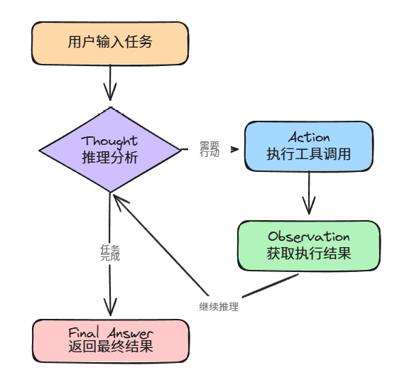
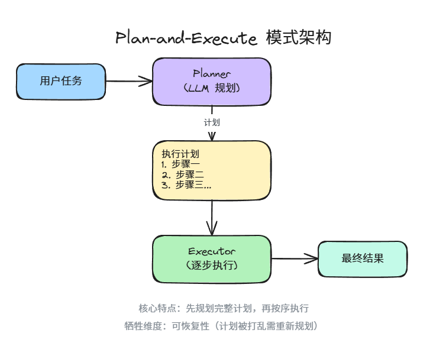
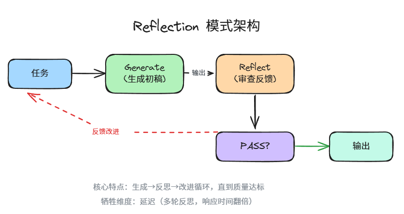
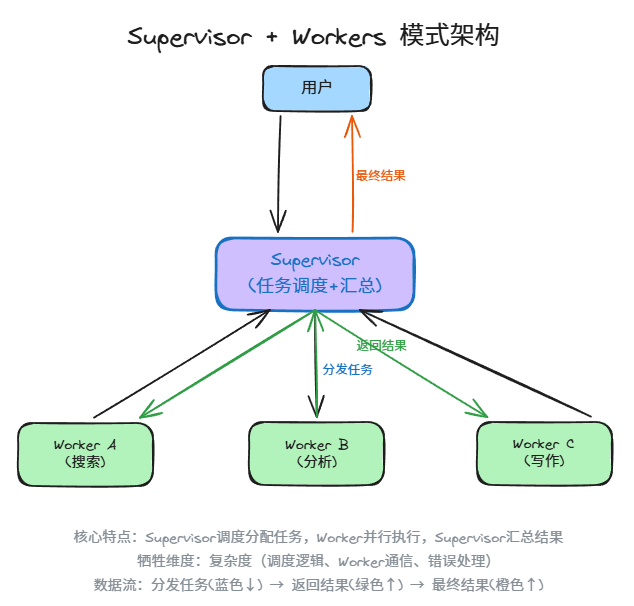
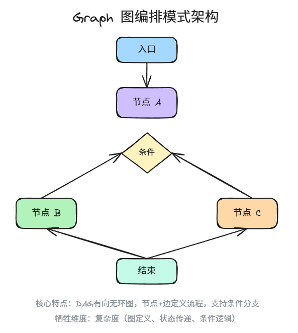
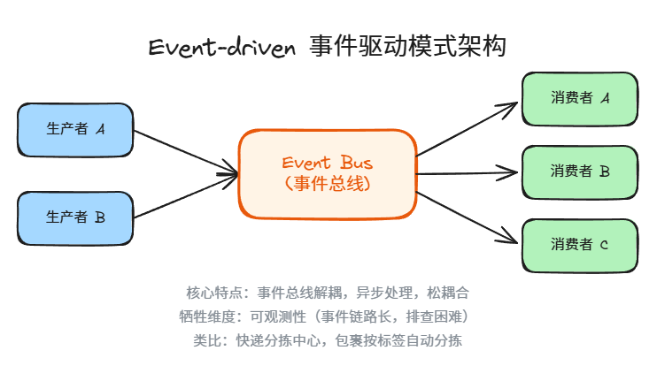
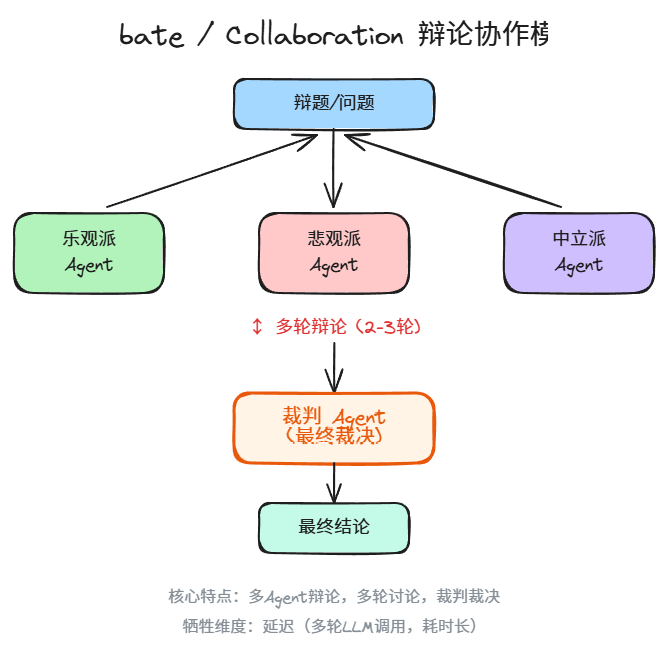
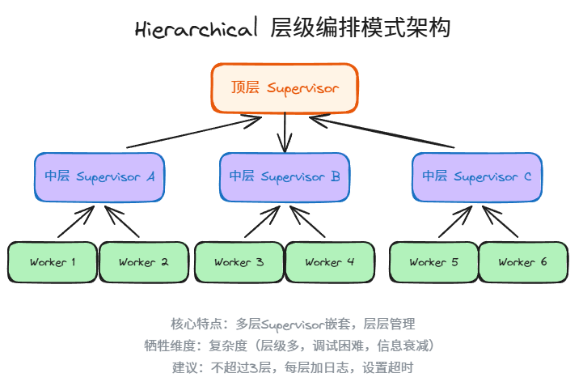
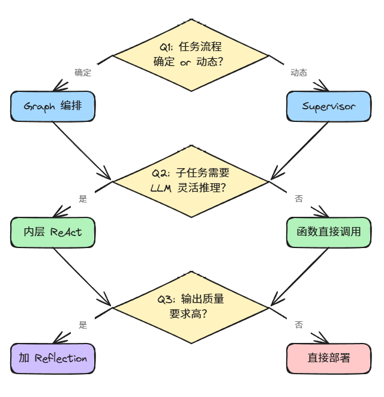

# 2026年Agent架构选型：8种模式的组合与取舍

> Agent 系列 · 第 1 篇 | 从"Agent是什么"到"我的Agent该用什么架构"

---

本文梳理了 2026 年主流的 8 种 Agent 架构模式，用一套四维评估框架（延迟、可恢复性、可观测性、复杂度）逐一对比，附 3 个真实场景的代码实现和面试高频题。

核心观点：**没有最好的架构，只有最合适的架构。每种模式强化 2-3 个维度，必然牺牲 1 个。**

---

## 一、Agent 架构的四维评估框架

| 维度 | 英文 | 一句话解释 | 直觉类比 |
|------|------|------------|----------|
| 延迟 | Latency | 用户等多久才能拿到结果 | 外卖从下单到送达的时间 |
| 可恢复性 | Recovery | 中途崩了，能不能从断点继续 | 游戏的自动存档功能 |
| 可观测性 | Observability | 出了问题能不能追溯到哪一步出的错 | 汽车的行车记录仪 |
| 复杂度 | Complexity | 开发、调试、维护的成本 | 家具是宜家组装还是需要定制 |

**核心洞察：每种架构模式在四个维度中，选择强化其中 2-3 个，必然牺牲至少 1 个。** 这不是设计缺陷，这是工程本质——你不可能又快又好还简单。

用一张表概括：

| 模式 | 延迟 | 可恢复性 | 可观测性 | 复杂度 | 牺牲的维度 |
|------|:----:|:--------:|:--------:|:------:|:----------:|
| ReAct | ⚠️ | ✅ | ✅ | ✅ | 延迟 |
| Plan-and-Execute | ✅ | ⚠️ | ✅ | ✅ | 可恢复性 |
| Reflection | ⚠️ | ✅ | ✅ | ✅ | 延迟 |
| Supervisor + Workers | ✅ | ✅ | ✅ | ⚠️ | 复杂度 |
| Graph | ✅ | ✅ | ✅ | ⚠️ | 复杂度 |
| Event-driven | ✅ | ✅ | ⚠️ | ✅ | 可观测性 |
| Debate / Collaboration | ⚠️ | ✅ | ✅ | ✅ | 延迟 |
| Hierarchical | ✅ | ✅ | ✅ | ⚠️ | 复杂度 |

> ✅ = 该模式在此维度表现良好 | ⚠️ = 该模式在此维度有明显短板

记住这个表，后面拆解每种模式的时候，我们都会回来对照。

---

## 二、8 种经典模式逐一拆解

下面每一种模式，我都会给出：一句话定义、适用场景、牺牲维度、代码示例、真实场景、面试问法。直接开始。

### 模式 1：ReAct（推理-行动循环）

**一句话定义：** 想一步做一步，推理（Reasoning）和行动（Action）交替进行，直到任务完成。



> ▲ ReAct 模式循环流程：① Thought 推理分析 → ② Action 执行工具 → ③ Observation 获取结果 → 回到 Thought 继续推理，直到生成 Final Answerw

**适用场景：** 通用 Agent，任务步骤不超过 30 步，需要根据中间结果动态调整策略。

**牺牲维度：** 延迟——每一步都要等 LLM 思考，串行执行，步骤多了就慢。

**类比：** 像你做饭的时候边尝边调味，不是提前把菜谱写好。

```python
# ReAct 模式核心循环（纯 Python 实现）
import openai

client = openai.OpenAI()

def react_agent(task: str, tools: dict, max_steps: int = 10) -> str:
    """ReAct 模式：推理-行动交替循环"""
    messages = [
        {"role": "system", "content": (
            "你是一个ReAct Agent。每次回复先写Thought（推理），"
            "再写Action（调用工具）或Final Answer（最终答案）。"
            "格式：\nThought: ...\nAction: tool_name(args)\n"
            "或\nThought: ...\nFinal Answer: ..."
        )},
        {"role": "user", "content": task}
    ]
    
    for step in range(max_steps):
        response = client.chat.completions.create(
            model="gpt-4o",
            messages=messages,
            temperature=0
        )
        reply = response.choices[0].message.content
        print(f"[Step {step + 1}] {reply}\n")
        
        if "Final Answer:" in reply:
            return reply.split("Final Answer:")[-1].strip()
        
        # 解析 Action 并执行
        if "Action:" in reply:
            action_line = [l for l in reply.split("\n") if l.startswith("Action:")][0]
            tool_call = action_line.replace("Action:", "").strip()
            tool_name, args = tool_call.split("(", 1)
            args = args.rstrip(")")
            
            # 执行工具
            result = tools[tool_name.strip()](args.strip().strip('"'))
            messages.append({"role": "assistant", "content": reply})
            messages.append({"role": "user", "content": f"Observation: {result}"})
    
    return "达到最大步数，任务未完成"

# 示例工具
tools = {
    "search": lambda q: f"搜索结果：{q}的相关信息...",
    "calculate": lambda expr: str(eval(expr)),
}

# 使用
result = react_agent("帮我算一下 (15 * 23) + 47 等于多少", tools)
```

**真实场景：** 你做一个信息查询助手，用户问"帮我查一下北京明天天气，如果要下雨就推荐室内活动"。Agent 需要先查天气，然后根据结果决定下一步——这种"走着看"的逻辑，就是 ReAct 的主场。

**面试问法：** "ReAct 模式的核心思路是什么？它跟直接 Chain-of-Thought 有什么区别？"

---

### 模式 2：Plan-and-Execute（先规划后执行）

**一句话定义：** 先让 LLM 制定完整计划，然后按计划逐步执行，执行过程中不再重新规划。



> ▲ Plan-and-Execute 模式架构：① 用户任务输入 → ② Planner(LLM规划)生成执行计划 → ③ Executor逐步执行 → ④ 输出最终结果

**适用场景：** 复杂多步任务，步骤之间有依赖关系，需要全局视角。

**牺牲维度：** 可恢复性——计划被打乱后，很难从中间恢复，往往需要重新规划。

**类比：** 像装修房子先出设计图，再按图施工。但如果施工到一半发现承重墙不能拆，设计图就得重画。

```python
# Plan-and-Execute 模式（LangGraph 风格）
from typing import TypedDict, List
from langgraph.graph import StateGraph, END

class PlanState(TypedDict):
    task: str
    plan: List[str]
    current_step: int
    results: List[str]
    final_answer: str

def planner(state: PlanState) -> PlanState:
    """规划阶段：LLM 生成完整计划"""
    import openai
    client = openai.OpenAI()
    
    response = client.chat.completions.create(
        model="gpt-4o",
        messages=[{
            "role": "user",
            "content": (
                f"任务：{state['task']}\n"
                "请将任务拆解为有序步骤，每行一个步骤，格式：\n"
                "1. 步骤描述\n2. 步骤描述\n..."
            )
        }],
        temperature=0
    )
    
    plan_text = response.choices[0].message.content
    steps = [line.split(". ", 1)[1] for line in plan_text.strip().split("\n") if ". " in line]
    
    return {**state, "plan": steps, "current_step": 0, "results": []}

def executor(state: PlanState) -> PlanState:
    """执行阶段：逐步执行计划"""
    import openai
    client = openai.OpenAI()
    
    step = state["plan"][state["current_step"]]
    context = "\n".join([f"步骤{i+1}结果: {r}" for i, r in enumerate(state["results"])])
    
    response = client.chat.completions.create(
        model="gpt-4o",
        messages=[{
            "role": "user",
            "content": f"请执行以下步骤：{step}\n\n已完成的上下文：\n{context}"
        }],
        temperature=0
    )
    
    result = response.choices[0].message.content
    new_results = state["results"] + [result]
    new_step = state["current_step"] + 1
    
    return {**state, "results": new_results, "current_step": new_step}

def should_continue(state: PlanState) -> str:
    if state["current_step"] >= len(state["plan"]):
        return "finalize"
    return "executor"

def finalize(state: PlanState) -> PlanState:
    summary = "\n".join([f"- {r}" for r in state["results"]])
    return {**state, "final_answer": f"任务完成，各步骤结果：\n{summary}"}

# 构建图
graph = StateGraph(PlanState)
graph.add_node("planner", planner)
graph.add_node("executor", executor)
graph.add_node("finalize", finalize)

graph.set_entry_point("planner")
graph.add_edge("planner", "executor")
graph.add_conditional_edges("executor", should_continue, {
    "executor": "executor",
    "finalize": "finalize"
})
graph.add_edge("finalize", END)

app = graph.compile()
result = app.invoke({"task": "帮我写一篇关于远程办公利弊的分析报告", "plan": [], "current_step": 0, "results": [], "final_answer": ""})
```

**真实场景：** 自动化报告生成——用户说"帮我分析上季度的销售数据，出一份 PPT"。Agent 先规划"1. 读取数据 2. 清洗 3. 统计 4. 生成图表 5. 输出 PPT"，然后按序执行。步骤之间有强依赖，必须先有数据才能画图。

**面试问法：** "Plan-and-Execute 的最大风险是什么？怎么缓解？"（答：计划不可变导致执行失败，缓解方案是加入 Re-planner 节点）

---

### 模式 3：Reflection（反思）

**一句话定义：** 执行完成后，用另一个 LLM 调用（或同一个）对输出进行审查和改进。



> ▲ Reflection 模式架构：① 任务输入 → ② Generate生成初稿 → ③ Reflect审查反馈 → ④ 判断PASS?未通过则反馈改进循环 → ⑤ 通过则输出

**适用场景：** 输出质量要求高，比如代码生成、文案写作、翻译润色。

**牺牲维度：** 延迟——多了一轮甚至多轮反思，响应时间翻倍。

**类比：** 写完作文后再检查一遍，改掉错别字和不通顺的句子。

```python
# Reflection 模式
import openai

client = openai.OpenAI()

def generate(task: str, feedback: str = "") -> str:
    """生成阶段"""
    messages = [{"role": "user", "content": task}]
    if feedback:
        messages.append({"role": "user", "content": f"之前的反馈：{feedback}\n请改进。"})
    
    response = client.chat.completions.create(
        model="gpt-4o", messages=messages, temperature=0.7
    )
    return response.choices[0].message.content

def reflect(task: str, output: str) -> str:
    """反思阶段：评估输出质量并给出改进建议"""
    response = client.chat.completions.create(
        model="gpt-4o",
        messages=[{
            "role": "user",
            "content": (
                f"原始任务：{task}\n\n"
                f"当前输出：{output}\n\n"
                "请评估这个输出的质量，指出问题并给出具体改进建议。"
                "如果质量已经很好，回复 PASS。"
            )
        }],
        temperature=0
    )
    return response.choices[0].message.content

def reflection_agent(task: str, max_rounds: int = 3) -> str:
    """Reflection Agent：生成 -> 反思 -> 改进循环"""
    output = generate(task)
    print(f"[Round 0] 生成完成，长度: {len(output)}")
    
    for i in range(max_rounds):
        feedback = reflect(task, output)
        print(f"[Round {i + 1}] 反思结果: {feedback[:100]}...")
        
        if "PASS" in feedback:
            print("反思通过，返回结果")
            return output
        
        output = generate(task, feedback)
        print(f"[Round {i + 1}] 改进完成，长度: {len(output)}")
    
    return output

# 使用
result = reflection_agent("写一段介绍 Python 装饰器的技术文档，200字以内")
```

**真实场景：** 代码生成 Agent。你让 Agent 写一个排序算法，先生成一版，然后反思节点检查"有没有边界情况没处理""时间复杂度对不对""变量命名是否规范"，发现问题后要求重新生成。这就是为什么很多代码生成工具的输出质量越来越好——它们在背后做了 Reflection。

**面试问法：** "Reflection 和简单的多次调用有什么区别？"（答：Reflection 有明确的评估标准和反馈机制，不是盲目重试，而是有针对性地改进）

---

### 模式 4：Supervisor + Workers（主管 + 工人）

**一句话定义：** 一个 Supervisor Agent 负责理解任务、分配子任务给多个 Worker Agent，每个 Worker 专注自己的领域。



> ▲ Supervisor + Workers 模式架构：① 用户任务输入 → ② Supervisor调度分配任务→ ③ Worker A/B/C并行执行 → ④ Worker返回结果 → ⑤ Supervisor汇总输出最终结果

**适用场景：** 任务可以拆分成独立子任务，需要并行处理，不同子任务需要不同工具或能力。

**牺牲维度：** 复杂度——多了一层调度逻辑，Worker 之间的通信、错误处理、结果聚合都增加了开发成本。

**类比：** 项目经理不写代码，但他知道谁该干什么，最后把大家的产出整合起来。

```python
# Supervisor + Workers 模式
import openai
from typing import Callable

client = openai.OpenAI()

class Worker:
    def __init__(self, name: str, description: str, handler: Callable):
        self.name = name
        self.description = description
        self.handler = handler

def supervisor(task: str, workers: list[Worker]) -> str:
    """Supervisor：决定用哪个 Worker，分配任务"""
    worker_desc = "\n".join([f"- {w.name}: {w.description}" for w in workers])
    
    # 第一步：Supervisor 决定分工
    response = client.chat.completions.create(
        model="gpt-4o",
        messages=[{
            "role": "user",
            "content": (
                f"任务：{task}\n\n"
                f"可用的 Worker：\n{worker_desc}\n\n"
                "请以 JSON 格式输出任务分配，格式：\n"
                '{"worker_name": "子任务描述", ...}'
            )
        }],
        response_format={"type": "json_object"},
        temperature=0
    )
    
    import json
    assignments = json.loads(response.choices[0].message.content)
    print(f"[Supervisor] 分配方案：{assignments}")
    
    # 第二步：并行执行各 Worker（简化为串行）
    worker_map = {w.name: w for w in workers}
    results = {}
    for worker_name, subtask in assignments.items():
        if worker_name in worker_map:
            print(f"[Worker: {worker_name}] 执行: {subtask}")
            results[worker_name] = worker_map[worker_name].handler(subtask)
    
    # 第三步：Supervisor 汇总结果
    summary_input = "\n".join([f"{k}: {v}" for k, v in results.items()])
    response = client.chat.completions.create(
        model="gpt-4o",
        messages=[{
            "role": "user",
            "content": f"原始任务：{task}\n\n各 Worker 结果：\n{summary_input}\n\n请汇总为最终答案。"
        }],
        temperature=0
    )
    return response.choices[0].message.content

# 定义 Workers
workers = [
    Worker("searcher", "负责搜索和信息检索", 
           lambda q: f"关于'{q}'的搜索结果：相关信息摘要..."),
    Worker("analyst", "负责数据分析和统计",
           lambda q: f"分析结果：{q}的关键指标为 42..."),
    Worker("writer", "负责文字撰写和润色",
           lambda q: f"基于'{q}'撰写的文段..."),
]

result = supervisor("分析特斯拉最近一个季度的财报亮点", workers)
print(f"\n[最终结果] {result}")
```

**真实场景：** 多功能助手。用户问"帮我查一下竞品最近的产品更新，分析一下对我们有什么影响，然后写一封邮件发给老板"。Supervisor 把任务拆给 searcher（搜索）、analyst（分析）、writer（写邮件），最后汇总。

**面试问法：** "Supervisor 模式怎么处理 Worker 失败的情况？"（答：Supervisor 需要有重试逻辑、fallback Worker，以及超时机制）

---

### 模式 5：Graph（图编排）

**一句话定义：** 用有向无环图（DAG）定义工作流，每个节点是一个处理步骤，边定义执行顺序和条件分支。



> ▲ Graph 图编排模式架构：① 入口节点 → ② 节点A处理 → ③ 条件判断分支 → ④ 节点B或节点C执行 → ⑤ 汇聚到结束

**适用场景：** 流程确定、需要可视化、需要严格控制执行路径的场景。

**牺牲维度：** 复杂度——图的定义、节点之间的状态传递、条件分支的逻辑，开发成本较高。

**类比：** 地铁线路图。每站是一个节点，换乘是分支，从 A 到 B 的路线是确定的。

```python
# Graph 编排模式（LangGraph 实现）
from typing import TypedDict, Literal
from langgraph.graph import StateGraph, END

class WorkflowState(TypedDict):
    input: str
    category: str
    processed: str
    output: str

def classifier(state: WorkflowState) -> WorkflowState:
    """分类节点"""
    text = state["input"]
    if any(w in text for w in ["bug", "报错", "崩溃"]):
        category = "bug"
    elif any(w in text for w in ["功能", "需求", "希望"]):
        category = "feature"
    else:
        category = "general"
    return {**state, "category": category}

def route(state: WorkflowState) -> Literal["bug_handler", "feature_handler", "general_handler"]:
    """条件路由"""
    return f"{state['category']}_handler"

def bug_handler(state: WorkflowState) -> WorkflowState:
    return {**state, "processed": f"[Bug处理] 已记录：{state['input']}", "output": "已创建Bug工单"}

def feature_handler(state: WorkflowState) -> WorkflowState:
    return {**state, "processed": f"[需求处理] 已记录：{state['input']}", "output": "已提交需求评审"}

def general_handler(state: WorkflowState) -> WorkflowState:
    return {**state, "processed": f"[通用处理] 已回复：{state['input']}", "output": "已自动回复"}

# 构建 Graph
graph = StateGraph(WorkflowState)
graph.add_node("classifier", classifier)
graph.add_node("bug_handler", bug_handler)
graph.add_node("feature_handler", feature_handler)
graph.add_node("general_handler", general_handler)

graph.set_entry_point("classifier")
graph.add_conditional_edges("classifier", route, {
    "bug_handler": "bug_handler",
    "feature_handler": "feature_handler",
    "general_handler": "general_handler",
})
graph.add_edge("bug_handler", END)
graph.add_edge("feature_handler", END)
graph.add_edge("general_handler", END)

app = graph.compile()

# 使用
result = app.invoke({"input": "登录页面报错 500", "category": "", "processed": "", "output": ""})
print(result["output"])  # 已创建Bug工单
```

**真实场景：** 客服工单处理系统。一条工单进来，先分类（技术问题 / 功能需求 / 一般咨询），然后路由到不同的处理流程。这种确定性流程用 Graph 最合适——你能画出来、能 debug、能在监控面板上看到每一步。

**面试问法：** "Graph 和 State Machine 有什么区别？什么时候用 Graph？"（答：Graph 更强调数据流，State Machine 更强调状态转换；Graph 适合数据处理管道，State Machine 适合业务状态管理）

---

### 模式 6：Event-driven（事件驱动）

**一句话定义：** Agent 通过事件总线接收和发送消息，异步响应，松耦合。



> ▲ Event-driven 事件驱动模式架构：① 生产者A/B发送事件 → ② Event Bus事件总线接收 → ③ 消费者A/B/C异步处理

**适用场景：** 高吞吐实时场景，多系统集成，需要水平扩展。

**牺牲维度：** 可观测性——事件在系统间流转，出了问题要追踪一串事件，排查链路很长。

**类比：** 快递分拣中心。包裹（事件）进来，根据标签自动分拣到不同的传送带（处理器），每个环节独立运作。

```python
# Event-driven 模式（简化实现）
import asyncio
from typing import Callable, Any
from dataclasses import dataclass, field
from collections import defaultdict

@dataclass
class Event:
    type: str
    payload: dict
    source: str = ""

class EventBus:
    def __init__(self):
        self._handlers: dict[str, list[Callable]] = defaultdict(list)
        self._history: list[Event] = []
    
    def on(self, event_type: str, handler: Callable):
        self._handlers[event_type].append(handler)
    
    async def emit(self, event: Event):
        self._history.append(event)
        print(f"[EventBus] 发出事件: {event.type} from {event.source}")
        for handler in self._handlers.get(event.type, []):
            await handler(event)
    
    def get_history(self) -> list[Event]:
        return self._history

# 使用示例
bus = EventBus()

async def order_handler(event: Event):
    print(f"  [OrderHandler] 收到订单: {event.payload}")
    await bus.emit(Event(type="payment.requested", payload=event.payload, source="order"))

async def payment_handler(event: Event):
    print(f"  [PaymentHandler] 处理支付: {event.payload}")
    await bus.emit(Event(type="inventory.update", payload={"item": event.payload.get("item")}, source="payment"))

async def inventory_handler(event: Event):
    print(f"  [InventoryHandler] 更新库存: {event.payload}")

# 注册处理器
bus.on("order.created", order_handler)
bus.on("payment.requested", payment_handler)
bus.on("inventory.update", inventory_handler)

# 触发事件链
asyncio.run(bus.emit(Event(type="order.created", payload={"item": "iPhone", "qty": 1})))

# 追踪事件链
for event in bus.get_history():
    print(f"  历史事件: {event.type} <- {event.source}")
```

**真实场景：** 电商平台的订单处理。用户下单后，触发一系列异步事件：扣库存、发支付请求、通知物流、发送确认邮件。每个环节独立处理，互不阻塞。如果支付失败，发一个 `payment.failed` 事件，触发退款流程。

**面试问法：** "Event-driven 架构的可观测性怎么保证？"（答：给每个事件加 trace_id，用分布式追踪系统如 Jaeger，建事件溯源 Event Sourcing）

---

### 模式 7：Debate / Collaboration（辩论协作）

**一句话定义：** 多个 Agent 对同一问题给出不同观点，通过辩论或投票达成共识。



> ▲ Debate 辩论协作模式架构：① 辩题输入 → ② 乐观派/悲观派/中立派Agent多轮辩论 → ③ 裁判Agent最终裁决 → ④ 输出结论

**适用场景：** 需要高置信度决策的场景，比如风险评估、方案评审、事实核查。

**牺牲维度：** 延迟——多个 Agent 要来回讨论好几轮，每轮都是 LLM 调用。

**类比：** 公司的委员会决策。一个人说了不算，得大家讨论，最后投票表决。

```python
# Debate / Collaboration 模式
import openai

client = openai.OpenAI()

def debater(name: str, persona: str, topic: str, other_opinions: str = "") -> str:
    """单个辩论者发言"""
    context = f"其他人的观点：\n{other_opinions}" if other_opinions else "你是第一个发言的。"
    
    response = client.chat.completions.create(
        model="gpt-4o",
        messages=[{
            "role": "user",
            "content": (
                f"你是{name}，{persona}\n\n"
                f"辩题：{topic}\n\n{context}\n\n"
                "请给出你的立场和论据（100字以内）。"
            )
        }],
        temperature=0.7
    )
    return response.choices[0].message.content

def debate(topic: str, rounds: int = 2) -> str:
    """多轮辩论"""
    personas = [
        ("乐观派", "你倾向于看到积极面，支持创新和尝试"),
        ("悲观派", "你倾向于看到风险，强调谨慎和稳妥"),
        ("中立派", "你客观分析利弊，追求平衡"),
    ]
    
    all_opinions = []
    
    for round_num in range(rounds):
        print(f"\n=== 第 {round_num + 1} 轮辩论 ===")
        round_opinions = []
        for name, persona in personas:
            opinion = debater(name, persona, topic, "\n".join(all_opinions))
            round_opinions.append(f"[{name}] {opinion}")
            print(f"  {round_opinions[-1]}")
        all_opinions.extend(round_opinions)
    
    # 最终裁决
    response = client.chat.completions.create(
        model="gpt-4o",
        messages=[{
            "role": "user",
            "content": (
                f"辩题：{topic}\n\n各方观点：\n" + "\n".join(all_opinions) +
                "\n\n请综合各方观点，给出最终结论和建议。"
            )
        }],
        temperature=0
    )
    return response.choices[0].message.content

# 使用
result = debate("我们的创业公司应该现在就做 AI Agent 产品，还是再等半年？")
print(f"\n[最终裁决] {result}")
```

**真实场景：** 投资决策 Agent。一个 Agent 看多，一个 Agent 看空，一个 Agent 中立分析，经过几轮辩论后由裁判 Agent 做最终判断。比单一 Agent 直接给答案靠谱得多——就像人类做重大决策也会找不同意见的人聊聊。

**面试问法：** "Debate 模式怎么避免陷入无限争论？"（答：设定最大轮数，裁判 Agent 有权直接裁决，当观点趋同时提前结束）

---

### 模式 8：Hierarchical（层级编排）

**一句话定义：** 多层 Supervisor 嵌套，顶层 Supervisor 管理中层 Supervisor，中层再管底层 Worker。



> ▲ Hierarchical 层级编排模式架构：① 顶层Supervisor → ② 中层Supervisor A/B/C → ③ 底层Worker 1-6执行

**适用场景：** 大型复杂系统，子系统之间有交互但又相对独立。

**牺牲维度：** 复杂度——层级多了，调试就是噩梦。传错一个参数，得从顶层一层层往下找。

**类比：** 大公司的组织架构。CEO 管 VP，VP 管总监，总监管一线员工。效率高，但开个会得层层传达。

```python
# Hierarchical 模式
import openai

client = openai.OpenAI()

class Agent:
    def __init__(self, name: str, role: str, children: list = None):
        self.name = name
        self.role = role
        self.children = children or []
    
    def execute(self, task: str, depth: int = 0) -> str:
        indent = "  " * depth
        print(f"{indent}[{self.name}] 收到任务: {task}")
        
        if not self.children:
            # 叶子节点：直接执行
            response = client.chat.completions.create(
                model="gpt-4o",
                messages=[{
                    "role": "user",
                    "content": f"你的角色是{self.role}。请完成以下任务：{task}"
                }],
                temperature=0
            )
            result = response.choices[0].message.content
            print(f"{indent}[{self.name}] 完成")
            return result
        
        # 非叶子节点：拆分任务分配给子节点
        subtasks = self._decompose(task)
        results = []
        for child, subtask in zip(self.children, subtasks):
            result = child.execute(subtask, depth + 1)
            results.append(f"{child.name}: {result}")
        
        return self._aggregate(task, results)
    
    def _decompose(self, task: str) -> list[str]:
        child_desc = "\n".join([f"- {c.name}({c.role})" for c in self.children])
        response = client.chat.completions.create(
            model="gpt-4o",
            messages=[{
                "role": "user",
                "content": (
                    f"任务：{task}\n\n可用的下属：\n{child_desc}\n\n"
                    "请为每个下属分配一个子任务，按顺序每行一个。"
                )
            }],
            temperature=0
        )
        lines = response.choices[0].message.content.strip().split("\n")
        return [l.split(": ", 1)[-1] if ": " in l else l for l in lines]
    
    def _aggregate(self, task: str, results: list[str]) -> str:
        response = client.chat.completions.create(
            model="gpt-4o",
            messages=[{
                "role": "user",
                "content": f"原始任务：{task}\n\n下属结果：\n" + "\n".join(results) + "\n\n请汇总。"
            }],
            temperature=0
        )
        return response.choices[0].message.content

# 构建层级
leaf_a = Agent("数据工程师", "数据采集和清洗")
leaf_b = Agent("分析师", "数据分析")
leaf_c = Agent("前端工程师", "可视化开发")
leaf_d = Agent("文案", "报告撰写")

mid_a = Agent("数据组长", "数据团队管理", [leaf_a, leaf_b])
mid_b = Agent("产品组长", "产品团队管理", [leaf_c, leaf_d])

ceo = Agent("项目总监", "项目管理", [mid_a, mid_b])

result = ceo.execute("分析用户行为数据并生成可视化报告")
print(f"\n[最终结果] {result}")
```

**真实场景：** 企业级 AI 平台。顶层是项目管理 Agent，下分数据组、算法组、前端组，每组有自己的 Agent 主管，再往下是具体的执行 Agent。适合那种"一个项目分 N 个团队"的场景。

**面试问法：** "层级多了会有什么问题？怎么控制？"（答：信息衰减、延迟累积、调试困难；控制方法：限制层数（建议不超过 3 层）、每一层加日志、设置超时）

---

## 三、2026 年的主流组合模式

实际工程中，很少有人只用单一模式。2026 年最主流的组合方式是：

**外层：Graph 或 Supervisor | 内层：ReAct**

为什么？因为外层负责"编排"——决定任务怎么拆、谁来干、按什么顺序干；内层负责"执行"——每个具体子任务怎么一步步完成。职责分离，各取所长。

| 组合方式 | 适用场景 | 优势 | 劣势 |
|----------|----------|------|------|
| Graph + ReAct | 流程确定的多步骤任务 | 流程可控，执行灵活 | 图定义复杂 |
| Supervisor + ReAct | 动态分配的多任务 | 灵活调度，Worker 自主 | 调度开销 |
| Graph + Reflection | 质量敏感的流程 | 流程清晰，质量保证 | 延迟高 |
| Supervisor + Plan-Execute | 复杂项目管理 | 全局规划，分工明确 | 可恢复性差 |
| Hierarchical + ReAct | 大型系统 | 组织清晰，可扩展 | 开发成本极高 |

**选型决策逻辑：**



> ▲ Agent 架构选型决策流程：① 判断任务流程确定/动态 → ② 判断子任务是否需要 LLM 推理 → ③ 判断输出质量要求

1. 你的任务流程是确定的还是动态的？
   - 确定 → 考虑 Graph
   - 动态 → 考虑 Supervisor
2. 子任务需要 LLM 灵活推理吗？
   - 是 → 内层用 ReAct
   - 否 → 内层直接用函数调用
3. 输出质量要求高吗？
   - 是 → 加 Reflection 层
   - 否 → 不加
4. 系统规模大吗（>5 个子系统）？
   - 是 → 考虑 Hierarchical
   - 否 → 一层 Supervisor 够了

---

## 四、选型实战：3 个真实场景

### 场景 A：客服 Agent → Supervisor + ReAct

```python
# 客服 Agent：Supervisor 调度 + ReAct 执行
import openai

client = openai.OpenAI()

def react_executor(task: str, tools: dict) -> str:
    """ReAct 执行器：用于每个子任务的具体执行"""
    messages = [
        {"role": "system", "content": "你是客服执行Agent，用ReAct模式完成任务。格式：Thought/Action/Final Answer"},
        {"role": "user", "content": task}
    ]
    
    tool_desc = "\n".join([f"- {name}: {desc}" for name, (desc, _) in tools.items()])
    messages[0]["content"] += f"\n可用工具：\n{tool_desc}"
    
    for _ in range(5):
        response = client.chat.completions.create(model="gpt-4o", messages=messages, temperature=0)
        reply = response.choices[0].message.content
        
        if "Final Answer:" in reply:
            return reply.split("Final Answer:")[-1].strip()
        
        # 简化：直接返回
        return reply
    return "无法完成任务"

# 客服 Supervisor
def customer_service_supervisor(user_message: str) -> str:
    tools = {
        "query_order": ("查询订单状态", lambda oid: f"订单{oid}：已发货"),
        "refund": ("申请退款", lambda oid: f"订单{oid}退款已提交"),
        "faq": ("查询FAQ", lambda q: f"FAQ结果：{q}的标准回复..."),
    }
    
    # Supervisor 判断意图并调度
    response = client.chat.completions.create(
        model="gpt-4o",
        messages=[{
            "role": "user",
            "content": (
                f"用户消息：{user_message}\n\n"
                "请判断用户意图并生成子任务，输出JSON：\n"
                '{"intent": "...", "subtask": "..."}'
            )
        }],
        response_format={"type": "json_object"},
        temperature=0
    )
    
    import json
    decision = json.loads(response.choices[0].message.content)
    print(f"[Supervisor] 意图：{decision['intent']}，子任务：{decision['subtask']}")
    
    return react_executor(decision["subtask"], tools)

# 测试
result = customer_service_supervisor("我的订单 ORD-12345 三天了还没发货，我要退款")
print(f"回复：{result}")
```

**选型理由：** 客服场景意图多样（查订单、退款、咨询），适合 Supervisor 先分类再调度；每个子任务需要灵活调用工具，适合 ReAct。

### 场景 B：数据分析 Agent → Plan-and-Execute + ReAct

```python
# 数据分析 Agent：Plan-and-Execute 规划 + ReAct 执行每步
import openai

client = openai.OpenAI()

def data_analysis_agent(analysis_request: str) -> str:
    # 第一步：规划
    plan_response = client.chat.completions.create(
        model="gpt-4o",
        messages=[{
            "role": "user",
            "content": (
                f"数据分析请求：{analysis_request}\n\n"
                "请制定分析计划，输出步骤列表（JSON数组）。"
                "示例：[\"加载数据\", \"数据清洗\", \"描述性统计\", \"趋势分析\", \"生成报告\"]"
            )
        }],
        response_format={"type": "json_object"},
        temperature=0
    )
    
    import json
    plan = json.loads(plan_response.choices[0].message.content)
    if isinstance(plan, dict):
        plan = list(plan.values())[0]
    print(f"[Plan] 分析计划：{plan}")
    
    # 第二步：逐步执行（每步用 ReAct 风格）
    context = ""
    for i, step in enumerate(plan):
        print(f"[Execute] Step {i+1}: {step}")
        response = client.chat.completions.create(
            model="gpt-4o",
            messages=[{
                "role": "user",
                "content": (
                    f"当前步骤：{step}\n"
                    f"之前的分析结果：{context}\n\n"
                    "请执行这个分析步骤，给出结果。"
                )
            }],
            temperature=0
        )
        context += f"\n{step}: {response.choices[0].message.content}"
    
    return context

result = data_analysis_agent("分析过去6个月的用户留存率变化趋势")
print(f"\n[最终报告] {result}")
```

**选型理由：** 数据分析有明确步骤（加载→清洗→统计→可视化），适合 Plan-and-Execute 做全局规划；每步执行需要根据前一步结果灵活调整，用 ReAct 风格。

### 场景 C：代码审查 Agent → Graph + Reflection

```python
# 代码审查 Agent：Graph 流程 + Reflection 质量保证
from typing import TypedDict
from langgraph.graph import StateGraph, END
import openai

client = openai.OpenAI()

class ReviewState(TypedDict):
    code: str
    style_issues: str
    logic_issues: str
    security_issues: str
    final_report: str

def style_check(state: ReviewState) -> ReviewState:
    response = client.chat.completions.create(
        model="gpt-4o",
        messages=[{
            "role": "user",
            "content": f"检查以下代码的风格问题（命名、格式、注释）：\n```python\n{state['code']}```"
        }], temperature=0
    )
    return {**state, "style_issues": response.choices[0].message.content}

def logic_check(state: ReviewState) -> ReviewState:
    response = client.chat.completions.create(
        model="gpt-4o",
        messages=[{
            "role": "user",
            "content": f"检查以下代码的逻辑问题（bug、边界、性能）：\n```python\n{state['code']}```"
        }], temperature=0
    )
    return {**state, "logic_issues": response.choices[0].message.content}

def security_check(state: ReviewState) -> ReviewState:
    response = client.chat.completions.create(
        model="gpt-4o",
        messages=[{
            "role": "user",
            "content": f"检查以下代码的安全问题（注入、泄露、权限）：\n```python\n{state['code']}```"
        }], temperature=0
    )
    return {**state, "security_issues": response.choices[0].message.content}

def reflect_and_report(state: ReviewState) -> ReviewState:
    """Reflection：汇总并审查报告质量"""
    response = client.chat.completions.create(
        model="gpt-4o",
        messages=[{
            "role": "user",
            "content": (
                f"代码风格问题：{state['style_issues']}\n\n"
                f"逻辑问题：{state['logic_issues']}\n\n"
                f"安全问题：{state['security_issues']}\n\n"
                "请综合以上检查结果，生成一份结构化的代码审查报告。"
                "要求：按严重程度排序，给出具体修复建议。"
            )
        }], temperature=0
    )
    return {**state, "final_report": response.choices[0].message.content}

# 构建 Graph
graph = StateGraph(ReviewState)
graph.add_node("style_check", style_check)
graph.add_node("logic_check", logic_check)
graph.add_node("security_check", security_check)
graph.add_node("report", reflect_and_report)

graph.set_entry_point("style_check")
graph.add_edge("style_check", "logic_check")
graph.add_edge("logic_check", "security_check")
graph.add_edge("security_check", "report")
graph.add_edge("report", END)

app = graph.compile()

# 使用
code_sample = '''
def get_user(user_id):
    query = f"SELECT * FROM users WHERE id = {user_id}"
    return db.execute(query)
'''
result = app.invoke({"code": code_sample, "style_issues": "", "logic_issues": "", "security_issues": "", "final_report": ""})
print(result["final_report"])
```

**选型理由：** 代码审查流程固定（风格→逻辑→安全→汇总），适合 Graph；最终报告需要质量保证，用 Reflection 做最后一轮审查。

---

## 五、面试高频题

以下是 2026 年 Agent 架构方向面试中出现频率最高的问题，附标准回答。

**Q1：ReAct 和 Plan-and-Execute 有什么区别？什么时候用哪个？**

> ReAct 是边想边做，每一步根据当前观察决定下一步；Plan-and-Execute 是先想全再动手，制定完整计划后按序执行。
> 用 ReAct 的场景：步骤少（<30）、需要灵活应变、不确定性高。
> 用 Plan-and-Execute 的场景：步骤多、步骤间有依赖、需要全局优化。
> 最大区别：ReAct 的优势是灵活，劣势是效率低；Plan-and-Execute 的优势是全局视角，劣势是计划一旦出错就全盘崩。

**Q2：多 Agent 编排怎么做？有哪些模式？**

> 主流有三种编排方式：
> 1. Supervisor 模式：一个主 Agent 调度多个 Worker，适合任务可拆分的场景
> 2. Graph 模式：用 DAG 定义执行流程，适合流程确定的场景
> 3. Hierarchical 模式：多层 Supervisor 嵌套，适合大型系统
> 核心问题是：任务怎么拆（Supervisor 决定）、按什么顺序执行（Graph 定义）、结果怎么聚合（Supervisor 或专门的 Aggregator 节点）。

**Q3：Agent 架构的可观测性怎么设计？**

> 四个层面：
> 1. Trace：每个 Agent 调用带唯一 trace_id，串联完整执行链路
> 2. Logging：每个节点的输入、输出、耗时都记录
> 3. Metrics：成功率、平均延迟、Token 消耗等指标
> 4. Replay：保存完整执行状态，支持回放 debug
> 工具推荐：LangSmith、Langfuse、Phoenix。

**Q4：怎么评估一个 Agent 架构的好坏？**

> 四维评估：延迟（快不快）、可恢复性（崩了能不能续）、可观测性（能不能查问题）、复杂度（开发维护成本）。没有完美方案，核心是明确你的优先级，然后接受牺牲那个不那么重要的维度。

**Q5：Event-driven 和 Graph 的核心区别是什么？**

> Graph 是同步的、确定的——你定义好节点和边，执行顺序是预设的。Event-driven 是异步的、松耦合的——事件发出去，谁处理、什么时候处理，发的人不关心。Graph 适合流程确定的批处理，Event-driven 适合实时的、需要解耦的场景。

**Q6：Agent 执行到一半失败了怎么办？**

> 取决于架构模式：
> - ReAct：从上一步的 Observation 重试
> - Plan-and-Execute：需要重新规划（可恢复性差的原因）
> - Graph：从失败节点的 checkpoint 恢复（LangGraph 支持 checkpointing）
> - Event-driven：事件重试 + 幂等处理
> 关键设计：每个节点做幂等，支持 checkpoint 和 resume。

**Q7：为什么不直接用一个大 Prompt 解决所有问题，而要搞多 Agent？**

> 三个原因：
> 1. 上下文窗口限制——一个 Agent 塞不下所有工具和上下文
> 2. 角色隔离——不同任务需要不同的 system prompt 和工具集
> 3. 并行执行——多 Agent 可以并行处理独立子任务
> 但也不能过度设计——3 步能搞定的事，别搞 5 个 Agent。

**Q8：2026 年 Agent 框架选型有什么建议？**

> LangGraph 适合需要精细控制流程的场景，生态最成熟；CrewAI 适合快速搭建多 Agent 协作原型；AutoGen 适合研究和实验。生产环境推荐 LangGraph + LangSmith 的组合，因为可观测性做得最好。核心建议：先选架构模式，再选框架，不要被框架绑架了架构设计。

---

## 六、总结

回顾一下本文的核心观点：

**一句话总结：选 Agent 架构，先选外层编排模式（Graph / Supervisor / Hierarchical），再选内层执行模式（ReAct / Plan-and-Execute / Reflection），然后接受你牺牲的那个维度。**

8 种模式不是非此即彼的关系，而是工具箱里的工具。2026 年的工程师不需要记住所有模式的细节，但需要知道每种模式擅长什么、牺牲什么，这样才能在面对具体需求时快速做出合理选择。

最后留一个思考题：如果你现在要给公司做一个内部知识库问答 Agent，你会选哪种架构组合？为什么？

---

> **下篇预告：** 本篇讲的是 Agent 的"骨架"——架构模式。下一篇我们讲 Agent 的"手脚"——工具调用能力。Function Calling 的底层原理是什么？MCP 协议怎么让 Agent 接入任意工具？从原理到实战，一篇讲透。
>
> 👉 下一篇：[Function Calling 与 MCP：Agent 工具调用从原理到实战](../工具调用与MCP/01-Function-Calling与MCP-Agent工具调用从原理到实战.md)
