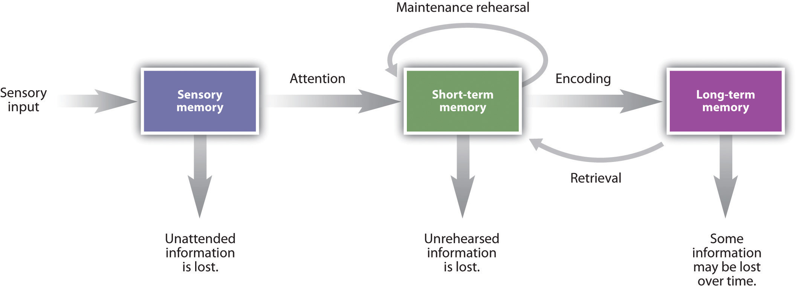
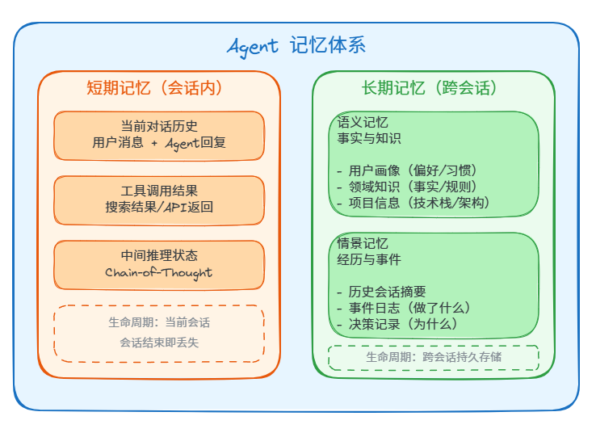
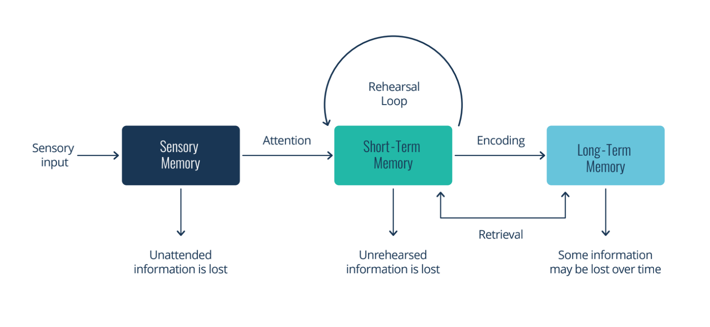
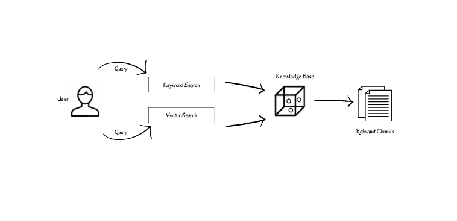
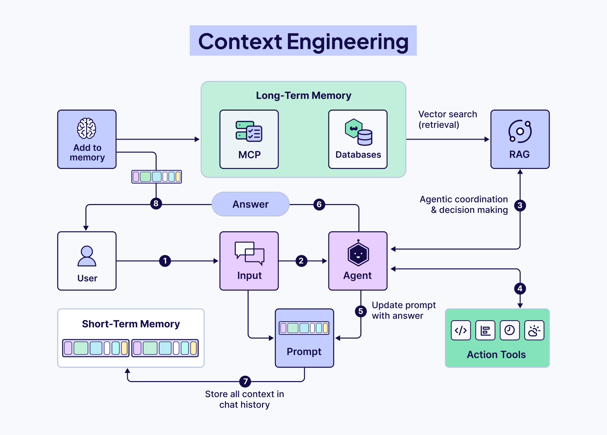
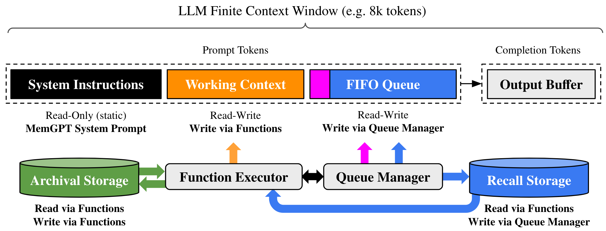

# Agent 记忆架构：从认知科学到工程实现

> Agent 系列 · 第 2 篇 | 为什么你的 Agent 总是"健忘"？从人类记忆机制到工程化记忆系统设计

---

LLM 本身是无状态的——每次 API 调用都是一张白纸。但一个有用的 Agent 必须记住用户说过什么、做过什么、偏好什么。**记忆系统是 Agent 从"一次性问答机器"进化为"长期协作伙伴"的关键基础设施。**

本文从认知科学的记忆分层模型出发，梳理 Agent 记忆的工程化架构：记忆怎么分类、怎么存储、怎么检索、怎么压缩、怎么遗忘。附主流框架的记忆方案对比和面试高频题。

核心观点：**好的记忆系统不是"记住一切"，而是在对的时间、用对的方式、把对的信息注入上下文。**

---

## 一、从人类记忆到 Agent 记忆

### 1.1 人类记忆的分层模型

认知心理学把人类记忆分为三层，每一层的容量、时长和功能完全不同：



| 层级 | 英文 | 容量 | 保持时长 | 功能 | 类比 |
|------|------|------|---------|------|------|
| 感觉记忆 | Sensory Memory | 极大 | < 1 秒 | 原始感官缓冲 | 屏幕刷新的残影 |
| 工作记忆 | Working Memory | 7±2 项 | 秒~分钟 | 当前任务的临时处理区 | 电脑的内存 |
| 长期记忆 | Long-term Memory | 理论无限 | 天~终身 | 持久化存储 | 电脑的硬盘 |

**大白话解释：**

- **感觉记忆**：你看到一个广告牌，瞥一眼就过去了，内容在脑中停留不到1秒。这就是感觉记忆——信息量巨大，但转瞬即逝。
- **工作记忆**：你正在心算 `23 × 17`，脑中会临时hold住 `23`、`17`、`23×10=230`、`23×7=161` 这些中间结果。这就是工作记忆——容量有限（大约只能同时hold住7个东西），算完就扔。
- **长期记忆**：你记得自己小学同学的名字、记得Python怎么写、记得昨天午饭吃了什么。这就是长期记忆——理论上没有容量上限，能存一辈子。

**为什么 Agent 不需要感觉记忆？** 感觉记忆处理的是视觉、听觉等原始感官数据的缓冲。Agent 的输入已经是结构化的文本消息了，不需要这层缓冲。所以 Agent 记忆系统的核心是**工作记忆 + 长期记忆**。

长期记忆又进一步分为两类：

| 类型 | 英文 | 存储内容 | 例子 |
|------|------|---------|------|
| 语义记忆 | Semantic Memory | 事实和知识 | "Python 是一门编程语言" |
| 情景记忆 | Episodic Memory | 经历和事件 | "上周二我帮用户调试了一个 RAG 检索问题" |

**大白话区分：**

- **语义记忆** = 你知道的"是什么"。比如你知道"北京是中国的首都"，这是一条事实，跟你什么时候学到的、在哪里学到的无关。
- **情景记忆** = 你经历的"发生了什么"。比如你记得"上周三下午在星巴克面试了一个候选人，他答不上来Transformer的注意力机制"，这是一段经历，有时间、地点、人物、事件。

对 Agent 来说：
- 语义记忆 = 用户画像、知识库（"用户偏好TypeScript"、"项目用PostgreSQL"）
- 情景记忆 = 会话记录、事件日志（"3月10日帮用户debug了一个连接池问题"）

### 1.2 Agent 记忆的对应关系

把这个模型映射到 Agent 系统：

| 人类记忆 | Agent 记忆 | 实现方式 | 生命周期 |
|---------|-----------|---------|---------|
| 感觉记忆 | 当前轮输入 | 用户消息 + 附件 | 单次请求 |
| 工作记忆 | 上下文窗口 | System Prompt + 对话历史 + 工具结果 | 当前会话 |
| 语义记忆 | 用户画像/知识库 | USER.md / 向量数据库 / 知识图谱 | 跨会话持久 |
| 情景记忆 | 会话记录/事件日志 | 消息历史 / 事件存储 | 跨会话持久 |

**关键洞察：** 大多数 Agent 框架只实现了"工作记忆"（上下文窗口管理），真正做好"长期记忆"（语义+情景）的很少。这就是为什么你的 Agent 每次新会话都像失忆一样。

**举个具体例子：**

你用 Cursor 写了3天代码，每天都在聊同一个项目。第4天打开新会话，你问"帮我继续上次的重构"，它完全不知道你在说什么——因为前3天的对话历史在工作记忆中，会话关了就没了。这就是只有工作记忆、没有长期记忆的典型症状。

如果有长期记忆，Agent 应该能回答："上次你在重构用户认证模块，从 Session 迁移到 JWT，已经完成了 login 和 register 接口，还剩 middleware 没改。要继续吗？"

### 1.3 为什么 LLM 的上下文窗口不够用

有人会问：上下文窗口已经到 128K 甚至 1M 了，还需要专门的记忆系统吗？

答案是**需要**，原因有三：

| 问题 | 说明 |
|------|------|
| **成本** | 128K token 的输入约 $0.60（GPT-4o），每次对话都带完整历史，成本线性增长 |
| **精度** | "大海捞针"问题——信息越多，模型越容易忽略中间位置的关键细节（Lost in the Middle） |
| **范围** | 上下文窗口只能覆盖当前会话，跨会话的信息（用户偏好、历史决策）无法传递 |

**"Lost in the Middle" 是什么？**

这是 2023 年卡内基梅隆大学一篇论文的标题。研究发现：当你往上下文里塞很多信息时，模型对**开头**和**结尾**的信息记忆最好，但对**中间**的信息经常"视而不见"。

大白话：这就像你看一篇100页的报告，第1页和最后1页你记得最清楚，第50页写了什么？早就忘了。

**具体数据：** 研究显示，把关键信息从开头移到中间，GPT-4 的准确率从 80% 暴跌到 30%。

所以记忆系统的核心任务是：**从海量历史信息中，精准检索出当前最需要的几条，注入有限的上下文窗口。** 而不是把所有历史都塞进去。

---

## 二、记忆的分类与职责

### 2.1 按持久性分



> ▲ Agent记忆体系分类：① 短期记忆（会话内） → ② 长期记忆（跨会话） → ③ 语义记忆 + 情景记忆

**大白话解释短期 vs 长期：**

- **短期记忆** = 你今天和同事聊了什么。关掉微信聊天窗口，这些内容还在你的手机上（消息记录），但如果你清空了聊天记录，就彻底没了。
- **长期记忆** = 你记得这个同事喜欢喝美式、上周帮你review了代码、住在朝阳区。这些信息不会因为你们今天没聊天就消失。

### 2.2 按来源分

| 类型 | 说明 | 例子 | 写入时机 |
|------|------|------|---------|
| 用户显式提供 | 用户主动告诉 Agent 的信息 | "我叫小明，偏好简洁回答" | 对话中 |
| Agent 主动观察 | Agent 从交互中推断的信息 | 用户连续3次要求用中文回复 | 对话后整理 |
| 系统预置 | 开发者预设的知识 | "公司内部系统用 OAuth2 认证" | 初始化时 |
| 外部导入 | 从其他系统同步的数据 | 用户的 CRM 记录、工单历史 | 定时同步 |

**大白话解释四种来源：**

1. **用户说的** = 最直接。用户说"我叫张三"，你就记住。
2. **你观察到的** = 需要推理。用户连续5次让你用中文回复，虽然没明确说"以后都用中文"，但你可以推断出这个偏好。
3. **老板（开发者）告诉你的** = 系统初始化时写死的。比如"这个Agent是给客服团队用的，回复要专业且友好"。
4. **从别的系统搬过来的** = 从CRM、工单系统等外部数据源同步过来的用户信息。

### 2.3 按用途分

| 用途 | 说明 | 注入时机 |
|------|------|---------|
| 身份记忆 | 用户是谁（姓名、角色、团队） | 每次会话 |
| 偏好记忆 | 用户喜欢什么（语言风格、输出格式） | 每次会话 |
| 上下文记忆 | 当前在做什么（项目、任务进度） | 相关时注入 |
| 知识记忆 | 领域知识、事实、规则 | 检索时注入 |
| 经验记忆 | 过去的尝试和结果（成功/失败） | 决策时注入 |

**举个例子说明注入时机的差异：**

假设用户问："帮我写个登录接口"

- **身份记忆**（每次都注入）："用户是后端工程师，用Python + FastAPI"
- **偏好记忆**（每次都注入）："用户偏好用TypeHint，代码注释用中文"
- **上下文记忆**（相关时注入）："用户正在做一个电商项目，数据库是PostgreSQL"
- **知识记忆**（检索时注入）："FastAPI的OAuth2实现方式是……"
- **经验记忆**（决策时注入）："上次用户说JWT比Session更适合他的场景"

注意：身份和偏好每次都会注入（因为它影响所有回答），但知识和经验只在相关时才检索注入（避免浪费token）。

---

## 三、记忆的生命周期

记忆不是"存了就完事"，它有自己的生命周期：



**大白话：** 这就像你学一门新技能。你先学了几个概念（形成），然后做笔记整理（巩固），写到笔记本里（存储）。考试的时候翻开笔记本找答案（检索）。时间久了，不常用的知识慢慢忘了（衰减）。最后彻底想不起来（遗忘）。但如果有人提醒你一下，又想起来了（重新激活）。

### 3.1 形成（Formation）

**什么时候该记住？**

不是所有对话都值得存储。触发记忆写入的典型信号：

| 信号 | 例子 | 优先级 |
|------|------|--------|
| 用户显式要求 | "记住这个"、"以后都用这个格式" | 高 |
| 用户纠正行为 | "不要用英文回复"、"代码里用 TypeScript" | 高 |
| 事实性信息 | "我的项目用 PostgreSQL"、"部署在 AWS us-east-1" | 中 |
| 偏好推断 | 用户连续多次要求详细回答 → 推断偏好"详细模式" | 低 |
| 任务结果 | "这个方案可行" / "这个方案不行，因为……" | 中 |

**不该记住什么？**

| 类型 | 原因 | 举例 |
|------|------|------|
| 临时性信息 | 算完就忘，没有长期价值 | "帮我算一下 123×456" |
| 敏感信息 | 安全风险，可能被泄露 | 密码、Token、身份证号 |
| 过时信息 | 会误导后续决策 | "我现在在用 React 16"（用户后来升级了） |
| 模糊推断 | 不确定的信息会污染记忆池 | "用户可能喜欢咖啡"（只是猜的） |

**大白话判断标准：** 问自己一个问题——"如果用户3个月后再来问同样的问题，这条信息还有用吗？" 如果有用，就记；如果没用，就不记。

### 3.2 巩固（Consolidation）

刚形成的记忆是"原始形态"，需要整理后才能长期保存。这一步叫**记忆巩固**。

**巩固的三种策略：**

| 策略 | 说明 | 适用场景 |
|------|------|---------|
| 原样存储 | 直接保存原始信息 | 高优先级、结构化信息 |
| 摘要压缩 | 用 LLM 把长对话压缩成关键点 | 长会话的历史记录 |
| 结构化提取 | 从非结构化文本中提取实体和关系 | "我在北京，用 Python" → {city: "北京", lang: "Python"} |

**摘要压缩示例：**

```
原始对话（2000 tokens）:
  用户: 我在做一个 RAG 项目，用的 Milvus 做向量库
  Agent: 好的，Milvus 是一个不错的选择……
  用户: 但是检索效果不好，chunk 太大了
  Agent: 建议试试小 chunk + parent document retrieval……
  用户: 好的我试试，对了我用的是 BGE-M3 做 embedding

压缩后（100 tokens）:
  记忆: 用户在做 RAG 项目，使用 Milvus 向量库 + BGE-M3 embedding。
  遇到 chunk 粒度问题，已建议小 chunk + parent document retrieval 方案。
```

**结构化提取示例：**

```
原始文本: "我叫张三，在字节跳动做后端开发，项目用Go + PostgreSQL，部署在AWS东京区"

提取结果:
{
  "user": {
    "name": "张三",
    "company": "字节跳动",
    "role": "后端开发"
  },
  "project": {
    "language": "Go",
    "database": "PostgreSQL",
    "cloud": "AWS",
    "region": "东京"
  }
}
```

**为什么要结构化提取？** 因为非结构化文本检索起来效率低。你搜"用户用什么数据库"，结构化数据直接返回 `PostgreSQL`；非结构化文本需要从一大段话里找，还可能找错。

### 3.3 检索（Retrieval）

记忆存下来了，怎么在需要的时候找到它？这是记忆系统最核心的技术问题。

**四种检索范式：**

| 范式 | 原理 | 优势 | 劣势 |
|------|------|------|------|
| **全文检索（FTS）** | 关键词匹配（BM25/TF-IDF） | 精确匹配快、可解释 | 无法处理同义词和语义 |
| **向量检索** | Embedding 相似度（余弦/点积） | 语义理解、跨语言 | 精确实体匹配弱 |
| **混合检索** | FTS + 向量加权融合 | 两者优势互补 | 需要调权重参数 |
| **知识图谱** | 实体-关系三元组查询 | 多跳推理、关系建模 | 构建成本高 |

**大白话解释四种检索：**

1. **全文检索（FTS）** = 用 Ctrl+F 搜文档。你搜"PostgreSQL"，它帮你找到所有包含"PostgreSQL"的句子。但你搜"数据库"，它找不到写"DB"的地方——因为它是按字面匹配的。

2. **向量检索** = 用"意思"搜索。你搜"数据库"，它能找到"DB"、"数据存储"、"data store"——因为它理解这些词的意思相近。但你搜"PostgreSQL"这种精确名词，它可能返回"MySQL"（因为都是数据库，语义相近）。

3. **混合检索** = 两者结合。先用向量检索找语义相关的，再用全文检索精确过滤。就像你找餐厅，先按"川菜"这个类别筛选（语义），再按"麻婆豆腐"这个具体菜名精确匹配（关键词）。

4. **知识图谱** = 按关系搜索。你问"张三的老板是谁"，它沿着 `张三 → belongs_to → 技术部 → managed_by → 李四` 这条链路找到答案。适合回答"A和B是什么关系"这类问题。



**实际选型建议：**

- 需要精确匹配（用户名、ID、命令） → 全文检索
- 需要语义理解（"上次讨论的那个方案"） → 向量检索
- 两者都需要 → 混合检索（推荐）
- 需要多跳推理（"用户的老板是谁"） → 知识图谱

### 3.4 衰减与遗忘（Decay & Forgetting）

**为什么需要遗忘？**

大白话：你的大脑就像一个衣柜。如果只往里塞衣服从来不清理，最后衣柜塞满了，找件T恤都要翻半天。记忆也一样——存得越多，检索越慢、噪音越大、精度越低。

具体来说：
- 存储空间有限（上下文窗口、向量数据库容量）
- 过时信息会误导 Agent（用户换了技术栈，旧记忆变成噪音）
- 信息越多，检索精度越低（噪声淹没信号）

**遗忘策略：**

| 策略 | 机制 | 例子 | 大白话 |
|------|------|------|--------|
| **时间衰减** | 越久远的记忆权重越低 | 3个月前的对话摘要权重衰减 50% | 时间越久，记忆越模糊 |
| **频率衰减** | 越少被检索到的记忆越可能被遗忘 | 从没被引用过的记忆优先清理 | 用进废退 |
| **主动覆写** | 新信息覆盖旧信息 | "我现在用 Rust" 覆盖 "我用 Python" | 新记忆替代旧记忆 |
| **显式删除** | 用户主动要求遗忘 | "删除我之前说的密码" | 主动遗忘 |
| **版本标记** | 给记忆加有效期或版本号 | "截至 2026-06 的技术栈偏好" | 给记忆贴保质期标签 |

**时间衰减的数学模型：**

```
最终权重 = 原始权重 × e^(-λ × 时间差)

其中 λ 是衰减系数：
- λ = 0.001 → 半衰期约 693 天（适合用户画像，变化慢）
- λ = 0.01  → 半衰期约 69 天（适合项目上下文，中等变化）
- λ = 0.1   → 半衰期约 7 天（适合临时任务，变化快）
```

**举个例子：**

假设用户3个月前说"我用Python"（权重1.0），λ=0.01：
- 30天后：权重 = 1.0 × e^(-0.01×30) = 0.74（还很重要）
- 90天后：权重 = 1.0 × e^(-0.01×90) = 0.41（不太重要了）
- 180天后：权重 = 1.0 × e^(-0.01×180) = 0.16（基本可以遗忘了）

---

## 四、记忆架构设计

### 4.1 整体架构



**大白话走一遍流程：**

1. 用户发了一条消息："帮我继续上次的重构"
2. **上下文组装器**开始工作：
   - 放入 System Prompt（"你是一个编程助手"）
   - 放入本次对话的历史（如果有）
   - 去长期记忆里搜"重构"相关的记忆（检索到："3月10日用户在重构登录模块，从Session迁移到JWT"）
   - 按 Token 预算裁剪，组装成最终的上下文
3. 把组装好的上下文发给 **LLM**
4. LLM 返回回答
5. **记忆写入判定**：这次对话值得记住吗？如果用户说"好的，继续"→ 不记；如果用户说"我改用OAuth2了"→ 记住
6. 如果要记，先**巩固**（压缩/结构化），再**存储**（写入向量库）

### 4.2 Token 预算分配

上下文窗口是有限的，必须给不同类型的记忆分配预算：

| 组件 | 典型占比 | 说明 |
|------|---------|------|
| System Prompt | 10-20% | Agent 人设、规则、工具定义 |
| 工具描述 | 10-15% | 可用工具的 Schema |
| 检索到的记忆 | 10-20% | 长期记忆中检索到的相关条目 |
| 对话历史 | 30-50% | 当前会话的消息记录 |
| 预留空间 | 10-20% | 模型输出空间 + 安全余量 |

**举个具体例子（128K 上下文窗口）：**

| 组件 | 分配 Token | 实际内容 |
|------|-----------|---------|
| System Prompt | 20K | Agent 角色定义、规则、示例 |
| 工具描述 | 15K | 10个工具的 JSON Schema |
| 检索到的记忆 | 15K | 3-5条相关记忆 |
| 对话历史 | 50K | 最近20轮对话 |
| 预留空间 | 28K | 模型输出 + 缓冲 |

**动态裁剪策略：**

当总 token 超限时，按以下优先级裁剪（从先丢弃到后丢弃）：

1. **最早的对话历史**（时间衰减）—— 10轮前的对话，优先丢弃
2. **低相关度的长期记忆**（相关性评分）—— 和当前问题不太相关的记忆
3. **工具调用的详细输出**（保留摘要，丢弃原始结果）—— 搜索返回了1000字，保留摘要100字
4. **System Prompt 的示例部分**（保留核心规则）—— 规则不能丢，示例可以丢

**大白话：** 就像搬家时往行李箱装东西。先把不穿的旧衣服拿出来（最早的对话），再把不太用的杂物拿出来（低相关记忆），最后实在装不下，说明书也可以扔（工具输出详情），但身份证不能丢（核心规则）。

### 4.3 记忆存储方案对比

| 方案 | 读取速度 | 查询能力 | 持久化 | 适用规模 | 大白话 |
|------|---------|---------|--------|---------|--------|
| 内存字典 | 极快 | 精确匹配 | ❌ | 小（<1K 条） | 写在便签纸上，电脑重启就没了 |
| SQLite + FTS5 | 快 | 全文检索 | ✅ | 中（<100K 条） | 写在笔记本里，随时翻阅 |
| 向量数据库（Milvus/Qdrant） | 快 | 语义检索 | ✅ | 大（百万级） | 智能图书馆，按"意思"找书 |
| 知识图谱（Neo4j） | 中 | 关系查询 | ✅ | 中（实体关系密集） | 人物关系图，找"谁认识谁" |
| 混合方案 | 快 | 全文+语义 | ✅ | 大（推荐） | 笔记本+智能图书馆组合 |

---

## 五、多 Agent 记忆共享

### 5.1 记忆隔离模型


在多 Agent 系统中，记忆的共享和隔离是一个关键设计决策：

| 模型 | 说明 | 适用场景 | 大白话 |
|------|------|---------|--------|
| **完全隔离** | 每个 Agent 独立记忆空间 | 角色差异大、隐私要求高 | 每人一个日记本，互不相干 |
| **共享只读** | 共享公共知识库，私有记忆独立 | 多 Agent 共享用户画像 | 公司Wiki大家都能看，但个人笔记自己留着 |
| **完全共享** | 所有 Agent 访问同一记忆池 | 紧密协作的 Agent 团队 | 共享大脑，谁都能读能写 |
| **分层共享** | 公共层 + 私有层 | 推荐方案，兼顾协作与隐私 | 公司知识库+个人笔记，两层分开 |

### 5.2 记忆冲突解决

当多个 Agent 往共享记忆写入时，可能产生冲突：

| 冲突类型 | 例子 | 解决策略 | 大白话 |
|---------|------|---------|--------|
| 事实冲突 | Agent A 记录"用户用 React"，Agent B 记录"用户用 Vue" | 时间戳优先（后写覆盖先写） | 谁说的更新听谁的 |
| 偏好冲突 | Agent A 记录"用户喜欢详细"，Agent B 记录"用户喜欢简洁" | 来源优先（用户直接说的 > Agent 推断的） | 用户亲口说的 > 你猜的 |
| 视角冲突 | 两个 Agent 对同一事件有不同记录 | 保留多视角，检索时合并 | 公说公有理，婆说婆有理，都记下来 |

**分层共享模型示例：**

- **公共层（只读）**：用户画像、项目信息、公司知识库
- **团队层（读写）**：任务状态、中间结果、待办事项
- **私有层（仅自己可读写）**：Agent A 的推理历史、Agent B 的内部状态

---

## 六、主流框架记忆方案对比

| 框架 | 记忆模型 | 短期记忆 | 长期记忆 | 检索方式 | 特色 |
|------|---------|---------|---------|---------|------|
| **LangChain/LangGraph** | Checkpointer | State 快照 | 需自建 | 手动检索 | 多存储后端（SQLite/Postgres/Redis） |
| **Hermes Agent** | 双文件模型 | 会话上下文 | USER.md + MEMORY.md | FTS5 全文 | 渐进披露 + 主动策展 |
| **MemGPT** | 操作系统式 | Main Context | Archival Storage | 向量检索 | 模拟虚拟内存分页 |
| **Generative Agents** | 三层记忆流 | 感知流 | 反思流 + 记忆流 | 时效性×相关性×重要性 | 记忆反思（Reflection）机制 |
| **CrewAI** | 共享记忆池 | 会话上下文 | 短期+长期+实体 | 向量检索 | 多 Agent 共享记忆原生支持 |

### 6.1 Generative Agents 的记忆反思机制

这是 2023 年斯坦福"小镇论文"提出的记忆架构，对后来的 Agent 记忆设计影响深远：

**核心思想：** Agent 不仅记住原始事件，还会定期"反思"——从具体事件中抽象出更高层次的洞察。

**大白话解释反思机制：**

想象你是一个项目经理，每天记录工作日志：
- 周一：小明迟到了
- 周二：小明代码没写完
- 周三：小明和产品经理吵架了

到周五你回顾时，不会只记得这三件小事，而是会反思出一个洞察："小明这周状态不好，可能需要聊聊。"

这就是 Generative Agents 的反思机制——从具体事件中提炼出更高层的模式和洞察。

```
原始记忆: "2024-01-15: 用户让我用 LangChain 写了一个 RAG demo"
原始记忆: "2024-02-20: 用户让我把 RAG 迁移到 LlamaIndex"
原始记忆: "2024-03-10: 用户问 LangChain 和 LlamaIndex 的对比"

反思: "用户对 RAG 框架选型比较关注，倾向于对比后决策"
```

**反思的价值：**
- 把零散事件串联成模式（pattern）
- 帮助 Agent 做出更好的预判和推荐
- 减少需要检索的记忆条数（用一条洞察替代多条原始记录）

**反思的触发条件：**

当累积的记忆条数达到阈值时（比如100条），触发反思：
1. 把最近的原始记忆作为输入
2. 用 LLM 生成反思问题（"从这些事件中能得出什么结论？"）
3. LLM 回答，生成高层洞察
4. 把洞察作为新记忆存入（标记为"反思"类型，权重更高）

### 6.2 MemGPT 的虚拟内存模型



MemGPT 模拟操作系统的虚拟内存管理：

| 概念 | OS 对应 | Agent 含义 | 大白话 |
|------|---------|-----------|--------|
| Main Context | 物理内存 | 当前上下文窗口 | 你桌上摊开的文件 |
| Archival Storage | 磁盘 | 外部向量数据库 | 档案室里的文件柜 |
| Working Context | 寄存器 | System Prompt 中的核心信息 | 你手边的便签纸 |
| Page Fault | 缺页中断 | 检索记忆时发现不在上下文中 | 翻文件发现不在桌上，得去档案室拿 |
| Page In/Out | 页面换入/换出 | 把相关记忆调入上下文，无关的换出 | 把需要的文件拿到桌上，不看的放回柜子 |

**核心创新：** Agent 可以自主决定"换入"哪些记忆——就像操作系统决定把哪些页面加载到物理内存。

**MemGPT 的工作流程（大白话版）：**

1. 用户问："上次我们讨论的部署方案是什么？"
2. Agent 在"桌面"（上下文窗口）上找，找不到 → **缺页中断**
3. Agent 去"档案室"（向量数据库）搜"部署方案" → 找到相关记忆
4. 把记忆拿到"桌面"上（注入上下文），同时把不相关的文件放回柜子（裁剪旧记忆）
5. 基于新信息回答用户

**优势：**
- Agent 自主管理记忆，不需要开发者硬编码规则
- 突破上下文窗口限制，理论上可以访问无限量的历史信息
- 模型已经学会了"何时检索"（通过 System Prompt 中的指令）

**局限：**
- 每次"缺页中断"都需要额外的 LLM 调用来决定检索什么，增加延迟
- 依赖模型的工具调用能力——如果模型不擅长工具调用，检索决策会出错
- 实际效果取决于检索质量——如果检索不准，换入的页面也是垃圾

---

## 七、记忆系统的工程实践

### 7.1 记忆质量评估

怎么衡量记忆系统好不好用？

| 指标 | 计算方式 | 目标 | 大白话 |
|------|---------|------|--------|
| 检索准确率 | 检索到的记忆中，相关的比例 | > 80% | 找到的东西里，有用的占多少 |
| 检索召回率 | 所有相关记忆中，被检索到的比例 | > 70% | 有用的东西里，找到了多少 |
| 注入效率 | 注入的记忆对回答质量的提升幅度 | 显著提升 | 加了记忆后，回答变好了吗 |
| Token 成本 | 记忆注入消耗的 token 占总输入的比例 | < 20% | 记忆占了多少空间 |
| 过时率 | 存储的记忆中，已失效的比例 | < 10% | 存的东西里有多少已经过期了 |

### 7.2 常见踩坑

| 坑 | 现象 | 解决 | 大白话 |
|----|------|------|--------|
| 记忆膨胀 | 记忆越存越多，检索越来越慢 | 定期清理 + 去重 + 合并相似记忆 | 衣柜塞满了，找衣服要翻半天 |
| 记忆污染 | 错误信息被记住，持续误导 | 写入时验证 + 用户可纠错机制 | 记错了，一直错下去 |
| 检索漂移 | 检索到的记忆和当前问题不相关 | 混合检索 + 相关性阈值过滤 | 问东答西 |
| Token 超限 | 记忆注入太多，挤占输出空间 | 动态预算分配 + 优先级裁剪 | 背包太重，走不动了 |
| 上下文疲劳 | 注入太多记忆，模型反而忽略关键信息 | 控制在 3-5 条高质量记忆 | 信息太多，反而记不住 |

### 7.3 记忆系统 Checklist

设计 Agent 记忆系统时，用这个清单逐项检查：

```
□ 记忆分类 — 短期/长期、语义/情景 是否清晰分离？
□ 写入策略 — 什么该记、什么不该记，有明确规则吗？
□ 检索方案 — FTS/向量/混合，选哪个？为什么？
□ 预算管理 — 上下文窗口怎么分配？超限怎么裁剪？
□ 衰减机制 — 过时信息怎么处理？有 TTL 或版本标记吗？
□ 冲突解决 — 新旧信息矛盾时，以哪个为准？
□ 隐私安全 — 敏感信息怎么脱敏？用户能要求遗忘吗？
□ 评估指标 — 怎么衡量记忆系统的有效性？
□ 多 Agent — 共享还是隔离？冲突怎么解决？
□ 可观测性 — 能看到 Agent 记住了什么、检索了什么吗？
```

---

## 八、面试高频题

### Q1：Agent 的记忆系统和 RAG 有什么区别？

**参考答案：**

两者都是"从外部存储中检索信息注入上下文"，但侧重点不同：

| 维度 | RAG | Agent 记忆 |
|------|-----|-----------|
| 数据来源 | 外部知识库（文档、网页） | Agent 自身的交互历史和推断 |
| 写入方 | 开发者预处理 | Agent 运行时动态写入 |
| 更新频率 | 低（索引级别） | 高（每轮对话后） |
| 查询方式 | 用户问题 → 检索 | Agent 自主决定是否需要检索 |
| 目标 | 回答知识性问题 | 保持对话连续性和个性化 |

实际上，记忆系统的长期记忆部分通常用 RAG 的技术（向量检索、混合检索）来实现。可以把记忆系统理解为"面向 Agent 自身经历的 RAG"。

### Q2：如何解决 Agent 的"失忆"问题？

**参考答案：**

"失忆"的本质是**长期记忆没有被正确检索和注入**。解决思路：

1. **短期方案**：在 System Prompt 中注入用户画像（USER.md），每次会话自动加载
2. **中期方案**：实现会话摘要——每次会话结束后用 LLM 生成摘要，存入向量库
3. **长期方案**：构建完整的记忆检索管线——写入时结构化提取、检索时混合匹配、注入时动态裁剪

### Q3：MemGPT 的虚拟内存模型有什么优势和局限？

**参考答案：**

**优势：**
- Agent 可以自主管理记忆（决定换入/换出），不需要开发者硬编码规则
- 突破上下文窗口限制，理论上可以访问无限量的历史信息
- 模型已经学会了"何时检索"（通过 System Prompt 中的指令）

**局限：**
- 每次"缺页中断"都需要额外的 LLM 调用来决定检索什么，增加延迟
- 依赖模型的工具调用能力——如果模型不擅长工具调用，检索决策会出错
- 实际效果取决于检索质量——如果检索不准，换入的页面也是垃圾

### Q4：多 Agent 系统中，记忆应该怎么共享？

**参考答案：**

推荐**分层共享模型**：

- **公共层**：所有 Agent 共享的用户画像、项目上下文、知识库
- **团队层**：协作相关的 Agent 共享任务状态、中间结果
- **私有层**：每个 Agent 自己的推理历史、内部状态

读取优先级：私有 > 团队 > 公共
写入权限：只能写自己的私有层，公共层需要审核机制

### Q5：如何评估记忆系统的有效性？

**参考答案：**

三个维度：

1. **检索质量**：给定一个需要记忆的场景，系统能否检索到正确的记忆条目
   - 指标：Precision@K、Recall@K、MRR（Mean Reciprocal Rank）
2. **回答质量**：注入记忆后，Agent 的回答是否更准确、更个性化
   - 指标：A/B 测试（有记忆 vs 无记忆）、用户满意度评分
3. **效率**：记忆注入的成本是否可控
   - 指标：Token 消耗、延迟增加、存储成本

---

## 九、延伸阅读

| 资源 | 说明 |
|------|------|
| [Generative Agents: Interactive Simulacra of Human Behavior](https://arxiv.org/abs/2304.03442) | 斯坦福"小镇论文"，三层记忆流 + 反思机制 |
| [MemGPT: Towards LLMs as Operating Systems](https://arxiv.org/abs/2310.08560) | 虚拟内存式记忆管理 |
| [Reflexion: Language Agents with Verbal Reinforcement Learning](https://arxiv.org/abs/2303.11366) | 语言反馈式记忆强化 |
| [Lost in the Middle: How Language Models Use Long Contexts](https://arxiv.org/abs/2307.03172) | 上下文窗口的"大海捞针"问题 |
| [LangChain Memory 文档](https://python.langchain.com/docs/concepts/memory/) | LangChain 记忆模块官方文档 |
| 本仓库 [LangChain 会话记忆与状态管理](../02-开发框架与平台/LangChain/05-LangChain会话记忆与状态管理.md) | LangChain 记忆的工程实现 |
| 本仓库 [Hermes Agent 持久记忆](../02-开发框架与平台/Hermes-Agent/07-Hermes%20Agent持久记忆.md) | Hermes 记忆系统的使用指南 |

---

## 十、小结

| 要点 | 核心内容 |
|------|---------|
| 记忆分层 | 感觉记忆→工作记忆→语义记忆→情景记忆，对应 Agent 的不同存储 |
| 生命周期 | 形成→巩固→存储→检索→衰减→遗忘，不是"存了就完事" |
| 检索范式 | FTS 精确匹配 / 向量语义检索 / 混合推荐 / 知识图谱多跳推理 |
| Token 预算 | 记忆注入不能超过上下文的 20%，否则挤占输出空间 |
| 遗忘机制 | 时间衰减 + 频率衰减 + 主动覆写，防止记忆污染 |
| 多 Agent | 分层共享（公共→团队→私有），冲突用时间戳+来源优先级解决 |

**一句话总结：好的记忆系统 = 精准的写入策略 + 高效的检索方案 + 合理的预算管理 + 智能的遗忘机制。**
