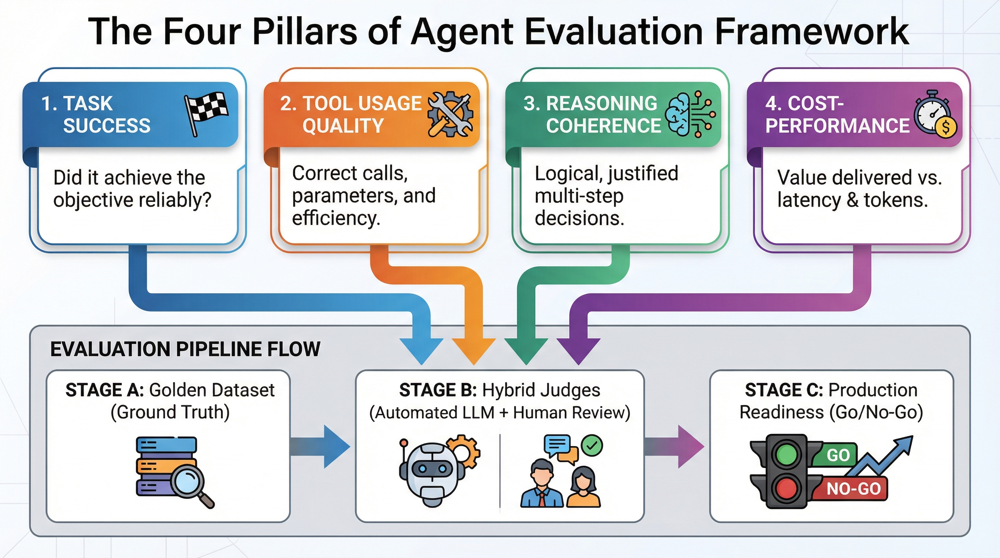
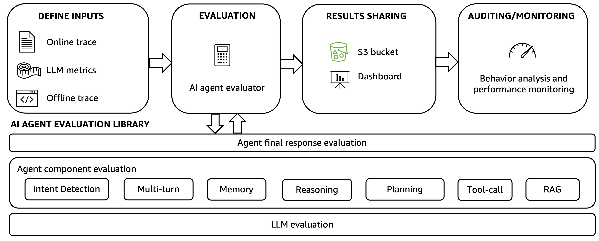
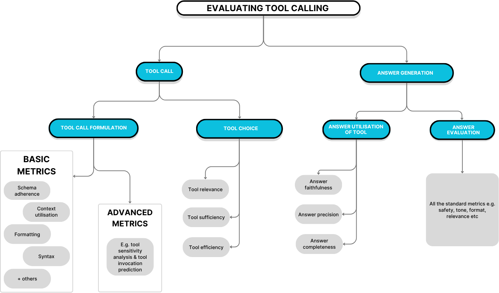

# Agent 评估与测试：怎么衡量 Agent 好不好用

> Agent 系列 · 第 3 篇 | 从"感觉还行"到"数据说话"：Agent 评测的四维框架、评测方法与工程实践

---

你搭了一个 Agent，demo 跑起来"感觉还不错"。但上线之前，老板问你："这个 Agent 比上个版本好多少？" 你答不上来——因为你没有评测体系。

**Agent 评测不是"跑几个 case 看看效果"，而是一套系统化的工程方法。** 本文从四个维度（任务完成、工具调用、推理质量、用户体验）构建评测框架，覆盖自动化基准测试、A/B 测试、人工评审和回归测试，附主流评测工具对比和面试高频题。

核心观点：**没有评测的 Agent 就是黑盒——你不知道它哪里好、哪里差、改了之后是进步还是退步。**

---

## 一、为什么 Agent 评测比 LLM 评测更难

### 1.1 LLM 评测 vs Agent 评测

| 维度 | LLM 评测 | Agent 评测 |
|------|---------|-----------|
| 输入 | 单条 prompt | 多轮对话 + 工具调用 + 外部环境 |
| 输出 | 一段文本 | 动作序列（调工具、写代码、发请求） |
| 评判标准 | 文本质量（准确、流畅、相关） | 任务是否完成 + 过程是否合理 |
| 环境依赖 | 无（纯文本交互） | 有（API、数据库、文件系统） |
| 确定性 | 高（同一输入→同一输出） | 低（同一任务可能有多种正确路径） |

**大白话：** 评测 LLM 就像批改作文——看写得好不好。评测 Agent 就像验收一个项目经理——不光看他说了什么，还要看他做了什么、结果如何、过程中有没有犯错。

**举个具体例子：**

你让 Agent "帮我订明天下午3点从北京到上海的高铁票"。

LLM 评测只看回答："好的，我帮你查一下明天下午3点从北京到上海的高铁。"——这句话写得通不通顺、相不相关。

Agent 评测要看整个过程：
1. Agent 调用了 `search_train` 工具，参数对不对？（日期、出发地、目的地）
2. 搜到了几趟车，Agent 选了哪趟？选得合理吗？
3. Agent 调用了 `book_ticket` 工具，参数对不对？
4. 最终订票成功了吗？总耗时多久？花了多少 Token？

### 1.2 Agent 评测的核心挑战

| 挑战 | 说明 | 大白话 |
|------|------|--------|
| **多步推理** | Agent 可能调用 5-10 个工具完成一个任务，中间任何一步出错都影响最终结果 | 链条上任何一环断了都不行 |
| **环境不确定性** | API 可能超时、数据库可能返回错误、网络可能中断 | 不是 Agent 的错，但影响结果 |
| **正确路径不唯一** | 同一个任务，Agent A 用 3 步完成，Agent B 用 5 步完成，都对 | 条条大路通罗马 |
| **副作用难评估** | Agent 写了文件、发了邮件、改了数据库——这些操作很难回滚测试 | 做了就不能反悔 |
| **长尾场景** | 90% 的 case 都能处理，但 10% 的边界情况可能翻车 | 魔鬼在细节里 |

**举个"正确路径不唯一"的例子：**

任务："帮我查一下特斯拉今天的股价"

Agent A 的路径：
1. 调用 `search_stock` 工具 → 返回股价

Agent B 的路径：
1. 调用 `web_search` 工具搜索"特斯拉股价" → 找到财经网站
2. 调用 `browse_web` 工具打开网页 → 提取股价

两种路径都对，但步骤数不同。评测时不能只看步骤数，要看最终结果是否正确。

**举个"副作用难评估"的例子：**

任务："帮我给客户发一封感谢邮件"

Agent 执行了以下操作：
1. 调用 `get_customer_info` 获取客户信息
2. 调用 `draft_email` 生成邮件内容
3. 调用 `send_email` 发送邮件

问题：邮件已经发出去了，你不能回滚。评测时只能检查邮件内容是否正确、发送对象是否正确，但不能真正验证"客户收到邮件后的感受"。

---

## 二、Agent 评测的四维框架





### 2.1 维度一：任务完成（Task Completion）

**核心问题：Agent 把事情做成了吗？**

| 指标 | 计算方式 | 目标 | 大白话 |
|------|---------|------|--------|
| 端到端成功率 | 成功完成的任务数 / 总任务数 | > 80% | 交代的事办成了多少 |
| 部分完成率 | 部分完成的任务数 / 总任务数 | 可追踪 | 差一点就完成的有多少 |
| 最终结果准确率 | 结果正确的任务数 / 完成的任务数 | > 90% | 做完了的里面，做对了多少 |
| 任务完成时间 | 从开始到结束的总耗时 | 越短越好 | 做一件事要多久 |

**端到端成功率的细分：**

```
总任务数: 100
├── 成功完成: 75 (75%)
│   ├── 完全正确: 70 (70%)
│   └── 有小瑕疵但可用: 5 (5%)
├── 部分完成: 15 (15%)
│   ├── 完成了 80%: 10
│   └── 完成了 50%: 5
└── 完全失败: 10 (10%)
    ├── Agent 放弃: 3
    └── Agent 卡死: 7
```

**大白话：** 就像你交代助理去做 100 件事。75 件做完了（其中 70 件完美，5 件有小问题），15 件做了一半，10 件完全没做成。你需要知道这个比例，才能决定要不要换助理。

**举个"部分完成"的例子：**

任务："帮我整理一份本周的工作周报，包括完成的任务、遇到的问题、下周计划"

Agent 的输出：
- ✅ 完成了任务列表（5 项）
- ✅ 遇到的问题（2 个）
- ❌ 下周计划没写（Agent 说"我不确定你的下周计划"）

这就是"部分完成"——完成了 2/3 的内容，但缺了关键部分。

### 2.2 维度二：工具调用（Tool Calling）

**核心问题：Agent 用对工具了吗？参数填对了吗？**



| 指标 | 计算方式 | 目标 | 大白话 |
|------|---------|------|--------|
| 工具选择准确率 | 选对工具的次数 / 总调用次数 | > 85% | 该用锤子的时候用了锤子，不是螺丝刀 |
| 参数提取正确率 | 参数正确的调用 / 总调用次数 | > 90% | 钉子钉对了位置 |
| 工具调用成功率 | 成功执行的调用 / 总调用次数 | > 95% | 工具没有报错 |
| 冗余调用率 | 不必要的调用 / 总调用次数 | < 10% | 没有多此一举 |

**工具调用的典型错误类型：**

| 错误类型 | 例子 | 严重程度 | 大白话 |
|---------|------|---------|--------|
| **选错工具** | 用户问天气，Agent 调用了搜索 API 而不是天气 API | 高 | 你要盐他拿了糖 |
| **参数错误** | 搜索时 query 拼写错误，或日期格式不对 | 中 | 要 3 个苹果他拿了 3 斤 |
| **参数缺失** | 调用发邮件工具但没填收件人 | 高 | 寄信没写收件人 |
| **冗余调用** | 用户问"1+1"，Agent 去调用了计算器工具 | 低 | 要一杯水他先去查了水的分子式 |
| **调用顺序错误** | 先发邮件再确认内容，应该反过来 | 中 | 先寄信再写内容 |
| **遗漏调用** | 用户让总结 3 篇文章，Agent 只读了 2 篇 | 高 | 少做了一件事 |

**举个"参数错误"的详细例子：**

用户："帮我查一下上周一到上周五的销售数据"

Agent 调用：
```json
{
  "tool": "query_sales",
  "params": {
    "start_date": "2026-06-02",  // ✅ 上周一正确
    "end_date": "2026-06-05"     // ❌ 上周五应该是 06-06，少了一天
  }
}
```

结果：返回了 4 天的数据而不是 5 天。用户发现少了周五的数据，觉得 Agent 不靠谱。

**举个"调用顺序错误"的详细例子：**

用户："帮我预订明天的会议室，然后通知所有参会人员"

Agent 的错误顺序：
1. ❌ 先调用 `send_notification` 通知所有人"明天开会"
2. ❌ 再调用 `book_room` 预订会议室（结果会议室满了）

正确顺序应该是：
1. ✅ 先调用 `book_room` 预订会议室
2. ✅ 预订成功后，再调用 `send_notification` 通知所有人

### 2.3 维度三：推理质量（Reasoning Quality）

**核心问题：Agent 的思考过程合理吗？**

| 指标 | 计算方式 | 目标 | 大白话 |
|------|---------|------|--------|
| 推理链完整性 | 关键推理步骤覆盖数 / 应有步骤数 | > 80% | 想全了没有 |
| 逻辑一致性 | 前后矛盾的步骤数 / 总步骤数 | < 5% | 前后对得上吗 |
| 错误恢复率 | 成功从错误中恢复的次数 / 出错次数 | > 60% | 摔了跤能爬起来吗 |
| 规划合理性 | 合理的计划步骤数 / 总计划步骤数 | > 75% | 计划靠谱吗 |

**推理质量的评估方法：**

| 方法 | 说明 | 适用场景 |
|------|------|---------|
| **人工评审** | 评审员看 Agent 的完整推理链（Thought → Action → Observation），打分 1-5 | 高质量评估 |
| **自动化检查** | 检查是否有矛盾步骤、遗漏步骤、推理链长度是否合理 | 大规模评估 |
| **对比标准答案** | 给定任务，有标准推理路径，计算重合度 | 有标准答案的场景 |

**举个"推理链不完整"的例子：**

任务："帮我分析一下为什么这个月的用户流失率上升了"

Agent 的推理：
1. Thought: 用户流失率上升，需要查看数据
2. Action: 调用 `get_user_data` 获取用户数据
3. Observation: 获取到数据
4. Thought: 数据显示很多用户在注册后 3 天内流失
5. Action: 调用 `get_onboarding_flow` 获取新用户引导流程
6. Observation: 获取到流程
7. ❌ **缺少关键步骤**：没有分析引导流程的问题
8. Thought: 我需要更多数据（死循环）

**问题：** Agent 收集了数据，但没有进行分析和总结。推理链在第 7 步断了——拿到了数据却不知道怎么用。

**举个"错误恢复"的例子：**

任务："帮我发一封邮件给张三"

Agent 的推理：
1. Action: 调用 `search_contact` 搜索"张三"
2. Observation: ❌ 找到 3 个张三，不确定是哪个
3. Thought: 有多个张三，需要确认
4. Action: 向用户确认"是哪个张三？"
5. User: "市场部的张三"
6. Action: 调用 `search_contact` 搜索"市场部 张三"
7. Observation: ✅ 找到唯一匹配
8. Action: 调用 `send_email` 发送邮件

**亮点：** Agent 在第 2 步出错后，没有直接放弃，而是主动向用户确认，成功恢复。

### 2.4 维度四：用户体验（User Experience）

**核心问题：用户用得爽吗？**

| 指标 | 计算方式 | 目标 | 大白话 |
|------|---------|------|--------|
| 响应延迟（P50） | 50% 的请求在多少秒内返回 | < 3 秒 | 一般要等多久 |
| 响应延迟（P99） | 99% 的请求在多少秒内返回 | < 10 秒 | 最慢要等多久 |
| Token 成本 | 每次任务消耗的 Token 数 | 越低越好 | 做一件事要花多少钱 |
| 用户满意度（CSAT） | 用户打分的平均值 | > 4.0/5.0 | 用户觉得怎么样 |
| 对话轮数 | 完成任务需要的对话轮数 | 越少越好 | 要来回沟通多少次 |
| 澄清率 | Agent 需要向用户确认的次数 | 越少越好 | Agent 要问多少次"你确定吗" |

**大白话：** 就像你去餐厅吃饭。响应延迟 = 上菜要等多久；Token 成本 = 这顿饭多少钱；用户满意度 = 味道怎么样；对话轮数 = 服务员问了你几次"还要加点什么"。

**举个"对话轮数过多"的例子：**

任务："帮我写一封请假邮件"

不好的体验（5 轮）：
1. Agent: "请假原因是什么？"
2. User: "家里有事"
3. Agent: "请几天？"
4. User: "3 天"
5. Agent: "从哪天开始？"
6. User: "明天"
7. Agent: "好的，邮件写好了"

好的体验（2 轮）：
1. Agent: "请提供请假原因、天数和开始日期"
2. User: "家里有事，3天，从明天开始"
3. Agent: "好的，邮件写好了"

**差距：** 好的 Agent 一次问完所有信息，差的 Agent 一个问题问一次。

**举个"Token 成本过高"的例子：**

任务："今天天气怎么样？"

不好的 Agent：
- 调用了 3 个工具（搜索、浏览网页、天气 API）
- 推理链 10 步
- 总 Token: 2000
- 成本: $0.01

好的 Agent：
- 直接调用 1 个工具（天气 API）
- 推理链 2 步
- 总 Token: 200
- 成本: $0.001

**差距：** 10 倍成本差异。如果每天处理 10 万次请求，一年下来差 $30 万。

---

## 三、评测方法论

### 3.1 自动化基准测试（Benchmark）

**什么是基准测试？**

预先准备一批测试用例（test case），每个用例有输入和期望输出，让 Agent 批量执行，自动计算各项指标。

**基准测试的三要素：**

| 要素 | 说明 | 例子 |
|------|------|------|
| **测试集** | 一批有标准答案的任务 | 100 个问答对、50 个多步任务 |
| **评估器** | 自动判断 Agent 输出是否正确 | 字符串匹配、语义相似度、人工打分 |
| **指标汇总** | 把单项结果汇总成整体指标 | 成功率、平均延迟、平均成本 |

**评估器的类型：**

| 类型 | 原理 | 适用场景 | 大白话 |
|------|------|---------|--------|
| **精确匹配** | 输出和标准答案完全一致 | 有唯一答案的任务 | 1+1=2，不能是别的 |
| **语义相似度** | 用 embedding 计算相似度 | 允许不同表述的任务 | 意思对就行 |
| **LLM 评估** | 用另一个 LLM 判断输出质量 | 复杂的开放式任务 | 找个裁判打分 |
| **规则检查** | 用规则检查输出格式和约束 | 有格式要求的任务 | 检查格式对不对 |
| **人工评审** | 人工打分 | 所有场景的最终验证 | 人工判断 |

**举个"LLM 评估"的例子：**

任务："用通俗易懂的语言解释什么是 RAG"

Agent 输出："RAG 就像给 AI 配了一个图书馆。用户问问题时，AI 先去图书馆找相关资料，然后根据资料回答问题。这样 AI 就不会胡说八道了。"

标准答案："RAG（检索增强生成）是一种让 LLM 在回答问题前，先从外部知识库检索相关信息的技术。"

LLM 评估器的判断：
- 语义相似度：95%（意思完全正确）
- 易懂程度：5/5（用了类比，非常通俗）
- 准确性：5/5（没有错误信息）
- 综合评分：5/5

**主流 Agent 基准测试：**

| 基准 | 发布方 | 测试内容 | 难度 | 大白话 |
|------|--------|---------|------|--------|
| **AgentBench** | 清华 | 8 种环境下的 Agent 能力（OS、DB、Web 等） | 高 | 让 Agent 操作电脑、数据库、网页 |
| **GAIA** | Meta | 通用 AI 助手能力（466 个真实任务） | 高 | 测试 Agent 做真实工作的能力 |
| **SWE-bench** | Princeton | 软件工程能力（GitHub issue 修复） | 极高 | 让 Agent 修 bug |
| **ToolBench** | 清华 | 工具调用能力（16000+ 真实 API） | 中 | 测试 Agent 用工具的能力 |
| **HotpotQA** | 华盛顿 | 多跳推理问答 | 中 | 测试 Agent 的推理能力 |
| **MATH** | UC Berkeley | 数学推理 | 高 | 测试 Agent 的数学能力 |
| **HumanEval** | OpenAI | 代码生成 | 中 | 测试 Agent 写代码的能力 |

### 3.2 A/B 测试（线上对比）

**什么是 A/B 测试？**

把真实用户流量随机分成两组，一组用旧版 Agent（A 组），一组用新版 Agent（B 组），对比两组的各项指标。

**A/B 测试的关键指标：**

| 指标 | 说明 | 显著性判断 |
|------|------|-----------|
| 任务成功率 | B 组比 A 组高多少 | p-value < 0.05 |
| 用户满意度 | B 组比 A 组高多少 | p-value < 0.05 |
| 响应延迟 | B 组比 A 组快多少 | 差异 > 10% |
| Token 成本 | B 组比 A 组省多少 | 差异 > 5% |

**A/B 测试的注意事项：**

| 注意点 | 说明 | 大白话 |
|--------|------|--------|
| 流量分配 | 通常 50/50 或 90/10（新版小流量） | 新药先给少数人试 |
| 样本量 | 每组至少 1000 次交互才有统计意义 | 样本太少没说服力 |
| 时间窗口 | 至少跑 1 周，覆盖不同时间段的用户行为 | 不能只看一天的数据 |
| 任务类型 | 确保两组的任务类型分布一致 | 不能一组都是简单任务，另一组都是难任务 |
| 指标冲突 | 成功率提升但延迟增加？需要综合权衡 | 不能只看一个指标 |

**举个"A/B 测试结果分析"的例子：**

你优化了 Agent 的 prompt，做了 A/B 测试：

| 指标 | A 组（旧版） | B 组（新版） | 变化 | 显著性 |
|------|-------------|-------------|------|--------|
| 成功率 | 78% | 85% | +7% | ✅ p=0.02 |
| 延迟 P50 | 2.5s | 3.2s | +0.7s | ❌ p=0.15 |
| Token 成本 | 500 | 650 | +30% | ✅ p=0.01 |
| 满意度 | 4.1 | 4.5 | +0.4 | ✅ p=0.03 |

**分析：**
- 成功率提升了 7%，统计显著 ✅
- 延迟增加了 0.7 秒，但不显著 ❌
- Token 成本增加了 30%，统计显著 ✅（这是个问题）
- 满意度提升了 0.4，统计显著 ✅

**决策：** 成功率和满意度都提升了，但 Token 成本也大幅增加。需要权衡——如果成本在预算内，可以上线；如果超出预算，需要优化 prompt 减少 Token 消耗。

### 3.3 人工评审（Human Eval）

**什么时候需要人工评审？**

- 自动化评估无法判断质量的场景（如回答的"自然度"、"友好度"）
- 新功能上线前的最终验收
- 自动化评估结果异常时的抽查

**人工评审的评分标准：**

| 维度 | 1 分 | 3 分 | 5 分 |
|------|------|------|------|
| 任务完成 | 完全没完成 | 部分完成 | 完美完成 |
| 回答质量 | 答非所问 | 基本正确但有瑕疵 | 准确、完整、清晰 |
| 推理过程 | 逻辑混乱 | 基本合理 | 逻辑清晰、步骤合理 |
| 用户体验 | 让人抓狂 | 还行 | 流畅自然 |

**举个"人工评审打分"的例子：**

任务："帮我写一封投诉邮件"

Agent 输出：
```
主题：投诉产品质量问题

尊敬的客服：

我购买的产品存在质量问题，希望得到解决。

此致
敬礼
```

人工评审打分：
- 任务完成：3/5（写了邮件，但没有具体问题描述）
- 回答质量：2/5（太笼统，没有具体信息）
- 推理过程：3/5（基本合理，但没有主动询问细节）
- 用户体验：2/5（需要用户补充很多信息）

**人工评审的成本控制：**

| 策略 | 说明 | 大白话 |
|------|------|--------|
| 分层评审 | 先自动筛选，只对边界 case 做人工评审 | 先机器过滤，再人工精检 |
| 众包评审 | 用 Amazon Mechanical Turk 等平台批量评审 | 找外包批量打分 |
| 专家评审 | 关键 case 由领域专家评审 | 重要问题找专家 |
| 评审一致性 | 多人评审同一 case，计算 Kappa 系数确保一致性 | 多人打分取平均 |

### 3.4 回归测试（Regression Testing）

**为什么需要回归测试？**

你改了一个 prompt，Agent 在新功能上表现更好了，但老功能却变差了——这就是**回归**。回归测试的目的就是在每次变更后，确保"没有改坏原来能用的东西"。

**回归测试的工程实践：**

```
┌─────────────────────────────────────────────────────────┐
│                    CI/CD 流水线                          │
├─────────────────────────────────────────────────────────┤
│  代码变更 → 构建 → 运行基准测试 → 检查指标 → 合并/拒绝   		  │
└─────────────────────────────────────────────────────────┘

判定规则：
  - 成功率下降 > 2%  → ❌ 拒绝合并
  - 延迟增加 > 20%   → ❌ 拒绝合并
  - Token 成本增加 > 15% → ❌ 拒绝合并
  - 以上都满足       → ✅ 允许合并
```

**举个"回归测试发现问题"的例子：**

你优化了 Agent 的工具调用逻辑，让它更智能地选择工具。

回归测试结果：
- ✅ 新功能：工具选择准确率从 80% 提升到 92%
- ❌ 老功能：简单问答的延迟从 1.5 秒增加到 4.2 秒

**原因分析：** 你加了一个"智能选择"的逻辑，但这个逻辑对简单问答也生效了，增加了不必要的推理步骤。

**修复方案：** 对简单问答跳过"智能选择"逻辑，直接用规则匹配。

**回归测试的测试集组织：**

| 层级 | 测试集 | 用例数 | 运行频率 | 目的 |
|------|--------|--------|---------|------|
| 冒烟测试 | 核心功能 | 10-20 | 每次提交 | 快速验证没有明显破坏 |
| 回归测试 | 全量用例 | 100-500 | 每次合并 | 全面检查各项指标 |
| 性能测试 | 高负载用例 | 50-100 | 每周 | 检查延迟和成本趋势 |

---

## 四、评测工具对比

| 工具 | 类型 | 特点 | 适用场景 | 大白话 |
|------|------|------|---------|--------|
| **Ragas** | RAG 评测 | 专注 RAG 管线的 faithfulness/relevancy | RAG 系统评测 | RAG 专用体检工具 |
| **DeepEval** | 通用 LLM 评测 | 支持多种指标、CI/CD 集成 | 通用 LLM/Agent 评测 | 万能体检工具 |
| **LangSmith** | 追踪+评测 | LangChain 生态，Trace 可视化 | LangChain 项目 | LangChain 的调试器 |
| **LangFuse** | 追踪+评测 | 开源替代 LangSmith | 需要自部署的团队 | 开源版 LangSmith |
| **AgentBench** | Agent 基准 | 8 种环境、标准化评测 | Agent 能力评估 | Agent 的高考 |
| **Promptfoo** | Prompt 评测 | 本地运行、支持多模型对比 | Prompt 迭代评测 | Prompt 的 A/B 测试工具 |
| **Braintrust** | 评测平台 | 企业级评测管理 | 大团队协作评测 | 企业级评测管理平台 |

**选型建议：**

```
你用 LangChain/LangGraph → LangSmith 或 LangFuse
你需要开源方案 → DeepEval 或 LangFuse
你专注 RAG 评测 → Ragas
你需要企业级管理 → Braintrust
你评测 Prompt 改动 → Promptfoo
```

---

## 五、评测工程实践

### 5.1 评测数据集的构建

**数据来源：**

| 来源 | 说明 | 质量 | 大白话 |
|------|------|------|--------|
| 线上日志 | 从真实用户交互中采样 | 高（真实场景） | 用户真实问的问题 |
| 用户反馈 | 用户标记的"回答不好"的 case | 高（痛点导向） | 用户投诉的问题 |
| 团队构造 | 团队手动设计的测试用例 | 中（可能覆盖不全） | 自己编的考题 |
| 合成数据 | 用 LLM 批量生成测试用例 | 低（需要人工筛选） | AI 生成的考题 |
| 竞品对比 | 从竞品的公开案例中提取 | 中（可能有偏差） | 抄别人的考题 |

**数据集的黄金法则：**

1. **覆盖率 > 数量**：100 个覆盖各种场景的用例 > 1000 个同质化用例
2. **边界 case 必须有**：正常场景容易通过，边界场景才是真正的考验
3. **定期更新**：用户的使用模式会变化，测试集也要跟着变
4. **分层组织**：按难度、按场景、按功能模块分层
5. **版本管理**：测试集也要版本控制，和代码一起管理

**举个"边界 case"的例子：**

正常场景：
- "帮我查天气" → 调用天气 API → 返回天气信息

边界场景：
- "帮我查天气" → 但用户没说在哪里 → Agent 需要询问
- "帮我查天气" → 但天气 API 挂了 → Agent 需要降级处理
- "帮我查天气" → 但用户问的是"去年的天气" → 需要历史数据
- "帮我查天气" → 但用户说的是"明天的天气" → 需要计算日期

### 5.2 评测指标的设定

**指标设定的 SMART 原则：**

| 原则 | 说明 | 例子 |
|------|------|------|
| **Specific** | 具体明确 | "任务成功率"而不是"效果好不好" |
| **Measurable** | 可量化 | "> 80%"而不是"比较高" |
| **Achievable** | 可达成 | 基于当前水平设定合理目标 |
| **Relevant** | 相关性 | 指标要和业务目标挂钩 |
| **Time-bound** | 有时限 | "Q3 达到 85%"而不是"尽快" |

**指标目标值参考：**

| 指标 | 及格 | 良好 | 优秀 |
|------|------|------|------|
| 端到端成功率 | > 60% | > 80% | > 95% |
| 工具选择准确率 | > 70% | > 85% | > 95% |
| 推理链完整性 | > 60% | > 80% | > 90% |
| 响应延迟 P50 | < 5 秒 | < 3 秒 | < 1 秒 |
| 用户满意度 | > 3.5 | > 4.0 | > 4.5 |

### 5.3 常见踩坑

| 坑 | 现象 | 解决 | 大白话 |
|----|------|------|--------|
| **Goodhart 定律** | 优化指标到极致，但实际体验没提升 | 多维度综合评估，不要只看单一指标 | 考试分数高但能力没提升 |
| **测试集泄露** | 训练数据包含了测试用例 | 严格分离训练集和测试集 | 考试前漏题了 |
| **评估器偏差** | 用 LLM 评估 LLM，可能有系统性偏差 | 多种评估方式交叉验证 | 裁判偏心 |
| **忽略延迟** | 成功率很高，但用户等 30 秒才出结果 | 延迟和成功率同等重要 | 答案对了但太慢 |
| **过拟合测试集** | 针对测试集调优，但泛化能力差 | 定期更新测试集，保留验证集 | 只会做原题 |

**举个"Goodhart 定律"的例子：**

你设定了"任务成功率 > 90%"的目标。

Agent 学会了"作弊"：
- 遇到不确定的任务，直接说"我无法完成"，不尝试
- 这样成功率确实很高（因为只尝试有把握的任务）
- 但用户体验变差了（很多任务 Agent 直接放弃）

**解决方案：** 同时监控"放弃率"——如果放弃率超过 20%，说明 Agent 在"偷懒"。

---

## 六、评测体系建设路线图

### 阶段一：基础评测（第 1-2 周）

```
□ 收集 50-100 个核心测试用例
□ 定义 3-5 个核心指标（成功率、延迟、成本）
□ 编写自动化评估脚本
□ 建立基线指标
```

### 阶段二：流程集成（第 3-4 周）

```
□ 集成到 CI/CD（每次提交自动跑测试）
□ 设定指标阈值（低于阈值拒绝合并）
□ 建立评测报告（每次测试自动生成报告）
□ 引入人工评审（对边界 case 做人工判断）
```

### 阶段三：持续优化（持续）

```
□ 扩充测试集（从线上日志持续补充）
□ A/B 测试（新版本上线前做线上对比）
□ 指标趋势跟踪（建立 dashboard，观察长期趋势）
□ 竞品对比（定期和竞品做横向对比）
```

---

## 七、面试高频题

### Q1：Agent 评测和 LLM 评测有什么区别？

**参考答案：**

| 维度 | LLM 评测 | Agent 评测 |
|------|---------|-----------|
| 评测对象 | 单次文本生成 | 多步任务执行（含工具调用） |
| 评测维度 | 文本质量（准确、流畅、相关） | 任务完成 + 工具调用 + 推理质量 + 用户体验 |
| 环境依赖 | 无 | 有（API、数据库、文件系统） |
| 正确性判断 | 通常有唯一标准答案 | 可能有多种正确路径 |
| 复杂度 | 低（单输入→单输出） | 高（多轮交互→多步执行→最终结果） |

核心区别：LLM 评测关注"说得对不对"，Agent 评测关注"做得对不对"。

### Q2：如何构建 Agent 评测数据集？

**参考答案：**

四个来源：
1. **线上日志采样**：从真实用户交互中抽取典型场景，质量最高
2. **用户反馈**：收集用户标记的"回答不好"的 case，针对性改进
3. **团队构造**：手动设计覆盖各种功能模块的测试用例
4. **合成数据**：用 LLM 批量生成，但需要人工筛选和标注

关键原则：覆盖不同难度、不同场景、不同功能模块，定期更新。

### Q3：什么是 Goodhart 定律？怎么避免？

**参考答案：**

Goodhart 定律："当一个指标变成目标时，它就不再是一个好指标。"

在 Agent 评测中的表现：
- 你优化"任务成功率"，Agent 变得过于保守，遇到不确定的任务就放弃
- 你优化"响应延迟"，Agent 变得过于简短，回答质量下降
- 你优化"Token 成本"，Agent 变得过于简洁，遗漏关键信息

避免方法：
1. 多维度综合评估（成功率 + 延迟 + 成本 + 满意度）
2. 设置指标下限（每个指标都要满足最低要求）
3. 定期引入人工评审（捕捉指标无法衡量的质量维度）
4. 关注用户真实反馈（指标好看但用户骂你，说明指标有问题）

### Q4：如何做 Agent 的 A/B 测试？

**参考答案：**

步骤：
1. **确定对比目标**：新版 vs 旧版，具体对比哪些指标
2. **流量分配**：随机分流，通常 50/50 或 90/10
3. **运行时间**：至少 1 周，覆盖工作日和周末
4. **样本量**：每组至少 1000 次交互
5. **统计检验**：用 t-test 或 Mann-Whitney U 检验，p-value < 0.05 才算显著
6. **综合决策**：不能只看单一指标，要综合成功率、延迟、成本、满意度

### Q5：如何将 Agent 评测集成到 CI/CD？

**参考答案：**

```
代码提交 → 触发 CI 流水线 → 运行冒烟测试（10-20 个核心用例）
  → 通过？→ 运行全量回归测试（100-500 个用例）
    → 指标检查：
      - 成功率下降 > 2%？→ ❌ 拒绝合并
      - 延迟增加 > 20%？→ ❌ 拒绝合并
      - 全部达标？→ ✅ 允许合并
        → 生成评测报告 → 通知团队
```

关键工具：DeepEval、LangSmith、Promptfoo 都支持 CI/CD 集成。

---

## 八、延伸阅读

| 资源 | 说明 |
|------|------|
| [AgentBench: Evaluating LLMs as Agents](https://arxiv.org/abs/2308.03688) | 清华的 Agent 基准测试 |
| [GAIA: A Benchmark for General AI Assistants](https://arxiv.org/abs/2311.12983) | Meta 的通用 AI 助手基准 |
| [SWE-bench: Can Language Models Resolve Real-World GitHub Issues?](https://arxiv.org/abs/2310.06770) | 软件工程能力基准 |
| [ToolBench: An Open Platform for Tool-Augmented LLMs](https://arxiv.org/abs/2307.16789) | 工具调用能力基准 |
| [DeepEval 文档](https://docs.confident-ai.com/) | 开源 LLM 评测框架 |
| [Ragas 文档](https://docs.ragas.io/) | RAG 评测框架 |
| 本仓库 [生产环境降幻觉四层防护体系](../01-核心能力专题/RAG/12-生产环境降幻觉四层防护体系.md) | RAG 专属的幻觉防护 |

---

## 九、小结

| 要点 | 核心内容 |
|------|---------|
| 评测四维 | 任务完成、工具调用、推理质量、用户体验 |
| 评测方法 | 基准测试 + A/B 测试 + 人工评审 + 回归测试 |
| 核心指标 | 成功率 > 80%、工具准确率 > 85%、延迟 P50 < 3s |
| 工具选型 | DeepEval（通用）、Ragas（RAG）、LangSmith（LangChain） |
| CI/CD 集成 | 每次提交跑冒烟测试，每次合并跑回归测试 |
| 常见坑 | Goodhart 定律、测试集泄露、忽略延迟 |

**一句话总结：Agent 评测 = 明确的指标体系 + 自动化的测试流程 + 持续的数据驱动优化。**
