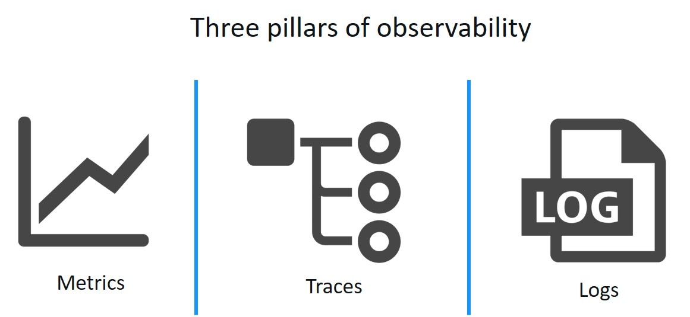
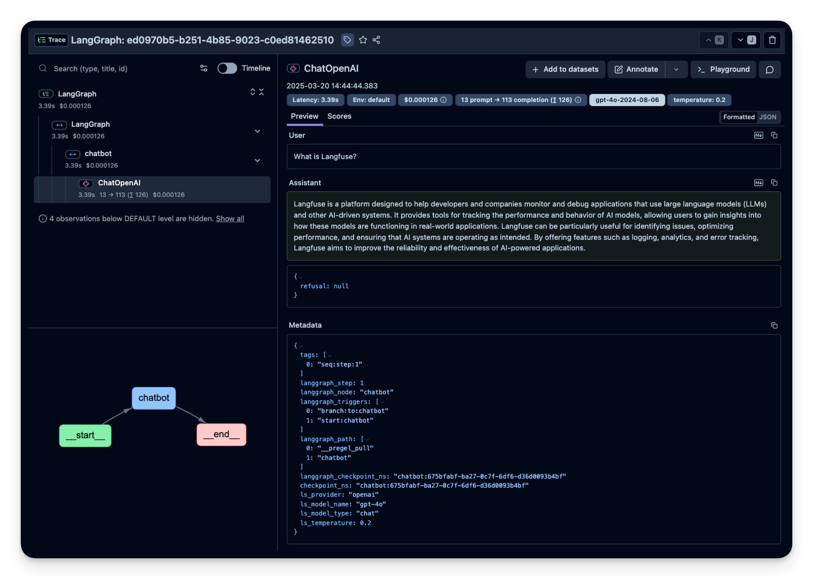
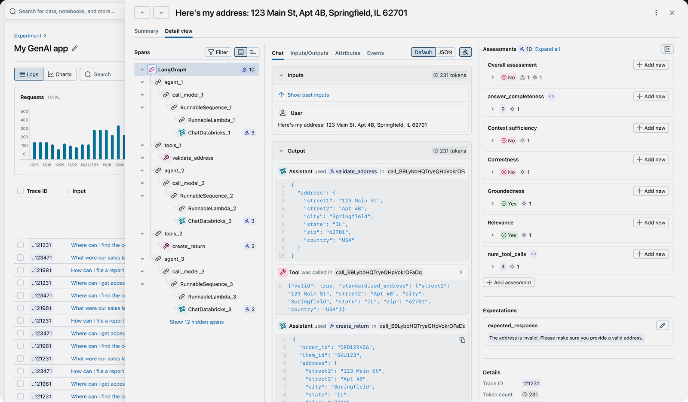
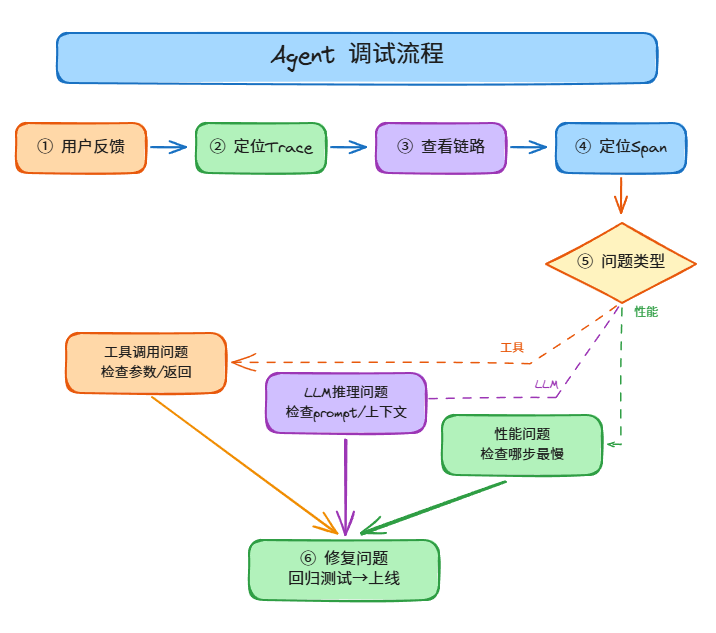

# Agent 可观测性与调试：怎么知道 Agent 内部发生了什么

> Agent 系列 · 第 4 篇 | 从"黑盒猜谜"到"全链路透视"：Agent 可观测性的三大支柱、调试方法与工程实践

---

你的 Agent 在线上跑着，用户反馈"回答不对"。你打开日志，只看到一行"Agent 返回了结果"——中间调了哪些工具、推理了几个步骤、哪一步出了问题，完全看不到。

**这就是没有可观测性的 Agent——出了问题你只能猜。** 本文从可观测性的三大支柱（Tracing、Logging、Metrics）出发，讲清楚怎么给 Agent 装上"透明管道"，让每一次执行都可追溯、可调试、可监控。

核心观点：**可观测性不是"出问题了再看日志"，而是"让问题在发生时就能被发现和定位"。**

---

## 一、为什么 Agent 比传统应用更需要可观测性

### 1.1 传统应用 vs Agent 的可观测性差异

| 维度 | 传统应用 | Agent |
|------|---------|-------|
| 执行路径 | 确定性（代码写死了流程） | 非确定性（LLM 决定下一步做什么） |
| 调试方式 | 断点调试、日志追踪 | 需要看完整的推理链和工具调用 |
| 错误定位 | 看堆栈跟踪就行 | 需要看推理过程、工具结果、模型输出 |
| 性能瓶颈 | 数据库慢、网络慢 | 模型推理慢、工具调用慢、Token 消耗多 |
| 复杂度 | 单次请求→单次响应 | 多轮推理→多次工具调用→最终响应 |

**大白话：** 传统应用调试像看地图——路线是固定的，哪里堵车一看就知道。Agent 调试像看侦探小说——每次的剧情都不一样，你需要跟着主角（Agent）的思路走一遍，才能知道哪里出了问题。

### 1.2 Agent 可观测性的三大支柱



| 支柱 | 回答的问题 | 例子 | 大白话 |
|------|-----------|------|--------|
| **Tracing** | 这次请求经历了哪些步骤？ | 用户问→LLM推理→调工具A→LLM再推理→调工具B→生成回答 | 看快递物流追踪 |
| **Logging** | 每一步的具体细节是什么？ | 工具A的参数是什么、返回了什么、LLM的prompt是什么 | 看每个环节的详细记录 |
| **Metrics** | 整体表现怎么样？ | 平均延迟3秒、成功率85%、每次花费500 Token | 看医院的运营数据 |

**Tracing 详解：**

Tracing 记录了一次请求的完整执行路径。每个 Trace 包含多个 Span（步骤），Span 之间有父子关系。

```
Trace: "帮我查北京明天的天气"
├── Span 1: 用户输入处理 (10ms)
├── Span 2: LLM 推理 (1200ms)
│   ├── Input: "用户问北京明天天气，我需要调用天气API"
│   └── Output: "调用 get_weather(city='北京', date='明天')"
├── Span 3: 工具调用 - get_weather (300ms)
│   ├── Input: {city: "北京", date: "明天"}
│   └── Output: {temp: 25, weather: "晴", wind: "微风"}
├── Span 4: LLM 推理 (800ms)
│   ├── Input: "天气API返回了结果，需要组织成自然语言"
│   └── Output: "北京明天天气晴朗，气温25℃，微风"
└── 总耗时: 2310ms, Token: 450, 成本: $0.002
```

**Logging 详解：**

Agent 日志必须是结构化的，包含 trace_id 把同一次请求的所有日志串起来。

```json
{
  "timestamp": "2026-06-09T10:00:03Z",
  "trace_id": "abc123",
  "step": 3,
  "type": "tool_call",
  "tool": "get_weather",
  "params": {"city": "北京", "date": "明天"},
  "result": {"temp": 25, "weather": "晴"},
  "latency": "300ms",
  "status": "success"
}
```

**Metrics 详解：**

Metrics 是聚合统计数据，告诉你"整体怎么样"而不是"某次怎么样"。

| 指标类型 | 例子 | 用途 |
|---------|------|------|
| 计数器（Counter） | 总请求数、总错误数 | 监控总量 |
| 仪表（Gauge） | 当前并发数、队列长度 | 监控实时状态 |
| 直方图（Histogram） | 延迟分布、Token 分布 | 监控分布和百分位 |

**大白话：**
- **Tracing** = 你去医院看病的病历——记录了你从挂号→问诊→检查→取药的完整流程
- **Logging** = 每个环节的详细记录——验血报告、X光片、医生的诊断笔记
- **Metrics** = 医院的运营数据——平均等待时间、每天接诊量、治愈率

---

## 二、Tracing：链路追踪

### 2.1 什么是 Agent Trace

Trace（追踪）记录了 Agent 从接收请求到返回结果的完整执行路径。每一次 Trace 就像一个"执行故事"，告诉你 Agent 是怎么一步步完成任务的。

**Trace 的结构：**

```
Trace: "帮我查北京明天的天气"
├── Span 1: 用户输入处理 (10ms)
├── Span 2: LLM 推理 (1200ms)
│   ├── Input: "用户问北京明天天气，我需要调用天气API"
│   └── Output: "调用 get_weather(city='北京', date='明天')"
├── Span 3: 工具调用 - get_weather (300ms)
│   ├── Input: {city: "北京", date: "明天"}
│   └── Output: {temp: 25, weather: "晴", wind: "微风"}
├── Span 4: LLM 推理 (800ms)
│   ├── Input: "天气API返回了结果，需要组织成自然语言"
│   └── Output: "北京明天天气晴朗，气温25℃，微风"
└── 总耗时: 2310ms, Token: 450, 成本: $0.002
```

**大白话：** Trace 就像快递物流追踪——你下单后可以看到"已揽收→运输中→派送中→已签收"的完整流程。每个节点都有时间戳和详细信息。

### 2.2 Trace 的关键信息

| 信息 | 说明 | 为什么重要 |
|------|------|-----------|
| **Trace ID** | 唯一标识一次请求 | 出问题时用它定位具体是哪次执行 |
| **时间戳** | 每个步骤的开始和结束时间 | 定位性能瓶颈 |
| **Span 层级** | 父子关系（哪个步骤调用了哪个步骤） | 理解执行流程 |
| **Input/Output** | 每个步骤的输入和输出 | 验证数据是否正确 |
| **Token 消耗** | 每次 LLM 调用消耗的 Token 数 | 监控成本 |
| **模型参数** | temperature、model 等参数 | 排查模型配置问题 |
| **错误信息** | 如果某步出错，记录错误详情 | 快速定位问题 |

### 2.3 Trace 可视化界面



**Trace 界面的核心功能：**

| 区域 | 功能 | 大白话 |
|------|------|--------|
| 左侧调用树 | 展示完整的执行层级 | 看整个故事的目录 |
| 中间详情区 | 展示选中步骤的输入输出 | 看某一章的详细内容 |
| 右侧元数据 | 展示 Token、延迟、成本等 | 看这一章花了多少钱 |
| 底部流程图 | 可视化执行路径 | 看故事的流程图 |

### 2.4 主流 Tracing 工具对比

| 工具 | 类型 | 特点 | 适用场景 |
|------|------|------|---------|
| **LangSmith** | SaaS | LangChain 官方，集成最好 | LangChain/LangGraph 项目 |
| **LangFuse** | 开源/SaaS | 开源替代 LangSmith，支持多框架 | 需要自部署或多框架项目 |
| **OpenTelemetry** | 标准 | 通用可观测性标准，厂商中立 | 已有 OTel 基础设施的团队 |
| **Arize Phoenix** | 开源 | 专注 LLM 可观测性 | 需要 LLM 专属分析 |
| **Helicone** | SaaS | 轻量级，一行代码集成 | 快速接入 |
| **MLflow** | 开源 | MLflow 2.0+ 支持 LLM 追踪 | 已用 MLflow 的 ML 团队 |

**选型建议：**

```
你用 LangChain/LangGraph → LangSmith（集成最无缝）
你需要开源方案 → LangFuse 或 Arize Phoenix
你已有 OTel 基础设施 → OpenTelemetry + 后端（Jaeger/Tempo）
你要快速验证 → Helicone（一行代码集成）
你用 Databricks → MLflow Tracing
```

---

## 三、Logging：结构化日志

### 3.1 Agent 日志 vs 传统日志

传统应用日志：
```
2026-06-09 10:00:01 INFO  UserService - User login: user_id=12345
2026-06-09 10:00:02 INFO  OrderService - Order created: order_id=67890
```

Agent 日志：
```
2026-06-09 10:00:01 INFO  Agent - trace_id=abc123 step=1 type=user_input content="帮我查天气"
2026-06-09 10:00:02 INFO  Agent - trace_id=abc123 step=2 type=llm_call model=gpt-4o tokens=150 latency=1200ms
2026-06-09 10:00:03 INFO  Agent - trace_id=abc123 step=3 type=tool_call tool=get_weather params={city:"北京"} result={temp:25} latency=300ms
2026-06-09 10:00:04 INFO  Agent - trace_id=abc123 step=4 type=llm_call model=gpt-4o tokens=200 latency=800ms
2026-06-09 10:00:04 INFO  Agent - trace_id=abc123 type=response content="北京明天天气晴朗，气温25℃" total_latency=2300ms total_tokens=350
```

**关键区别：** Agent 日志必须包含 `trace_id`，否则你无法把一次请求的所有日志串起来。

### 3.2 Agent 日志的结构化字段

| 字段 | 说明 | 例子 |
|------|------|------|
| `trace_id` | 追踪 ID，关联同一次请求的所有日志 | `abc123` |
| `step` | 步骤编号 | `1, 2, 3...` |
| `type` | 日志类型 | `user_input, llm_call, tool_call, response, error` |
| `timestamp` | 时间戳 | `2026-06-09T10:00:01Z` |
| `latency` | 耗时 | `1200ms` |
| `tokens` | Token 消耗 | `150` |
| `model` | 使用的模型 | `gpt-4o` |
| `tool` | 调用的工具名 | `get_weather` |
| `params` | 工具参数 | `{city: "北京"}` |
| `result` | 工具返回结果 | `{temp: 25, weather: "晴"}` |
| `error` | 错误信息 | `API timeout` |
| `user_id` | 用户 ID | `user_12345` |

### 3.3 日志级别策略

| 级别 | 什么时候用 | 内容 |
|------|-----------|------|
| **DEBUG** | 开发调试时 | 完整的 prompt、模型输出、工具原始返回 |
| **INFO** | 正常运行时 | 每步的关键信息（类型、耗时、Token） |
| **WARN** | 需要关注但不是错误 | Token 超过阈值、延迟偏高、重试成功 |
| **ERROR** | 出错了 | 工具调用失败、模型返回异常、任务中断 |

**大白话：**
- DEBUG = 你调试代码时的 `console.log`，上线后关掉
- INFO = 正常的业务日志，记录关键操作
- WARN = "注意一下，可能有问题"
- ERROR = "出事了，赶紧看"

### 3.4 日志存储与查询

| 方案 | 适用规模 | 查询能力 | 成本 |
|------|---------|---------|------|
| 本地文件 | 开发/测试 | grep 搜索 | 低 |
| ELK Stack | 中大规模 | 全文检索、聚合分析 | 中 |
| Loki + Grafana | 中大规模 | 标签查询、轻量级 | 低 |
| Datadog | 企业级 | 全栈可观测性 | 高 |
| ClickHouse | 大规模 | 高性能分析查询 | 中 |

---

## 四、Metrics：监控指标

### 4.1 Agent 监控的核心指标



| 类别 | 指标 | 计算方式 | 目标 | 大白话 |
|------|------|---------|------|--------|
| **性能** | 响应延迟 P50 | 50% 请求的延迟 | < 3 秒 | 一般要等多久 |
| **性能** | 响应延迟 P99 | 99% 请求的延迟 | < 10 秒 | 最慢要等多久 |
| **性能** | 吞吐量 | 每秒处理的请求数 | 依业务定 | 每秒能处理多少 |
| **质量** | 任务成功率 | 成功数/总数 | > 80% | 做成了多少 |
| **质量** | 工具调用成功率 | 成功调用数/总调用 | > 95% | 工具有没有报错 |
| **质量** | 用户满意度 | 用户打分 | > 4.0 | 用户满不满意 |
| **成本** | Token 消耗/请求 | 总 Token/请求数 | 越低越好 | 每次要花多少钱 |
| **成本** | LLM 调用成本 | 总费用 | 预算内 | 一共花了多少钱 |
| **错误** | 错误率 | 错误数/总数 | < 5% | 出错的频率 |
| **错误** | 重试率 | 重试数/总数 | < 10% | 需要重试的频率 |

### 4.2 指标的监控策略

| 指标 | 监控方式 | 告警阈值 | 大白话 |
|------|---------|---------|--------|
| 延迟 P50 | 实时监控 | > 5 秒告警 | 等太久要报警 |
| 错误率 | 滑动窗口（5分钟） | > 10% 告警 | 出错太多要报警 |
| Token 成本 | 每小时汇总 | 超预算 20% 告警 | 花钱太多要报警 |
| 工具调用失败 | 连续失败计数 | 连续 3 次告警 | 工具挂了要报警 |
| 用户满意度 | 每日汇总 | < 3.5 告警 | 用户不满意要报警 |

### 4.3 告警规则设计

**告警的黄金法则：**

1. **可操作**：收到告警后，你知道该做什么
2. **不打扰**：不是每个波动都需要告警，只告真正的问题
3. **分级处理**：P0（立即处理）、P1（1小时内处理）、P2（当天处理）

**告警示例：**

| 级别 | 条件 | 通知方式 | 处理方式 |
|------|------|---------|---------|
| P0 | 错误率 > 50% 持续 5 分钟 | 电话 + 短信 | 立即排查，可能需要回滚 |
| P1 | 错误率 > 20% 持续 10 分钟 | 飞书/钉钉通知 | 1 小时内排查 |
| P2 | 延迟 P99 > 15 秒 | 邮件通知 | 当天排查 |
| P3 | Token 成本超预算 10% | 每日报告 | 本周优化 |

---

## 五、调试工作流

### 5.1 Agent 调试的典型场景

| 场景 | 现象 | 调试思路 |
|------|------|---------|
| **回答错误** | Agent 给出了错误的答案 | 查看推理链，找到哪一步推理出错 |
| **工具调用失败** | Agent 调用工具报错 | 查看工具参数、工具返回的错误信息 |
| **响应超时** | Agent 等了很久才回复 | 查看哪一步最慢（通常是 LLM 调用） |
| **Token 超限** | 一次请求消耗了太多 Token | 查看 prompt 是否过长、是否有循环推理 |
| **死循环** | Agent 一直在重复同样的步骤 | 查看推理链，找到循环点 |
| **幻觉** | Agent 编造了不存在的信息 | 查看 RAG 检索结果、工具返回的数据 |

### 5.2 调试流程



> ▲ Agent调试流程：① 用户反馈 → ② 定位Trace → ③ 查看执行链路 → ④ 定位问题Span → ⑤ 分支诊断 → ⑥ 修复上线

**调试流程详解：**

| 步骤 | 操作 | 工具/方法 | 大白话 |
|------|------|----------|--------|
| 1. 用户反馈 | 收集用户投诉或监控告警 | 用户反馈系统、告警通知 | 收到投诉 |
| 2. 定位 Trace | 通过用户ID、时间、关键词找到对应 Trace | LangSmith/LangFuse 搜索 | 找到病历 |
| 3. 查看执行链路 | 看 Trace 的调用树，了解 Agent 执行了哪些步骤 | Trace 可视化界面 | 看就诊记录 |
| 4. 定位问题 Span | 找到出错或耗时最长的 Span | 查看各 Span 的状态和耗时 | 找到病因 |
| 5. 分支诊断 | 根据问题类型深入排查 | 见下方分支说明 | 对症下药 |
| 6. 修复上线 | 修复问题，回归测试，重新部署 | CI/CD 流水线 | 治疗康复 |

**分支诊断详解：**

| 问题类型 | 排查方向 | 检查内容 | 大白话 |
|---------|---------|---------|--------|
| **工具调用问题** | 检查工具参数、返回、可用性 | 参数格式对不对？API 有没有挂？返回数据对不对？ | 工具坏了还是用错了？ |
| **LLM 推理问题** | 检查 prompt、上下文、模型配置 | prompt 写得清楚吗？上下文够吗？模型选对了吗？ | AI 的脑子出问题了？ |
| **性能问题** | 检查哪步最慢、是否有重试 | 哪个 Span 耗时最长？有没有重复调用？ | 哪里卡住了？ |
| **成本问题** | 检查 Token 消耗、是否有冗余调用 | prompt 是否过长？有没有循环调用？ | 花钱太多了？ |

### 5.3 调试案例

**案例1：Agent 回答"我不知道"**

```
用户: "帮我查一下订单 #12345 的状态"
Agent: "抱歉，我无法查询订单状态"

调试过程:
1. 查看 Trace → 发现 Agent 没有调用任何工具
2. 查看 LLM 推理 → Agent 认为"没有可用的订单查询工具"
3. 检查工具列表 → 发现 get_order_status 工具的描述写得太模糊
4. 修复: 优化工具描述，明确说明"查询订单状态"
```

**案例2：Agent 调用了错误的工具**

```
用户: "帮我发邮件给张三"
Agent: 调用了 send_message 而不是 send_email

调试过程:
1. 查看 Trace → Agent 调用了 send_message
2. 查看工具列表 → send_message 和 send_email 描述很相似
3. 原因: 工具描述有歧义，Agent 分不清
4. 修复: 区分工具描述，send_message="发即时消息"，send_email="发邮件"
```

**案例3：Agent 响应超时**

```
用户: "帮我总结这篇文章"
Agent: 等了 30 秒才回复

调试过程:
1. 查看 Trace → 总耗时 30 秒
2. 查看各步骤耗时 → LLM 调用 1: 2 秒, 工具调用: 1 秒, LLM 调用 2: 27 秒
3. 原因: 第二次 LLM 调用输入了 5000 Token 的文章内容
4. 修复: 先用工具截取文章摘要，再让 LLM 总结
```

**案例4：Agent 陷入死循环**

```
用户: "帮我找最近的餐厅"
Agent: 一直在搜索，没有返回结果

调试过程:
1. 查看 Trace → 发现有 20 个相同的搜索 Span
2. 原因: 搜索返回了 0 结果，Agent 换了关键词继续搜，循环了 20 次
3. 修复: 添加最大重试次数限制（3 次），超过后告诉用户"没找到"
```

---

## 六、可观测性平台对比

| 平台 | 类型 | 核心功能 | 适用场景 | 大白话 |
|------|------|---------|---------|--------|
| **LangSmith** | SaaS | Trace + 评测 + 数据集 | LangChain 项目 | LangChain 的官方调试器 |
| **LangFuse** | 开源/SaaS | Trace + 评测 + Prompt 管理 | 多框架项目 | 开源版 LangSmith |
| **Arize Phoenix** | 开源 | Trace + 评估 + 漂移检测 | LLM 专属分析 | LLM 的性能分析师 |
| **Helicone** | SaaS | 一行集成、成本分析 | 快速接入 | 最简单的接入方式 |
| **MLflow** | 开源 | Trace + 实验管理 | ML 团队 | MLflow 的 LLM 扩展 |
| **Datadog** | SaaS | 全栈可观测性 | 企业级 | 什么都能监控 |
| **Grafana + Loki** | 开源 | 日志 + 指标 + 告警 | 自建监控 | 开源监控全家桶 |

**平台功能对比：**

| 功能 | LangSmith | LangFuse | Phoenix | Helicone |
|------|-----------|----------|---------|----------|
| Trace 可视化 | ✅ | ✅ | ✅ | ✅ |
| Token/成本分析 | ✅ | ✅ | ✅ | ✅ |
| 评测集成 | ✅ | ✅ | ✅ | ❌ |
| Prompt 管理 | ✅ | ✅ | ❌ | ❌ |
| 数据集管理 | ✅ | ✅ | ✅ | ❌ |
| 自部署 | ❌ | ✅ | ✅ | ❌ |
| 开源 | ❌ | ✅ | ✅ | ❌ |
| 多框架支持 | 中 | 高 | 高 | 高 |

---

## 七、可观测性工程实践

### 7.1 接入成本

| 方案 | 接入时间 | 代码改动 | 维护成本 |
|------|---------|---------|---------|
| LangSmith | 30 分钟 | 3 行代码 | 低（SaaS 托管） |
| LangFuse | 1 小时 | 5 行代码 | 中（需自部署） |
| OpenTelemetry | 2-4 小时 | 10+ 行代码 | 中（需配置后端） |
| 自建 | 1-2 周 | 大量代码 | 高（需维护） |

**LangSmith 接入示例（3 行代码）：**

```python
import os
os.environ["LANGCHAIN_TRACING_V2"] = "true"
os.environ["LANGCHAIN_API_KEY"] = "your-api-key"

# 之后所有的 LangChain 调用都会自动记录 Trace
from langchain.agents import create_agent
agent = create_agent(...)
agent.invoke({"input": "帮我查天气"})  # 自动记录 Trace
```

**LangFuse 接入示例（5 行代码）：**

```python
from langfuse import Langfuse
from langfuse.decorators import observe

langfuse = Langfuse(public_key="pk-...", secret_key="sk-...")

@observe()  # 装饰器自动记录 Trace
def my_agent(input):
    # Agent 逻辑
    return response
```

### 7.2 可观测性 Checklist

设计 Agent 可观测性时，用这个清单逐项检查：

```
□ Trace — 每次请求有完整的执行链路记录吗？
□ Span — 每个步骤（LLM调用、工具调用）都有独立的Span吗？
□ 时间戳 — 每个步骤的开始和结束时间都记录了吗？
□ Token — 每次LLM调用的Token消耗都记录了吗？
□ Input/Output — 每个步骤的输入和输出都记录了吗？
□ 错误信息 — 出错时记录了完整的错误信息吗？
□ Trace ID — 所有日志都关联了同一个Trace ID吗？
□ 用户标识 — 能通过用户ID找到对应的Trace吗？
□ 告警规则 — 关键指标设置了告警吗？
□ 采样策略 — 高流量时是否需要采样？采样率设多少？
□ 数据保留 — Trace数据保留多久？有清理策略吗？
□ 隐私合规 — 敏感信息（密码、Token）有脱敏吗？
```

### 7.3 常见踩坑

| 坑 | 现象 | 解决 |
|----|------|------|
| **Trace 不完整** | 只记录了 LLM 调用，没记录工具调用 | 确保所有步骤都插桩 |
| **日志太多** | 每秒产生 10 万条日志，存储爆了 | 采样 + 分级存储 |
| **Trace ID 丢失** | 异步调用后 Trace ID 断了 | 用 Context Propagation 传递 Trace ID |
| **敏感信息泄露** | 日志里记录了用户的密码 | 脱敏处理，敏感字段不记录 |
| **性能开销** | 记录 Trace 导致延迟增加 50ms | 异步写入，不阻塞主流程 |
| **告警疲劳** | 每天收到 100 条告警，都麻木了 | 提高告警阈值，只告真正的问题 |

---

## 八、面试高频题

### Q1：Agent 可观测性的三大支柱是什么？

**参考答案：**

| 支柱 | 回答的问题 | 核心内容 |
|------|-----------|---------|
| **Tracing** | 这次请求经历了哪些步骤？ | 链路追踪，记录完整的执行路径 |
| **Logging** | 每一步的具体细节是什么？ | 结构化日志，记录每步的输入输出 |
| **Metrics** | 整体表现怎么样？ | 监控指标，聚合统计性能和质量 |

三者的关系：Tracing 告诉你"发生了什么"，Logging 告诉你"细节是什么"，Metrics 告诉你"整体怎么样"。

### Q2：如何调试一个"回答错误"的 Agent？

**参考答案：**

1. **定位 Trace**：通过用户反馈找到对应的 Trace ID
2. **查看执行链路**：看 Agent 调用了哪些工具、推理了几步
3. **检查推理过程**：看 LLM 的 Thought 是否合理
4. **检查工具调用**：看工具参数是否正确、返回结果是否准确
5. **检查上下文**：看 RAG 检索的内容是否相关、是否有噪声
6. **修复并验证**：修复问题后用相同 case 验证

### Q3：LangSmith 和 LangFuse 怎么选？

**参考答案：**

| 维度 | LangSmith | LangFuse |
|------|-----------|----------|
| 部署方式 | SaaS（只能云端） | 开源（可自部署） |
| 框架支持 | LangChain 最好 | 多框架通用 |
| 功能完整性 | 更丰富（评测、数据集） | 核心功能齐全 |
| 成本 | 按使用量付费 | 自部署免费 |
| 数据隐私 | 数据在 LangChain 云端 | 数据在自己服务器 |

选择建议：
- 你用 LangChain 且不介意数据上云 → LangSmith
- 你需要数据隐私或多框架支持 → LangFuse
- 你已有 OTel 基础设施 → OpenTelemetry

### Q4：如何设计 Agent 的告警规则？

**参考答案：**

三个原则：
1. **可操作**：收到告警后你知道该做什么
2. **不打扰**：只告真正的问题，不告噪音
3. **分级处理**：P0（立即）、P1（1小时）、P2（当天）

具体规则：
- P0：错误率 > 50% 持续 5 分钟 → 电话告警
- P1：错误率 > 20% 持续 10 分钟 → 飞书通知
- P2：延迟 P99 > 15 秒 → 邮件通知
- P3：Token 成本超预算 → 每日报告

### Q5：如何在不增加太多延迟的情况下实现 Trace？

**参考答案：**

关键策略：**异步写入，不阻塞主流程**

```
Agent 执行步骤 → 生成 Span 数据 → 放入队列（不阻塞）
                                    ↓
                              后台线程异步写入 Trace 存储
```

具体方案：
1. **内存队列**：Span 先写入内存队列，后台批量发送
2. **异步 HTTP**：用 aiohttp 异步发送 Trace 数据
3. **采样**：高流量时只记录 10% 的 Trace
4. **批量发送**：攒够 100 条 Span 再一起发，减少网络开销

---

## 九、延伸阅读

| 资源 | 说明 |
|------|------|
| [LangSmith 文档](https://docs.smith.langchain.com/) | LangChain 官方可观测性平台 |
| [LangFuse 文档](https://langfuse.com/docs) | 开源 LLM 可观测性平台 |
| [OpenTelemetry 文档](https://opentelemetry.io/) | 通用可观测性标准 |
| [Arize Phoenix](https://phoenix.arize.com/) | 开源 LLM 可观测性 |
| [Google: Observability for Generative AI](https://cloud.google.com/transform/genai-observability) | Google 的 GenAI 可观测性指南 |
| 本仓库 [Agent架构选型](./01-2026年Agent架构选型-8种模式的组合与取舍.md) | 架构模式中的可观测性维度 |

---

## 十、小结

| 要点 | 核心内容 |
|------|---------|
| 三大支柱 | Tracing（追踪）+ Logging（日志）+ Metrics（指标） |
| Trace 关键信息 | Trace ID、时间戳、Span 层级、Input/Output、Token |
| 核心监控指标 | 延迟 P50/P99、成功率、Token 成本、错误率 |
| 调试流程 | 找 Trace → 看执行链路 → 定位问题 Span → 检查细节 → 修复 |
| 工具选型 | LangSmith（LangChain）、LangFuse（开源）、OpenTelemetry（标准） |
| 关键策略 | 异步写入 Trace、结构化日志、分级告警 |

**一句话总结：Agent 可观测性 = 完整的 Trace 链路 + 结构化的日志 + 实时的指标监控 + 及时的告警通知。**
