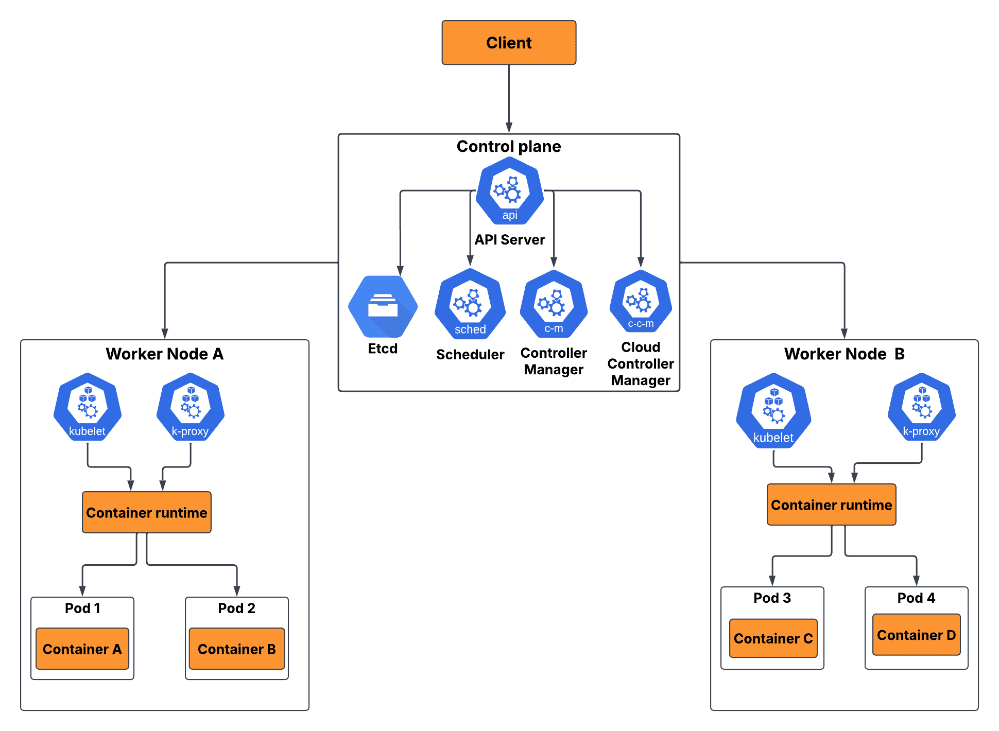

# Agent 部署与运维：容器化、CI/CD、监控与生产最佳实践

> 本文覆盖 Agent 应用从开发到生产的完整部署链路，包括容器化、CI/CD、监控告警、日志收集、高可用架构等核心主题。



---

## 一、为什么 Agent 部署比传统应用更复杂

### 1.1 Agent 应用的特殊性

| 特性 | 传统 Web 应用 | Agent 应用 |
|------|-------------|-----------|
| **请求处理** | 同步、毫秒级 | 异步、秒到分钟级 |
| **资源消耗** | CPU/内存为主 | GPU/Token 为主 |
| **外部依赖** | 数据库、缓存 | LLM API、向量数据库、工具链 |
| **状态管理** | 无状态/会话状态 | 长对话状态、记忆系统 |
| **错误模式** | 代码异常 | API 超时、Token 耗尽、模型幻觉 |
| **成本模型** | 固定基础设施 | 按 Token 计费、波动大 |

### 1.2 部署挑战

1. **长时运行**：Agent 处理复杂任务可能需要数分钟，传统 HTTP 超时不够
2. **外部依赖多**：LLM API、向量数据库、MCP Server 等，任一环节故障都会影响服务
3. **成本不可预测**：Token 消耗随用户行为波动，难以精确预算
4. **状态管理复杂**：多轮对话需要维护会话状态，不能简单做无状态部署
5. **安全要求高**：Agent 可能执行代码、访问敏感数据，需要严格隔离

---

## 二、容器化部署

### 2.1 Docker 镜像构建

#### 基础 Dockerfile

```dockerfile
# 基础镜像
FROM python:3.11-slim

# 设置工作目录
WORKDIR /app

# 安装系统依赖
RUN apt-get update && apt-get install -y \
    curl \
    git \
    && rm -rf /var/lib/apt/lists/*

# 复制依赖文件
COPY requirements.txt .

# 安装 Python 依赖
RUN pip install --no-cache-dir -r requirements.txt

# 复制应用代码
COPY . .

# 创建非 root 用户
RUN useradd -m -u 1000 agent && chown -R agent:agent /app
USER agent

# 暴露端口
EXPOSE 8000

# 健康检查
HEALTHCHECK --interval=30s --timeout=10s --start-period=5s --retries=3 \
    CMD curl -f http://localhost:8000/health || exit 1

# 启动命令
CMD ["uvicorn", "main:app", "--host", "0.0.0.0", "--port", "8000"]
```

#### requirements.txt

```txt
# 核心依赖
openai>=1.0.0
openai-agents>=0.1.0
langchain>=0.2.0

# Web 框架
fastapi>=0.110.0
uvicorn>=0.29.0

# 数据库
redis>=5.0.0
sqlalchemy>=2.0.0

# 监控
prometheus-client>=0.20.0
structlog>=24.0.0

# 工具
python-dotenv>=1.0.0
httpx>=0.27.0
```

### 2.2 Docker Compose 配置

```yaml
version: '3.8'

services:
  # Agent 应用
  agent-app:
    build: .
    ports:
      - "8000:8000"
    environment:
      - OPENAI_API_KEY=${OPENAI_API_KEY}
      - REDIS_URL=redis://redis:6379
      - DATABASE_URL=postgresql://postgres:password@db:5432/agent_db
    depends_on:
      - redis
      - db
      - prometheus
    restart: unless-stopped
    deploy:
      resources:
        limits:
          memory: 2G
          cpus: '2.0'
    healthcheck:
      test: ["CMD", "curl", "-f", "http://localhost:8000/health"]
      interval: 30s
      timeout: 10s
      retries: 3

  # Redis（缓存和会话存储）
  redis:
    image: redis:7-alpine
    ports:
      - "6379:6379"
    volumes:
      - redis_data:/data
    restart: unless-stopped

  # PostgreSQL（持久化存储）
  db:
    image: postgres:16-alpine
    environment:
      - POSTGRES_PASSWORD=password
      - POSTGRES_DB=agent_db
    volumes:
      - postgres_data:/var/lib/postgresql/data
    restart: unless-stopped

  # Prometheus（监控）
  prometheus:
    image: prom/prometheus:latest
    ports:
      - "9090:9090"
    volumes:
      - ./prometheus.yml:/etc/prometheus/prometheus.yml
    restart: unless-stopped

  # Grafana（可视化）
  grafana:
    image: grafana/grafana:latest
    ports:
      - "3000:3000"
    environment:
      - GF_SECURITY_ADMIN_PASSWORD=admin
    restart: unless-stopped

volumes:
  redis_data:
  postgres_data:
```

### 2.3 Kubernetes 部署

#### Deployment 配置

```yaml
apiVersion: apps/v1
kind: Deployment
metadata:
  name: agent-app
  labels:
    app: agent-app
spec:
  replicas: 3
  selector:
    matchLabels:
      app: agent-app
  template:
    metadata:
      labels:
        app: agent-app
    spec:
      containers:
      - name: agent-app
        image: your-registry/agent-app:latest
        ports:
        - containerPort: 8000
        env:
        - name: OPENAI_API_KEY
          valueFrom:
            secretKeyRef:
              name: agent-secrets
              key: openai-api-key
        - name: REDIS_URL
          value: "redis://redis-service:6379"
        resources:
          requests:
            memory: "512Mi"
            cpu: "500m"
          limits:
            memory: "2Gi"
            cpu: "2000m"
        livenessProbe:
          httpGet:
            path: /health
            port: 8000
          initialDelaySeconds: 30
          periodSeconds: 10
        readinessProbe:
          httpGet:
            path: /ready
            port: 8000
          initialDelaySeconds: 5
          periodSeconds: 5
---
apiVersion: v1
kind: Service
metadata:
  name: agent-service
spec:
  selector:
    app: agent-app
  ports:
  - port: 80
    targetPort: 8000
  type: ClusterIP
---
apiVersion: autoscaling/v2
kind: HorizontalPodAutoscaler
metadata:
  name: agent-hpa
spec:
  scaleTargetRef:
    apiVersion: apps/v1
    kind: Deployment
    name: agent-app
  minReplicas: 2
  maxReplicas: 10
  metrics:
  - type: Resource
    resource:
      name: cpu
      target:
        type: Utilization
        averageUtilization: 70
  - type: Resource
    resource:
      name: memory
      target:
        type: Utilization
        averageUtilization: 80
```

#### Secret 配置

```yaml
apiVersion: v1
kind: Secret
metadata:
  name: agent-secrets
type: Opaque
data:
  openai-api-key: c2steC4uLm4=  # base64 编码
```

---

## 三、CI/CD 流水线

### 3.1 GitHub Actions 工作流

```yaml
name: Agent App CI/CD

on:
  push:
    branches: [main]
  pull_request:
    branches: [main]

env:
  REGISTRY: ghcr.io
  IMAGE_NAME: ${{ github.repository }}

jobs:
  # 测试阶段
  test:
    runs-on: ubuntu-latest
    steps:
    - uses: actions/checkout@v4
    
    - name: Set up Python
      uses: actions/setup-python@v5
      with:
        python-version: '3.11'
    
    - name: Install dependencies
      run: |
        pip install -r requirements.txt
        pip install pytest pytest-asyncio
    
    - name: Run tests
      run: pytest tests/ -v --cov=app --cov-report=xml
    
    - name: Upload coverage
      uses: codecov/codecov-action@v3

  # 安全扫描
  security:
    runs-on: ubuntu-latest
    steps:
    - uses: actions/checkout@v4
    
    - name: Run Trivy vulnerability scanner
      uses: aquasecurity/trivy-action@master
      with:
        scan-type: 'fs'
        scan-ref: '.'
        format: 'table'
        exit-code: '1'
        severity: 'CRITICAL,HIGH'

  # 构建和推送镜像
  build:
    needs: [test, security]
    runs-on: ubuntu-latest
    if: github.event_name == 'push' && github.ref == 'refs/heads/main'
    
    steps:
    - uses: actions/checkout@v4
    
    - name: Log in to Container Registry
      uses: docker/login-action@v3
      with:
        registry: ${{ env.REGISTRY }}
        username: ${{ github.actor }}
        password: ${{ secrets.GITHUB_TOKEN }}
    
    - name: Build and push Docker image
      uses: docker/build-push-action@v5
      with:
        context: .
        push: true
        tags: |
          ${{ env.REGISTRY }}/${{ env.IMAGE_NAME }}:latest
          ${{ env.REGISTRY }}/${{ env.IMAGE_NAME }}:${{ github.sha }}

  # 部署到 Kubernetes
  deploy:
    needs: build
    runs-on: ubuntu-latest
    if: github.event_name == 'push' && github.ref == 'refs/heads/main'
    
    steps:
    - uses: actions/checkout@v4
    
    - name: Set up kubectl
      uses: azure/setup-kubectl@v3
    
    - name: Configure kubeconfig
      run: |
        mkdir -p $HOME/.kube
        echo "${{ secrets.KUBECONFIG }}" | base64 -d > $HOME/.kube/config
    
    - name: Deploy to Kubernetes
      run: |
        kubectl set image deployment/agent-app \
          agent-app=${{ env.REGISTRY }}/${{ env.IMAGE_NAME }}:${{ github.sha }}
        kubectl rollout status deployment/agent-app
```

### 3.2 部署策略

#### 蓝绿部署

```yaml
# 蓝绿部署配置
apiVersion: apps/v1
kind: Deployment
metadata:
  name: agent-app-green
spec:
  replicas: 3
  selector:
    matchLabels:
      app: agent-app
      version: green
  template:
    metadata:
      labels:
        app: agent-app
        version: green
    spec:
      containers:
      - name: agent-app
        image: your-registry/agent-app:v2.0.0
```

#### 金丝雀发布

```yaml
# 金丝雀发布 - 逐步增加新版本流量
apiVersion: networking.istio.io/v1alpha3
kind: VirtualService
metadata:
  name: agent-app
spec:
  hosts:
  - agent-app
  http:
  - route:
    - destination:
        host: agent-app
        subset: stable
      weight: 90
    - destination:
        host: agent-app
        subset: canary
      weight: 10
```

---

## 四、监控与告警

### 4.1 Prometheus 监控配置

```yaml
# prometheus.yml
global:
  scrape_interval: 15s

scrape_configs:
  - job_name: 'agent-app'
    static_configs:
    - targets: ['agent-app:8000']
    metrics_path: /metrics
```

### 4.2 应用指标埋点

```python
from prometheus_client import Counter, Histogram, Gauge, generate_latest
from fastapi import FastAPI, Response
import time

app = FastAPI()

# 定义指标
REQUEST_COUNT = Counter(
    'agent_requests_total',
    'Total number of requests',
    ['method', 'endpoint', 'status']
)

REQUEST_LATENCY = Histogram(
    'agent_request_duration_seconds',
    'Request latency in seconds',
    ['method', 'endpoint']
)

ACTIVE_CONVERSATIONS = Gauge(
    'agent_active_conversations',
    'Number of active conversations'
)

TOKEN_USAGE = Counter(
    'agent_token_usage_total',
    'Total token usage',
    ['model', 'type']  # type: input/output
)

LLM_API_LATENCY = Histogram(
    'agent_llm_api_duration_seconds',
    'LLM API call latency',
    ['model']
)

# 中间件
@app.middleware("http")
async def monitor_requests(request, call_next):
    start_time = time.time()
    
    response = await call_next(request)
    
    duration = time.time() - start_time
    REQUEST_COUNT.labels(
        method=request.method,
        endpoint=request.url.path,
        status=response.status_code
    ).inc()
    REQUEST_LATENCY.labels(
        method=request.method,
        endpoint=request.url.path
    ).observe(duration)
    
    return response

# 指标端点
@app.get("/metrics")
async def metrics():
    return Response(
        content=generate_latest(),
        media_type="text/plain"
    )
```

### 4.3 Grafana 仪表盘

```json
{
  "dashboard": {
    "title": "Agent 应用监控",
    "panels": [
      {
        "title": "请求速率",
        "targets": [
          {
            "expr": "rate(agent_requests_total[5m])",
            "legendFormat": "{{method}} {{endpoint}}"
          }
        ]
      },
      {
        "title": "响应延迟 P95",
        "targets": [
          {
            "expr": "histogram_quantile(0.95, rate(agent_request_duration_seconds_bucket[5m]))",
            "legendFormat": "{{method}} {{endpoint}}"
          }
        ]
      },
      {
        "title": "活跃会话数",
        "targets": [
          {
            "expr": "agent_active_conversations",
            "legendFormat": "Active Conversations"
          }
        ]
      },
      {
        "title": "Token 消耗速率",
        "targets": [
          {
            "expr": "rate(agent_token_usage_total[5m])",
            "legendFormat": "{{model}} {{type}}"
          }
        ]
      }
    ]
  }
}
```

### 4.4 告警规则

```yaml
# alert_rules.yml
groups:
  - name: agent-alerts
    rules:
      # 高错误率告警
      - alert: HighErrorRate
        expr: rate(agent_requests_total{status=~"5.."}[5m]) / rate(agent_requests_total[5m]) > 0.05
        for: 5m
        labels:
          severity: critical
        annotations:
          summary: "高错误率告警"
          description: "过去5分钟错误率超过5%"
      
      # 高延迟告警
      - alert: HighLatency
        expr: histogram_quantile(0.95, rate(agent_request_duration_seconds_bucket[5m])) > 30
        for: 5m
        labels:
          severity: warning
        annotations:
          summary: "高延迟告警"
          description: "P95 延迟超过 30 秒"
      
      # LLM API 不可用
      - alert: LLMAPIUnavailable
        expr: up{job="llm-api"} == 0
        for: 1m
        labels:
          severity: critical
        annotations:
          summary: "LLM API 不可用"
          description: "LLM API 已宕机超过 1 分钟"
      
      # Token 消耗异常
      - alert: HighTokenUsage
        expr: rate(agent_token_usage_total[1h]) > 1000000
        for: 10m
        labels:
          severity: warning
        annotations:
          summary: "Token 消耗异常"
          description: "过去1小时 Token 消耗超过 100 万"
```

---

## 五、日志收集与分析

### 5.1 结构化日志

```python
import structlog
import logging

# 配置 structlog
structlog.configure(
    processors=[
        structlog.processors.TimeStamper(fmt="iso"),
        structlog.processors.add_log_level,
        structlog.processors.JSONRenderer()
    ],
    wrapper_class=structlog.BoundLogger,
    context_class=dict,
    logger_factory=structlog.PrintLoggerFactory(),
)

logger = structlog.get_logger()

# 使用示例
async def process_agent_request(user_id: str, message: str):
    log = logger.bind(user_id=user_id)
    
    log.info("收到用户请求", message_length=len(message))
    
    try:
        result = await run_agent(message)
        log.info("请求处理成功", 
                 tokens_used=result.tokens,
                 model=result.model,
                 duration=result.duration)
        return result
    except Exception as e:
        log.error("请求处理失败", error=str(e), error_type=type(e).__name__)
        raise
```

### 5.2 ELK Stack 配置

```yaml
# docker-compose.elk.yml
version: '3.8'

services:
  elasticsearch:
    image: docker.elastic.co/elasticsearch/elasticsearch:8.12.0
    environment:
      - discovery.type=single-node
      - xpack.security.enabled=false
    ports:
      - "9200:9200"
    volumes:
      - elasticsearch_data:/usr/share/elasticsearch/data

  logstash:
    image: docker.elastic.co/logstash/logstash:8.12.0
    volumes:
      - ./logstash.conf:/usr/share/logstash/pipeline/logstash.conf
    depends_on:
      - elasticsearch

  kibana:
    image: docker.elastic.co/kibana/kibana:8.12.0
    ports:
      - "5601:5601"
    depends_on:
      - elasticsearch

volumes:
  elasticsearch_data:
```

### 53 Logstash 配置

```ruby
# logstash.conf
input {
  file {
    path => "/var/log/agent-app/*.log"
    start_position => "beginning"
    codec => json
  }
}

filter {
  # 解析 JSON 日志
  json {
    source => "message"
  }
  
  # 添加字段
  mutate {
    add_field => { "service" => "agent-app" }
  }
  
  # 时间解析
  date {
    match => [ "timestamp", "ISO8601" ]
    target => "@timestamp"
  }
}

output {
  elasticsearch {
    hosts => ["elasticsearch:9200"]
    index => "agent-logs-%{+YYYY.MM.dd}"
  }
}
```

---

## 六、高可用架构

### 6.1 架构设计

```
                    ┌─────────────────┐
                    │   Load Balancer  │
                    │   (Nginx/ALB)    │
                    └────────┬────────┘
                             │
              ┌──────────────┼──────────────┐
              │              │              │
        ┌─────┴─────┐  ┌────┴────┐  ┌─────┴─────┐
        │ Agent Pod  │  │Agent Pod│  │ Agent Pod  │
        │   (v1)     │  │  (v1)   │  │   (v1)     │
        └─────┬─────┘  └────┬────┘  └─────┬─────┘
              │              │              │
              └──────────────┼──────────────┘
                             │
        ┌────────────────────┼────────────────────┐
        │                    │                    │
  ┌─────┴─────┐       ┌─────┴─────┐       ┌─────┴─────┐
  │   Redis    │       │ PostgreSQL│       │  Vector   │
  │  (Cache)   │       │  (State)  │       │    DB     │
  └───────────┘       └───────────┘       └───────────┘
```

### 6.2 故障恢复策略

| 故障类型 | 检测方式 | 恢复策略 | RTO |
|----------|----------|----------|-----|
| **Pod 崩溃** | Liveness Probe | K8s 自动重启 | < 30s |
| **节点故障** | Node Monitor | Pod 调度到其他节点 | < 2min |
| **LLM API 超时** | 超时检测 | 重试 + 降级 | < 10s |
| **数据库故障** | 健康检查 | 主从切换 | < 1min |
| **Redis 故障** | 健康检查 | 集群故障转移 | < 30s |

### 6.3 降级策略

```python
from enum import Enum
from typing import Optional
import asyncio

class DegradationLevel(Enum):
    NORMAL = "normal"           # 正常服务
    REDUCED = "reduced"         # 降级服务
    MINIMAL = "minimal"         # 最小服务
    MAINTENANCE = "maintenance" # 维护模式

class ServiceDegradation:
    def __init__(self):
        self.level = DegradationLevel.NORMAL
        self.fallback_responses = {
            "greeting": "您好，我们正在维护中，请稍后再试。",
            "error": "抱歉，服务暂时不可用，请稍后重试。"
        }
    
    async def handle_request(self, request: str) -> str:
        if self.level == DegradationLevel.MAINTENANCE:
            return self.fallback_responses["maintenance"]
        
        if self.level == DegradationLevel.MINIMAL:
            # 只处理简单请求
            if self._is_simple_request(request):
                return await self._process_simple(request)
            return self.fallback_responses["error"]
        
        if self.level == DegradationLevel.REDUCED:
            # 使用更便宜的模型
            return await self._process_with_cheaper_model(request)
        
        # 正常处理
        return await self._process_normal(request)
    
    def _is_simple_request(self, request: str) -> bool:
        simple_patterns = ["你好", "hi", "hello", "帮助"]
        return any(p in request.lower() for p in simple_patterns)
```

---

## 七、安全加固

### 7.1 网络安全

```yaml
# Kubernetes Network Policy
apiVersion: networking.k8s.io/v1
kind: NetworkPolicy
metadata:
  name: agent-network-policy
spec:
  podSelector:
    matchLabels:
      app: agent-app
  policyTypes:
  - Ingress
  - Egress
  ingress:
  - from:
    - podSelector:
        matchLabels:
          app: nginx
    ports:
    - protocol: TCP
      port: 8000
  egress:
  - to:
    - podSelector:
        matchLabels:
          app: redis
    ports:
    - protocol: TCP
      port: 6379
  - to:
    - podSelector:
        matchLabels:
          app: postgres
    ports:
    - protocol: TCP
      port: 5432
  - to:  # 允许访问外部 LLM API
    - ipBlock:
        cidr: 0.0.0.0/0
    ports:
    - protocol: TCP
      port: 443
```

### 7.2 密钥管理

```python
# 使用 Kubernetes Secrets
import os
from kubernetes import client, config

def get_secret(secret_name: str, namespace: str = "default") -> dict:
    """从 Kubernetes Secret 获取密钥"""
    config.load_incluster_config()
    v1 = client.CoreV1Api()
    secret = v1.read_namespaced_secret(secret_name, namespace)
    return {k: v.decode() for k, v in secret.data.items()}

# 使用示例
secrets = get_secret("agent-secrets")
openai_api_key = secrets["openai-api-key"]
```

### 7.3 审计日志

```python
import json
from datetime import datetime
from typing import Optional

class AuditLogger:
    """审计日志记录器"""
    
    def __init__(self, log_file: str = "/var/log/agent-audit.jsonl"):
        self.log_file = log_file
    
    def log_action(
        self,
        user_id: str,
        action: str,
        resource: str,
        details: Optional[dict] = None,
        status: str = "success"
    ):
        """记录审计日志"""
        entry = {
            "timestamp": datetime.utcnow().isoformat(),
            "user_id": user_id,
            "action": action,
            "resource": resource,
            "details": details or {},
            "status": status,
            "ip_address": self._get_client_ip()
        }
        
        with open(self.log_file, "a") as f:
            f.write(json.dumps(entry) + "\n")

# 使用示例
audit = AuditLogger()
audit.log_action(
    user_id="user123",
    action="agent.query",
    resource="customer-support-agent",
    details={"message_length": 150, "model": "gpt-4o"}
)
```

---

## 八、成本优化

### 8.1 生产环境成本监控

```python
from dataclasses import dataclass
from datetime import datetime, timedelta
from typing import Dict, List
import asyncio

@dataclass
class CostRecord:
    timestamp: datetime
    model: str
    input_tokens: int
    output_tokens: int
    cost_usd: float
    user_id: str

class ProductionCostMonitor:
    def __init__(self, daily_budget: float = 1000.0):
        self.daily_budget = daily_budget
        self.records: List[CostRecord] = []
        self.alert_threshold = 0.8  # 80% 时告警
    
    def record_cost(self, record: CostRecord):
        """记录成本"""
        self.records.append(record)
        self._check_budget()
    
    def _check_budget(self):
        """检查预算"""
        today = datetime.utcnow().date()
        today_cost = sum(
            r.cost_usd for r in self.records
            if r.timestamp.date() == today
        )
        
        usage_ratio = today_cost / self.daily_budget
        if usage_ratio >= self.alert_threshold:
            self._send_alert(today_cost, usage_ratio)
    
    def get_cost_report(self) -> Dict:
        """生成成本报告"""
        today = datetime.utcnow().date()
        today_records = [r for r in self.records if r.timestamp.date() == today]
        
        return {
            "date": today.isoformat(),
            "total_cost": sum(r.cost_usd for r in today_records),
            "total_requests": len(today_records),
            "by_model": self._group_by_model(today_records),
            "by_user": self._group_by_user(today_records)
        }
```

### 8.2 自动扩缩容策略

```python
from kubernetes import client, config
import asyncio

class AutoScaler:
    """基于成本和负载的自动扩缩容"""
    
    def __init__(self, namespace: str = "default"):
        config.load_incluster_config()
        self.apps_v1 = client.AppsV1Api()
        self.namespace = namespace
    
    async def scale_based_on_load(
        self,
        deployment_name: str,
        min_replicas: int = 2,
        max_replicas: int = 10,
        target_rps: float = 100.0
    ):
        """基于负载自动扩缩容"""
        current_rps = await self._get_current_rps()
        current_replicas = await self._get_current_replicas(deployment_name)
        
        # 计算目标副本数
        target = int(current_rps / target_rps * current_replicas)
        target = max(min_replicas, min(max_replicas, target))
        
        if target != current_replicas:
            await self._scale_deployment(deployment_name, target)
    
    async def scale_based_on_cost(
        self,
        deployment_name: str,
        cost_threshold: float = 100.0
    ):
        """基于成本自动缩容"""
        current_cost = await self._get_hourly_cost()
        
        if current_cost > cost_threshold:
            # 成本过高，减少副本
            current_replicas = await self._get_current_replicas(deployment_name)
            new_replicas = max(1, current_replicas - 1)
            await self._scale_deployment(deployment_name, new_replicas)
```

---

## 九、部署检查清单

### 9.1 部署前检查

- [ ] 所有测试通过
- [ ] 安全扫描无高危漏洞
- [ ] 环境变量配置正确
- [ ] API Key 已设置且有效
- [ ] 数据库迁移完成
- [ ] 健康检查端点实现
- [ ] 监控指标埋点完成
- [ ] 日志格式规范化
- [ ] 错误处理完善
- [ ] 降级策略实现

### 9.2 部署后验证

- [ ] 服务正常启动
- [ ] 健康检查通过
- [ ] 监控数据正常
- [ ] 日志正常输出
- [ ] 核心功能测试
- [ ] 性能基准测试
- [ ] 告警规则验证
- [ ] 回滚流程验证

---

## 十、参考资料

| 资源 | 链接 | 说明 |
|------|------|------|
| Docker 官方文档 | [docs.docker.com](https://docs.docker.com/) | 容器化指南 |
| Kubernetes 文档 | [kubernetes.io/docs](https://kubernetes.io/docs/) | K8s 部署指南 |
| Prometheus 文档 | [prometheus.io/docs](https://prometheus.io/docs/) | 监控配置 |
| Grafana 文档 | [grafana.com/docs](https://grafana.com/docs/) | 可视化仪表盘 |
| GitHub Actions | [docs.github.com/actions](https://docs.github.com/en/actions) | CI/CD 流水线 |
| vLLM 部署指南 | [docs.vllm.ai](https://docs.vllm.ai/) | LLM 推理服务部署 |
