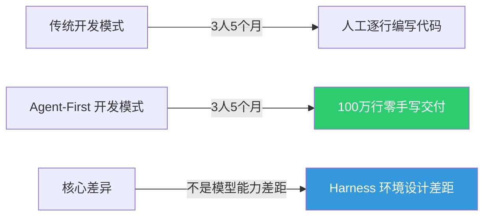
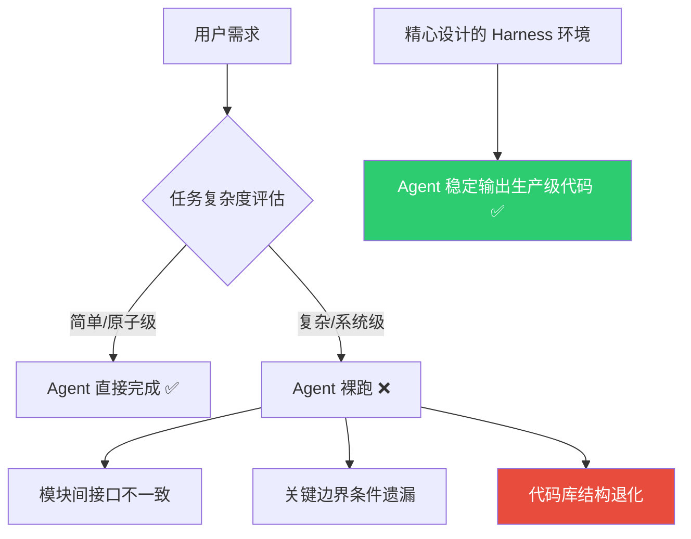
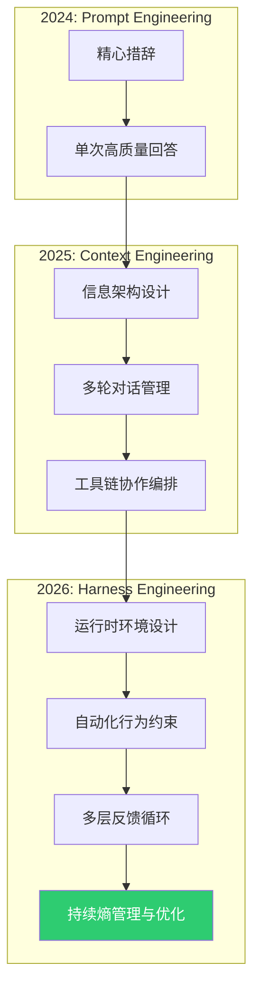
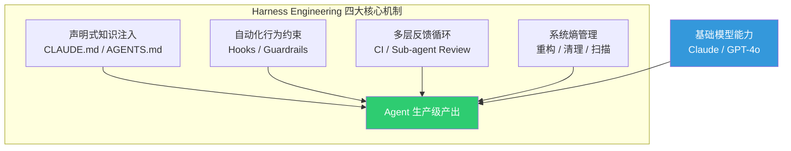
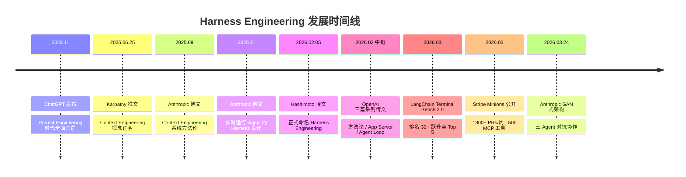
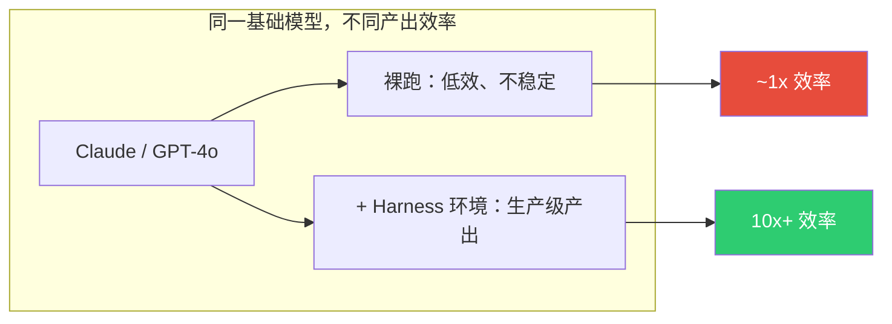
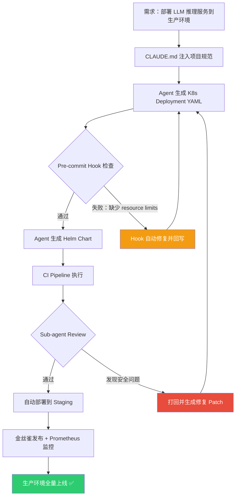
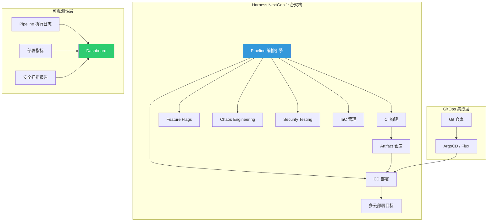
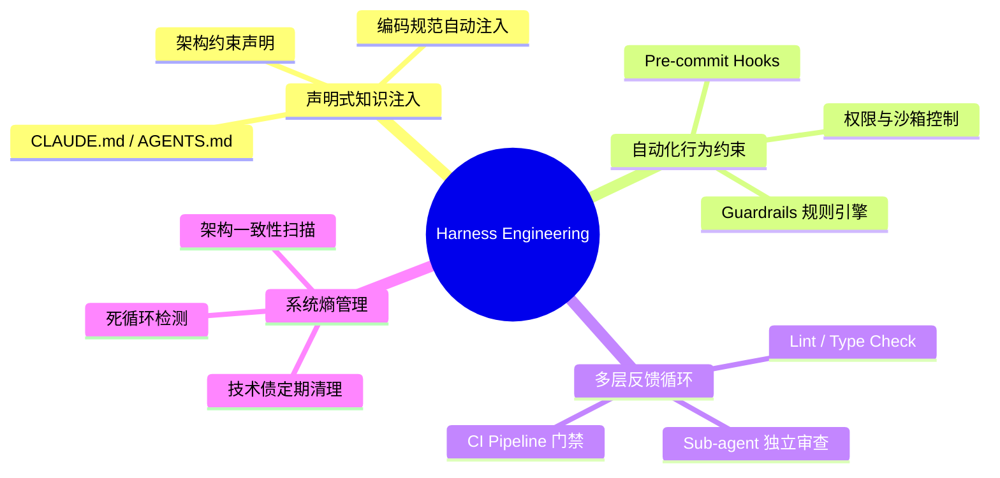

# Harness 基础概念与核心架构

> 🚀 **系列**：Harness Engineering 技术实战
> 🎯 **定位**：从第一性原理出发，建立对 Harness Engineering 的完整认知框架——它是什么、为什么存在、以及怎么改变 AI Agent 的生产力边界。

---

## 1. 🔄 范式转移：从"写代码"到"设计 Agent 的运行时"

### 1.1 一个颠覆认知的工程数据

2026 年初，OpenAI Codex 团队公开了一组让整个行业都坐不住的工程指标：

- 📊 **3 名工程师**，**5 个月**，交付 **100 万行生产级代码**
- 🔄 通过约 **1,500 个 Pull Request** 完成从零到一的产品构建与迭代
- ⚡ 人均日合并 **3.5 个 PR**，**零行人工手写**

> 📎 **出处**：[Harness engineering: leveraging Codex in an agent-first world](https://openai.com/index/harness-engineering/)（2026 年 2 月）

关键洞察：这个三人团队没用任何闭源黑科技——他们调用的是市面上所有人都能用的同款基础模型。但他们实现了 **10 倍以上的工程效率跃迁**。

**他们到底做对了什么？**

答案只有一个：**他们不写代码，他们设计让 Agent 写代码的环境。** 这篇博文正式引爆的工程范式，被命名为 **Harness Engineering**。



### 1.2 通用智能体的全面爆发

2025 年末到 2026 年初，通用智能体（General-Purpose Agent）从实验室杀进生产环境，标志性事件密集爆发：

| 平台 / 工具 | 定位 | 行业影响力 |
|-------------|------|-----------|
| **Claude Code** | CLI 编程智能体 | 原生支持 CLAUDE.md、Hooks、Sub-agents 等 Harness 机制 |
| **OpenAI Codex** | 云端编程智能体 | Agent-First 开发模式的标杆实践 |
| **Cursor / Windsurf** | IDE 嵌入式智能体 | 将 Agent 能力深度集成到开发者日常工作流 |

一个关键认知：**AI 编程智能体本质上就是通用智能体**——Claude Code 能写支付网关的幂等性校验逻辑，同样也能写技术架构文档、跑大规模数据迁移脚本、甚至对 K8s 集群做故障诊断。

### 1.3 核心痛点：为什么 Agent 裸跑复杂任务会翻车？

用过智能体的同学，下面这些场景应该不陌生：

| 任务类型 | Agent 表现 | 根因分析 |
|----------|-----------|---------|
| **单轮问答** | 准确可靠 | 单次推理，模型能力完全覆盖 |
| **明确的原子任务** | 高效完成 | 输入输出边界清晰，上下文充足 |
| **跨模块的复杂系统任务** | 半途而废或产出不可维护 | 缺乏环境约束、反馈循环和架构护栏 |

**这真的是模型能力不足吗？**

**不是。** OpenAI 那 3 名工程师用的是同一款模型；Stripe 的 Minions 系统用同一款 Claude 每周自动合并 1,300+ 个 PR。模型能力一模一样——**差距在于你有没有给 Agent 搭好运行时环境**。



> ⚠️ **踩坑实录**：让 Agent 裸跑"给一个 LLM 推理服务实现蓝绿部署 + 自动回滚 + Prometheus 监控埋点"这种跨层任务，大概率第三步就开始漏 Prometheus 的 histogram bucket 配置，或者在 Deployment YAML 里混用 `apps/v1` 和 `extensions/v1beta1`。**没有 Harness，就是这个代价。**

---

## 2. 🧗 三阶进化：人类学会"驾驭智能体"的认知阶梯

回顾 2024-2026 年，业界对 AI Agent 的使用方式经历了三个阶段的范式跃迁。不是替代关系，而是**层层嵌套、逐级递进**的进化。

### 2.1 三阶全景对比

| 维度 | Prompt Engineering（2024） | Context Engineering（2025） | Harness Engineering（2026） |
|------|---------------------------|----------------------------|-----------------------------|
| **核心问题** | "我怎么措辞才能让模型理解？" | "应该给模型注入哪些信息？" | "Agent 需要什么样的环境才能自主、可靠地工作？" |
| **工作单位** | 单次 API 调用 | 多轮对话 / 工具链编排 | 完整功能（从需求分析到生产交付） |
| **人类角色** | 提示词作者 | 信息架构师 | **运行时环境设计师** |
| **时间尺度** | 一次推理（秒级） | 一个会话（分钟级） | 系统全生命周期（天/周级） |
| **典型工具** | ChatGPT、API Playground | RAG 管线、MCP 协议、Few-shot 模板 | CLAUDE.md、Hooks、Sub-agents、CI/CD Pipeline |
| **思维模型** | "写一个好问题" | "导演一个好剧本" | **"搭建一个好剧场"** |

> 📖 **术语速查**：
> - 🔎 **RAG**（Retrieval-Augmented Generation）：检索增强生成，通过外部知识库补充模型上下文
> - 🔗 **MCP**（Model Context Protocol）：Anthropic 提出的工具调用标准协议，统一 Agent 与外部工具的交互方式
> - 🔄 **CI/CD**：持续集成 / 持续交付，DevOps 领域的核心自动化实践



### 2.2 计算机体系结构类比

Philipp Schmid 给出了一个特别有解释力的类比——把 AI Agent 的运行架构映射到经典计算机体系结构：

| 计算机组件 | AI Agent 类比 | 职责说明 |
|------------|---------------|---------|
| **CPU** | AI 基础模型（Claude、GPT-4o） | 提供原始推理能力 |
| **RAM** | 上下文窗口（Context Window） | 有限的、易失的工作记忆 |
| **操作系统** | **Harness** | 管理上下文分配、处理启动序列、提供标准工具接口、执行资源调度 |
| **应用程序** | Agent 实例 | 在操作系统之上运行的特定任务逻辑 |

> 📎 **出处**：[The importance of Agent Harness in 2026](https://www.philschmid.de/agent-harness-2026) — Philipp Schmid

**你不会在裸机上直接跑微服务**。同理，让 Agent 在没有 Harness 的环境里"裸跑"，就像在没有操作系统的 CPU 上跑应用——理论上能跑，实际上寸步难行。

### 2.3 三个常见认知误区

| 误区 | 纠正 |
|------|------|
| "三个时代是替代关系" | **错。是包含关系。** Harness Engineering 的日常实践照样要写好提示词、管好上下文窗口——它们是 Harness 的子集 |
| "只有大团队才需要 Harness" | **错。** 个人开发者用一个 CLAUDE.md + 两条安全 Hook，5 分钟就能拦截 90% 的低级失误 |
| "Harness 越复杂越好" | **大错特错。** Vercel 团队砍掉了 80% 的 Agent 工具后，任务完成率反而显著提升——**约束的质量远比数量重要** |

---

## 3. 📐 Harness Engineering 的正式定义

### 3.1 概念溯源：从推文到工程学科

#### Karpathy 推文与 Context Engineering 的诞生

2025 年 6 月 25 日，前 OpenAI 联合创始人 Andrej Karpathy 发了一条定义性的推文：

> "'context engineering' over 'prompt engineering'. People associate prompts with short task descriptions you'd give an LLM in your day-to-day use. When in every industrial-strength LLM app, context engineering is the delicate art and science of filling the context window with just the right information for the next step."
>
> “比起‘提示工程’（prompt engineering），（我们更应该称呼其为）‘上下文工程’（context engineering）。人们通常会把‘提示词’与日常使用大语言模型（LLM）时输入的简短任务指令联系在一起。然而，在每一个工业级的 LLM 应用中，上下文工程是一门精妙的艺术与科学——它需要为上下文窗口填入恰到好处的信息，以驱动模型完成下一步操作。”
>
> ——[Karpathy 推文](https://x.com/karpathy/status/1937902205765607626)（2025 年 6 月 25 日）

三个月后，Anthropic 发布了 *Effective Context Engineering for AI Agents* 系统性博文，把 Context Engineering 从一条推文升级成了有完整方法论的工程实践。

#### Agent Skills：Context Engineering 的高级实现形态

Agent Skills 是 Claude Code 实现的**渐进式知识加载机制**，解决了传统 CLAUDE.md 的死结——信息少了 Agent 干不了活，信息多了上下文被废内容挤爆。

| 加载层级 | 内容 | 加载时机 | 信息量 |
|----------|------|----------|--------|
| **元数据层** | Skill 名称 + 触发场景描述 | Agent 启动时始终加载 | ~100 tokens |
| **主体层** | SKILL.md 文件（操作指南） | Agent 判断需要该 Skill 时按需加载 | <500 行 |
| **资源层** | references/ 子目录 | Skill 执行过程中动态检索 | 不限 |

这种**"按需加载、延迟绑定"**的设计，跟操作系统动态链接库（DLL / .so）的原理如出一辙——只在真正需要时才占用宝贵的上下文空间。

#### Hashimoto 的正式命名

2026 年 2 月 5 日，HashiCorp 联合创始人 Mitchell Hashimoto 在博文中正式命名了 **Harness Engineering**，并给出了清晰的六阶段进化路径：

| 阶段 | 名称 | 核心实践 |
|------|------|---------|
| 1 | Drop the Chatbot | 放弃纯聊天模式，转向能读写文件、执行命令的 Agent |
| 2 | Reproduce Your Own Work | 强迫自己用 Agent 重做已完成的工作，建立对 Agent 能力边界的直觉 |
| 3 | End-of-Day Agents | 下班前启动 Agent 执行调研、故障分诊等异步任务 |
| 4 | Outsource the Slam Dunks | 将高确信度、低风险的任务委派给 Agent 自主完成 |
| **5** | **Engineer the Harness** | **Agent 犯错 → 工程化永久修复 → 同类错误永不再犯** |
| 6 | Always Have an Agent Running | 保持 Agent 持续运行，形成人机协作的稳态 |

> 📎 **出处**：[My AI Adoption Journey](https://mitchellh.com/writing/my-ai-adoption-journey) — Mitchell Hashimoto

**核心定义**：

> 💡 **"Anytime you find an agent makes a mistake, you take the time to engineer a solution such that the agent never makes that mistake again."**
>
> ——每当你发现 Agent 犯了一个错，就花时间工程化一个永久性修复，确保同类错误永远不再发生。

### 3.2 技术定义

**Harness Engineering** 是设计、构建和持续优化 AI Agent 运行时环境的工程学科。它通过四类核心机制，把 Agent 的可靠性、产出质量和自主工作能力从"演示级"拉到"生产级"：

| 核心机制 | 说明 | 实际载体示例 |
|----------|------|-------------|
| **声明式知识注入** | 通过项目配置文件让 Agent 自动理解代码库结构、编码规范和架构约束 | CLAUDE.md、AGENTS.md、.cursorrules |
| **自动化行为约束** | 通过生命周期钩子与规则引擎拦截危险操作、强制执行最佳实践 | Pre-commit Hooks、Guardrails、Permission Rules |
| **多层反馈循环** | 从即时 lint 检查到独立评估 Agent，确保每一步执行都有验证闭环 | CI Pipeline、Sub-agent Review、Test Suites |
| **系统熵管理** | 持续清理 Agent 产出的技术债，防止代码库结构退化 | 定期重构 Agent、Dead Code 清理、架构一致性扫描 |

**核心公式**：

$$\text{Agent 产出质量} = f(\text{基础模型能力},\ \text{Harness 设计水平})$$

> ⚙️ Harness 之于 AI Agent，如同操作系统之于裸机 CPU——裸机能运算，但只有在操作系统的调度、约束和资源管理下，才能稳定运行复杂的分布式应用。



### 3.3 与 DevOps 的范式类比

有 DevOps 背景的同学看 Harness Engineering 会有似曾相识的感觉——它本质上是 **DevOps 哲学在 AI Agent 领域的映射**：

| 维度 | DevOps 的变革 | Harness Engineering 的变革 |
|------|--------------|---------------------------|
| **核心转变** | 手动部署 → 自动化流水线 | 人工盯 Agent → 自动化环境约束 |
| **关键产物** | CI/CD 配置、Dockerfile、Terraform | CLAUDE.md、Hooks、Sub-agents、Guardrails |
| **设计哲学** | 基础设施即代码（IaC） | **约束即代码（Constraints as Code）** |
| **度量指标** | 部署频率、变更前置时间 | Agent 任务完成率、PR 合并率、回滚率 |

---

## 4. 🗓️ 里程碑时间线

Harness Engineering 从一条推文长成一个完整的工程学科，只用了九个月：



| 时间 | 里程碑事件 | 关键推动者 |
|------|-----------|-----------|
| 2022.11 | ChatGPT 发布，Prompt Engineering 时代全面开启 | OpenAI |
| 2025.06.25 | Karpathy 推文为 "Context Engineering" 正名 | Andrej Karpathy |
| 2025.09 | Anthropic 发布 *Effective Context Engineering for AI Agents* | Anthropic |
| 2025.11 | Anthropic 发布 *Effective Harnesses for Long-Running Agents* | Justin Young（Anthropic） |
| **2026.02.05** | **Hashimoto 博文正式命名 Harness Engineering** | **Mitchell Hashimoto** |
| 2026.02 中旬 | OpenAI 发布三篇系列博文（方法论 / App Server / Agent Loop） | OpenAI Codex 团队 |
| 2026.03 | LangChain 仅凭 Harness 优化在 Terminal Bench 2.0 冲进 Top 5 | LangChain |
| 2026.03 | Stripe 公开 Minions 系统：1,300+ PRs/周，~500 个 MCP 工具 | Stripe |
| 2026.03.24 | Anthropic 发布 GAN 式三 Agent 对抗协作架构 | Anthropic Labs |

---

## 5. 🏆 行业标杆：同一模型，截然不同的产出

下面这组数据说明了一个事实——精心设计的 Harness 对 Agent 生产力有倍增效应。所有团队用的都是市面上公开的基础模型，**唯一变量是 Harness 设计水平**：

| 团队 / 项目 | 规模 | 核心成果 | Harness 关键机制 |
|-------------|------|---------|------------------|
| **OpenAI Codex** | 3 人 → 7 人 | 5 个月 **100 万行**生产级代码，零人手写 | AGENTS.md + 六层架构约束 + 自动垃圾回收 |
| **Stripe Minions** | 企业级 | 每周 **1,300+ PRs** 自动合并，~500 个 MCP 工具 | Blueprint 审批 + CI/CD 管线 + 人工终审 |
| **LangChain** | 开源团队 | 不换模型，仅改 Harness → 基准排名 30+ → **Top 5** | 系统提示词优化 + 工具精简 + 死循环检测中间件 |
| **GStack（Garry Tan）** | 个人开发者 | 60 天 **60 万行**代码，GitHub **48k Stars** | 项目配置 + 28 个角色定义 + Sprint 流程 |
| **Peter Steinberger** | 个人（极端模式） | 月均 **6,600 次代码提交** | 轻量配置 + 高信任自治模式 |



### 5.1 深度案例：LLM 推理服务的 Harness 化部署

拿一个**大模型推理服务的生产部署**当例子，看看 Harness 怎么把一个复杂任务拆解成 Agent 能可靠执行的原子步骤：



**对应的 CLAUDE.md 配置片段**（声明式知识注入）：

```markdown
# 项目：LLM Inference Gateway

## 架构约束
- 所有 K8s Deployment 必须设置 resource requests 和 limits
- 推理服务必须暴露 /health 和 /metrics 端点
- 使用 HPA（Horizontal Pod Autoscaler）基于 GPU 利用率自动扩缩
- 所有镜像必须来自内部 Harbor 仓库，禁止 Docker Hub 直拉

## 编码规范
- Python 3.12+，类型注解强制开启
- 使用 Pydantic v2 做请求/响应校验
- 日志格式统一为 JSON structured logging
```

**Pre-commit Hook 配置**（自动化行为约束）：

```yaml
# .claude/settings.json 中的 Hooks 配置
# 当 Agent 尝试写入 K8s YAML 时自动校验
hooks:
  preToolCall:
    - matcher: "write|edit"
      command: |
        # 检查是否为 K8s 资源文件
        if echo "$CLAUDE_FILE_PATH" | grep -qE '\.(yaml|yml)$'; then
          # 校验是否包含 resource limits
          if ! grep -q 'resources:' "$CLAUDE_FILE_PATH" 2>/dev/null; then
            echo "ERROR: K8s 资源文件必须定义 resources.requests 和 resources.limits"
            exit 1
          fi
        fi
```

**CI Pipeline 配置**（多层反馈循环）：

```yaml
# .harness/pipelines/llm-inference-deploy.yaml
# Harness NextGen Pipeline：LLM 推理服务部署管线
pipeline:
  name: llm-inference-gateway-deploy
  identifier: llm_inference_gateway_deploy
  projectIdentifier: ai-platform
  orgIdentifier: default
  stages:
    - stage:
        name: build-and-test
        identifier: build_and_test
        type: CI
        spec:
          cloneCodebase: true
          infrastructure:
            type: KubernetesDirect
            spec:
              connectorRef: k8s_cluster_prod
              namespace: harness-builds
          execution:
            steps:
              - step:
                  type: Run
                  name: unit-tests
                  identifier: unit_tests
                  spec:
                    connectorRef: dockerhub
                    image: python:3.12-slim
                    command: |
                      pip install -r requirements.txt
                      pytest tests/ -v --tb=short --cov=inference_gateway
              - step:
                  type: Run
                  name: security-scan
                  identifier: security_scan
                  spec:
                    connectorRef: dockerhub
                    image: aquasec/trivy:latest
                    command: |
                      trivy fs --severity HIGH,CRITICAL --exit-code 1 .
              - step:
                  type: BuildAndPushECR
                  name: build-push-image
                  identifier: build_push_image
                  spec:
                    connectorRef: aws_ecr_connector
                    repo: ai-platform/inference-gateway
                    tags:
                      - <+pipeline.sequenceId>

    - stage:
        name: canary-deploy
        identifier: canary_deploy
        type: Deployment
        spec:
          deploymentType: Kubernetes
          service:
            serviceRef: llm-inference-gateway
          environment:
            environmentRef: production
          execution:
            steps:
              - step:
                  name: canary-10pct
                  identifier: canary_10pct
                  type: K8sCanaryDeploy
                  spec:
                    instanceSelection:
                      type: Count
                      spec:
                        count: 10%  # 金丝雀：先部署 10% 流量
              - step:
                  name: prometheus-metrics-check
                  identifier: prometheus_check
                  type: Run
                  spec:
                    connectorRef: dockerhub
                    image: curlimages/curl:latest
                    command: |
                      # 等待 60 秒后检查 P99 延迟和错误率
                      sleep 60
                      P99=$(curl -s "http://prometheus:9090/api/v1/query?query=histogram_quantile(0.99,rate(inference_latency_bucket[5m]))" | jq '.data.result[0].value[1]')
                      ERROR_RATE=$(curl -s "http://prometheus:9090/api/v1/query?query=rate(inference_errors_total[5m])/rate(inference_requests_total[5m])" | jq '.data.result[0].value[1]')

                      echo "P99 Latency: ${P99}s, Error Rate: ${ERROR_RATE}"

                      # P99 延迟超过 2s 或错误率超过 1% 则回滚
                      if (( $(echo "$P99 > 2.0" | bc -l) )) || (( $(echo "$ERROR_RATE > 0.01" | bc -l) )); then
                        echo "ERROR: 金丝雀指标异常，触发自动回滚"
                        exit 1
                      fi
              - step:
                  name: full-deploy
                  identifier: full_deploy
                  type: K8sRollingDeploy
                  spec:
                    skipDryRun: false
            rollbackSteps:
              - step:
                  name: rollback
                  identifier: rollback
                  type: K8sRollingRollback
```

---

## 6. ⚙️ Harness 与 Harness NextGen：平台视角的技术演进

> ℹ️ **注意区分**：本文讨论的 **Harness Engineering**（小写 h）是一个通用的工程学科概念；而 **Harness**（大写 H）是 Harness.io 提供的商业 DevOps 平台。名字撞了但层次不同——前者是方法论，后者是工具链。Harness.io 平台的 NextGen 架构恰好是 Harness Engineering 理念在 CI/CD 领域的优秀工程实现。

### 6.1 Harness NextGen 核心架构



### 6.2 一个完整的 GitOps + Harness Pipeline 示例

下面展示一个基于 Harness NextGen 的**支付网关灰度发布管线**，结合 ArgoCD 实现 GitOps 工作流：

```yaml
# .harness/pipelines/payment-gateway-canary.yaml
# 场景：支付网关微服务的金丝雀灰度发布
pipeline:
  name: payment-gateway-canary-release
  identifier: payment_gateway_canary
  projectIdentifier: fintech-platform
  orgIdentifier: default
  tags:
    team: payments
    sla: critical

  # 管线级别的全局变量
  variables:
    - name: canary_weight
      type: String
      value: "10"           # 初始金丝雀流量比例
    - name: error_threshold
      type: String
      value: "0.005"        # 错误率阈值：0.5%
    - name: latency_p99_threshold_ms
      type: String
      value: "200"          # P99 延迟阈值：200ms

  stages:
    # === 阶段一：构建与测试 ===
    - stage:
        name: build-test-scan
        identifier: build_test_scan
        type: CI
        spec:
          cloneCodebase: true
          infrastructure:
            type: KubernetesDirect
            spec:
              connectorRef: k8s_ci_cluster
              namespace: harness-ci
          execution:
            steps:
              # 单元测试
              - step:
                  type: Run
                  name: unit-tests
                  identifier: unit_tests
                  spec:
                    image: golang:1.22-alpine
                    command: |
                      go test ./... -v -coverprofile=coverage.out -race
                      go tool cover -func=coverage.out

              # 集成测试：模拟支付链路
              - step:
                  type: Run
                  name: integration-tests
                  identifier: integration_tests
                  spec:
                    image: golang:1.22-alpine
                    command: |
                      go test ./tests/integration/... -v -tags=integration \
                        -run "TestPaymentGateway" -timeout 300s

              # 安全扫描
              - step:
                  type: Run
                  name: sast-scan
                  identifier: sast_scan
                  spec:
                    image: returntocorp/semgrep:latest
                    command: |
                      semgrep --config=p/golang --error --severity=ERROR .

              # 构建并推送容器镜像
              - step:
                  type: BuildAndPushECR
                  name: build-push
                  identifier: build_push
                  spec:
                    connectorRef: aws_ecr_prod
                    repo: payments/gateway
                    tags:
                      - <+pipeline.sequenceId>
                      - <+stage.output.build_push.image.tag>

    # === 阶段二：GitOps 同步到 Staging ===
    - stage:
        name: deploy-staging
        identifier: deploy_staging
        type: Custom
        spec:
          execution:
            steps:
              - step:
                  type: GitOpsSync
                  name: argocd-sync-staging
                  identifier: argocd_sync_staging
                  spec:
                    gitOpsConnectorRef: argocd_prod
                    applicationName: payment-gateway-staging
                    revision: <+pipeline.sequenceId>
                    # ArgoCD 自动同步 Git 仓库中的 K8s 清单
                    syncPolicy:
                      automated:
                        prune: true
                        selfHeal: true

    # === 阶段三：生产金丝雀发布 ===
    - stage:
        name: canary-production
        identifier: canary_production
        type: Deployment
        spec:
          deploymentType: Kubernetes
          service:
            serviceRef: payment-gateway
          environment:
            environmentRef: production
          execution:
            steps:
              # 金丝雀部署
              - step:
                  name: canary-deploy
                  identifier: canary_deploy
                  type: K8sCanaryDeploy
                  spec:
                    instanceSelection:
                      type: Percentage
                      spec:
                        percentage: <+stage.variables.canary_weight>

              # 等待并采集指标
              - step:
                  name: observe-metrics
                  identifier: observe_metrics
                  type: Run
                  spec:
                    image: curlimages/curl:latest
                    command: |
                      # 金丝雀观察窗口：3 分钟
                      sleep 180

                      # 查询 Datadog 指标（通过 Harness Connector 注入 API Key）
                      ERROR_RATE=$(curl -s -H "DD-API-KEY: ${DATADOG_API_KEY}" \
                        "https://api.datadoghq.com/api/v1/query?query=sum:payment.error_rate{service:gateway,canary:true}.as_rate()" \
                        | jq '.series[0].pointlist[-1][1]')

                      P99_LATENCY=$(curl -s -H "DD-API-KEY: ${DATADOG_API_KEY}" \
                        "https://api.datadoghq.com/api/v1/query?query=p99:payment.latency{service:gateway,canary:true}" \
                        | jq '.series[0].pointlist[-1][1]')

                      echo "金丝雀指标 — 错误率: ${ERROR_RATE}, P99: ${P99_LATENCY}ms"

              # 指标门禁检查
              - step:
                  name: metric-gate
                  identifier: metric_gate
                  type: Run
                  spec:
                    image: alpine:3.19
                    command: |
                      # 门禁逻辑：错误率或延迟超阈值则失败并触发回滚
                      if [ "$(echo "${ERROR_RATE} > ${ERROR_THRESHOLD}" | bc -l)" = "1" ]; then
                        echo "FAIL: 错误率 ${ERROR_RATE} 超过阈值 ${ERROR_THRESHOLD}"
                        exit 1
                      fi
                      if [ "$(echo "${P99_LATENCY} > ${LATENCY_P99_THRESHOLD_MS}" | bc -l)" = "1" ]; then
                        echo "FAIL: P99 延迟 ${P99_LATENCY}ms 超过阈值 ${LATENCY_P99_THRESHOLD_MS}ms"
                        exit 1
                      fi
                      echo "PASS: 金丝雀指标正常，继续全量发布"

              # 全量滚动发布
              - step:
                  name: full-rollout
                  identifier: full_rollout
                  type: K8sRollingDeploy
                  spec:
                    skipDryRun: false

            # 回滚步骤
            rollbackSteps:
              - step:
                  name: auto-rollback
                  identifier: auto_rollback
                  type: K8sRollingRollback
              - step:
                  name: notify-oncall
                  identifier: notify_oncall
                  type: Run
                  spec:
                    image: curlimages/curl:latest
                    command: |
                      curl -X POST "${SLACK_WEBHOOK_URL}" \
                        -H 'Content-Type: application/json' \
                        -d '{"text":"⚠️ 支付网关金丝雀发布失败，已自动回滚。请查看 Harness Pipeline 日志。"}'
```

---

## 7. 📝 核心概念总结



**一句话总结**：Harness Engineering 的核心思想——**别想着提升模型本身，给模型搭一个它不会犯错的环境。** 跟 DevOps 的哲学一脉相承：别指望运维人员不出错，而是搭一套让人为错误无法传导到生产的自动化体系。

---

## 全套公开课课件领取：


---

- ## DXZY.AI

  DXZY.AI - 专注于 AI、RAG、Agent、MCP
  

  - GitHub: https://github.com/dxzyai/agent-dev-guide
  - 官网: https://dxzy.ai

  
