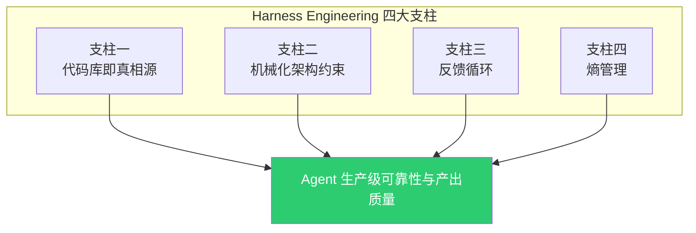
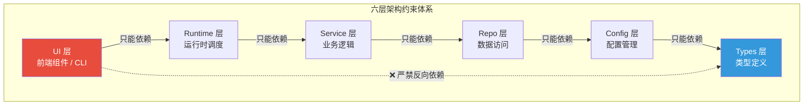
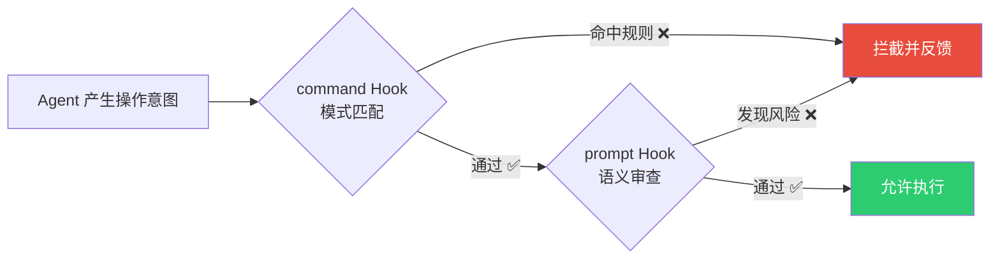
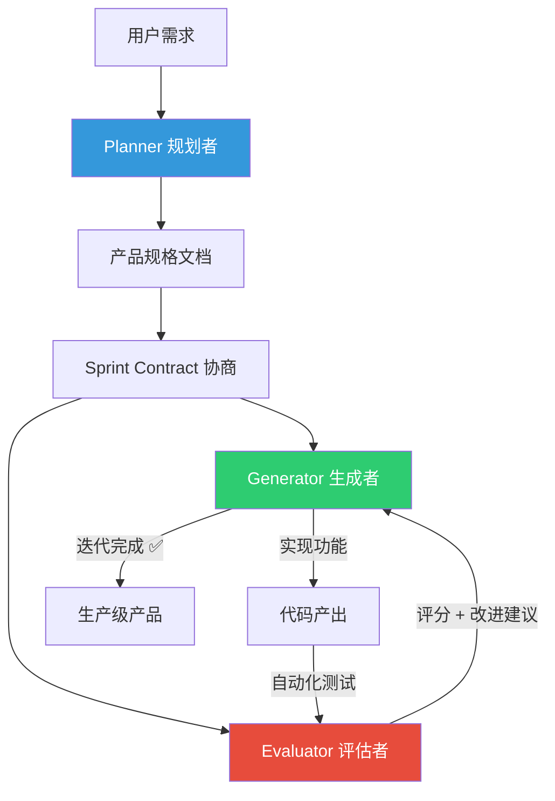
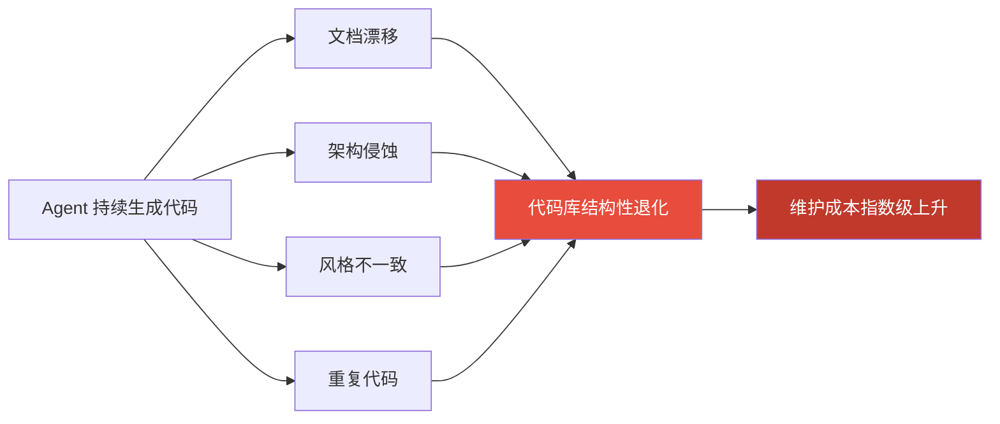
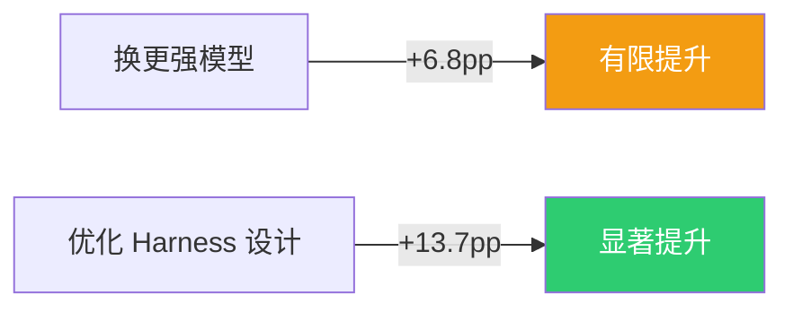

# Harness 四大支柱详解

> **系列**：Harness Engineering 技术实战
> **定位**：深入拆解 Harness Engineering 的理论内核——四大支柱机制。每一根支柱都对应 Agent 在生产环境中的高频故障模式，并给出工程化的根治方案。

---

## 全景：四大支柱与核心公式

一个生产级的 Harness 环境到底要具备哪些能力？综合 OpenAI、Anthropic、LangChain、Stripe 等团队的实战经验，Harness Engineering 可以提炼为**四大支柱**。每一根支柱都直接映射到 Agent 在真实工程场景中的高频痛点。

| 支柱 | 根治的痛点 | 核心机制 | 典型工程载体 |
|------|-----------|---------|-------------|
| **代码库即真相源** | Agent 对项目一无所知 | 声明式配置 + 渐进式知识注入 | CLAUDE.md / AGENTS.md / Skills |
| **机械化架构约束** | Agent 犯错靠"口头提醒"根本拦不住 | 自动化规则引擎强制执行 | Hooks / Linter / 结构测试 / Guardrails |
| **反馈循环** | Agent 在黑暗中干完才发现全错 | 多层自动化验证 + 结果回传 | CI Pipeline / 独立评估 Agent / 可观测性 |
| **熵管理** | Agent 产出越多，代码库退化越快 | 周期性扫描 + 自动修复 + 品味编码 | 垃圾回收 Agent / 架构一致性扫描 / Dead Code 清理 |



> **术语速查**：
> - **CLAUDE.md / AGENTS.md**：项目根目录下的 Markdown 配置文件，Agent 启动时自动加载，相当于 Agent 的"项目导航地图"
> - **Hooks**：Agent 生命周期中的自动化检查点，类似 Git Hooks 但覆盖更广（24 个事件 × 4 种处理器类型）
> - **Linter**：代码风格与规范的自动检查工具（如 ruff、biome、golangci-lint）
> - **CI/CD Pipeline**：持续集成 / 持续交付的自动化构建-测试-部署流水线

---

## 支柱一：代码库即真相源（Codebase as Source of Truth）

### 定义

**Agent 的所有项目知识来自代码库本身，不是外部文档也不是人类口头交代。** 在项目根目录放一份结构化的配置文件，让 Agent 每次启动时自动读取技术栈、编码规范、常用命令和行为禁区。

### 为什么它排在第一位

没有这根支柱，后面三根都是空中楼阁——Agent 连"这项目用 Go 还是 Rust"都不知道，约束和反馈从何谈起？

**场景还原**：你让 Agent 给一个基于 Go 的 gRPC 微服务加限流中间件。没有 CLAUDE.md 的话，Agent 不知道你用 `golangci-lint` 而非 `golint`、不知道你偏好 `uber-go/zap` 而非 `logrus`、不知道 `.env` 里存着生产密钥绝对不能提交。每次开新会话都得重复交代一遍——而人总会忘。某次你漏了句"不要动 migrations 目录"，Agent 就真的把数据库迁移脚本重写了。

**CLAUDE.md 就是 Agent 的项目导航地图**——不是百科全书，是精炼的行军指南。

### "地图"而非"百科全书"——OpenAI 踩过的坑

OpenAI Codex 团队试过把所有信息塞进一个巨型 AGENTS.md——**翻车了**。上下文窗口是稀缺资源，臃肿的指令文件会挤掉真正需要的代码上下文和任务信息。

正确姿势：**AGENTS.md 当"目录"，指向结构化的文档树**：

```plaintext
AGENTS.md（<100 行）→ 精炼的导航地图
    ├── → docs/architecture.md     架构设计与模块边界
    ├── → docs/conventions.md      编码规范与命名约定
    ├── → docs/api-spec.md         API 契约与错误码
    ├── → docs/incident-playbook.md 故障应急手册
    └── 关键约束与绝对禁区           核心红线（<20 条）
```

Agent 拿到地图后按需跳转检索——这就是 Karpathy 说的 **"Just-in-Time 上下文检索"** 在代码库层面的工程落地。

### Hashimoto 的配置文件维护法则

Mitchell Hashimoto 在 Ghostty 项目中的实践：**AGENTS.md 里的每一条规则，都对应过去一个真实的 Agent 犯错记录。** 原话是："每一行都对应一个过去的 Agent 错误行为，而且几乎完全解决了所有这些问题。"

维护闭环：

```plaintext
Agent 犯错 → 分析根因 → 提炼为规则 → 写入 AGENTS.md
                                              ↓
                        下次 Agent 启动时自动加载 → 同类错误永不再犯
```

这就是一种**增量式知识沉淀**——你的 CLAUDE.md 会随着项目推进越来越"聪明"。

### 三层配置策略（2026 最新实践）

Claude Code 支持三层配置文件，从全局到个人逐级细化，形成**配置继承与覆盖**的层次结构：

| 层级 | 路径 | 作用域 | 是否提交 Git | 典型内容 |
|------|------|--------|:------------:|---------|
| **全局** | `~/.claude/CLAUDE.md` | 所有项目 | — | 个人偏好（语言、风格、工作习惯） |
| **项目** | `./CLAUDE.md` | 当前项目 | ✅ | 技术栈、命令、编码规范、架构约束 |
| **个人** | `./.claude/local.md` | 当前项目（仅自己） | ❌ | 个人在该项目的特殊偏好 |

**优先级**：个人 > 项目 > 全局。跟软件工程里配置继承的套路完全一致。

#### Skills 层：按需加载的知识模块

Claude Code 2026 年引入的 **Agent Skills** 机制进一步扩展了知识注入能力——把大型知识体拆成独立的、按需加载的模块：

```yaml
# .claude/skills/canary-deploy/SKILL.md
---
name: canary-deploy
description: 执行金丝雀灰度发布流程
trigger: 当用户提到"金丝雀"、"灰度"、"canary"时触发
---

# 金丝雀发布操作指南

## 前置条件
1. 确认目标服务已通过 staging 环境验证
2. 确认 Prometheus 监控面板可访问
3. 确认回滚脚本已就绪

## 执行步骤
1. 部署金丝雀版本（10% 流量）：`kubectl apply -f canary.yaml`
2. 等待观察窗口（3 分钟）并采集指标
3. 检查 P99 延迟和错误率是否在阈值内
4. 通过门禁后全量发布：`kubectl rollout status deployment/payment-gateway`
5. 若指标异常，立即回滚：`kubectl rollout undo deployment/payment-gateway`

## 指标阈值
- P99 延迟：≤ 200ms
- 错误率：≤ 0.5%
- GPU 利用率：≤ 85%
```

Skills 的三层加载架构（跟操作系统的动态链接库一个思路）：

| 加载层级 | 内容 | 加载时机 | 上下文开销 |
|----------|------|----------|-----------|
| **元数据层** | Skill 名称 + 触发场景描述 | Agent 启动时始终加载 | ~100 tokens |
| **主体层** | SKILL.md 操作指南 | Agent 判断需要时按需加载 | <500 行 |
| **资源层** | references/ 子目录 | 执行过程中动态检索 | 不限 |

### 常见误区

| 误区 | 纠正 |
|------|------|
| "越长越好" | **错。** OpenAI 的经验是 <100 行为黄金标准。CLAUDE.md 是地图，不是百科全书 |
| "写 Agent 已经知道的常识" | 浪费上下文。只写 Agent 猜不到的、你项目特有的东西 |
| "一次性写完就不管了" | 要持续维护。按 Hashimoto 的方法，每次 Agent 犯错就补一条规则 |

### 实践示例：面向高并发流媒体服务的 CLAUDE.md

```markdown
# CLAUDE.md — 实时流媒体转码网关

## 项目概述
高并发实时视频流转码微服务，支持 HLS/DASH 自适应码率输出，日活 500 万用户。

## 技术栈
- Go 1.22 + gRPC + Protocol Buffers
- FFmpeg 7.0（转码内核）
- Redis Cluster（会话缓存 + 限流状态）
- Kafka 3.7（事件总线）
- Kubernetes 1.30 + Helm 3.14

## 常用命令
- 本地启动：`go run ./cmd/transcoder --config ./configs/local.yaml`
- 单元测试：`go test ./... -v -race -coverprofile=coverage.out`
- Lint 检查：`golangci-lint run --config .golangci.yml`
- 构建镜像：`docker build -t transcoder:$(git rev-parse --short HEAD) .`
- Protobuf 生成：`buf generate`

## 编码规范
- 使用 `camelCase` 命名 Protobuf 字段，`snake_case` 命名 Go 变量
- 所有 gRPC 方法必须定义 `google.api.http` 注解用于 REST 网关
- 错误处理：使用 `fmt.Errorf("context: %w", err)` 包装错误链
- 日志：统一使用 `slog`（Go 1.22 标准库），JSON 格式输出

## 绝对禁止
- 不要修改 `proto/` 目录下的已有消息定义（会破坏线上兼容性）
- 不要在转码 Worker 中执行同步网络调用（会阻塞 FFmpeg 管线）
- 不要硬编码任何密钥、Token 或数据库连接串
- 不要绕过 `internal/ratelimiter/` 直接操作 Redis 限流键

## 验证方式
每次修改后运行：`go test ./... -v -race && golangci-lint run`
```

---

## 支柱二：机械化架构约束（Mechanized Architectural Constraints）

### 定义

**用自动化工具把约束刻进执行流程，不靠 Agent 的"自觉性"。** CLAUDE.md 写的是"你应该这样做"（建议），Hooks 执行的是"你必须这样做，否则操作被拦"（法律）。

### 为什么"建议"不够，必须有"法律"

Agent 和人一样会犯错，但人能凭经验"感觉不对"而停下来，Agent 不行。你在 CLAUDE.md 里写了"不要执行 `rm -rf /`"，Agent 大概率会遵守——但**"大概率"在生产安全面前等于没说**。

> **核心原则：CLAUDE.md 是建议，Hooks 是法律。** 建议可以被忽略，法律不行。

### OpenAI 的六层分级约束体系

OpenAI 在 Codex 项目中设计了一套严格的六层架构约束——**每层只能依赖上层，严禁反向依赖**：

```plaintext
Types → Config → Repo → Service → Runtime → UI
  ↑       ↑       ↑       ↑         ↑        ↑
  每层只能依赖上层，严禁反向依赖
  违反 → 结构测试自动失败 → Agent 操作被阻止
```

这不是检查清单，是**自动执行的架构法律体系**。当 Agent 试图在 UI 层直接调用 Types 层的内部实现时，结构测试会立即失败并阻止提交。



### Claude Code 的 Hooks 系统（2026 最新）

Claude Code 提供了覆盖 Agent 全生命周期的 Hooks 系统——**24 个生命周期事件 × 4 种处理器类型**：

| 处理器类型 | 执行方式 | 适用场景 | 示例 |
|-----------|---------|---------|------|
| `command` | 执行 Shell 命令 | 文件操作、脚本检查、Lint | `bash firewall.sh` |
| `prompt` | 调用 LLM 单轮评估 | 语义级代码审查、风险评估 | "检查此改动是否引入安全风险" |
| `agent` | 启动独立 Agent 验证 | 复杂的多步验证流程 | "运行端到端测试并验证结果" |
| `http` | 发送 HTTP POST | 外部系统集成 | POST 到 Slack / 飞书 / PagerDuty |

**退出码语义设计**：

| 退出码 | 含义 | Agent 行为 |
|:------:|------|-----------|
| `0` | 检查通过 | 继续执行 |
| `2` | **有意拦截** | **阻止当前操作**，向 Agent 反馈错误信息 |
| 其他 | Hook 自身异常 | 继续执行（Hook 脚本错误不影响主流程） |

> **关键细节**：退出码 `2` 是拦截的"魔法数字"——不是 `1`，是 `2`。这个设计精确区分了"Hook 脚本自己出错"（exit 1）和"Hook 有意拦截违规操作"（exit 2）。

### 实战场景一：安全防火墙——拦截高危命令

```bash
#!/bin/bash
# firewall.sh — PreToolUse Hook：安全防火墙
# 在 Agent 执行任何 Bash 命令前进行安全扫描

COMMAND="$CLAUDE_BASH_COMMAND"

# 拦截删除根目录
if echo "$COMMAND" | grep -qE "rm\s+(-[rf]+\s+)?/(\s|$)"; then
    echo "BLOCKED: 检测到对根目录的危险删除操作" >&2
    exit 2
fi

# 拦截危险的权限修改
if echo "$COMMAND" | grep -qE "chmod\s+(777|666)\s+/"; then
    echo "BLOCKED: 检测到对根目录的危险权限变更" >&2
    exit 2
fi

# 拦截凭证泄露
if echo "$COMMAND" | grep -qE "(curl|wget).*(-H|--header).*(Authorization|Bearer|token|API.KEY)"; then
    echo "BLOCKED: 检测到命令中包含凭证信息，可能存在泄露风险" >&2
    exit 2
fi

# 拦截生产数据库直连
if echo "$COMMAND" | grep -qE "psql.*prod|mysql.*production|mongo.*prod"; then
    echo "BLOCKED: 禁止直接连接生产数据库，请使用迁移工具或管理平台" >&2
    exit 2
fi

exit 0
```

### 实战场景二：提交前自动质量门禁

```bash
#!/bin/bash
# quality-gate.sh — PreToolUse Hook：代码质量门禁
# 在 Agent 执行 git commit 前强制通过质量检查

COMMAND="$CLAUDE_BASH_COMMAND"

if echo "$COMMAND" | grep -q "git commit"; then
    echo "🔍 执行提交前质量检查..." >&2

    # Lint 检查
    if ! golangci-lint run --config .golangci.yml 2>/dev/null; then
        echo "BLOCKED: Lint 检查未通过，请修复后重试" >&2
        exit 2
    fi

    # 单元测试
    if ! go test ./... -short -timeout 60s 2>/dev/null; then
        echo "BLOCKED: 单元测试未通过" >&2
        exit 2
    fi

    # 检查是否包含 TODO/FIXME（可选：阻止未完成的代码提交）
    STAGED_FILES=$(git diff --cached --name-only --diff-filter=ACMR 2>/dev/null)
    for file in $STAGED_FILES; do
        if grep -q "TODO\|FIXME\|HACK\|XXX" "$file" 2>/dev/null; then
            echo "WARNING: $file 中存在 TODO/FIXME 标记，请确认是否为有意保留" >&2
        fi
    done

    echo "✅ 所有质量检查通过" >&2
fi

exit 0
```

### 实战场景三：任务完成后告警通知

```bash
#!/bin/bash
# notify-complete.sh — Stop Hook：任务完成通知
# Agent 完成任务后发送通知到团队频道

TASK_SUMMARY="${CLAUDE_TASK_SUMMARY:-任务已完成}"
DURATION="${CLAUDE_SESSION_DURATION:-未知}"

# 发送到 Slack（通过 Webhook）
if [ -n "$SLACK_WEBHOOK_URL" ]; then
    curl -s -X POST "$SLACK_WEBHOOK_URL" \
        -H 'Content-Type: application/json' \
        -d "{
            \"text\": \"🤖 Agent 任务完成\",
            \"blocks\": [
                {
                    \"type\": \"section\",
                    \"text\": {
                        \"type\": \"mrkdwn\",
                        \"text\": \"*Agent 任务完成*\\n摘要: ${TASK_SUMMARY}\\n耗时: ${DURATION}\"
                    }
                }
            ]
        }" > /dev/null 2>&1
fi

# Windows 桌面通知
if [[ "$OSTYPE" == "msys"* ]] || [[ "$OSTYPE" == "cygwin"* ]]; then
    powershell -Command "
        [System.Reflection.Assembly]::LoadWithPartialName('System.Windows.Forms') | Out-Null
        \$notify = New-Object System.Windows.Forms.NotifyIcon
        \$notify.Icon = [System.Drawing.SystemIcons]::Information
        \$notify.Visible = \$true
        \$notify.ShowBalloonTip(5000, 'Harness Engineering', 'Agent 任务已完成', [System.Windows.Forms.ToolTipIcon]::Info)
    " 2>/dev/null
fi

exit 0
```

### Prompt Hook：用 AI 约束 AI

`prompt` 类型的 Hook 是机械化约束的高阶玩法——**调用另一个 LLM 做语义级审查**：

| 对比维度 | command Hook | prompt Hook |
|----------|-------------|-------------|
| 检测方式 | 字符串模式匹配 / 正则表达式 | 语义理解 / 上下文推理 |
| 响应速度 | 毫秒级 | 1-3 秒 |
| 检测能力 | 已知的危险模式 | **未知的风险模式** |
| 执行成本 | 零（本地执行） | 消耗 API 额度 |
| 适用场景 | 高频、确定性检查 | 低频、需要判断力的深度审查 |

**最佳实践：双层防线**——`command` Hook 做高速模式匹配拦截 99% 的明显问题，`prompt` Hook 做深度语义分析兜底漏网之鱼。



### 反直觉洞察：收窄解空间反而提高成功率

OpenAI 的工程实践验证了一个反直觉的结论：**限制选择比给更多自由更有效**。

你跟 Agent 说"用任何你觉得合适的方式实现"，它面对无限可能性，选择的方差极大，产出质量忽高忽低。但你约束它"必须用 gRPC、遵循项目的 Protobuf 命名规范、通过 Service 层调用数据访问层"，它在收窄后的解空间里反而更容易找到正确答案。

> **约束不是限制创造力，是把创造力引导到有价值的方向。**

### 约束设计的三个陷阱

| 陷阱 | 说明 |
|------|------|
| 约束过多过细 | Agent 每一步都被拦截，效率骤降。只约束真正危险或真正重要的行为 |
| 退出码搞错 | 用 `exit 1` 想拦截操作，实际被忽略了（应该用 `exit 2`） |
| 只拦截不解释 | 拦了 Agent 但不告诉它为什么被拦、怎么修。好的约束同时是教学工具 |

---

## 支柱三：反馈循环（Feedback Loops）

### 定义

**让 Agent 每一步都能自动获知"做得对不对"，而不是干完全部活才发现从第一步就错了。** 没有反馈的 Agent 就像蒙眼射箭——偶尔命中靶心，大多数时候脱靶。

### 为什么反馈循环是 Harness 的核心

Anthropic 的类比很到位：**Agent 每个新会话"开始时没有之前的记忆"——就像轮班的工程师没有交接记录。** 反馈循环就是保证每个"轮班工程师"都知道做到哪了、做得对不对、下一步该干嘛。

### 四层反馈机制

在生产级实践中，反馈循环分四个层次，覆盖从代码编写到生产运行的全链路：

| 层级 | 触发时机 | 机制 | 反馈内容 | 典型实现 |
|------|---------|------|---------|---------|
| **即时反馈** | 工具调用前后 | Hooks | 格式检查、安全拦截、语法验证 | Claude Code PreToolUse / PostToolUse |
| **构建反馈** | PR 创建时 | CI Pipeline | 测试结果、Lint 报告、类型检查、安全扫描 | Harness CI / GitHub Actions |
| **运行时反馈** | 部署上线后 | 可观测性 | 日志、指标、链路追踪、告警 | Prometheus + Grafana / Datadog |
| **评审反馈** | 功能完成后 | 独立评估 Agent | 质量评分、架构合规性、改进建议 | Anthropic Evaluator Agent |

```mermaid
graph LR
    A["Agent 编写代码"] -->|"即时反馈"| B["Hooks 安全检查"]
    B --> C["提交代码"]
    C -->|"构建反馈"| D["CI Pipeline 验证"]
    D --> E["部署上线"]
    E -->|"运行时反馈"| F["可观测性监控"]
    F --> G["功能交付完成"]
    G -->|"评审反馈"| H["独立评估 Agent"]

    style B fill:#f39c12,color:#fff
    style D fill:#3498db,color:#fff
    style F fill:#9b59b6,color:#fff
    style H fill:#2ecc71,color:#fff
```



### 完整案例：LLM 推理网关的四层反馈闭环

拿"给 LLM 推理网关加请求限流中间件"当例子，看看四层反馈怎么在实际任务中逐层拦截问题：

| 阶段 | Agent 的操作 | 哪层反馈介入 | 反馈内容 |
|------|-------------|:----------:|---------|
| 写代码时 | 用 `sync.Mutex` 做限流状态存储（单机方案） | **即时反馈** | Prompt Hook 警告："限流状态应存 Redis Cluster 以支持多副本部署" |
| 准备提交时 | 执行 `git commit` | **即时反馈** | Lint 检查：缺 `context.Context` 参数传递，函数签名不合规 |
| 创建 PR 时 | 提交 PR 触发 CI | **构建反馈** | CI 发现：限流算法的边界条件测试缺失，请求恰好等于阈值时行为未定义 |
| 部署后 | 推理网关上线运行 | **运行时反馈** | Prometheus 告警：限流中间件 P99 延迟增加 15ms（不应该有明显延迟开销） |
| 功能完成后 | 架构审查 | **评审反馈** | Evaluator Agent：限流 key 设计没考虑多租户隔离，建议按 `tenant_id + endpoint` 维度限流 |

**少了任何一层，都意味着某类问题会"静默通过"直到在生产环境炸了。**

### Anthropic 的两阶段会话协议

Anthropic 设计了一套优雅的反馈协议，解决 Agent 跨会话的"失忆"问题：

| 阶段 | Agent 角色 | 职责 | 关键产出 |
|------|-----------|------|---------|
| **Phase 1** | Initializer Agent | 首次会话：搭基础设施、建进度追踪 | `init.sh` 启动脚本 + `progress.json` 进度文件 |
| **Phase 2** | Coding Agent | 后续每次会话：逐个实现功能 | 描述性 commit + 端到端测试 + 进度更新 |

**会话启动协议**（Agent 每次被唤醒时的标准操作序列）：

```plaintext
1. pwd                    → 确认自己在哪个目录
2. git log + progress.json → 了解上次做到哪了
3. 读取优先级最高的未完成功能 → 决定本次做什么
4. 执行 init.sh           → 启动本地开发环境
5. 运行端到端测试          → 确认基线状态正常
```

**三个关键技术细节**：

| 细节 | 设计理由 |
|------|---------|
| 功能清单用 JSON 而非 Markdown | JSON 的刚性结构防止 Agent "顺手"改清单格式 |
| Git commit 作为最佳进度追踪 | 描述性 commit 消息本身就是进度记录，比任何进度文件都真实 |
| Puppeteer MCP 做端到端测试 | 让 Agent 像真实用户一样测 UI，确保基线检查靠得住 |

### LangChain 的 Doom Loop 检测

LangChain 发现了 Agent 的一个高频故障模式——**Doom Loop（死循环）**：Agent 反复改同一个文件但始终过不了测试。

**典型场景**：Agent 修 gRPC 拦截器的并发问题，在不同的锁策略里反复横跳——`sync.Mutex` → 死锁 → `sync.RWMutex` → 竞态 → `channel` 方案 → 超时……

**解法**：`LoopDetectionMiddleware` 监控单个文件的编辑次数。第 6 次编辑还没过测试时，自动注入提示：

> "你已经改这个文件 6 次了。退后一步，重新评估整体方法——也许需要换个完全不同的设计思路。"

这个设计的精妙之处：**不是强制 Agent 停下来，而是给它一个"退一步看全局"的认知切换信号**。

### GAN 式三 Agent 架构（2026 前沿实践）

Anthropic 在 2026 年 3 月发布的最新架构，受 GAN（生成对抗网络）启发——**把生成和评估彻底分离**：

| Agent | 职责 | 类比角色 |
|-------|------|---------|
| **Planner**（规划者） | 将简短需求扩展为完整产品规格 | 技术产品经理 |
| **Generator**（生成者） | 按 Sprint 迭代实现功能 | 高级开发工程师 |
| **Evaluator**（评估者） | 用 Playwright 做端到端测试，基于客观标准打分 | QA 架构师 |



**核心创新**："调校独立评估者的怀疑度，比让生成者对自己的工作保持批判性容易得多。"——跟 GAN 里判别器和生成器的对抗关系一个道理。

**数据对比一目了然**：

| 配置 | 耗时 | 成本 | 产出质量 |
|------|------|------|---------|
| Solo Agent（无 Harness） | 20 分钟 | $9 | 外观精美但核心功能不能用 |
| Full Harness（三 Agent 协作） | 6 小时 | $200 | 物理引擎正常、可玩关卡、AI 自动内容生成 |

> 时间和成本高了一个量级，但产出从 **demo 变成了产品**。好的 Harness 不只是防错，还能**激发创造力**——Generator 在第 10 轮迭代时主动放弃初始设计，重新构想出更优方案。

### 反馈循环的三个陷阱

| 陷阱 | 说明 |
|------|------|
| 反馈太慢 | 一个 Hook 跑 30 秒，Agent 开发节奏被拖死。即时反馈应该秒级完成 |
| 反馈太模糊 | "测试失败"不够——得告诉 Agent 哪个测试、哪个断言、实际输出是什么 |
| 用自评替代独立评估 | LLM 天然有"自我感觉良好"的偏见。关键验证必须交给独立评估者 |

---

## 支柱四：熵管理（Entropy Management）

### 定义

**主动治理 AI 代码生成带来的独特"系统退化"——不是传统的 bug，而是渐进式的文档漂移、架构侵蚀和风格不一致。**

### AI 代码的"独特垃圾"

传统开发中的代码质量问题主要是 bug。但 AI 生成的代码引入了一种全新的退化模式——**不是某一行有错，而是整个代码库在缓慢腐烂**：

| 熵类型 | 表现 | 为什么 Agent 特别容易中招 |
|--------|------|-------------------------|
| **文档漂移** | 注释/文档描述与代码实际行为不一致 | Agent 改了代码但忘了同步更新注释 |
| **架构侵蚀** | 绕过设计约束的"捷径代码"越来越多 | Agent 倾向于选最短路径完成任务 |
| **风格不一致** | 同一项目出现多种命名风格 | 不同会话的 Agent "不记得"之前的风格选择 |
| **重复代码** | 功能相似但不完全相同的代码块散落各处 | Agent 有时会重新实现已有的功能 |

**具体场景**：

**文档漂移**：函数 `ProcessInferenceRequest(req)` 最初处理文本推理，注释也这么写。三个月后 Agent 加了图像和音频输入支持，但没更新注释。半年后有 12 个调用方依赖了错误的参数假设。

**架构侵蚀**：项目约定"所有数据库查询必须走 Repository 层"。Agent 为图方便在 Controller 层直接写了 SQL。几个月后 30% 的查询绕过了 Repository 层——数据库分库分表迁移时才发现到处都要改。

**风格不一致**：周一的 Agent 用 `camelCase` 命名 JSON 字段，周三的用 `snake_case`，周五的又回到 `camelCase`。API 消费方苦不堪言。

这些问题**单独看都不大，但累积起来是致命的**——代码库变得越来越难懂难维护。这就是"熵"的本质：**不是爆炸性灾难，而是渐进式腐烂**。



### OpenAI 的"垃圾回收"方法

OpenAI Codex 团队把代码熵的管理类比成编程语言的**垃圾回收（GC）**——持续跑、定期收、永不停。

**第一步：把编码品味固化为 Linter 规则**

> **"品味捕获一次，强制执行无限次。"** 你只需要把对代码质量的判断标准编码成规则一次，Agent 就会持续不断地按这个标准执行检查。

```python
# scripts/check_naming_consistency.py
# 团队约定：所有 Protobuf 消息字段使用 snake_case，JSON API 响应使用 camelCase

import re
import sys
from pathlib import Path

CAMEL_CASE_PATTERN = re.compile(r'"([a-z]+[A-Z][a-zA-Z]*)"')
SNAKE_CASE_PATTERN = re.compile(r'"([a-z]+_[a-z][a-z_]*)"')

def check_json_naming(file_path: str) -> list[str]:
    """检查 JSON API 响应字段是否统一使用 camelCase"""
    errors = []
    content = Path(file_path).read_text(encoding="utf-8")

    for match in CAMEL_CASE_PATTERN.finditer(content):
        pass  # camelCase 是正确的

    for match in SNAKE_CASE_PATTERN.finditer(content):
        field = match.group(1)
        camel_field = re.sub(r'_([a-z])', lambda m: m.group(1).upper(), field)
        errors.append(
            f"字段 `{field}` 应改为 `{camel_field}`（规范：JSON API 响应统一使用 camelCase）"
        )

    return errors

if __name__ == "__main__":
    target = sys.argv[1] if len(sys.argv) > 1 else "app/api/"
    all_errors = []
    for f in Path(target).rglob("*.json"):
        all_errors.extend(check_json_naming(str(f)))

    if all_errors:
        for err in all_errors:
            print(f"  ❌ {err}")
        sys.exit(1)
    print("  ✅ 命名风格检查通过")
```

**第二步：后台 Agent 定期扫描**

```yaml
# .harness/pipelines/entropy-scan.yaml
# Harness NextGen Pipeline：代码熵定期扫描管线
pipeline:
  name: entropy-health-scan
  identifier: entropy_health_scan
  projectIdentifier: ai-platform
  orgIdentifier: default

  # 每天凌晨 2 点自动执行
  triggers:
    - name: daily-cron
      identifier: daily_cron
      type: Cron
      spec:
        expression: "0 2 * * *"
        timezone: Asia/Shanghai

  stages:
    - stage:
        name: entropy-scan
        identifier: entropy_scan
        type: CI
        spec:
          cloneCodebase: true
          infrastructure:
            type: KubernetesDirect
            spec:
              connectorRef: k8s_ci_cluster
              namespace: harness-ci
          execution:
            steps:
              # 文档漂移检测
              - step:
                  type: Run
                  name: doc-drift-check
                  identifier: doc_drift_check
                  spec:
                    image: python:3.12-slim
                    command: |
                      pip install ast -q
                      python scripts/check_doc_drift.py
                      # 检查函数签名与 docstring / 注释是否一致

              # 架构侵蚀检测
              - step:
                  type: Run
                  name: architecture-violation-check
                  identifier: arch_violation_check
                  spec:
                    image: alpine:3.19
                    command: |
                      # 检查 Controller 层是否有直接数据库调用
                      VIOLATIONS=$(grep -rn "db\.execute\|session\.query\|\.Find(" app/controllers/ internal/handlers/ 2>/dev/null | wc -l)
                      if [ "$VIOLATIONS" -gt 0 ]; then
                        echo "❌ 发现 $VIOLATIONS 处架构违规（Controller 层直接数据库调用）"
                        grep -rn "db\.execute\|session\.query\|\.Find(" app/controllers/ internal/handlers/ 2>/dev/null
                        exit 1
                      fi
                      echo "✅ 架构一致性检查通过"

              # 风格一致性检测
              - step:
                  type: Run
                  name: naming-consistency-check
                  identifier: naming_consistency_check
                  spec:
                    image: python:3.12-slim
                    command: |
                      python scripts/check_naming_consistency.py

              # Dead Code 检测
              - step:
                  type: Run
                  name: dead-code-detection
                  identifier: dead_code_detection
                  spec:
                    image: golang:1.22-alpine
                    command: |
                      go install golang.org/x/tools/cmd/deadcode@latest
                      deadcode ./... 2>&1 | tee deadcode_report.txt
                      if [ -s deadcode_report.txt ]; then
                        echo "⚠️ 发现未使用的代码，请审查是否需要清理"
                      fi

              # 生成健康度报告并推送
              - step:
                  type: Run
                  name: health-report
                  identifier: health_report
                  spec:
                    image: curlimages/curl:latest
                    command: |
                      REPORT=$(cat <<'JSON'
                      {
                        "text": "📊 代码熵日报",
                        "blocks": [{
                          "type": "section",
                          "text": {
                            "type": "mrkdwn",
                            "text": "*代码库健康度日报*\n日期: <+trigger.time>\n状态: 待查看完整报告"
                          }
                        }]
                      }
                      JSON
                      )
                      curl -s -X POST "${SLACK_WEBHOOK_URL}" \
                        -H 'Content-Type: application/json' \
                        -d "$REPORT"
```

**第三步：持续重构，不积技术债**

发现问题立刻修，别扔进"以后再说"的 backlog。Agent 发现一个重复代码块？当场提取为共享函数。发现一处架构违规？当场改掉。

### Bitter Lesson：为删除而构建

Philipp Schmid 给出了一个重要的设计警告：

> **Harness 必须设计成可删除的。** 因为今天需要复杂管线才能搞定的活，明天可能一个提示词就搞定了。

| 案例 | 行动 | 结果 |
|------|------|------|
| **Manus** | 6 个月内重构 Harness **5 次** | 每次都删掉过时的复杂逻辑 |
| **Vercel** | 删掉了 80% 的 Agent 工具 | 任务完成率反而提升 |
| **LangChain** | 一年内重架构 3 次 | 保持轻量、高效、可维护 |

**三条设计原则**：

1. **Start Simple**：别一上来就搞复杂的控制流，先提供稳健的原子工具
2. **Build to Delete**：模块化架构，随时准备替换或删掉任意组件
3. **The Harness is the Dataset**：竞争优势来自捕获的执行轨迹（trajectories），不是提示词本身

### 熵管理的两个误区

| 误区 | 说明 |
|------|------|
| 放任不管 | 最常见的错误。搭完 Harness 就不管了，半年后代码库已悄悄退化到没法维护 |
| 过度工程 | 设计过于复杂的清理规则，Harness 本身变成了需要维护的技术债。记住 Bitter Lesson——保持轻量 |

---

## 核心公式与行业验证数据

理解了四大支柱，回到核心公式：

$$\text{Agent 产出质量} = f(\text{基础模型能力},\ \text{Harness 设计水平})$$

LangChain 团队用**控制变量实验**严格验证了这一点（2026 年 3 月，Terminal Bench 2.0）：

| 对比维度 | 改善前 | 改善后 | 变化 |
|----------|--------|--------|------|
| Terminal Bench 2.0 得分 | 52.8% | 66.5% | **+13.7pp** |
| 排名 | 30+ | **Top 5** | 跃升 25+ 位 |
| 模型 | GPT-5.2-Codex | GPT-5.2-Codex | **没换** |
| 改变了什么 | — | 系统提示词 + 工具精简 + 中间件 Hooks | 只动了 Harness 三个变量 |

> **出处**：[Improving Deep Agents with harness engineering](https://blog.langchain.com/improving-deep-agents-with-harness-engineering/)

作为参照，同期**换更强模型**通常只能拿到约 +6.8pp 的提升。也就是说：

> **优化 Harness 的效果（+13.7pp）是换更强模型（+6.8pp）的 2 倍。**



LangChain 还发现了 **Reasoning Sandwich** 现象：推理预算设成 `xhigh` 反而因超时导致成绩掉到 53.9%，设成 `high` 时得 63.6%。**"推理越多越好"又是一个迷思**——过度推理不如适度推理 + 精心设计的 Harness。

---

## 工程师角色的深层转变

四大支柱和核心公式指向一个更大的命题：**工程师的角色正在发生根本性转变**。

Mitchell Hashimoto 的说法："我是软件项目的**架构师**。我仍然负责代码结构、数据流设计、状态管理。"但具体代码编写，越来越多地交给 Agent。

**厨师类比**：
- **过去**：厨师亲自颠勺炒菜（工程师逐行写代码）
- **现在**：厨师设计菜单 + 训练厨房团队 + 把控每道菜的出品质量（工程师设计约束 + 配置环境 + 验证 Agent 产出）

**这不是降级，是升维**——需要更高层次的系统思维、架构能力和品味判断。

---

## 局限性与冷思考

Martin Fowler 团队（ThoughtWorks）提出了两个尖锐的质疑：

| 局限 | 说明 |
|------|------|
| **验证缺口** | Harness 擅长检查代码"合不合规"（符合规范），但对代码"对不对"（满足业务需求）的验证仍然不够 |
| **遗留代码困境** | 成功案例几乎都是从零开始的 greenfield 项目，遗留代码（brownfield）的 Harness 怎么搞还没有成熟方法论 |

> **出处**：[Harness Engineering](https://martinfowler.com/articles/exploring-gen-ai/harness-engineering.html) — Martin Fowler's Blog

还有一个被反复验证的事实：**复杂度没有消失，只是转移了**。"写代码的复杂度"被转移为"设计环境的复杂度"——Harness Engineering 没让软件开发变简单，它只是把复杂度从一个地方搬到另一个地方。而这个新位置，恰好更适合人类发挥系统思维的优势。

---

> **系列文章导航**
> - 01_Harness基础概念与核心架构_重构版.md
> - **02_Harness四大支柱详解_重构版.md**（本文）
> - 03_Harness行业案例与平台对比.md
> - 04_扩展阅读与学习资源.md
