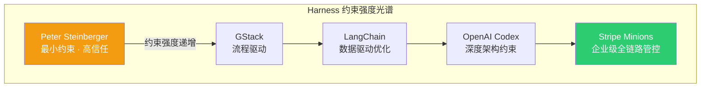
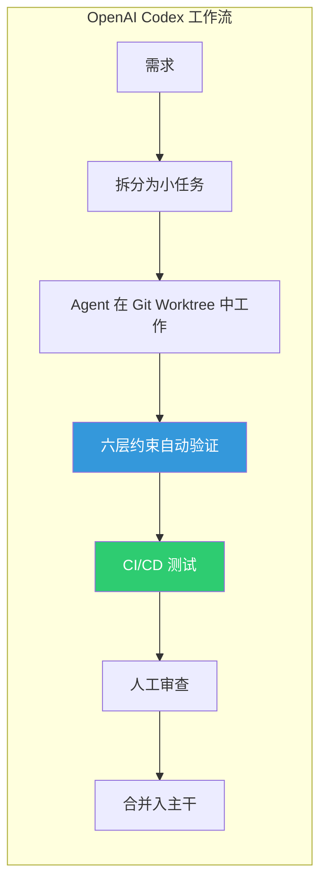
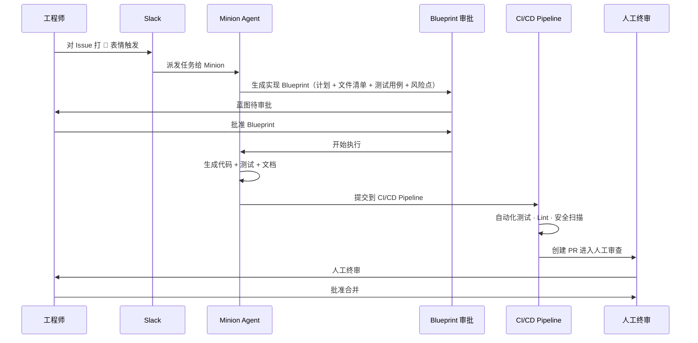
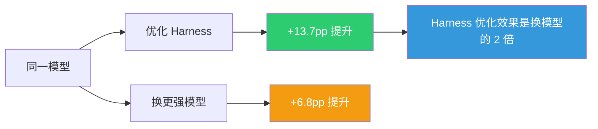
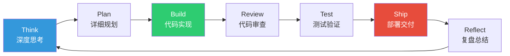
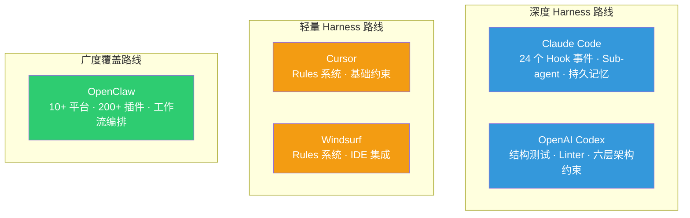
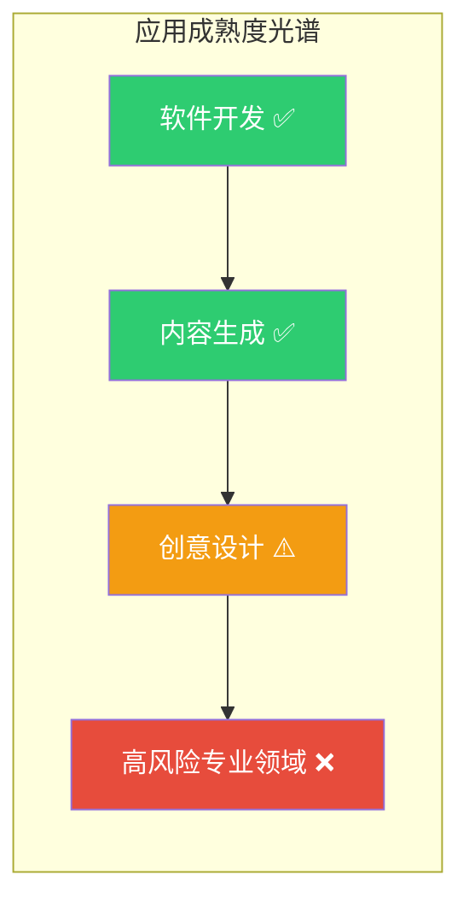
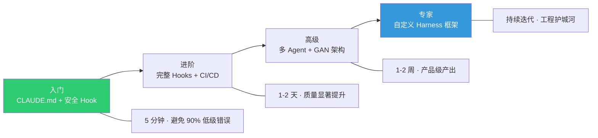

# Harness 行业案例与平台对比

> **系列**：Harness Engineering 技术实战
> **定位**：从真实世界的工程实践出发，拆解五大标杆案例的 Harness 设计细节，横向对比主流 AI 智能体平台的 Harness 能力，最后给出面向不同团队规模的选择指南。

---

## 1. 🏆 五大行业标杆：从个人极客到企业级全链路

理论讲完了，来看真刀真枪的实战——谁在用 Harness Engineering、怎么用、效果如何。这五个案例覆盖了从个人开发者到大厂的完整光谱：

| 案例 | 规模 | 核心 Harness 机制 | 载体 | 关键成果 |
|------|------|-------------------|------|---------|
| **OpenAI Codex** | 3→7 人 | 五原则 + 六层约束 + 自动垃圾回收 | AGENTS.md + 结构测试 + CI | 100 万行零手写，~10x 效率 |
| **Stripe Minions** | 企业级 | Slack 触发 → Blueprint 审批 → CI → 人工终审 | ~500 MCP 工具 + CI/CD | 1,300+ PRs/周 |
| **LangChain** | 开源团队 | 控制变量实验 + Doom Loop 检测 + 推理预算优化 | 系统提示 + 工具精简 + 中间件 | 排名 30+ → Top 5（+13.7pp） |
| **GStack** | 个人 | 28 角色 Sprint 流程 + 纯 Markdown 驱动 | CLAUDE.md + 自定义 Skills | 60 天 60 万行，48k Stars |
| **Peter Steinberger** | 个人（极端） | 高信任自治 + 最小约束 | 轻量 CLAUDE.md | 月均 6,600 次 commit |



---

### 案例一：OpenAI Codex 🚀 —— Agent-First 开发的规模化里程碑

#### 背景

OpenAI Codex 团队是 Harness Engineering 最早跑通规模化验证的标杆。3 个人、5 个月、100 万行生产级代码、零行手写——用的不是什么闭源黑科技，是所有人都能调用的同款 API。

#### 五大核心原则

| 原则 | 一句话精华 | 实践要点 |
|------|-----------|---------|
| **深度优先工作法** | 别给 Agent 宏大目标，拆成小构建块逐个攻克 | 每个 PR 只做一件事，控制在 200-500 行变更 |
| **给地图不给百科全书** | AGENTS.md 约 100 行做导航入口 | 详细文档放 `docs/` 目录，Agent 按需跳转检索 |
| **机械化架构强制** | 六层分级约束，结构测试自动验证 | Types → Config → Repo → Service → Runtime → UI |
| **让应用对 Agent 可观测** | Git worktree 独立实例 + Chrome DevTools MCP | Agent 能像人一样观察运行时状态 |
| **自动垃圾回收** | 品味编码为 Linter 规则 | "品味捕获一次，强制执行无限次" |



#### 💡 关键启示

Harness Engineering 不是锦上添花，是 Agent-First 模式的地基。没有精心设计的 Harness，3 个人根本驾驭不了 Agent 产出 100 万行生产级代码。

> **出处**：[Harness engineering: leveraging Codex in an agent-first world](https://openai.com/index/harness-engineering/)

---

### 案例二：Stripe Minions 🏦 —— 企业级 AI 工程的天花板

#### 背景

Stripe 的 Minions 系统是目前公开的企业级 Harness Engineering 最成熟的案例——每周自动合并 1,300+ 个 PR，背后是约 500 个 MCP 工具和一套精密的人机协作流程。

#### 完整工作流



#### Blueprint 机制详解

每个 Minion 动手写代码前，先生成一份结构化的 **Blueprint**（实现蓝图）：

| Blueprint 组成 | 说明 |
|---------------|------|
| 实现计划 | 分步骤的技术方案 |
| 需要修改的文件列表 | 精确到文件级别的变更范围 |
| 预期测试用例 | 覆盖正常路径和边界条件 |
| 潜在风险点 | 性能、安全、兼容性等维度的评估 |

交由人类审批后才开始执行。这是"机械化约束"和"反馈循环"在企业级场景中的教科书级结合——**先规划再执行，减少返工**。

#### 关键数据

| 指标 | 数值 |
|------|------|
| MCP 工具数量 | ~500 个（覆盖各种开发场景） |
| 每周自动合并 PR 数 | 1,300+ |
| 人工编写的代码量 | 0（所有 PR 都经过人工审查，但代码本身由 Agent 生成） |

#### 💡 关键设计启示

| 设计要点 | 说明 |
|----------|------|
| **人工终审不能省** | 所有 PR 都过人工审查，确保安全合规——企业级场景的底线 |
| **Blueprint 前置审批** | 先规划后执行，降低返工率和风险敞口 |
| **工具链全覆盖** | ~500 个 MCP 工具覆盖从代码生成到部署的全链路 |
| **在工程师熟悉的环境中触发** | Slack 集成让 Agent 嵌入现有工作流，不用工程师切换工具 |

> **出处**：[How Stripe built "minions"](https://www.lennysnewsletter.com/p/how-stripe-built-minionsai-coding)

---

### 案例三：LangChain 📊 —— 不换模型只改 Harness 的逆袭

#### 背景

LangChain 这个案例特别有说服力，因为他们做了一次严格的**控制变量实验**：模型不动，只调 Harness 的三个变量。

#### 实验设计

| 变量 | 改善前 | 改善后 |
|------|--------|--------|
| 模型 | GPT-5.2-Codex | GPT-5.2-Codex（**没换**） |
| 系统提示词 | 通用提示 | 针对 Terminal Bench 场景优化 |
| 工具集 | 基础工具集 | 精简 + 针对性设计 |
| 中间件 | 无 | Doom Loop 检测 + 推理预算控制 |

#### 实验结果

| 指标 | 改善前 | 改善后 | 变化 |
|------|--------|--------|------|
| Terminal Bench 2.0 得分 | 52.8% | 66.5% | **+13.7pp** |
| 排名 | 30+ | **Top 5** | 跃升 25+ 位 |

> 同期**换更强模型**通常只能拿到约 +6.8pp 的提升。



#### 两大独特贡献

**1. Doom Loop 检测中间件 🔄**

监控单个文件的编辑次数。第 6 次编辑还没过测试时，自动注入提示："你已经改这个文件 6 次了，退后一步重新评估整体方法。"——不是强制停下，而是给 Agent 一个"退一步看全局"的认知切换信号。

**2. Reasoning Sandwich 推理预算优化**

| 推理预算 | 得分 | 说明 |
|----------|------|------|
| `xhigh` | 53.9% | 过度推理导致超时，成绩反降 |
| `high` | 63.6% | 最佳平衡点 |
| `medium` | 58.2% | 推理不足 |

> **"推理越多越好"又是一个迷思**——过度推理不如适度推理 + 精心设计的 Harness。

> **出处**：[Improving Deep Agents with harness engineering](https://blog.langchain.com/improving-deep-agents-with-harness-engineering/)

---

### 案例四：GStack 🧑‍💻 —— 个人开发者的 Harness 标杆

#### 背景

Y Combinator 总裁 Garry Tan 开源了他的 Claude Code 工作流 GStack，**48 小时内拿到 10,000 GitHub Stars**（截至 2026 年 3 月已超 48k Stars）。整个 Harness 纯由 Markdown 文件构成，零代码依赖。

#### 核心理念："流程而非工具集"

GStack 的核心是 **28 个角色按 Sprint 顺序依次运行**，形成完整的开发闭环：



#### 28 个角色示例

| 角色 | 职责 | 触发时机 |
|------|------|---------|
| **Architect** | 系统架构设计与模块边界定义 | 新功能 / 新模块启动时 |
| **Builder** | 按架构规范实现代码 | Sprint 执行阶段 |
| **Reviewer** | 代码质量审查与架构合规性检查 | PR 创建后 |
| **Tester** | 编写并运行测试用例 | 代码实现完成后 |
| **Shipper** | 构建镜像 · 部署 · 验证 | 测试全部通过后 |
| **Reflector** | Sprint 复盘 · 经验沉淀 | Sprint 结束后 |

#### 关键数据

| 指标 | 数值 |
|------|------|
| 开发周期 | 60 天 |
| 代码产出 | 60 万行 |
| 测试代码占比 | 35% |
| GitHub Stars | 48k+ |
| 技术依赖 | 纯 Markdown，零代码依赖 |

#### 💡 关键设计启示

| 设计要点 | 说明 |
|----------|------|
| **纯 Markdown 驱动** | 整个 Harness 就是一组 Markdown 文件，零代码依赖，上手门槛极低 |
| **流程驱动而非工具驱动** | 28 个角色按 Sprint 顺序跑，清晰可预测，个人开发者直接复用 |
| **复盘即迭代** | Reflector 角色确保每个 Sprint 的经验被沉淀为下一轮改进 |

> **出处**：[github.com/garrytan/gstack](https://github.com/garrytan/gstack)

---

### 案例五：Peter Steinberger ⚡ —— 高信任模式的极端实践

#### 背景

Peter Steinberger（PSPDFKit 创始人）月均 **6,600 次 commit**，代表了 Harness Engineering 的另一个极端——用最少的约束换最高的自主性。

#### 特点

| 维度 | 说明 |
|------|------|
| 约束强度 | 最小化 |
| 信任级别 | 最大化 |
| 配置复杂度 | 极其精炼的 CLAUDE.md |
| 核心依赖 | 对项目架构的深度理解 + 快速判断 Agent 产出正确性的能力 |

> **⚠️ 这是极端案例，不建议初学者照搬。** Steinberger 对项目有极深的理解，能快速判断 Agent 产出的对错。大多数团队需要更强的约束和反馈循环。

---

### 五案例选择指南

| 你的场景 | 推荐参考 | 原因 |
|----------|---------|------|
| **个人开发者入门** | GStack | 流程清晰、纯 Markdown、上手门槛最低 |
| **团队协作** | Stripe Minions | CI/CD 集成、Blueprint 审批、人工终审 |
| **学习方法论** | LangChain | 控制变量实验、数据驱动、可复现 |
| **理解 Agent-First 天花板** | OpenAI Codex | 深度约束体系的极致实践 |
| **探索高信任模式** | Peter Steinberger | 极简 Harness 的可能性与边界 |

> **诚实说一句**：以上案例多为从零开始的 greenfield 项目。已有大量遗留代码的 brownfield 项目，Harness 落地难度更高，行业内的成熟案例仍然偏少。

---

## 2. 🔍 主流平台 Harness 能力横向对比

Harness Engineering 的理念是平台无关的，但不同 AI 智能体工具提供的 Harness 能力差别很大。以下是五个主流平台的深度对比：

### 完整能力矩阵

| 维度 | Claude Code | OpenAI Codex | Cursor | Windsurf | OpenClaw |
|------|-------------|--------------|--------|----------|----------|
| **定位** | CLI 编程智能体 | 云端编程智能体 | IDE 嵌入式助手 | IDE 嵌入式助手 | 通用智能体平台 |
| **导航文件** | CLAUDE.md（三层） | AGENTS.md | `.cursorrules` | `.windsurfrules` | 系统提示词 + 角色预设 |
| **约束机制** | Hooks（24 事件 × 4 处理器） | 结构测试 + 自定义 Linter | Rules（项目/全局） | Rules | 插件权限控制 |
| **反馈循环** | Hooks + CI + Sub-agent 评审 | CI/CD + Linter 回传 | 基础 Lint 反馈 | 基础 Lint 反馈 | 对话式反馈 |
| **工具扩展** | MCP + Skills | MCP（评估后未深度采用） | MCP | MCP | 插件系统（200+） |
| **会话管理** | Compaction + `/compact` | Thread（创建/恢复/分叉） | 会话持久化 | 会话持久化 | 多平台会话 + 上下文记忆 |
| **Sub-agent** | ✅ YAML frontmatter 自定义 | ❌ | ❌ | ❌ | ✅ 工作流编排 |
| **持久记忆** | ✅ Memory scope | ❌ | ❌ | ❌ | ✅ 对话历史持久化 |
| **开源程度** | CLI 开源 | codex-r 开源 | 闭源 | 闭源 | 开源（33 万+ Stars） |

> 数据截至 2026 年 3 月各平台官方文档。AI 工具迭代极快，以最新文档为准。

### 平台分类与定位



### 各平台详细分析

#### Claude Code：Harness 能力最完整的平台 🏅

**核心优势**：
- 24 个 Hook 事件覆盖 Agent 生命周期的几乎所有节点
- Sub-agent + 持久记忆是独有能力
- 三层配置文件（全局 / 项目 / 个人）+ Skills 渐进式知识加载

**Hooks 系统详解**：

| Hook 事件 | 触发时机 | 典型用途 |
|-----------|---------|---------|
| `PreToolUse` | 工具调用前 | 安全检查 · 权限验证 · 命令过滤 |
| `PostToolUse` | 工具调用后 | 自动格式化 · 质量检查 · 日志记录 |
| `PreCommit` | Git commit 前 | 代码质量门禁 · Lint · 测试 |
| `PostCommit` | Git commit 后 | 通知 · 进度追踪 |
| `Stop` | Agent 停止时 | 任务总结 · 通知团队 |

**配置示例**（面向 Go 微服务项目）：

```json
// .claude/settings.json
{
  "hooks": {
    "PreToolUse": [
      {
        "matcher": "Bash",
        "hooks": [
          {
            "type": "command",
            "command": "bash .claude/hooks/firewall.sh \"$CLAUDE_BASH_COMMAND\""
          }
        ]
      }
    ],
    "PostToolUse": [
      {
        "matcher": "Write|Edit",
        "hooks": [
          {
            "type": "command",
            "command": |
              # Go 文件自动格式化
              if echo "$CLAUDE_FILE_PATH" | grep -qE '\.go$'; then
                gofmt -w "$CLAUDE_FILE_PATH" 2>/dev/null
                goimports -w "$CLAUDE_FILE_PATH" 2>/dev/null
              fi
          }
        ]
      }
    ],
    "Stop": [
      {
        "hooks": [
          {
            "type": "command",
            "command": "bash .claude/hooks/notify-complete.sh"
          }
        ]
      }
    ]
  }
}
```


> **截图指南**：打开 Claude Code CLI，执行 `/config` 命令进入配置界面，或在 VS Code 中打开 Claude Code 扩展的 Settings 面板，找到 "Hooks" 配置区域截取。

#### OpenAI Codex：Agent-First 的深度实践

**核心优势**：
- Rust 实现（codex-r），性能优异
- JSON-RPC 2.0 via stdio JSONL 通信协议
- 三层会话模型（Item → Turn → Thread），支持暂停 / 恢复 / 分叉

**值得注意的设计分歧**：OpenAI 评估过 MCP 协议但选择不采用——他们认为 MCP 的工具导向模型不适合 Codex 更丰富的会话语义。这是一个值得关注的架构分歧点。

#### Cursor / Windsurf：轻量级 IDE 集成

**核心优势**：
- `.cursorrules` / `.windsurfrules` 项目级配置
- Rules 系统（项目 / 全局两级）
- 与 VS Code 深度集成，学习成本低

**局限**：没有 Hooks 系统，约束能力有限——只能通过提示词"建议"Agent，没法"强制"拦截违规操作。说白了就是只有"软约束"没有"硬约束"。

#### OpenClaw：通用智能体平台

**核心优势**：
- 支持 10+ 即时通讯平台（飞书 / 钉钉 / Telegram / 企业微信等）
- 200+ 插件生态
- 多家模型提供商接入
- 工作流编排能力

**适用场景**：非编程场景（客服机器人、运营自动化、内容管理）可能比 Claude Code 的"深 Harness + 精控制"模式更实用。

---

## 3. 🔮 应用前景与冷思考

### 成熟度光谱

| 领域 | 成熟度 | 说明 |
|------|:------:|------|
| **软件开发** | ✅ 成熟 | OpenAI、Stripe、LangChain 已大规模验证 |
| **内容生成** | ✅ 有前景 | Anthropic 的 GAN 式架构展示了自主创意生成的可能 |
| **创意设计** | ⚠️ 需探索 | Agent 仍然偏"安全设计"，突破性创意较少 |
| **高风险专业领域**（医疗 / 金融 / 法律） | ❌ 暂不适用 | 验证缺口在高风险场景中被急剧放大 |



### Bitter Lesson：为删除而设计

Philipp Schmid 的重要警告：**Harness 必须设计成可删除的。**

| 设计原则 | 说明 | 真实案例 |
|----------|------|---------|
| **Start Simple** | 别一上来就搞复杂的控制流，先提供稳健的原子工具 | 先用一个 CLAUDE.md + 两条 Hook 启动 |
| **Build to Delete** | 模块化架构，随时准备替换或删掉任意组件 | Manus 6 个月内重构 Harness 5 次 |
| **The Harness is the Dataset** | 竞争优势来自捕获的执行轨迹（trajectories），不是提示词本身 | 积累的执行经验才是护城河 |

### 🧊 冷思考：三个被反复验证的事实

| 事实 | 说明 |
|------|------|
| **复杂度转移而非消失** | "写代码的复杂度"被转移为"设计环境的复杂度"——Harness Engineering 没消灭复杂度，只是把它搬到了更适合人类发挥系统思维的位置 |
| **验证缺口仍然存在** | Harness 擅长检查代码"合不合规"，但对代码"对不对"（满足业务需求）的验证仍不充分 |
| **遗留代码困境** | 绝大多数成功案例都是 greenfield 项目，brownfield 项目的 Harness 落地尚无成熟方法论 |

---

## 4. 🧭 选择指南：找到适合你的 Harness 策略

### 按团队规模选择

| 团队规模 | 推荐策略 | 关键组件 |
|----------|---------|---------|
| **个人开发者** | 轻量 Harness | CLAUDE.md + 基础安全 Hooks（5 分钟搞定） |
| **小团队（2-5 人）** | 流程驱动 | GStack 风格角色定义 + CI/CD 集成 |
| **中型团队（5-20 人）** | 标准化 Harness | 完整 Hooks + 代码审查 + 自动化测试门禁 |
| **大型企业（20+ 人）** | 企业级全链路 | Stripe Minions 风格 + Blueprint 审批 + 人工终审 |

### 按项目类型选择

| 项目类型 | 推荐策略 | 重点 |
|----------|---------|------|
| **绿地开发（新项目）** | 完整 Harness | 从项目初始化就建规范，成本最低 |
| **遗留代码维护** | 渐进式 Harness | 先约束新增代码，逐步覆盖存量代码 |
| **原型 / 实验项目** | 最小 Harness | 快速迭代优先，验证通过后再补 Harness |
| **生产级应用** | 严格 Harness | 完整的约束 + 反馈循环 + 熵管理 |

### 按成熟度渐进式落地

| 阶段 | 推荐策略 | 关键动作 | 预期收益 |
|------|---------|---------|---------|
| **入门** | CLAUDE.md + 基础安全 Hook | 5 分钟搭建，拦截 `rm -rf`、凭证泄露等 | 避免 90% 的低级失误 |
| **进阶** | 完整 Hooks + CI/CD 集成 | 自动化质量门禁、Lint、测试 | Agent 产出质量显著提升 |
| **高级** | 多 Agent 协作 + GAN 式架构 | 评估与生成分离、独立 Evaluator | 从 demo 级提升到产品级 |
| **专家** | 自定义 Harness 框架 | 针对特定领域深度优化 | 形成团队的工程护城河 |



---

## 全套公开课课件领取：


---

- ## DXZY.AI

  DXZY.AI - 专注于 AI、RAG、Agent、MCP
  

  - GitHub: https://github.com/dxzyai/agent-dev-guide
  - 官网: https://dxzy.ai

  
