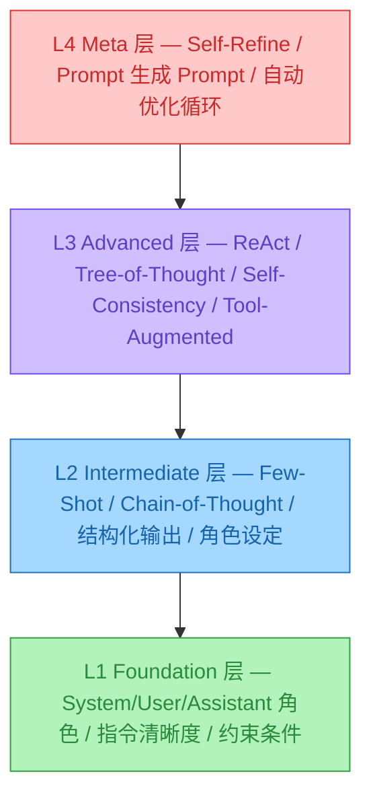
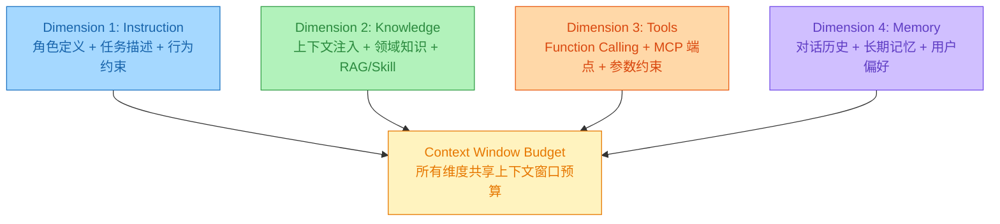

# Prompt 设计：结构、技术与反模式

> 📌 Prompt Engineering 系列 —— 从"会写提示词"到"理解 Prompt 的结构本质"

---

## 目录

- [1. 为什么 Prompt 是大模型开发的第一课](#1-为什么-prompt-是大模型开发的第一课)
- [2. Prompt 的四维结构](#2-prompt-的四维结构)
- [3. 六种核心 Prompt 技术](#3-六种核心-prompt-技术)
- [4. 常见反模式与修复方案](#4-常见反模式与修复方案)
- [5. 通用 Prompt 模板](#5-通用-prompt-模板)

---

## 💡 1. 为什么 Prompt 是大模型开发的第一课

### 1.1 Prompt 是人机交互的唯一接口

大模型应用开发说到底只干一件事：**把人类意图翻译成模型能理解的上下文，再把模型输出翻译回人类能用的结果**。Prompt 就是这中间唯一的桥梁。

无论你用 RAG、Agent Skills 还是 Function Calling，最终都是在**构造一个 Prompt**——RAG 往里塞检索结果，Skills 往里注入 SOP，Function Calling 往里写工具描述。Prompt 质量直接决定了整个系统的上限。

### 1.2 分层能力模型

Prompt Engineering 不是一个单一技术，而是分四个层级递进的技能栈：



> ▲ 越往上越依赖推理能力和工程化支撑，越往下越依赖表达清晰度和领域知识

**L1 靠表达清晰，L2 靠模式选择，L3 靠推理编排，L4 靠自动化闭环**。大多数开发者卡在 L1→L2 的跳跃上。

### 1.3 与其他优化手段的对比

| 维度 | Prompt Engineering | Fine-Tuning | RAG |
|------|-------------------|-------------|-----|
| **启动成本** | 极低（改文本） | 高（数据+GPU） | 中（索引+检索） |
| **迭代速度** | 秒级 | 小时~天级 | 分钟级 |
| **适用场景** | 通用任务 | 领域专精 | 知识密集型 |
| **上限** | 受模型基础能力限制 | 可突破基础能力 | 受检索质量限制 |
| **可解释性** | 高（文本可读） | 低（黑盒权重） | 中（可溯源片段） |

实际项目中的组合策略：先用 Prompt 快速验证需求可行性 → 加 RAG 补充外部知识 → 用 Fine-Tuning 打磨垂直场景。**Prompt 永远是第一站**，因为改一行 Prompt 比重新训练一个模型便宜一万倍。

---

## 🧩 2. Prompt 的四维结构

一份生产级 Prompt 由四个维度组成，每个维度负责一个独立的信息通道，所有维度共同受 Context Window 预算约束：



### 2.1 Instruction（指令）

指令是 Prompt 的骨架，包含三个子要素：

| 子要素 | 作用 | 示例 |
|--------|------|------|
| **角色定义** | 约束模型的知识边界和输出风格 | "你是一个资深 Python 后端工程师" |
| **任务描述** | 明确要做什么 | "分析以下代码片段，找出潜在的并发安全问题" |
| **行为约束** | 定义什么不能做 | "不要重写整个类，只指出问题行并给出修复建议" |

关键原则：**指令的清晰度和模型的执行准确率成正比**。

```python
# ❌ 模糊指令 — 模型会"自由发挥"
prompt = "帮我处理一下这些数据"

# ✅ 精确指令 — 模型知道边界在哪
prompt = """
你是一个数据清洗专家。请对以下 CSV 数据执行以下操作：
1. 删除所有包含空值的行
2. 将日期列统一转换为 YYYY-MM-DD 格式
3. 去除重复记录（以 id 列为唯一键）
4. 输出清洗后的数据，保持 CSV 格式
"""
```

### 2.2 Knowledge（知识注入）

知识注入就是往 Prompt 里塞外部信息——RAG 检索结果、文档片段、API 返回值等。

```python
prompt_template = """
## 参考资料
以下是从公司知识库中检索到的相关文档：
<context>
{retrieved_docs}
</context>

## 任务
基于上述参考资料回答用户问题。如果参考资料中没有相关信息，
请明确说明"根据现有资料无法回答"，不要编造。
"""
```

知识注入的三个坑：

1. **信息过载**：塞太多无关文档，模型注意力被稀释（Lost in the Middle）
2. **来源冲突**：不同文档说法矛盾，模型不知听谁的
3. **时效性**：注入了过期数据，模型基于旧信息回答

解法：控制注入长度（建议不超过上下文窗口的 30%）、标注来源和时间、用 `<context>` XML 标签把知识和指令隔离。

### 2.3 Tools（工具描述）

在 Agent 场景下，Prompt 还需要包含工具的描述信息，让模型知道"我能调什么"：

```python
tools_definition = [
    {
        "type": "function",
        "function": {
            "name": "search_database",
            "description": "搜索产品数据库。当用户询问产品信息、价格、库存时使用。",
            "parameters": {
                "type": "object",
                "properties": {
                    "query": {
                        "type": "string",
                        "description": "搜索关键词，如产品名称、型号"
                    },
                    "category": {
                        "type": "string",
                        "enum": ["electronics", "clothing", "food"],
                        "description": "产品类别，用于缩小搜索范围"
                    }
                },
                "required": ["query"]
            }
        }
    }
]
```

**工具描述的质量直接决定 Function Calling 的准确率**。一个写得含糊的 `description`，模型可能在该调的时候不调、不该调的时候乱调。

### 2.4 Memory（记忆管理）

对话历史和长期记忆是第四个维度。在多轮对话中，历史消息会占用越来越多的上下文窗口：

| 记忆类型 | 存储位置 | 生命周期 | 典型大小 |
|----------|----------|----------|----------|
| **短期记忆** | messages 数组 | 当前会话 | 2K-32K tokens |
| **长期记忆** | 外部存储（DB/文件） | 跨会话持久 | 按需注入 |
| **工作记忆** | 当前 Prompt | 当前轮次 | < 1K tokens |

记忆管理的核心挑战：怎么在有限的 Context Window 里保留最有价值的历史信息。这部分和 Agent Skills 的渐进式加载是同一个思路——按需加载，用完释放。

---

## ⚡ 3. 六种核心 Prompt 技术

这一节逐一拆解六种经过生产验证的 Prompt 技术，每种给出原理、代码和适用场景。

### 3.1 Zero-Shot Prompting（零样本提示）

**原理**：不给任何示例，直接下达指令。依赖模型的预训练知识。

```python
from langchain_openai import ChatOpenAI

llm = ChatOpenAI(model="gpt-4o", temperature=0)

response = llm.invoke(
    "将以下英文句子翻译成中文，保持专业术语准确：\n"
    "\"The transformer architecture uses multi-head self-attention "
    "mechanisms to process input sequences in parallel.\""
)
```

适用场景：任务定义清晰、模型能力覆盖的简单任务（翻译、摘要、分类）。局限：复杂任务或特殊输出格式时，模型容易"自由发挥"。

### 3.2 Few-Shot Prompting（少样本提示）

**原理**：在 Prompt 中给出几个输入→输出的示例，让模型"照葫芦画瓢"。

```python
prompt = """
你是一个情感分析器。请根据示例判断用户评论的情感倾向。

示例 1:
输入: "这个产品质量太差了，用了一天就坏了"
输出: {"sentiment": "negative", "confidence": 0.95, "reason": "产品质量问题"}

示例 2:
输入: "物流很快，包装也很好，非常满意"
输出: {"sentiment": "positive", "confidence": 0.90, "reason": "物流和包装体验好"}

示例 3:
输入: "还行吧，没什么特别的感觉"
输出: {"sentiment": "neutral", "confidence": 0.70, "reason": "无明显情感倾向"}

请分析:
输入: "客服态度很差，但是产品本身还不错"
"""
```

Few-Shot 的三个设计要点：**示例数量** 3-5 个足够；**示例多样性** 覆盖不同类别和边界情况；**示例顺序** 把最接近目标输入的示例放在最后（Recency Bias）。

### 3.3 Chain-of-Thought（思维链）

**原理**：要求模型"一步一步思考"，把推理过程显式展示出来。对数学、逻辑、多步骤推理任务的提升非常显著。

```python
# 标准 CoT：加一句"让我们一步一步思考"
prompt = """
问题：一个商店有 150 个苹果，卖出了 40%，
又进货了剩余数量的 1/3，最后有多少个苹果？

让我们一步一步思考：
"""

# 结构化 CoT：用标签约束推理过程
prompt = """
问题：分析以下 Python 代码的时间复杂度。

请按以下步骤分析：
<thinking>
1. 外层循环的执行次数
2. 内层循环的执行次数
3. 总操作次数
4. 最终时间复杂度
</thinking>

<answer>时间复杂度及推导过程</answer>
"""
```

CoT 不只是"让模型写过程"——它通过**强制中间推理步骤**来减少跳步导致的错误。实验表明，CoT 在 GSM8K（数学推理）上可以将准确率从约 18%（Zero-Shot）提升到约 78%（CoT + GPT-4o）。

### 3.4 Role Prompting（角色设定）

**原理**：通过给模型分配一个具体角色，约束其知识范围、输出风格和行为模式。

```python
system_prompt = """
# 角色
你是 Alex，一位拥有 15 年经验的资深后端架构师。

# 专长领域
- 高并发系统设计（日活千万级）
- 微服务架构拆分与治理
- 数据库选型与优化（MySQL/PostgreSQL/Redis/MongoDB）

# 沟通风格
- 直接给出结论，再解释原因
- 用具体数字量化方案优劣
- 如果不确定，说"这个需要 benchmark 才能确定"

# 行为约束
- 不要给出泛泛而谈的"最佳实践"，要结合具体场景
- 涉及安全问题时，优先考虑安全性而非性能
- 如果用户的需求不合理，直接指出来
"""
```

角色设定的本质：它不是"角色扮演"，而是**通过角色描述来精确控制模型的知识先验和输出分布**。"你是一个法务专家"这句话，会把模型的输出概率分布往法律领域的专业表达上偏移。

### 3.5 Structured Output（结构化输出）

**原理**：通过 Prompt 约束模型输出特定格式（JSON、XML、表格），方便下游程序解析。

```python
# 方法 1：Prompt 约束
prompt = """
从以下简历文本中提取信息，以 JSON 格式输出。

输出格式（严格遵循，不要添加额外字段）：
{
  "name": "string",
  "gender": "string",
  "birth_date": "YYYY-MM",
  "education": [
    {"school": "string", "major": "string", "degree": "string", "period": "string"}
  ],
  "work_experience": [
    {"company": "string", "position": "string", "period": "string"}
  ]
}
"""

# 方法 2：LangChain with_structured_output（推荐）
from langchain_openai import ChatOpenAI
from pydantic import BaseModel, Field

class Resume(BaseModel):
    name: str = Field(description="姓名")
    gender: str = Field(description="性别")
    birth_date: str = Field(description="出生日期，YYYY-MM 格式")
    education: list[dict] = Field(description="教育经历列表")
    work_experience: list[dict] = Field(description="工作经历列表")

llm = ChatOpenAI(model="gpt-4o").with_structured_output(Resume)
result = llm.invoke(prompt)  # 返回 Resume 对象，不是字符串
```

`with_structured_output` 会在 API 层面强制模型输出符合 Schema 的 JSON，不靠"Prompt 约束"而靠**参数约束**，准确率接近 100%。

### 3.6 Self-Consistency（自一致性）

**原理**：对同一个问题让模型回答多次（高 temperature），然后取多数投票的结果。适合答案明确但推理路径复杂的任务。

```python
from collections import Counter

def self_consistency(llm, prompt: str, n_samples: int = 5) -> tuple:
    """多次采样 + 多数投票"""
    responses = []
    for _ in range(n_samples):
        resp = llm.invoke(prompt)  # temperature > 0
        answer = extract_answer(resp.content)
        responses.append(answer)

    counter = Counter(responses)
    most_common = counter.most_common(1)[0]
    return most_common[0], most_common[1] / n_samples
```

适用场景：数学推理、逻辑判断、代码 bug 定位等答案非开放式的任务。代价：Token 消耗 × N（采样次数），延迟也相应增加。生产环境建议 N=3~5。

---

## ⚠️ 4. 常见反模式与修复方案

### 反模式 1：Prompt 膨胀

**症状**：System Prompt 超过 2000 tokens，塞了一堆"你必须""你绝对不能"。

```python
# ❌ 膨胀的 Prompt（约 800 tokens）
bad_prompt = """
你是一个非常专业的客服助手。你必须始终保持礼貌。你绝对不能编造信息。
如果用户问到你不了解的内容，你必须说"我不确定"。你不能推荐竞品。
你必须用中文回答。你必须在回答末尾询问用户是否还有其他问题。
你的回答不能超过 200 字。你必须...
"""

# ✅ 精简的 Prompt（约 200 tokens）
good_prompt = """
<role>客服助手</role>
<rules>
- 中文回答，200 字以内
- 不编造信息，不确定时说"我不确定"
- 不推荐竞品
- 结尾问"还有其他问题吗？"
</rules>
"""
```

### 反模式 2：示例污染

**症状**：Few-Shot 示例中的模式被模型"过度学习"，导致新输入也输出同样的格式或内容。

**修复**：增加示例多样性，或加一句负向提示："请根据实际内容回答，不要照搬示例。"

### 反模式 3：指令与上下文冲突

**症状**：System Prompt 说"只基于参考资料回答"，但参考资料里没有答案，模型就开始编。

**修复**：明确降级策略——"如果参考资料中没有相关信息，回复：根据现有资料无法回答此问题。"

### 反模式 4：忽略模型差异

**症状**：同一个 Prompt 在 GPT-4o 上表现很好，换到 Claude 或 GLM-4 就崩了。

**修复**：不同模型的 Prompt 要分别调优。GPT 偏好结构化标签，Claude 偏好自然语言描述，国产模型通常需要更详细的指令。

### 反模式 5：Temperature 滥用

**症状**：所有任务都用 temperature=0 或都用 temperature=1。

| 任务类型 | 推荐 Temperature | 原因 |
|----------|------------------|------|
| 数据提取、分类、格式转换 | 0 | 需要确定性输出 |
| 客服对话、文档撰写 | 0.3-0.5 | 适度灵活 |
| 创意写作、头脑风暴 | 0.7-1.0 | 需要多样性 |
| Self-Consistency 采样 | 0.7-0.9 | 需要不同推理路径 |

---

## 📋 5. 通用 Prompt 模板

```markdown
<role>{角色定义}</role>

<context>{参考资料/背景信息}</context>

<task>{具体任务描述}</task>

<constraints>
- {约束条件 1}
- {约束条件 2}
</constraints>

<output_format>
{期望的输出格式和结构}
</output_format>

<input>{用户实际输入}</input>
```

关键原则速查：

| 原则 | 说明 |
|------|------|
| **指令优先** | 先写清楚做什么，再补充背景知识 |
| **结构化分区** | 用 XML 标签把角色、指令、知识、格式分开 |
| **Few-Shot 精选** | 3-5 个覆盖多样性的示例，胜过 10 个雷同的 |
| **CoT 降错** | 多步推理任务强制要求"一步一步思考" |
| **成本意识** | System Prompt 是每轮都消耗的固定成本，越精简越好 |

---

## 📚 延伸阅读

- [OpenAI Prompt Engineering Guide](https://platform.openai.com/docs/guides/prompt-engineering) - 官方最佳实践
- [Anthropic Prompt Engineering](https://docs.anthropic.com/en/docs/build-with-claude/prompt-engineering) - Claude 专属技巧
- [LangChain Prompt Templates](https://python.langchain.com/docs/concepts/prompt_templates/) - 框架级 Prompt 管理

## 全套公开课课件领取：


## DXZY.AI

DXZY.AI - 专注于 AI、RAG、Agent、MCP


- GitHub: https://github.com/dxzyai/agent-dev-guide
- 官网: https://dxzy.ai
  
