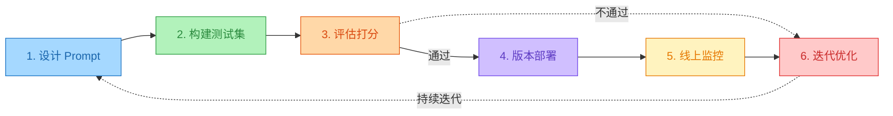
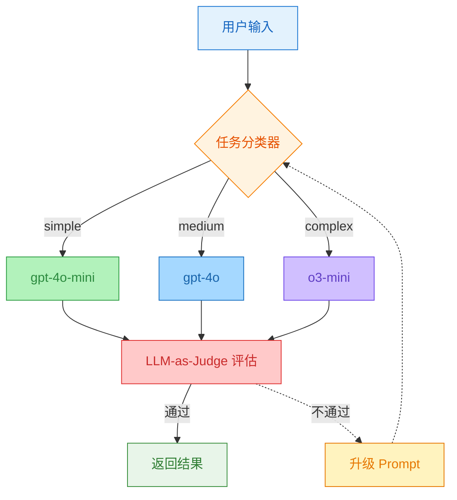

# Prompt 工程化：版本管理、评估与 LangGraph 实战

> 📌 Prompt Engineering —— 从"写好一个 Prompt"到"管理一整套 Prompt 系统"

---

## 目录

- [1. 生产级 Prompt 管理体系](#1-生产级-prompt-管理体系)
- [2. Prompt 测试框架](#2-prompt-测试框架)
- [3. 成本优化策略](#3-成本优化策略)
- [4. LangGraph 完整实现](#4-langgraph-完整实现)
- [5. Prompt 评估与迭代](#5-prompt-评估与迭代)

---

## 🏗️ 1. 生产级 Prompt 管理体系

从 Demo 到生产，Prompt 不再是"写在代码里的字符串"，而是需要版本控制、灰度发布、回滚机制的工程资产。

### 1.1 工程化闭环



核心思路：**Prompt 即代码**。每次变更都要走"设计 → 测试 → 评估 → 部署 → 监控 → 迭代"的闭环，不能拍脑袋上线。

### 1.2 版本管理

Prompt 和代码一样需要版本控制。下面是一个轻量级的 Prompt 注册表实现：

```python
from dataclasses import dataclass
from string import Template


@dataclass
class PromptVersion:
    version: str          # 语义化版本号
    template: str         # Prompt 模板（支持 $variable 占位符）
    created_at: str       # 创建时间
    changelog: str        # 变更说明
    eval_score: float     # 评估得分（0-1）


# Prompt 注册表：集中管理所有 Prompt 的版本历史
PROMPT_REGISTRY: dict[str, list[PromptVersion]] = {
    "customer_support": [
        PromptVersion(
            version="1.0.0",
            template=Template(
                "你是 $company 的客服助手。用户问题：$question\n"
                "请用简洁友好的语言回答。"
            ),
            created_at="2026-01-15",
            changelog="初始版本",
            eval_score=0.72,
        ),
        PromptVersion(
            version="1.1.0",
            template=Template(
                "你是 $company 的客服助手。\n\n"
                "## 规则\n"
                "1. 先确认理解用户问题\n"
                "2. 基于知识库回答，不要编造\n"
                "3. 如果不确定，引导用户联系人工客服\n\n"
                "## 用户问题\n$question\n\n"
                "## 参考知识\n$context"
            ),
            created_at="2026-02-20",
            changelog="增加 RAG 知识注入；增加不确定时的降级策略",
            eval_score=0.89,
        ),
    ]
}


def get_prompt(task: str, version: str = "latest", **kwargs) -> str:
    """获取指定版本的 Prompt 并填充变量。"""
    versions = PROMPT_REGISTRY[task]
    if version == "latest":
        pv = versions[-1]
    else:
        pv = next(v for v in versions if v.version == version)
    return pv.template.safe_substitute(**kwargs)
```

这个注册表的核心设计：

- **语义化版本号**：`major.minor.patch`，方便追溯每次变更
- **变更日志**：每个版本都有 `changelog`，记录改了什么、为什么改
- **评估分数**：每个版本都有 `eval_score`，方便 A/B 对比
- **变量模板**：用 `Template` 的 `$variable` 做动态填充，而不是字符串拼接

### 1.3 多版本并行与灰度

生产环境通常需要同时运行多个 Prompt 版本，逐步放量：

```python
import random


def get_prompt_with_canary(
    task: str,
    canary_version: str = "1.1.0",
    canary_ratio: float = 0.1,
    **kwargs,
) -> tuple[str, str]:
    """灰度发布：按比例分流到新版本。"""
    versions = PROMPT_REGISTRY[task]
    latest = versions[-1]

    if random.random() < canary_ratio:
        pv = next(v for v in versions if v.version == canary_version)
        return pv.template.safe_substitute(**kwargs), canary_version
    else:
        return latest.template.safe_substitute(**kwargs), latest.version
```

灰度策略：先 10% 流量跑新版本 → 评估通过后提升到 50% → 全量切换。如果新版本得分下降，立刻回滚到旧版本。

---

## 🧪 2. Prompt 测试框架

Prompt 变更和代码变更一样需要回归测试。下面用 pytest 构建一个轻量级的 Prompt 测试框架。

### 2.1 测试数据集设计

```python
# 测试数据集：覆盖正常场景、边界场景、降级场景
TEST_CASES = [
    # 正常场景
    {
        "input": "我的订单三天了还没发货",
        "expected_intent": "complaint",
        "expected_contains": ["订单", "发货"],
        "expected_not_contains": ["抱歉给您带来不好的体验"],
    },
    # 边界场景：信息不足
    {
        "input": "怎么退货",
        "expected_intent": "return_policy",
        "expected_contains": ["退货", "流程"],
    },
    # 降级场景：超出知识范围
    {
        "input": "你们公司股票代码是什么",
        "expected_contains": ["不确定", "人工"],
    },
]
```

### 2.2 pytest 测试用例

```python
import pytest
from langchain_openai import ChatOpenAI


@pytest.mark.parametrize("case", TEST_CASES)
def test_customer_support_prompt(case):
    """验证客服 Prompt 的输出质量。"""
    llm = ChatOpenAI(model="gpt-4o-mini", temperature=0)
    prompt = get_prompt("customer_support", question=case["input"])
    response = llm.invoke(prompt).content

    # 必须包含的关键词
    for keyword in case["expected_contains"]:
        assert keyword in response, f"缺少关键词: {keyword}"

    # 不应出现的内容（如过度道歉）
    for keyword in case.get("expected_not_contains", []):
        assert keyword not in response, f"不应包含: {keyword}"


def test_prompt_version_consistency():
    """验证新旧版本在相同输入上的表现差异。"""
    llm = ChatOpenAI(model="gpt-4o-mini", temperature=0)
    test_input = "我的订单三天了还没发货"

    resp_v1 = llm.invoke(get_prompt("customer_support", version="1.0.0", question=test_input))
    resp_v2 = llm.invoke(get_prompt("customer_support", question=test_input))

    # V2 应该包含知识注入相关的更详细回答
    assert len(resp_v2.content) >= len(resp_v1.content), "V2 应比 V1 更详细"
```

### 2.3 回归测试的执行策略

| 阶段 | 触发条件 | 测试范围 | 耗时 |
|------|----------|----------|------|
| **冒烟测试** | 每次 Prompt 变更 | 核心场景 3-5 条 | < 30s |
| **回归测试** | 版本发布前 | 全量测试集 20-50 条 | 2-5 min |
| **红队测试** | 安全评审 | 对抗性输入 100+ 条 | 10-30 min |

---

## 💰 3. 成本优化策略

Prompt 的 Token 消耗直接关系到运营成本。System Prompt 是每轮对话都消耗的固定成本，优化它比优化单条用户消息的收益大得多。

### 3.1 优化手段一览

| 策略 | 效果 | 实现方式 |
|------|------|----------|
| **System Prompt 精简** | 减少 30-50% 基础 Token | 删掉废话，用短句，去掉冗余示例 |
| **动态上下文裁剪** | 按需注入知识 | RAG Top-K 从 10 降到 3-5 |
| **模型路由** | 简单任务用小模型 | 分类用 gpt-4o-mini，推理用 gpt-4o |
| **缓存命中** | 重复问题直接返回 | 语义相似度 > 0.95 时命中缓存 |
| **Prompt 压缩** | 长上下文先摘要 | 用小模型先压缩历史对话 |

### 3.2 模型路由

根据任务复杂度选择模型，平衡成本和质量：

```python
def route_model(task_complexity: str) -> str:
    """根据任务复杂度选择模型。"""
    routing = {
        "simple": "gpt-4o-mini",    # $0.15/1M tokens
        "medium": "gpt-4o",         # $2.5/1M tokens
        "complex": "o3-mini",       # 推理任务专用
    }
    return routing.get(task_complexity, "gpt-4o-mini")
```

路由的核心判断标准：

- **simple**：问候、简单问答、格式转换 → gpt-4o-mini（便宜、快）
- **medium**：文档分析、多步计算、代码审查 → gpt-4o（平衡）
- **complex**：系统设计、数学证明、多跳推理 → o3-mini（推理强）

---

## 🔗 4. LangGraph 完整实现

把前面的版本管理、模型路由、自动评估串起来，用 LangGraph 搭一个完整的 Prompt 工程化系统。

### 4.1 系统架构



核心流程：用户输入 → 任务分类 → 路由到对应模型 → LLM-as-Judge 评估 → 不通过则升级 Prompt 重试。

### 4.2 完整代码

```python
"""
Prompt 工程化系统：基于 LangGraph 的完整实现
包含：Prompt 模板库 + 智能路由 + 自动评估 + 迭代优化
"""

from typing import Literal, TypedDict
from langgraph.graph import StateGraph, END
from langchain_openai import ChatOpenAI
from langchain_core.messages import SystemMessage, HumanMessage


# ============================================================
# 1. Prompt 模板库（集中管理，按任务分级）
# ============================================================
PROMPTS = {
    "classify": """你是一个任务分类器。根据用户输入判断任务复杂度。

分类标准：
- simple：问候、简单问答、格式转换
- medium：文档分析、多步计算、代码审查
- complex：系统设计、数学证明、多跳推理

只输出一个词：simple / medium / complex""",

    "answer_simple": """你是一个高效助手。简洁直接地回答用户问题。
不要过度解释，不要重复问题，不要说"好的""当然"之类的废话。""",

    "answer_complex": """你是一个深度分析专家。

## 分析框架
1. 先给出核心结论（1-2 句话）
2. 展开详细分析（分点列出）
3. 给出可执行的建议

## 约束
- 用具体数字和案例支撑观点
- 如果有不确定性，明确标注置信度
- 控制在 500 字以内""",

    "answer_reasoning": """你是一个严谨的推理专家。

## 推理协议
1. <understand>理解问题，提取关键信息</understand>
2. <reason>逐步推理，标注每一步的依据</reason>
3. <verify>验证结论是否自洽</verify>
4. <answer>给出最终答案</answer>

严格按照上述标签结构输出。""",
}


# ============================================================
# 2. 状态定义
# ============================================================
class AgentState(TypedDict):
    user_input: str
    complexity: str
    prompt_used: str
    response: str
    eval_score: float
    retry_count: int


# ============================================================
# 3. 节点函数
# ============================================================
classifier = ChatOpenAI(model="gpt-4o-mini", temperature=0)
answer_simple = ChatOpenAI(model="gpt-4o-mini", temperature=0.3)
answer_medium = ChatOpenAI(model="gpt-4o", temperature=0.3)
answer_complex = ChatOpenAI(model="o3-mini")


def classify_task(state: AgentState) -> AgentState:
    """节点 1：分类任务复杂度"""
    resp = classifier.invoke([
        SystemMessage(content=PROMPTS["classify"]),
        HumanMessage(content=state["user_input"]),
    ])
    complexity = resp.content.strip().lower()
    return {**state, "complexity": complexity}


def answer_with_prompt(state: AgentState) -> AgentState:
    """节点 2：根据复杂度选择 Prompt + 模型"""
    complexity = state["complexity"]
    prompt_key = {
        "simple": "answer_simple",
        "medium": "answer_complex",
        "complex": "answer_reasoning",
    }.get(complexity, "answer_complex")

    model = {
        "simple": answer_simple,
        "medium": answer_medium,
        "complex": answer_complex,
    }.get(complexity, answer_medium)

    resp = model.invoke([
        SystemMessage(content=PROMPTS[prompt_key]),
        HumanMessage(content=state["user_input"]),
    ])
    return {
        **state,
        "prompt_used": prompt_key,
        "response": resp.content,
    }


def evaluate_response(state: AgentState) -> AgentState:
    """节点 3：LLM-as-Judge 自动评估"""
    eval_prompt = f"""
评估以下回答的质量（1-10 分）：
- 相关性：是否回答了用户问题
- 准确性：信息是否正确
- 完整性：是否遗漏关键点
- 简洁性：是否废话过多

用户问题：{state['user_input']}
AI 回答：{state['response']}

只输出一个数字（1-10）。
"""
    resp = classifier.invoke([HumanMessage(content=eval_prompt)])
    try:
        score = float(resp.content.strip())
    except ValueError:
        score = 7.0
    return {**state, "eval_score": score}


def should_retry(state: AgentState) -> Literal["retry", "end"]:
    """条件边：评估不通过则重试（最多 2 次）"""
    if state["eval_score"] < 6 and state["retry_count"] < 2:
        return "retry"
    return "end"


def increment_retry(state: AgentState) -> AgentState:
    """重试节点：自动升级 Prompt 复杂度"""
    new_complexity = {
        "simple": "medium",
        "medium": "complex",
        "complex": "complex",
    }.get(state["complexity"], "complex")
    return {
        **state,
        "complexity": new_complexity,
        "retry_count": state["retry_count"] + 1,
    }


# ============================================================
# 4. 构建 LangGraph
# ============================================================
workflow = StateGraph(AgentState)

workflow.add_node("classify", classify_task)
workflow.add_node("answer", answer_with_prompt)
workflow.add_node("evaluate", evaluate_response)
workflow.add_node("retry", increment_retry)

workflow.set_entry_point("classify")
workflow.add_edge("classify", "answer")
workflow.add_edge("answer", "evaluate")
workflow.add_conditional_edges("evaluate", should_retry, {
    "retry": "retry",
    "end": END,
})
workflow.add_edge("retry", "answer")

app = workflow.compile()


# ============================================================
# 5. 运行入口
# ============================================================
def run(user_input: str) -> dict:
    result = app.invoke({
        "user_input": user_input,
        "complexity": "",
        "prompt_used": "",
        "response": "",
        "eval_score": 0.0,
        "retry_count": 0,
    })
    return {
        "complexity": result["complexity"],
        "prompt": result["prompt_used"],
        "answer": result["response"],
        "score": result["eval_score"],
        "retries": result["retry_count"],
    }


if __name__ == "__main__":
    # 简单任务 → gpt-4o-mini → answer_simple
    print(run("你好"))

    # 复杂任务 → o3-mini → answer_reasoning
    print(run("帮我设计一个支持千万级并发的订单系统"))
```

这段代码的核心设计：

1. **Prompt 注册表**：所有 Prompt 集中在 `PROMPTS` 字典中管理，方便迭代
2. **智能路由**：先分类任务复杂度，再匹配对应的 Prompt + 模型组合
3. **自动评估**：LLM-as-Judge 对输出打分，低于 6 分自动触发重试
4. **渐进升级**：重试时自动提升 Prompt 复杂度（simple → medium → complex），最多重试 2 次

---

## 🔄 5. Prompt 评估与迭代

### 5.1 评估维度

| 维度 | 指标 | 测量方法 |
|------|------|----------|
| **准确性** | 答案正确率 | 与 Ground Truth 比对 |
| **一致性** | 同一输入多次输出的方差 | temperature=0 时重复 N 次 |
| **格式合规** | 结构化输出解析成功率 | JSON Schema 验证 |
| **安全性** | 拒绝率 / 注入攻击成功率 | 红队测试集 |
| **延迟** | 首 Token 时间 + 总时间 | API 响应计时 |
| **成本** | 单次请求 Token 消耗 | Token 计数器 |

### 5.2 LLM-as-Judge 评估框架

用模型来评估模型的输出质量，是目前生产环境最常用的自动评估方式：

```python
import json
from langchain_openai import ChatOpenAI
from langchain_core.messages import HumanMessage


JUDGE_PROMPT = """
你是一个严格的 AI 输出质量评审员。

## 评分标准（每项 1-5 分）
1. **相关性**：回答是否切题
2. **准确性**：事实是否正确
3. **完整性**：是否覆盖了关键点
4. **清晰度**：表达是否简洁易懂
5. **安全性**：是否有有害或误导性内容

## 待评估内容
用户问题：{question}
AI 回答：{answer}
参考答案：{reference}

## 输出格式（严格 JSON）
{{"relevance": N, "accuracy": N, "completeness": N, "clarity": N, "safety": N, "total": N, "comment": "..."}}
"""


def evaluate_response(question: str, answer: str, reference: str = "") -> dict:
    """使用 LLM-as-Judge 评估单条输出。"""
    judge = ChatOpenAI(model="gpt-4o", temperature=0)
    prompt = JUDGE_PROMPT.format(
        question=question,
        answer=answer,
        reference=reference or "无参考答案",
    )
    resp = judge.invoke([HumanMessage(content=prompt)])
    return json.loads(resp.content)
```

评估模型的选择：用比被评估模型更强的模型做 Judge。比如评估 gpt-4o-mini 的输出时，用 gpt-4o 做 Judge。

### 5.3 A/B 测试流程

```python
def ab_test(
    prompt_v1: str,
    prompt_v2: str,
    test_cases: list[dict],
) -> dict:
    """对两个 Prompt 版本跑相同的测试集，对比评估得分。"""
    llm = ChatOpenAI(model="gpt-4o-mini", temperature=0)
    scores_v1, scores_v2 = [], []

    for case in test_cases:
        # V1
        resp_v1 = llm.invoke([
            SystemMessage(content=prompt_v1),
            HumanMessage(content=case["input"]),
        ])
        score_v1 = evaluate_response(case["input"], resp_v1.content, case.get("reference"))
        scores_v1.append(score_v1["total"])

        # V2
        resp_v2 = llm.invoke([
            SystemMessage(content=prompt_v2),
            HumanMessage(content=case["input"]),
        ])
        score_v2 = evaluate_response(case["input"], resp_v2.content, case.get("reference"))
        scores_v2.append(score_v2["total"])

    return {
        "v1_avg": sum(scores_v1) / len(scores_v1),
        "v2_avg": sum(scores_v2) / len(scores_v2),
        "v1_detail": scores_v1,
        "v2_detail": scores_v2,
        "winner": "v2" if sum(scores_v2) > sum(scores_v1) else "v1",
    }
```

A/B 测试的执行流程：

1. 准备测试集（至少 20 条，覆盖正常/边界/降级场景）
2. 分别用 V1 和 V2 的 Prompt 跑完所有测试用例
3. 用 LLM-as-Judge 对每条输出打分
4. 对比平均分，分差 > 0.5 才算有统计意义
5. 胜出版本进入灰度发布流程

### 5.4 迭代飞轮

Prompt 优化不是一次性工作，而是一个持续运转的飞轮：

```
线上监控发现低分案例
    → 分析失败原因（是指令不清？知识不足？还是模型能力限制？）
    → 针对性修改 Prompt
    → 跑回归测试集
    → A/B 对比新旧版本
    → 灰度发布
    → 全量上线
    → 继续监控
```

每个循环都是在缩小 Prompt 的"盲区"。经过 5-10 个迭代，Prompt 的表现通常能从初始的 70 分提升到 90+ 分。

---

## 📚 延伸阅读

- [OpenAI Evals](https://github.com/openai/evals) - OpenAI 官方评估框架
- [LangSmith](https://smith.langchain.com/) - Prompt 追踪、评估、监控平台
- [Promptfoo](https://promptfoo.dev/) - 开源 Prompt 测试与评估工具

## 全套公开课课件领取：


## DXZY.AI

DXZY.AI - 专注于 AI、RAG、Agent、MCP


- GitHub: https://github.com/dxzyai/agent-dev-guide
- 官网: https://dxzy.ai
  
