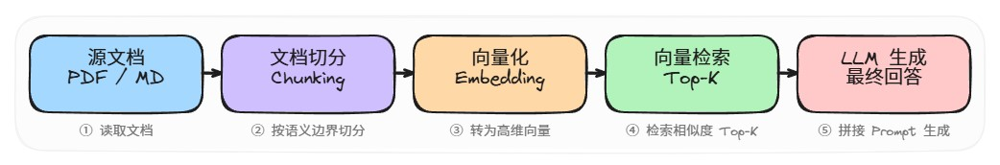
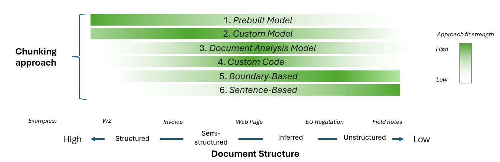
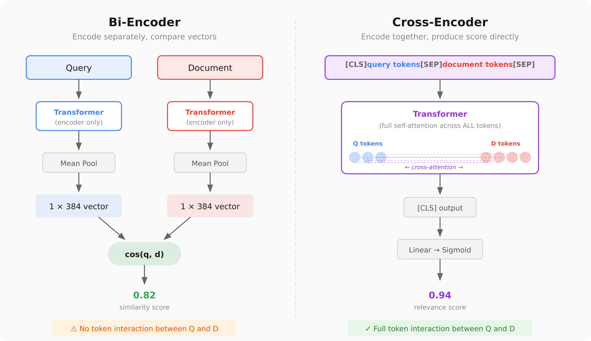
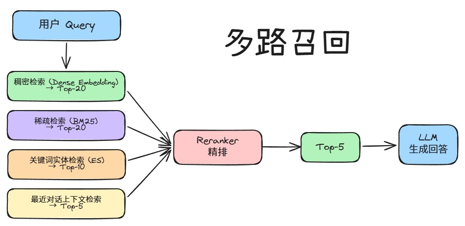
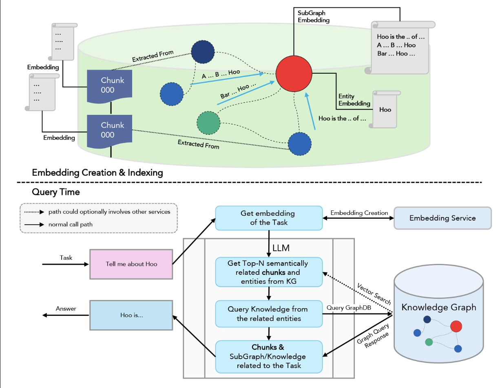
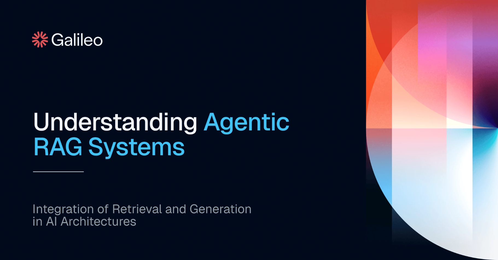
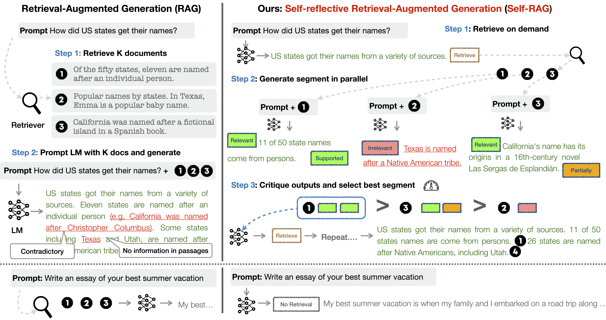
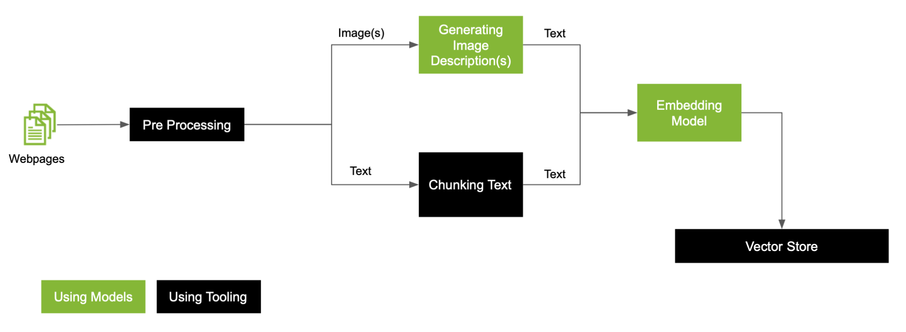
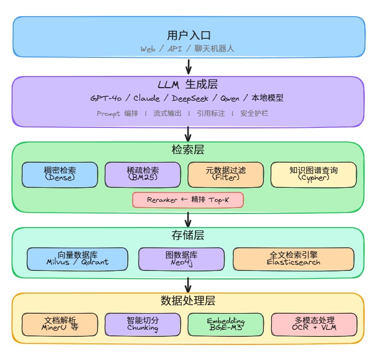
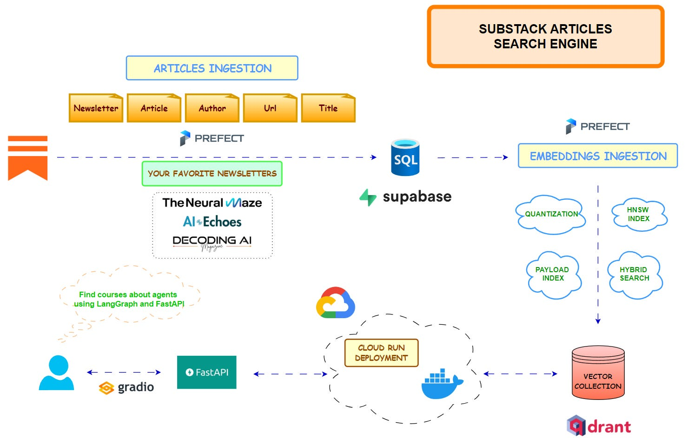

> 本文是笃行智元 AI 大模型技术社区「RAG 检索增强生成」系列的总览篇，覆盖从基础原理到高阶范式的完整技术链路。
> 后续将推出各子主题的深度实战文档，欢迎关注社区获取更新。

---

## 一、RAG 技术基础回顾

### 1.1 RAG 的诞生

RAG（Retrieval-Augmented Generation，检索增强生成）由 Meta AI（原 Facebook AI）在 2020 年的论文《Retrieval-Augmented Generation for Knowledge-Intensive NLP Tasks》中正式提出。其核心思想是：**在 LLM 生成回答之前，先从外部知识库中检索最相关的文档片段，将其作为上下文注入 Prompt，从而提升回答的准确性和时效性。**

这项技术在 2022 年底大模型爆发后才真正进入主流视野。由于早期大模型应用以"知识库问答"为主要落地形态，RAG 凭借低门槛、高上限的特点迅速成为大模型技术栈中不可或缺的一环。

### 1.2 RAG 核心技术流程

一个最简 RAG 系统的执行流程分为五个阶段：

```
文档加载 → 文档切分（Chunking）→ 向量化（Embedding）→ 相似度检索 → 增强生成
```

具体来说：

1. **文档加载**：读取 PDF、Markdown、网页、数据库等多种格式的源文档
2. **文档切分**：将长文档按语义边界切分为适当大小的文本块（Chunk）
3. **向量化**：通过 Embedding 模型将每个 Chunk 转为高维向量，存入向量数据库
4. **相似度检索**：用户提问同样向量化后，在向量库中检索 Top-K 最相关的 Chunk
5. **增强生成**：将检索到的 Chunk 与用户问题拼接为完整 Prompt，交给 LLM 生成最终回答



### 1.3 为什么需要 RAG：大模型的三大缺陷

理解 RAG 的价值，需要先认清当前 LLM 的三项根本性局限：

**缺陷一：模型幻觉（Hallucination）**

LLM 的训练本质是学习词语之间的概率关系，而非真正理解事实。当遇到陌生问题或模糊上下文时，模型会基于语料库中似是而非的关联"编造"听起来合理的答案。以早期 DeepSeek R1 为例，平均每 7 次回答中就有 1 次存在幻觉问题（后续版本已有显著改善）。

RAG 的解决思路：**用真实文档约束模型的生成空间**——当模型被强制基于给定的文档片段回答时，幻觉的概率大幅降低。

**缺陷二：上下文窗口有限**

虽然主流模型已支持 128K ~ 1M Token 的上下文（Gemini 2.5 Pro 可达 1M，GPT-4.1 为 1M），但：（1）上下文越长，推理成本越高、速度越慢；（2）"大海捞针"问题——长上下文中模型容易忽略关键信息。RAG 通过精准检索替代全量加载，在成本和效果之间取得平衡。

**缺陷三：知识时效性与专业性不足**

模型训练数据有明确的截止时间，无法覆盖训练后的新知识。同时，在医疗、法律、金融等垂直领域，公开训练语料中的专业知识深度有限。RAG 可以接入实时更新的外部知识库，解决时效性和专业性的双重挑战。

### 1.4 Native RAG 的局限

上述最简流程被称为 **Native RAG**（朴素 RAG），在实际应用中会暴露出多个问题：

| 问题 | 表现 | 优化方向 |
|------|------|----------|
| 检索质量低 | 召回片段与问题相关性弱 | 混合检索、Reranker |
| 上下文碎片化 | 缺乏跨 Chunk 的语义连贯性 | 分块策略优化、上下文窗口扩展 |
| 多跳推理困难 | 无法综合多个文档的信息 | GraphRAG、Agentic RAG |
| 多模态盲区 | 无法检索图片、表格中的信息 | 多模态 RAG |
| 缺乏自我校验 | 无法判断检索结果是否足够 | Self-RAG |

后续章节将逐一介绍针对这些问题的优化方案。

---

## 二、文档处理与知识准备

文档处理是 RAG 系统的第一道关卡，**输入质量直接决定检索质量**。

### 2.1 文档解析技术

不同格式的源文档需要不同的解析策略：

| 文档类型 | 解析工具 | 推荐场景 |
|----------|----------|----------|
| **纯文本 Markdown** | 直接读取 | 技术文档、笔记 |
| **PDF（文字型）** | PyMuPDF / pdfplumber | 电子生成的 PDF |
| **PDF（扫描件）** | OCR + 版面分析 | 纸质扫描、合同 |
| **PDF（复杂排版）** | MinerU / Docling / MarkItDown | 学术论文、技术白皮书 |
| **Office 文档** | python-docx / Unstructured | Word、PPT |
| **网页** | BeautifulSoup / Playwright | 在线文档抓取 |

**PDF 转 Markdown 的主流方案：**

| 工具 | 开发者 | 许可证 | 核心特点 | 适用场景 |
|------|--------|--------|----------|----------|
| **MinerU** | 阿里达摩院 & OpenDataLab | AGPL-3.0 | 高精度公式/表格解析，OCR 集成 | 科研论文、技术文档批量转换 |
| **Docling** | IBM Research | MIT | 多格式支持，可接入 VLM，输出 Markdown/JSON | 企业级文档解析 |
| **MarkItDown** | Microsoft | MIT | 格式覆盖最广，插件可接入 LLM 增强 | 快速预处理、通用 RAG 项目 |

> 选型建议：个人项目或原型开发首选 MarkItDown（MIT 许可、开箱即用）；追求解析精度选 MinerU；企业合规环境选 Docling。

### 2.2 分块策略（Chunking）

分块是将长文档拆分为可独立检索的最小语义单元，是 RAG 系统中最容易被低估的环节。一个糟糕的分块策略会直接导致检索失败。

**核心矛盾**：Chunk 太小 → 丢失上下文、语义不完整；Chunk 太大 → 检索精度下降、噪音增加。

**常用分块方法：**

| 方法 | 原理 | 优点 | 缺点 | 适用场景 |
|------|------|------|------|----------|
| **固定长度切分** | 按 Token 数等距切分 | 简单、性能好 | 可能切断句子和语义 | 英文文档、初步测试 |
| **基于分隔符** | 按段落/换行/句号切分 | 保持自然边界 | 块大小不均 | 结构化好的文档 |
| **递归切分** | 多级分隔符逐步切分 | 兼顾语义和大小 | 实现稍复杂 | 通用场景，LangChain 默认方案 |
| **语义切分** | 基于 Embedding 相似度判断断点 | 语义完整性最佳 | 计算成本高 | 高质量知识库 |
| **文档结构切分** | 按标题层级（H1/H2/H3）切分 | 保留文档逻辑结构 | 依赖 Markdown 格式 | 技术文档、Wiki |

**关键参数建议**（作为起点，需根据场景调优）：

- **Chunk Size**：512 ~ 1024 Token（中文建议 500~800 字）
- **Overlap**：Chunk Size 的 10% ~ 20%（保留跨块语义连接）
- **Metadata**：为每个 Chunk 保留来源（文件名、章节、页码）



> ▲ 不同文档结构对应的分块策略选择：结构化文档→固定大小，非结构化→基于句子

### 2.3 中文分块最佳实践

中文文档的分块有其特殊性，需要注意以下几点：

1. **避免按单字切分**：中文没有天然的空格分隔，固定 Token 数切分容易在词语中间断开。应优先使用句号、换行、段落等自然分隔符
2. **Token 计算差异**：中文一个汉字通常为 1~2 个 Token（因 Tokenizer 而异），估算 Chunk Size 时需注意换算
3. **标点符号处理**：中文标点（，。！？）和英文标点的处理逻辑不同，确保切分器正确识别
4. **混合中英文**：对中英混排文档，建议使用多语言支持的 Embedding 模型（如 BGE-M3）

> 推荐方案：LangChain 的 `RecursiveCharacterTextSplitter` + 中文分隔符配置 `["\n\n", "\n", "。", "！", "？", "；", "，", " "]`

### 2.4 多模态文档处理

当源文档包含图片、表格、公式等多模态内容时，需要进行额外处理：

**多模态 PDF 检索的三种主流方法：**

1. **结构解析重建法**：先版面分析 → 分离文本/图片/表格 → 调用 OCR/VLM 提取图片中的信息 → 统一输出 Markdown。**优点是结构还原最完整**，适合学术论文等结构化文档。

2. **轻量化并行存储法**：文本和图片分别向量化、分别存储，检索时并行查询后合并排序。**优点是速度快、扩展性强**，适合报告、合同等非结构化文档。

3. **知识单元抽取法**：在解析基础上进一步抽取实体、关系、事件，支持结构化查询。**优点是支持复杂推理**，适合金融、法律等专业场景。

**图片内容提取的两条技术路线：**

- **OCR 路线**（PaddleOCR / dots.ocr / olmOCR）：轻量高效，甚至可在 CPU 运行，擅长字符和表格识别，但无法理解图片语义
- **VLM 路线**（Qwen3-VL / InternVL 3.5 / GPT-4o）：语义理解能力强，能识别流程图、产品图等，但计算成本高

> 工程实践中通常采用"OCR 打底 + VLM 增强"的混合策略：先用 OCR 处理文字密集型图片（表格、发票），再用 VLM 处理语义密集型图片（流程图、示意图）。

---

## 三、向量化与存储

### 3.1 Embedding 模型选型

Embedding 模型负责将文本块转化为向量，是检索质量的另一个关键因素。

**选型维度：**

| 维度 | 说明 |
|------|------|
| **语言支持** | 中文、多语言、跨语言检索需求 |
| **向量维度** | 维度越高表达能力越强，但存储和检索成本也越高 |
| **最大序列长度** | 决定了能处理多长的 Chunk |
| **检索精度** | 在 MTEB / C-MTEB 基准上的排名 |
| **推理成本** | 本地部署的 GPU 需求 vs 在线 API 价格 |

**主流 Embedding 模型推荐（截至 2026 年 5 月）：**

| 模型 | 维度 | 最大长度 | 语言 | 特点 | 部署方式 |
|------|------|----------|------|------|----------|
| **BGE-M3** | 1024 | 8192 | 中/英/多语言 | 支持 Dense + Sparse 混合检索，C-MTEB 顶尖 | 本地 / API |
| **GTE-Qwen2-7B** | 3584 | 32768 | 中/英 | 基于 Qwen2，超长上下文，中文表现突出 | 本地（需 GPU） |
| **text-embedding-3-large** | 256~3072 | 8191 | 多语言 | OpenAI 官方，API 调用便捷，可调维度 | API |
| **Jina Embeddings v3** | 1024 | 8192 | 多语言 | 支持任务特定 LoRA，多语言检索强 | API |
| **stella-base-zh-v3-1792d** | 1792 | 512 | 中文 | 轻量中文模型，MTEB 中文榜前列 | 本地（CPU 可用） |

> 选型建议：中文为主的通用场景首选 BGE-M3（本地）或 text-embedding-3-large（API）；超长文档场景选 GTE-Qwen2-7B；轻量部署选 stella-base。

### 3.2 向量数据库选型

向量数据库是 RAG 系统的存储和检索引擎，核心能力包括向量相似度搜索、元数据过滤、水平扩展等。

**主流向量数据库对比：**

| 数据库 | 类型 | 开源 | 索引算法 | 核心特点 | 适用规模 |
|--------|------|------|----------|----------|----------|
| **Chroma** | 嵌入式 | ✅ Apache 2.0 | HNSW | Python 原生集成，零配置上手，适合原型开发 | 小~中 |
| **Milvus** | 分布式 | ✅ Apache 2.0 | IVF/HNSW/DiskANN | 云原生架构，十亿级向量支持，GPU 加速索引 | 中~大 |
| **FAISS** | 库 | ✅ MIT | IVF/HNSW/PQ | Meta 出品，极致性能，C++ 底层，Python 封装 | 不限 |
| **Qdrant** | 独立服务 | ✅ Apache 2.0 | HNSW | Rust 编写，高性能，过滤功能丰富，云托管可用 | 小~大 |
| **Weaviate** | 独立服务 | ✅ BSD-3 | HNSW | GraphQL 接口，内置向量化模块，混合搜索原生支持 | 小~大 |
| **Pinecone** | 云服务 | ❌ | 专有 | 全托管，零运维，Serverless 弹性伸缩 | 不限 |
| **Elasticsearch** | 独立服务 | ✅ SSPL | HNSW | 全文搜索 + 向量搜索一体，企业生态成熟 | 中~大 |

**选型建议：**

```
原型/学习 → Chroma：pip install 即可用，零学习成本
中小项目 → Qdrant / Weaviate：独立部署的高性能方案
企业级   → Milvus / Elasticsearch：分布式、高可用
全托管   → Pinecone：不想管运维的首选
性能极致 → FAISS：嵌入自定义管线的底层引擎
```

---

## 四、检索策略与优化

Native RAG 的默认检索方式（单一向量相似度搜索）在很多场景下效果不佳，需要引入多种优化策略。

### 4.1 基础检索模式

| 模式 | 原理 | 适用场景 |
|------|------|----------|
| **稠密检索（Dense）** | Embedding 向量余弦/欧氏相似度 | 语义级匹配，覆盖面广 |
| **稀疏检索（Sparse）** | BM25 / TF-IDF 关键词匹配 | 精确匹配（人名、编号、术语） |
| **元数据过滤** | 基于时间/来源/分类等字段过滤 | 限定检索范围 |

### 4.2 混合检索（Hybrid Search）

混合检索的核心思想是 **将 Dense（语义）和 Sparse（关键词）的结果融合**，互补各自的短板：

- Dense 擅长语义匹配，但可能遗漏关键词精确匹配（如产品型号 "RTX-4090"）
- Sparse 擅长精确匹配，但无法理解同义表达（如 "显卡" vs "GPU"）

**融合策略：**

- **RRF（Reciprocal Rank Fusion）**：对两路结果的排名加权合并，无需调参，鲁棒性好，是当前最推荐的方案
- **加权求和**：分别归一化两路分数后按比例合并，需调参
- **Reranker 二次排序**：两路粗召回后，由 Reranker 统一精排（见 4.3）


> ▲ 混合检索流程：Dense 向量检索 + Sparse 关键词检索 → 融合排序 → Top-K 结果

### 4.3 重排序（Reranker）

Reranker 在初检索后再做一次"精排"，用更强的模型判断 Query 和 Chunk 的真实相关性。

**为什么需要 Reranker？**

Embedding 模型必须将文档预先向量化以支持快速检索，这要求它们使用"双塔"架构（Query 和 Chunk 分别编码，无交互计算）。而 Reranker 使用"交叉编码器"（Cross-Encoder），将 Query 和 Chunk 拼接后一起输入模型，计算真正的语义相关性，精度远高于双塔模型，但速度慢，因此只对 Top-K 结果精排。

**主流 Reranker 模型：**

| 模型 | 参数 | 语言 | 特点 |
|------|------|------|------|
| **BGE-Reranker-v2-m3** | 568M | 多语言 | 与 BGE-M3 配套，中文表现优异 |
| **Cohere Rerank v3** | N/A | 多语言 | API 调用，准确率顶尖，支持长文档 |
| **Jina Reranker v2** | 278M | 多语言 | 轻量高效，本地可部署 |
| **gte-multilingual-reranker-base** | 306M | 中/英为主 | 阿里出品，MTEB 高分 |

> 推荐组合：粗召回用 BGE-M3 hybrid → Top-50 送 BGE-Reranker-v2-m3 → 取 Top-5 送 LLM



> ▲ Bi-Encoder（左）：Query 和 Document 分别编码后计算相似度，速度快但精度有限。Cross-Encoder（右）：Query 和 Document 拼接后联合编码，精度高但速度慢，适合 Rerank 阶段

### 4.4 多路召回

对于复杂检索需求，可以设计多路并行的召回策略，在 Reranker 之前汇合：



---

## 五、高级 RAG 范式

### 5.1 GraphRAG

**GraphRAG（Graph-enhanced RAG）** 在传统 RAG 基础上引入知识图谱，通过实体-关系-实体的图结构来捕捉跨文档的语义关联。

**核心流程：**

1. **图谱构建**：将文档拆分为 TextUnit → 提取实体与关系 → 构建知识图谱 → 社区检测与摘要
2. **混合检索**：向量检索定位实体 + 图遍历扩展关联信息
3. **图增强生成**：将检索到的节点、关系路径、社区摘要注入 Prompt

**与 Native RAG 的关键区别：**

| 维度 | Native RAG | GraphRAG |
|------|-----------|----------|
| 检索方式 | 纯向量相似度 | 向量 + 图遍历/查询 |
| 关系理解 | 弱，只匹配语义相近片段 | 强，理解实体间多跳关系 |
| 多跳推理 | 几乎不支持 | 图结构天然支持推理路径 |
| 可解释性 | 中，返回片段但缺关系链条 | 高，可展示实体关系路径 |
| 复杂度 | 低 | 高，需图构建和维护管线 |

**代表项目**：微软 GraphRAG（开源）、Neo4j + LangChain 图检索方案。

**适用场景**：需要综合多个文档信息进行推理的复杂问答（如"总结 A 公司和 B 公司在 AI 芯片领域的竞争关系"）。



> ▲ GraphRAG 的实现流程：知识图谱构建 → 社区检测 → 图遍历检索 → LLM 生成

### 5.2 Agentic RAG

**Agentic RAG** 将 RAG 流程中的检索和生成交给 Agent（智能体）进行自主决策，实现"思考 → 检索 → 校验 → 再检索"的循环式工作流。

**与传统 RAG 的差异：**

- 传统 RAG：固定流程，一次性检索 → 一次性生成
- Agentic RAG：Agent 可以拆解问题、多轮检索、调用工具、评估中间结果、决定是否需要补充信息

**典型执行过程：**

```
用户：请对比 OpenAI、Anthropic 和 Google 在 2025 年的融资情况

Agent 决策：
  第1步：检索 "OpenAI 2025 融资" → 获得结果
  第2步：检索 "Anthropic 2025 融资" → 获得结果
  第3步：检索 "Google AI 投资 2025"  → 获得结果
  第4步：发现三家数据格式不统一，调用计算工具做对比
  第5步：整合信息，生成对比报告
```

**代表框架**：LangGraph、CrewAI、AutoGen。



> ▲ Agentic RAG 系统架构：Agent 自主决策检索策略 → 多轮迭代 → 验证 → 生成

### 5.3 Self-RAG

**Self-RAG** 的核心是在 RAG 流程中引入自我反思（Self-Reflection）机制，让 LLM 在每个步骤后进行自我评估：

- **是否需要检索**：判断当前问题是否真的需要外部知识
- **检索结果是否相关**：判断召回的文档片段是否与问题相关
- **生成内容是否有据可查**：判断回答是否基于检索到的文档而非幻觉
- **是否需要重新检索**：如果当前结果不满足，自主触发新一轮检索

Self-RAG 通过训练专门的反思 Token（`<RETRIEVE>`、`<RELEVANT>`、`<SUPPORTED>` 等）来控制流程，是当前提升 RAG 系统可靠性的重要方向。



> ▲ Self-RAG 工作流程：左侧为标准 RAG（无自我反思），右侧为 Self-RAG（检索 → 生成 → 反思 → 决定是否重新检索），通过反思 Token 控制全流程

### 5.4 多模态 RAG

多模态 RAG 将检索范围从纯文本扩展到图片、表格、音频、视频等模态，核心挑战在于跨模态对齐：

**关键组件：**

| 组件 | 功能 | 主流方案 |
|------|------|----------|
| 多模态解析 | 从 PDF/图片中提取文本和结构 | MinerU、Docling + OCR |
| 图片向量化 | 将图片转为可检索的向量 | CLIP、SigLIP、Jina CLIP v2 |
| 跨模态对齐 | 文字查询匹配图片内容 | 多模态 Embedding / VLM |
| 多模态生成 | 基于图文信息生成回答 | GPT-4o、Qwen3-VL、InternVL 3.5 |

**热门 VLM 模型对比（截至 2026 年 5 月）：**

| 模型 | 开发者 | 参数规模 | 类型 | 优势 | 局限 |
|------|--------|----------|------|------|------|
| **GPT-4o** | OpenAI | 未公开 | 在线 API | 多模态能力强，生态完善 | 成本高，隐私合规需注意 |
| **Gemini 2.5 Pro** | Google DeepMind | 未公开 | 在线 API | 1M 上下文，多模态融合好 | 部署受限 |
| **Claude 4 Sonnet** | Anthropic | 未公开 | 在线 API | 多步推理强，Agent 友好 | 图像能力因场景而异 |
| **DeepSeek-V3** | DeepSeek | 671B MoE | 开源/API | 性价比极高，中文优秀 | 多模态能力有限 |
| **Qwen3-VL** | 阿里达摩院 | 3B/7B/72B | 开源 | 尺寸覆盖广，文档解析强 | 大尺寸需高端 GPU |
| **InternVL 3.5** | 上海 AI 实验室 | 8B~40B | 开源 | 图表/公式理解顶尖 | 大模型显存占用高 |



> ▲ 多模态 RAG 的文档预处理流程：分离文本与图片 → 图片分类/描述 → 统一向量化存储

---

## 六、RAG 技术栈全景图

综合以上内容，一个生产级 RAG 系统的完整技术栈如下：






> ▲ 生产级 RAG 系统架构全景

---

## 七、学习路径与工具推荐

### 7.1 从零入门路径

```
第1周：看懂 RAG 基本原理 → 用 LangChain + Chroma 跑通一个 Demo
第2周：理解分块策略 → 对比不同 Chunk Size 的检索效果
第3周：尝试不同 Embedding 模型 → 学习评估检索质量
第4周：引入 Reranker → 体验混合检索
第5周：研究 GraphRAG → 理解知识图谱构建
第6周：探索 Agentic RAG → 尝试 LangGraph
```

### 7.2 核心工具速查

| 类别 | 工具 | 说明 |
|------|------|------|
| **编排框架** | LangChain / LlamaIndex | RAG 开发的主流框架 |
| **向量数据库** | Chroma（入门）/ Milvus（生产） | 向量存储与检索 |
| **Embedding** | BGE-M3（本地）/ OpenAI（API） | 文本向量化 |
| **Reranker** | BGE-Reranker-v2-m3 | 检索结果精排 |
| **文档解析** | MinerU / MarkItDown | PDF 转 Markdown |
| **评估工具** | RAGAS | RAG 系统质量评估 |
| **前端** | Open WebUI / Streamlit | 快速搭建对话界面 |

### 7.3 推荐阅读

- Meta AI RAG 原始论文：https://arxiv.org/abs/2005.11401
- LangChain RAG 教程：https://python.langchain.com/docs/tutorials/rag/
- LlamaIndex 官方文档：https://docs.llamaindex.ai/
- 微软 GraphRAG 项目：https://github.com/microsoft/graphrag
- RAGAS 评估框架：https://docs.ragas.io/
- MTEB 排行榜（Embedding 模型排名）：https://huggingface.co/spaces/mteb/leaderboard

> 📢 更多讨论、源码、资料，欢迎加入「笃行智元」AI 大模型技术社区，与数千名开发者一起交流学习。
> 本文档将持续更新，最新版本请关注社区公告。
