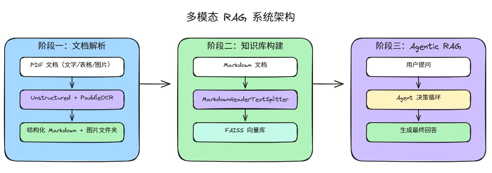
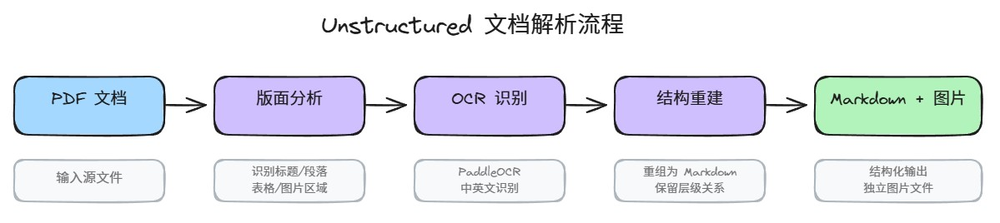
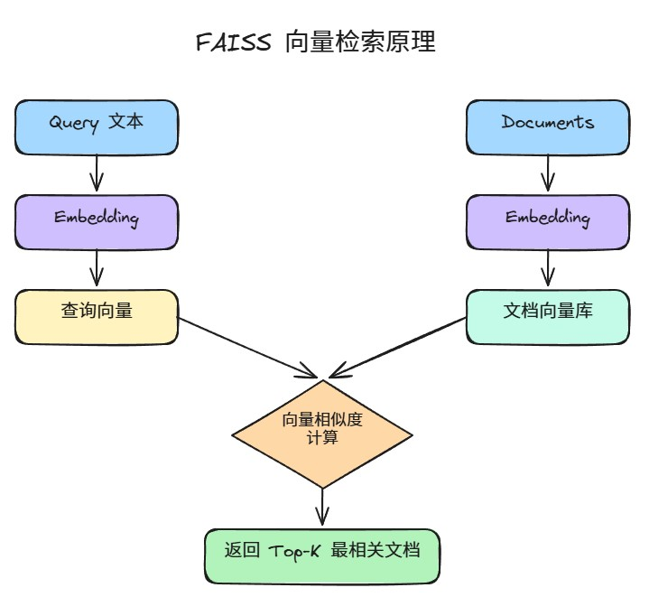
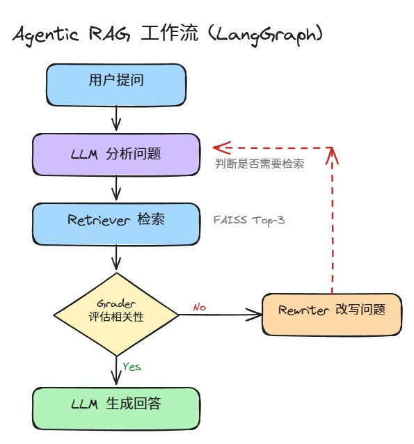
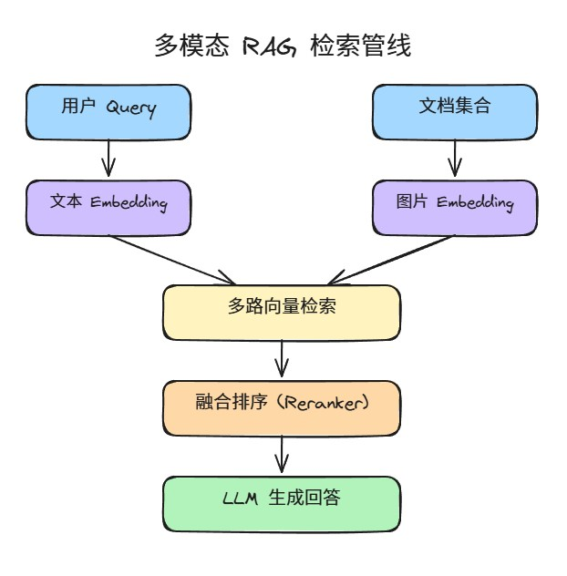

# Part 2. 从零到一快速搭建多模态 RAG 引擎

> 本文是笃行智元 AI 大模型技术社区「RAG 检索增强生成」系列的第 2 篇，带你用 Unstructured + PaddleOCR + LangGraph + FAISS 从零搭建一个支持 PDF 图文混排检索的 Agentic RAG 系统。
>
> 前置阅读：[Part 1. RAG 技术体系全景](./Part1-RAG技术体系全景.md)

---

## 一、概述与系统架构

### 1.1 本文目标

完成本文后，你将拥有一个完整的 Agentic RAG 系统，具备以下能力：

- 将包含文字、表格、图片的复杂 PDF 自动解析为结构化 Markdown
- 基于 Markdown 构建可检索的向量知识库
- 通过 LangGraph 搭建具备「检索 → 评估 → 重写 → 生成」循环的智能 Agent
- 支持图文并茂的检索结果生成

### 1.2 系统架构

整个系统分为三个核心阶段：



**技术栈：**

| 阶段 | 工具 | 作用 |
|------|------|------|
| 文档解析 | Unstructured + PaddleOCR + PyMuPDF | PDF → Markdown + 图片提取 |
| 向量化 | OpenAI text-embedding-3-small / BGE-M3 | 文本 → 向量 |
| 向量存储 | FAISS | 本地向量索引与检索 |
| Agent 编排 | LangGraph | 多节点智能体工作流 |
| LLM | DeepSeek / GPT-4o / 本地模型 | 问题理解、答案生成 |

---

## 二、环境准备

### 2.1 创建 Python 虚拟环境

推荐 Python 3.10+，使用 conda 或 venv：

```bash
# 方式一：conda
conda create -n multimodal_rag python=3.10 -y
conda activate multimodal_rag

# 方式二：venv
python -m venv multimodal_rag
# Windows
multimodal_rag\Scripts\activate
# macOS / Linux
source multimodal_rag/bin/activate
```

### 2.2 安装依赖

**文档解析相关：**

```bash
pip install "unstructured[all-docs]"   # PDF/Word/PPT/HTML 解析
pip install paddlepaddle paddleocr     # OCR 引擎
pip install PyMuPDF pillow matplotlib  # PDF 渲染与图片处理
pip install html2text                  # HTML 表格 → Markdown
```

**RAG 与 Agent 相关：**

```bash
pip install langchain langchain-openai langchain-community
pip install langchain-text-splitters
pip install langgraph
pip install faiss-cpu                  # 向量存储（GPU 版用 faiss-gpu）
pip install python-dotenv              # 环境变量管理
```

> **注意**：
> - `unstructured[all-docs]` 安装包较大（约 2GB），首次安装需要稳定的网络环境
> - PaddleOCR 首次运行时会自动下载模型文件（~200MB），可提前设置环境变量 `PADDLEOCR_HOME` 指定模型存放路径
> - Windows 用户如果遇到 `paddlepaddle` 动态链接库错误，需安装 [Visual C++ Redistributable](https://aka.ms/vs/17/release/vc_redist.x64.exe)

### 2.3 配置 API Key

创建 `.env` 文件，填入你的 API 密钥：

```bash
# LLM（二选一）
DEEPSEEK_API_KEY=sk-your-key-here
# 或
OPENAI_API_KEY=sk-your-key-here

# Embedding 模型
OPENAI_API_KEY=sk-your-key-here          # text-embedding-3-small 需要

# （可选）LangSmith 调试追踪
LANGSMITH_TRACING=true
LANGSMITH_API_KEY=lsv2_pt_your-key
LANGSMITH_PROJECT=multimodal_rag_demo
```

---

## 三、阶段一：多模态 PDF 文档解析

### 3.1 核心思路

PDF 是排版导向的格式，文字、图片、表格混排在一起。要让 RAG 系统能检索其中的信息，需要：

1. **版面分析**：识别标题、段落、表格、图片等元素
2. **OCR 识别**：从扫描件和图片中提取文字
3. **结构重建**：将解析结果重组为 Markdown，保留层级关系
4. **图片提取**：将嵌入图片保存为独立文件

这里使用 **Unstructured + PaddleOCR** 工具链来完成上述流程。

### 3.2 Unstructured 简介

Unstructured 是业界最成熟的文档解析框架之一，核心设计理念是将任意文档拆解为结构化的 **Element 对象**：

- 每个 Element 有明确类别：`Title`、`NarrativeText`、`Table`、`Image`、`ListItem` 等
- 每个 Element 携带元数据：页码、坐标、置信度等
- 支持三种解析策略：

| 策略 | 适用场景 | 速度 | 精度 |
|------|----------|------|------|
| `fast` | 机器生成的 PDF（有文本层） | 快 | 中 |
| `hi_res` | 扫描件、复杂排版 PDF | 慢 | 高 |
| `auto` | 自动选择最优策略 | - | - |



### 3.3 第一步：加载 PDF 并解析元素

```python
from langchain_unstructured import UnstructuredLoader

file_path = "your_document.pdf"

loader = UnstructuredLoader(
    file_path=file_path,
    strategy="hi_res",              # 高分辨率模式
    infer_table_structure=True,     # 自动解析表格结构
    ocr_languages="chi_sim+eng",    # 支持中英文 OCR
    ocr_engine="paddleocr"          # 使用 PaddleOCR 引擎
)

docs = []
for doc in loader.lazy_load():
    docs.append(doc)

# 查看解析结果
for doc in docs[:5]:
    print(f"[{doc.metadata.get('category', 'unknown')}] {doc.page_content[:80]}...")
```

`lazy_load()` 逐页解析 PDF，返回 LangChain Document 对象列表。每个 Document 包含：

- `page_content`：文本内容
- `metadata`：`category`（类型）、`page_number`（页码）、`coordinates`（坐标）等

### 3.4 第二步：可视化验证（可选）

用 matplotlib 在 PDF 页面上绘制解析结果的边界框，验证解析质量：

```python
import fitz
import matplotlib.pyplot as plt
import matplotlib.patches as patches
from PIL import Image

def plot_pdf_with_boxes(pdf_page, segments):
    """在 PDF 页面上绘制元素边界框"""
    pix = pdf_page.get_pixmap()
    pil_image = Image.frombytes("RGB", [pix.width, pix.height], pix.samples)

    fig, ax = plt.subplots(1, figsize=(10, 10))
    ax.imshow(pil_image)

    category_colors = {
        "Title": "orchid",
        "Image": "forestgreen",
        "Table": "tomato",
    }

    for segment in segments:
        points = segment["coordinates"]["points"]
        layout_w = segment["coordinates"]["layout_width"]
        layout_h = segment["coordinates"]["layout_height"]
        scaled_points = [
            (x * pix.width / layout_w, y * pix.height / layout_h)
            for x, y in points
        ]
        color = category_colors.get(segment["category"], "deepskyblue")
        rect = patches.Polygon(scaled_points, linewidth=1, edgecolor=color, facecolor="none")
        ax.add_patch(rect)

    ax.axis("off")
    plt.tight_layout()
    plt.show()

def render_page(doc_list, page_number, file_path):
    """渲染指定页面的解析结果"""
    pdf_page = fitz.open(file_path).load_page(page_number - 1)
    page_docs = [d for d in doc_list if d.metadata.get("page_number") == page_number]
    segments = [d.metadata for d in page_docs]
    plot_pdf_with_boxes(pdf_page, segments)
    for doc in page_docs:
        print(f"[{doc.metadata.get('category', 'text')}] {doc.page_content[:100]}\n")

# 查看第 1 页
render_page(docs, 1, file_path)
```

### 3.5 第三步：PDF → Markdown 完整转换

将解析结果和图片整合为 Markdown 文档：

```python
import os
import fitz
from unstructured.partition.pdf import partition_pdf

pdf_path = "your_document.pdf"
output_dir = "pdf_images"
os.makedirs(output_dir, exist_ok=True)

# === 1. 解析 PDF 结构 ===
elements = partition_pdf(
    filename=pdf_path,
    infer_table_structure=True,
    strategy="hi_res",
    ocr_languages="chi_sim+eng",
    ocr_engine="paddleocr"
)

# === 2. 提取并保存图片 ===
doc = fitz.open(pdf_path)
image_map = {}  # page_num → [image_path, ...]

for page_num, page in enumerate(doc, start=1):
    image_map[page_num] = []
    for img_index, img in enumerate(page.get_images(full=True), start=1):
        xref = img[0]
        pix = fitz.Pixmap(doc, xref)
        img_path = os.path.join(output_dir, f"page{page_num}_img{img_index}.png")

        if pix.n < 5:  # RGB 或灰度图
            pix.save(img_path)
        else:          # CMYK 转 RGB
            pix = fitz.Pixmap(fitz.csRGB, pix)
            pix.save(img_path)

        image_map[page_num].append(img_path)

# === 3. 组装 Markdown ===
md_lines = []
inserted_images = set()

for el in elements:
    cat = str(el.category)
    text = el.text or ""
    page_num = el.metadata.page_number if el.metadata.page_number else 1

    if cat == "Title":
        md_lines.append(f"# {text}\n\n")
    elif cat in ("Header", "Subheader"):
        md_lines.append(f"## {text}\n\n")
    elif cat == "Table":
        if hasattr(el.metadata, "text_as_html") and el.metadata.text_as_html:
            from html2text import html2text
            md_lines.append(html2text(el.metadata.text_as_html) + "\n\n")
        else:
            md_lines.append(text + "\n\n")
    elif cat == "Image":
        for img_path in image_map.get(page_num, []):
            if img_path not in inserted_images:
                md_lines.append(f"\n\n")
                inserted_images.add(img_path)
    elif cat == "ListItem":
        md_lines.append(f"- {text}\n")
    else:
        md_lines.append(text + "\n\n")

# === 4. 写入文件 ===
output_md = "output.md"
with open(output_md, "w", encoding="utf-8") as f:
    f.write("".join(md_lines))

print(f"✅ 转换完成 → {output_md} + {output_dir}/ ({len(inserted_images)} 张图片)")
```

运行后你将得到：
- `output.md`：结构化 Markdown 文档
- `pdf_images/`：提取的所有图片文件

### 3.6 常见问题

| 问题 | 原因 | 解决 |
|------|------|------|
| PaddleOCR 下载模型失败 | 网络问题 | 手动下载模型并设置 `PADDLEOCR_HOME` |
| `ImportError: DLL load failed` | Windows 缺 VC++ 运行库 | 安装 VC++ Redistributable |
| 表格识别不完整 | 复杂合并单元格 | 尝试 `strategy="hi_res"` + 调整 OCR 语言参数 |
| 图片未提取 | PDF 中的图片非标准嵌入 | 检查 `page.get_images(full=True)` 返回结果 |

---

## 四、阶段二：知识库向量化

### 4.1 按标题层级分块

Markdown 文档有天然的层级结构（`#`、`##`），按标题切分比固定长度切分更适合技术文档：

```python
from langchain_text_splitters import MarkdownHeaderTextSplitter

with open("output.md", "r", encoding="utf-8") as f:
    md_content = f.read()

headers_to_split_on = [
    ("#", "h1"),
    ("##", "h2"),
]

splitter = MarkdownHeaderTextSplitter(headers_to_split_on=headers_to_split_on)
chunks = splitter.split_text(md_content)

print(f"共拆分为 {len(chunks)} 个文本块")
```

> **提示**：如果个别块仍然过长（超过 Embedding 模型的最大长度），可以追加一次递归字符切分：`RecursiveCharacterTextSplitter(chunk_size=1000, chunk_overlap=200)`

### 4.2 向量化并存储到 FAISS

```python
import os
from dotenv import load_dotenv
from langchain_openai import OpenAIEmbeddings
from langchain_community.vectorstores import FAISS

load_dotenv()

# 初始化 Embedding 模型
embed = OpenAIEmbeddings(
    api_key=os.getenv("OPENAI_API_KEY"),
    model="text-embedding-3-small"
)

# 构建向量库
vector_store = FAISS.from_documents(chunks, embedding=embed)

# 保存到本地（后续可直接加载）
vector_store.save_local("knowledge_base")

print(f"✅ 向量库已保存，共 {vector_store.index.ntotal} 个向量")
```

> **本地 Embedding 替代方案**：如果不想调用 OpenAI API，可以替换为 BGE-M3：
> ```python
> from langchain_community.embeddings import HuggingFaceBgeEmbeddings
> embed = HuggingFaceBgeEmbeddings(model_name="BAAI/bge-m3")
> ```



---

## 五、阶段三：Agentic RAG 检索引擎开发

### 5.1 Agent 工作流设计

我们使用 LangGraph 构建一个具备自我纠错能力的 Agentic RAG 流程：



这个设计对应 Part 1 中介绍的 **Self-RAG** 思想——系统会自我评估检索质量，不满足时自动改写问题重试。



### 5.2 完整代码

```python
from __future__ import annotations

import os
from typing import Literal
from dotenv import load_dotenv, find_dotenv

load_dotenv(find_dotenv(), override=True)

from langchain.chat_models import init_chat_model
from langchain_openai import OpenAIEmbeddings
from langchain_community.vectorstores import FAISS
from langchain.tools.retriever import create_retriever_tool
from langgraph.graph import MessagesState, StateGraph, START, END
from langgraph.prebuilt import ToolNode
from pydantic import BaseModel, Field

# ═══════════════════════════════════════════════
# 1. 初始化 LLM 和 Embedding
# ═══════════════════════════════════════════════

MODEL_NAME = "deepseek-chat"       # 可替换为 gpt-4o / qwen-plus 等
MODEL_PROVIDER = "deepseek"        # 可替换为 openai / anthropic 等

llm = init_chat_model(model=MODEL_NAME, model_provider=MODEL_PROVIDER, temperature=0)
grader_llm = init_chat_model(model=MODEL_NAME, model_provider=MODEL_PROVIDER, temperature=0)

embed = OpenAIEmbeddings(
    api_key=os.getenv("OPENAI_API_KEY"),
    model="text-embedding-3-small",
)

# ═══════════════════════════════════════════════
# 2. 加载向量库并创建检索工具
# ═══════════════════════════════════════════════

VS_PATH = "knowledge_base"

vector_store = FAISS.load_local(
    folder_path=VS_PATH,
    embeddings=embed,
    allow_dangerous_deserialization=True,  # 信任本地文件
)

retriever_tool = create_retriever_tool(
    vector_store.as_retriever(search_kwargs={"k": 3}),
    name="retrieve_knowledge",
    description="搜索知识库，返回与用户问题最相关的文档片段。",
)

# ═══════════════════════════════════════════════
# 3. Prompt 设计
# ═══════════════════════════════════════════════

SYSTEM_PROMPT = """你是一个智能知识库助手。你的职责是基于知识库中的内容来回答用户问题。

规则：
1. 如果问题可以通过已有知识回答，直接回答（不需要检索）
2. 如果问题需要查阅知识库中的具体内容，调用 retrieve_knowledge 工具
3. 如果问题与知识库内容完全无关，回复："抱歉，这个问题超出了我的知识范围。"
"""

GRADE_PROMPT = """你是一个评估助手。请判断以下检索到的文档是否与用户问题相关。

检索到的文档：
{context}

用户问题：{question}

只回答 "yes"（相关）或 "no"（不相关）。"""

REWRITE_PROMPT = """请将以下用户问题改写得更清晰、更具体，以便在知识库中检索到相关内容。

原始问题：{question}

改写后的问题："""

ANSWER_PROMPT = """请根据以下上下文，回答用户的问题。

要求：
- 使用 Markdown 格式组织回答
- 如果上下文中有代码，用代码块（```）展示
- 如果上下文中有图片引用（），可以包含在回答中
- 如果上下文不足以回答问题，诚实地说"根据现有资料无法回答"

上下文：
{context}

问题：{question}"""

# ═══════════════════════════════════════════════
# 4. LangGraph 节点定义
# ═══════════════════════════════════════════════

async def generate_query_or_respond(state: MessagesState):
    """LLM 决定直接回答还是调用检索工具"""
    response = await llm.bind_tools([retriever_tool]).ainvoke(
        [{"role": "system", "content": SYSTEM_PROMPT}, *state["messages"]]
    )
    return {"messages": [response]}

class GradeResult(BaseModel):
    binary_score: str = Field(description="'yes' or 'no'")

async def grade_documents(state: MessagesState) -> Literal["generate_answer", "rewrite_question"]:
    """评估检索结果是否与问题相关"""
    question = state["messages"][0].content
    context = state["messages"][-1].content

    prompt = GRADE_PROMPT.format(question=question, context=context)
    result = await grader_llm.with_structured_output(GradeResult).ainvoke(
        [{"role": "user", "content": prompt}]
    )

    if result.binary_score.lower().startswith("y"):
        return "generate_answer"
    return "rewrite_question"

async def rewrite_question(state: MessagesState):
    """改写用户问题以提升检索命中率"""
    question = state["messages"][0].content
    prompt = REWRITE_PROMPT.format(question=question)
    response = await llm.ainvoke([{"role": "user", "content": prompt}])
    return {"messages": [{"role": "user", "content": response.content}]}

async def generate_answer(state: MessagesState):
    """基于检索上下文生成最终回答"""
    question = state["messages"][0].content
    context = state["messages"][-1].content
    prompt = ANSWER_PROMPT.format(question=question, context=context)
    response = await llm.ainvoke([{"role": "user", "content": prompt}])
    return {"messages": [response]}

# ═══════════════════════════════════════════════
# 5. 构建工作流图
# ═══════════════════════════════════════════════

workflow = StateGraph(MessagesState)

# 添加节点
workflow.add_node("analyze", generate_query_or_respond)
workflow.add_node("retrieve", ToolNode([retriever_tool]))
workflow.add_node("rewrite", rewrite_question)
workflow.add_node("generate", generate_answer)

# 连接节点
workflow.add_edge(START, "analyze")
workflow.add_edge("analyze", "retrieve")
workflow.add_conditional_edges("retrieve", grade_documents, {
    "generate_answer": "generate",
    "rewrite_question": "rewrite",
})
workflow.add_edge("generate", END)
workflow.add_edge("rewrite", "analyze")  # 改写后重新分析

# 编译
agent = workflow.compile(name="multimodal_rag_agent")
```

### 5.3 工作流节点说明

| 节点 | 功能 | 触发条件 |
|------|------|----------|
| `analyze` | LLM 分析问题，决定是否需要检索 | 每次对话的起点 |
| `retrieve` | 调用 FAISS 检索 Top-3 相关文档 | LLM 判断需要检索 |
| `grade_documents` | 评估检索结果与问题的相关性 | 检索完成后 |
| `rewrite` | 改写问题使其更精准 | 检索结果不相关 |
| `generate` | 基于上下文生成最终回答 | 检索结果相关 |

### 5.4 运行测试

```python
import asyncio

async def main():
    # 简单问答
    result = await agent.ainvoke({
        "messages": [{"role": "user", "content": "这份文档主要讲了什么内容？"}]
    })
    print(result["messages"][-1].content)

    # 详细查询
    result = await agent.ainvoke({
        "messages": [{"role": "user", "content": "请详细说明文档中提到的技术架构，并给出代码示例"}]
    })
    print(result["messages"][-1].content)

asyncio.run(main())
```

---

## 六、优化建议

### 6.1 检索质量提升

| 优化方向 | 方案 | 代价 |
|----------|------|------|
| 提高召回率 | `k=5` → `k=10`，增加候选文档 | 推理成本增加 |
| 混合检索 | 加入 BM25 关键词检索 | 需额外部署 Elasticsearch |
| Reranker | Top-10 → Reranker → Top-3 | 增加 ~200ms 延迟 |
| 查询扩展 | 用 LLM 生成多个查询变体并行检索 | Token 消耗翻倍 |

### 6.2 性能优化

- **FAISS 索引选择**：数据量 < 10 万条用 `IndexFlatIP`（精确），更大用 `IndexIVFFlat`（近似）
- **Embedding 缓存**：对同一文档不重复 Embedding，用文件哈希做增量更新
- **异步批量处理**：多文档时用 `asyncio.gather()` 并行向量化

### 6.3 多模态增强

当前方案通过 Markdown 中的 `` 保留图片引用，LLM 在生成回答时可以包含图片。如果需要**基于图片内容检索**，可以进一步增强：

```python
# 为每张图片生成描述并加入索引
from openai import OpenAI

client = OpenAI()
for img_path in image_map.values():
    for path in img_path:
        description = client.chat.completions.create(
            model="gpt-4o",
            messages=[{
                "role": "user",
                "content": [
                    {"type": "text", "text": "请用一段话描述这张图片的内容"},
                    {"type": "image_url", "image_url": {"url": f"file://{path}"}}
                ]
            }]
        )
        # 将描述追加到 Markdown 中对应位置
```

---

## 七、常见问题排查

| 现象 | 可能原因 | 排查步骤 |
|------|----------|----------|
| 检索结果不相关 | Chunk 切分不合理 | 检查 `headers_to_split_on` 是否匹配文档的标题层级 |
| 回答空洞 | k 值太小 | 尝试 `k=5` 或 `k=10` |
| 改写死循环 | 问题与知识库领域完全不匹配 | 在 `SYSTEM_PROMPT` 中增加拒答逻辑 |
| FAISS 加载报错 | 版本不兼容 | 删除旧索引，重新生成 |
| OCR 识别乱码 | 语言参数不匹配 | 确认 `ocr_languages` 与实际文档语言一致 |
| 内存溢出 | PDF 页数过多 | 逐页处理或分批加载 |

---

## 八、完整项目结构

```
multimodal_rag_project/
├── .env                    # API Key 配置
├── requirements.txt        # Python 依赖
├── pdf_parser.py           # 阶段一：PDF → Markdown
├── build_kb.py             # 阶段二：Markdown → FAISS 向量库
├── agent.py                # 阶段三：LangGraph Agent
├── knowledge_base/         # FAISS 向量库文件（自动生成）
├── pdf_images/             # 提取的图片（自动生成）
└── output.md               # 转换后的 Markdown（自动生成）
```

---

## 九、常见问题深度排查

### 9.1 PDF 解析

| 现象 | 根因 | 解决方案 |
|------|------|----------|
| `ImportError: DLL load failed` | Windows 缺少 VC++ 运行库 | 安装 [VC++ Redistributable](https://aka.ms/vs/17/release/vc_redist.x64.exe) |
| PaddleOCR 下载模型超时 | 网络问题，模型文件 ~200MB | 手动下载后设置环境变量 `PADDLEOCR_HOME=/path/to/models` |
| 中文识别乱码 | `ocr_languages` 参数不匹配 | 确认参数为 `"chi_sim+eng"`，PDF 本身是否为扫描件 |
| 表格识别残缺 | 复杂合并单元格超出 OCR 能力 | 增大 `target_longest_image_dim` 到 1800，或换用 olmOCR |
| `UnstructuredLoader` OOM | PDF 页数过多，一次性加载 | 用 `lazy_load()` 分批处理，每批 10 页 |
| 图片未被提取 | PDF 中图片非标准嵌入 | 检查 `page.get_images(full=True)` 返回结果，尝试 `fitz.Pixmap` 直接渲染 |

### 9.2 FAISS 向量库

| 现象 | 根因 | 解决方案 |
|------|------|----------|
| `FAISS.load_local` 报版本不兼容 | FAISS 版本升级后索引格式变化 | 删除旧索引 `knowledge_base/` 目录，重新生成 |
| `allow_dangerous_deserialization` 警告 | FAISS 安全策略 | 添加参数 `allow_dangerous_deserialization=True`（信任本地文件） |
| 检索结果始终不相关 | 分块粒度过大或过小 | 调整 `headers_to_split_on` 匹配文档标题层级，追加 `RecursiveCharacterTextSplitter(chunk_size=1000)` |
| 向量库构建极慢 | 使用 CPU 版 FAISS + 大批量 | 换用 `faiss-gpu`，或用 `IndexIVFFlat` 替代 `IndexFlatIP` |
| 向量维度不匹配 | Embedding 模型更换后维度变了 | 重新生成索引，不同模型的向量不可混用 |

### 9.3 LangGraph Agent

| 现象 | 根因 | 解决方案 |
|------|------|----------|
| 改写死循环（rewrite→analyze→rewrite…） | 问题与知识库领域完全不匹配 | 在 `SYSTEM_PROMPT` 中增加拒答逻辑 + 设置最大重试次数 |
| 回答空洞无内容 | `k=3` 返回的文档太少或不相关 | 增大到 `k=5` 或 `k=10`，或引入 BM25 混合检索 |
| `tool_call` 无响应 | LLM 未正确绑定工具 | 检查 `llm.bind_tools([retriever_tool])` 是否生效，确认模型支持 Function Calling |
| `MessagesState` 消息累积过多 | 多轮对话中历史消息不断增长 | 在节点间裁剪历史消息，只保留最近 N 轮 |
| DeepSeek API 超时 | 免费版速率限制 | 切换到付费 API Key，或本地部署模型 |

### 9.4 性能基准参考

| 操作 | 硬件 | 耗时 |
|------|------|------|
| PDF 解析（10 页，hi_res 模式） | CPU (i7-13700) | ~45 秒 |
| PDF 解析（10 页，fast 模式） | CPU (i7-13700) | ~3 秒 |
| Embedding（1000 个 Chunk，text-embedding-3-small） | API | ~8 秒 |
| FAISS 索引构建（1000 个 1536 维向量） | CPU | ~0.5 秒 |
| FAISS 检索 Top-3（10 万向量） | CPU | ~5ms |
| LangGraph Agent 单次问答（含 1 次检索） | API (DeepSeek) | ~3~8 秒 |
| LangGraph Agent 含 1 次重写+重新检索 | API (DeepSeek) | ~8~15 秒 |
