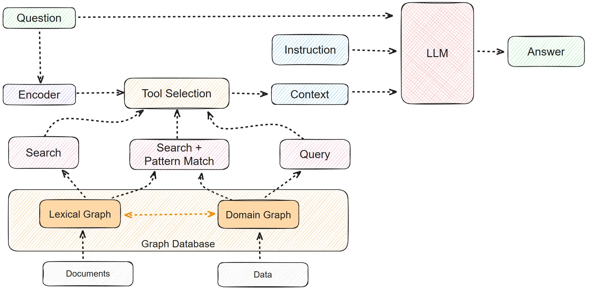
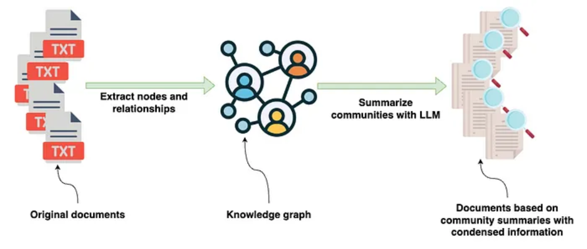

> 本文是笃行智元 AI 大模型技术社区「RAG 检索增强生成」系列的第 4 篇，深入讲解微软 GraphRAG 的原理、索引构建六步流程和查询引擎机制，附带从一段原始文本到完整知识图谱的全流程示例。
>
> 前置阅读：[01-RAG技术体系全景](../RAG/01-RAG技术体系全景.md)

---

## 一、为什么需要 GraphRAG

### 1.1 大模型落地核心问题

当前大模型应用落地的核心挑战之一是如何与私域数据交互。由于大模型的上下文处理能力有限，必须精准选择哪些数据在当前对话上下文中是有效的：

- 大模型的核心优势——内容生成的多样性和创新性——恰恰也是最大问题，因为生成内容不可控
- 在金融和医疗领域，一次金额评估错误或医疗诊断失误，哪怕只有一次都是致命的
- 大模型会输出看似合理但实则错误的信息（幻觉），非专业人士难以辨识

大量实验证明，当为大模型提供一定的上下文信息后，其输出会变得更稳定。因此，将知识库中的信息先输送给大模型，再由大模型服务用户，是业界普遍达成的共识。RAG 正是这套思路的工程实现。

### 1.2 Native RAG 的四个瓶颈

传统 RAG（Native RAG）通过向量语义检索 (Text2Vec) 找回相关文本块。这种方式对于简单问答非常有效——就像在食谱书中搜索"炒鸡蛋"一样快速精准。但面对复杂问题时，四个瓶颈逐一暴露：

| 瓶颈 | 表现 | 通俗解释 |
|------|------|----------|
| **上下文断裂** | 文本块之间的语义关联丢失 | 块 A 讲"张三毕业于清华"，块 B 讲"清华在五道口"，RAG 无法将两条信息串联 |
| **性能随文档增长而下降** | 检索精度随知识库扩大而降低 | 100 篇时召回率 90%，10,000 篇时降到 60% |
| **多跳推理困难** | 无法综合多个文档的信息拼接出答案 | "总结 A 公司和 B 公司在 AI 芯片领域的竞争关系"——需要跨文档关联 |
| **全局理解差** | 无法从大规模数据中抽象出高层语义 | "这个知识库整体覆盖了哪些机器学习算法？"——需要一个全局视角 |

简单来说：Native RAG 擅长回答"是什么"，但不擅长回答"为什么"和"整体有哪些"。

### 1.3 GraphRAG 的提出

2024 年 2 月，微软研究院正式提出 GraphRAG（Graph Retrieval-Augmented Generation），核心理念是：

> **利用 LLM 从私有数据中自动构建知识图谱，在查询时利用图结构进行增强检索。**

同年 4 月，微软发布论文《From Local to Global: A Graph RAG Approach to Query-Focused Summarization》，详细阐述了完整流程和卓越性能。

- 论文：https://arxiv.org/abs/2404.16130
- 项目：https://github.com/microsoft/graphrag

GraphRAG 通过构建知识图谱，将信息表示为互连的实体和关系网络。与扁平的文本块相比，这种结构化表示能擅长回答需要推理和连接不同信息点的复杂问题。和 Native RAG 一样，GraphRAG 也包括两个主要阶段：**索引（Indexing）** 和 **查询（Query）**。

---

## 二、GraphRAG 整体架构



> ▲ GraphRAG 完整架构：左侧索引阶段（文档→实体关系提取→社区聚类→图谱存储），右侧查询阶段（用户提问→局部/全局搜索→LLM 生成）（来源：graphrag.com）

### 2.1 与传统 RAG 的关键区别

| 维度 | Native RAG | GraphRAG |
|------|-----------|----------|
| 知识表示 | 文本块向量（扁平结构） | 知识图谱（实体-关系-社区三层结构） |
| 检索方式 | 纯向量相似度 | 向量检索 + 图遍历 + 社区摘要 |
| 多跳推理 | 几乎不支持 | 天然支持（沿关系边遍历） |
| 全局理解 | 弱（只能返回少数文本块） | 强（社区报告提供高层语义俯瞰） |
| 全面性 | 回答仅覆盖直接问题 | 能从上下文提取相关信息做补充 |
| 可解释性 | 返回文本片段但不含关系链条 | 返回实体关系路径 + 来源引用 |
| 构建成本 | 低（Embedding 一步完成） | 高（需 LLM 多次调用：抽取实体、挖掘关系、生成报告） |

---

## 三、索引阶段（Indexing）详解

索引阶段将原始文档转化为结构化知识图谱，共分 6 个步骤。接下来我们用一个完整示例贯穿全程。

**示例文本：**

> 《大数据时代》是一本由维克托·迈尔-舍恩伯格与肯尼斯·库克耶合著的书籍，讨论了如何在海量数据中挖掘出有价值的信息。这本书深入探讨了数据科学的应用，并阐述了数据分析和预测在各行各业中的影响力。在书中，作者举了许多实际例子，说明大数据如何改变我们的生活，甚至如何预测未来的趋势。

### Step 1: 文本切分（Text Unit Splitting）

GraphRAG 首先将原始文档切分为 TextUnit（文本单元），通常按 Token 数或自然段落切分。目的是便于后续做细粒度的实体识别和关系抽取。

**按 50 Token 切分后的结果：**

**文本单元 1：**

`《大数据时代》是一本由维克托·迈尔-舍恩伯格与肯尼斯·库克耶合著的书籍，讨论了如何在海量数据中挖掘出有价值的信息。`

**文本单元 2：**

`这本书深入探讨了数据科学的应用，并阐述了数据分析和预测在各行各业中的影响力。`

**文本单元 3：**

`在书中，作者举了许多实际例子，说明大数据如何改变我们的生活，甚至如何预测未来的趋势。`

**存入 TEXT_UNIT_TABLE：**

| id | human_readable_id | text | n_tokens | document_ids |
|----|-------------------|------|----------|-------------|
| t1 | text_unit_1 | 《大数据时代》是一本由维克托·迈尔-舍恩伯格与肯尼斯·库克耶合著的书籍，讨论了如何在海量数据中挖掘出有价值的信息。 | 50 | doc_1 |
| t2 | text_unit_2 | 这本书深入探讨了数据科学的应用，并阐述了数据分析和预测在各行各业中的影响力。 | 50 | doc_1 |
| t3 | text_unit_3 | 在书中，作者举了许多实际例子，说明大数据如何改变我们的生活，甚至如何预测未来的趋势。 | 50 | doc_1 |

### Step 2: 实体识别（Entity Extraction）

#### 2.1 什么是实体

在自然语言处理中，**实体（Entity）** 指的是文本中具有独立存在、能够被明确识别并具有特定意义的对象。实体通常是一些特定的名词，代表现实世界中的对象或概念：

| 类型 | 举例 |
|------|------|
| **人名** | 维克托·迈尔-舍恩伯格、肯尼斯·库克耶 |
| **地点** | 北京、美国 |
| **组织名** | 微软公司、谷歌 |
| **事件** | 新冠疫情、2024 东京奥运会 |
| **日期** | 2024 年 12 月、2023 年 11 月 |
| **物品** | iPhone、蓝牙耳机 |
| **概念** | 大数据、机器学习 |

在知识图谱中，每个实体都有唯一标识符和属性（名称、类型、描述等）。实体是图谱中的**节点**，通过关系（边）相互连接。

#### 2.2 实体识别过程

实体识别涉及两个子任务：

1. **命名实体识别（NER）**：从文本中识别出具有特定意义的实体，如人名、地点、日期
2. **实体分类**：根据属性对实体分类，如将"维克托·迈尔-舍恩伯格"分类为"人名"，将"大数据"分类为"概念"

在 GraphRAG 中，实体识别使用 LLM（如 GPT）自动完成，并为每个实体生成语义嵌入向量，帮助理解实体在不同上下文中的意义。

#### 2.3 示例：从文本中提取实体

从示例文本中提取出 5 个实体，存入 **ENTITY_EMBEDDING_TABLE**：

| id | human_readable_id | title | type | description | text_unit_ids |
|----|-------------------|-------|------|-------------|---------------|
| e1 | 大数据时代 | 大数据时代 | 书籍 | 《大数据时代》是一本关于大数据应用的书籍，作者讨论了数据如何改变世界。 | [t1, t2] |
| e2 | 维克托·迈尔-舍恩伯格 | 维克托·迈尔-舍恩伯格 | 人物 | 维克托·迈尔-舍恩伯格是大数据领域的专家，《大数据时代》的合著者。 | [t1] |
| e3 | 肯尼斯·库克耶 | 肯尼斯·库克耶 | 人物 | 肯尼斯·库克耶同样是大数据领域的专家，《大数据时代》的合著者之一。 | [t1] |
| e4 | 数据科学 | 数据科学 | 概念 | 《大数据时代》讨论的核心议题，关于如何进行更有效的数据挖掘。 | [t2] |
| e5 | 数据分析 | 数据分析 | 概念 | 数据科学领域的具体实践方法，在大数据时代其价值被进一步放大。 | [t2, t3] |

**字段说明：**

- `id`：唯一标识符，便于在数据库中唯一标识每个实体
- `human_readable_id`：人类可读名称，便于后续引用和查询
- `title`：实体标题或名称
- `type`：实体类型（书籍/人物/概念等），帮助下游理解实体的角色
- `description`：实体简短描述，概括实体的核心信息
- `text_unit_ids`：该实体出现在哪些文本单元中（关联溯源）

#### 2.4 ENTITY_TABLE（实体图属性表）

同时，GraphRAG 维护 **ENTITY_TABLE** 记录每个实体在图中的属性，初始状态如下：

| id | human_readable_id | title | community | level | degree | x | y |
|----|-------------------|-------|-----------|-------|--------|---|---|
| 1 | entity_1 | 大数据时代 | - | - | - | - | - |
| 2 | entity_2 | 维克托·迈尔-舍恩伯格 | - | - | - | - | - |
| 3 | entity_3 | 肯尼斯·库克耶 | - | - | - | - | - |
| 4 | entity_4 | 数据科学 | - | - | - | - | - |
| 5 | entity_5 | 数据分析 | - | - | - | - | - |

- `community`：实体所属社区编号（后续聚类填充）
- `level`：实体层级/重要性（后续计算）
- `degree`：实体度数/连接数（后续计算）
- `x, y`：虚拟坐标，用于可视化图布局

### Step 3: 关系挖掘（Relationship Extraction）

#### 3.1 关系挖掘的目标

关系挖掘是构建知识图谱的关键环节，旨在从文本中识别不同实体之间的语义关系，构建**实体—关系—实体**三元组，这是知识图谱的基本组成单元。

例如：*"维克托·迈尔-舍恩伯格是《大数据时代》一书的作者"*

- **实体 A**：维克托·迈尔-舍恩伯格（人物）
- **实体 B**：《大数据时代》（书籍）
- **关系**：是...的作者

#### 3.2 示例：从文本中抽取关系

从示例文本中抽取出 4 条关系：

| 实体 A | 关系 | 实体 B |
|--------|------|--------|
| 维克托·迈尔-舍恩伯格 | 是作者 | 《大数据时代》 |
| 肯尼斯·库克耶 | 是作者 | 《大数据时代》 |
| 《大数据时代》 | 探讨 | 数据科学 |
| 《大数据时代》 | 阐述 | 数据分析 |

#### 3.3 RELATIONSHIP_TABLE

将关系存入 **RELATIONSHIP_TABLE**：

| id | human_readable_id | source | target | description | weight | combined_degree | text_unit_ids |
|----|-------------------|--------|--------|-------------|--------|-----------------|---------------|
| r1 | relation_1 | 维克托·迈尔-舍恩伯格 | 《大数据时代》 | 作者 | 0.9 | 1 | [t1] |
| r2 | relation_2 | 肯尼斯·库克耶 | 《大数据时代》 | 作者 | 0.7 | 1 | [t1] |
| r3 | relation_3 | 《大数据时代》 | 数据科学 | 探讨 | 0.65 | 1 | [t2] |
| r4 | relation_4 | 《大数据时代》 | 数据分析 | 阐述 | 0.65 | 1 | [t2] |

- `weight`：关系强度权重（0~1），反映关系的置信度或重要性
- `combined_degree`：组合度数
- `text_unit_ids`：关系来源的文本单元

#### 3.4 计算 Degree 和 Level

基于关系图，计算每个实体的**度数（Degree）** 和**等级（Level）**，这两个指标描述实体在图中的连接性和重要性。

**度数（Degree）**：一个节点在图中的直接连接边数量。度数越高，该实体在图中越重要或越活跃。
- 入度 (In-degree)：指向该节点的边数
- 出度 (Out-degree)：从该节点发出的边数

**等级（Level）**：实体在图中的层次或深度，反映"核心性"。可通过 PageRank、近邻中心性或社区发现算法计算。中心节点等级更高，外围节点等级较低。

**示例计算：**

| 实体 | 连接情况 | Degree | Level |
|------|----------|--------|-------|
| **大数据时代** | 连接 4 个实体（维克托、肯尼斯、数据科学、数据分析） | **4** | **1（核心）** |
| 维克托·迈尔-舍恩伯格 | 只与大数据时代相连 | 1 | 2（外围） |
| 肯尼斯·库克耶 | 只与大数据时代相连 | 1 | 2（外围） |
| 数据科学 | 只与大数据时代相连 | 1 | 2（外围） |
| 数据分析 | 只与大数据时代相连 | 1 | 2（外围） |

**更新后的 ENTITY_TABLE：**

| id | human_readable_id | title | community | level | degree | x | y |
|----|-------------------|-------|-----------|-------|--------|---|---|
| 1 | entity_1 | 大数据时代 | 1 | 1 | 4 | 0.1 | 0.5 |
| 2 | entity_2 | 维克托·迈尔-舍恩伯格 | 0 | 2 | 1 | 0.4 | 0.6 |
| 3 | entity_3 | 肯尼斯·库克耶 | 0 | 2 | 1 | 0.3 | 0.7 |
| 4 | entity_4 | 数据科学 | 0 | 2 | 1 | 0.6 | 0.4 |
| 5 | entity_5 | 数据分析 | 0 | 2 | 1 | 0.2 | 0.2 |

### Step 4: 社区检测（Community Detection）

使用图聚类算法（如 Leiden 算法）将实体划分为**社区（Community）**。每个社区代表一个语义主题，包含一组紧密关联的实体。

**示例中形成两个社区：**

- **社区 1（核心社区）**：《大数据时代》——中心节点，直接连接所有其他实体，覆盖多个领域
- **社区 2（外围社区）**：维克托·迈尔-舍恩伯格、肯尼斯·库克耶、数据科学、数据分析——围绕核心实体，提供背景和理论支持

### Step 5: 生成社区报告（Community Report）

为每个社区生成自然语言摘要报告，包含该社区的核心主题、关键实体、重要关系等信息。

**社区报告包含的字段：**

1. **社区概述（Summary）**：总结社区的核心主题
2. **核心实体（Entities）**：该社区中的重要实体
3. **重要关系（Relationships）**：社区内实体间的关键关系
4. **影响力分析（Influence）**：实体间的相互影响
5. **社区排名（Rank）**：社区在整个图谱中的位置

**社区 1 报告（核心社区）——大数据时代的影响：**

| 字段 | 内容 |
|------|------|
| community_id | community_1 |
| level | 1（核心社区） |
| title | 大数据时代的影响 |
| summary | 社区围绕《大数据时代》一书展开，书中探讨了数据科学、数据分析的应用，以及它们如何在各行各业产生深远影响。核心实体包括《大数据时代》，它在知识图谱中扮演着中心角色。 |
| full_content | 本书通过多个实际案例，分析了大数据的应用场景，重点讲解了如何通过数据预测未来趋势。书中的内容涉及各个领域的应用，尤其是数据科学和数据分析如何推动各行各业的变革。 |
| rank | 1（整个知识图谱的中心位置） |
| rank_explanation | 该社区的核心实体与所有其他实体都有紧密关系，且覆盖了多个领域，重要性极高。 |
| findings | 该社区显示了大数据与数据科学、数据分析之间的深刻联系，尤其是在未来趋势预测方面的广泛应用。 |
| size | 4（涉及实体数） |

**社区 2 报告（外围社区）——《大数据时代》背后的专家与理论：**

| 字段 | 内容 |
|------|------|
| community_id | community_2 |
| level | 2（外围社区） |
| title | 《大数据时代》背后的专家与理论 |
| summary | 围绕《大数据时代》的两位作者及学科"数据科学"和"数据分析"展开，为核心社区提供理论支撑。 |
| full_content | 社区包含了两位作者和学科领域，分析了它们对《大数据时代》内容的支持和贡献。 |
| rank | 2（外围位置） |
| rank_explanation | 该社区的实体是核心内容的支持性角色，提供理论背景，重要性次于核心社区。 |
| findings | 揭示了作者和学科如何影响《大数据时代》的内容及现代数据科学的发展。 |
| size | 4 |

**存入 COMMUNITY_REPORT_TABLE：**

| id | community | level | title | summary | rank | findings | size |
|----|-----------|-------|-------|---------|------|----------|------|
| community_1 | 1 | 1 | 大数据时代的影响 | 围绕《大数据时代》展开，探讨数据科学和数据分析的应用和对各行各业的影响。 | 1 | 大数据与数据科学、数据分析之间的深刻联系，尤其在预测未来趋势方面。 | 4 |
| community_2 | 2 | 2 | 《大数据时代》背后的专家与理论 | 围绕作者和学科展开，它们是本书的理论支持，位于外围位置。 | 2 | 数据科学和数据分析学科如何影响《大数据时代》的内容。 | 4 |

### Step 6: 生成索引文件（Indexing）

将所有结构化数据序列化为 Parquet 文件，存储在磁盘上，供查询引擎加载：

- `TEXT_UNIT_TABLE`：文本单元
- `ENTITY_TABLE` / `ENTITY_EMBEDDING_TABLE`：实体及其嵌入向量
- `RELATIONSHIP_TABLE`：实体间关系
- `COMMUNITY_REPORT_TABLE`：社区报告



> ▲ GraphRAG 索引管线全景：文档 → 文本切分 → 实体/关系提取 → 社区检测 → 社区摘要 → 嵌入存储 → Parquet 输出

**索引阶段小结——六步总览：**

```
Step 1: 文本切分      → 将文档拆分为 TextUnit
Step 2: 实体识别      → LLM 提取实体 + 生成嵌入向量
Step 3: 关系挖掘      → LLM 识别实体间的语义关系（三元组）
Step 4: 社区检测      → Leiden 图聚类算法划分社区
Step 5: 社区报告      → LLM 为每个社区生成自然语言摘要
Step 6: 生成索引文件   → 所有数据序列化为 Parquet
```

---

## 四、查询阶段（Query）详解

索引阶段完成后，就可以对知识图谱进行查询。GraphRAG 的查询引擎利用构建好的实体、关系和社区报告，结合用户的查询请求，自动选择最相关的上下文，并通过 LLM 生成回答。

### 4.1 查询执行流程

以用户提问**"告诉我《大数据时代》的核心思想是什么？"** 为例：

**Step 1：用户输入查询**

用户通过自然语言表达信息需求。

**Step 2：构建查询上下文（Build Query Context）**

GraphRAG 从知识图谱中提取与查询相关的信息，包括：

- **文本单元（Text Units）**：与查询相关的文档片段，如包含"大数据时代""数据科学"的文本块
- **实体（Entities）**：与查询相关的实体，如"维克托·迈尔-舍恩伯格""数据分析"等
- **关系（Relationships）**：实体之间的关系，如"维克托·迈尔-舍恩伯格"与"《大数据时代》"的作者关系
- **社区报告（Community Reports）**：相关的社区摘要信息，帮助理解文本和实体的聚合关系

上下文构建时会根据预设参数（文本单元占比、实体数量等）选择最相关的内容。

**Step 3：文本切分和嵌入（Splitting & Embedding）**

- 将文本按预设规则切分为文本单元
- 使用预训练的 Embedding 模型将每个文本单元转化为向量
- 对实体和关系也计算嵌入向量（基于实体描述和关系文本）

**Step 4：构建局部上下文（Local Context）**

使用 `LocalSearchMixedContext` 类将以下信息组合成"上下文窗口"：

- 查询相关的文本单元
- 查询相关的实体
- 查询相关的关系
- 相关的社区报告

**Step 5：检索并选择相关信息（Retrieve & Select）**

通过局部搜索算法从候选上下文中选择与用户查询最相关的信息。

**Step 6：LLM 生成答案（Answer Generation）**

将检索到的上下文信息输入 LLM，生成自然语言回答：

> *"《大数据时代》的核心思想是数据的价值及其在各领域的影响力，特别是在预测未来趋势方面的应用。本书通过多个实际案例，分析了大数据的应用场景……"*

**Step 7：返回结果**

将回答返回给用户。如果设置了 `return_candidate_context=True`，还会返回所有相关候选实体、关系和文本单元，供用户核查引用来源。

### 4.2 查询类型

| 模式 | 适用场景 | 机制 |
|------|----------|------|
| **Local Search**（局部搜索） | 具体事实查询 | 检索相关实体+文本+关系，类似增强版 RAG |
| **Global Search**（全局搜索） | 总结性/综合性问题 | 利用社区报告，生成"俯瞰全局"的回答 |

### 4.3 查询阶段关键技术点

- **局部搜索**：通过局部搜索算法从已有知识图谱中选择与查询最相关的内容
- **嵌入（Embeddings）**：对文本单元、实体和关系分别向量化，计算语义相似度，选取最相关的内容
- **LLM 生成**：基于结构化上下文（非扁平文本块）生成更准确、有逻辑链条的回答
- **灵活上下文构建**：可根据查询复杂度动态调整文本、实体和社区报告的配比

### 4.4 Global Search（全局搜索）详解

Local Search 适合具体事实查询，但面对总结性、综合性问题（如"整个知识库覆盖了哪些核心主题？"），需要用到 **Global Search**。Global Search 不依赖实体级别的检索，而是利用社区报告做"俯瞰全局"的回答。

**Global Search 执行流程：**

```
用户提问："这些文档总体上讲了什么？"

Step 1: 提取所有社区报告（Community Reports）
        → community_1: "大数据时代的影响"
        → community_2: "专家与理论背景"
        → ...

Step 2: 按社区报告的 rank 排序，选取 Top-N 个最重要的社区
        → 优先选择 rank=1（核心社区），再依次往下

Step 3: 用 Map-Reduce 模式分批生成回答
        Map:   将每个社区报告 + 用户问题 → LLM 生成局部摘要
        Reduce: 将所有局部摘要汇总 → LLM 生成全局综合回答

Step 4: 返回结构化全局回答
```

**Local vs Global 选择指南：**

| 问题类型 | 举例 | 推荐模式 |
|----------|------|----------|
| 事实查询 | "大数据时代是谁写的？" | Local Search |
| 细节追问 | "书中怎么描述数据分析的？" | Local Search |
| 总结概括 | "这些文档的核心主题是什么？" | **Global Search** |
| 全局统计 | "一共涉及了多少个领域？" | **Global Search** |
| 对比分析 | "文档 A 和文档 B 的视角有何不同？" | Global Search |

### 4.5 DRIFT Search（动态扇出搜索）

GraphRAG 还提供 **DRIFT Search**（Dynamic Retrieval of Information via Fan-out Traversal），这是一种从特定实体出发、沿关系边逐步扩展搜索范围的查询方式。

**DRIFT Search 流程：**

```
用户提问："数据科学在现代有哪些应用？"

Step 1: 从实体"数据科学"出发 → 找到直接关联实体
        → 数据科学 ←探讨→ 《大数据时代》
        → 数据科学 ←阐述→ 数据分析

Step 2: 扇出（Fan-out）到邻居实体 → 继续扩展
        → 《大数据时代》 ←作者→ 维克托·迈尔-舍恩伯格
        → 数据分析 ←相关→ 预测未来趋势

Step 3: 结合社区信息 → 每层检索都带入社区报告的上下文
        → community_1 报告: "大数据与数据科学的深刻联系"

Step 4: 收集完整上下文 → LLM 生成回答
```

DRIFT 的优势在于：**由点及面**，从一个实体出发自动发现相关的概念网络，适合探索性、关联性的查询。

### 4.6 GraphRAG 配置详解（settings.yaml）

GraphRAG 的核心配置集中在 `settings.yaml` 中，以下是关键参数：

```yaml
# LLM 配置
llm:
  model: gpt-4o                    # 实体/关系抽取用的模型
  api_base: https://api.openai.com/v1
  max_tokens: 4000                 # 单次生成的最大 Token
  temperature: 0                   # 抽取任务建议 0（确定性输出）

# Embedding 配置
embeddings:
  llm:
    model: text-embedding-3-small  # 文本和实体向量化用的模型
    api_base: https://api.openai.com/v1

# 文本切分配置
chunks:
  size: 1200                       # 每个 TextUnit 的 Token 数
  overlap: 100                     # 相邻块的重叠 Token 数

# 实体提取配置
entity_extraction:
  prompt: "prompts/entity_extraction.txt"   # 自定义 Prompt 模板
  max_gleanings: 1                          # 额外提取轮次（提高召回）
  strategy: graph_intelligence              # 提取策略

# 社区检测配置
cluster_graph:
  max_cluster_size: 10             # 单个社区最大实体数

# 社区报告配置
summarize_descriptions:
  max_length: 500                  # 社区报告最大长度

# 查询配置
local_search:
  top_k_entities: 10               # 局部搜索返回的实体数
  top_k_relationships: 10          # 返回的关系数
  max_context_tokens: 12000        # 查询上下文最大 Token

global_search:
  max_context_tokens: 12000        # 全局搜索上下文最大 Token
  map_max_tokens: 1000             # Map 阶段每批最大 Token
  reduce_max_tokens: 2000          # Reduce 阶段最大 Token
```

### 4.7 索引阶段 Token 消耗分析

GraphRAG 的索引阶段需要大量 LLM 调用，以下是各步骤的 Token 消耗估算（以 100 页中英文混合文档为例）：

| 步骤 | LLM 调用次数 | 单次 Token（估算） | 总 Token（估算） |
|------|-------------|-------------------|-----------------|
| 实体识别 | 每 TextUnit 一次 | ~800 input + ~200 output | ~100K |
| 实体描述生成 | 每实体一次 | ~500 input + ~300 output | ~80K |
| 关系挖掘 | 每 TextUnit 一次 | ~1,000 input + ~300 output | ~130K |
| 社区报告生成 | 每社区一次 | ~2,000 input + ~800 output | ~30K |
| **合计** | — | — | **~340K** |

> 使用 GPT-4o 时，按 $2.5/1M input + $10/1M output 计算，100 页文档的索引成本约 **$1-3**。

**优化建议：**
- 使用 `gpt-4o-mini` 做实体/关系抽取（成本降低 10 倍，质量略降）
- 调整 `max_gleanings: 0` 禁用额外提取轮次（减少 50% 调用）
- 增大 `chunks.size` 减少 TextUnit 数量
- 对质量要求不高的文档，可关闭社区报告生成

### 4.8 Prompt Tuning（提示词调优）

GraphRAG 提供了自动 Prompt Tuning 功能，能根据你的文档内容自动优化实体提取、关系挖掘和社区报告的 Prompt 模板。

```bash
# 自动调优（推荐）
graphrag prompt-tune --root ./my_project \
  --domain "技术文档" \
  --language "中文" \
  --max-tokens 4000

# 手动指定 Prompt 模板
graphrag prompt-tune --root ./my_project \
  --entity-extraction-prompt ./custom_entity_prompt.txt
```

调优后的 Prompt 会保存在项目的 `prompts/` 目录下，后续索引构建自动使用。

---

## 五、GraphRAG vs Native RAG 效果对比

GraphRAG 在多个维度上展现出对 Native RAG 的显著优势：

| 评价维度 | Native RAG | GraphRAG | 说明 |
|----------|-----------|----------|------|
| **全面性** | 只回答直接问题 | 补充上下文相关信息 | 回答问题覆盖的隐含背景 |
| **可解释性** | 返回文本片段 | 提供来源+实体关系路径 | 用户可追溯答案来源 |
| **多样性** | 单一视角 | 多角度组织回答 | 对于复杂问题尤为重要 |
| **总结能力** | 弱 | 强（社区报告） | 如"知识库覆盖了哪些算法" |
| **多跳推理** | 不支持 | 天然支持 | "A 和 B 的竞争关系"类问题 |

---

## 六、快速上手

```bash
# 安装
pip install graphrag

# 初始化项目
graphrag init --root ./my_project

# 放入文档到 ./input/ 目录

# 构建索引（会调用 LLM 多次，消耗 Token）
graphrag index --root ./my_project

# 局部搜索
graphrag query --root ./my_project \
  --method local \
  --query "这份文档主要讲了什么？"

# 全局搜索
graphrag query --root ./my_project \
  --method global \
  --query "整体来看，这些文档覆盖了哪些核心主题？"
```

> 配置参考：https://microsoft.github.io/graphrag/
