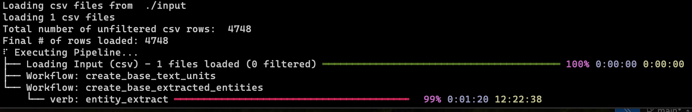
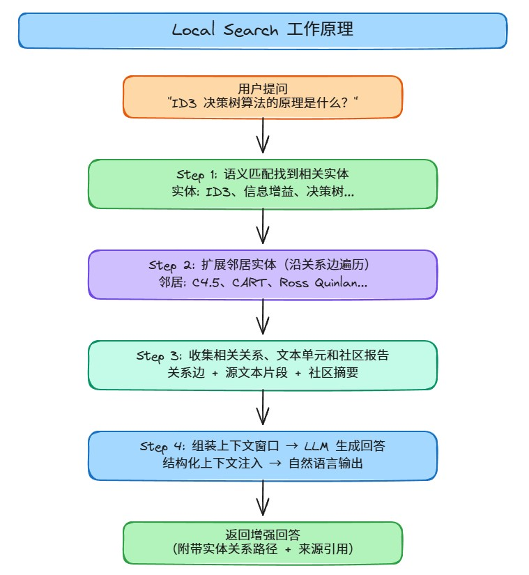
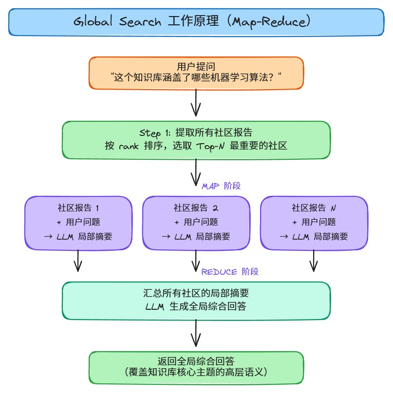
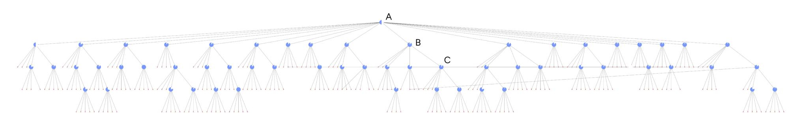

> 本文是 AI 大模型技术社区「RAG 检索增强生成」系列的第 4-2 篇，聚焦 GraphRAG 的工程落地：从安装部署、索引构建到三种搜索模式（Local / Global / DRIFT）的 API 调用实战。
>
> 本文基于 **GraphRAG v2.8.0**（2025 年 3 月 27 日发布），包含最新的多模态支持、o1/o3-mini 模型适配等特性。
>
> 前置阅读：[04-GraphRAG原理与入门](./04-GraphRAG原理与入门.md)

---

## 一、环境准备与安装

### 1.1 环境要求

| 项目 | 要求 |
|------|------|
| Python | 3.10+ |
| 操作系统 | Linux / Windows / macOS |
| LLM API | OpenAI API（或兼容接口） |
| 建议显存 | 无需 GPU（GraphRAG 依赖 LLM API，不本地推理） |

### 1.2 版本说明

| 版本 | 发布日期 | 主要更新 |
|------|----------|----------|
| **v2.8.0** | 2025-03-27 | 支持 OpenAI o1/o3-mini 模型，改进实体提取性能 |
| v2.7.0 | 2025-02-14 | 多模态支持（图像+文本），改进文档解析器 |
| v2.6.0 | 2025-01-15 | 本地模型支持，改进缓存机制 |
| v2.5.0 | 2024-12 | DRIFT Search 正式发布 |
| v2.4.0 | 2024-11 | 配置结构重构，YAML 格式统一 |

> **建议**：新项目直接使用 v2.8.0，老项目升级时注意配置文件格式变更。

### 1.3 安装 GraphRAG

```bash
pip install graphrag
```

> 注：GraphRAG v2.8.0 依赖较多（openai、networkx、graspologic、lancedb 等），首次安装可能需要 2-3 分钟。

### 1.4 创建项目

```bash
# 创建项目目录
mkdir -p ./graphrag_demo/input

# 初始化项目（生成配置文件）
graphrag init --root ./graphrag_demo
```

初始化后，项目目录结构如下：

```
graphrag_demo/
├── input/              # 存放待索引的文档
├── output/             # 索引输出结果
├── .env                # API Key 配置
├── settings.yaml       # 主配置文件
└── prompts/            # 提示词模板（可自定义）
```

### 1.5 配置 API

**配置 `.env` 文件：**

```bash
GRAPHRAG_API_KEY=your-openai-api-key
```

**配置 `settings.yaml` 文件：**

```yaml
llm:
  api_key: ${GRAPHRAG_API_KEY}
  model: gpt-4o-mini
  api_base: https://api.openai.com/v1  # 或你的反向代理地址
  type: openai_chat
  # v2.8.0 新增：支持 o1/o3-mini 推理模型
  # model: o3-mini
  # reasoning_effort: medium  # low / medium / high

embeddings:
  llm:
    api_key: ${GRAPHRAG_API_KEY}
    model: text-embedding-3-small
    api_base: https://api.openai.com/v1
    type: openai_embedding
```

> **使用反向代理**：如果无法直接访问 OpenAI API，可将 `api_base` 替换为兼容的代理地址。

> **v2.7.0 新增**：支持本地部署模型（如 Ollama、vLLM），配置 `type: openai_chat` 并将 `api_base` 指向本地服务即可。

### 1.6 验证 API 连通性

```python
from openai import OpenAI

client = OpenAI(api_key="your-api-key", base_url="https://api.openai.com/v1")

# 测试 LLM 调用
response = client.chat.completions.create(
    model="gpt-4o-mini",
    messages=[{"role": "user", "content": "你好"}]
)
print(response.choices[0].message.content)

# 查看可用模型
models = client.models.list()
print([m.id for m in models.data])
```

---

## 二、GraphRAG Indexing：构建知识图谱



> ▲ GraphRAG 索引构建流程

### 2.1 准备数据

将待索引的文档放入 `input/` 目录。支持 `.txt` 和 `.csv` 格式：

```bash
# 示例：放入一篇技术文档
cp your_document.txt ./graphrag_demo/input/
```

### 2.2 执行索引

```bash
graphrag index --root ./graphrag_demo
```

索引过程会依次执行以下步骤：

```
├── create_base_text_units          # 文本切分为 TextUnit
├── create_final_documents          # 生成文档记录
├── create_base_entity_graph        # 实体/关系抽取 + 图构建
├── create_final_entities           # 实体表
├── create_final_nodes              # 图节点（含社区信息）
├── create_final_communities        # 社区聚类（Leiden 算法）
├── create_final_relationships      # 关系表
├── create_final_text_units         # 最终文本单元
├── create_final_community_reports  # 社区报告生成
└── generate_text_embeddings        # 文本嵌入生成
```

**索引耗时参考**（以 gpt-4o-mini 为例）：

| 文档大小 | 预估耗时 | Token 消耗 |
|----------|----------|-----------|
| 5KB | 1-2 分钟 | ~10K tokens |
| 50KB | 5-10 分钟 | ~100K tokens |
| 500KB | 30-60 分钟 | ~1M tokens |

> **提示**：索引是 GraphRAG 最大的成本项。每次索引都会调用大量 LLM API，建议先用小文档测试，确认效果后再处理大文档。

### 2.3 索引输出

索引完成后，`output/` 目录下会生成 Parquet 格式的数据文件：

```
output/
├── create_final_entities.parquet         # 实体表
├── create_final_relationships.parquet    # 关系表
├── create_final_community_reports.parquet # 社区报告
├── create_final_text_units.parquet       # 文本单元
├── create_final_nodes.parquet            # 图节点
├── create_final_communities.parquet      # 社区信息
├── create_final_documents.parquet        # 文档记录
└── lancedb/                              # 向量数据库
```

---

## 三、GraphRAG Query：三种搜索模式

GraphRAG 提供三种搜索模式，适用于不同类型的查询场景：

| 搜索模式 | 适用场景 | 原理 |
|----------|----------|------|
| **Local Search** | 特定实体的详细问题 | 从目标实体出发，扩展邻居节点 + 关系 + 文本单元 |
| **Global Search** | 全局性总结/概览问题 | 利用社区报告进行 Map-Reduce 式推理 |
| **DRIFT Search** | 需要社区上下文的局部问题 | Local Search + 社区信息增强 |

### 3.1 初始化模型

在使用搜索功能前，需要初始化 LLM 和 Embedding 模型：

```python
import os
import tiktoken
from openai import OpenAI, AsyncOpenAI
from graphrag.query.llm.oai.chat_openai import ChatOpenAI
from graphrag.query.llm.oai.typing import OpenaiApiType
from graphrag.query.llm.oai.embedding import OpenAIEmbedding

# API 配置
api_key = os.environ.get("GRAPHRAG_API_KEY", "your-api-key")
api_base = "https://api.openai.com/v1"  # 或你的代理地址

# 初始化 Chat 模型
llm = ChatOpenAI(
    api_key=api_key,
    api_base=api_base,
    model="gpt-4o-mini",
    api_type=OpenaiApiType.OpenAI,
    max_retries=20,
)

# 初始化文本分词器
token_encoder = tiktoken.get_encoding("cl100k_base")

# 初始化 Embedding 模型
text_embedder = OpenAIEmbedding(
    api_key=api_key,
    api_base=api_base,
    model="text-embedding-3-small",
    api_type=OpenaiApiType.OpenAI,
    max_retries=20,
)
```

### 3.2 加载索引数据

```python
import pandas as pd

output_dir = "./graphrag_demo/output"

# 加载实体、关系、社区报告、文本单元
entity_df = pd.read_parquet(f"{output_dir}/create_final_entities.parquet")
relationship_df = pd.read_parquet(f"{output_dir}/create_final_relationships.parquet")
report_df = pd.read_parquet(f"{output_dir}/create_final_community_reports.parquet")
text_unit_df = pd.read_parquet(f"{output_dir}/create_final_text_units.parquet")

# 转换为列表格式
entities = entity_df.to_dict("records")
relationships = relationship_df.to_dict("records")
reports = report_df.to_dict("records")
text_units = text_unit_df.to_dict("records")

print(f"实体数量: {len(entities)}")
print(f"关系数量: {len(relationships)}")
print(f"社区报告数量: {len(reports)}")
print(f"文本单元数量: {len(text_units)}")
```

### 3.3 加载实体嵌入

```python
from graphrag.query.indexer_adapters import read_indexer_entities

# 加载实体嵌入（用于 Local Search 的语义匹配）
description_embedding_store = read_indexer_entities(
    entities=entity_df,
    vectorstore_type="lancedb",
    vectorstore_config={
        "db_uri": f"{output_dir}/lancedb",
        "collection_name": "default-entity-description",
        "overwrite": False,
    },
)
```

---

## 四、Local Search（本地搜索）

Local Search 是最常用的搜索模式。当用户询问某个**特定实体**的详细信息时，它会从该实体出发，沿知识图谱的关系边扩展，收集相关的实体、关系、文本单元和社区报告，组装成上下文后交给 LLM 生成回答。

### 4.1 工作原理



### 4.2 构建搜索引擎

```python
from graphrag.query.context_builder.entity_extraction import EntityVectorStoreKey
from graphrag.query.structured_search.local_search.mixed_context import LocalSearchMixedContext
from graphrag.query.structured_search.local_search.search import LocalSearch

# 创建上下文构建器
context_builder = LocalSearchMixedContext(
    community_reports=reports,
    text_units=text_units,
    entities=entities,
    relationships=relationships,
    covariates=None,  # 如有协变量数据可传入
    entity_text_embeddings=description_embedding_store,
    embedding_vectorstore_key=EntityVectorStoreKey.ID,
    text_embedder=text_embedder,
    token_encoder=token_encoder,
)

# 搜索参数配置
local_context_params = {
    "text_unit_prop": 0.5,           # 文本单元在上下文中的占比
    "community_prop": 0.1,           # 社区报告在上下文中的占比
    "conversation_history_max_turns": 5,
    "conversation_history_user_turns_only": True,
    "top_k_mapped_entities": 10,     # 检索的相关实体数
    "top_k_relationships": 10,       # 检索的关系数
    "include_entity_rank": True,
    "include_relationship_weight": True,
    "include_community_rank": True,
    "return_candidate_context": True,
    "embedding_vectorstore_key": EntityVectorStoreKey.ID,
    "max_tokens": 12_000,            # 上下文最大 Token 数
}

llm_params = {
    "max_tokens": 2_000,             # 回答最大 Token 数
    "temperature": 0.0,              # 温度（0 = 确定性输出）
}

# 创建搜索引擎
local_search_engine = LocalSearch(
    llm=llm,
    context_builder=context_builder,
    token_encoder=token_encoder,
    llm_params=llm_params,
    context_builder_params=local_context_params,
    response_type="multiple paragraphs",
)
```

### 4.3 执行查询

```python
# 异步查询
result = await local_search_engine.asearch("请介绍下 ID3 决策树算法")
print(result.response)

# 查看调用统计
print(f"LLM 调用次数: {result.llm_calls}")
print(f"Prompt Token: {result.prompt_tokens}")
print(f"输出 Token: {result.output_tokens}")
```

**示例输出：**

> ID3（Iterative Dichotomiser 3）决策树算法是一种用于分类的机器学习算法，由 Ross Quinlan 在 1986 年提出。它基于**信息增益**（Information Gain）来选择最优划分属性。
>
> 核心思想：
> 1. 计算每个特征的信息增益
> 2. 选择信息增益最大的特征作为分裂节点
> 3. 递归构建子树，直到所有样本属于同一类别或无特征可选
>
> ID3 的局限性包括：不能处理连续特征、倾向于选择取值较多的特征、不支持剪枝。后续的 C4.5 算法针对这些问题进行了改进。

---

## 五、Global Search（全局搜索）

Global Search 适用于**全局性**的总结和概览问题。它不针对特定实体，而是利用社区报告（Community Reports）进行 Map-Reduce 式推理。

### 5.1 工作原理



### 5.2 构建搜索引擎

```python
from graphrag.query.structured_search.global_search.community_context import GlobalCommunityContext
from graphrag.query.structured_search.global_search.search import GlobalSearch

# 创建上下文构建器
context_builder = GlobalCommunityContext(
    community_reports=reports,
    entities=entities,
    token_encoder=token_encoder,
    context_builder_params={
        "use_community_summary": False,  # 使用完整报告而非摘要
        "shuffle_data": True,
        "include_community_rank": True,
        "min_community_rank": 0,
        "community_rank_name": "rank",
        "include_community_weight": True,
        "community_weight_name": "occurrence weight",
        "normalize_community_weight": True,
        "max_tokens": 12_000,
        "context_name": "Reports",
    },
)

# Map 阶段参数
map_llm_params = {
    "max_tokens": 1_000,
    "temperature": 0.0,
    "response_format": {"type": "json_object"},  # 要求 JSON 输出
}

# Reduce 阶段参数
reduce_llm_params = {
    "max_tokens": 2_000,
    "temperature": 0.0,
}

# 创建搜索引擎
global_search_engine = GlobalSearch(
    llm=llm,
    context_builder=context_builder,
    token_encoder=token_encoder,
    max_data_tokens=12_000,
    map_llm_params=map_llm_params,
    reduce_llm_params=reduce_llm_params,
    allow_general_knowledge=False,   # 不使用通用知识，仅基于图谱
    json_mode=True,
    context_builder_params={
        "max_tokens": 12_000,
        "context_name": "Reports",
    },
    concurrent_coroutines=32,        # 并发数
    response_type="multiple paragraphs",
)
```

### 5.3 执行查询

```python
result = await global_search_engine.asearch("请介绍下 CART 决策树算法")
print(result.response)

# 查看调用的社区报告
print(f"参考社区报告数: {len(result.context_data['reports'])}")
print(f"LLM 调用次数: {result.llm_calls}")
print(f"Prompt Token: {result.prompt_tokens}")
```

**示例输出：**

> CART（Classification and Regression Trees）是一种重要的决策树算法，由 Breiman 等人在 1984 年开发。它具有以下特点：
>
> 1. **二叉树结构**：每个节点只分裂为两个子节点，便于提取规则
> 2. **支持分类和回归**：分类树使用基尼系数，回归树使用均方误差
> 3. **自底向上剪枝**：通过代价复杂度剪枝防止过拟合
>
> Scikit-learn 中的 `DecisionTreeClassifier` 和 `DecisionTreeRegressor` 正是 CART 算法的实现。

---

## 六、DRIFT Search（漂移搜索）



DRIFT（Dynamic Reasoning and Inference with Flexible Traversal）Search 是对 Local Search 的增强版本。它在局部搜索的基础上，额外引入社区信息来提供更丰富的上下文。

### 6.1 与 Local Search 的区别

| 维度 | Local Search | DRIFT Search |
|------|-------------|--------------|
| 社区信息 | 仅使用少量社区报告 | 主动查询相关社区 |
| 推理深度 | 单轮检索 | 多轮迭代推理 |
| 适用场景 | 简单实体查询 | 需要社区上下文的复杂问题 |

### 6.2 构建搜索引擎

```python
from graphrag.query.structured_search.drift_search.search import DRIFTSearch
from graphrag.query.structured_search.drift_search.drift_context import DRIFTSearchContext

# 创建 DRIFT 上下文
drift_context_builder = DRIFTSearchContext(
    community_reports=reports,
    text_units=text_units,
    entities=entities,
    relationships=relationships,
    entity_text_embeddings=description_embedding_store,
    embedding_vectorstore_key=EntityVectorStoreKey.ID,
    text_embedder=text_embedder,
    token_encoder=token_encoder,
)

# DRIFT 搜索参数
drift_params = {
    "text_unit_prop": 0.5,
    "community_prop": 0.2,           # 社区信息占比更高
    "top_k_mapped_entities": 10,
    "top_k_relationships": 10,
    "max_tokens": 12_000,
}

llm_params = {
    "max_tokens": 2_000,
    "temperature": 0.0,
}

# 创建搜索引擎
drift_search_engine = DRIFTSearch(
    llm=llm,
    context_builder=drift_context_builder,
    token_encoder=token_encoder,
    drift_params=drift_params,
    llm_params=llm_params,
    context_builder_params={"max_tokens": 12_000},
)
```

### 6.3 执行查询

```python
result = await drift_search_engine.asearch("决策树算法在实际项目中如何选择？")
print(result.response)
```

---

## 七、知识图谱可视化


> ▲ GraphRAG 与 Baseline RAG 的检索方式对比（来源：Microsoft Research Blog）

索引完成后，可以使用 `yfiles-jupyter-graphs` 在 Jupyter Notebook 中交互式可视化知识图谱。

### 7.1 安装依赖

```bash
pip install yfiles-jupyter-graphs
```

### 7.2 可视化代码

```python
from yfiles_jupyter_graphs import GraphWidget
from IPython.display import display

def convert_entities_to_dicts(df):
    """将实体 DataFrame 转换为 GraphWidget 格式"""
    nodes_dict = {}
    for _, row in df.iterrows():
        node_id = row["title"]
        if node_id not in nodes_dict:
            nodes_dict[node_id] = {
                "id": node_id,
                "properties": row.to_dict(),
            }
    return list(nodes_dict.values())

def convert_relationships_to_dicts(df):
    """将关系 DataFrame 转换为 GraphWidget 格式"""
    relationships = []
    for _, row in df.iterrows():
        relationships.append({
            "start": row["source"],
            "end": row["target"],
            "properties": row.to_dict(),
        })
    return relationships

# 创建图谱组件
w = GraphWidget()
w.directed = True
w.nodes = convert_entities_to_dicts(entity_df)
w.edges = convert_relationships_to_dicts(relationship_df)
w.node_label_mapping = "title"

# 社区颜色映射
COLORS = ["crimson", "darkorange", "indigo", "cornflowerblue", "cyan", "teal", "green"]

def community_to_color(community):
    try:
        return COLORS[int(community) % len(COLORS)] if community is not None else "lightgray"
    except (ValueError, TypeError):
        return "lightgray"

def edge_to_source_community(edge):
    source_node = next(
        (n for n in w.nodes if n["properties"]["title"] == edge["start"]),
        None,
    )
    return source_node["properties"].get("community") if source_node else None

# 应用颜色和大小映射
w.node_color_mapping = lambda node: community_to_color(
    node["properties"].get("community")
)
w.edge_color_mapping = lambda edge: community_to_color(edge_to_source_community(edge))
w.node_scale_factor_mapping = lambda node: 0.5 + node["properties"].get("size", 1) * 1.5 / 20
w.edge_thickness_factor_mapping = "weight"

# 布局和显示
w.circular_layout()
display(w)
```

**可视化效果说明：**

- **节点颜色**：不同颜色代表不同的社区（Leiden 聚类结果）
- **节点大小**：反映实体的度数（连接数越多越大）
- **边粗细**：反映关系的权重（关联越强越粗）

---

## 八、三种搜索模式对比

| 维度 | Local Search | Global Search | DRIFT Search |
|------|-------------|---------------|--------------|
| **输入问题类型** | 特定实体的详细问题 | 全局性总结/概览 | 需要社区上下文的复杂问题 |
| **检索来源** | 实体 + 关系 + 文本单元 + 社区报告 | 社区报告 | 实体 + 关系 + 文本单元 + 社区报告 |
| **推理方式** | 单轮上下文组装 | Map-Reduce | 多轮迭代推理 |
| **LLM 调用次数** | 1 次 | N+1 次（N 个社区 + 1 次汇总） | 多次 |
| **成本** | 低 | 中高 | 中 |
| **典型问题** | "ID3 算法的原理是什么？" | "知识库涵盖了哪些算法？" | "决策树在项目中如何选择？" |

---

## 九、常见问题与注意事项

### 9.1 索引相关

**Q：索引报错 `RateLimitError`？**

A：GraphRAG 索引会并发调用 LLM API，容易触发速率限制。解决方案：
- 在 `settings.yaml` 中降低并发数：
  ```yaml
  llm:
    requests_per_minute: 30  # 降低请求频率
    tokens_per_minute: 100000
  ```
- 使用付费 API Key（更高的速率限制）

**Q：索引完成后实体数量为 0？**

A：检查以下几点：
- LLM API 是否正常工作（用 1.5 节的代码验证）
- 文档语言是否与 `settings.yaml` 中的 `language` 配置一致
- 查看 `output/logs/indexing-engine.log` 中的错误信息

**Q：如何增量更新索引？**

A：GraphRAG 0.5.0+ 支持增量索引：
```bash
graphrag index --root ./graphrag_demo --incremental
```

### 9.2 查询相关

**Q：Local Search 返回结果不相关？**

A：
- 增大 `top_k_mapped_entities` 和 `top_k_relationships` 的值
- 检查实体是否正确提取（查看 `create_final_entities.parquet`）
- 尝试使用 Global Search（可能是全局性问题）

**Q：Global Search 耗时过长？**

A：
- 减少 `concurrent_coroutines` 以降低并发压力
- 减少社区报告数量（在索引阶段调整聚类参数）
- 使用更轻量的 LLM（如 gpt-4o-mini）

**Q：如何自定义回答格式？**

A：修改 `response_type` 参数：
- `"multiple paragraphs"`：多段落（默认）
- `"single paragraph"`：单段落
- `"prioritized list"`：优先级列表
- `"single sentence"`：单句话

### 9.3 成本估算

| 操作 | gpt-4o-mini 成本 | gpt-4o 成本 |
|------|-----------------|-------------|
| 索引 10KB 文档 | ~$0.01 | ~$0.10 |
| 索引 100KB 文档 | ~$0.10 | ~$1.00 |
| 单次 Local Search | ~$0.001 | ~$0.01 |
| 单次 Global Search | ~$0.01 | ~$0.10 |

> **建议**：开发测试阶段使用 gpt-4o-mini（成本低、速度快），生产环境根据质量要求选择 gpt-4o。

---

## 附录：完整查询脚本

以下是一个完整的 GraphRAG 查询脚本，包含初始化、数据加载和三种搜索模式：

```python
"""
GraphRAG 完整查询脚本
用法: python graphrag_query.py --mode local --query "你的问题"
"""

import os
import asyncio
import argparse
import tiktoken
import pandas as pd
from openai import OpenAI
from graphrag.query.llm.oai.chat_openai import ChatOpenAI
from graphrag.query.llm.oai.typing import OpenaiApiType
from graphrag.query.llm.oai.embedding import OpenAIEmbedding
from graphrag.query.context_builder.entity_extraction import EntityVectorStoreKey
from graphrag.query.indexer_adapters import read_indexer_entities

# ============ 配置 ============
API_KEY = os.environ.get("GRAPHRAG_API_KEY", "your-api-key")
API_BASE = "https://api.openai.com/v1"
OUTPUT_DIR = "./graphrag_demo/output"
LLM_MODEL = "gpt-4o-mini"
EMBEDDING_MODEL = "text-embedding-3-small"

# ============ 初始化 ============
def init_models():
    llm = ChatOpenAI(
        api_key=API_KEY, api_base=API_BASE,
        model=LLM_MODEL, api_type=OpenaiApiType.OpenAI, max_retries=20,
    )
    token_encoder = tiktoken.get_encoding("cl100k_base")
    text_embedder = OpenAIEmbedding(
        api_key=API_KEY, api_base=API_BASE,
        model=EMBEDDING_MODEL, api_type=OpenaiApiType.OpenAI, max_retries=20,
    )
    return llm, token_encoder, text_embedder

def load_data():
    entity_df = pd.read_parquet(f"{OUTPUT_DIR}/create_final_entities.parquet")
    relationship_df = pd.read_parquet(f"{OUTPUT_DIR}/create_final_relationships.parquet")
    report_df = pd.read_parquet(f"{OUTPUT_DIR}/create_final_community_reports.parquet")
    text_unit_df = pd.read_parquet(f"{OUTPUT_DIR}/create_final_text_units.parquet")
    
    return {
        "entities": entity_df.to_dict("records"),
        "relationships": relationship_df.to_dict("records"),
        "reports": report_df.to_dict("records"),
        "text_units": text_unit_df.to_dict("records"),
        "entity_df": entity_df,
    }

# ============ Local Search ============
async def local_search(query: str, llm, token_encoder, text_embedder, data):
    from graphrag.query.structured_search.local_search.mixed_context import LocalSearchMixedContext
    from graphrag.query.structured_search.local_search.search import LocalSearch
    
    emb_store = read_indexer_entities(
        data["entity_df"], "lancedb",
        {"db_uri": f"{OUTPUT_DIR}/lancedb", "collection_name": "default-entity-description"},
    )
    
    context_builder = LocalSearchMixedContext(
        community_reports=data["reports"], text_units=data["text_units"],
        entities=data["entities"], relationships=data["relationships"],
        covariates=None, entity_text_embeddings=emb_store,
        embedding_vectorstore_key=EntityVectorStoreKey.ID,
        text_embedder=text_embedder, token_encoder=token_encoder,
    )
    
    engine = LocalSearch(
        llm=llm, context_builder=context_builder, token_encoder=token_encoder,
        llm_params={"max_tokens": 2000, "temperature": 0.0},
        context_builder_params={
            "text_unit_prop": 0.5, "community_prop": 0.1,
            "top_k_mapped_entities": 10, "top_k_relationships": 10,
            "max_tokens": 12000,
        },
        response_type="multiple paragraphs",
    )
    
    result = await engine.asearch(query)
    return result

# ============ Global Search ============
async def global_search(query: str, llm, token_encoder, data):
    from graphrag.query.structured_search.global_search.community_context import GlobalCommunityContext
    from graphrag.query.structured_search.global_search.search import GlobalSearch
    
    context_builder = GlobalCommunityContext(
        community_reports=data["reports"], entities=data["entities"],
        token_encoder=token_encoder,
        context_builder_params={"use_community_summary": False, "max_tokens": 12000},
    )
    
    engine = GlobalSearch(
        llm=llm, context_builder=context_builder, token_encoder=token_encoder,
        max_data_tokens=12000,
        map_llm_params={"max_tokens": 1000, "temperature": 0.0, "response_format": {"type": "json_object"}},
        reduce_llm_params={"max_tokens": 2000, "temperature": 0.0},
        allow_general_knowledge=False, json_mode=True,
        concurrent_coroutines=32, response_type="multiple paragraphs",
    )
    
    result = await engine.asearch(query)
    return result

# ============ 主函数 ============
async def main():
    parser = argparse.ArgumentParser()
    parser.add_argument("--mode", choices=["local", "global"], default="local")
    parser.add_argument("--query", type=str, required=True)
    args = parser.parse_args()
    
    llm, token_encoder, text_embedder = init_models()
    data = load_data()
    
    if args.mode == "local":
        result = await local_search(args.query, llm, token_encoder, text_embedder, data)
    else:
        result = await global_search(args.query, llm, token_encoder, data)
    
    print("\n" + "=" * 60)
    print(f"查询: {args.query}")
    print(f"模式: {args.mode}")
    print("=" * 60)
    print(result.response)
    print("=" * 60)
    print(f"LLM 调用: {result.llm_calls} 次 | Token: {result.prompt_tokens} (输入) + {result.output_tokens} (输出)")

if __name__ == "__main__":
    asyncio.run(main())
```

**使用方式：**

```bash
# Local Search
python graphrag_query.py --mode local --query "ID3 决策树算法的原理是什么？"

# Global Search
python graphrag_query.py --mode global --query "这个知识库涵盖了哪些机器学习算法？"
```
