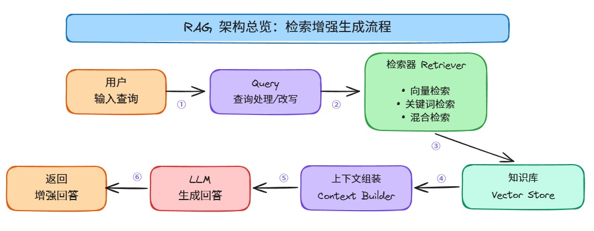
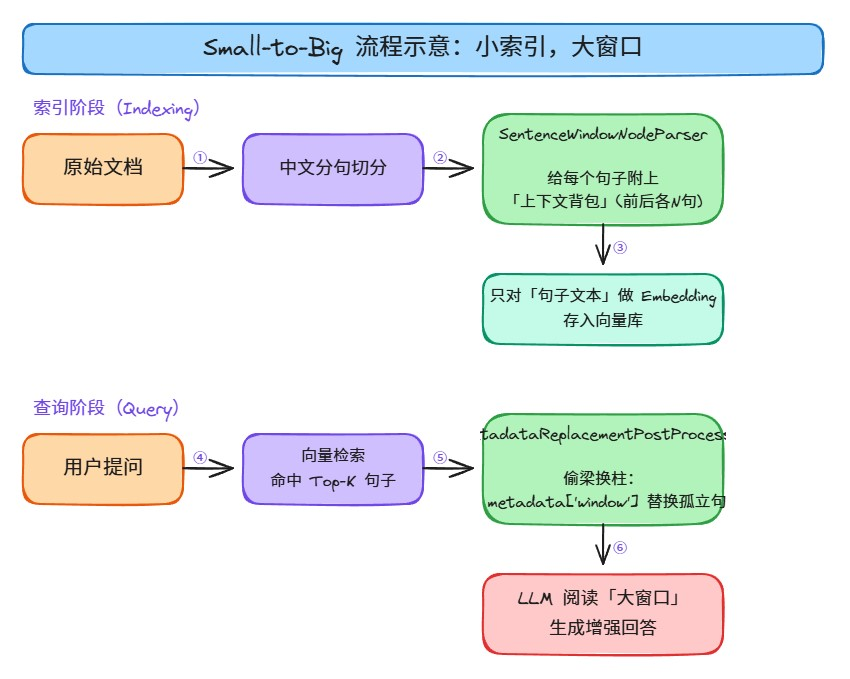
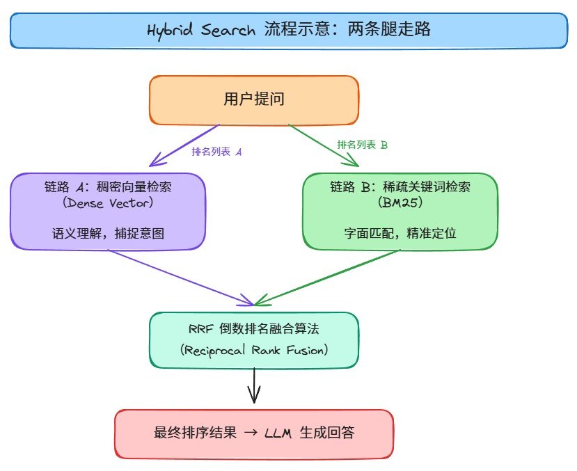
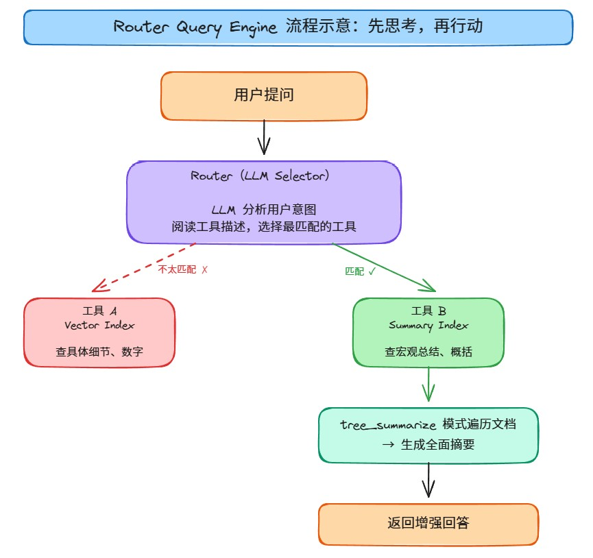
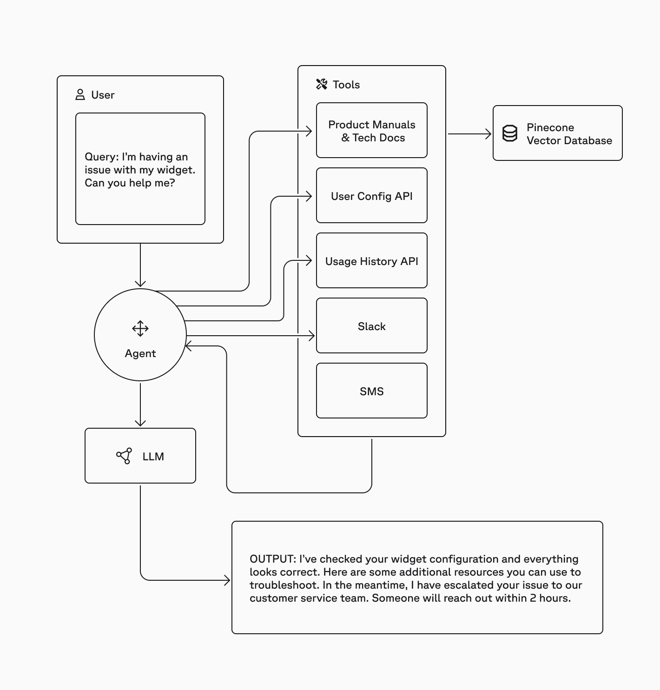

> 本文是笃行智元 AI 大模型技术社区「RAG 检索增强生成」系列的第 6 篇。
>
> 从传统 RAG 的三大瓶颈出发，深入讲解 LlamaIndex 提供的三种进阶检索策略：Small-to-Big（小索引大窗口）、Hybrid Search（混合检索）、Router Query Engine（智能路由检索），每种策略均包含原理剖析、完整代码实现和效果对比。
>
> 前置阅读：[01-RAG技术体系全景](./01-RAG技术体系全景.md) | [02-多模态RAG快速搭建](./02-多模态RAG快速搭建.md)

---

## 一、传统 RAG 的局限性

### 1.1 为什么 Top-K 检索不够用

传统 RAG（Naive RAG）架构的流程非常直接：将文档切分成固定大小的 Chunk → 计算 Embedding 向量 → 根据余弦相似度检索 Top-K 个片段 → 送入 LLM 生成回答。

这种"一刀切"的模式在处理复杂业务文档时面临三大挑战：

| 挑战 | 表现 | 根因 |
|------|------|------|
| **精度与上下文的矛盾** | 切片太小 → 检索精准但上下文支离破碎；切片太大 → 上下文完整但噪声多、匹配度下降 | Chunk 粒度无法同时满足"检索精度"和"生成质量"两个目标 |
| **语义与字面的盲区** | 向量检索擅长语义匹配（"请假"≈"休假"），但对精确实体（人名"周云杰"、缩写"ROWE"、数字"200小时"）不敏感 | Embedding 模型对稀疏实体词的表征能力有限 |
| **缺乏宏观与微观判断** | 无论用户问"总结全文"还是"查某条款"，系统都只检索几个片段，用"管中窥豹"回答宏观问题 | 单一索引结构无法适配不同粒度的信息需求 |

### 1.2 三种破局策略

LlamaIndex 针对上述三个痛点，提供了三种进阶检索策略：

| 策略 | 核心思想 | 解决的痛点 | 关键 API |
|------|----------|-----------|----------|
| **Small-to-Big** | 检索粒度与生成粒度分离 | 精度 vs 上下文的矛盾 | `SentenceWindowNodeParser` + `MetadataReplacementPostProcessor` |
| **Hybrid Search** | 向量语义 + BM25 关键词双路召回 | 语义 vs 字面的盲区 | `QueryFusionRetriever` + `BM25Retriever` |
| **Router Query** | LLM 驱动的索引路由分发 | 宏观 vs 微观的判断力 | `RouterQueryEngine` + `LLMSingleSelector` |



### 1.3 开发环境准备

在开始之前，确保已安装以下依赖：

```bash
# 核心框架
pip install llama-index==0.14.22 llama-index-core llama-index-llms-ollama llama-index-embeddings-ollama

# 向量数据库（本教程使用 Milvus）
pip install llama-index-vector-stores-milvus pymilvus

# BM25 检索器（混合检索必需）
pip install rank-bm25
# 也可使用 LlamaIndex 官方集成包：pip install llama-index-retrievers-bm25

# 文档解析
pip install PyPDF2

# 中文分词（混合检索的 BM25 需要）
pip install jieba
```

**基础配置代码：**

```python
from llama_index.core import Settings
from llama_index.llms.ollama import Ollama
from llama_index.embeddings.ollama import OllamaEmbedding

# 配置 LLM（使用本地 Ollama）
Settings.llm = Ollama(
    model="qwen3:latest",           # 替换为你本地的模型
    base_url="http://localhost:11434",
    request_timeout=120.0,
)

# 配置 Embedding 模型
Settings.embed_model = OllamaEmbedding(
    model_name="bge-m3",            # 1024 维，中英文支持优秀
    base_url="http://localhost:11434",
)
```

> **版本说明**：LlamaIndex 更新频率极高（v0.10 → v0.14 有大量 API 变更）。本文代码基于 v0.14.x 编写，所有 API 类名和 import 路径均经过验证。若使用旧版（v0.10.x/v0.12.x），部分参数可能需要调整，详见各章节的版本兼容性注释。

---

## 二、Small-to-Big：小索引，大窗口

### 2.1 核心原理

**Small-to-Big**（又称 Sentence Window Retrieval）的核心思想是：**将用于"搜索"的数据与用于"给 LLM 看"的数据分离开来。**

- **小索引（Small Index for Retrieval）**：将文档切分为极细颗粒度的**单句**，向量库存储的是单句的 Embedding。检索时，问题与最相关的单句产生高精度匹配，最大程度减少噪声干扰。
- **大窗口（Big Window for Generation）**：单句往往缺乏上下文（例如"否则将被解雇"，不知道"否则"指什么）。因此切分时，会预先将该句子**前后相邻的 N 句话**作为元数据（Metadata）存储起来。
- **偷梁换柱（Metadata Replacement）**：检索到目标句子后，在发送给 LLM 之前，系统执行后处理——将孤立句子**替换**为预存的"大窗口"内容。

**流程示意：**



### 2.2 代码实现

**Step 1：自定义中文分词器**

LlamaIndex 的 `SentenceWindowNodeParser` 默认按英文句号 `.` 断句。直接处理中文文档时，解析器会把整篇几千字的文档当成**一整句话**，导致检索精度归零并撑爆 Embedding 模型的 Token 限制。

```python
import re

# 中文分句函数：按中文句号、问号、感叹号、换行符切分
# 使用后向断言（Lookbehind）保留标点在句子末尾
chinese_sentence_split = lambda text: [
    s.strip() for s in re.split(r'(?<=[。？！\n])', text) if s.strip()
]
```

> `(?<=[。？！\n])` 是正则的后向断言，意思是"在句号/问号/感叹号/换行符**后面**切一刀"，标点符号保留在原句中，不会被切掉。

**Step 2：定义窗口解析器**

```python
from llama_index.core.node_parser import SentenceWindowNodeParser

# 创建句子窗口解析器
node_parser = SentenceWindowNodeParser.from_defaults(
    window_size=3,                  # 前后各取 3 句，共 7 句打包
    window_metadata_key="window",   # 大窗口内容存入 metadata['window']
    original_text_metadata_key="original_text",  # 保留原始单句
)
```

- **`window_size=3`**：切分出第 N 句时，同时把 [N-3, N-2, N-1, N, N+1, N+2, N+3] 共 7 句话打包存入 metadata
- **`window_metadata_key="window"`**：打包好的"7句话大窗口"存入 `metadata['window']` 字段

**Step 3：加载文档并切分**

```python
from llama_index.core import Document

# 读取 PDF 文档
from PyPDF2 import PdfReader

def load_pdf(pdf_path):
    reader = PdfReader(pdf_path)
    text = ""
    for page in reader.pages:
        text += page.extract_text()
    return text

raw_text = load_pdf("./员工手册.pdf")
documents = [Document(text=raw_text)]

# 使用窗口解析器切分文档
nodes = node_parser.get_nodes_from_documents(documents)
print(f"切分为 {len(nodes)} 个句子节点")
print(f"第 1 个节点文本: {nodes[0].text[:50]}...")
print(f"第 1 个节点窗口: {nodes[0].metadata['window'][:100]}...")
```

> **关键点**：此时向量化的是 `node.text`（单句），而不是"大窗口"。这保证了检索的极致精准度。

**Step 4：构建索引与查询引擎**

```python
from llama_index.core import VectorStoreIndex
from llama_index.core.postprocessor import MetadataReplacementPostProcessor

# 用句子节点构建向量索引
sentence_index = VectorStoreIndex(nodes)

# 构建查询引擎
sentence_window_engine = sentence_index.as_query_engine(
    similarity_top_k=5,             # 细粒度检索，取 Top-5
    node_postprocessors=[
        MetadataReplacementPostProcessor(
            target_metadata_key="window"  # 用 metadata['window'] 替换 node.text
        ),
    ],
)
```

**`MetadataReplacementPostProcessor` 的工作流程：**

| 阶段 | 处理内容 | 说明 |
|------|----------|------|
| 检索时 | 用问题匹配**单句** | 向量库中存储的是单句的 Embedding |
| 命中后 | 检查每个命中节点的 `metadata` | 找到 `metadata['window']` |
| 替换 | 用"大窗口"**覆盖** `node.text` | 从孤立句子变成包含上下文的 7 句话 |
| 生成时 | LLM 阅读**大窗口**内容 | 获得完整上下文，回答更准确 |

### 2.3 效果对比

**测试场景：企业员工手册问答**

**Q1：如果这个月迟到了 4 次，会受到什么样的具体处理？如果连续 3 天没打卡呢？**

| 方案 | 回答 |
|------|------|
| 普通 RAG（Baseline） | 如果这个月迟到了4次，将会由主管进行面谈。如果连续3天未打卡，将被视为严重违纪，并启动正式调查程序。 |
| Small-to-Big | 如果这个月迟到了 4 次，你将由主管进行面谈。若连续 3 天未打卡，将被视为严重违纪，并启动正式调查程序。 |

**Q2：周末和春节都来公司加班，工资分别怎么算？一年最多能加多少小时班？**

| 方案 | 回答 |
|------|------|
| 普通 RAG（Baseline） | 公司不强制安排无偿加班……具体的金额和计算方式未在手册中详细说明。至于一年最多能加多少小时班以及是否有封顶，手册中并未提供相关信息。 |
| Small-to-Big | 周末加班的工资是按基本工资的**2倍**补偿，或者可以选择以调休形式折算。春节属于法定节假日，加班工资按基本工资的**3倍**支付。年度个人加班时间最多为**200小时**，超过部分需要部门总监审批并报备HR。 |

> **差异分析**：普通 RAG 检索到的片段恰好不包含加班工资的具体数字，而 Small-to-Big 通过"大窗口"扩展，让 LLM 能看到包含数字的上下文段落。

**Q3：试用期想请半个月（15天）的假，会影响转正吗？**

| 方案 | 回答 |
|------|------|
| 普通 RAG（Baseline） | 如果您有正当理由，可以向人力资源部门申请假期。请假是否会影响转正，通常取决于公司的具体政策。 |
| Small-to-Big | 在试用期内，你可以请假。然而，如果累计请假超过**10个工作日**，试用期考核结果可能会受到影响。因此，请半个月（15天）的假可能会影响你的转正。 |

### 2.4 适用场景与注意事项

| 项目 | 说明 |
|------|------|
| **最佳场景** | 法律条款查询、规章制度细节问答、合同条款检索 |
| **window_size 选择** | 3 是常用值。太大 → 噪声增加；太小 → 上下文不足 |
| **similarity_top_k** | 因为检索的是细粒度句子，通常需要 Top-5 甚至更高 |
| **局限性** | 对需要全文理解的宏观问题（如"总结全文"）效果有限——这正是 Router 策略要解决的 |

---

## 三、Hybrid Search：混合检索

### 3.1 核心原理

纯向量检索存在一个致命的**"语义盲区"**：对精确匹配（Exact Match）极不敏感。

- 搜"Error 503"→ 向量模型返回一堆"意思相近"的错误描述，而非包含"503"的具体文档
- 搜人名"周云杰"→ 向量模型不理解这是一个专有名词，返回无关结果
- 搜缩写"ROWE"→ 向量模型可能匹配到任何包含"row"的文本

**混合检索（Hybrid Search）** 主张"两条腿走路"：




> ▲ 混合检索架构：稠密向量检索与稀疏 BM25 检索通过 RRF 融合（来源：Qdrant）

**双路检索对比：**

| 链路 | 机制 | 强项 | 弱项 | 角色 |
|------|------|------|------|------|
| **A：稠密向量（Dense）** | Embedding 模型将文本转为高维向量，计算余弦相似度 | 模糊查询、概念关联、同义词匹配 | 精确实体、专有名词、数字 | "懂你什么意思" |
| **B：稀疏 BM25** | 基于 TF-IDF 演进的 BM25 算法，计算词频与逆文档频率 | 生僻词、专有名词、精确数字、缩写 | 语义理解、同义词 | "精准定位字面" |

**融合机制：RRF（Reciprocal Rank Fusion）**

RRF 是目前业界最流行的无监督融合算法。它不看分数（BM25 分数和向量余弦分数无法直接比较），而是看**排名**：

> RRF_score(d) = Σ 1 / (k + r(d))
>
> 其中 r(d) 是文档 d 在检索器 r 中的排名，k 是常数（通常取 60）。

如果一个文档在向量检索排第 1、在关键词检索也排第 1，它的 RRF 得分会极高；如果只在单路出现，权重则会降低。

**举例说明：**

| 文档 | 向量检索排名 | BM25 排名 | RRF 得分 = 1/(60+rank1) + 1/(60+rank2) | 最终排名 |
|------|------------|----------|---------------------------------------|---------|
| 文档 A | 1 | 1 | 1/61 + 1/61 = 0.0328 | **第 1** |
| 文档 B | 1 | 无 | 1/61 + 0 = 0.0164 | 第 2 |
| 文档 C | 无 | 1 | 0 + 1/61 = 0.0164 | 第 2 |
| 文档 D | 3 | 2 | 1/63 + 1/62 = 0.0320 | 第 3 |

### 3.2 代码实现

**Step 1：自定义中文分词器**

BM25 需要对中文文本进行分词，否则会把一整句中文当成一个长单词，无法匹配关键词。

```python
import jieba

def chinese_tokenizer(text: str) -> list[str]:
    """中文分词器：使用 jieba 进行中文分词"""
    return list(jieba.cut(text))
```

**Step 2：加载文档并构建索引**

```python
from llama_index.core import VectorStoreIndex, SimpleDirectoryReader

# 加载文档
documents = SimpleDirectoryReader(input_files=["./员工手册.pdf"]).load_data()

# 构建向量索引（用于链路 A）
vector_index = VectorStoreIndex.from_documents(documents)
```

**Step 3：创建双路检索器**

```python
from llama_index.core.retrievers import BM25Retriever, VectorIndexRetriever

# 链路 A：向量检索器（"脑子"——理解语义）
vector_retriever = VectorIndexRetriever(
    index=vector_index,
    similarity_top_k=5,
)

# 链路 B：BM25 检索器（"眼睛"——盯着字面）
bm25_retriever = BM25Retriever.from_defaults(
    nodes=vector_index.docstore.docs.values(),
    similarity_top_k=5,
    tokenizer=chinese_tokenizer,     # 必须传入中文分词器！
)
```

**Step 4：构建混合检索引擎**

```python
from llama_index.core.retrievers import QueryFusionRetriever
from llama_index.core.query_engine import RetrieverQueryEngine

# 融合检索器：双路召回 + RRF 融合
hybrid_retriever = QueryFusionRetriever(
    retrievers=[vector_retriever, bm25_retriever],
    similarity_top_k=5,              # 最终返回 Top-5
    num_queries=1,                   # 不做 Query Rewrite（直接用原始查询）
    mode="reciprocal_rank",          # RRF 融合模式
    use_async=False,
)

# 构建查询引擎
hybrid_engine = RetrieverQueryEngine(retriever=hybrid_retriever)
```

> **版本兼容性说明**：在 v0.14.x 中，`mode="reciprocal_rank"` 字符串形式直接可用。若使用 v0.10.x 旧版，`FusionMode` 为严格枚举类型，需改为 `mode=FusionMode.RECIPROCAL_RANK`（从 `llama_index.core.retrievers.fusion_retriever` 导入）。

**Step 5：测试**

```python
# 测试精确实体查询（BM25 的优势场景）
response = hybrid_engine.query("请问法务合规部的负责人是谁？邮箱是多少？")
print(response)
```

### 3.3 效果对比

**Q1：法务合规部的负责人是谁？邮箱是多少？**

| 方案 | 回答 |
|------|------|
| 普通 RAG（Vector Only） | 抱歉，无法提供法务合规部负责人的姓名和邮箱信息。建议您通过公司内部通讯录获取。 |
| Hybrid Search | 法务合规部的负责人是**周云杰**，您可以通过邮箱 legal@innovatech.cn 联系他。 |

> **差异分析**：人名"周云杰"是一个稀疏实体词，向量检索几乎无法捕捉。BM25 通过关键词精确匹配，直接定位到包含"周云杰"的文档段落。

**Q2：公司关于 BYOD（自带设备）的具体政策要求是什么？**

| 方案 | 回答 |
|------|------|
| 普通 RAG | 自带设备需要提前登记备案，并通过加密配置。 |
| Hybrid Search | 自带设备需提前登记备案，并通过加密配置，以确保安全性。（差异不大，因为"BYOD"在两种检索中都能命中） |

**Q3：听说有个'ROWE'工作制，具体需要满足哪些硬性条件才能申请？**

| 方案 | 回答 |
|------|------|
| 普通 RAG | （可能返回泛泛的"弹性工作制"描述） |
| Hybrid Search | 任职时间不少于一年，过往绩效为"良好"以上，能够独立承担项目任务并具备自我管理能力，以及已签署《ROWE工作协议》，明确目标设定与交付周期。 |

**Q4：公司有没有专门支持女性发展的组织？准确名称叫什么？**

| 方案 | 回答 |
|------|------|
| 普通 RAG | 公司内部有专门支持女性发展的组织，准确名称是 Women@Innovation。 |
| Hybrid Search | 公司内部有专门支持女性发展的组织，准确名称是 "Women@Innovation"。（两种方案都能回答，因为"女性发展"语义匹配足够强） |

### 3.4 适用场景与注意事项

| 项目 | 说明 |
|------|------|
| **最佳场景** | 医疗病历检索、法律文书检索、企业内部行政文档、包含大量专有名词的技术文档 |
| **必须安装** | `pip install rank-bm25`（BM25 检索器依赖） |
| **中文必须** | BM25 检索器必须传入 `tokenizer=chinese_tokenizer`，否则中文匹配失效 |
| **num_queries** | 设为 1 表示不做 Query Rewrite；设为 > 1 时系统会用 LLM 生成多个改写查询，分别检索后融合，效果更好但耗时更长 |

---

## 四、Router Query Engine：智能路由检索

### 4.1 核心原理

传统 RAG 存在一个**"宏观与微观的冲突"**：

- 为了回答"总结全文"而设大 Top-K → 查细节时浪费算力
- 为了快速查细节而用小 Top-K → 做总结时"管中窥豹"

**智能路由（Router Query Engine）** 标志着 RAG 系统从"自动化"向 **Agent（智能体）** 迈出关键一步——它学会了**"先思考，再行动"**。





> ▲ Router 架构：LLM 分析用户意图，动态选择最合适的检索工具（来源：Pinecone）

**两种索引的分工：**

| 索引类型 | 擅长 | 检索方式 | 典型问题 |
|----------|------|----------|----------|
| **VectorStoreIndex** | 点对点细节查询 | 向量相似度 Top-K | "某项补贴多少钱？""迟到几次会被约谈？" |
| **SummaryIndex** | 全文宏观总结 | 遍历全文，树状摘要 | "总结全文核心思想""列出所有章节" |

### 4.2 代码实现

**Step 1：构建两种索引**

```python
from llama_index.core import VectorStoreIndex, SummaryIndex

# 加载文档
documents = SimpleDirectoryReader(input_files=["./员工手册.pdf"]).load_data()

# 索引 A：向量索引（擅长查细节）
vector_index = VectorStoreIndex.from_documents(documents)

# 索引 B：摘要索引（擅长做总结）
summary_index = SummaryIndex.from_documents(documents)
```

**Step 2：封装为工具**

在 Router 模式下，索引不能直接被路由，必须先封装为 `QueryEngineTool`。

```python
from llama_index.core.tools import QueryEngineTool

# 工具 A：向量查询工具
vector_tool = QueryEngineTool.from_defaults(
    query_engine=vector_index.as_query_engine(similarity_top_k=3),
    description=(
        "用于查询文档中的具体细节信息，包括数字、金额、条款、"
        "人名、部门名称、具体规定等。适合回答'多少钱'、"
        "'谁负责'、'具体条件是什么'等微观问题。"
    ),
    name="vector_detail_tool",
)

# 工具 B：摘要查询工具
summary_tool = QueryEngineTool.from_defaults(
    query_engine=summary_index.as_query_engine(
        response_mode="tree_summarize",  # 树状总结模式
    ),
    description=(
        "用于对文档进行宏观总结和概览，包括列出章节结构、"
        "概括核心内容、总结主要政策方向等。适合回答'总结全文'、"
        "'有哪些章节'、'整体策略是什么'等宏观问题。"
    ),
    name="summary_overview_tool",
)
```

> **`description` 是写给 AI 看的 Prompt**：Router 内部的 LLM 会阅读这段文字来判断"这个工具是干嘛的"。描述写得越精准，路由准确率越高。

**Step 3：构建路由引擎**

```python
from llama_index.core.query_engine import RouterQueryEngine
from llama_index.core.selectors import LLMSingleSelector

# 构建路由查询引擎
router_engine = RouterQueryEngine(
    selector=LLMSingleSelector.from_defaults(),  # LLM 选择器：二选一
    query_engine_tools=[vector_tool, summary_tool],
    verbose=True,                                  # 开启调试模式，查看路由决策
)
```

- **`LLMSingleSelector`**：LLM 阅读问题和工具描述，输出一个最佳工具。也有 `LLMMultiSelector` 可同时选择多个工具。
- **`verbose=True`**：调试时在控制台看到 `Selecting query engine 0: ...` 等路由决策信息。

**Step 4：测试**

```python
# 测试 1：宏观问题 → Router 应选择 Summary 工具
response = router_engine.query("这份员工手册主要包含了哪几个章节？请列出目录结构。")
print(response)

# 测试 2：微观问题 → Router 应选择 Vector 工具
response = router_engine.query("公司的健身房补贴每年最高是多少钱？")
print(response)
```

### 4.3 效果对比

**Q1：这份员工手册主要包含了哪几个章节？请简要列出目录结构。**

| 方案 | 回答 |
|------|------|
| 普通 RAG（Top-2 Vector） | 列出了 4 个章节：制度与流程、法律与政策依据、专有名词释义、修订记录。内容片面，遗漏大量章节。 |
| Router（Summary） | 完整列出了 7 个章节：公司概述、员工行为准则、工作时间与出勤、薪酬与福利、绩效评估、纪律与惩戒、健康与安全。每个章节有简要主题概括。 |

> **差异分析**：普通 RAG 只检索到 2 个片段，碰巧命中的是附录部分。Router 判断这是宏观问题，将任务分发给 SummaryIndex，遍历全文生成了完整目录。

**Q2：请详细总结公司的核心价值观以及 D&I 策略。**

| 方案 | 回答 |
|------|------|
| 普通 RAG（Top-2 Vector） | 核心价值观：尊重差异、公平发展、包容共创。（内容偏少，仅覆盖部分价值观） |
| Router（Summary） | 核心价值观：创新、诚信、协作、卓越、责任。D&I 策略包括消除招聘偏见、确保薪酬公平、提供无障碍支持、设立员工资源小组等。（覆盖全面） |

**Q3：健身房补贴每年最高多少钱？**

| 方案 | 回答 |
|------|------|
| 普通 RAG（Top-2 Vector） | 2000 元。 |
| Router（Vector） | 2000 元。 |

> 两种方案对微观数字查询差异不大，Router 正确选择了 Vector 工具。

**Q4：试用期员工如果累计请假超过 10 天，会有什么具体后果？**

| 方案 | 回答 |
|------|------|
| 普通 RAG（Top-2 Vector） | 可能包括影响试用期的考核结果，延长试用期。（不确定，含糊其辞） |
| Router（Vector） | 在提供的信息中没有详细说明。（诚实回答，但不如 Small-to-Big 策略精准） |

> **注意**：Router 解决的是"宏观 vs 微观"的路由问题，不解决"精度 vs 上下文"的问题。对于需要精确细节+完整上下文的场景，建议将 Router 与 Small-to-Big 或 Hybrid Search 组合使用。

### 4.4 适用场景与注意事项

| 项目 | 说明 |
|------|------|
| **最佳场景** | 企业知识库、复杂多意图问答系统、既需要查细节又需要做总结的场景 |
| **description 重要性** | 工具的 `description` 直接决定路由准确率，务必写清楚每个工具的擅长场景 |
| **selector 选择** | `LLMSingleSelector`（单选）vs `LLMMultiSelector`（多选）。大多数场景用单选即可 |
| **verbose 模式** | 开发调试时务必开启，确认 Router 的决策逻辑是否正确 |
| **局限性** | 增加了一次 LLM 调用（路由决策），延迟略增；路由错误会导致答案质量下降 |

---

## 五、三种策略对比与选型

| 维度 | Small-to-Big | Hybrid Search | Router Query |
|------|-------------|---------------|--------------|
| **核心思想** | 检索粒度与生成粒度分离 | 语义 + 字面双路召回 | LLM 驱动的索引路由 |
| **解决痛点** | 精度 vs 上下文 | 语义 vs 字面 | 宏观 vs 微观 |
| **检索次数** | 1 次 | 2 次（并行） | 1 次（路由后） |
| **额外 LLM 调用** | 无 | 无（或 Query Rewrite 时有） | 1 次（路由决策） |
| **延迟影响** | 低 | 中（双路检索 + 融合） | 中（路由 + 检索） |
| **最佳搭配** | 精确条款查询 | 专有名词密集文档 | 多意图复杂问答 |
| **可组合性** | 可与 Hybrid 组合 | 可与 Small-to-Big 组合 | 可将前两者封装为工具 |

**组合使用建议：**

```
Router Query Engine
├── 工具 1：Small-to-Big + Hybrid Search（细节查询）
│   ├── BM25 Retriever（字面匹配）
│   └── Sentence Window Retriever（语义匹配 + 大窗口扩展）
└── 工具 2：Summary Index + tree_summarize（宏观总结）
```

这种组合能同时解决三个痛点：Router 解决宏观 vs 微观，Hybrid 解决语义 vs 字面，Small-to-Big 解决精度 vs 上下文。

---

## 六、进阶方向

### 6.1 Query Rewrite（查询改写）

`QueryFusionRetriever` 的 `num_queries` 参数设为 > 1 时，系统会用 LLM 将原始查询改写为多个变体，分别检索后融合。例如：

- 原始查询："公司有哪些福利？"
- 改写 1："员工福利待遇包括哪些？"
- 改写 2："薪酬福利体系是什么？"
- 改写 3："公司提供的补贴和津贴有哪些？"

多个变体分别检索，再通过 RRF 融合，能显著提升召回率。

### 6.2 Reranker（重排序）

在检索后、生成前加入 Reranker（如 Cohere Rerank、bge-reranker-v2），对 Top-K 结果进行精排，进一步提升相关性。LlamaIndex 提供了 `SentenceTransformerRerank` 等后处理器。

### 6.3 Auto-Merging Retrieval（自动合并检索）

与 Small-to-Big 类似但更自动化：将文档按层级切分（如 2048 → 512 → 128 字符），检索小块后自动合并为父块。LlamaIndex 提供了 `AutoMergingRetriever`。

### 6.4 最新模型推荐（2026 年 RAG 场景）

| 模型 | 类型 | 上下文窗口 | 特点 |
|------|------|-----------|------|
| **Gemini 3.5 Flash** | 闭源 | 1M+ | Google I/O 2026 发布，专为 Agent 和编码优化；3.5 Pro 即将推出 |
| **Claude Opus 4.7** | 闭源 | 200K | Anthropic 2026 年 4 月发布，软件工程和视觉理解能力大幅提升 |
| **DeepSeek V4** | 开源 | 1M | 2026 年 4 月发布，V4-Pro 和 V4-Flash 两个变体，DSA 稀疏注意力机制，Agent 能力开源 SOTA |
| **Qwen3** | 开源 | 128K | 阿里 2025 年 4 月发布，旗舰 Qwen3-235B-A22B（MoE），Apache 2.0 开源 |
| **GLM-5** | 开源 | - | 智谱 AI，专为 Agent 工程设计，SWE-bench Verified 开源 SOTA |

> **选型建议**：闭源首选 Gemini 3.5 Flash（性价比+长上下文）或 Claude Opus 4.7（复杂推理）；开源首选 DeepSeek V4-Pro（综合能力最强）或 Qwen3（中文场景最优）。
