# 12个RAG常见痛点及解决方案

> 基于 Barnett 等人论文《Seven Failure Points When Engineering a Retrieval Augmented Generation System》及实践经验总结

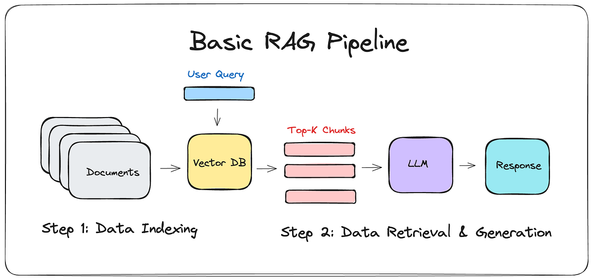

---

## 一、内容缺失

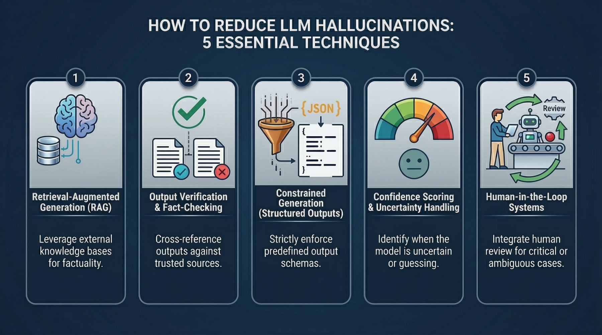

### 痛点

知识库里压根没有答案，但模型还是硬着头皮编了一个看起来像模像样的回答。这在线上很要命——用户拿到错误信息，信任感直接归零。

### 解决方案

#### 1. 提示词里加个"保底条款"

让模型知道：不知道就直说，别瞎编。

```python
from llama_index.llms import OpenAI

# 在 system prompt 里明确声明
system_prompt = """
你是一个严谨的 AI 助手。如果你不确定答案，请直接说"我不知道"或"我无法从已知信息中找到答案"，不要编造。
"""

llm = OpenAI(model="gpt-4", system_prompt=system_prompt)
query_engine = index.as_query_engine(llm=llm)
response = query_engine.query("2025年诺贝尔物理学奖得主是谁？")
print(response)
```

#### 2. 数据质量是第一道关

再好的 RAG 管道也救不了垃圾数据。建议在数据入库前做一轮清洗：

```python
# 数据预处理：去重 + 冲突检测
import hashlib
from collections import defaultdict

def dedup_documents(documents):
    seen = set()
    deduped = []
    for doc in documents:
        content_hash = hashlib.md5(doc.text.encode()).hexdigest()
        if content_hash not in seen:
            seen.add(content_hash)
            deduped.append(doc)
    return deduped

def detect_conflicts(documents):
    """检测标题相似但内容矛盾的文档"""
    title_map = defaultdict(list)
    for doc in documents:
        title_map[doc.metadata.get("title", "unknown")].append(doc)
    
    conflicts = []
    for title, docs in title_map.items():
        if len(docs) > 1:
            contents = set(d.text[:200] for d in docs)
            if len(contents) > 1:  # 开头200字不一致，可能有冲突
                conflicts.append(title)
    return conflicts
```

---

## 二、错过了关键文档

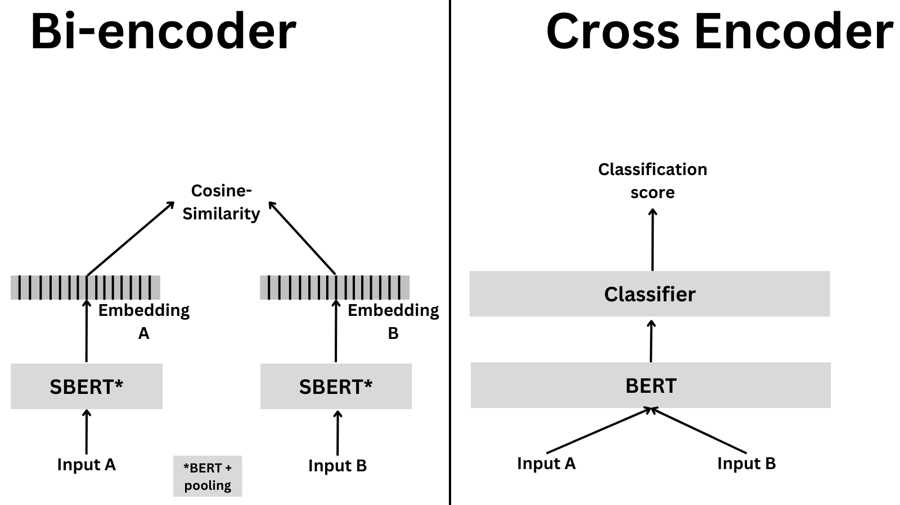

### 痛点

答案明明在库里，但排序不够靠前，被截断了。这就像考场上知识点你学过，但没翻到那一页。

### 解决方案

#### 1. chunk_size 和 top_k 调优

不要凭感觉设参数，用 Optuna 之类做自动调优：

```python
from llama_index.evaluation import RetrieverEvaluator
from llama_index.finetuning import EmbeddingAdaption
import optuna

def objective(trial):
    chunk_size = trial.suggest_int("chunk_size", 256, 1024, step=128)
    top_k = trial.suggest_int("top_k", 2, 10)
    
    nodes = SentenceSplitter(chunk_size=chunk_size).get_nodes_from_documents(docs)
    index = VectorStoreIndex(nodes)
    retriever = index.as_retriever(similarity_top_k=top_k)
    
    evaluator = RetrieverEvaluator.from_metric_names(
        ["hit_rate", "mrr"], retriever=retriever
    )
    eval_results = await evaluator.aevaluate_dataset(eval_dataset)
    
    # 组合指标：hit_rate * 0.7 + mrr * 0.3
    score = (
        eval_results["hit_rate"] * 0.7 + eval_results["mrr"] * 0.3
    )
    return score

study = optuna.create_study(direction="maximize")
study.optimize(objective, n_trials=20)
print(f"最佳参数: chunk_size={study.best_params['chunk_size']}, top_k={study.best_params['top_k']}")
```

#### 2. Reranking

先取前 N 个，重排序后再送 LLM：

```python
from llama_index.postprocessor.cohere_rerank import CohereRerank

# 先多取一点（top_k=10），再精排取 top 2
cohere_rerank = CohereRerank(api_key=api_key, top_n=2)

query_engine = index.as_query_engine(
    similarity_top_k=10,
    node_postprocessors=[cohere_rerank],
)

response = query_engine.query("What did Sam Altman do in this essay?")
```

也可以用 bge-reranker 这类开源模型：

```python
from llama_index.postprocessor import SentenceTransformerRerank

rerank = SentenceTransformerRerank(
    model="BAAI/bge-reranker-v2-m3",
    top_n=3,
)

query_engine = index.as_query_engine(
    similarity_top_k=15,
    node_postprocessors=[rerank],
)
```

---

## 三、整合策略局限性导致上下文冲突

### 痛点

文档检索到了，但整合进上下文时被"挤掉"了。明明正确答案就在那几篇文档里，最后 LLM 看到的却是干扰信息。

### 解决方案

#### 1. 根据场景选检索策略

LlamaIndex 提供了不同层级的策略，做个对比选择：

```python
from llama_index.indices.service_context import ServiceContext
from llama_index.retrievers import (
    BaseRetriever,
    RouterRetriever,
    KGTableRetriever,
)

# 简单场景：基础检索
retriever = index.as_retriever()

# 复杂场景：分层检索（先粗后细）
from llama_index.retrievers import RecursiveRetriever

recursive_retriever = RecursiveRetriever(
    retriever_dict={"vector": retriever, "summary": summary_retriever},
    query_mapping={"vector": "How does this work?", "summary": "What is this about?"},
)
```

#### 2. 微调嵌入模型

开源嵌入模型在通用场景不错，但在你的垂直领域可能表现一般。试试微调：

```python
from llama_index.finetuning import EmbeddingAdapterFinetuneEngine
from llama_index.embeddings import resolve_embed_model

base_embed_model = resolve_embed_model("local:BAAI/bge-small-zh-v1.5")

finetune_engine = EmbeddingAdapterFinetuneEngine(
    base_embed_model=base_embed_model,
    dataset=train_dataset,
    batch_size=32,
    epochs=3,
)

finetune_engine.finetune()
fine_tuned_model = finetune_engine.get_finetuned_model()

# 微调后替换嵌入模型
index = VectorStoreIndex.from_documents(
    documents,
    embed_model=fine_tuned_model,
)
```

---

## 四、没有获取到正确的内容

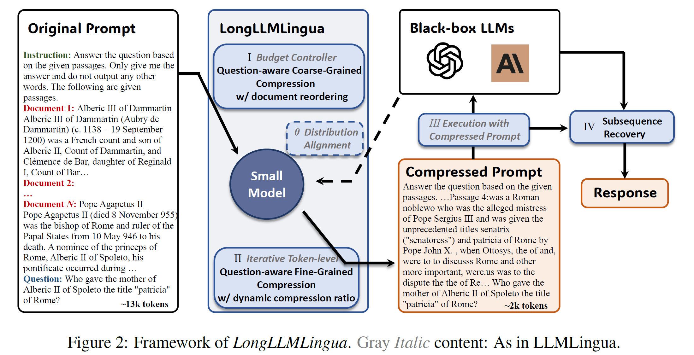

### 痛点

上下文里信息太多，模型像走迷宫——关键细节被噪声淹没了。

### 解决方案

#### 1. 提示压缩（LongLLMLingua）

```python
from llama_index.postprocessor import LongLLMLinguaPostprocessor

# 安装: pip install llmlingua
node_postprocessor = LongLLMLinguaPostprocessor(
    instruction_str="请从以下上下文中提取关键信息回答问题",
    target_token=300,          # 压缩到多少 token
    rank_method="longllmlingua",
    additional_compress_kwargs={
        "condition_compare": True,
        "condition_in_question": "after",
    },
)

query_engine = index.as_query_engine(
    similarity_top_k=10,
    node_postprocessors=[node_postprocessor],
)
```

#### 2. LongContextReorder

解决"中间丢失"——模型对开头和结尾的内容更敏感：

```python
from llama_index.postprocessor import LongContextReorder

# 不需要额外参数，开箱即用
reorder = LongContextReorder()

query_engine = index.as_query_engine(
    similarity_top_k=15,
    node_postprocessors=[reorder],
)
```

---

## 五、格式错误

### 痛点

你让它输出 JSON 表格，它给你来一段散文。prompt 里写了八百遍"请严格按照格式"，它当没看见。

### 解决方案

#### 1. 输出解析器

别依赖模型的自觉，用代码强制约束：

```python
from llama_index.output_parsers import LangchainOutputParser
from langchain.output_parsers import StructuredOutputParser, ResponseSchema

# 定义输出 schema
response_schemas = [
    ResponseSchema(name="title", description="文章标题"),
    ResponseSchema(name="summary", description="文章摘要，不超过50字"),
    ResponseSchema(name="keywords", description="关键词列表，最多5个"),
    ResponseSchema(name="sentiment", description="情感倾向：positive/negative/neutral"),
]

lc_output_parser = StructuredOutputParser.from_response_schemas(response_schemas)
output_parser = LangchainOutputParser(lc_output_parser)

llm = OpenAI(output_parser=output_parser)
ctx = ServiceContext.from_defaults(llm=llm)

query_engine = index.as_query_engine(service_context=ctx)
response = query_engine.query("分析这篇文章的主要内容")
# 返回的是结构化的 dict
print(response.raw)
```

#### 2. OpenAI JSON 模式

更轻量的方案：

```python
from openai import OpenAI

client = OpenAI()

response = client.chat.completions.create(
    model="gpt-4o-mini",
    response_format={"type": "json_object"},
    messages=[
        {"role": "system", "content": "你是一个数据提取助手。请以 JSON 格式返回结果。"},
        {"role": "user", "content": f"从以下文本中提取：书名、作者、出版年份、分类\n\n{text}"},
    ],
)

import json
result = json.loads(response.choices[0].message.content)
print(f"书名: {result['书名']}")
```

#### 3. Pydantic

适合更复杂的嵌套结构：

```python
from pydantic import BaseModel
from typing import List, Optional

class Author(BaseModel):
    name: str
    affiliation: Optional[str] = None

class Paper(BaseModel):
    title: str
    authors: List[Author]
    year: int
    citations: int
    abstract: str
    keywords: List[str]

# 配合 llama_index 使用
from llama_index.program import OpenAIPydanticProgram

program = OpenAIPydanticProgram.from_defaults(
    output_cls=Paper,
    prompt_template_str="从以下论文信息中提取结构化数据：\n{input_text}",
)

result = program(input_text=paper_text)
print(f"论文标题: {result.title}")
print(f"作者数量: {len(result.authors)}")
```

---

## 六、答案模糊或笼统

### 痛点

问 "Transformer 的注意力机制是怎样的？"，它给你回了个"注意力机制是一种让模型关注重要信息的技术"——这回答跟没说一样。

### 解决方案

用高级检索策略来提升答案的精确度：

#### 句子窗口检索

```python
from llama_index.node_parser import SentenceWindowNodeParser

node_parser = SentenceWindowNodeParser.from_defaults(
    window_size=3,              # 每个句子前后各取3句作为上下文
    window_metadata_key="window",
    original_text_metadata_key="original_text",
)

index = VectorStoreIndex.from_documents(
    documents,
    node_parser=node_parser,
)

# 检索时取窗口而不是单句
query_engine = index.as_query_engine(
    similarity_top_k=5,
    node_postprocessors=[
        MetadataReplacementPostProcessor(target_metadata_key="window")
    ],
)
```

#### 混合检索（稠密 + 稀疏）

```python
from llama_index.retrievers import BM25Retriever
from llama_index.retrievers import VectorIndexRetriever
from llama_index.retrievers import FusionRetriever

# 同时使用向量检索和 BM25 关键词检索，再用 RRF 融合
vector_retriever = VectorIndexRetriever(index=index, similarity_top_k=5)
bm25_retriever = BM25Retriever.from_defaults(docs=documents, similarity_top_k=5)

fusion_retriever = FusionRetriever(
    retrievers=[vector_retriever, bm25_retriever],
    similarity_top_k=5,
    mode="reciprocal_rerank",  # RRF 融合排序
)

query_engine = RetrieverQueryEngine(fusion_retriever)
```

---

## 七、结果不完整

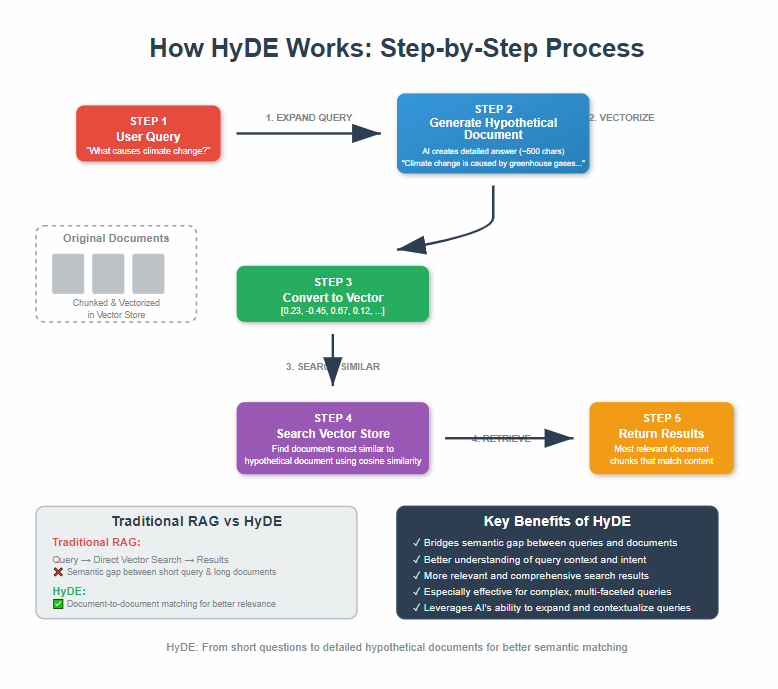

### 痛点

问的是"对比 A、B、C 三个方案的优劣"，它只分析了一个。不是不知道，而是忘了把其他几个拉进来。

### 解决方案

加一层**查询理解**，在实际检索之前先处理一下用户的问题。

#### 1. 查询重写（HyDE）

```python
from llama_index.indices.query.query_transform import HyDEQueryTransform

# HyDE：先根据问题生成一个"假设答案"，再用这个答案去检索
hyde = HyDEQueryTransform(include_original=True)

query_engine = index.as_query_engine(
    query_transform=hyde,
    similarity_top_k=5,
)

response = query_engine.query("对比 Transformer 和 LSTM 在处理长序列时的优缺点")
```

#### 2. 查询分解（子问题）

```python
from llama_index.question_gen import LLMQuestionGenerator
from llama_index.query_engine import SubQuestionQueryEngine

# 自动将复杂问题拆解为多个子问题
query_engine = SubQuestionQueryEngine.from_defaults(
    query_engine_tools=[query_engine_tool],
    question_gen=LLMQuestionGenerator.from_defaults(),
    use_async=True,
)

# 输入会自动拆解为：
# 1. Transformer 在处理长序列时的优缺点是什么？
# 2. LSTM 在处理长序列时的优缺点是什么？
# 3. 两者的对比分析
response = query_engine.query("对比 Transformer 和 LSTM 在处理长序列时的优缺点")
print(response)
```

---

> 以上7个痛点源自 Barnett 等人的论文。以下5个是我们在实际 RAG 开发中经常碰到的补充问题。

---

## 八、可扩展性

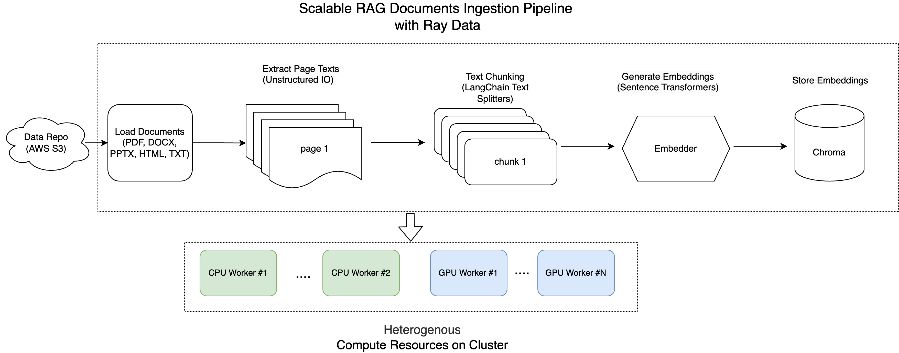

### 痛点

数据量一旦上来，从文档解析到向量入库，慢得让人怀疑人生。单线程处理10万份文档，能跑三天三夜。

### 解决方案

并行处理，别让机器闲着：

```python
from llama_index.ingestion import IngestionPipeline
from llama_index.node_parser import SentenceSplitter
from llama_index.extractors import TitleExtractor
from llama_index.embeddings import OpenAIEmbedding

pipeline = IngestionPipeline(
    transformations=[
        SentenceSplitter(chunk_size=1024, chunk_overlap=20),
        TitleExtractor(),
        OpenAIEmbedding(),
    ]
)

# num_workers > 1 即可并行处理，实测能提速 10-15 倍
nodes = pipeline.run(documents=documents, num_workers=8)
print(f"耗时: {pipeline.last_run_time:.2f}s，生成了 {len(nodes)} 个节点")
```

如果需要跨机器的分布式处理，可以用 Redis 做缓存：

```python
from llama_index.storage.docstore import RedisDocumentStore
from llama_index.ingestion import IngestionCache

cache = IngestionCache(
    cache_store=RedisDocumentStore.from_host_and_port(
        host="localhost", port=6379
    ),
}

pipeline = IngestionPipeline(
    transformations=[...],
    cache=cache,  # 已处理的文档自动跳过
)
```

---

## 九、结构化数据质量

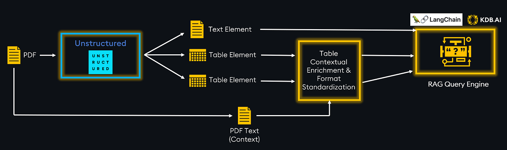

### 痛点

用户问"上季度华东区销售额最高的产品是什么"，文本转 SQL 搞不定，或者写出来的 SQL 是错的。表格数据不像文本那么好检索。

### 解决方案

#### ChainOfTable

让 LLM 像人一样"看表"——逐步切分、转换，而不是一把梭：

```python
from llama_index.packs import ChainOfTablePack

chain_of_table_pack = ChainOfTablePack.from_defaults(
    df=sales_dataframe,
    llm=llm,
)

response = chain_of_table_pack.run(
    "上季度华东区销售额前5的产品及其增长率是多少？"
)
print(f"SQL 推理路径: {response.metadata['chain_of_table_reasoning']}")
print(f"最终结果: {response.response}")
```

#### MixSelfConsistency

结合文本推理和符号推理，取众数投票：

```python
from llama_index.packs import MixSelfConsistencyPack

pack = MixSelfConsistencyPack(
    df=table_data,
    llm=llm,
    text_paths=5,       # 5 条文本推理路径
    symbolic_paths=5,    # 5 条符号推理路径
    aggregation_mode="self-consistency",
    verbose=True,
)

response = pack.run("2024年各季度营收对比，哪个季度增长率最高？")
print(response)
```

---

## 十、复杂PDF数据提取

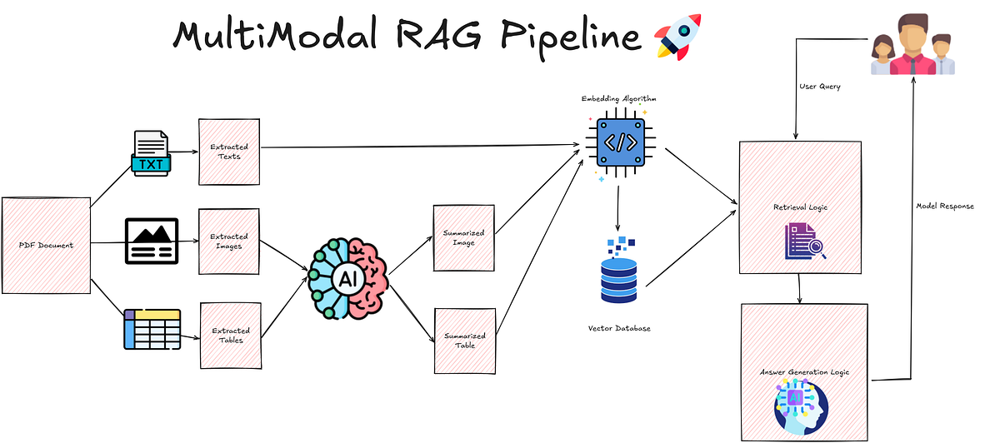

### 痛点

PDF 里的表格——尤其是跨页表格、合并单元格、嵌套表格——简直是 NLP 的噩梦。常规方法提取出来就成一团乱码。

### 解决方案

先转 HTML 再处理，比直接 OCR 靠谱得多：

```python
# 第一步：PDF 转 HTML（保留表格结构）
# 命令行: pdf2htmllex document.pdf -o output.html

# 第二步：用 LlamaIndex 处理 HTML 中的表格
from llama_index.packs import EmbeddedTablesUnstructuredRetrieverPack

pack = EmbeddedTablesUnstructuredRetrieverPack(
    "data/apple-10Q-Q2-2023.html",  # 已转好的 HTML
    nodes_save_path="apple-10-q.pkl",
)

response = pack.run("What's the total operating expenses?").response
print(response)
```

如果 PDF 是扫描件，先用 OCR 再转 HTML：

```python
# 配合 PaddleOCR 做扫描件处理
import subprocess

# 1. OCR 提取文字层
subprocess.run([
    "paddleocr",
    "--image_dir=scanned_report.pdf",
    "--output=ocr_output/",
    "--use_angle_cls=true",
    "--lang=ch",
])

# 2. 再用 marker-pdf 转 markdown
subprocess.run([
    "marker_pdf",
    "ocr_output/scanned_report.pdf",
    "--output_format=markdown",
    "--output_dir=./extracted/",
])
```

---

## 十一、备用模型（Fallback / Router）

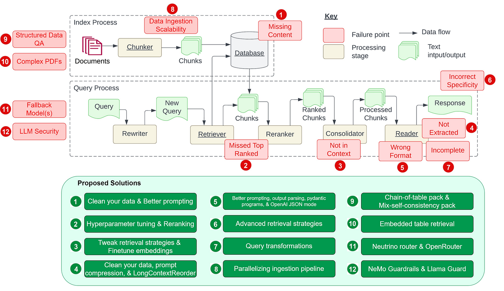

### 痛点

线上跑得好好的，OpenAI 突然给你报 rate limit 了。几千个用户等在那儿，你不能说"等会儿再来"。

### 解决方案

#### Neutrino Router

智能路由，自动选最合适的模型：

```python
from llama_index.llms import Neutrino

# 在 Neutrino dashboard 配置好 router
llm = Neutrino(
    api_key="<your-neutrino-api-key>",
    router="production-router",  # 可以配置优先级、成本上限等
)

# 用起来跟普通 LLM 一样
response = llm.complete("解释一下 RAG 是什么")
print(f"被选中的模型: {response.raw['model']}")
print(f"延迟: {response.raw['latency_ms']}ms")
```

#### OpenRouter

另一种选择——统一接口，自动比价：

```python
from llama_index.llms import OpenRouter

llm = OpenRouter(
    api_key="<your-openrouter-key>",
    max_retries=3,
    temperature=0.7,
)

# 支持按优先级降级：gpt-4 挂了自动降级到 claude-3.5
models = [
    "openai/gpt-4o",
    "anthropic/claude-3.5-sonnet",
    "google/gemini-pro-1.5",
    "meta-llama/llama-3.1-70b-instruct",  # 最后的保底
]

for model in models:
    try:
        llm.model = model
        response = llm.complete("用户的查询")
        break
    except Exception as e:
        print(f"{model} 挂了: {e}")
        continue
```

#### 最简单的本地 fallback

```python
def query_with_fallback(query_engine, query, fallback_llm=None):
    try:
        return query_engine.query(query)
    except Exception as e:
        print(f"主模型失败: {e}，切换到备用模型")
        if fallback_llm:
            return fallback_llm.complete(query)
        return "服务暂时不可用，请稍后再试。"
```

---

## 十二、LLM安全性

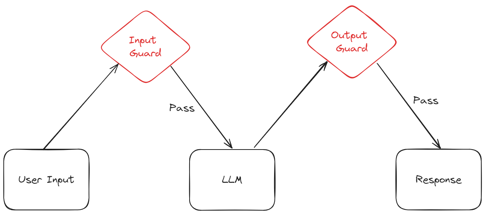

### 痛点

用户可能绕过系统指令问敏感问题，模型也可能产生不安全输出。生产环境中这是必须面对的合规问题。

### 解决方案

#### Llama Guard

输入输出双重审核：

```python
from llama_index.packs import LlamaGuardModeratorPack
import os

# 下载并初始化
LlamaGuardModeratorPack = download_llama_pack(
    llama_pack_class="LlamaGuardModeratorPack",
    download_dir="./llamaguard_pack",
)

os.environ["HUGGINGFACE_ACCESS_TOKEN"] = "<your-hf-token>"

# 可以自定义审核策略
unsafe_categories = """
O1: 暴力内容
O2: 色情内容
O3: 仇恨言论
O4: 个人身份信息泄露
"""

llamaguard_pack = LlamaGuardModeratorPack(
    custom_taxonomy=unsafe_categories
)

# 审核函数
def safe_query(query_engine, query):
    # 1. 审核输入
    input_check = llamaguard_pack.run(query)
    print(f"输入审核: {input_check}")
    
    if input_check != 'safe':
        return "该问题涉及敏感内容，无法回答。请换个问题。"
    
    # 2. 执行查询
    response = query_engine.query(query)
    
    # 3. 审核输出
    output_check = llamaguard_pack.run(str(response))
    print(f"输出审核: {output_check}")
    
    if output_check != 'safe':
        return "系统生成的回答包含不安全内容，已拦截。"
    
    return response

# 使用
result = safe_query(query_engine, "如何绕过支付系统？")
```

#### 更轻量的方案：关键词 + 正则

```python
import re

SENSITIVE_PATTERNS = [
    r"绕过.*(?:安全|支付|认证|验证)",
    r"获取.*(?:密码|密钥|token|私钥)",
    r"(?:黑客|入侵|攻击).*(?:系统|网站|服务器)",
]

def quick_filter(query):
    for pattern in SENSITIVE_PATTERNS:
        if re.search(pattern, query):
            return False
    return True
```

---

## 写在最后

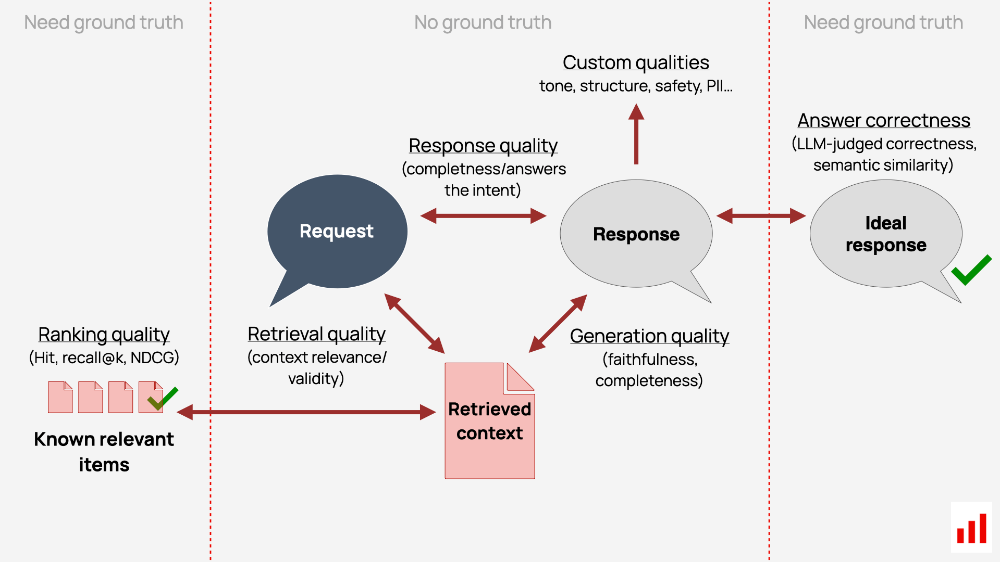

回顾一下 RAG 开发的几个关键原则：

1. **数据>模型** — 投入更多精力清洗和优化数据，比换更强的模型划算得多
2. **检索>生成** — 大部分问题出在检索环节没做好，而不是 LLM 不够聪明
3. **安全不是附加项** — 上线前就嵌入审核机制，别等出了事再补

这12个痛点，从论文到实践，基本覆盖了 RAG 从原型到上线的各个环节。遇到问题的时候回头看看，大概率能找到对应的解决方向。
