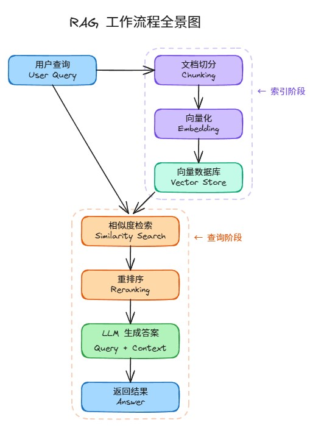
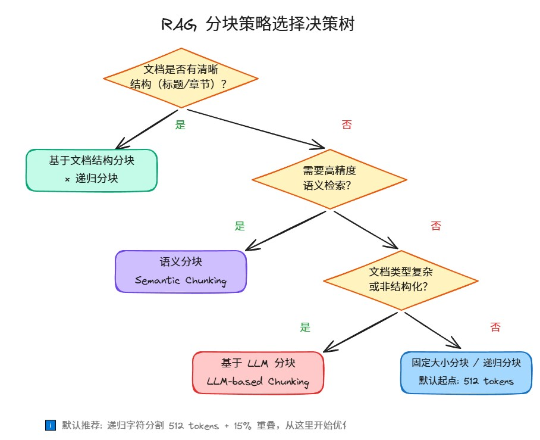

# RAG 分块策略深度解析：5 种方案的原理、对比与选型实战

> **标签**：`RAG` `Chunking` `向量检索` `LLM` `知识库`  

---

## 写在前面

RAG（Retrieval-Augmented Generation）已经成了大模型落地的标配方案。但很多团队在实际搭建过程中会发现：同样的模型、同样的向量库，效果却天差地别。

**问题往往出在一个被严重低估的环节——分块（Chunking）。**

一项 2025 年的基准研究表明，分块配置对检索质量的影响甚至超过了嵌入模型的选择。错误的分块策略可以让召回率产生高达 9% 的差距（Weaviate, 2025）。然而大多数团队还在用默认的 512 token 固定切分，然后花几个月时间调 prompt，却不知道问题在数据索引阶段就已经埋下了。

本文将系统拆解 RAG 中最主流的 5 种分块策略，从原理到选型，帮你找到最适合你业务场景的方案。

---

## 一、先看全景：RAG 是怎么工作的？

在讨论分块之前，我们先快速回顾 RAG 的完整流程：

**RAG 工作流程全景图（Excalidraw 交互图）**：



整个流程分为两个阶段：

**索引阶段（离线）**：
1. 文档切分（Chunking）—— 把大文档切成小块
2. 向量化（Embedding）—— 把每个块转成向量
3. 存入向量数据库（Vector Store）

**查询阶段（在线）**：

1. 用户问题向量化
2. 相似度检索（Similarity Search）
3. 重排序（Reranking）
4. 将检索到的上下文 + 用户问题一起送给 LLM
5. LLM 生成答案返回给用户

**分块就发生在索引阶段的第一步，它直接决定了后续所有环节的上限。**

---

## 二、分块做不好会怎样？三大类问题

在深入策略之前，先看看分块不当会导致什么后果。这些问题在金融、医疗、法律等高风险领域尤为致命。

### 2.1 准确性崩塌：答案不可信

| 问题 | 表现 | 典型场景 |
|------|------|----------|
| **幻觉** | 模型脱离文档编造答案 | 用户问"某基金近3年收益率"，模型捏造数据 |
| **检索噪声** | 无关片段误导生成 | 10篇文档中3篇含错误数据，模型融合错误信息 |
| **细粒度误读** | 数字/日期/术语理解错误 | 将"预计2025年增长10%"误解为历史数据 |

### 2.2 召回率低：该找到的没找到

| 问题 | 表现 | 典型场景 |
|------|------|----------|
| **语义匹配局限** | 术语 vs 口语匹配失败 | "钱放货币基金安全吗？"匹配不到"货币市场基金信用风险分析" |
| **长尾知识遗漏** | 低频知识检索不到 | 小众金融衍生品的风险说明文档未被召回 |
| **多跳推理失效** | 分散知识点无法关联 | "美联储加息如何影响A股消费板块？"需要两次检索 |

### 2.3 复杂文档解析失败

- **表格/图表**：文本分块破坏表格结构，行列关系丢失
- **公式/代码**：被错误分段，语义完整性受损
- **上下文割裂**：固定长度切分切断关键关联，比如分块1结尾是"风险因素包括："，分块2开头是"利率波动、信用违约..."，模型无法关联
- **逻辑结构丢失**：忽略章节层级，把"附录"备注误认为正文结论

---

## 三、5 种分块策略详解

### 3.1 固定大小分块（Fixed-size Chunking）

**原理**：按固定长度（字符数、单词数或 token 数）顺序切分，相邻块可设置重叠以保留上下文。

**实现要点**：
- 预设块大小（如 256 token）和重叠比例（如 20 token）
- 按长度顺序切分，允许相邻块部分重叠
- 输出所有块作为独立单元

**优点**：
- 实现简单，无需复杂算法
- 块大小一致，便于批量处理和向量化
- 资源友好，适合大规模文本处理

**缺点**：
- 可能在句子或概念中间切分，破坏语义完整性
- 重叠区域导致信息冗余和重复计算
- 对结构化文本（代码、技术文档）效果差

**踩坑示例**：
```
[原文档] "2023年Q3净利润同比增长5.2%（详见附录Table 7）"
[分块1]  "2023年Q3净利润同比增长5.2%（详见"
[分块2]  "附录Table 7）"
→ 关键数据来源丢失！
```

**适用场景**：非结构化文本的初步处理、对实时性要求高的快速切分场景

---

### 3.2 语义分块（Semantic Chunking）

**原理**：将文本拆分为句子或段落，计算相邻单元的向量嵌入余弦相似度。当相似度骤降时，说明话题发生了转变，此时开始新的分块。

**实现步骤**：
1. 分句/分段
2. 为每个单元生成嵌入向量
3. 依次计算相邻单元的余弦相似度
4. 相似度高于阈值时合并；骤降时开始新块

**优点**：
- 保留自然语义结构，每个块主题聚焦
- 适应复杂逻辑关系（因果、对比等）
- 检索到的块更连贯，利于 LLM 生成精准回答

**缺点**：
- 计算复杂度高，需多次向量化和相似度比较
- 相似度阈值需人工调试，不同类型文档需要不同参数
- 依赖高质量嵌入模型

**⚠️ 重要提醒**：语义分块的独立基准测试结果看起来很好（91-92% 召回率），但端到端准确率可能只有约 54%。原因是语义切分产生的平均块大小只有约 43 token，太短了，LLM 无法从中构建有意义的答案。**如果使用语义分块，务必设置至少 200 token 的最小块限制。**

**适用场景**：高精度问答系统（法律、医疗）、研究论文、行业分析报告等专业文档

---

### 3.3 递归分块（Recursive Chunking）

**原理**：先按主题或段落进行粗粒度划分，再对超长块递归地应用固定大小或语义细分，直至满足大小限制。它融合了结构化与非结构化处理逻辑。

**实现步骤**：
1. 粗粒度切分（按段落、标题或主题）
2. 检查块是否超过预设长度（如 1024 token）
3. 超长块按固定大小或语义逻辑进一步切分
4. 块大小符合要求时停止递归

**优点**：
- 灵活性强，平衡结构完整性与大小限制
- 处理长文档（书籍、长篇论文）时表现优异
- 可结合固定大小或语义分块优化细分

**缺点**：
- 不同层级的块可能大小差异较大
- 递归过程中可能破坏原文的自然段落结构
- 需要设计递归终止条件

**为什么它是最佳默认起点？** 它使用层次化分隔符（段落→换行→空格→字符），仅在必要时才回退到字符切分，最大程度保留了语义边界。Chroma 2024 年的基准测试发现，在 400-512 token 范围内采用 10-20% 重叠的递归分块，在不同文档类型中实现了 85-90% 的 Recall@5，且方差最低。

**适用场景**：长文档处理（企业年报、学术论文、书籍、技术手册）、包含嵌套结构的合同文本

---

### 3.4 基于文档结构的分块（Document Structure-based Chunking）

**原理**：利用文档固有的结构标记（标题、章节、段落标记、Markdown/HTML/XML 标签）进行切分，将每个结构单元独立为一个块。

**实现步骤**：
1. 解析文档中的结构元素（标题、段落、小节等标记）
2. 按结构切分，每个结构单元（如"引言"、"结论"）独立为块
3. 若某结构单元过大，结合递归或固定大小分块细化

**优点**：
- 保留文档层次化结构，便于定位信息
- 用户可通过标题快速定位相关内容
- 与结构化文档格式天然兼容

**缺点**：
- 依赖文档格式标准化，对自由写作等非结构化文本效果差
- 需解析文档格式（LaTeX、HTML），增加实现难度
- 难以处理混合结构内容（图文混排）

**NVIDIA 2024 年研究发现**：页面级分块在技术文档上实现了最高的综合准确率（0.648），但这仅在文档页面对应于有意义的语义单元时才成立。

**适用场景**：财报（表格数据）、技术文档（代码块）、合同（条款列表）、法规数据库等结构化文档

---

### 3.5 基于 LLM 的分块（LLM-based Chunking）

**原理**：直接将原始文档输入大语言模型，通过提示词引导模型按语义动态划分文本块。利用 LLM 的语义理解能力，保证分块的语义准确性。

**实现方式**：
```
示例提示词：
"请将以下文档按语义划分为多个块，每个块需包含完整主题。"
```

**优点**：
- 高度智能化，适应复杂、非结构化文本
- 根据文档内容自动调整块大小和逻辑
- 语义连贯性最佳，减少人工干预

**缺点**：
- 计算成本极高，依赖高性能 LLM
- 模型决策过程不可控（可解释性差）
- 效果受限于 LLM 的训练数据和语义理解能力

**适用场景**：访谈记录、会议纪要、用户评论等非结构化文本；需高级语义分析的跨领域知识整合场景

---

## 四、一图看懂：分块策略怎么选？

**分块策略选择决策树（Excalidraw 交互图）**：



**快速决策指南**：

| 场景 | 推荐策略 | 理由 |
|------|----------|------|
| 不确定用什么 | **递归分块 512 token + 15% 重叠** | 最安全的默认起点，失效时优雅降级 |
| 结构化文档（论文/财报/合同） | **文档结构分块 × 递归分块** | 保留层次结构，超长部分递归细分 |
| 高精度问答（法律/医疗） | **语义分块**（设最小 200 token） | 语义完整性最高，检索最精准 |
| 非结构化/混合内容 | **LLM 分块** | 智能适应，但成本高 |
| 快速原型/资源受限 | **固定大小分块** | 实现简单，资源友好 |

**总结对比表**：

| 策略 | 核心优势 | 核心劣势 | 最佳场景 |
|------|----------|----------|----------|
| 固定大小分块 | 实现简单，资源高效 | 语义断裂，信息冗余 | 快速处理非结构化文本 |
| 语义分块 | 语义完整，检索精准 | 计算复杂，依赖阈值 | 高精度问答、复杂文档 |
| 递归分块 | 灵活适应长文档，保留结构 | 块大小不均，逻辑断裂风险 | 长篇技术文档、企业报告 |
| 基于结构的分块 | 逻辑清晰，检索高效 | 依赖格式标准化，预处理复杂 | 结构化文档（论文、白皮书） |
| 基于 LLM 的分块 | 高度智能，适应非结构化文本 | 计算成本高，决策不可控 | 非结构化内容、跨领域整合 |

---

## 五、落地建议：参数怎么配？

### 5.1 通用起始配置

```
策略：递归字符分割（Recursive Character Splitter）
块大小：512 tokens
重叠：15%（约 77 tokens）
```

这个配置在多个独立基准测试中排名前列，是经过充分验证的安全起点。

### 5.2 评估指标

至少跟踪以下两个指标：
- **Recall@5**：正确的分块是否出现在前 5 个结果中？
- **Contextual Precision**：检索到的内容中有多少是真正相关的？

按文档类型和查询类型分别跟踪，聚合分数可能掩盖特定类别的灾难性失败。

### 5.3 进阶优化路径

1. **先跑通基线**：递归 512 token + 15% 重叠
2. **收集 badcase**：找出回答不准的 query
3. **分析原因**：是检索没召回？还是召回了但块太大/太小？
4. **针对性调优**：根据 badcase 类型切换策略或调整参数
5. **持续评估**：每次改动都要跑评估集验证

---

## 六、前沿探索：RAG 还有哪些待解难题？

### 深层问题

| 问题 | 描述 |
|------|------|
| **知识关联缺失** | 单点语义检索无法构建跨文档知识图谱 |
| **推理-检索割裂** | 生成模型无法主动指导检索，是单向流水线 |
| **多模态理解不足** | 图表、公式、流程图等利用率极低 |
| **可信度量化困境** | 缺乏统一标准评估答案可靠性 |
| **长上下文建模缺陷** | 检索返回大量片段时，模型对尾部信息忽略率上升 |

### 优化方向

- **检索增强**：混合检索（语义 + 关键词 BM25）、查询扩展（LLM 改写问题）、递归检索（多跳推理）
- **生成控制**：强制引用（标注来源）、置信度阈值（低置信触发人工审核）、结构化解构（拆解复杂问题）
- **分块优化**：Anthropic 的 Contextual Retrieval（给每个块加上下文说明）、Late Chunking（在向量层延迟切分）、动态重叠
