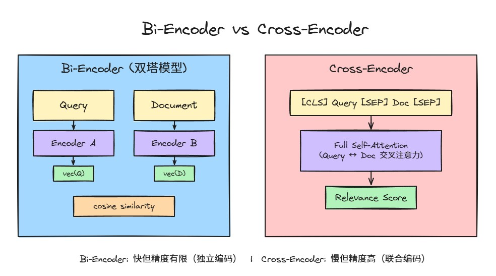
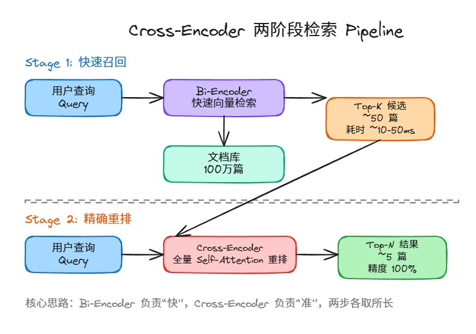
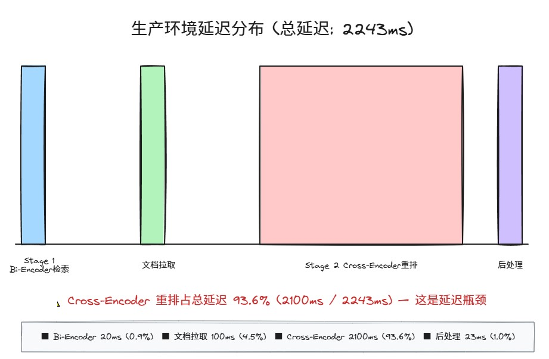
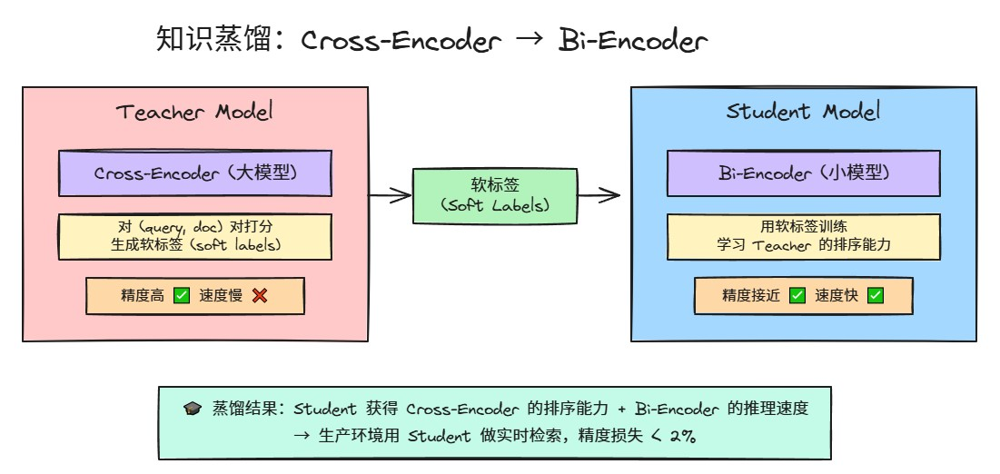

# RAG 检索进阶：Cross-Encoder 重排序的原理与实战

---

## 1. 为什么 Bi-Encoder 召回不够用

标准 RAG 用的是 Bi-Encoder（也叫双塔模型）做语义检索。它的工作方式很直白：

**Bi-Encoder vs Cross-Encoder 架构对比图（Excalidraw 交互图）**：



[Cross-Encoder 与 Bi-Encoder 架构对比 — Illustrated Guide](https://medium.com/@kakumar1611/the-illustrated-guide-to-cross-encoders-from-deep-to-shallow-2a23a8630016)

[ColBERT 晚期交互模型架构 — Weaviate](https://weaviate.io/blog/late-interaction-overview)

```
Query  → [Encoder A] → query_embedding
Document → [Encoder B] → doc_embedding
然后算两个向量的余弦相似度
```

问题在于：**query 和 document 是各自独立编码的**，两个 encoder 之间没有 token 级别的交互。也就是说，模型在编码 query 的时候根本不知道 document 长什么样，反之亦然。

这带来一个很现实的问题——当 query 和 document 在语义上高度相关、但表面措辞差别较大时，Bi-Encoder 容易漏掉。反过来，两段文字用词高度重叠但语义不相干时，它又可能给高分。

一句话总结：**Bi-Encoder 速度快，但精度天花板就在那了。**

## 2. Cross-Encoder 的核心原理

Cross-Encoder 的做法完全不同。它把 query 和 document **拼成一个序列**，一起送进 Transformer：

```
输入：[CLS] query tokens [SEP] document tokens [SEP]
                                    ↓
                        全量 Self-Attention
                                    ↓
                            相关性分数 (0~1)
```

关键区别在这里：**Self-Attention 作用在整个拼接序列上**，query 的每个 token 都能 attend 到 document 的每个 token，反之亦然。这意味着模型可以捕捉到 token 级别的细粒度关系——比如 query 里某个关键词恰好出现在 document 的关键段落里。

这种全交互机制让 Cross-Encoder 的精度远超 Bi-Encoder。代价也很明显：**每次打分都要过一遍完整的 Transformer forward pass**，没法像 Bi-Encoder 那样预先算好 document 向量。

在主流的 MTEB 排行榜上，排名靠前的检索模型几乎都是 Cross-Encoder 或者用了类似晚期交互（Late Interaction）机制的方案。

## 3. 两阶段 Pipeline 设计

既然 Cross-Encoder 精度高但速度慢，Bi-Encoder 速度快但精度有限，那最务实的方案就是**组合起来用**：

**两阶段 Pipeline 架构图（Excalidraw 交互图）**：



[Bi-Encoder vs Cross-Encoder 架构对比](https://www.velodb.io/glossary/bi-encoder-vs-cross-encoder)

```
┌─────────────────────────────────────────────────┐
│  Stage 1: Bi-Encoder 快速召回                     │
│  输入: query                                      │
│  从 100万 文档 → 召回 Top-K (比如 50 个)            │
│  耗时: ~10-50ms (ANN 检索)                         │
├─────────────────────────────────────────────────┤
│  Stage 2: Cross-Encoder 精确重排                   │
│  输入: query + 50 个候选文档                        │
│  对每个 (query, doc) 对打分 → 取 Top-N              │
│  耗时: 取决于模型大小和文档数量                       │
└─────────────────────────────────────────────────┘
```

这个架构的好处是：Stage 1 用 ANN（近似最近邻）快速把候选集缩小到可控范围，Stage 2 再用 Cross-Encoder 精排。两步各取所长。

## 4. 代码实战：从预测到训练

### 4.1 基础用法：给 query-doc 对打分

```python
from sentence_transformers import CrossEncoder

# 加载预训练的 Cross-Encoder
model = CrossEncoder("cross-encoder/ms-marco-MiniLM-L-6-v2")

# 准备 (query, document) 对
query = "如何优化 RAG 检索的精度？"
documents = [
    "使用 Cross-Encoder 对召回结果做重排序可以显著提升精度。",
    "今天的天气预报显示明天会下雨。",
    "RAG 系统中，检索阶段的质量直接决定了最终生成的效果。",
]

# 构造输入对并打分
pairs = [(query, doc) for doc in documents]
scores = model.predict(pairs)

# 打印结果
for doc, score in zip(documents, scores):
    print(f"分数: {score:.4f}  |  {doc[:50]}")

# 输出示例：
# 分数: 0.9231  |  使用 Cross-Encoder 对召回结果做重排序可以显著提升精度。
# 分数: 0.0142  |  今天的天气预报显示明天会下雨。
# 分数: 0.8756  |  RAG 系统中，检索阶段的质量直接决定了最终生成的效果。
```

### 4.2 完整 Pipeline：Bi-Encoder 召回 + Cross-Encoder 重排

```python
from sentence_transformers import SentenceTransformer, CrossEncoder
import numpy as np

# Stage 1: Bi-Encoder 召回
bi_encoder = SentenceTransformer("all-MiniLM-L6-v2")
cross_encoder = CrossEncoder("cross-encoder/ms-marco-MiniLM-L-6-v2")

query = "什么是 Cross-Encoder 重排序？"
corpus = [
    "Cross-Encoder 将 query 和 document 拼接后联合编码...",
    "今天股票市场大涨...",
    "Bi-Encoder 独立编码 query 和 document，缺乏交互...",
    "晚上吃什么好呢...",
    # ... 假设有更多文档
]

# 编码所有文档
doc_embeddings = bi_encoder.encode(corpus)
query_embedding = bi_encoder.encode([query])

# 计算相似度，召回 Top-50
similarities = np.dot(query_embedding, doc_embeddings.T)[0]
top_k_indices = np.argsort(similarities)[-50:][::-1]
retrieved_docs = [corpus[i] for i in top_k_indices]

# Stage 2: Cross-Encoder 重排
pairs = [(query, doc) for doc in retrieved_docs]
cross_scores = cross_encoder.predict(pairs)

# 按 Cross-Encoder 分数重新排序
reranked = sorted(
    zip(retrieved_docs, cross_scores),
    key=lambda x: x[1],
    reverse=True
)

# 取 Top-5 作为最终结果
for doc, score in reranked[:5]:
    print(f"分数: {score:.4f} | {doc[:60]}")
```

### 4.3 训练自定义 Cross-Encoder

在自己的业务数据上微调 Cross-Encoder 并不复杂：

```python
from sentence_transformers import CrossEncoder
from torch.utils.data import DataLoader
from sentence_transformers.cross_encoder.losses import CrossEntropyLoss

# 加载基础模型
model = CrossEncoder("cross-encoder/ms-marco-MiniLM-L-6-v2", num_labels=1)

# 准备训练数据：(query, document, label)
# label: 1 表示相关，0 表示不相关
train_samples = [
    ("如何部署 RAG？", "本教程介绍 RAG 系统的完整部署流程。", 1),
    ("如何部署 RAG？", "今天的午餐菜单很好吃。", 0),
    # ... 更多样本
]

train_dataloader = DataLoader(train_samples, batch_size=16, shuffle=True)
train_loss = CrossEntropyLoss(model)

# 训练
model.fit(
    train_dataloader=train_dataloader,
    epochs=3,
    loss=train_loss,
    output_path="./my-cross-encoder-reranker",
    show_progress_bar=True,
)
```

## 5. 用 72 个样本把准确率从 30% 干到 95%

这个数据不是编的，是在法律领域的实际案例。

场景是这样的：一个法律检索系统，用通用的 Bi-Encoder 做召回，检索准确率只有 **30%** 左右。法律文本有大量专业术语，通用模型很难准确理解。

做法很简单：

1. 收集了 **72 个** 法律领域的 (query, document, relevance) 训练样本
2. 在这些样本上微调 Cross-Encoder
3. 把微调后的 Cross-Encoder 接入两阶段 Pipeline

结果：**准确率从 30% 飙到 95%**。

为什么效果这么好？法律领域有一个特点——query 和 document 之间的相关性判断需要**深层语义理解**，不能光靠关键词匹配。Cross-Encoder 的全交互 attention 机制正好擅长干这个事。而且法律数据的模式相对集中，72 个精心标注的样本就够让模型学到领域内的相关性判断规则。

**关键启示**：不要被"小样本"吓退。Cross-Encoder 微调的样本需求远小于训练一个 Bi-Encoder，因为预训练的 Transformer 已经具备了强大的语言理解能力，微调只是让它学会"什么算相关"。

## 6. 生产环境的几个关键优化

### 6.1 典型延迟分布

在一个典型的生产配置中，Pipeline 的延迟大概是这样分布的：

**生产环境延迟分布图（Excalidraw 交互图）**：



[Cross-Encoder 延迟优化 — Reranking Production Guide](https://mbrenndoerfer.com/writing/reranking-cross-encoders-information-retrieval)

| 阶段 | 操作 | 延迟 |
|------|------|------|
| Stage 1 | Bi-Encoder 向量检索（从百万级文档中召回 50 个） | ~20ms |
| Stage 1→2 | 文档内容拉取 | ~100ms |
| Stage 2 | Cross-Encoder 重排 50 个文档 | ~2,100ms |
| 后处理 | 取 Top-5，格式化 | ~23ms |
| **总计** | | **~2,243ms** |

可以看出来，**Cross-Encoder 重排是绝对的延迟瓶颈**。50 个文档逐个过 Transformer，每个大约 42ms（取决于模型大小和硬件）。

### 6.2 降低 Stage 2 延迟的方法

**方法一：减少候选文档数量**

如果 Stage 1 召回的文档质量不错，可以把 50 个减到 20 个，延迟直接减半。前提是不要让 recall 掉太多。

**方法二：用更小的 Cross-Encoder**

```
模型大小对比：
- cross-encoder/ms-marco-MiniLM-L-12-v2  → 12层，精度高，慢
- cross-encoder/ms-marco-MiniLM-L-6-v2   → 6层，精度略低，快一倍
- cross-encoder/ms-marco-TinyBERT-L-2-v2 → 2层，最快，精度损失可接受
```

**方法三：批量推理 + GPU**

```python
# batch 推理比逐个推理快很多
scores = model.predict(pairs, batch_size=32)
```

**方法四：ONNX 导出加速**

```python
model = CrossEncoder("cross-encoder/ms-marco-MiniLM-L-6-v2")
model.model = ORTModelForSequenceClassification.from_pretrained(
    "cross-encoder/ms-marco-MiniLM-L-6-v2",
    export=True,
)
# 推理速度通常能提升 2-4 倍
```

## 7. 高级技巧：蒸馏、缓存、多阶段漏斗

### 7.1 语义查询缓存（Semantic Query Caching）

很多用户的 query 其实高度相似。如果你缓存了之前 query 的排序结果，新 query 来的时候先去缓存里查有没有语义上接近的历史 query，命中的话直接复用排序结果。

实测数据：**可以节省约 76% 的排序操作**。

```python
from sentence_transformers import SentenceTransformer
import numpy as np

cache_encoder = SentenceTransformer("all-MiniLM-L6-v2")
query_cache = {}  # {embedding: reranked_results}
SIMILARITY_THRESHOLD = 0.92

def get_or_cache_rerank(query, retrieved_docs, cross_encoder):
    query_emb = cache_encoder.encode(query)
    
    # 查缓存
    for cached_emb, cached_result in query_cache.items():
        sim = np.dot(query_emb, cached_emb)
        if sim > SIMILARITY_THRESHOLD:
            return cached_result  # 缓存命中，直接返回
    
    # 缓存未命中，正常重排
    pairs = [(query, doc) for doc in retrieved_docs]
    scores = cross_encoder.predict(pairs)
    result = sorted(zip(retrieved_docs, scores), key=lambda x: x[1], reverse=True)
    
    # 写缓存
    query_cache[tuple(query_emb)] = result
    return result
```

### 7.2 多阶段漏斗 Pipeline

**多阶段漏斗架构图（Excalidraw 交互图）**：


如果文档库特别大，可以加更多中间阶段：

```
百万文档
  → Stage 1: BM25 关键词召回 Top-1000
  → Stage 2: Bi-Encoder 语义重排 Top-100
  → Stage 3: Cross-Encoder 精排 Top-10
  → 最终输出
```

每一阶段都在缩小候选集，每一阶段用的模型精度递增、数量递减。

### 7.3 知识蒸馏：Cross-Encoder 的质量 + Bi-Encoder 的速度

这是最实用的高级技巧之一。

**知识蒸馏流程图（Excalidraw 交互图）**：



[DISKCO: 知识蒸馏从 Cross-Encoder 到 Bi-Encoder — Amazon Science](https://cdn.amazon.science/32/2f/96f5b7054d4586065d78741a4551/diskco-disentangling-knowledge-from-cross-encoder-to-bi-encoder.pdf)

核心思路：**用训练好的 Cross-Encoder 作为 Teacher，去训练一个更强的 Bi-Encoder（Student）**。这样 Student 学到了 Cross-Encoder 的排序判断力，但推理时用的是 Bi-Encoder 的速度。

```python
from sentence_transformers import SentenceTransformer, CrossEncoder, losses
from sentence_transformers import InputExample
from torch.utils.data import DataLoader
import torch

# Teacher: 训练好的 Cross-Encoder
teacher = CrossEncoder("./my-cross-encoder-reranker")

# Student: 要蒸馏的 Bi-Encoder
student = SentenceTransformer("all-MiniLM-L6-v2")

# 准备数据
query = "RAG 系统如何提升检索精度？"
documents = [
    "使用 Cross-Encoder 做重排序...",
    "今天天气很好...",
    "向量检索的质量决定了 RAG 的上限...",
    # ... 更多文档
]

# 用 Teacher 打分，生成软标签
pairs = [(query, doc) for doc in documents]
teacher_scores = teacher.predict(pairs)

# 构造蒸馏训练数据
train_examples = []
for doc, score in zip(documents, teacher_scores):
    train_examples.append(InputExample(texts=[query, doc], label=float(score)))

train_dataloader = DataLoader(train_examples, batch_size=16)

# 用 MSELoss 让 Student 的分数逼近 Teacher
train_loss = losses.MSELoss(model=student)

student.fit(
    train_objectives=[(train_dataloader, train_loss)],
    epochs=5,
    output_path="./distilled-bi-encoder",
)
```

### 7.4 ColBERT：晚期交互的折中方案

ColBERT 是另一种有意思的方案。它不走 Cross-Encoder 的全交互路线，而是为 query 和 document 各自生成 **token 级别的向量**，然后用 **MaxSim** 操作计算相关性：

[ColBERT 晚期交互原理 — IBM Developer](https://developer.ibm.com/articles/how-colbert-works)

[晚期交互模型概览 — Weaviate Blog](https://weaviate.io/blog/late-interaction-overview)

```
Query tokens:   [q1, q2, q3, ..., qn]   ← 每个 token 一个向量
Doc tokens:     [d1, d2, d3, ..., dm]   ← 每个 token 一个向量

Score = Σ_i max_j (sim(qi, dj))
```

好处是 document 的 token 向量可以**预先计算并缓存**，查询时只需要算 query 的 token 向量，然后做 MaxSim。精度接近 Cross-Encoder，速度接近 Bi-Encoder。

## 8. 落地建议

基于上面的内容，给几个实际落地的建议：

### 8.1 起步方案

如果你现在只用 Bi-Encoder，效果不满意，**最低成本的改进**是：

1. 下载一个现成的 Cross-Encoder（推荐 `cross-encoder/ms-marco-MiniLM-L-6-v2`）
2. 在你现有 Pipeline 的召回结果后面加一步重排
3. 先用默认配置跑起来，看效果提升多少

这一步不需要训练任何东西，半小时就能接上。

### 8.2 进阶方案

如果你的业务领域比较垂直（法律、医疗、金融等）：

1. **标注 50-100 个高质量样本**（query + 正/负例）
2. 在通用 Cross-Encoder 基础上微调
3. 预期能获得显著的精度提升

标注样本的质量比数量重要。宁可少一点但标注准确，也不要凑数。

### 8.3 规模化方案

当系统日请求量上来之后：

1. 部署语义查询缓存，减少重复计算
2. 考虑知识蒸馏，把 Cross-Encoder 的能力迁移到 Bi-Encoder 上
3. 如果有 GPU 资源，用 TensorRT / ONNX 做推理加速
4. 多阶段漏斗，分层过滤

### 8.4 常见坑

| 坑 | 说明 |
|----|------|
| 召回阶段太激进 | Stage 1 召回太少（<20），Cross-Encoder 再好也没用，因为正确文档根本没进来 |
| Cross-Encoder 输入过长 | 超过 512 token 的文档要截断或分段，否则会出问题 |
| 训练数据不均衡 | 正负样本比例失衡会导致模型偏向某一方，建议 1:3 到 1:5 |
| 分数不可跨 query 比较 | Cross-Encoder 的分数只在同一个 query 下有意义，不同 query 之间的分数不能直接对比 |
