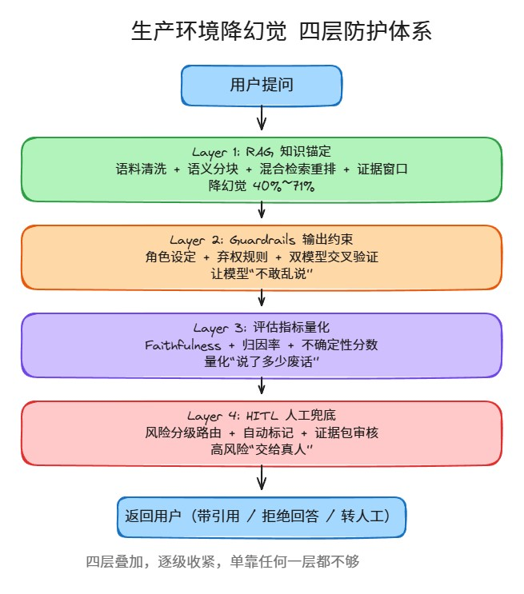
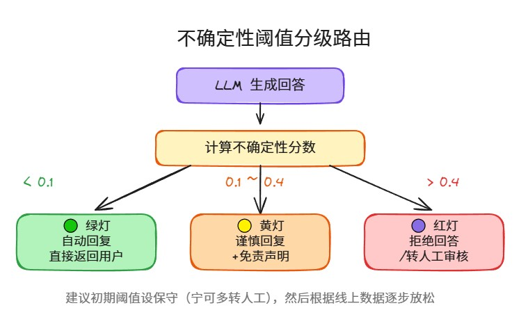

# 生产环境降幻觉实战：RAG + Guardrails + HITL 四层防护体系

---

## 写在前面

上线过 LLM 产品几乎都逃不掉的噩梦——模型一本正经地胡说八道。

不管你怎么调 prompt、换模型、加 few-shot，幻觉这东西就是阴魂不散。行业里给出的基线数据是 **3%~20%** 的幻觉率，具体看场景和模型。这个数字听起来不大，但如果你做的是客服、法务、医疗这类场景，哪怕 3% 都够出大事。

**四层防护体系**：核心思路很简单：不指望模型不犯错，而是用工程手段把错误拦在到达用户之前。

**最终效果**：分层方案可以将幻觉率降低 **40%~96%**。

---

## 整体架构一览

先上全景图，心里有个数：

**四层防护体系架构图（Excalidraw 交互图）**：



四层之间是叠加关系，不是替代关系。每一层干不同的活，合在一起才有效。

---

## Layer 1：RAG 知识锚定（降幻觉 40%~71%）

RAG 是第一道防线，也是投入产出比最高的一层。但很多团队的 RAG 其实是"假 RAG"——塞了一堆文档进去，检索出来的东西跟问题对不上，模型拿到一堆噪音反而更容易瞎编。

### 1.1 语料清洗，别在这一步偷懒

垃圾进垃圾出，这句话在 RAG 场景里格外真实。实操建议：

- **去重去噪**：重复段落、过期内容、格式错乱的表格，统统清理掉
- **元数据标注**：每条文档标记来源、时间、版本，后面溯源时会感谢自己
- **定期更新**：设置定时任务刷新知识库，别让半年前的旧文档还在回答问题

### 1.2 语义分块，别用固定长度切

按固定字符数切 chunk 是最常见的错误做法。一段话被拦腰切断，检索到了也没意义。

推荐做法：

- 按段落/章节/表格等语义边界切分
- chunk 大小一般在 300~800 token 之间，具体看业务文档特点
- 保留 chunk 之间的上下文重叠（overlap 10%~15%）

### 1.3 混合检索 + 重排

单一检索方式很容易漏。实际效果最好的组合：

- **向量检索**（语义相似）+ **BM25**（关键词匹配），两者取并集
- 对候选结果用 **Reranker**（比如 bge-reranker、Cohere rerank）做精排
- 最终取 Top-K 送入 LLM，K 值一般 3~8，太多反而引入噪音

### 1.4 证据窗口 + 返回引用

这是降低幻觉最关键的一个工程细节：**只把检索到的内容放进 context，不要给模型留"自由发挥"的空间**。

- 设置明确的 system prompt：`"仅基于以下内容回答，如果内容不足请说明"`
- 每条回答附带引用来源（文档名 + 段落编号）
- 用户可以点击引用跳转到原文验证

这套做完，单独使用可以降低约 **40%~71%** 的幻觉。但还不够——模型依然可能在引用内容的基础上"添油加醋"。所以需要第二层。

---

## Layer 2：Guardrails 输出约束

RAG 管的是"输入"，Guardrails 管的是"输出"。这一层的核心目标：**约束模型的表达方式，减少无中生有**。

### 2.1 角色设定 + 证据优先格式

system prompt 里明确角色边界：

```
你是一个企业知识库助手。回答规则：
1. 只基于提供的参考资料回答
2. 每个关键声明必须标注来源编号 [1][2]
3. 如果参考资料不包含答案，直接回答"根据现有资料无法确定"
4. 不要添加任何推测性内容
```

关键是**格式约束**——强制模型输出引用编号，这样"编"出来的东西一眼就能看出来（引用编号对不上）。

### 2.2 弃权规则

模型不知道就说不知道，这很重要但经常被忽略。实操：

- 设定明确的弃权触发条件（检索置信度低、无相关文档、问题超出范围）
- 弃权话术统一，给用户明确预期，比如："当前知识库中未找到相关信息，建议联系人工客服"
- 不要假装回答——宁可不答，也别瞎答

### 2.3 自验证 + 双模型检查

单模型自检不太靠谱（让模型自己检查自己有没有幻觉，多少有点玄学），但**双模型交叉验证**是实用的：

- 用一个轻量模型（或同一个模型的独立调用）做 fact-check：逐句检查回答是否有文档支撑
- 标记出"无支撑声明"，返回给主模型修正或直接删除
- 成本可控：可以用小模型做 checker，延迟增加不多

---

## Layer 3：评估指标量化

前面两层是"防"，这一层是"量"。你得知道你的系统到底幻觉率是多少，在哪些场景高，才能持续优化。

### 核心指标

| 指标 | 含义 | 目标值 |
|------|------|--------|
| **Faithfulness@k** | 回答中有多少比例可以被检索到的文档支撑 | ≥ 90% |
| **归因率** | 回答中带引用的声明占总声明的比例 | ≥ 85% |
| **不支持声明率** | 回答中有多少声明找不到文档支撑 | ≤ 5% |
| **一致性分数** | 同一问题多次回答的语义一致性 | ≥ 0.9 |
| **不确定性分数** | 模型对自己回答的置信度（越低越自信） | 见下文阈值 |

### 不确定性阈值分级（重点）

这是实战中最关键的一个配置。我们在每个回答上计算一个不确定性分数，然后按阈值分流：

**不确定性阈值分级路由图（Excalidraw 交互图）**：



| 级别 | 阈值范围 | 处理方式 | 示意 |
|------|----------|----------|------|
| 🟢 绿灯 | < 0.1 | 自动回复，直接返回用户 | "这是产品价格表" |
| 🟡 黄灯 | 0.1 ~ 0.4 | 谨慎回复，加免责声明 | "根据现有资料，可能是……" |
| 🔴 红灯 | > 0.4 | 拒绝回答或转人工 | "该问题需要人工确认" |

这个阈值不是拍脑袋定的，需要根据线上数据反复调整。建议初期阈值设保守一点（宁可多转人工），然后逐步放松。

---

## Layer 4：HITL 人工兜底

最后一层，也是兜底的一层。有些场景，不管你怎么优化，都不应该完全交给模型。

### 4.1 风险分级路由

不是所有请求都需要人工介入。按场景风险等级分层：

| 风险等级 | 场景举例 | 控制策略 |
|----------|----------|----------|
| **低风险** | 创意写作、头脑风暴 | 最少控制，允许幻觉存在 |
| **中低风险** | 内部文档查询 | 抽检，定期 review 输出质量 |
| **中高风险** | 客户支持、产品说明 | 强制引用，必须带来源 |
| **高风险** | 法律、医疗、金融建议 | 必须经过 HITL 审核 |

这个分级表建议写进团队的 AI 使用规范里，新人入职直接看这个就知道怎么配。

### 4.2 自动标记机制

对于黄色和红色标记的请求，系统自动做两件事：

1. **黄灯**：回复后自动标记，纳入人工抽检队列
2. **红灯**：回复不直接发送给用户，先进人工审核队列，审核通过后才发出

实现上，可以在每个回答上附加一个 `confidence_flag` 字段，下游服务根据这个字段决定是否拦截。

### 4.3 证据包 + 人工标签

人工审核不是让审核员自己去查资料，而是系统准备好"证据包"：

- 用户原始问题
- 检索到的所有文档片段
- 模型的回答（逐句标注引用来源）
- 不确定性分数和标记原因

审核员看完证据包，打上标签（✅ 准确 / ⚠️ 部分准确 / ❌ 幻觉），这些标签又可以回流到评估系统里做持续优化。

---

## 微调兜底：RAG 不够时的最后一招

有些场景下，即使 RAG 检索到了正确文档，模型还是会"创造性发挥"。这时候可以考虑微调：

- 用 RAG 系统的真实 query + 正确回答（人工校验过的）做训练数据
- 训练目标是让模型学会"忠实输出"——只说文档里有的内容
- 微调不是替代 RAG，而是让模型更好地利用 RAG 的结果
- 一般用 LoRA 就够了，成本可控

---

## 落地建议清单

最后给一份可以直接拿去用的 checklist：

### 第一周：快速见效
- [ ] 清洗知识库语料，去重去噪
- [ ] 实现基础 RAG（向量检索 + prompt 约束）
- [ ] 加上引用返回功能

### 第二周：加护栏
- [ ] system prompt 加入证据优先格式和弃权规则
- [ ] 实现双模型 fact-check（可以先用简单规则匹配）
- [ ] 部署不确定性分数计算

### 第三周：量化 + 分流
- [ ] 建立评估 pipeline，跑 Faithfulness、归因率等指标
- [ ] 配置不确定性阈值（先从保守值开始）
- [ ] 实现风险分级路由

### 第四周：人工闭环
- [ ] 搭建审核队列和证据包
- [ ] 建立人工标签回流机制
- [ ] 持续监控各指标，逐步调优

---

## 总结

幻觉治理没有银弹，但有工程化的系统方法。核心思路就一句话：**不信任模型，用系统约束它**。

- RAG 让它"有据可查"
- Guardrails 让它"不敢乱说"
- 评估指标让你"知道它说了多少废话"
- HITL 让高风险场景"交给真人兜底"

四层叠加，逐级收紧。单靠任何一层都不够，但合在一起可以把幻觉率从 3%~20% 压到可接受的范围内。
