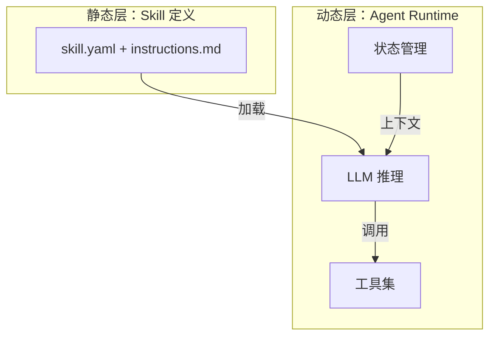
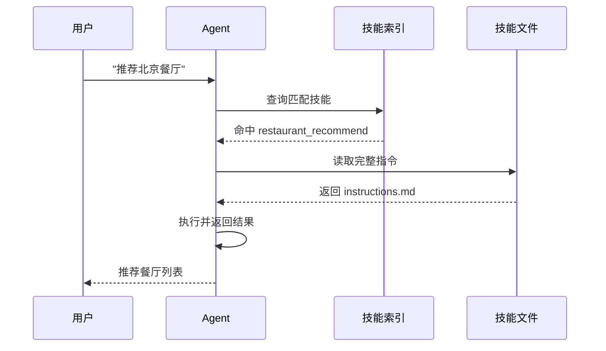

# 🔗 Agent-Skills 基础入门

> 📌 **核心主题**：解读 Agent Skills 技术范式的原理、实现路径与架构设计思路

---

## 📋 目录

- [一、从"应用商店"到"技能仓库"](#一从应用商店到技能仓库)
- [二、用 Markdown 驱动 AI：技能实现三部曲](#二用-markdown-驱动-ai技能实现三部曲)
- [三、拆解技能系统的工程内核](#三拆解技能系统的工程内核)

---

## 一、从"应用商店"到"技能仓库"

### 1. 🔄 一次发布引发的连锁反应

2026 年初，Anthropic 做了一件让资本市场震动的事——不是发布新模型，而是推出了一套**标准化技能包**。这些技能包覆盖了企业常见的业务场景：合同审核、数据报表、市场分析等。


投资者很快意识到一个问题：如果 AI 能通过加载技能直接完成专业任务，企业还需要每年花几万美元订阅专业软件吗？这个疑问直接反映在股价上——多家垂直领域 SaaS 公司当日跌幅超过 15%。

**背后的逻辑**：传统软件需要用户学界面、手动操作；而技能化 Agent 只需要一句自然语言指令，就能自动跑完整个流程。

**传统软件的困境**：拿合同审查来说，过去企业得采购专业软件（像 Harvey AI 或汤森路透），不光是每年几万美元的订阅成本，员工还得学那一套操作——导入文档、配置规则、逐条复核。而当 Agent 加载了合同审查技能之后，整个流程被压缩成三步：读文件 → 自动审查 → 输出报告，传统软件的 UI 层直接被跳过了。

### 2. 🏗️ 技能化范式的核心特征

**Agent Skills** 的本质，是把"写代码"降维成"写文档"。一份标准的技能文件，通常包含这些要素：

| 要素 | 作用 | 示例 |
|-----|------|------|
| **元数据** | 技能的"身份证" | 名称、版本、标签 |
| **触发条件** | 什么时候激活 | "当用户询问餐厅推荐时" |
| **执行步骤** | 具体操作流程 | 提取城市→调用API→格式化输出 |
| **示例对话** | 标准输入输出范例 | 帮助模型理解预期行为 |
| **约束条件** | 兜底策略 | "仅推荐评分4.0以上" |

这种设计让非技术人员也能参与 Agent 开发——只要能把业务流程写清楚，就能创建技能。产品经理可以定义"用户画像分析技能"，法务人员可以定义"合同风险审查技能"，运营人员可以定义"活动策划技能"。技能化范式真正让"人人都是 Agent 开发者"从口号变成了现实。

**技能文件的双重结构**：实际开发中，技能通常由两个文件组成：

- **skill.yaml**：机器可读的元数据定义，包含名称、版本、触发条件、依赖工具等结构化信息。Agent 通过读取这个文件来快速摸清技能的能力边界。
- **instructions.md**：人类可读的操作手册，包含详细的执行步骤、示例对话和注意事项。这是 Agent 执行任务时的"行动指南"。

为什么要这么拆？索引系统只需要解析轻量的 YAML 文件就行，完整内容只在真正需要的时候才加载，上下文窗口的占用就这么被控制住了。

**技能的生命周期**：一个完整的技能从诞生到退役，通常经历这些阶段：

1. **创建阶段**：开发者根据业务需求编写 skill.yaml 和 instructions.md
2. **测试阶段**：在沙箱环境中验证技能的触发准确性和执行效果
3. **发布阶段**：通过审核后发布到技能仓库，供其他用户使用
4. **迭代阶段**：根据用户反馈持续优化技能的指令和逻辑
5. **退役阶段**：当技能不再适用时，标记为废弃并从索引中移除

### 3. 🌐 两种生态路线

当前的 Agent Skills 生态走出了两条截然不同的路：

**封闭路线（Claude Skills）**：
- 由 Anthropic 官方维护
- 深度集成在 Claude 产品中
- 标准化程度高，但扩展受限

**开放路线（OpenClaw）**：
- 开源社区驱动
- 技能仓库 ClawHub 已积累数万个技能
- 支持自托管和私有化部署


两种路线各有优劣，怎么选取决于企业的具体需求：追求稳定性选封闭路线，追求灵活性选开放路线。

**开放生态的一个杀手特性**：OpenClaw 引入了**自主技能提炼**——用户让 Agent 干完一件复杂任务后，可以让 Agent 把刚才的操作步骤、Prompt 策略、API 调用逻辑自动打包成标准的 Skill 文件。"用着用着就把技能开发了"，这种模式大幅降低了技能创建的门槛，也让生态滚起了雪球。

### 4. 📊 与其他技术方案的差异

开发者常问：Agent Skills 和 Function Calling、MCP 有啥区别？

**简明对比：**

| 维度 | Function Calling | MCP | Agent Skills |
|-----|-----------------|-----|-------------|
| **抽象层级** | 函数级 | 协议级 | 业务流程级 |
| **定义语言** | JSON Schema | TypeScript/Python | Markdown |
| **目标用户** | 后端工程师 | 全栈工程师 | 所有人 |
| **典型场景** | 调用单个API | 连接外部系统 | 完整业务流程 |
| **容错能力** | 参数严格匹配 | 协议约束 | 大模型自动补全 |

**打个比方**：
- Function Calling 像"螺丝刀"——功能单一但精准
- MCP 像"万能转接头"——解决连接问题
- Agent Skills 像"操作手册"——告诉 AI 整个流程怎么走

**三者并非互斥，而是互补**：在实际的 Agent 系统中，Skills 负责编排业务流程，MCP 负责连接外部工具，Function Calling 负责执行具体的函数调用。它们共同构成了完整的 Agent 技术栈。


---

## 二、用 Markdown 驱动 AI：技能实现三部曲

### 1. 🎯 Step 1：验证裸机状态

在加载任何技能之前，先测一下 Agent 的"裸跑"能力——也就是它不借助任何技能时能做到什么程度。

```python
from langchain_openai import ChatOpenAI

llm = ChatOpenAI(model="gpt-4o")
response = llm.invoke("推荐一家北京适合商务宴请的餐厅")

print(response.content)
# 输出：抱歉，我无法获取实时餐厅信息，因为我没有联网能力...
```

这段代码揭示了一个基本事实：基础模型虽然知识面很广，但遇到需要实时数据的任务就抓瞎了。这种"裸机状态"的局限性，恰恰是 Agent Skills 存在的意义——通过技能注入，Agent 可以瞬间获得原本不具备的能力，比如联网搜索、数据库查询、文件处理等。

### 2. 📝 Step 2：创建技能文件

接下来，我们创建一个**餐厅推荐技能**。整个过程不需要写一行 Python 代码，只需要两个文本文件。

**目录结构：**

```
skills/
└── restaurant_recommend/
    ├── skill.yaml          # 技能元数据定义
    └── instructions.md     # 技能操作手册
```

**文件命名规范**：技能文件夹名称用小写字母和下划线，简洁地表达技能功能就好。两个核心文件的名字是固定的——`skill.yaml` 和 `instructions.md`，Agent 运行时会按这个约定来发现和加载技能。

**skill.yaml — 技能元数据：**

```yaml
apiVersion: "v1"
kind: "Skill"

metadata:
  name: "restaurant_recommend"
  version: "1.0.0"
  description: "根据用户需求推荐合适的餐厅"

spec:
  triggers:
    - intent: "restaurant_query"
      patterns:
        - "推荐.*餐厅"
        - ".*吃什么.*"
        - ".*聚餐.*"

  requiredTools:
    - name: "search_engine"

  io:
    inputs:
      - name: "city"
        type: "string"
      - name: "occasion"
        type: "string"
        description: "用餐场景：商务/朋友/家庭"
```

**instructions.md — 操作流程：**

```markdown
# 餐厅推荐技能

## 场景
用户需要餐厅推荐时使用此技能。

## 执行步骤

1. **解析需求**
   - 提取城市、用餐场景、预算等关键信息
   - 示例："北京商务宴请" → 城市=北京, 场景=商务

2. **搜索信息**
   - 使用搜索引擎查询："{城市} {场景}餐厅推荐 2026"
   - 重点关注：环境、菜品特色、人均消费

3. **筛选排序**
   - 优先推荐评分4.0以上的餐厅
   - 根据场景匹配：商务选环境安静的，朋友聚会选氛围活跃的

4. **格式化输出**
   - 每家餐厅包含：名称、地址、人均、推荐理由
   - 最多推荐3家，避免选择困难

## 示例

**用户**：北京有什么适合商务宴请的地方？

**助手**：为您推荐3家北京商务宴请餐厅：

1. **新荣记（金融街店）**
   - 地址：西城区金融大街甲9号
   - 人均：800元
   - 推荐理由：米其林二星，环境私密，服务专业

2. **大董（工体店）**
   - 地址：朝阳区工人体育场东路
   - 人均：600元
   - 推荐理由：烤鸭名店，商务包间充足

3. **厉家菜（德胜门总店）**
   - 地址：西城区德胜门内大街
   - 人均：1000元
   - 推荐理由：宫廷菜传承，适合高端宴请

## 注意事项
- 不推荐需要提前很久预约的餐厅
- 如信息不确定，明确告知用户
```

### 3. ✅ Step 3：测试技能效果

技能文件写好了，不用重启服务，直接测：

```python
from core.agent import SkillfulAgent

agent = SkillfulAgent(
    model_name="gpt-4o",
    skills_dir="./skills",
)

result = agent.invoke("推荐一家北京适合商务宴请的餐厅")
print(result)
# 输出：为您推荐3家北京商务宴请餐厅：
# 1. 新荣记（金融街店）...
# 2. 大董（工体店）...
# 3. 厉家菜（德胜门总店）...
```


**执行流程解析**：当用户输入"推荐一家北京适合商务宴请的餐厅"时，Agent 内部的运转过程是这样的：

1. **意图识别**：Agent 分析用户输入，识别出"餐厅推荐"意图
2. **技能匹配**：在技能索引里查找匹配的技能，命中 restaurant_recommend
3. **内容加载**：读取 instructions.md 的完整内容，注入到上下文中
4. **指令遵循**：LLM 按照 instructions.md 中的步骤执行：解析需求→搜索信息→筛选排序→格式化输出
5. **结果返回**：生成符合示例格式的餐厅推荐列表

整个过程 1-2 秒就跑完了。用户感知到的是"Agent 懂餐厅推荐"，但其实 Agent 只是在忠实执行 instructions.md 里的指令——有点像一个刚入职的新人，拿到了一份写得特别详细的 SOP。

### 4. 💡 三个关键洞察

通过上面的演示，可以提炼出 Agent Skills 的三个核心优势：

**洞察一：文档即代码**

传统开发得写 `class RestaurantService`，定义 API 接口，处理异常……现在一份 Markdown 文档就搞定了。这种"降维"让产品经理、运营人员也能参与 Agent 能力的构建。

**洞察二：热插拔架构**

技能文件是独立的静态资源，改完立即生效，不用重新部署。想象一下：传统软件改一个功能得走"开发→测试→部署"的流程，少说几天；而技能化架构只需要改 Markdown 文件，几秒钟就能上线。

**洞察三：上下文按需加载**

系统不会把所有技能一股脑塞进去，而是根据用户输入动态匹配。这样既省了 Token，也避免了"注意力稀释"——模型不会被一堆无关信息搞得晕头转向。


---

## 三、拆解技能系统的工程内核

### 1. 🏛️ 运行时与业务逻辑的分离

从工程角度看，Agent Skills 系统的核心设计原则是**高内聚、低耦合**。

**两个核心组件：**

- **Skill（静态层）**：业务逻辑的定义文件，本身不具备执行能力。可以理解为一份"待执行的计划"，只有被 Runtime 加载后才能干活。
- **Runtime（动态层）**：提供推理引擎、工具接口、状态管理。它是 Skill 的"执行引擎"，负责把自然语言指令变成实际操作。

**关键约束**：Skill 必须基于 Runtime 已有的工具集来编写。如果 Runtime 压根没有"搜索引擎"工具，那 Skill 里写的"搜索餐厅"步骤就是一纸空文。这种约束保证了技能的可执行性——Skill 不是空中楼阁，而是建立在实际能力之上的编排逻辑。



### 2. ⚙️ 上下文加载的工程挑战

**核心问题**：假设有 500 个技能，每个平均 2KB，直接塞进 System Prompt 就是 1MB 的 Token——贵不说，还会拉低模型的推理质量。

**为什么不能全量加载？**

除了成本问题，还有一个更隐蔽的坑——**注意力稀释**（Attention Dilution）。研究表明，上下文一长，模型对中间位置信息的注意力就会明显下降，也就是业界常说的"Lost in the Middle"现象。要是把 500 个技能的完整说明全塞进去，模型很可能在关键时刻"走神"，漏掉真正需要的那个技能。

**解决方案：索引 + 按需加载**



**实现要点：**

1. **索引层**：System Prompt 只保留技能名称和简要描述（通常 50-100 字），相当于一本"目录"，Agent 靠它快速检索
2. **触发机制**：通过 Function Calling 的 `read_file` 动态加载完整技能内容，做到 Just-in-Time 注入
3. **生命周期**：任务完成后清理上下文，释放 Token 空间，防止累积

### 3. 🔀 编排层与执行层的边界

设计 Skill 的时候，必须把"指导"和"执行"的职责分清楚：

| 层级 | 职责 | 载体 | 特点 |
|-----|------|------|------|
| **编排层** | 定义流程、决策逻辑 | Skill 文件 | 声明式、易修改 |
| **执行层** | 提供原子能力 | Agent Runtime | 命令式、可扩展 |

**设计原则**：编排层是对执行层能力的**组合与调度**。Skill 里的每一个步骤，都必须对应执行层的一个或多个原子工具。

**举个具体的例子**：假设有一个"数据分析技能"，它的 instructions.md 里写了"使用 Python 执行数据清洗"。这句话能跑起来的前提是：Agent Runtime 已经集成了 Python 代码执行工具（比如 code_interpreter）。要是 Runtime 没有这个工具，那这个技能就是纸上谈兵。

这种依赖关系是单向的：Skill 依赖 Runtime 的工具集，但 Runtime 不依赖任何具体的 Skill。这种设计保证了 Runtime 的通用性——它可以加载任意符合规范的 Skill，不用为每个 Skill 做特殊适配。


### 4. 🔌 双向协议对齐

Agent 和 Skill 之间需要一套标准化的交互协议：

**Agent 端需要提供：**

- **工具调用能力**：HTTP 请求、文件读写、数据库连接等原子工具
- **上下文管理机制**：动态加载/卸载 Skill，控制 Token 消耗
- **安全沙箱**：限制敏感操作，防止恶意指令执行
- **状态持久化**：保存任务进度，支持断点续传

**Skill 端需要遵循：**
- **能力感知**：基于可用工具集编写 SOP，不调用不存在的工具
- **格式统一**：遵循 `skill.yaml` + `instructions.md` 的标准结构
- **触发明确**：提供清晰的触发条件和意图匹配模式
- **幂等设计**：相同输入产生相同输出，方便调试和重试

**协议对齐的意义**：这种双向约束确保了技能的可移植性——一个符合规范的 Skill，可以跑在任何支持该协议的 Agent Runtime 上，不用改代码。


### 5. 💼 开发者的核心价值

既然技能化范式这么"简单"，那还需要专业开发者干嘛？

**因为通用方案搞不定所有场景。**

Agent Skills 擅长处理**标准化、流程化**的任务（像合同审核、数据报表这类）。但碰上**高度专业化**的领域（比如高频交易、编译器开发），还是得靠人：

- **专用的原子工具**：交易接口、编译器、高性能计算库
- **针对性的模型微调**：让模型真正理解领域术语和逻辑
- **领域特定的安全策略**：金融领域的合规审查、医疗领域的隐私保护

**典型场景对比**：

| 场景 | 通用 Agent + Skills | 垂域 Agent |
|-----|-------------------|-----------|
| 日常合同审核 | ✅ 足够 | 过度设计 |
| 高频交易系统 | ❌ 延迟不可接受 | ✅ 必要 |
| 通用客服问答 | ✅ 高效 | 成本过高 |
| 医疗影像诊断 | ❌ 精度不足 | ✅ 必须 |

**这正是大模型工程师的定位**：基于 Agent Skills 范式，为特定业务场景设计和实现完整的智能体系统——包括工具层、编排层和领域知识层。通用方案解决了 80% 的场景，剩下那 20% 的硬骨头，才是专业开发者真正发力的地方。

**工程师的三个核心任务**：

1. **工具层建设**：开发和维护领域专用的原子工具，比如金融行情接口、医疗影像处理库、工业控制系统接口等
2. **技能层设计**：把领域专家的知识和经验转化为标准化的 Skill 文件，保证指令的准确性和可执行性
3. **运行时优化**：针对特定场景优化 Agent 的推理效率、响应延迟和资源消耗

这三个任务构成了 Agent 时代工程师的核心能力模型，也是从"会用 AI"到"能驾驭 AI"的关键一步。

---

## 📚 术语速查

| 术语 | 解释 |
|-----|------|
| Agent Skill | 封装业务逻辑的标准化单元，通常由 YAML 元数据和 Markdown 指令组成 |
| SOP | Standard Operating Procedure，标准作业程序，定义任务的执行步骤 |
| Context Engineering | 管理和优化 LLM 上下文的技术，核心目标是控制 Token 消耗 |
| Lazy Loading | 按需加载，避免一次性加载所有资源，是技能系统的关键优化策略 |
| Atomic Tool | 执行单一功能的底层工具，如 HTTP 请求、文件读写等 |
| Lost in the Middle | 上下文过长时，模型对中间位置信息注意力下降的现象 |
| Just-in-Time (JIT) | 即时注入，在需要时才加载技能内容，而非预加载所有技能 |

---

## 🔗 延伸阅读

- [Anthropic Claude Skills](https://www.claude.com/skills) - Claude 原生技能系统
- [OpenClaw GitHub](https://github.com/openclaw) - 开源 Agent Skills 实现

## 全套公开课课件领取：


## DXZY.AI

DXZY.AI - 专注于 AI、RAG、Agent、MCP


- GitHub: https://github.com/dxzyai/agent-dev-guide
- 官网: https://dxzy.ai
  
