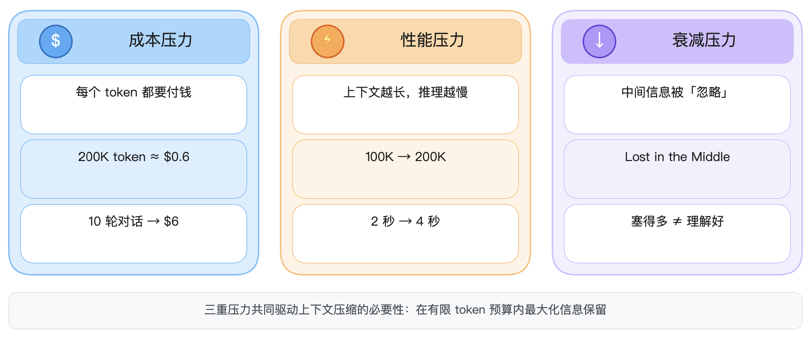
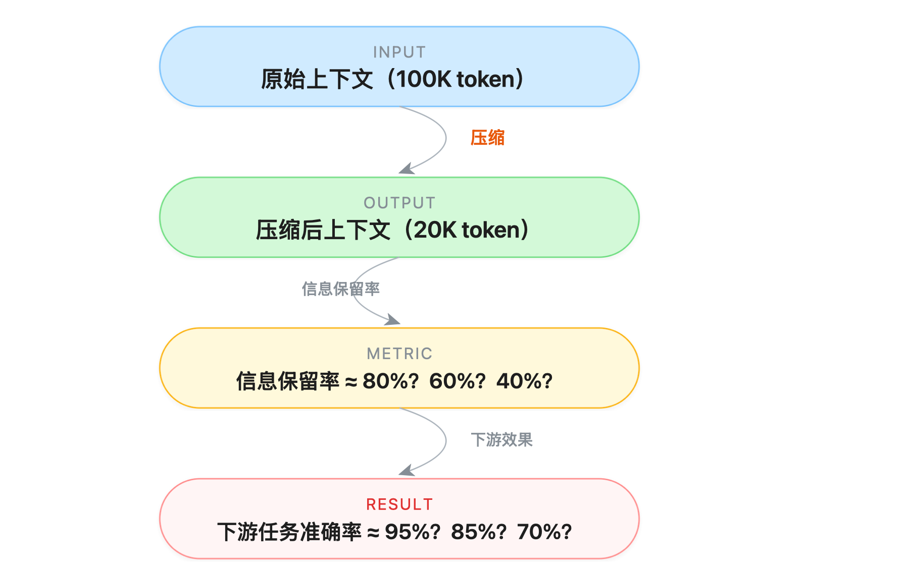
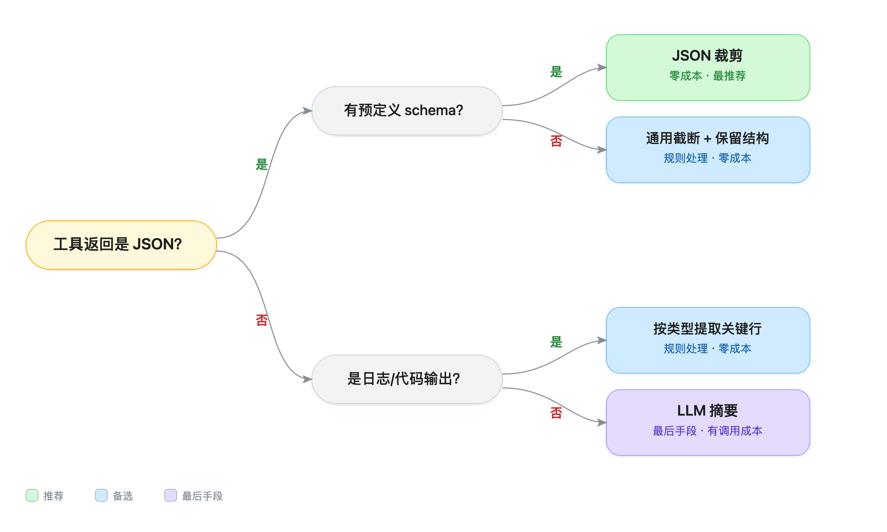
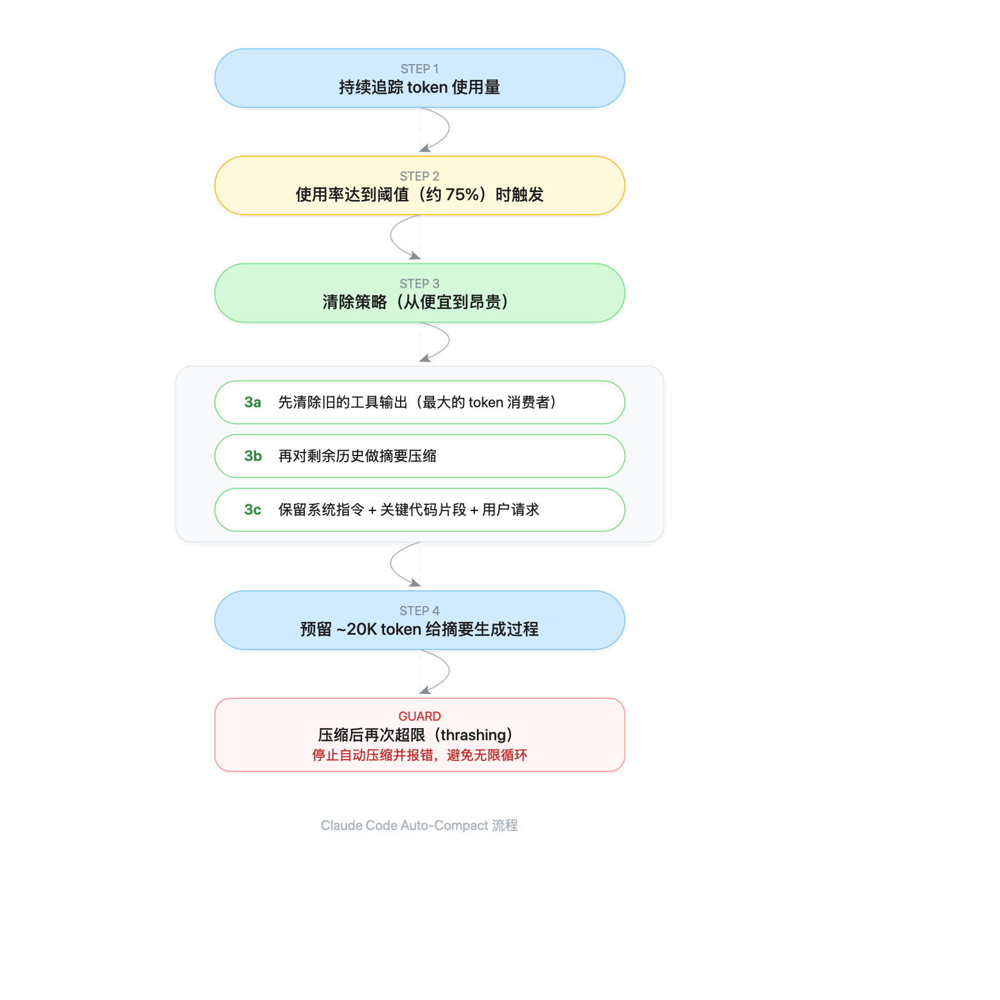

# 上下文压缩实战：对话历史与工具输出的压缩策略与工程实现

> **一句话定位**：第 1 篇讲了上下文工程的全景（Write/Select/Compress/Isolate），本篇聚焦 Compress 策略的工程实现——怎么压、压什么、什么时候压、压完怎么评估。

---

## 一、为什么需要上下文压缩

### 1.1 大白话解释

想象你在给一个特别聪明但记忆力有限的同事做工作汇报。你已经聊了三个小时，他不可能把每句话都记住。最好的办法是什么？把前面聊的内容**整理成一份摘要**，让他快速回顾关键结论，然后继续后面的话题。

上下文压缩就是这个"整理摘要"的过程——用更少的 token 保留尽可能多的关键信息。

### 1.2 三重压力



> ▲ 三重压力：① 成本压力（token 计费）→ ② 性能压力（延迟增长）→ ③ 衰减压力（注意力失焦）

**成本压力**：以 Claude Sonnet 为例，输入 $3/百万 token，输出 $15/百万 token。一个 200K token 的上下文单次输入就要 $0.6。如果 Agent 每轮都带上完整历史，10 轮对话就是 $6 纯输入成本。

**性能压力**：上下文越长，模型处理越慢。对用户体验来说，延迟从 2 秒变成 4 秒是感知明显的退化。

**衰减压力**：斯坦福和伯克利的研究证实了 Lost in the Middle 效应——LLM 对输入开头和结尾的注意力最强，中间部分准确率可降低 30%+。塞得越多不等于理解得越好。

### 1.3 压缩的本质

压缩的本质是一个**信息论问题**：在有限的 token 预算内，最大化保留对下游任务有用的信息。



> ▲ 压缩的本质：① 原始上下文 100K token → ② 压缩至 20K token → ③ 信息保留率 40%-80% → ④ 下游准确率 70%-95%

关键指标是**压缩比**和**信息保留率**的平衡。一味追求高压缩比会导致信息丢失，反而让模型回答质量下降——那就得不偿失了。

---

## 二、对话历史压缩

对话历史是上下文压缩最主要的对象。一个 Agent 对话 20 轮后，历史可能占到上下文的 60%+。

### 2.1 三种主流策略

| 策略 | 原理 | 压缩比 | 信息保留 | 实现复杂度 |
|------|------|--------|---------|-----------|
| **摘要式压缩** | 用 LLM 把历史对话总结成摘要 | 5:1 ~ 10:1 | 高（语义级） | 中（需额外 LLM 调用） |
| **滑动窗口** | 只保留最近 N 轮，丢弃更早的 | ∞:1（直接丢弃） | 低（丢失全部历史） | 低（零成本） |
| **分层保留** | 近期全量 + 中期摘要 + 远期丢弃 | 3:1 ~ 5:1 | 中-高 | 中 |

### 2.2 摘要式压缩

**大白话**：请另一个 LLM（或同一个 LLM）读完历史对话，写一段摘要替代原文。

```python
def summarize_conversation(messages: list[dict], model="claude-sonnet") -> str:
    """将对话历史压缩为摘要"""
    prompt = """请将以下对话历史压缩为结构化摘要。
    要求：
    1. 保留所有关键决策和结论
    2. 保留用户的核心需求和偏好
    3. 保留提到的具体数据（数字、日期、名称）
    4. 丢弃寒暄、重复确认、已废弃的讨论
    5. 控制在原文 1/5 以内
    
    对话历史：
    {history}
    """.format(history=format_messages(messages))
    
    return call_llm(prompt, model=model)
```

**优点**：信息保留质量高，能抓住语义核心。

**缺点**：
- 需要一次额外的 LLM 调用（摘要本身也要花钱）
- 摘要可能引入幻觉（总结出原文没有的信息）
- 摘要的粒度不好控制——太粗丢细节，太细不省钱

**工程实践**：Claude Code 的 auto-compact 就是这种策略的典型实现。它会在上下文达到阈值时自动触发摘要，把旧对话替换为一段压缩文本。

### 2.3 滑动窗口

**大白话**：只看最近 N 轮对话，更早的一概不管。就像你翻聊天记录只看最近的屏幕。

```python
class SlidingWindowCompressor:
    def __init__(self, window_size: int = 10):
        self.window_size = window_size  # 保留最近 N 轮
    
    def compress(self, messages: list[dict]) -> list[dict]:
        # 保留系统消息（永远不丢）
        system_msgs = [m for m in messages if m["role"] == "system"]
        # 取最近 N 轮
        recent = [m for m in messages if m["role"] != "system"][-self.window_size:]
        return system_msgs + recent
```

**优点**：零成本，实现极简，延迟为零。

**缺点**：直接丢失所有历史信息。如果用户在第 3 轮提过一个重要需求，第 15 轮模型就不知道了。

**适用场景**：短任务、信息时效性强的场景（如客服单次咨询）。不适合需要长程记忆的 Agent 任务。

### 2.4 分层保留

**大白话**：像整理笔记一样——最新的内容逐字记录，上周的内容写成要点，上个月的只记结论。

这是目前工程实践中最推荐的策略，因为它在成本和信息保留之间取得了最好的平衡。

```python
class HierarchicalCompressor:
    """分层保留策略：近期全量 + 中期摘要 + 远期丢弃"""
    
    def __init__(self, full_window=10, summary_window=20):
        self.full_window = full_window      # 最近 10 轮：全量保留
        self.summary_window = summary_window # 10-30 轮：保留摘要
        # 30 轮以前：丢弃（或写入外部记忆）
    
    def compress(self, messages: list[dict], 
                 existing_summary: str = "") -> tuple[list[dict], str]:
        system_msgs = [m for m in messages if m["role"] == "system"]
        user_msgs = [m for m in messages if m["role"] != "system"]
        
        total = len(user_msgs)
        
        if total <= self.full_window:
            return messages, existing_summary
        
        # 层 1：远期 → 摘要压缩
        old_messages = user_msgs[:total - self.full_window - self.summary_window]
        mid_messages = user_msgs[total - self.full_window - self.summary_window:total - self.full_window]
        recent_messages = user_msgs[total - self.full_window:]
        
        # 层 2：中期 → 摘要（如果有的话）
        if old_messages:
            new_summary = summarize_with_context(old_messages, existing_summary)
        else:
            new_summary = existing_summary
        
        # 层 3：组装最终上下文
        result = system_msgs.copy()
        if new_summary:
            result.append({
                "role": "system",
                "content": f"[历史摘要]\n{new_summary}"
            })
        result.extend(mid_messages)  # 中期全量保留
        result.extend(recent_messages)  # 近期全量保留
        
        return result, new_summary
```

这个策略的关键工程细节：

1. **摘要要增量更新**：不是每次都重新总结全部历史，而是把新丢弃的轮次摘要合并到已有摘要中
2. **系统消息永远保留**：系统提示是模型行为的基础，不能被压缩掉
3. **摘要放在合适的位置**：放在系统消息之后、近期对话之前，确保模型能看到

### 2.5 Factory 的锚定摘要方案

Factory.ai 在 2025 年分享了一种工程实践——**锚定摘要（Anchored Summary）**：

- 维护一份持久化的对话摘要（rolling summary）
- 当需要压缩时，只对新丢弃的轮次做摘要
- 将新摘要合并到已有的滚动摘要中

```python
class AnchoredSummaryCompressor:
    """Factory 风格的锚定摘要压缩器"""
    
    def __init__(self):
        self.rolling_summary = ""
        self.last_compact_index = 0
    
    def compact(self, messages: list[dict], target_size: int):
        # 找到需要丢弃的消息范围
        current_size = count_tokens(messages)
        if current_size <= target_size:
            return messages
        
        # 计算需要丢弃多少轮
        to_drop = self._calculate_drop_count(messages, target_size)
        dropped_messages = messages[self.last_compact_index:self.last_compact_index + to_drop]
        
        # 只对新丢弃的部分做摘要
        new_segment_summary = summarize_segment(dropped_messages)
        
        # 合并到滚动摘要
        self.rolling_summary = merge_summaries(
            self.rolling_summary, new_segment_summary
        )
        self.last_compact_index += to_drop
        
        # 重组上下文
        return self._rebuild_context(messages[self.last_compact_index:])
```

---

## 三、工具输出压缩

Agent 的另一个 token 大户是**工具输出**。一次 API 调用返回的 JSON 可能就有几千甚至几万 token，但其中真正有用的信息可能只有一小部分。

### 3.1 大白话解释

你调了一个天气 API，它返回了温度、湿度、风速、气压、紫外线指数、日出日落时间、未来 7 天预报……但用户只是问"今天要不要带伞"。你需要的只是"降水概率"这一个字段。

工具输出压缩就是**从海量返回数据中只提取模型此刻需要的信息**。

### 3.2 三种压缩手段

| 手段 | 原理 | 成本 | 压缩比 | 适用场景 |
|------|------|------|--------|---------|
| **JSON 裁剪** | 预定义保留字段，删除其余 | 零（规则处理） | 3:1 ~ 20:1 | 结构化 API 返回 |
| **字段提取** | 用 JSONPath/正则提取关键值 | 零（规则处理） | 10:1 ~ 50:1 | 只需要少量字段 |
| **LLM 摘要** | 用模型总结工具输出的含义 | 中（LLM 调用） | 5:1 ~ 15:1 | 非结构化或复杂输出 |

### 3.3 JSON 裁剪

**最常见的工具输出压缩方式**。定义一个 schema，只保留需要的字段。

```python
import json
from typing import Any

# 定义每个工具的输出裁剪规则
TOOL_OUTPUT_SCHEMAS = {
    "get_weather": {
        "keep": ["temperature", "condition", "precipitation_probability"],
        "flatten": True  # 嵌套结构展平
    },
    "search_products": {
        "keep": ["results[].name", "results[].price", "total_count"],
        "max_results": 3  # 最多保留 3 条结果
    },
    "get_user_profile": {
        "keep": ["name", "email", "membership_level"],
        "drop_null": True
    }
}

def compress_tool_output(tool_name: str, raw_output: Any) -> str:
    """根据预定义规则裁剪工具输出"""
    schema = TOOL_OUTPUT_SCHEMAS.get(tool_name)
    if not schema:
        # 没有裁剪规则，做通用压缩
        return generic_truncate(json.dumps(raw_output, ensure_ascii=False))
    
    result = extract_fields(raw_output, schema["keep"])
    
    if schema.get("max_results") and isinstance(result, dict):
        for key in result:
            if isinstance(result[key], list):
                result[key] = result[key][:schema["max_results"]]
    
    return json.dumps(result, ensure_ascii=False, indent=2)

# 示例
raw = {
    "temperature": 25, "humidity": 60, "wind_speed": 12,
    "pressure": 1013, "uv_index": 6, "sunrise": "06:30",
    "sunset": "19:45", "precipitation_probability": 30,
    "air_quality": {"pm25": 35, "pm10": 52, "aqi": 78},
    "forecast_7day": [...]  # 几千 token 的 7 天预报
}

print(compress_tool_output("get_weather", raw))
# 输出：{"temperature": 25, "condition": null, "precipitation_probability": 30}
# 从 ~2000 token 压缩到 ~50 token
```

### 3.4 通用截断策略

当没有预定义 schema 时，需要通用的截断逻辑：

```python
def generic_truncate(text: str, max_tokens: int = 2000, 
                     strategy: str = "head_tail") -> str:
    """通用截断策略"""
    estimated_tokens = len(text) // 4  # 粗略估算
    
    if estimated_tokens <= max_tokens:
        return text
    
    if strategy == "head_tail":
        # 保留头部和尾部，中间用省略标记
        head_size = max_tokens * 2 // 3
        tail_size = max_tokens // 3
        return (
            text[:head_size * 4] + 
            f"\n\n[... 省略 {estimated_tokens - max_tokens} tokens ...]\n\n" +
            text[-tail_size * 4:]
        )
    
    elif strategy == "head_only":
        return text[:max_tokens * 4] + "\n[... 截断 ...]"
    
    elif strategy == "smart":
        # 尝试在 JSON 结构边界截断
        return truncate_at_json_boundary(text, max_tokens * 4)
```

### 3.5 代码输出压缩

Agent 执行代码后返回的输出（如测试结果、编译日志）往往很长但信息密度低：

```python
def compress_code_output(output: str, output_type: str = "generic") -> str:
    """压缩代码执行输出"""
    lines = output.strip().split("\n")
    
    if output_type == "test_result":
        # 测试输出：只保留摘要行和失败用例
        summary_lines = [l for l in lines if any(k in l.lower() 
                         for k in ["passed", "failed", "error", "total", "summary"])]
        error_lines = [l for l in lines if "error" in l.lower() or "fail" in l.lower()]
        return "\n".join(summary_lines + ["--- 失败详情 ---"] + error_lines[-10:])
    
    elif output_type == "build_log":
        # 构建日志：只保留错误和警告
        important = [l for l in lines if any(k in l.lower() 
                     for k in ["error", "warning", "fatal", "failed"])]
        if len(important) > 20:
            important = important[:10] + ["..."] + important[-10:]
        return "\n".join(important) if important else "构建成功，无错误。"
    
    else:
        # 通用：截断
        if len(lines) > 50:
            return "\n".join(lines[:25] + [f"\n[... 省略 {len(lines)-50} 行 ...]\n"] + lines[-25:])
        return output
```

### 3.6 工具输出压缩的工程建议



> ▲ 工具输出压缩决策树：① JSON → schema 裁剪 / 通用截断 → ② 非 JSON → 提取关键行 / LLM 摘要

---

## 四、代码上下文压缩

代码 Agent（如 Claude Code、Cursor、Devin）面临的压缩挑战独特：代码既是结构化的（有语法树），又是高密度的（一个字符的差异可能导致完全不同的行为）。

### 4.1 大白话解释

你不需要把整个 500 行的文件都给模型看。如果模型只需要了解这个文件"有什么函数、每个函数做什么"，那给一个目录式的摘要就够了。就像你找一本书里的某个知识点——先看目录，找到章节，再翻那几页。

### 4.2 三种代码压缩策略

| 策略 | 输入 | 输出 | 压缩比 | 适用场景 |
|------|------|------|--------|---------|
| **AST 摘要** | 源代码文件 | 函数/类签名 + docstring | 5:1 ~ 20:1 | 了解代码结构 |
| **Diff 压缩** | 完整文件变更 | 只保留变更部分 + 上下文 | 3:1 ~ 10:1 | 代码审查、变更追踪 |
| **函数签名提取** | 代码库 | 所有公开 API 的签名 | 10:1 ~ 50:1 | API 参考、集成开发 |

### 4.3 AST 摘要

用抽象语法树（AST）提取代码的结构信息，丢弃实现细节：

```python
import ast

class CodeSummarizer(ast.NodeVisitor):
    """从 Python 源代码提取结构摘要"""
    
    def __init__(self):
        self.summary = []
    
    def visit_FunctionDef(self, node):
        # 提取函数签名
        args = [a.arg for a in node.args.args]
        decorators = [ast.dump(d) for d in node.decorator_list]
        
        # 提取 docstring
        docstring = ast.get_docstring(node) or "无文档"
        
        self.summary.append({
            "type": "function",
            "name": node.name,
            "args": args,
            "decorators": decorators,
            "docstring": docstring[:200],  # 截断过长的 docstring
            "line": node.lineno
        })
        # 不调用 generic_visit，跳过函数体
    
    def visit_ClassDef(self, node):
        docstring = ast.get_docstring(node) or "无文档"
        self.summary.append({
            "type": "class",
            "name": node.name,
            "bases": [ast.dump(b) for b in node.bases],
            "docstring": docstring[:200],
            "line": node.lineno
        })
        self.generic_visit(node)  # 继续遍历类的方法

def summarize_code_file(source: str) -> str:
    """将源代码压缩为结构摘要"""
    tree = ast.parse(source)
    summarizer = CodeSummarizer()
    summarizer.visit(tree)
    
    result = []
    for item in summarizer.summary:
        if item["type"] == "function":
            result.append(f"def {item['name']}({', '.join(item['args'])})")
            result.append(f"  # {item['docstring']}")
        elif item["type"] == "class":
            result.append(f"class {item['name']}:")
            result.append(f"  # {item['docstring']}")
    
    return "\n".join(result)

# 一个 500 行的文件可能压缩成 20 行摘要
```

### 4.4 Diff 压缩

在代码审查场景中，不需要发送整个文件，只需要发送变更部分：

```python
def compress_diff(full_file: str, modified_file: str, 
                  context_lines: int = 3) -> str:
    """生成紧凑的 diff 摘要"""
    import difflib
    
    diff = list(difflib.unified_diff(
        full_file.splitlines(),
        modified_file.splitlines(),
        lineterm='',
        n=context_lines
    ))
    
    # 只保留变更块
    hunks = []
    current_hunk = []
    for line in diff:
        if line.startswith("@@"):
            if current_hunk:
                hunks.append("\n".join(current_hunk))
            current_hunk = [line]
        elif not line.startswith("---") and not line.startswith("+++"):
            current_hunk.append(line)
    
    if current_hunk:
        hunks.append("\n".join(current_hunk))
    
    return "\n\n".join(hunks)
```

### 4.5 项目级代码压缩

当模型需要理解整个项目时，可以生成项目骨架：

```python
import os

def generate_project_skeleton(root_dir: str, 
                               max_file_chars: int = 500) -> str:
    """生成项目骨架，用于让模型快速了解项目结构"""
    skeleton = []
    
    for dirpath, dirnames, filenames in os.walk(root_dir):
        # 跳过常见的无关目录
        dirnames[:] = [d for d in dirnames 
                       if d not in {'.git', 'node_modules', '__pycache__', '.venv'}]
        
        rel_path = os.path.relpath(dirpath, root_dir)
        skeleton.append(f"\n## {rel_path}/")
        
        for fname in sorted(filenames):
            fpath = os.path.join(dirpath, fname)
            size = os.path.getsize(fpath)
            
            skeleton.append(f"- {fname} ({size} bytes)")
            
            # 对 Python/JS 文件提取摘要
            if fname.endswith(('.py', '.ts', '.js')):
                try:
                    with open(fpath) as f:
                        content = f.read()
                    if len(content) < max_file_chars:
                        skeleton.append(f"  内容: {content[:max_file_chars]}")
                except Exception:
                    pass
    
    return "\n".join(skeleton)
```

---

## 五、压缩时机与触发策略

知道怎么压很重要，但**什么时候压**同样关键。压太早浪费信息，压太晚上下文已经爆了。

### 5.1 大白话解释

压缩时机就像手机内存管理——你不会每打开一个 App 就清理一次内存（太频繁影响体验），也不会等手机完全卡死才清理（来不及了）。你需要找到一个"水位线"，到了就自动清理。

### 5.2 三种触发策略

| 策略 | 触发条件 | 优点 | 缺点 |
|------|---------|------|------|
| **阈值触发** | 上下文使用率超过 N% | 可预测，易实现 | 可能在关键时刻打断 |
| **阶段边界** | 任务完成一个阶段时 | 不会打断正在进行的工作 | 依赖任务阶段识别 |
| **Auto-compact** | 系统自动判断 | 智能，自适应 | 行为不透明 |

### 5.3 阈值触发

最常见的策略。设置一个 token 使用率阈值（如 75%），超过就触发压缩。

```python
class ThresholdCompressor:
    """基于阈值的压缩触发器"""
    
    def __init__(self, threshold: float = 0.75, 
                 target_ratio: float = 0.5,
                 max_context_tokens: int = 200_000):
        self.threshold = threshold          # 触发阈值（75%）
        self.target_ratio = target_ratio    # 压缩目标（压到 50%）
        self.max_context = max_context_tokens
    
    def check_and_compact(self, messages: list[dict]) -> list[dict]:
        current_tokens = estimate_tokens(messages)
        usage_ratio = current_tokens / self.max_context
        
        if usage_ratio < self.threshold:
            return messages  # 未到阈值，不压缩
        
        # 计算目标 token 数
        target_tokens = int(self.max_context * self.target_ratio)
        
        # 触发分层压缩
        compressed = hierarchical_compress(messages, target_tokens)
        
        print(f"[Compact] {current_tokens} → {estimate_tokens(compressed)} tokens "
              f"({usage_ratio:.0%} → {estimate_tokens(compressed)/self.max_context:.0%})")
        
        return compressed
```

### 5.4 Claude Code 的 Auto-Compact 机制

Claude Code 的 auto-compact 是业界最成熟的自动压缩实现之一。根据公开信息，其工作机制如下：



> ▲ Claude Code Auto-Compact 流程：① 追踪 token → ② 75% 阈值触发 → ③ 分层清除（工具输出→摘要→保留核心）→ ④ 预留 20K 摘要空间 → ⑤ 防抖动保护

关键设计细节：

1. **提前触发**：不是等到 95% 才压缩，而是在 75% 左右就开始。这给了模型足够的"工作内存"来完成当前任务。
2. **预留摘要空间**：压缩过程本身需要 LLM 调用来生成摘要，所以要预留 20K token 给这个过程。
3. **防抖动**：如果压缩后很快又超限，说明单次上下文增长太快（比如一个巨大的工具输出），这时会停止压缩并报错，而不是陷入"压缩→膨胀→再压缩"的死循环。
4. **可控性**：用户可以用 `/compact` 命令手动触发，也可以用 `/compact focus on API changes` 指定摘要关注点。

### 5.5 阶段边界触发

在 Agent 工作流中，每个任务阶段的边界是天然的压缩点：

```python
class PhaseBoundaryCompressor:
    """在任务阶段边界触发压缩"""
    
    def __init__(self):
        self.phase_summaries = []
    
    def on_phase_complete(self, phase_name: str, messages: list[dict]):
        """当一个阶段完成时，压缩该阶段的历史"""
        # 为刚完成的阶段生成摘要
        phase_summary = summarize_phase(messages, phase_name)
        self.phase_summaries.append({
            "phase": phase_name,
            "summary": phase_summary,
            "timestamp": time.time()
        })
        
        # 保留摘要，丢弃原始消息
        return self._build_context_with_summaries()
    
    def _build_context_with_summaries(self) -> list[dict]:
        """用所有阶段摘要 + 最近的原始消息组装上下文"""
        context = []
        
        # 历史阶段摘要
        for ps in self.phase_summaries:
            context.append({
                "role": "system",
                "content": f"[阶段: {ps['phase']}]\n{ps['summary']}"
            })
        
        return context

# 使用示例
compressor = PhaseBoundaryCompressor()

# Agent 完成"需求分析"阶段
compressor.on_phase_complete("需求分析", analysis_messages)

# Agent 完成"方案设计"阶段
compressor.on_phase_complete("方案设计", design_messages)

# Agent 进入"编码实现"阶段时，上下文已经很精简了
```

### 5.6 压缩时机对比总结

```
触发时机选择：
│
├── 你的场景是长对话？ ──→ 阈值触发（简单可靠）
│
├── 你的场景是多阶段任务？ ──→ 阶段边界触发（最自然）
│
├── 你用的是 Claude Code？ ──→ 用它自带的 auto-compact
│
└── 你需要精细控制？ ──→ 组合策略：
    阶段边界做主动压缩 + 阈值触发做兜底保护
```

---

## 六、压缩质量评估

压缩做得好不好，不能只看 token 数量减少了多少。如果压缩后模型回答质量下降了，那还不如不压。

### 6.1 大白话解释

评估压缩质量就像评估"读书笔记"的质量——好的笔记能让你在考试时回忆起 90% 的知识点，差的笔记可能只覆盖了 50%。你需要一个方法来衡量笔记的质量。

### 6.2 两个核心指标

| 指标 | 含义 | 衡量方法 |
|------|------|---------|
| **信息保留率** | 压缩后的上下文保留了多少原始信息 | 用 QA 测试：在压缩后上下文上回答原始上下文能回答的问题 |
| **下游任务准确率** | 压缩后模型在目标任务上的表现 | A/B 测试：同一任务分别用原始和压缩上下文执行 |

### 6.3 信息保留率评估

```python
def evaluate_compression_quality(original_messages, compressed_messages, 
                                  test_questions: list[str]) -> dict:
    """评估压缩质量：在压缩前后分别回答测试问题"""
    
    results = {"original": [], "compressed": []}
    
    for question in test_questions:
        # 用原始上下文回答
        answer_orig = call_llm(
            system="根据以下对话历史回答问题，如果信息不足请说'无法确定'",
            context=original_messages,
            question=question
        )
        results["original"].append(answer_orig)
        
        # 用压缩上下文回答
        answer_comp = call_llm(
            system="根据以下对话历史回答问题，如果信息不足请说'无法确定'",
            context=compressed_messages,
            question=question
        )
        results["compressed"].append(answer_comp)
    
    # 计算一致性
    matches = sum(1 for o, c in zip(results["original"], results["compressed"]) 
                  if answers_match(o, c))
    retention_rate = matches / len(test_questions)
    
    return {
        "retention_rate": retention_rate,
        "token_reduction": 1 - estimate_tokens(compressed_messages) / estimate_tokens(original_messages),
        "details": results
    }
```

### 6.4 评估指标体系

| 维度 | 指标 | 公式/方法 | 目标值 |
|------|------|----------|--------|
| **压缩效率** | 压缩比 | 原始 token / 压缩后 token | ≥ 3:1 |
| **信息保留** | QA 保留率 | 正确回答数 / 总问题数 | ≥ 80% |
| **任务效果** | 下游准确率 | 压缩后任务准确率 / 原始准确率 | ≥ 90% |
| **成本节省** | Token 节省率 | 节省 token / 原始 token | ≥ 50% |
| **延迟影响** | 压缩耗时 | 从触发到完成的时间 | < 5 秒 |

### 6.5 实践建议

1. **建立测试集**：为你的场景准备 20-50 个测试问题，覆盖"必须记住的信息"和"可以丢弃的信息"
2. **A/B 测试**：对同一批用户请求，分别用原始和压缩上下文执行，比较输出质量
3. **监控压缩比**：如果压缩比突然变高（比如 10:1），可能是压缩过于激进，需要检查
4. **记录压缩日志**：每次压缩记录压缩前后 token 数、触发原因、压缩耗时，便于后续优化

---

## 七、主流框架的压缩实现

### 7.1 Claude Code Auto-Compact

**定位**：编码场景下最成熟的自动压缩实现。

**核心机制**（基于公开文档和社区分析）：

| 组件 | 说明 |
|------|------|
| **Token 计数** | 持续追踪上下文使用量，支持模型级别的窗口大小配置 |
| **阈值管理** | 多级警告（如 50%、75%、90%），约 75% 时触发自动压缩 |
| **清除策略** | 先清除旧工具输出 → 再做对话摘要 → 保留系统指令和关键代码 |
| **摘要空间** | 预留 20K token 给压缩过程本身 |
| **防抖动** | 检测 thrashing（压缩后立即再次超限），循环几次后停止并报错 |
| **用户控制** | `/compact` 手动触发，`/compact focus on X` 指定关注点 |
| **CLAUDE.md** | 可在 CLAUDE.md 中添加 "Compact Instructions" 段落，指导压缩行为 |

**关键设计决策**：

- **提前触发（75% 而非 95%）**：给模型留出充足的"工作内存"。研究和实践表明，上下文使用率越高，模型推理质量越差。在 75% 触发意味着模型总有 25%（约 50K token）的"呼吸空间"。
- **子 Agent 隔离**：子 Agent 有独立的上下文窗口，完成后返回精炼摘要。这意味着子任务的详细过程不会污染主上下文。

### 7.2 LangGraph 摘要节点

LangGraph 通过图节点实现可编程的压缩逻辑：

```python
from langgraph.graph import StateGraph
from typing import TypedDict

class AgentState(TypedDict):
    messages: list
    summary: str
    token_count: int

def should_compact(state: AgentState) -> str:
    """条件路由：是否需要压缩"""
    if state["token_count"] > 150_000:  # 阈值
        return "compact"
    return "continue"

def compact_node(state: AgentState) -> AgentState:
    """压缩节点"""
    new_summary = call_llm(
        f"将以下对话历史和已有摘要合并为新的摘要：\n"
        f"已有摘要：{state['summary']}\n"
        f"新对话：{format_messages(state['messages'][-20:])}"
    )
    return {
        "messages": state["messages"][-5:],  # 只保留最近 5 轮
        "summary": new_summary,
        "token_count": estimate_tokens(state["messages"][-5:]) + estimate_tokens(new_summary)
    }

# 构建带压缩节点的 Agent 图
graph = StateGraph(AgentState)
graph.add_node("agent", agent_node)
graph.add_node("compact", compact_node)
graph.add_conditional_edges("agent", should_compact, {
    "compact": "compact",
    "continue": "agent"
})
graph.add_edge("compact", "agent")
```

**优点**：压缩逻辑完全可控，可以与业务流程深度集成。

**缺点**：需要自己实现压缩逻辑和触发条件。

### 7.3 LangChain 内置压缩器

LangChain 提供了开箱即用的上下文压缩器：

```python
from langchain.retrievers import ContextualCompressionRetriever
from langchain.retrievers.document_compressors import LLMChainExtractor

# 用 LLM 从检索结果中提取与查询相关的部分
compressor = LLMChainExtractor.from_llm(llm)

compression_retriever = ContextualCompressionRetriever(
    base_compressor=compressor,
    base_retriever=vectorstore.as_retriever()
)

# 检索 + 压缩一步完成
compressed_docs = compression_retriever.invoke("退货政策是什么？")
# 原始检索返回 5 个文档片段，压缩后只保留与退货相关的部分
```

### 7.4 方案对比

| 方案 | 适用场景 | 压缩粒度 | 自动化程度 | 成本 |
|------|---------|---------|-----------|------|
| **Claude Code auto-compact** | 编码助手 | 对话级 | 全自动 | 低（内置） |
| **LangGraph 摘要节点** | 自定义 Agent | 任意 | 可编程 | 中（需开发） |
| **LangChain 压缩器** | RAG 检索结果 | 文档级 | 半自动 | 中（LLM 调用） |
| **自实现阈值触发** | 通用场景 | 任意 | 半自动 | 低 |
| **HippoRAG（记忆增强）** | 长期记忆检索 | 记忆级 | 半自动 | 中 |

---

## 八、参考资料

### 论文与研究
- **"Efficacy of Context Summarization Techniques on Large Language Models"**（2025）：对比了多种对话历史压缩技术的效果，FullContext 方法在压缩率和信息保留之间取得了最佳平衡
  https://www.diva-portal.org/smash/get/diva2:1886192/FULLTEXT01.pdf
- **"Context Rot" by Choma**（2025）：测试了 18 个最新模型在长上下文下的性能衰减
  https://cobusgreyling.substack.com/p/llm-context-rot
- **"Lost in the Middle"**（Stanford/Berkeley）：LLM 对输入中间部分注意力衰减的经典研究
  https://arxiv.org/abs/2307.03172

### 工程实践
- **Factory.ai "Compressing Context"**（2025）：锚定摘要（Anchored Summary）的工程实现
  https://factory.ai/news/compressing-context
- **Claude Code 官方文档**：auto-compact 机制、CLAUDE.md 配置、`/compact` 命令
  https://docs.anthropic.com/en/docs/claude-code/overview
- **Hyperdev "How Claude Code Got Better by Protecting More Context"**：Claude Code 压缩阈值从 90%+ 降至 75% 的分析
  https://hyperdev.matsuoka.com/p/how-claude-code-got-better-by-protecting
- **Ken Huang "Claude Code Pattern 6: Context Management at Scale"**：Claude Code 内部 token 管理机制的技术分析
  https://kenhuangus.substack.com/p/claude-code-pattern-6-context-management

### 框架与工具
- **LangGraph**：支持自定义压缩节点的 Agent 框架
  https://www.langchain.com/langgraph
- **LangChain ContextualCompressionRetriever**：内置的检索结果压缩器
  https://python.langchain.com/docs/how_to/contextual_compression/
- **Mem0**：智能记忆系统，支持自动压缩和检索
  https://github.com/mem0ai/mem0
- **HippoRAG**（2024）：受神经生物学启发的长期记忆框架，用于 LLM 的长期知识检索
  https://arxiv.org/abs/2405.14831

### 综合参考
- **Mem0 "LLM Chat History Summarization: Best Practices and Techniques"**（2025）：分层摘要策略的最佳实践
  https://mem0.ai/blog/llm-chat-history-summarization-guide-2025
- **Agenta.ai "Top 6 Techniques to Manage Context Lengths in LLMs"**：上下文管理策略的综合对比
  https://agenta.ai/blog/top-6-techniques-to-manage-context-length-in-llms
- **Medium "Consolidation vs. Summarization vs. Distillation in LLM Context Compression"**：三种压缩范式的对比分析——合并（20-50% 压缩）、摘要（60-90% 压缩）、蒸馏（80-95% 压缩）
  https://medium.com/@RLavigne42/consolidation-vs-summarization-vs-distillation-in-llm-context-compression-c96fa5956057
