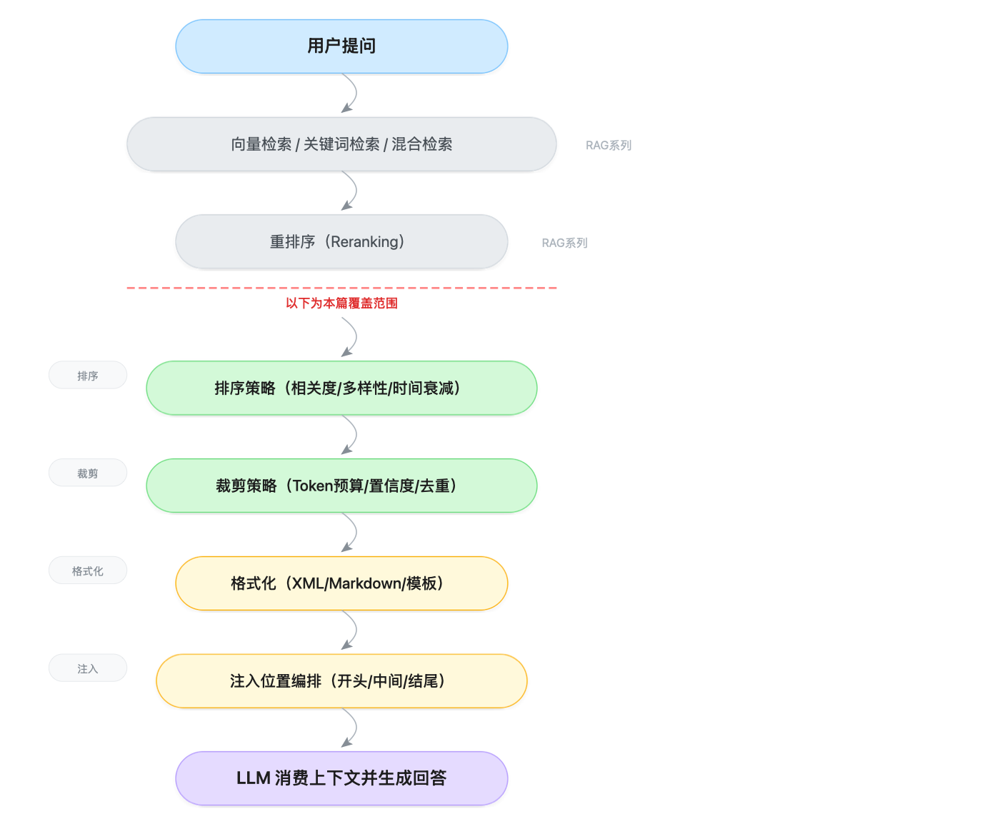
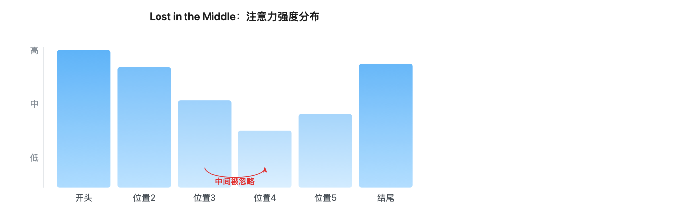
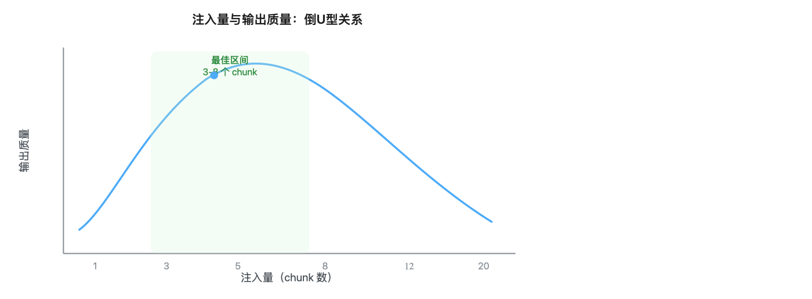
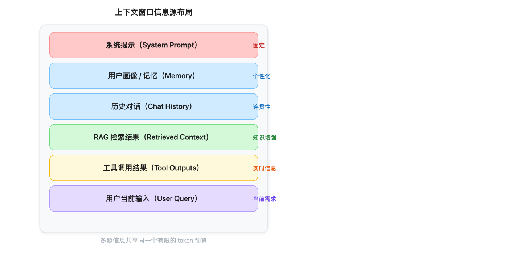
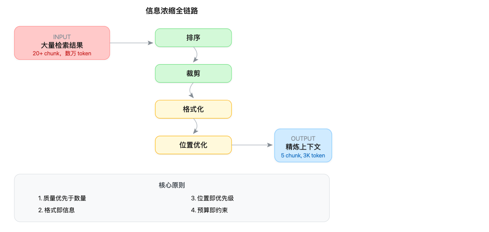

# RAG 到上下文注入全链路：检索结果的排序裁剪与注入优化

> **一句话定位**：RAG 系列讲的是「怎么检索到好结果」，这篇讲的是「检索到了好结果之后，怎么把它漂亮地塞进上下文窗口」——排序、裁剪、格式化、注入位置，每一步都影响最终输出质量。

---

## 一、RAG 检索之后发生了什么

### 1.1 被忽视的「最后一公里」

大多数 RAG 教程到「检索到 Top-K 相关文档」就结束了。但实际上，从检索完成到 LLM 生成回答之间，还有一条关键链路：



> ▲ RAG 注入全链路：① 检索 → ② 重排序（RAG 系列）→ ③ 排序策略 → ④ 裁剪策略 → ⑤ 格式化 → ⑥ 注入编排 → ⑦ LLM 生成

**类比**：RAG 检索像是去超市采购食材，而上下文注入像是做菜——食材再好，切法不对、摆盘混乱、放错了调料顺序，最终端出来的菜也不好吃。

### 1.2 为什么「塞进去」这么难

你可能觉得：把检索到的文本拼到 prompt 里不就行了？实际上问题远比这复杂：

| 问题 | 具体表现 |
|------|---------|
| **Token 预算有限** | 上下文窗口不是无限的，系统提示 + 历史对话 + 检索结果 + 工具输出，都要抢同一个预算 |
| **位置偏见** | 模型对上下文开头和结尾的信息注意力更强，中间的容易被忽略（Lost in the Middle） |
| **信息冲突** | 多个检索结果可能包含矛盾信息，直接塞进去会让模型困惑 |
| **格式敏感** | 同样的内容，用不同格式注入，模型的理解准确率可能差 10-20% |
| **边际递减** | 塞得越多不等于效果越好，超过某个阈值后反而降低输出质量 |

---

## 二、注入前的排序策略

检索返回的结果通常按向量相似度排序，但这往往不是最优的注入顺序。

### 2.1 相关度排序（默认方案）

最基础的策略：按检索分数从高到低排列。

```python
def sort_by_relevance(chunks: list[dict]) -> list[dict]:
    """按相关度分数降序排列"""
    return sorted(chunks, key=lambda x: x["score"], reverse=True)

# 示例输入
chunks = [
    {"text": "Python是一种解释型语言...", "score": 0.92},
    {"text": "Java的垃圾回收机制...", "score": 0.85},
    {"text": "Python的GIL限制...", "score": 0.88},
]
# 排序后: Python解释型(0.92) → Python GIL(0.88) → Java GC(0.85)
```

**优点**：简单、可预测。
**缺点**：高相关度的内容可能高度冗余（比如3个chunk讲的是同一件事的不同段落）。

### 2.2 多样性重排（MMR）

**最大边际相关性（Maximal Marginal Relevance）** 解决冗余问题：在保证相关度的前提下，尽量让每个chunk提供不同的信息。

类比：你问「Python怎么样」，你不希望3个结果都在说「Python语法简洁」，你希望一个讲语法、一个讲生态、一个讲性能。

```python
def mmr_rerank(
    chunks: list[dict],
    lambda_param: float = 0.7,
    top_k: int = 5
) -> list[dict]:
    """
    MMR 多样性重排
    lambda_param: 0~1, 越大越重视相关度, 越小越重视多样性
    """
    selected = []
    candidates = chunks.copy()

    # 第一个：选最相关的
    candidates.sort(key=lambda x: x["score"], reverse=True)
    selected.append(candidates.pop(0))

    while len(selected) < top_k and candidates:
        best_idx = -1
        best_mmr = -1

        for i, cand in enumerate(candidates):
            # 相关度分量
            relevance = cand["score"]
            # 多样性分量：与已选结果的最大相似度（越小越好）
            max_sim = max(
                _cosine_similarity(cand["embedding"], s["embedding"])
                for s in selected
            )
            # MMR 分数
            mmr_score = lambda_param * relevance - (1 - lambda_param) * max_sim

            if mmr_score > best_mmr:
                best_mmr = mmr_score
                best_idx = i

        selected.append(candidates.pop(best_idx))

    return selected


def _cosine_similarity(a: list[float], b: list[float]) -> float:
    """计算余弦相似度"""
    dot = sum(x * y for x, y in zip(a, b))
    norm_a = sum(x**2 for x in a) ** 0.5
    norm_b = sum(x**2 for x in b) ** 0.5
    return dot / (norm_a * norm_b) if norm_a and norm_b else 0.0
```

**MMR 的效果**：在知识库问答场景中，MMR 重排后的 Top-5 结果通常比纯相关度排序具有更高的信息多样性——相关度排序容易返回语义高度重复的结果，而 MMR 能有效去重。

### 2.3 时间衰减排序

对于时效性敏感的场景（新闻问答、客服对话、技术文档版本），需要让更新的内容优先。

```python
from datetime import datetime, timedelta

def time_aware_sort(
    chunks: list[dict],
    half_life_days: int = 30
) -> list[dict]:
    """
    带时间衰减的排序
    half_life_days: 半衰期，多少天后权重降为一半
    """
    now = datetime.now()

    for chunk in chunks:
        age_days = (now - chunk["created_at"]).days
        time_weight = 2 ** (-age_days / half_life_days)
        # 综合分数 = 相关度 × 时间权重
        chunk["final_score"] = chunk["score"] * time_weight

    return sorted(chunks, key=lambda x: x["final_score"], reverse=True)
```

### 2.4 排序策略对比

| 策略 | 适用场景 | 核心优势 | 核心风险 |
|------|---------|---------|---------|
| 纯相关度 | 通用问答、技术文档 | 简单可靠 | 结果冗余 |
| MMR 多样性 | 开放性问题、研究综述 | 信息覆盖广 | 可能引入弱相关内容 |
| 时间衰减 | 新闻、客服、版本文档 | 优先新信息 | 可能忽略经典但重要的旧内容 |
| 混合策略 | 生产环境推荐 | 兼顾多维度 | 参数调优复杂 |

---

## 三、注入前的裁剪策略

排序之后，不是所有结果都应该被注入。裁剪是控制上下文质量的关键环节。

### 3.1 Token 预算分配

上下文窗口是一个固定大小的「预算」，需要在多个信息源之间分配。

```python
class TokenBudgetAllocator:
    """Token 预算分配器"""

    def __init__(self, total_budget: int = 8000):
        self.total_budget = total_budget

    def allocate(
        self,
        system_prompt_tokens: int,
        history_tokens: int,
        num_sources: int = 3  # RAG、记忆、工具输出等
    ) -> dict[str, int]:
        """
        分配 token 预算

        分配逻辑：
        1. 系统提示 — 固定开销，不可压缩
        2. 历史对话 — 保留最近 N 轮
        3. 检索结果 — 剩余预算的主要消费者
        4. 输出预留 — 为模型回答预留空间
        """
        # 固定开销
        output_reserve = int(self.total_budget * 0.25)  # 预留25%给输出
        available = self.total_budget - output_reserve

        # 系统提示（不可压缩）
        remaining = available - system_prompt_tokens

        # 历史对话（可截断）
        history_budget = min(history_tokens, int(remaining * 0.3))
        remaining -= history_budget

        # 检索结果（主要预算）
        rag_budget = int(remaining * 0.85)
        other_budget = remaining - rag_budget

        return {
            "system_prompt": system_prompt_tokens,
            "history": history_budget,
            "rag_context": rag_budget,
            "other_context": other_budget,
            "output_reserve": output_reserve,
        }


# 使用示例
allocator = TokenBudgetAllocator(total_budget=8000)
budget = allocator.allocate(
    system_prompt_tokens=500,
    history_tokens=2000
)
print(budget)
# {
#   'system_prompt': 500,
#   'history': 1800,        # 2000被截断到1800
#   'rag_context': 4335,    # 检索结果的最大token预算
#   'other_context': 765,   # 工具输出等
#   'output_reserve': 2000  # 输出预留
# }
```

**关键原则**：检索结果通常占可用预算的 60-80%。如果系统提示很长（比如包含复杂的工具说明），需要压缩检索结果的预算。

### 3.2 置信度阈值裁剪

不是所有检索结果都值得注入。低质量的结果不仅浪费 token，还会引入噪声。

```python
def confidence_filter(
    chunks: list[dict],
    min_score: float = 0.7,
    dynamic_threshold: bool = True
) -> list[dict]:
    """
    基于置信度阈值过滤检索结果

    dynamic_threshold: 动态阈值模式
    - 如果最高分很高(>0.9), 阈值可以适当提高
    - 如果最高分偏低(<0.7), 阈值适当降低，避免过滤掉所有结果
    """
    if not chunks:
        return []

    if dynamic_threshold:
        max_score = max(c["score"] for c in chunks)
        if max_score > 0.9:
            # 高置信度场景：严格过滤
            threshold = max(min_score, max_score * 0.75)
        elif max_score < 0.7:
            # 低置信度场景：放宽阈值，但标注不确定性
            threshold = max_score * 0.7
        else:
            threshold = min_score
    else:
        threshold = min_score

    filtered = [c for c in chunks if c["score"] >= threshold]

    # 如果全部被过滤，至少保留最相关的1个
    if not filtered and chunks:
        filtered = [max(chunks, key=lambda x: x["score"])]

    return filtered
```

### 3.3 去重策略

检索结果中经常出现内容高度重叠的 chunk（尤其是文档切分粒度较小时）。

```python
from difflib import SequenceMatcher

def deduplicate_chunks(
    chunks: list[dict],
    similarity_threshold: float = 0.8
) -> list[dict]:
    """
    去除内容高度相似的chunk

    策略：保留分数更高的那个
    """
    unique = []
    for chunk in chunks:
        is_duplicate = False
        for existing in unique:
            sim = SequenceMatcher(
                None,
                chunk["text"],
                existing["text"]
            ).ratio()
            if sim > similarity_threshold:
                is_duplicate = True
                # 如果新chunk分数更高，替换已有的
                if chunk["score"] > existing["score"]:
                    unique.remove(existing)
                    unique.append(chunk)
                break
        if not is_duplicate:
            unique.append(chunk)
    return unique
```

### 3.4 裁剪策略组合

实际生产中，通常组合使用多种裁剪策略：

```
原始检索结果（Top-20）
  ↓ 去重 → 12个独立内容
  ↓ 置信度过滤 → 8个高质量内容
  ↓ Token预算裁剪 → 5个在预算内的内容
  ↓ 最终注入
```

```python
def count_tokens(text: str) -> int:
    """简化版 token 计数（实际项目中建议使用 tiktoken 或模型专用 tokenizer）"""
    return len(text) // 4  # 粗略估算：1 token ≈ 4 字符

def truncate_to_tokens(text: str, max_tokens: int) -> str:
    """将文本截断到指定 token 数（简化实现）"""
    max_chars = max_tokens * 4  # 反向换算
    return text[:max_chars]

def pipeline_trim(
    chunks: list[dict],
    token_budget: int = 4000,
    min_score: float = 0.7
) -> list[dict]:
    """完整的裁剪流水线"""
    # Step 1: 去重
    chunks = deduplicate_chunks(chunks, similarity_threshold=0.8)
    # Step 2: 置信度过滤
    chunks = confidence_filter(chunks, min_score=min_score)
    # Step 3: Token预算裁剪
    result = []
    used_tokens = 0
    for chunk in chunks:
        chunk_tokens = count_tokens(chunk["text"])
        if used_tokens + chunk_tokens <= token_budget:
            result.append(chunk)
            used_tokens += chunk_tokens
        else:
            # 尝试截断当前chunk以适应剩余预算
            remaining = token_budget - used_tokens
            if remaining > 100:  # 至少100个token才值得注入
                chunk["text"] = truncate_to_tokens(chunk["text"], remaining)
                result.append(chunk)
            break
    return result
```

---

## 四、注入格式设计

同样的内容，注入格式不同，模型的理解效果差异显著。

### 4.1 三种主流格式

#### 格式一：XML 标签（推荐用于复杂场景）

```python
def format_as_xml(chunks: list[dict], query: str) -> str:
    """用XML标签结构化注入检索结果"""
    parts = [f"<user_query>{query}</user_query>\n"]
    parts.append("<retrieved_context>\n")

    for i, chunk in enumerate(chunks):
        source = chunk.get("source", "unknown")
        score = chunk.get("score", 0)
        parts.append(
            f'  <document id="{i+1}" source="{source}" '
            f'relevance="{score:.2f}">\n'
            f'    {chunk["text"]}\n'
            f"  </document>\n"
        )

    parts.append("</retrieved_context>")
    return "".join(parts)
```

输出效果：
```xml
<user_query>Python的GIL是什么？</user_query>

<retrieved_context>
  <document id="1" source="python-docs" relevance="0.95">
    GIL（全局解释器锁）是CPython解释器中的一个机制...
  </document>
  <document id="2" source="stackoverflow" relevance="0.88">
    GIL限制了Python多线程的并行能力...
  </document>
</retrieved_context>
```

**为什么 XML 好用**：Claude、GPT 等模型在训练数据中见过大量 XML 结构化数据，对标签的解析能力很强。XML 标签提供了明确的边界，帮助模型区分「用户问题」和「参考资料」。

#### 格式二：Markdown 分隔（简洁场景）

```python
def format_as_markdown(chunks: list[dict], query: str) -> str:
    """用Markdown格式注入"""
    parts = [f"## 用户问题\n{query}\n"]
    parts.append("## 参考资料\n")

    for i, chunk in enumerate(chunks):
        source = chunk.get("source", "unknown")
        parts.append(f"### 来源 {i+1}: {source}\n{chunk['text']}\n")

    return "\n".join(parts)
```

#### 格式三：结构化模板（严格指令场景）

```python
def format_as_template(chunks: list[dict], query: str) -> str:
    """用严格的模板格式注入"""
    context_block = "\n---\n".join(
        f"[REF-{i+1}] {c['text']}" for i, c in enumerate(chunks)
    )
    return f"""基于以下参考资料回答问题。如果参考资料中没有相关信息，请明确说明。

参考资料：
{context_block}

问题：{query}

要求：
1. 回答必须基于参考资料，不要编造
2. 引用时标注来源编号，如 [REF-1]
3. 如果多个来源有矛盾，请指出差异"""
```

### 4.2 格式选择决策表

| 格式 | 适用场景 | 模型兼容性 | 可调试性 | 推荐度 |
|------|---------|-----------|---------|-------|
| XML 标签 | 多源信息、复杂结构 | Claude/GPT 最优 | 高 | ⭐⭐⭐⭐⭐ |
| Markdown | 简单问答、快速原型 | 通用兼容 | 高 | ⭐⭐⭐⭐ |
| 结构化模板 | 严格引用要求 | 通用兼容 | 中 | ⭐⭐⭐⭐ |

**经验法则**：如果你的上下文结构比较复杂（多个来源、需要区分优先级），优先用 XML。如果只是简单地「把文档塞进去」，Markdown 足够。

---

## 五、注入位置对注意力的影响

### 5.1 Lost in the Middle 现象

2023 年，Stanford 和 UC Berkeley 的研究者发表了重要论文《Lost in the Middle: How Language Models Use Long Contexts》，揭示了一个关键发现：

> **模型对上下文开头和结尾的信息利用率最高，中间部分的信息容易被「遗忘」。**



> ▲ Lost in the Middle：模型对开头和结尾注意力最强，中间位置信息容易被忽略

这意味着：**如果你把最重要的检索结果放在中间，模型可能反而忽略它。**

### 5.2 位置优化策略

#### 策略一：最重要的放两端

```python
def optimal_placement(chunks: list[dict]) -> list[dict]:
    """
    将最重要的内容放在开头和结尾

    排列方式：[最重要, 第3重要, 第5重要, ..., 第6重要, 第4重要, 第2重要]
    即：高-低-高 交替排列，两端最强
    """
    sorted_chunks = sorted(chunks, key=lambda x: x["score"], reverse=True)

    result = [None] * len(sorted_chunks)
    left, right = 0, len(sorted_chunks) - 1

    for i, chunk in enumerate(sorted_chunks):
        if i % 2 == 0:
            result[left] = chunk  # 从左端填充
            left += 1
        else:
            result[right] = chunk  # 从右端填充
            right -= 1

    return result

# 输入: [A(0.95), B(0.88), C(0.82), D(0.75), E(0.70)]
# 输出: [A(0.95), D(0.75), E(0.70), C(0.82), B(0.88)]
#         ↑ 开头最相关                    结尾次相关 ↑
```

#### 策略二：关键信息重复注入

如果某个关键信息绝对不能被忽略，可以在开头和结尾各注入一次。

```python
def reinforce_key_info(chunks: list[dict], key_chunk: dict) -> list[dict]:
    """在首尾重复注入关键信息"""
    return [key_chunk] + chunks + [key_chunk]
```

**注意**：重复注入会消耗额外的 token 预算，只在关键信息必须被关注时使用。

### 5.3 不同模型的位置敏感度

| 模型 | 位置敏感度 | 建议策略 |
|------|-----------|---------|
| GPT-5.5 / GPT-5.4 | 中等 | 重要信息放开头 |
| Claude Opus 4.8 / Sonnet 4.6 | 较低 | XML结构化即可 |
| Gemini 3.5 Flash | 中等 | 长上下文时需注意 |
| 开源模型（Llama/Qwen） | 较高 | 强烈建议首尾优先 |

---

## 六、注入量与输出质量的关系

### 6.1 边际收益递减

一个反直觉的事实：**注入更多的检索结果，不一定会带来更好的回答。**

研究和实践表明，注入量与输出质量呈「倒U型」关系：



> ▲ 倒U 型关系：注入量 3-8 个 chunk 为最佳区间，超过后质量反而下降

### 6.2 最佳注入量的确定

```python
def find_optimal_k(
    chunks: list[dict],
    query: str,
    llm_client,
    eval_fn,
    k_range: range = range(1, 15)
) -> int:
    """
    通过实验确定最佳注入量

    思路：逐步增加注入量，找到质量开始下降的拐点
    """
    results = []
    for k in k_range:
        top_k = chunks[:k]
        context = format_as_xml(top_k, query)
        response = llm_client.generate(context)
        score = eval_fn(query, response)
        results.append((k, score))
        print(f"K={k}, Quality Score={score:.3f}")

    # 找到分数最高的K值
    best_k = max(results, key=lambda x: x[1])[0]
    return best_k
```

### 6.3 经验参考值

| 场景类型 | 推荐注入量 | 原因 |
|---------|-----------|------|
| 事实问答（单跳） | 2-3 个 chunk | 答案通常在1-2个chunk中 |
| 分析类问题 | 5-8 个 chunk | 需要综合多个来源 |
| 综述/总结类 | 8-12 个 chunk | 需要广泛覆盖 |
| 对比分析 | 4-6 个 chunk | 每个对比维度1-2个 |

---

## 七、多源信息融合注入

### 7.1 真实场景：信息来自多个渠道

在实际的 Agent 系统中，上下文窗口里不止有 RAG 检索结果，还有：



> ▲ 上下文窗口：6 类信息源共享同一个有限的 token 预算

这些信息源之间可能存在冲突、冗余、甚至矛盾。如何编排它们的优先级？

### 7.2 优先级仲裁框架

```python
from dataclasses import dataclass, field
from enum import IntEnum


class Priority(IntEnum):
    """信息源优先级（数值越大优先级越高）"""
    SYSTEM = 100       # 系统指令，最高优先级
    USER_QUERY = 90    # 用户当前问题
    TOOL_OUTPUT = 70   # 工具调用的实时结果
    RAG_CONTEXT = 60   # RAG检索结果
    MEMORY = 50        # 用户记忆/画像
    HISTORY = 40       # 历史对话


@dataclass
class ContextChunk:
    content: str
    source: str
    priority: Priority
    token_count: int
    confidence: float = 1.0
    timestamp: float = 0.0


@dataclass
class ContextBuilder:
    """多源上下文构建器"""
    max_tokens: int = 8000
    chunks: list[ContextChunk] = field(default_factory=list)

    def add(self, chunk: ContextChunk):
        self.chunks.append(chunk)

    def build(self) -> str:
        """
        构建最终上下文

        编排策略：
        1. 按优先级分组
        2. 同优先级内按置信度排序
        3. 从高优先级开始填充，直到token预算用完
        """
        # 按优先级降序排列
        self.chunks.sort(
            key=lambda c: (c.priority, c.confidence),
            reverse=True
        )

        result_parts = []
        used_tokens = 0

        for chunk in self.chunks:
            if used_tokens + chunk.token_count <= self.max_tokens:
                result_parts.append(
                    f"[{chunk.source}]\n{chunk.content}"
                )
                used_tokens += chunk.token_count
            else:
                # 尝试截断以适应剩余预算
                remaining = self.max_tokens - used_tokens
                if remaining > 100:
                    truncated = truncate_to_tokens(
                        chunk.content, remaining
                    )
                    result_parts.append(
                        f"[{chunk.source}]\n{truncated}"
                    )
                break

        return "\n\n---\n\n".join(result_parts)


# 使用示例
builder = ContextBuilder(max_tokens=8000)
builder.add(ContextChunk(
    content="用户是高级Python开发者，偏好简洁回答",
    source="用户记忆",
    priority=Priority.MEMORY,
    token_count=30
))
builder.add(ContextChunk(
    content="Python的异步编程基于事件循环...",
    source="RAG-文档",
    priority=Priority.RAG_CONTEXT,
    token_count=500,
    confidence=0.92
))
builder.add(ContextChunk(
    content="当前最新Python版本是3.13.4",
    source="工具输出",
    priority=Priority.TOOL_OUTPUT,
    token_count=20
))

context = builder.build()
```

### 7.3 冲突解决策略

当多个信息源产生矛盾时：

| 冲突类型 | 解决策略 | 示例 |
|---------|---------|------|
| 工具输出 vs RAG | 优先工具输出（实时性更高） | RAG说「Python 3.12」，工具查到「Python 3.13」 |
| 记忆 vs 当前输入 | 优先当前输入（用户可能改主意） | 记忆说「喜欢详细回答」，当前说「简要回答」 |
| 多个RAG结果矛盾 | 标注差异，让模型自行判断 | 文档A说「推荐方案X」，文档B说「推荐方案Y」 |

```python
def resolve_conflicts(chunks: list[ContextChunk]) -> list[ContextChunk]:
    """
    冲突检测与标注

    当检测到矛盾信息时，在chunk前添加冲突标注，
    让LLM自行判断（而不是偷偷丢弃某个来源）
    """
    # 简化实现：对同一主题的不同来源添加标注
    seen_topics = {}
    for chunk in chunks:
        topic = extract_topic(chunk.content)  # 简化的主题提取
        if topic in seen_topics:
            existing = seen_topics[topic]
            if existing.source != chunk.source:
                # 标注冲突
                chunk.content = (
                    f"[注意：以下信息与来源 {existing.source} 存在差异]\n"
                    f"{chunk.content}"
                )
        seen_topics[topic] = chunk
    return chunks
```

---

## 八、完整注入流水线

把前面所有策略串起来，形成一个完整的生产级注入流水线：

```python
class ContextInjectionPipeline:
    """完整的上下文注入流水线"""

    def __init__(
        self,
        max_tokens: int = 8000,
        output_reserve_ratio: float = 0.25,
        min_relevance: float = 0.7,
        diversity_lambda: float = 0.7,
        format_type: str = "xml"  # xml / markdown / template
    ):
        self.max_tokens = max_tokens
        self.output_reserve = int(max_tokens * output_reserve_ratio)
        self.min_relevance = min_relevance
        self.diversity_lambda = diversity_lambda
        self.format_type = format_type

    def run(
        self,
        raw_chunks: list[dict],
        query: str,
        system_tokens: int = 500,
        history_tokens: int = 1000
    ) -> str:
        """
        完整流水线执行

        输入：原始检索结果 + 用户问题
        输出：格式化好的上下文字符串，可直接拼入prompt
        """
        # Step 1: 预算计算
        available = self.max_tokens - self.output_reserve
        rag_budget = available - system_tokens - history_tokens

        # Step 2: 排序（MMR多样性重排）
        chunks = mmr_rerank(
            raw_chunks,
            lambda_param=self.diversity_lambda
        )

        # Step 3: 去重
        chunks = deduplicate_chunks(chunks)

        # Step 4: 置信度过滤
        chunks = confidence_filter(chunks, self.min_relevance)

        # Step 5: 位置优化
        chunks = optimal_placement(chunks)

        # Step 6: Token预算裁剪
        chunks = self._trim_to_budget(chunks, rag_budget)

        # Step 7: 格式化输出
        if self.format_type == "xml":
            return format_as_xml(chunks, query)
        elif self.format_type == "markdown":
            return format_as_markdown(chunks, query)
        else:
            return format_as_template(chunks, query)

    def _trim_to_budget(
        self, chunks: list[dict], budget: int
    ) -> list[dict]:
        """按token预算裁剪"""
        result = []
        used = 0
        for chunk in chunks:
            tokens = count_tokens(chunk["text"])
            if used + tokens <= budget:
                result.append(chunk)
                used += tokens
            else:
                break
        return result


# 使用
pipeline = ContextInjectionPipeline(
    max_tokens=8000,
    min_relevance=0.75,
    format_type="xml"
)
context = pipeline.run(
    raw_chunks=retrieval_results,
    query="Python的GIL机制是什么？"
)
```

---

## 九、实践检查清单

在你的 RAG 系统上线前，对照以下检查清单：

| # | 检查项 | 通过标准 |
|---|--------|---------|
| 1 | 是否有 Token 预算分配 | 系统/历史/RAG/输出各自有明确上限 |
| 2 | 是否有去重逻辑 | 相似度 > 0.8 的 chunk 不会重复出现 |
| 3 | 是否有置信度过滤 | 低分 chunk 不会被注入 |
| 4 | 是否考虑了位置效应 | 最重要的信息不在正中间 |
| 5 | 注入格式是否有明确分隔符 | 模型能区分不同来源的信息 |
| 6 | 是否有冲突标注 | 矛盾信息不会被静默丢弃 |
| 7 | 是否控制了注入量 | 3-8 个高质量 chunk，而不是 20 个低质量 |
| 8 | 输出是否有预留空间 | 至少 25% 的 token 留给模型回答 |

---

## 十、总结

RAG 到上下文注入的全链路，本质上是一个**信息浓缩**的过程：



> ▲ 信息浓缩全链路：大量检索结果 → 排序 → 裁剪 → 格式化 → 位置优化 → 精炼上下文

**核心原则**：
1. **质量优先于数量**：5个精准的chunk > 20个模糊的chunk
2. **格式即信息**：好的格式让同样的内容效果提升20%
3. **位置即优先级**：开头和结尾是注意力的黄金位置
4. **预算即约束**：所有信息源共享一个有限的窗口，必须精打细算

---

## 参考资料

1. **Lost in the Middle** - Liu et al., 2023. *Lost in the Middle: How Language Models Use Long Contexts*. 研究LLM对上下文不同位置信息的利用率，揭示了位置偏见现象。
   https://arxiv.org/abs/2307.03172
2. **Maximal Marginal Relevance** - Carbonell & Goldstein, 1998. *The Use of MMR, Diversity-Based Reranking for Reordering Documents and Producing Summaries*. MMR算法的原始论文。
   https://www.cs.cmu.edu/~jgc/publication/The_Use_MMR_Diversity_Based_LTMIR_1998.pdf
3. **Anthropic Context Engineering Guide** - Anthropic, 2025. Claude上下文工程最佳实践，包括XML标签使用建议。
   https://www.anthropic.com/engineering/effective-context-engineering-for-ai-agents
4. **RAG系统中的上下文窗口管理** - LlamaIndex Documentation. Token预算分配与上下文组装的工程实践。
   https://developers.llamaindex.ai/python/framework/understanding/rag
5. **Context Engineering** - Andrej Karpathy, 2025. [推文链接](https://x.com/karpathy/status/1937902205765607626)，系统阐述了 Context Engineering 的核心定义。
   https://x.com/tobi/status/1909251946235437514
6. **Effective Context Window** - Gradient AI, 2025. 研究不同模型的有效上下文利用率差异。
   https://epoch.ai/data-insights/context-windows
7. **Reranking Strategies for RAG** - Cohere, 2024. 重排序策略对比与最佳实践。
   https://docs.cohere.com/docs/reranking-with-cohere
