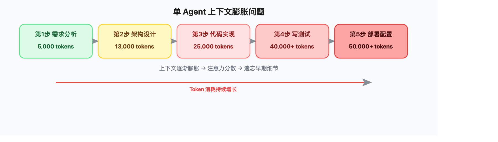
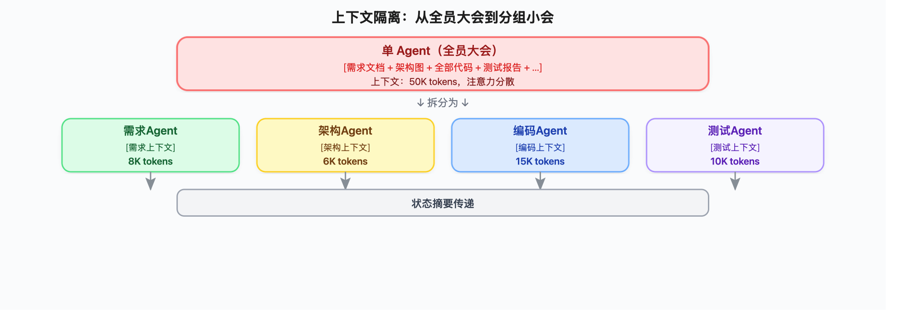
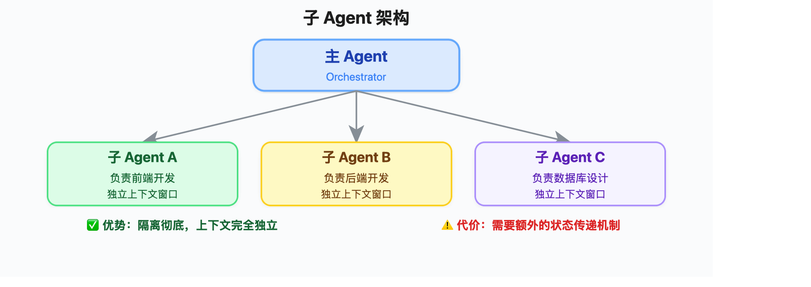
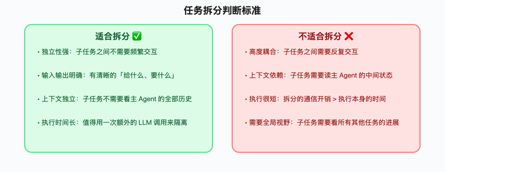
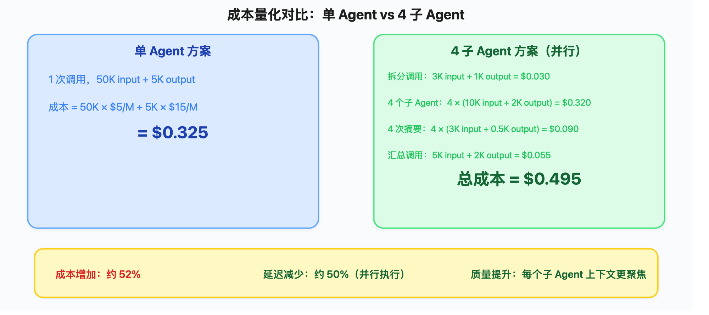
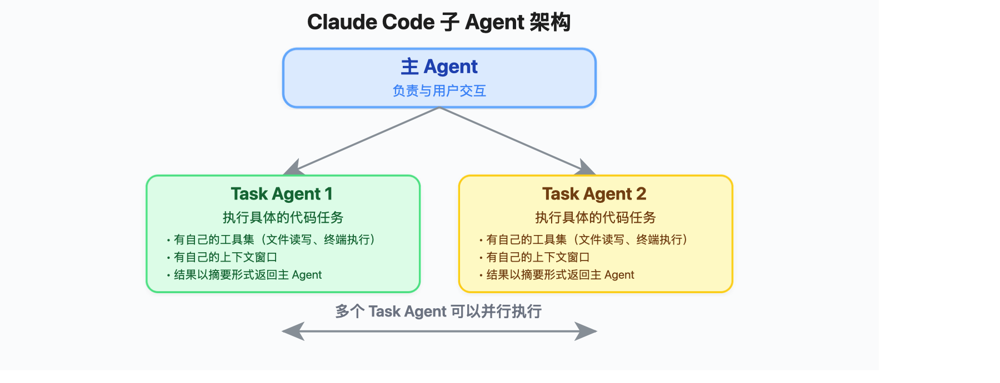
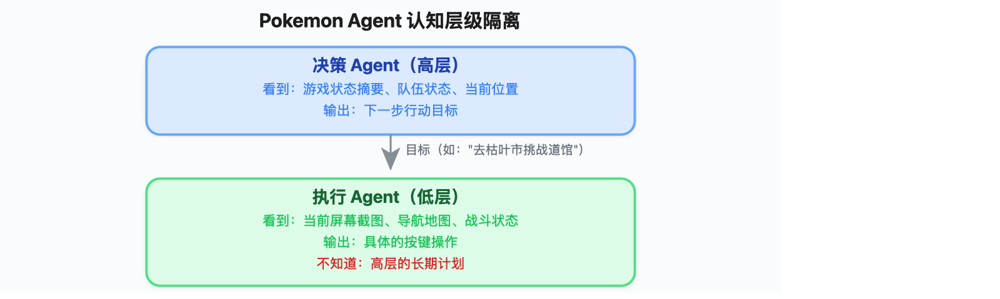
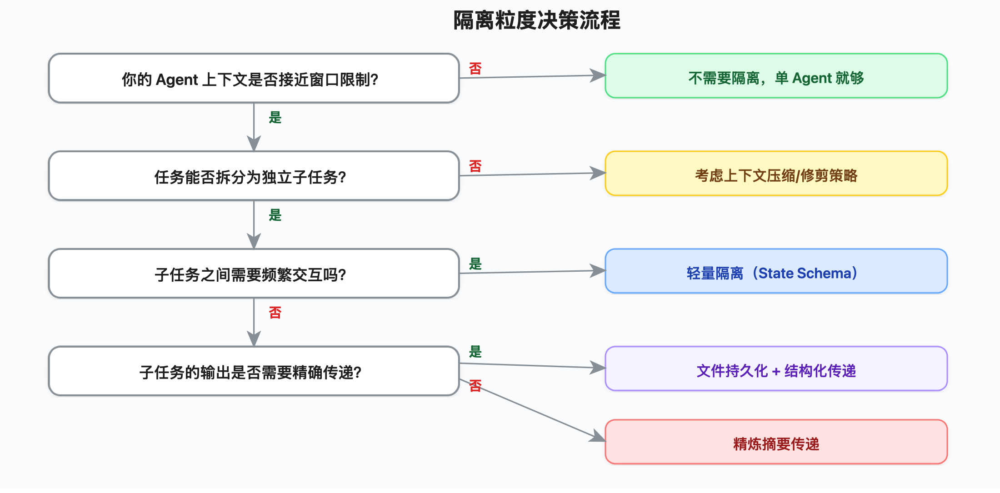

# 多 Agent 上下文隔离设计：状态拆分、摘要传递与通信开销权衡

> **一句话定位**：当一个 Agent 的上下文窗口装不下所有任务信息时，你需要把任务拆给多个 Agent，每个 Agent 只看自己需要的那部分上下文——这就是「上下文隔离」。核心挑战不是「怎么拆」，而是「拆完之后怎么高效传状态」。

---

## 一、为什么需要上下文隔离

### 1.1 单 Agent 上下文膨胀问题

想象一个真实场景：你让 Agent 帮你做一个完整的软件项目——需求分析、架构设计、代码实现、测试、部署。

如果用单个 Agent 处理所有步骤：



> ▲ 单 Agent 上下文膨胀：① 需求分析（5K tokens）→ ② 架构设计（13K tokens）→ ③ 代码实现（25K tokens）→ ④ 写测试（40K+ tokens，注意力分散）→ ⑤ 部署配置（50K+ tokens，遗忘细节），Token 消耗持续增长，导致注意力稀释、成本飙升、延迟叠加

这就是 **上下文膨胀**：每一步都在往上下文里塞信息，后面的步骤不仅要处理自己的任务，还要「背着」前面所有步骤的历史。就像一个会议从早上开到晚上，参会者的注意力越来越差，早上的讨论细节已经记不清了。

### 1.2 膨胀带来的三个核心问题

| 问题 | 表现 | 本质原因 |
|------|------|----------|
| **注意力稀释** | 模型忽略早期关键信息 | Transformer 注意力分布随上下文增长而分散 |
| **成本飙升** | 每次调用都要处理全部历史 | Token 计费 = 输入 token × 单价 |
| **延迟叠加** | 首 token 时间随上下文线性增长 | Prefill 阶段计算量与输入长度正相关 |

### 1.3 隔离的核心思想

**一句话：让每个 Agent 只看到自己需要的上下文。**

类比公司管理：
- ❌ **单 Agent 模式**：所有部门开全员大会，每个人都要听所有部门的汇报
- ✅ **隔离模式**：每个部门开自己的小会，只看与自己相关的材料，部门之间通过「会议纪要」传递关键信息



> ▲ 上下文隔离：① 单 Agent（全员大会，50K tokens，注意力分散）→ 拆分为 → ② 四个子 Agent（需求 Agent 8K / 架构 Agent 6K / 编码 Agent 15K / 测试 Agent 10K）→ ③ 状态摘要传递

---

## 二、隔离的三种模式

上下文隔离不是只有一种做法。根据隔离的粒度和实现方式，可以分为三种模式：

### 2.1 三种模式对比

| 模式 | 隔离粒度 | 典型场景 | 代表实现 |
|------|----------|----------|----------|
| **子 Agent 架构** | 任务级 | 复杂任务拆分为子任务 | Claude Code、Hermes Agent |
| **沙箱执行** | 运行时级 | 代码执行与主 Agent 隔离 | E2B、Modal、Docker sandbox |
| **State Schema 隔离** | 数据级 | 不同 Agent 只读写特定状态字段 | LangGraph State、CrewAI |

### 2.2 子 Agent 架构（最常用）

主 Agent（Orchestrator）负责任务拆分和结果汇总，子 Agent（Sub-agent）负责具体执行。每个子 Agent 有自己的上下文窗口，互不干扰。



> ▲ 子 Agent 架构：主 Agent（Orchestrator，负责任务拆分和结果汇总）→ 三个子 Agent（A 前端开发 / B 后端开发 / C 数据库设计），每个子 Agent 有独立上下文窗口，互不干扰

**优势**：隔离彻底，每个 Agent 的上下文完全独立
**代价**：需要额外的「状态传递」机制，增加一次或多次 LLM 调用

### 2.3 沙箱执行隔离

把代码执行、文件操作等「脏活」放到隔离的沙箱环境中执行，主 Agent 只接收执行结果。

```python
# 沙箱执行的核心思想
class SandboxExecutor:
    def run(self, code: str, context: dict) -> str:
        """在隔离环境中执行代码，只返回结果"""
        # 沙箱内部有自己的上下文，与主 Agent 完全隔离
        sandbox = create_sandbox(image="python:3.11")
        sandbox.upload_files(context["files"])
        result = sandbox.run_code(code)
        # 只返回精炼结果，不暴露沙箱内部细节
        return self.summarize_result(result)
```

**优势**：安全（代码执行不影响主 Agent 状态）、干净（不会污染上下文）
**代价**：沙箱启动有延迟，状态同步需要额外设计

### 2.4 State Schema 隔离

通过定义状态结构（Schema），让不同 Agent 只能读写特定的状态字段。

```python
from typing import TypedDict, Annotated

class ProjectState(TypedDict):
    # 需求 Agent 只读写这个字段
    requirements: Annotated[str, "需求Agent负责"]
    # 架构 Agent 只读写这个字段
    architecture: Annotated[str, "架构Agent负责"]
    # 编码 Agent 只读写这个字段
    code: Annotated[str, "编码Agent负责"]
    # 测试 Agent 只读写这个字段
    test_results: Annotated[str, "测试Agent负责"]
```

**优势**：轻量级，不需要额外的 LLM 调用来传递状态
**代价**：隔离不彻底——所有 Agent 共享同一个上下文窗口，只是通过 Schema 限制读写

---

## 三、子 Agent 架构设计

子 Agent 架构是最常用的隔离模式，也是本篇的重点。

### 3.1 核心设计要素

一个好的子 Agent 架构需要回答四个问题：

| 要素 | 核心问题 | 设计原则 |
|------|----------|----------|
| **任务拆分** | 什么任务适合拆出去？ | 独立性强、输入输出明确的任务 |
| **上下文边界** | 子 Agent 能看到什么？ | 只给必要信息，不给全量历史 |
| **退出条件** | 子 Agent 什么时候结束？ | 明确的成功/失败判断标准 |
| **结果回收** | 怎么把结果传回来？ | 摘要 + 结构化输出 |

### 3.2 任务拆分原则

不是所有任务都适合拆给子 Agent。判断标准：



> ▲ 任务拆分判断标准：适合拆分（独立性强、输入输出明确、上下文独立、执行时间长）vs 不适合拆分（高度耦合、上下文依赖、执行很短、需要全局视野）

### 3.3 子 Agent 实现模板

```python
from dataclasses import dataclass, field
from typing import Optional

@dataclass
class SubAgentConfig:
    """子 Agent 配置"""
    role: str                          # 角色描述
    system_prompt: str                 # 系统指令
    tools: list = field(default_factory=list)  # 可用工具
    max_turns: int = 10               # 最大交互轮数
    context_budget: int = 8000         # 上下文预算（tokens）
    output_schema: Optional[dict] = None  # 输出格式约束

@dataclass
class SubAgentResult:
    """子 Agent 返回结果"""
    status: str                        # "success" | "failure" | "partial"
    output: str                        # 主要输出内容
    summary: str                       # 精炼摘要（给主 Agent 看）
    artifacts: dict = field(default_factory=dict)  # 产出物（文件、代码等）
    token_usage: dict = field(default_factory=dict)  # Token 消耗统计

class SubAgent:
    """子 Agent 基类"""

    def __init__(self, config: SubAgentConfig):
        self.config = config
        self.context = []  # 子 Agent 自己的上下文

    def build_context(self, task: str, parent_context: dict) -> list:
        """
        构建子 Agent 的上下文——关键步骤！
        不是把 parent_context 全部传进来，而是只提取相关部分。
        """
        messages = [{"role": "system", "content": self.config.system_prompt}]

        # 只提取与当前任务相关的上下文片段
        relevant_context = self._extract_relevant(parent_context, task)
        if relevant_context:
            messages.append({
                "role": "user",
                "content": f"相关背景信息：\n{relevant_context}"
            })

        messages.append({"role": "user", "content": task})
        return messages

    def _extract_relevant(self, parent_context: dict, task: str) -> str:
        """
        从父 Agent 上下文中提取与当前任务相关的信息。
        这里可以用简单的关键词匹配，也可以用嵌入相似度。
        """
        relevant_parts = []
        for key, value in parent_context.items():
            if self._is_relevant(key, value, task):
                # 截取前 500 字符，避免上下文过大
                relevant_parts.append(f"[{key}]: {value[:500]}")
        return "\n".join(relevant_parts)

    def _is_relevant(self, key: str, value: str, task: str) -> bool:
        """判断某个上下文片段是否与当前任务相关"""
        task_keywords = set(task.lower().split())
        value_keywords = set(value.lower().split())
        overlap = task_keywords & value_keywords
        return len(overlap) >= 2  # 至少 2 个关键词重叠

    async def execute(self, task: str, parent_context: dict) -> SubAgentResult:
        """执行子任务"""
        self.context = self.build_context(task, parent_context)
        response = await self._call_llm(self.context)
        return self._build_result(response)
```

### 3.4 退出条件设计

子 Agent 必须有明确的退出条件，否则可能无限循环或过早退出：

```python
class ExitCondition:
    """退出条件判断"""

    @staticmethod
    def should_exit(turn: int, max_turns: int, last_response: str) -> tuple[bool, str]:
        """
        返回 (是否退出, 退出原因)
        """
        # 1. 达到最大轮数
        if turn >= max_turns:
            return True, "达到最大交互轮数"

        # 2. 检测到完成信号
        completion_signals = ["任务完成", "DONE", "已完成", "实现完毕"]
        if any(signal in last_response for signal in completion_signals):
            return True, "检测到完成信号"

        # 3. 检测到无法继续
        failure_signals = ["无法完成", "需要更多信息", "遇到阻塞"]
        if any(signal in last_response for signal in failure_signals):
            return True, "检测到失败信号"

        # 4. 上下文接近预算上限
        # (需要外部传入 token 计数)

        return False, ""
```

---

## 四、状态传递策略

子 Agent 隔离后，最大的工程挑战变成了：**怎么在 Agent 之间传递状态？**

### 4.1 三种策略对比

| 策略 | 原理 | 优点 | 缺点 | 适用场景 |
|------|------|------|------|----------|
| **精炼摘要** | 用 LLM 把结果压缩成摘要 | 信息密度高、灵活 | 额外 LLM 调用、可能丢信息 | 结果复杂、下游需要理解语义 |
| **全量传递** | 原样传递结构化数据 | 无损、无额外调用 | 上下文膨胀、受窗口限制 | 结果简单、格式固定 |
| **文件持久化** | 写到文件/数据库，只传引用 | 零上下文开销 | 读写延迟、需要文件系统 | 大量代码、长文档 |

### 4.2 精炼摘要策略

最常用的策略。核心思想：子 Agent 完成任务后，用一次 LLM 调用把结果压缩成精炼摘要。

```python
async def summarize_result(result: SubAgentResult, budget: int = 500) -> str:
    """
    将子 Agent 的结果压缩为摘要。
    budget: 摘要的目标 token 数
    """
    prompt = f"""请将以下任务执行结果压缩为不超过 {budget} tokens 的摘要。
保留关键信息：做了什么、结果是什么、有什么注意事项。
删除中间过程和调试信息。

原始结果：
{result.output}

请输出摘要："""

    summary = await call_llm(prompt, max_tokens=budget)
    return summary
```

**摘要质量的权衡**：

```
摘要越短 → 上下文越小 → 后续 Agent 可能缺少关键细节
摘要越长 → 上下文越大 → 隔离效果减弱
```

实践建议：摘要长度控制在原始结果的 10%-20%。

### 4.3 全量传递策略

适用于结构化、体积小的结果。

```python
from pydantic import BaseModel

class ArchitectureResult(BaseModel):
    """架构设计结果——结构化输出，体积可控"""
    components: list[str]           # 组件列表
    tech_stack: dict[str, str]      # 技术栈选择
    api_endpoints: list[str]        # API 端点
    database_schema: str            # 数据库 Schema
    constraints: list[str]          # 约束条件

# 直接序列化传递，不需要 LLM 摘要
result_json = architecture_result.model_dump_json()
# 通常 1-3K tokens，完全可以直接传递
```

### 4.4 文件持久化策略

适用于大体积的产出物（代码文件、长文档、测试报告）。

```python
import json
from pathlib import Path

class ArtifactStore:
    """产出物持久化存储"""

    def __init__(self, base_dir: str = "/tmp/agent_artifacts"):
        self.base_dir = Path(base_dir)
        self.base_dir.mkdir(parents=True, exist_ok=True)

    def save(self, agent_id: str, artifact_name: str, content: str) -> str:
        """保存产出物，返回路径"""
        path = self.base_dir / agent_id / artifact_name
        path.parent.mkdir(parents=True, exist_ok=True)
        path.write_text(content)
        return str(path)

    def get_manifest(self, agent_id: str) -> dict:
        """获取某个 Agent 的所有产出物清单"""
        agent_dir = self.base_dir / agent_id
        if not agent_dir.exists():
            return {}
        return {
            f.name: {
                "path": str(f),
                "size": f.stat().st_size,
                "preview": f.read_text()[:200]  # 只读前 200 字符作为预览
            }
            for f in agent_dir.iterdir() if f.is_file()
        }

# 使用方式
store = ArtifactStore()
# 子 Agent 把代码写到文件
store.save("coding_agent", "main.py", code_content)
store.save("coding_agent", "utils.py", utils_content)
# 主 Agent 只看到清单和预览，不把全部代码塞进上下文
manifest = store.get_manifest("coding_agent")
# manifest = {
#     "main.py": {"path": "...", "size": 2048, "preview": "import os\n..."},
#     "utils.py": {"path": "...", "size": 1024, "preview": "def helper()..."}
# }
```

### 4.5 混合策略（推荐）

实际工程中，通常组合使用三种策略：

```python
async def pass_state_to_parent(
    result: SubAgentResult,
    store: ArtifactStore,
    summary_budget: int = 500
) -> dict:
    """
    混合策略：小结果全量传，大结果存文件+摘要
    """
    state = {}

    # 1. 结构化元数据 → 全量传递
    state["status"] = result.status
    state["token_usage"] = result.token_usage

    # 2. 大体积产出物 → 文件持久化
    if result.artifacts:
        for name, content in result.artifacts.items():
            if len(content) > 1000:  # 超过 1000 字符的存文件
                path = store.save("sub_agent", name, content)
                state.setdefault("artifact_paths", []).append(path)
            else:
                state.setdefault("artifacts", {})[name] = content

    # 3. 文本结果 → LLM 摘要
    if len(result.output) > 2000:
        state["summary"] = await summarize_result(result, summary_budget)
    else:
        state["summary"] = result.output  # 短结果直接传

    return state
```

---

## 五、通信开销分析

隔离不是免费的。每次「拆任务 → 派发 → 执行 → 回收」都有开销。

### 5.1 开销构成

```
总开销 = 任务拆分调用 + 子 Agent 执行调用 × N + 摘要调用 × N + 结果汇总调用

其中 N = 子 Agent 数量
```

具体来说：

| 环节 | 调用次数 | Token 消耗 | 延迟 |
|------|----------|------------|------|
| 主 Agent 拆分任务 | 1 次 | ~2K input + ~1K output | ~3s |
| 子 Agent 执行 | N 次 | 各 5-20K input | 各 10-60s |
| 结果摘要 | N 次 | 各 2-5K input | 各 2-5s |
| 主 Agent 汇总 | 1 次 | ~5K input + ~2K output | ~5s |

### 5.2 串行 vs 并行

子 Agent 之间如果没有依赖关系，应该并行执行：

```python
import asyncio

async def orchestrator_parallel(tasks: list[str], context: dict) -> dict:
    """并行执行无依赖的子任务"""
    # 串行：总时间 = T1 + T2 + T3
    # 并行：总时间 = max(T1, T2, T3)

    sub_agents = [SubAgent(config) for config in get_configs()]

    # 并行执行
    results = await asyncio.gather(*[
        agent.execute(task, context)
        for agent, task in zip(sub_agents, tasks)
    ])

    return {agent.config.role: result for agent, result in zip(sub_agents, results)}

async def orchestrator_serial(tasks: list[str], context: dict) -> dict:
    """串行执行有依赖的子任务"""
    results = {}
    for task in tasks:
        # 每个子任务可以看到前面任务的结果
        agent = SubAgent(get_config(task))
        result = await agent.execute(task, {**context, **results})
        results[task] = result
    return results
```

**并行 vs 串行决策**：

```
子任务之间有数据依赖？ → 串行
子任务之间无数据依赖？ → 并行
子任务数量 > 5？       → 考虑分批并行（避免 API 限流）
```

### 5.3 成本量化示例

假设使用 GPT-5.5（$5/1M input, $15/1M output）（⚠️ 以下价格截至 2026 年 6 月，实际价格请以官方为准）：



> ▲ 成本量化对比：单 Agent 方案（$0.325）vs 4 子 Agent 方案（$0.495），成本增加约 52%，延迟减少约 50%（并行执行），质量提升（每个子 Agent 上下文更聚焦）

**结论**：隔离方案通常会增加额外的模型调用和通信开销，但换来质量提升和并行加速。是否值得取决于你的场景对质量的要求。

### 5.4 减少通信开销的技巧

1. **预过滤上下文**：子 Agent 启动前，先过滤掉无关信息
2. **流式摘要**：子 Agent 执行过程中实时生成摘要，不需要额外的摘要调用
3. **缓存复用**：相同任务的子 Agent 结果可以缓存
4. **渐进式传递**：先传最少量，下游 Agent 按需「拉取」更多细节

```python
class LazyContext:
    """延迟加载上下文——下游 Agent 按需拉取"""

    def __init__(self, store: ArtifactStore, manifest: dict):
        self.store = store
        self.manifest = manifest
        self._cache = {}

    def get_preview(self, artifact_name: str) -> str:
        """获取预览（不加载完整内容）"""
        return self.manifest[artifact_name]["preview"]

    def get_full(self, artifact_name: str) -> str:
        """按需加载完整内容"""
        if artifact_name not in self._cache:
            path = self.manifest[artifact_name]["path"]
            self._cache[artifact_name] = Path(path).read_text()
        return self._cache[artifact_name]

    def list_artifacts(self) -> list[str]:
        """列出所有可用的产出物"""
        return list(self.manifest.keys())
```

---

## 六、实战案例

### 6.1 Claude Code 的子 Agent 架构

Claude Code（Anthropic 官方 CLI Agent）在 2025 年引入了 sub-agent 机制：



> ▲ Claude Code 子 Agent 架构：主 Agent（负责与用户交互）→ 多个 Task Agent（执行具体的代码任务，有自己的工具集和上下文窗口，结果以摘要形式返回主 Agent），多个 Task Agent 可以并行执行

**关键设计决策**：

- 子 Agent 使用与主 Agent 相同的模型（Claude），但系统指令不同
- 子 Agent 的上下文只包含任务描述 + 相关文件内容，不包含用户对话历史
- 结果通过「摘要 + 文件变更列表」传递回主 Agent
- 用户看到的是主 Agent 汇总后的结果，而非每个子 Agent 的原始输出

```python
# Claude Code 风格的子 Agent 调用（伪代码）
async def claude_code_subagent(task: str, files: list[str]):
    # 1. 只加载相关文件，不传整个项目
    file_contents = {f: read_file(f) for f in files}

    # 2. 子 Agent 有独立的系统指令
    system = """你是一个代码编辑专家。专注完成分配给你的任务。
完成后输出：1) 修改了哪些文件 2) 修改摘要 3) 注意事项"""

    # 3. 执行
    result = await call_claude(
        system=system,
        messages=[{"role": "user", "content": build_task_prompt(task, file_contents)}]
    )

    # 4. 返回精炼结果
    return {
        "changes": extract_file_changes(result),
        "summary": extract_summary(result)
    }
```

### 6.2 HuggingFace 的 CodeAgent

HuggingFace 的 `smolagents` 框架中的 CodeAgent 采用了不同的隔离思路：

```python
# smolagents 的隔离方式
from smolagents import CodeAgent, HfApiModel

# 主 Agent
main_agent = CodeAgent(
    tools=[search_tool, calculator_tool],
    model=HfApiModel("Qwen/Qwen2.5-72B-Instruct"),
    max_steps=10
)

# 子 Agent 通过 managed_agents 参数配置
manager = CodeAgent(
    tools=[],
    model=HfApiModel("Qwen/Qwen2.5-72B-Instruct"),
    managed_agents=[main_agent],  # 主 Agent 管理子 Agent
    # 关键：manager 只能看到子 Agent 的结果，看不到子 Agent 的内部过程
)
```

**smolagents 的隔离特点**：
- 子 Agent 的中间步骤（思考过程、工具调用）对主 Agent 不可见
- 只有最终输出会被传递给主 Agent
- 天然实现了「过程隔离」，主 Agent 不会被子 Agent 的调试过程污染

### 6.3 Pokemon Agent 的状态隔离

Pokemon-playing Agent（一个打宝可梦游戏的多 Agent 系统）展示了另一种隔离模式：



> ▲ Pokemon Agent 认知层级隔离：① 决策 Agent（高层，看到游戏状态摘要、队伍状态、当前位置，输出下一步行动目标）→ 目标 → ② 执行 Agent（低层，看到当前屏幕截图、导航地图、战斗状态，输出具体的按键操作，不知道高层的长期计划）

**关键洞察**：高层 Agent 不需要知道每一帧的画面细节，低层 Agent 不需要知道长期战略规划。这种「认知层级隔离」是上下文隔离的一种精妙应用。

---

## 七、隔离粒度决策树

### 7.1 决策流程



> ▲ 隔离粒度决策流程：① 上下文是否接近窗口限制？→ 否则单 Agent / 是则继续 → ② 任务能否拆分？→ 否则压缩/修剪 / 是则继续 → ③ 子任务需要频繁交互？→ 是则轻量隔离（State Schema）/ 否则继续 → ④ 输出需要精确传递？→ 是则文件持久化 + 结构化传递 / 否则精炼摘要传递

### 7.2 隔离粒度参考表

| 场景 | 推荐粒度 | 隔离方式 | 传递方式 |
|------|----------|----------|----------|
| 代码生成 + 测试 | 任务级 | 子 Agent | 文件持久化 |
| 多语言翻译 | 数据级 | 并行子 Agent | 全量传递（翻译结果体积小） |
| 研究报告撰写 | 章节级 | 子 Agent | 精炼摘要 |
| 数据分析流水线 | 步骤级 | State Schema | 结构化数据 |
| 客服多轮对话 | 会话级 | 子 Agent | 精炼摘要（只传用户画像） |
| 代码审查 | 文件级 | 沙箱执行 | 结构化 Issue 列表 |

### 7.3 什么时候不要拆

过度隔离比不隔离更糟。以下情况不要拆：

1. **任务很小**：拆分的通信开销 > 执行本身的时间
2. **强耦合任务**：子任务需要频繁交互，拆了反而增加往返
3. **上下文够用**：单 Agent 的上下文还没到窗口限制的 60%
4. **实时性要求高**：额外的 LLM 调用增加的延迟不可接受

**经验法则**：先用单 Agent 跑，等上下文真的成为瓶颈了再拆。不要为了「架构好看」而提前拆分。

---

## 八、总结

### 核心要点

1. **隔离的本质是「信息分工」**：每个 Agent 只看自己需要的上下文，避免注意力稀释
2. **子 Agent 架构是最强隔离**：独立上下文窗口，但需要状态传递机制
3. **状态传递是关键工程挑战**：精炼摘要（灵活但有损）、全量传递（无损但占空间）、文件持久化（零开销但需文件系统）
4. **隔离有成本**：额外的模型调用和通信会增加 Token 消耗，换来质量提升和并行加速
5. **不要过度设计**：先用单 Agent，等上下文成为瓶颈再拆

### 一句话总结

> 上下文隔离 = 把大会议室拆成小会议室 + 写好会议纪要互相传阅。拆得对，效率翻倍；拆得错，沟通成本翻倍。

---

## 参考资料

1. Anthropic. "Claude Code: Best practices for agentic coding." 2025. [https://www.anthropic.com/engineering/claude-code-best-practices](https://www.anthropic.com/engineering/claude-code-best-practices)
2. HuggingFace. "smolagents: CodeAgent and managed agents." 2025. [https://huggingface.co/docs/smolagents/en/index](https://huggingface.co/docs/smolagents/en/index)
3. Karpathy, A. "Context Engineering." 2025. [https://x.com/karpathy/status/1937902205765607626](https://x.com/karpathy/status/1937902205765607626)
4. LangGraph. "Multi-agent collaboration with State Graph." 2025. [https://www.langchain.com/blog/langgraph-multi-agent-workflows](https://www.langchain.com/blog/langgraph-multi-agent-workflows)
5. Swyx (Shawn Wang). "Why Agent Engineering." AI Engineer Summit 2025. [https://www.youtube.com/watch?v=5N33E9tC400](https://www.youtube.com/watch?v=5N33E9tC400)
6. Anthropic. "Lessons on AI agents from Claude Plays Pokemon." 2025. [https://www.youtube.com/watch?v=CXhYDOvgpuU](https://www.youtube.com/watch?v=CXhYDOvgpuU)
7. OpenAI. "Practices for governing agentic AI systems." 2025. [https://openai.com/index/practices-for-governing-agentic-ai-systems/](https://openai.com/index/practices-for-governing-agentic-ai-systems/)
