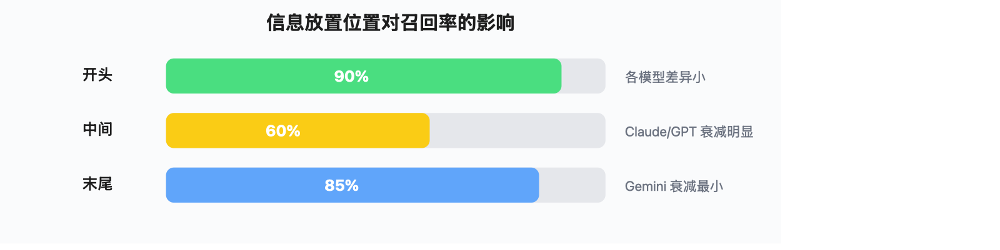
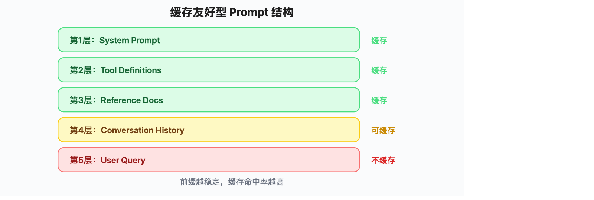

# 05 - 模型特异性上下文策略：Claude / Gemini / GPT 的针对性优化方案

> **一句话定位**：同样是上下文工程，Claude 要你用 XML 标签组织信息，Gemini 让你直接塞整个文档进去，GPT 靠检索排序取胜——不理解模型特性，再好的策略也是削足适履。

---

## 一、为什么上下文策略需要因模型而异

### 1.1 三个根本差异

不同模型处理上下文的方式差异，根源在三个技术维度：

| 维度 | 影响 | 举例 |
|------|------|------|
| **注意力机制** | 决定模型如何分配对不同位置信息的"注意力" | Claude 对前部信息更敏感，Gemini 对中间衰减更小 |
| **窗口大小** | 决定能塞多少信息 | Claude 1M vs Gemini 1M，同一量级 |
| **缓存机制** | 决定重复信息的成本 | Claude 需要手动标记断点，OpenAI 自动缓存 |

类比一下：这三家模型就像三种不同性格的阅读者——

- **Claude** 像一个讲究条理的分析师，你给他分好标签的文件夹，他处理得又快又好；你给他一沓散纸，他就开始犯迷糊
- **Gemini** 像一个阅读速度极快的通才，整本电话簿扔给他也能找到关键信息，但他不擅长从"找什么"的角度去优化
- **GPT** 像一个经验丰富的顾问，给他精选的参考资料比给他全部档案效果更好

### 1.2 "Lost in the Middle" 的模型差异

2025 年 Chroma 的 "Context Rot" 研究测试了 18 个模型，发现所有模型都存在长上下文衰减，但程度差异显著：



> ▲ 信息放置位置对召回率的影响：开头（90%，各模型差异小）→ 中间（60%，Claude/GPT 衰减明显）→ 末尾（85%，Gemini 衰减最小）

这意味着：**同一套上下文组装策略，在不同模型上的效果可能天差地别**。

---

## 二、Claude 系列的上下文优化

### 2.1 XML 标签：Claude 的"原生语言"

Claude 模型在训练中大量接触了 XML 结构化数据，因此对 XML 标签有天然的理解力。这不是"技巧"，而是模型能力的一部分。

**核心原则**：用标签把上下文的不同部分隔开，让模型知道"这段是指令，那段是参考资料"。

```python
# 反例：一坨混在一起的上下文
bad_prompt = """
你是一个客服助手。用户问订单问题要查数据库，问退换货要查政策。
以下是用户历史：张三上周买了一双鞋，尺码不对想换。
以下是退换货政策：7天内可退，14天内可换，需要原包装。
用户现在问：我这双鞋能退吗？
"""

# 正例：用 XML 标签组织
good_prompt = """
<instructions>
你是一个客服助手。回答用户关于订单和退换货的问题。
根据 <policy> 中的政策回答，不要编造政策外的承诺。
</instructions>

<user_context>
<name>张三</name>
<purchase>
  商品：运动鞋
  时间：上周
  问题：尺码不对，想换
</purchase>
</user_context>

<policy>
7天内可退，14天内可换，需要原包装。
</policy>

<user_question>
我这双鞋能退吗？
</user_question>
"""
```

**关键技巧**：

| 技巧 | 说明 | 效果 |
|------|------|------|
| 嵌套标签 | `<documents><document index="1">...</document></documents>` | 多文档场景下帮助模型区分不同来源 |
| 标签名即语义 | 用 `<policy>` 而不是 `<section1>` | 模型能从标签名推断内容类型 |
| 指令引用标签 | "根据 `<policy>` 中的内容回答" | 让模型精准定位参考信息 |
| 标签包裹工具输出 | `<tool_result name="search">...</tool_result>` | 防止工具输出被当成指令执行 |

### 2.2 Prompt Caching：前缀设计决定成本

Claude 的 Prompt Caching 要求**开发者手动标记缓存断点**，缓存的是"从头到断点"的前缀部分。

```python
import anthropic

client = anthropic.Anthropic()

# 设计原则：把不变的内容放前面，变化的内容放后面
response = client.messages.create(
    model="claude-sonnet-4-6",
    max_tokens=1024,
    system=[
        {
            "type": "text",
            "text": "你是一个专业的法律助手..." + very_long_system_prompt,
            "cache_control": {"type": "ephemeral"}  # ← 缓存断点
        }
    ],
    messages=[
        # 第一条消息：固定的上下文（也会被缓存）
        {
            "role": "user",
            "content": [
                {
                    "type": "text",
                    "text": long_reference_document,  # 固定的参考文档
                    "cache_control": {"type": "ephemeral"}  # ← 第二个断点
                }
            ]
        },
        # 后续消息：动态内容（不缓存，每次新生成）
        {
            "role": "user",
            "content": "用户的具体问题..."  # 变化的内容放最后
        }
    ]
)
```

**成本影响**（⚠️ 以下价格截至 2025 年 6 月，实际价格请以官方为准）：

| 场景 | 输入价格（每百万 token） | 说明 |
|------|------------------------|------|
| 首次请求（无缓存） | $3.00 | 完整价格 |
| 缓存写入 | $3.75 | 首次写入缓存，略贵 |
| 缓存命中（读取） | $0.30 | **降 90%** |

**设计要点**：系统提示 + 工具定义 + 固定参考资料放在前面并标记缓存断点，用户查询和动态上下文放在后面。

### 2.3 1M 窗口的实用策略

Claude 的 1M 窗口已经是主流水平，有自己的用法：

```python
# 长文档处理策略：先定位再深读
def claude_long_doc_strategy(document, question):
    """
    策略：不要把整篇文档一股脑丢给 Claude，
    而是用两轮对话——先让 Claude 标出相关段落，再深入分析
    """
    # 第一轮：定位
    locate_prompt = f"""
    <document>
    {document}
    </document>
    
    <task>
    找出与以下问题最相关的 3 个段落，给出段落编号和简要说明：
    问题：{question}
    </task>
    """
    
    # 第二轮：根据定位结果，只传相关段落
    # （在实际 Agent 中，这对应"先检索再注入"的模式）
```

---

## 三、Gemini 系列的上下文优化

### 3.1 超长窗口：是优势，也是陷阱

Gemini 3.5 Flash 支持 1M token 窗口（截至 2026 年 6 月，已正式支持 1M 窗口）。Gemini 3.1 Pro 同样支持 1M 窗口。这意味着你可以把**整个代码库、数十篇论文、一整年的聊天记录**全部塞进去。

但"能塞"不等于"应该塞"：

| 方面 | 直接塞入 | RAG 检索 |
|------|---------|---------|
| **适用场景** | 文档少（<100 页）、需要全文推理 | 文档多（>100 页）、查询明确 |
| **延迟** | 高（prefill 需要时间） | 低（只传相关片段） |
| **成本** | 按全部 token 计费 | 按检索到的 token 计费 |
| **准确性** | 跨文档推理更好 | 单文档精确查找更好 |

```python
# Gemini 直接塞入 vs RAG 的决策树
def should_use_full_context(docs, question_type, latency_sensitive=False):
    """
    决策：什么时候直接塞，什么时候用 RAG
    """
    total_tokens = sum(estimate_tokens(d) for d in docs)
    
    # 小文档 + 需要全局推理 → 直接塞
    if total_tokens < 200_000 and question_type == "synthesis":
        return "full_context"
    
    # 大文档 + 明确查询 → RAG
    if total_tokens > 500_000 and question_type == "lookup":
        return "rag"
    
    # 中间地带 → 看延迟要求
    if latency_sensitive:
        return "rag"
    return "full_context"
```

### 3.2 Gemini 的 Prompt 设计偏好

根据 Google 官方 Prompt Engineering 白皮书，Gemini 有一些独特的偏好：


> ▲ Gemini Prompt 偏好顺序：① 指令（简短直接）→ ② 少量示例（few-shot）→ ③ 上下文数据 → ④ 具体问题放在最后

```python
# Gemini 风格的 prompt 组织
gemini_prompt = """
任务：从财务报告中提取关键指标。

示例：
输入：营收同比增长 15%，净利润率 8.2%
输出：{"revenue_growth": "15%", "net_margin": "8.2%"}

以下是财务报告全文：
[报告内容...]

请从上述报告中提取：营收增长率、净利润率、现金流情况。
"""
```

### 3.3 Context Caching：Gemini 的缓存方案

Gemini 提供两种缓存模式：

| 模式 | 机制 | 成本 | 适用场景 |
|------|------|------|---------|
| **隐式缓存** | 自动生效，无需配置 | 无保证的折扣 | 请求前缀完全相同的场景 |
| **显式缓存** | 手动创建 Cache 对象 | 有折扣保证 | 大量重复引用同一文档 |

```python
from google import genai

client = genai.Client()

# 创建显式缓存
cache = client.caches.create(
    model="gemini-3.5-flash",
    config={
        "contents": [long_document],  # 要缓存的大文档
        "system_instruction": "你是...",
        "ttl": "3600s",  # 缓存存活时间
    }
)

# 使用缓存
response = client.models.generate_content(
    model="gemini-3.5-flash",
    contents="基于缓存中的文档，回答...",
    config={"cached_content": cache.name}
)
```

---

## 四、GPT 系列的上下文优化

### 4.1 自动缓存：GPT 的"省心"设计

OpenAI 的 Prompt Caching 最大特点是**全自动**——你不需要做任何配置，只要前缀相同且超过 1024 token，就自动触发缓存。

```python
from openai import OpenAI

client = OpenAI()

# OpenAI 自动缓存——只需要保证前缀稳定即可
response = client.chat.completions.create(
    model="gpt-5.5",
    messages=[
        # 系统提示（稳定，会被缓存）
        {"role": "system", "content": long_system_prompt},
        # 历史对话（相对稳定，也会被缓存）
        {"role": "user", "content": "之前的对话历史..."},
        {"role": "assistant", "content": "之前的回复..."},
        # 最新问题（变化的部分，不会被缓存）
        {"role": "user", "content": "新问题"}
    ]
)

# 缓存状态在 usage 中返回
# response.usage.prompt_tokens_details.cached_tokens
```

**成本对比**（⚠️ 以下价格截至 2026 年 6 月，实际价格请以官方为准）：

| token 类型 | GPT-5.5 价格 | 说明 |
|-----------|------------|------|
| 普通输入 | $5.00/M | 标准价格 |
| 缓存命中输入 | $0.50/M | **降 90%** |

### 4.2 256K 窗口的检索优先策略

GPT 的 256K 窗口不算小，但和 Gemini/Claude 的 1M 比差距明显。GPT 的策略核心是**把有限窗口用在刀刃上**。

```python
def gpt_context_strategy(documents, query, max_context_tokens=200_000):
    """
    GPT 上下文策略：精选 > 全塞
    1. 检索相关片段
    2. 按相关性排序
    3. 裁剪到窗口内
    """
    # 第一步：检索
    relevant_chunks = retrieve(query, documents, top_k=20)
    
    # 第二步：重排序（reranker 提升精度）
    reranked = rerank(query, relevant_chunks, top_k=10)
    
    # 第三步：裁剪到窗口内，相关性高的优先
    context = ""
    for chunk in reranked:
        if count_tokens(context + chunk) > max_context_tokens:
            break
        context += chunk + "\n\n"
    
    return context
```

### 4.3 结构化输出：GPT 的独特优势

GPT 系列对 JSON Schema 的遵循能力很强，可以利用这一点优化上下文中的信息提取：

```python
# 利用 GPT 的 structured output 能力做信息提取
response = client.chat.completions.create(
    model="gpt-5.5",
    messages=[...],
    response_format={
        "type": "json_schema",
        "json_schema": {
            "name": "document_analysis",
            "schema": {
                "type": "object",
                "properties": {
                    "key_findings": {"type": "array", "items": {"type": "string"}},
                    "risk_level": {"type": "string", "enum": ["low", "medium", "high"]},
                    "summary": {"type": "string"}
                },
                "required": ["key_findings", "risk_level", "summary"]
            }
        }
    }
)
```

---

## 五、开源模型的上下文策略

### 5.1 主流开源模型的窗口能力

| 模型 | 窗口大小 | 特点 |
|------|---------|------|
| Llama 4 Scout | 10M（理论窗口）| 目前开源最大窗口，但实际有效窗口远小于此值（模型训练窗口为 256K，通过 RoPE 扩展至 10M，远距离信息召回率会显著下降） |
| Llama 4 Maverick | 1-2M（理论窗口）| 视频/代码库级处理，同样存在理论窗口 vs 有效窗口的差异 |
| Qwen 3.5-Plus | 1M | 中文优化，最新一代 |
| Qwen 3-Coder | 256K | 代码专用，Agent 能力强 |
| DeepSeek V4 Pro | 1M | 推理和代码能力顶尖 |
| DeepSeek V4 Flash | 1M | 极致性价比，$0.1/M 输入 |

### 5.2 开源模型的上下文特点

开源模型在上下文处理上和闭源模型有几个关键区别：

1. **没有厂商级缓存服务**——需要自己用 vLLM 的 Automatic Prefix Caching 实现
2. **长上下文衰减更明显**——小模型的注意力分配不如大模型均匀
3. **中文/代码等垂直领域有优势**——Qwen 在中文场景、DeepSeek 在代码场景下，短上下文表现可能优于通用大模型

```python
# vLLM 部署时的前缀缓存配置
# vllm serve Qwen/Qwen3.5-Plus \
#   --enable-prefix-caching \
#   --max-model-len 131072

# 实际调用时，把稳定的系统提示放在前面
# vLLM 会自动缓存前缀，避免重复计算
```

---

## 六、缓存策略对比

### 6.1 三家缓存机制全面对比

| 维度 | Claude (Anthropic) | GPT (OpenAI) | Gemini (Google) |
|------|-------------------|-------------|----------------|
| **触发方式** | 手动标记断点 | 自动（>1024 token 前缀匹配） | 隐式自动 + 显式手动 |
| **开发者控制** | 高（精确控制缓存范围） | 低（全自动） | 中（可选自动或手动） |
| **折扣幅度** | 90%（读取 $0.30 vs 写入 $3.75） | 90%（$0.50 vs $5.00） | 隐式无保证，显式有折扣 |
| **缓存粒度** | 按断点切分 | 按前缀匹配 | 按 Cache 对象 |
| **TTL** | 5 分钟（可配置） | 5-10 分钟（自动） | 自定义（创建时指定） |
| **适用场景** | 长系统提示 + 固定参考文档 | 任何前缀稳定的请求 | 大文档重复引用 |

### 6.2 缓存命中率优化

不管用哪家，核心原则一样：**把不变的内容放前面，变化的放后面**。

```python
# 通用的缓存友好型 prompt 结构
def build_cache_friendly_prompt(
    system_prompt,       # 不变 → 放第 1 层
    tool_definitions,    # 不变 → 放第 2 层
    reference_docs,      # 不变 → 放第 3 层
    conversation_history,# 半稳定 → 放第 4 层
    user_query           # 每次变化 → 放最后
):
    """
    前缀越稳定，缓存命中率越高
    """
    return [
        {"role": "system", "content": system_prompt + "\n\n" + tool_definitions},
        {"role": "user", "content": reference_docs},
        *conversation_history,
        {"role": "user", "content": user_query}
    ]
```



> ▲ 缓存友好型 Prompt 结构：第1层 System Prompt（不变，缓存）→ 第2层 Tool Definitions（不变，缓存）→ 第3层 Reference Docs（不变，缓存）→ 第4层 Conversation History（半稳定，可缓存）→ 第5层 User Query（每次变化，不缓存），前缀越稳定，缓存命中率越高

**注意事项**：

- **不要在系统提示中放动态内容**（如时间戳、请求 ID）——这会破坏整个前缀的缓存
- **不要频繁修改工具定义**——工具列表变化会导致前缀变化，缓存失效
- **对话历史的压缩/裁剪会破坏缓存**——如果需要压缩历史，考虑在压缩后的内容后面再追加新消息，而不是修改已有部分

---

## 七、模型切换时的上下文迁移

### 7.1 典型场景

实际工程中，模型切换很常见：

- 从 GPT 切到 Claude（成本、延迟、能力差异）
- 从 Claude 切到 Gemini（需要更长窗口）
- 主模型不可用时的降级方案

### 7.2 迁移清单

| 操作 | Claude → GPT | GPT → Claude | 任意 → Gemini |
|------|-------------|-------------|--------------|
| **prompt 格式** | XML 标签 → 自然语言/Markdown | 自然语言 → XML 标签 | 保持简短，加 few-shot |
| **缓存断点** | 移除手动断点，依赖自动缓存 | 添加手动断点 | 创建显式 Cache 对象 |
| **信息组织** | 保持标签结构，GPT 也能理解 | 新增 XML 标签包裹 | 缩短指令，数据放前面问题放后面 |
| **窗口利用** | 可能需要增加 RAG 比例 | 可以适当增加注入量 | 可以减少 RAG，直接塞入 |
| **示例数量** | 1-3 个 few-shot | 1-3 个 few-shot | 2-5 个 few-shot（Gemini 偏好更多） |

### 7.3 抽象层方案

在实际工程中，建议通过一个上下文抽象层来屏蔽模型差异：

```python
class ContextBuilder:
    """模型无关的上下文构建器"""
    
    def __init__(self, model_provider: str):
        self.provider = model_provider
        self.chunks = []  # [(type, content, priority)]
    
    def add_system(self, content: str):
        self.chunks.append(("system", content, 0))
        return self
    
    def add_reference(self, content: str, source: str = ""):
        self.chunks.append(("reference", content, 1))
        return self
    
    def add_tool_result(self, tool_name: str, result: str):
        self.chunks.append(("tool", result, 2))
        return self
    
    def add_user_query(self, query: str):
        self.chunks.append(("query", query, 3))
        return self
    
    def build(self) -> list[dict]:
        """根据模型特性组装最终 prompt"""
        if self.provider == "anthropic":
            return self._build_for_claude()
        elif self.provider == "openai":
            return self._build_for_gpt()
        elif self.provider == "google":
            return self._build_for_gemini()
    
    def _build_for_claude(self) -> list[dict]:
        """Claude：用 XML 标签包裹各部分"""
        parts = []
        for chunk_type, content, _ in self.chunks:
            tag = {"system": "instructions", "reference": "context",
                   "tool": "tool_result", "query": "user_question"}[chunk_type]
            parts.append(f"<{tag}>\n{content}\n</{tag}>")
        return [{"role": "user", "content": "\n\n".join(parts)}]
    
    def _build_for_gpt(self) -> list[dict]:
        """GPT：标准 message 数组，系统提示单独提"""
        messages = []
        for chunk_type, content, _ in self.chunks:
            if chunk_type == "system":
                messages.append({"role": "system", "content": content})
            else:
                messages.append({"role": "user", "content": content})
        return messages
    
    def _build_for_gemini(self) -> list[dict]:
        """Gemini：简短指令 + 数据 + 问题放最后"""
        instructions = [c for t, c, _ in self.chunks if t == "system"]
        data = [c for t, c, _ in self.chunks if t in ("reference", "tool")]
        query = [c for t, c, _ in self.chunks if t == "query"]
        
        prompt = f"{' '.join(instructions)}\n\n"
        prompt += "\n\n".join(data) + "\n\n"
        prompt += " ".join(query)
        return [{"role": "user", "content": prompt}]
```

---

## 八、实战建议总结

### 快速决策表

| 你的情况 | 推荐模型 | 上下文策略 |
|---------|---------|-----------|
| 需要全文档推理、预算充足 | Gemini 3.1 Pro / 3.5 Flash | 直接塞入，少用 RAG |
| 需要精确指令遵循、代码任务 | Claude Opus 4.8 / Sonnet 4.6 | XML 标签组织 + Prompt Caching |
| 生产系统、成本敏感 | DeepSeek V4 Flash | 精选 RAG + 自动缓存（$0.1/M 极致性价比） |
| 中文场景、自部署 | Qwen 3.5-Plus | vLLM 前缀缓存 + 裁剪优化 |
| 代码分析、自部署 | DeepSeek V4 Pro | 1M 窗口 + 工具调用 |

### 三条通用原则

1. **前缀稳定性决定缓存效率**——不管你用哪家模型，把不变的内容放前面
2. **窗口大小不等于有效上下文**——256K 窗口用好了，可能比 1M 窗口乱塞效果更好
3. **模型能力在进化，策略要跟着调**——定期 benchmark 你的上下文策略在新模型上的表现

---

## 参考资料

1. Anthropic. "Prompt caching with Claude." 2024. [https://docs.anthropic.com/en/docs/build-with-claude/prompt-caching](https://docs.anthropic.com/en/docs/build-with-claude/prompt-caching)
2. Anthropic. "Claude Prompting Best Practices." [https://platform.claude.com/docs/en/build-with-claude/prompt-engineering/claude-prompting-best-practices](https://platform.claude.com/docs/en/build-with-claude/prompt-engineering/claude-prompting-best-practices)
3. OpenAI. "Prompt caching (automatic!)." OpenAI Developer Community, 2024. [https://community.openai.com/t/prompt-caching-automatic/963981](https://community.openai.com/t/prompt-caching-automatic/963981)
4. Google. "Long context." Gemini API Documentation. [https://ai.google.dev/gemini-api/docs/long-context](https://ai.google.dev/gemini-api/docs/long-context)
5. Chroma. "Context Rot." 2025 — 18 个模型的长上下文衰减测试. [https://research.trychroma.com/context-rot](https://research.trychroma.com/context-rot)
6. Li et al. "LaRA: Benchmarking RAG and Long-Context LLMs." 2025. [https://arxiv.org/abs/2502.09977](https://arxiv.org/abs/2502.09977)
7. Lumer et al. "Don't Break the Cache: An Evaluation of Prompt Caching for Long-Horizon Agentic Tasks." arXiv, 2025. [https://arxiv.org/abs/2601.06007](https://arxiv.org/abs/2601.06007)
8. Thomas Wiegold. "Prompt Engineering Best Practices 2026." [https://thomas-wiegold.com/blog/prompt-engineering-best-practices-2026](https://thomas-wiegold.com/blog/prompt-engineering-best-practices-2026)
9. Introl. "Long-Context LLM Infrastructure." 2025. [https://introl.com/blog/long-context-llm-infrastructure-million-token-windows-guide](https://introl.com/blog/long-context-llm-infrastructure-million-token-windows-guide)
10. Meilisearch. "RAG vs. long-context LLMs: A side-by-side comparison." 2025. [https://www.meilisearch.com/blog/rag-vs-long-context-llms-a-side-by-side-comparison](https://www.meilisearch.com/blog/rag-vs-long-context-llms-a-side-by-side-comparison)
