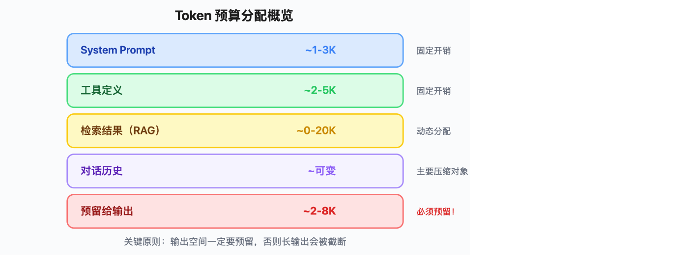
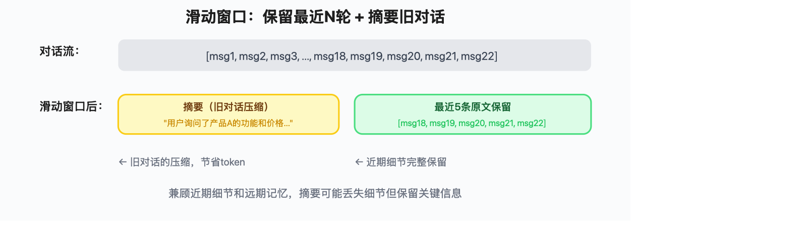
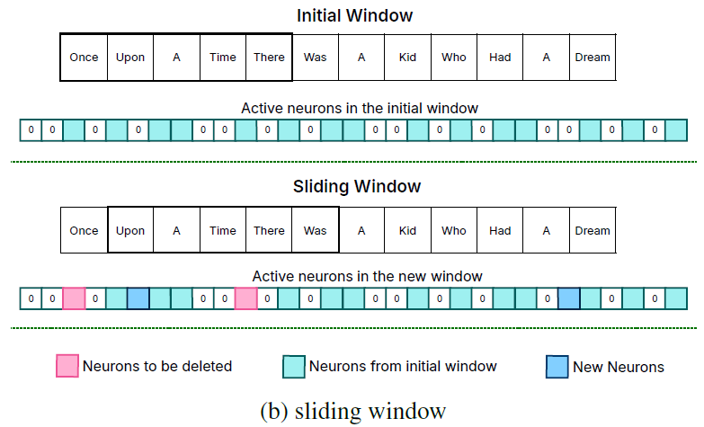
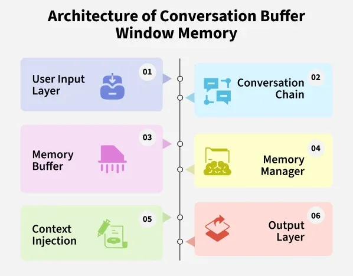
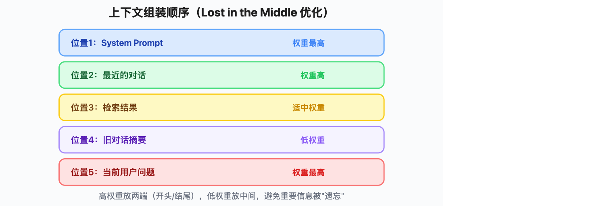
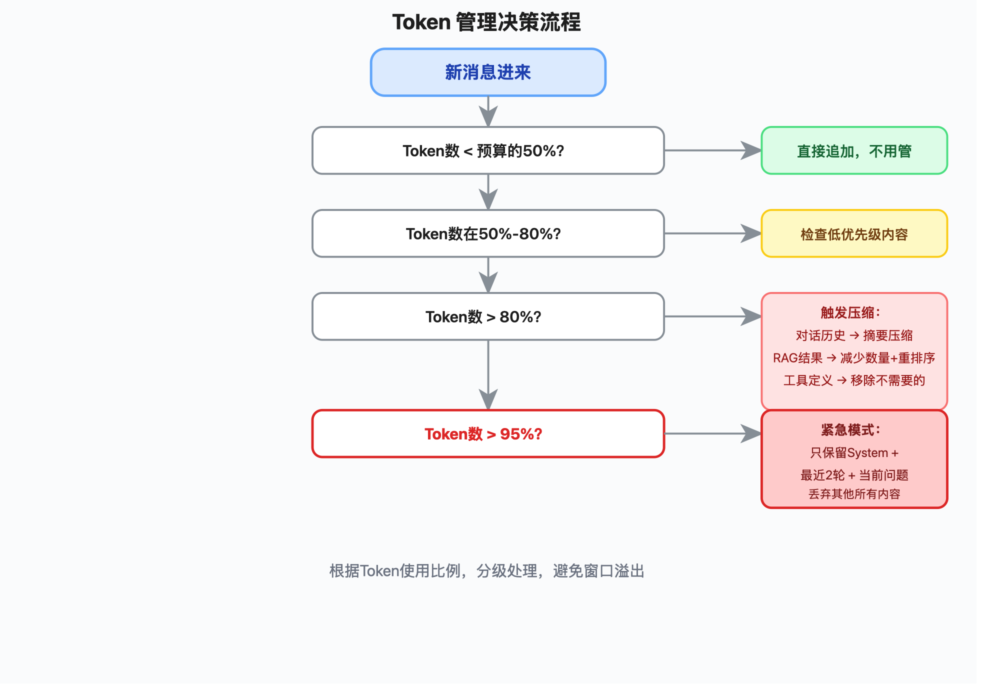

# 上下文窗口管理实战：Token预算分配与长对话策略

> Token窗口就像你的钱包——钱就这么多，花在哪里决定了Agent的表现好坏。本文讲清楚怎么给Token做预算、怎么处理长对话、怎么避免"中间失忆"。

---

## 一、为什么需要窗口管理

很多开发者拿到256K甚至1M的上下文窗口，第一反应是"够用了，不用管"。但实际上，窗口管理是Agent工程里最容易被忽视、也最容易翻车的环节。

### 1.1 Token窗口是有限资源

截至2026年6月，主流模型的上下文窗口情况：

| 模型 | 上下文窗口 | 输入价格（约） | 特点 |
|------|-----------|---------------|------|
| GPT-5.5 | 1M | $5/M tokens | 综合能力最强 |
| DeepSeek V4 Flash | 1M | $0.1/M tokens | 国产性价比之王，超长窗口 |
| DeepSeek V4 Pro | 1M | $0.44/M tokens | 推理能力更强 |
| Claude Opus 4.8 | 1M | $5/M tokens | 最强推理，长上下文质量最佳 |
| Gemini 3.5 Flash | 1M | $1.50/M tokens | 最新一代，性价比高 |

关键认知：**窗口大 ≠ 可以乱塞**。1M的窗口，如果真的塞满，光API调用就要等好几秒，而且模型对中间位置的信息回忆能力会显著下降。

### 1.2 成本压力：每token都在烧钱

算一笔账：假设你的Agent每次对话平均用掉30K tokens，每天1万次调用，用GPT-5.5：

```
30K × 10,000 × $5 / 1,000,000 = $1,500/天 ≈ $45,000/月
```

如果通过窗口管理把平均用量压到15K tokens，成本直接砍半。这不是小钱。

### 1.3 性能压力：上下文越长，延迟越高

LLM推理的时间复杂度和上下文长度不是线性关系——大致是O(n²)。128K窗口的推理延迟可能是4K窗口的几十倍。用户等3秒和等30秒，体验天差地别。

### 1.4 质量压力：Lost in the Middle问题

这是2023年斯坦福的论文《Lost in the Middle》发现的重要现象：

- 模型对**开头**的信息记得最清楚（Primacy Effect）
- 模型对**结尾**的信息记得也比较清楚（Recency Effect）
- 模型对**中间**的信息回忆能力显著下降

这就意味着：如果你把重要信息塞在一堆对话历史的中间，模型很可能会"视而不见"。上下文的**组装顺序**和**位置**比你想象的重要得多。

---

## 二、Token预算分配策略

### 2.1 固定预算 vs 动态预算

**固定预算**：不管什么场景，每个组件分配固定的token上限。

```
优点：简单、可预测、不容易超限
缺点：浪费——有的场景System Prompt很短，有的场景检索结果很多
```

**动态预算**：根据实际内容和场景，动态调整各组件的token分配。

```
优点：资源利用率高
缺点：实现复杂，需要额外的编排逻辑
```

实际项目中，推荐**混合方案**：给每个组件设一个固定上限（硬限制），同时根据场景动态决定实际使用量。

### 2.2 各组件预算划分

一个典型的Agent请求，上下文由以下几部分组成：



> ▲ Token 预算分配概览：System Prompt（~1-3K，固定开销）→ 工具定义（~2-5K，固定开销）→ 检索结果 RAG（~0-20K，动态分配）→ 对话历史（~可变，主要压缩对象）→ 预留给输出（~2-8K，必须预留）

**关键原则：输出空间一定要预留。** 如果模型需要输出一个长JSON或者一段分析，没有预留空间就会被截断。

### 2.3 代码示例：Token预算计算器

```python
"""
Token Budget Calculator
根据模型的上下文窗口大小，自动计算各组件的token预算。
"""
from dataclasses import dataclass, field
from typing import Optional
import tiktoken


@dataclass
class TokenBudget:
    """Token budget allocation for a single LLM request."""
    
    # Model context window size
    total_window: int = 128_000
    # Reserved for model output
    output_reserve: int = 4_096
    # System prompt allocation
    system_prompt: int = 3_000
    # Tool definitions allocation
    tool_definitions: int = 5_000
    # RAG / retrieval results allocation
    retrieval: int = 20_000
    
    @property
    def available_for_history(self) -> int:
        """Remaining tokens available for conversation history."""
        used = self.system_prompt + self.tool_definitions + self.retrieval + self.output_reserve
        remaining = self.total_window - used
        return max(remaining, 0)
    
    def report(self) -> dict:
        """Return a breakdown of the budget."""
        total_planned = (
            self.system_prompt 
            + self.tool_definitions 
            + self.retrieval 
            + self.output_reserve 
            + self.available_for_history
        )
        return {
            "total_window": self.total_window,
            "system_prompt": self.system_prompt,
            "tool_definitions": self.tool_definitions,
            "retrieval": self.retrieval,
            "output_reserve": self.output_reserve,
            "available_for_history": self.available_for_history,
            "utilization": f"{total_planned / self.total_window:.1%}",
        }


def count_tokens(text: str, model: str = "gpt-5.5") -> int:
    """Count tokens using tiktoken. Falls back to cl100k_base for unknown models."""
    try:
        enc = tiktoken.encoding_for_model(model)
    except KeyError:
        enc = tiktoken.get_encoding("cl100k_base")
    return len(enc.encode(text))


# --- Usage example ---
if __name__ == "__main__":
    # DeepSeek V4 Flash 有 1M 窗口，此处用 128K 示例
    budget = TokenBudget(total_window=128_000)
    for k, v in budget.report().items():
        print(f"  {k}: {v}")
    # Output:
    #   total_window: 128000
    #   system_prompt: 3000
    #   tool_definitions: 5000
    #   retrieval: 20000
    #   output_reserve: 4096
    #   available_for_history: 95904
    #   utilization: 100.0%
```

## 三、滑动窗口策略

### 3.1 固定窗口 vs 滑动窗口

**固定窗口**：只保留最近N条消息，直接丢弃更早的对话。

```
优点：实现简单，token用量可控
缺点：丢弃 = 信息丢失，模型可能忘记用户之前说过的重要信息
```

**滑动窗口**：保留最近N条消息的原文，同时对更早的消息生成摘要保留。

```
优点：兼顾近期细节和远期记忆
缺点：摘要可能丢失细节，需要额外的LLM调用来生成摘要
```

### 3.2 滑动窗口实现：保留最近N轮 + 摘要旧对话

核心思路：



> ▲ 滑动窗口机制：对话流经过滑动窗口处理后，旧对话压缩为摘要（节省token），最近5条原文保留（保持近期细节）

### 3.3 代码示例：带滑动窗口的对话管理

```python
"""
Sliding Window Memory
使用滑动窗口管理对话历史，旧对话自动压缩为摘要。
"""
from typing import List
from langchain_core.messages import BaseMessage, HumanMessage, AIMessage, SystemMessage
from langchain_core.language_models import BaseChatModel


class SlidingWindowMemory:
    """Sliding window memory with automatic summarization."""
    
    def __init__(
        self,
        llm: BaseChatModel,
        window_size: int = 10,          # Keep last N messages
        token_budget: int = 80_000,     # Max tokens for history
        summary_trigger: int = 15,      # Summarize when messages exceed this
    ):
        self.llm = llm
        self.window_size = window_size
        self.token_budget = token_budget
        self.summary_trigger = summary_trigger
        self.messages: List[BaseMessage] = []
        self.summary: str = ""
    
    def add_message(self, message: BaseMessage):
        """Add a message and trigger summarization if needed."""
        self.messages.append(message)
        if len(self.messages) > self.summary_trigger:
            self._summarize_old_messages()
    
    def _summarize_old_messages(self):
        """Compress older messages into a summary, keep recent ones."""
        # Messages to summarize (everything except the last window_size)
        cutoff = len(self.messages) - self.window_size
        old_messages = self.messages[:cutoff]
        
        # Build conversation text for summarization
        conversation_text = "\n".join(
            f"{msg.type}: {msg.content}" for msg in old_messages
        )
        
        prompt = f"""请将以下对话历史压缩为一段简洁的摘要，保留关键信息（用户需求、决策、重要事实）：

之前已有摘要：{self.summary if self.summary else "无"}

对话内容：
{conversation_text}

要求：输出中文摘要，不超过500字。"""
        
        response = self.llm.invoke([HumanMessage(content=prompt)])
        self.summary = response.content
        
        # Only keep recent messages
        self.messages = self.messages[cutoff:]
    
    def get_messages(self) -> List[BaseMessage]:
        """Get messages ready for LLM call, including summary if available."""
        result = []
        
        # Add summary as a system message if we have one
        if self.summary:
            result.append(
                SystemMessage(content=f"以下是之前对话的摘要：\n{self.summary}")
            )
        
        result.extend(self.messages)
        return result
    
    def clear(self):
        """Clear all memory."""
        self.messages = []
        self.summary = ""


# --- Usage example ---
if __name__ == "__main__":
    from langchain_openai import ChatOpenAI
    
    # Works with DeepSeek too: ChatOpenAI(base_url="https://api.deepseek.com", model="deepseek-v4-flash")
    llm = ChatOpenAI(model="deepseek-v4-flash", temperature=0)
    memory = SlidingWindowMemory(llm=llm, window_size=6, summary_trigger=10)
    
    # Simulate a conversation
    memory.add_message(HumanMessage(content="我想买一台笔记本电脑"))
    memory.add_message(AIMessage(content="好的，您有什么预算和使用需求吗？"))
    memory.add_message(HumanMessage(content="预算8000左右，主要写代码"))
    memory.add_message(AIMessage(content="推荐ThinkPad X1 Carbon或MacBook Air M3"))
    memory.add_message(HumanMessage(content="我选MacBook Air，能帮我比较下配置吗？"))
    memory.add_message(AIMessage(content="MacBook Air M3 有8GB和16GB两个版本..."))
    memory.add_message(HumanMessage(content="16GB的多少钱？"))
    memory.add_message(AIMessage(content="16GB版本约9499元"))
    memory.add_message(HumanMessage(content="有点超预算，有没有更便宜的方案？"))
    memory.add_message(AIMessage(content="可以考虑教育优惠或者翻新机..."))
    
    # This triggers summarization (message count > 10)
    memory.add_message(HumanMessage(content="好的，我考虑下教育优惠方案"))
    
    print("=== Summary ===")
    print(memory.summary)
    print("\n=== Current Messages ===")
    for msg in memory.get_messages():
        print(f"  [{msg.type}] {msg.content[:80]}...")
```

---

> **图示：滑动窗口与对话记忆机制**
>
> 
>
> 
>
> *（图片来源：MachineCurve / GeeksforGeeks）*

## 四、上下文组装器设计

### 4.1 组装顺序的重要性

还记得Lost in the Middle吗？上下文组装器的核心任务就是**把最重要的信息放在模型最容易看到的位置**。

研究表明，最优的信息放置策略是：



> ▲ 上下文组装顺序（Lost in the Middle 优化）：位置1 System Prompt（权重最高）→ 位置2 最近的对话（权重高）→ 位置3 检索结果（适中权重）→ 位置4 旧对话摘要（低权重）→ 位置5 当前用户问题（权重最高），高权重放两端，低权重放中间

### 4.2 代码示例：ContextAssembler类

```python
"""
Context Assembler
按优先级组装上下文，确保关键信息在最优位置。
"""
from dataclasses import dataclass
from typing import List, Optional
from langchain_core.messages import BaseMessage, SystemMessage, HumanMessage


@dataclass
class ContextBlock:
    """A block of context with priority and token count."""
    name: str
    content: str
    priority: int          # Lower number = higher priority = placed earlier
    token_count: int
    is_system: bool = False


class ContextAssembler:
    """
    Assembles context blocks into a properly ordered prompt.
    
    Strategy: Lost in the Middle mitigation
    - High priority items go to the START or END of context
    - Lower priority items fill the middle
    """
    
    def __init__(self, max_tokens: int = 128_000, output_reserve: int = 4_096):
        self.max_tokens = max_tokens
        self.output_reserve = output_reserve
        self.blocks: List[ContextBlock] = []
        self.used_tokens = 0
    
    def add_block(self, block: ContextBlock) -> bool:
        """Add a context block if it fits in the budget."""
        available = self.max_tokens - self.output_reserve - self.used_tokens
        if block.token_count > available:
            return False  # No room
        self.blocks.append(block)
        self.used_tokens += block.token_count
        return True
    
    def assemble(self, user_query: str, query_tokens: int) -> List[BaseMessage]:
        """
        Assemble context into ordered messages.
        
        Layout:
        1. System blocks (sorted by priority, ascending)
        2. Non-system blocks (sorted by priority, descending — lower priority in middle)
        3. User query at the very end
        """
        system_blocks = sorted(
            [b for b in self.blocks if b.is_system],
            key=lambda b: b.priority
        )
        
        non_system_blocks = sorted(
            [b for b in self.blocks if not b.is_system],
            key=lambda b: b.priority,
            reverse=True  # Lower priority first (middle position)
        )
        
        messages: List[BaseMessage] = []
        
        # System prompts go first
        combined_system = "\n\n---\n\n".join(b.content for b in system_blocks)
        if combined_system:
            messages.append(SystemMessage(content=combined_system))
        
        # Non-system context in middle (lower priority = further from edges)
        for block in non_system_blocks:
            messages.append(SystemMessage(
                content=f"[{block.name}]\n{block.content}"
            ))
        
        # User query always last
        messages.append(HumanMessage(content=user_query))
        
        return messages
    
    def summary(self) -> dict:
        """Return a summary of token usage."""
        return {
            "max_tokens": self.max_tokens,
            "output_reserve": self.output_reserve,
            "used_tokens": self.used_tokens,
            "available_tokens": self.max_tokens - self.output_reserve - self.used_tokens,
            "blocks": [(b.name, b.token_count, b.priority) for b in self.blocks],
        }


# --- Usage example ---
if __name__ == "__main__":
    assembler = ContextAssembler(max_tokens=128_000)
    
    # Add blocks in priority order (lower priority number = more important)
    assembler.add_block(ContextBlock(
        name="system_prompt",
        content="你是一个专业的客服助手...",
        priority=1,      # Highest priority — goes first
        token_count=500,
        is_system=True,
    ))
    
    assembler.add_block(ContextBlock(
        name="recent_chat",
        content="用户: 我想退货\n助手: 好的，请问订单号是？",
        priority=2,      # High priority — recent context
        token_count=200,
    ))
    
    assembler.add_block(ContextBlock(
        name="rag_results",
        content="退货政策：30天内无理由退货...",
        priority=3,      # Medium priority — retrieved docs
        token_count=1500,
    ))
    
    assembler.add_block(ContextBlock(
        name="old_summary",
        content="用户之前询问了产品A的规格和配送时间...",
        priority=10,     # Low priority — gets middle position
        token_count=300,
    ))
    
    messages = assembler.assemble(
        user_query="我的订单12345可以退货吗？",
        query_tokens=20,
    )
    
    print("=== Assembled Context ===")
    for i, msg in enumerate(messages):
        print(f"  [{i}] [{msg.type}] {msg.content[:100]}")
    
    print(f"\n=== Token Usage ===")
    for k, v in assembler.summary().items():
        print(f"  {k}: {v}")
```

---

## 五、长对话管理实战

### 5.1 对话分段策略

当对话特别长（比如一个Agent帮忙debug代码，聊了50+轮），需要把对话分成不同段落来管理：

- **活跃段**：最近几轮，保持原文，模型需要精确引用
- **近期段**：稍早的对话，可以压缩为摘要
- **历史段**：很久之前的对话，只保留关键结论

### 5.2 自动摘要触发条件

什么时候该触发摘要？常见策略：

| 触发条件 | 说明 |
|---------|------|
| 消息数超过阈值 | 简单直接，比如超过20条 |
| Token数超过预算 | 更精确，但需要实时计算 |
| 对话话题切换 | 智能触发，但实现复杂 |
| 定期触发 | 每N轮触发一次，可预测 |

实际项目中，推荐**消息数 + Token数双重触发**。

### 5.3 代码示例：LangGraph长对话Agent

```python
"""
Long Conversation Agent with LangGraph
使用LangGraph实现带自动摘要的长对话Agent。
"""
from typing import TypedDict, Annotated, List
from langchain_core.messages import BaseMessage, HumanMessage, AIMessage, SystemMessage
from langchain_openai import ChatOpenAI
from langgraph.graph import StateGraph, END
from langgraph.graph.message import add_messages
import operator


# --- State definition ---
class AgentState(TypedDict):
    """Agent state with messages and summary."""
    messages: Annotated[List[BaseMessage], add_messages]
    summary: str
    turn_count: int


# --- Configuration ---
MAX_MESSAGES = 12          # Trigger summarization after this many messages
KEEP_RECENT = 6            # Keep this many recent messages after summarization

# Works with DeepSeek too:
# llm = ChatOpenAI(base_url="https://api.deepseek.com/v1", model="deepseek-v4-flash", api_key="sk-xxx")
llm = ChatOpenAI(model="deepseek-v4-flash", temperature=0)


# --- Nodes ---
def agent_node(state: AgentState) -> dict:
    """Main agent node: call LLM with current messages."""
    messages = state["messages"]
    summary = state.get("summary", "")
    
    # Prepend summary if available
    if summary:
        messages = [
            SystemMessage(content=f"对话摘要（之前的讨论）：\n{summary}")
        ] + list(messages)
    
    # Add system prompt
    system = SystemMessage(content="你是一个有帮助的AI助手。请用中文回答。")
    messages = [system] + list(messages)
    
    response = llm.invoke(messages)
    return {
        "messages": [response],
        "turn_count": state.get("turn_count", 0) + 1,
    }


def summarize_node(state: AgentState) -> dict:
    """Summarize old messages, keep recent ones."""
    messages = state["messages"]
    old_summary = state.get("summary", "")
    
    # Messages to summarize
    to_summarize = messages[:-KEEP_RECENT]
    recent = messages[-KEEP_RECENT:]
    
    # Build summarization prompt
    conversation = "\n".join(
        f"{m.type}: {m.content}" for m in to_summarize
    )
    
    prompt = f"""请将以下对话压缩为简洁摘要（中文），保留关键信息、用户意图和重要决策。

已有摘要：{old_summary if old_summary else "无"}

新对话：
{conversation}

要求：不超过300字。"""
    
    response = llm.invoke([HumanMessage(content=prompt)])
    
    return {
        "messages": recent,  # Replace messages with only recent ones
        "summary": response.content,
    }


def should_summarize(state: AgentState) -> str:
    """Conditional edge: check if summarization is needed."""
    if len(state["messages"]) > MAX_MESSAGES:
        return "summarize"
    return "continue"


def after_summarize(state: AgentState) -> str:
    """After summarization, continue to wait for input."""
    return "continue"


# --- Build graph ---
def build_agent():
    """Build the LangGraph agent with summarization."""
    graph = StateGraph(AgentState)
    
    # Add nodes
    graph.add_node("agent", agent_node)
    graph.add_node("summarize", summarize_node)
    
    # Entry point
    graph.set_entry_point("agent")
    
    # After agent, check if we need to summarize
    graph.add_conditional_edges(
        "agent",
        should_summarize,
        {
            "summarize": "summarize",
            "continue": END,
        }
    )
    
    # After summarize, end (wait for next user input)
    graph.add_edge("summarize", END)
    
    return graph.compile()


# --- Run example ---
if __name__ == "__main__":
    agent = build_agent()
    
    # Initial state
    state: AgentState = {
        "messages": [],
        "summary": "",
        "turn_count": 0,
    }
    
    # Simulate a long conversation
    test_inputs = [
        "你好，我想学习Python",
        "我应该从哪里开始？",
        "什么是变量和数据类型？",
        "能举个例子吗？",
        "函数怎么定义？",
        "装饰器是什么？",
        "能详细讲讲装饰器吗？",
        "上下文管理器呢？",
        "async/await怎么用？",
        "GIL是什么？",
        "多线程和多进程怎么选？",
        "推荐一些学习资源吧",
        "总结一下今天学到的内容",
    ]
    
    for user_input in test_inputs:
        print(f"\n{'='*50}")
        print(f"User: {user_input}")
        
        state["messages"] = state.get("messages", []) + [
            HumanMessage(content=user_input)
        ]
        
        result = agent.invoke(state)
        state = result
        
        # Print last AI response
        ai_msgs = [m for m in state["messages"] if isinstance(m, AIMessage)]
        if ai_msgs:
            print(f"AI: {ai_msgs[-1].content[:200]}")
        
        if state.get("summary"):
            print(f"[Summary active: {state['summary'][:100]}...]")
        
        print(f"[Messages in buffer: {len(state['messages'])}]")
```

---

## 六、监控与调试

### 6.1 Token使用监控

没有监控的窗口管理就是在盲飞。你需要知道每次请求实际用了多少token、各部分占比是多少。

### 6.2 上下文质量指标

| 指标 | 含义 | 计算方式 |
|------|------|---------|
| 上下文利用率 | 实际使用 / 总窗口 | 越高越好，但不能100% |
| 历史覆盖率 | 保留的历史信息 / 总历史信息 | 摘要压缩后会下降 |
| 摘要触发频率 | 多久触发一次摘要 | 太频繁说明窗口太小 |
| Token浪费率 | 未使用但已发送的token | 包括padding等 |

### 6.3 代码示例：Token使用日志

```python
"""
Token Usage Logger
记录每次LLM调用的token使用情况，用于监控和优化。
"""
import json
import time
from datetime import datetime
from dataclasses import dataclass, asdict
from typing import List, Optional
from pathlib import Path


@dataclass
class TokenUsageRecord:
    """Record of token usage for a single LLM call."""
    timestamp: str
    model: str
    system_tokens: int
    tool_tokens: int
    history_tokens: int
    retrieval_tokens: int
    output_tokens: int
    total_input_tokens: int
    total_output_tokens: int
    estimated_cost_usd: float
    context_utilization: float     # total_input / window_size
    messages_count: int
    had_summary: bool


class TokenLogger:
    """Token usage logger with cost estimation."""
    
    # Pricing per million tokens (input)
    PRICING = {
        "gpt-5.5":              5.00,
        "gpt-5.4":              2.00,
        "deepseek-v4-flash":    0.10,   # DeepSeek V4 Flash (per 1M input tokens)
        "deepseek-v4-pro":      0.44,
        "claude-opus-4.8":      5.00,
        "gemini-3.5-flash":     1.50,
    }
    
    def __init__(self, log_file: str = "token_usage.jsonl", window_size: int = 128_000):
        self.log_file = Path(log_file)
        self.window_size = window_size
        self.records: List[TokenUsageRecord] = []
    
    def log(
        self,
        model: str,
        system_tokens: int = 0,
        tool_tokens: int = 0,
        history_tokens: int = 0,
        retrieval_tokens: int = 0,
        output_tokens: int = 0,
        messages_count: int = 0,
        had_summary: bool = False,
    ) -> TokenUsageRecord:
        """Log a token usage record."""
        total_input = system_tokens + tool_tokens + history_tokens + retrieval_tokens
        
        # Estimate cost
        price_per_m = self.PRICING.get(model, 2.50)
        estimated_cost = (total_input + output_tokens) / 1_000_000 * price_per_m
        
        record = TokenUsageRecord(
            timestamp=datetime.now().isoformat(),
            model=model,
            system_tokens=system_tokens,
            tool_tokens=tool_tokens,
            history_tokens=history_tokens,
            retrieval_tokens=retrieval_tokens,
            output_tokens=output_tokens,
            total_input_tokens=total_input,
            total_output_tokens=output_tokens,
            estimated_cost_usd=round(estimated_cost, 6),
            context_utilization=round(total_input / self.window_size, 4),
            messages_count=messages_count,
            had_summary=had_summary,
        )
        
        self.records.append(record)
        
        # Append to file
        with open(self.log_file, "a") as f:
            f.write(json.dumps(asdict(record), ensure_ascii=False) + "\n")
        
        return record
    
    def report(self, last_n: Optional[int] = None) -> dict:
        """Generate a summary report."""
        records = self.records[-last_n:] if last_n else self.records
        if not records:
            return {"error": "No records"}
        
        total_cost = sum(r.estimated_cost_usd for r in records)
        avg_input = sum(r.total_input_tokens for r in records) / len(records)
        avg_utilization = sum(r.context_utilization for r in records) / len(records)
        
        return {
            "total_requests": len(records),
            "total_cost_usd": round(total_cost, 4),
            "avg_input_tokens": int(avg_input),
            "avg_context_utilization": f"{avg_utilization:.1%}",
            "summary_usage_rate": f"{sum(1 for r in records if r.had_summary) / len(records):.1%}",
        }


# --- Usage example ---
if __name__ == "__main__":
    logger = TokenLogger(window_size=128_000)
    
    # Simulate some calls
    logger.log(
        model="deepseek-v4-flash",
        system_tokens=1500,
        tool_tokens=3000,
        history_tokens=12000,
        retrieval_tokens=5000,
        output_tokens=800,
        messages_count=8,
        had_summary=False,
    )
    
    logger.log(
        model="gpt-5.5",
        system_tokens=1500,
        tool_tokens=3000,
        history_tokens=45000,
        retrieval_tokens=8000,
        output_tokens=1200,
        messages_count=25,
        had_summary=True,
    )
    
    # Print report
    report = logger.report()
    print("=== Token Usage Report ===")
    for k, v in report.items():
        print(f"  {k}: {v}")
```

---

## 七、最佳实践与踩坑

### 7.1 常见错误模式

**错误1：不预留输出空间**

```python
# ❌ Bad: 128K全部用于输入，输出没空间了
messages = build_huge_context(128_000)

# ✅ Good: 至少预留4K给输出
messages = build_huge_context(128_000 - 4_096)
```

**错误2：检索结果不加限制**

```python
# ❌ Bad: RAG返回100条结果，直接塞进去
results = vector_store.similarity_search(query, k=100)

# ✅ Good: 限制数量，并用relevance score过滤
results = vector_store.similarity_search_with_score(query, k=20)
filtered = [r for r, score in results if score > 0.7][:5]
```

**错误3：System Prompt又臭又长**

```python
# ❌ Bad: System Prompt写了3万token，里面一半是用不到的
system_prompt = load_entire_knowledge_base()  # 30K tokens

# ✅ Good: System Prompt精简，详细信息按需检索
system_prompt = "你是客服助手。根据检索结果回答问题。"  # 200 tokens
# 详细知识通过RAG动态注入
```

**错误4：忘记摘要后重新注入系统提示**

```python
# ❌ Bad: 摘要生成了但没放到上下文里
summary = summarize(old_messages)
# 然后只发了recent_messages，summary丢了...

# ✅ Good: 摘要作为system message注入
messages = [SystemMessage(content=f"历史摘要：{summary}")] + recent_messages
```

### 7.2 优化建议

1. **先测量再优化**：用上面的TokenLogger跑一周，看看实际token分布，再决定怎么调
2. **System Prompt要精炼**：能用100字说清楚的不要用1000字，详见第2篇《上下文压缩实战》
3. **工具定义按需加载**：不要每次把20个工具定义全发出去，根据用户意图动态选择3-5个
4. **RAG结果要做后处理**：排序、去重、截断，详见第3篇《RAG到上下文注入全链路》
5. **模型选择配合窗口策略**：简单任务用小模型（DeepSeek V4 Flash），复杂长文用大模型（Claude Opus 4.8 / Gemini 3.5 Flash）
6. **对话历史做重要性标记**：不是所有消息都同等重要，关键决策和事实应该优先保留
7. **测试边界情况**：对话刚好到窗口上限时怎么办？摘要失败时怎么办？要有降级方案

### 7.3 决策流程图



> ▲ Token 管理决策流程：新消息进来 → Token数 <50% 直接追加 / 50%-80% 检查低优先级内容 / >80% 触发压缩（对话历史→摘要、RAG→减少数量、工具定义→移除不需要的）/ >95% 紧急模式（只保留System+最近2轮+当前问题）

---

## 参考资料

- [Lost in the Middle: How Language Models Use Long Contexts (2023)](https://arxiv.org/abs/2307.03172) — 关于LLM长上下文注意力分布的经典研究
- [LangChain Memory Concepts](https://python.langchain.com/docs/concepts/memory/) — LangChain记忆模块官方文档
- [LangGraph Persistence](https://langchain-ai.github.io/langgraph/concepts/persistence/) — LangGraph状态持久化方案
- [OpenAI Tokenizer](https://platform.openai.com/tokenizer) — 在线token计算工具
- [tiktoken](https://github.com/openai/tiktoken) — OpenAI开源的token计算库
- [DeepSeek API文档](https://platform.deepseek.com/api-docs) — DeepSeek接口和定价

---

> 本文是「上下文工程」系列第6篇。系列其他文章：
> - 第2篇《上下文压缩实战》— 详细介绍各种压缩策略的代码实现
> - 第3篇《RAG检索增强》— 如何用检索来扩展上下文
> - 第5篇《记忆系统设计》— Agent的长期记忆架构
