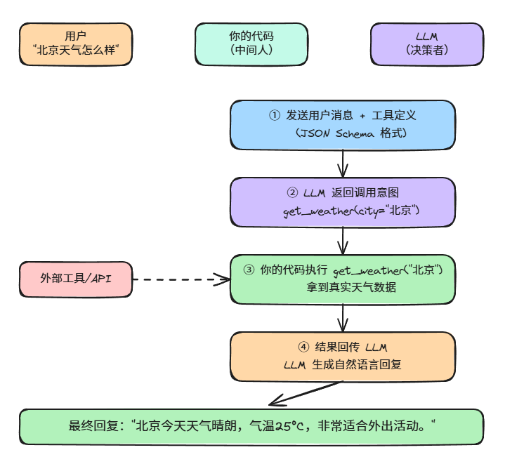
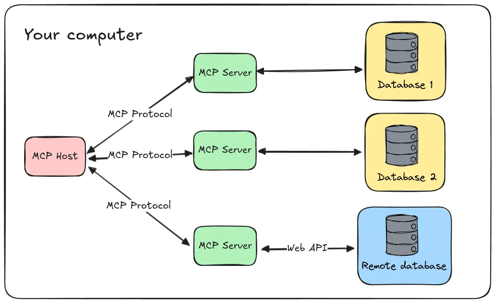
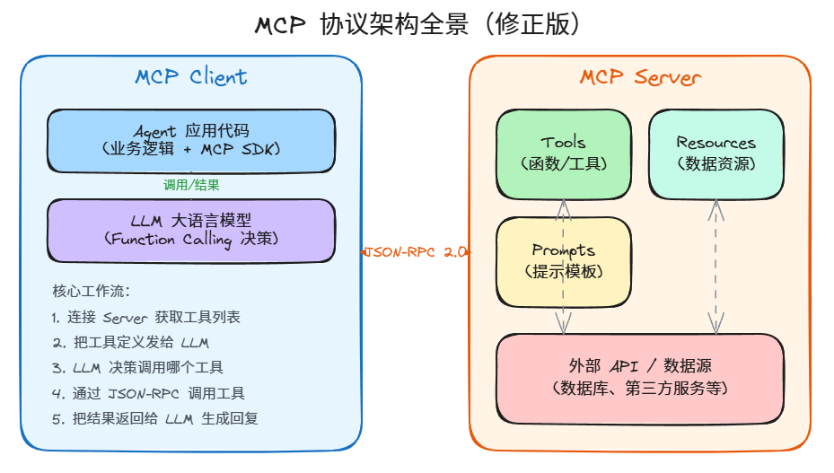

# Function Calling + MCP：Agent 工具调用从原理到实战

本文从 Function Calling 的底层原理讲起，覆盖 OpenAI / Anthropic / 本地模型三种实现，再到 MCP 协议的工具发现与编排机制，附完整的 MCP Server 搭建代码和面试高频题。

核心观点：**Function Calling 是肌肉——让 AI 有能力执行动作；MCP 是神经系统——让这些能力可以被发现、被复用、被编排。两者缺一不可。**

---

## 一、为什么工具调用是 Agent 的核心能力

最直观的例子。

你问 ChatGPT："帮我查一下公司内部知识库里关于数据安全的最新政策。" 它会回答："抱歉，我无法访问你的内部系统……"

你问一个有工具调用能力的 Agent 同样的问题，它的行为是这样的：

1. 识别出"用户要查内部知识库"
2. 决定调用 `search_knowledge_base(query="数据安全政策")` 这个工具
3. 拿到内部系统的真实数据
4. 用自然语言回复你："最新的数据安全政策是 2026 年 5 月修订的，核心变化有三点……"

看到了吗？**区别不在于"理解能力"，而在于"执行能力"**——能不能接入你自己的系统、你自己的数据、你自己的业务逻辑。

| 维度 | 通用 AI 助手 | Agent |
|------|-------------|-------|
| 能力范围 | 能联网搜索、生成文本 | 能调用任意外部工具执行操作 |
| 信息来源 | 公开互联网 + 训练数据 | 内部系统、私有数据库、业务 API |
| 典型回答 | "我帮你搜到了一些公开信息……" | "已经帮你从内部系统查到了，结果是……" |
| 用户体验 | 像在跟搜索引擎聊天 | 像在跟真人助理协作 |
| 核心差异 | 能获取公开信息 | 能操作你的私有系统 |

所以工具调用不是 Agent 的"锦上添花"，而是 Agent 的**存在意义**。通用 AI 助手能搜索互联网，但它不能帮你查公司 ERP、改数据库记录、调内部 API。这些才是 Agent 真正的价值所在。

那问题来了——LLM 是怎么"学会"调工具的？这就是 Function Calling 要解决的事。

---

## 二、Function Calling 原理

### 2.1 LLM 怎么知道该调哪个函数？

很多人以为 Function Calling 是什么黑科技，其实原理意外地简单。

**核心思路：把工具的"说明书"写进 Prompt 里。**

当你给 LLM 传一个工具定义时，本质上就是告诉它："你有这些能力，需要的时候跟我说，我会帮你执行。" 工具定义包含三个关键部分：

```python
# 工具定义的三个核心要素
tool_definition = {
    "name": "get_weather",           # 工具名：LLM用来标识调用哪个工具
    "description": "查询指定城市的实时天气信息",  # 描述：LLM用来判断何时该用这个工具
    "parameters": {                  # 参数：告诉LLM需要传什么信息
        "type": "object",
        "properties": {
            "city": {
                "type": "string",
                "description": "城市名称，如'北京'、'上海'"
            },
            "unit": {
                "type": "string",
                "enum": ["celsius", "fahrenheit"],
                "description": "温度单位，默认摄氏度"
            }
        },
        "required": ["city"]         # 必填参数
    }
}
```

这就是标准的 JSON Schema 格式。LLM 读到这段描述后，就知道：哦，我有个查天气的能力，需要传城市名，温度单位可选。

### 2.2 调用流程：四步走

整个 Function Calling 的流程其实非常清晰：



> ▲ Function Calling 四步调用流程：① 发送消息+工具定义 → ② LLM 返回调用意图 → ③ 你的代码执行工具 → ④ 结果回传 LLM 生成回复

关键认知：**第②步 LLM 并没有真正调用任何函数**，它只是生成了一段结构化的 JSON，告诉你"我想调这个"。真正执行函数的是你的代码。LLM 只负责"决策"，不负责"执行"。

### 2.3 三家主流模型的 Function Calling 写法

下面用一个天气查询的例子，看看 OpenAI、Anthropic 和本地模型（通过 Ollama）分别怎么写。

**OpenAI 写法：**

```python
import json
from openai import OpenAI

client = OpenAI()

# 定义工具
tools = [{
    "type": "function",
    "function": {
        "name": "get_weather",
        "description": "查询指定城市的实时天气",
        "parameters": {
            "type": "object",
            "properties": {
                "city": {"type": "string", "description": "城市名称"}
            },
            "required": ["city"]
        }
    }
}]

# 模拟天气函数
def get_weather(city: str) -> str:
    # 实际项目中这里调天气API
    weather_data = {"北京": "晴 25°C", "上海": "多云 22°C"}
    return weather_data.get(city, f"暂无{city}的天气数据")

# 第一步：发送消息 + 工具定义
response = client.chat.completions.create(
    model="gpt-4o",
    messages=[{"role": "user", "content": "北京今天天气怎么样？"}],
    tools=tools,
    tool_choice="auto"
)

# 第二步：检查LLM是否要调工具
message = response.choices[0].message
if message.tool_calls:
    tool_call = message.tool_calls[0]
    func_name = tool_call.function.name
    args = json.loads(tool_call.function.arguments)
    
    # 第三步：执行工具
    result = get_weather(**args)
    
    # 第四步：把结果回传给LLM
    response2 = client.chat.completions.create(
        model="gpt-4o",
        messages=[
            {"role": "user", "content": "北京今天天气怎么样？"},
            message,  # 包含tool_calls的assistant消息
            {
                "role": "tool",
                "tool_call_id": tool_call.id,
                "content": result
            }
        ]
    )
    print(response2.choices[0].message.content)
    # 输出：今天北京天气晴朗，气温25°C，非常适合外出活动。
```

**Anthropic Claude 写法：**

```python
import anthropic

client = anthropic.Anthropic()

# Claude的工具定义方式
tools = [{
    "name": "get_weather",
    "description": "查询指定城市的实时天气",
    "input_schema": {  # 注意：Claude用input_schema，不是parameters
        "type": "object",
        "properties": {
            "city": {"type": "string", "description": "城市名称"}
        },
        "required": ["city"]
    }
}]

# 发送请求
response = client.messages.create(
    model="claude-sonnet-4-20250514",
    max_tokens=1024,
    tools=tools,
    messages=[{"role": "user", "content": "北京天气怎么样？"}]
)

# 检查是否有tool_use
for block in response.content:
    if block.type == "tool_use":
        result = get_weather(**block.input)
        # 回传结果，注意Claude的格式
        response2 = client.messages.create(
            model="claude-sonnet-4-20250514",
            max_tokens=1024,
            tools=tools,
            messages=[
                {"role": "user", "content": "北京天气怎么样？"},
                {"role": "assistant", "content": response.content},
                {
                    "role": "user",
                    "content": [{
                        "type": "tool_result",
                        "tool_use_id": block.id,
                        "content": result
                    }]
                }
            ]
        )
        print(response2.content[0].text)
```

**本地模型（Ollama）写法：**

```python
import requests
import json

# Ollama 也支持 OpenAI 兼容的 Function Calling
OLLAMA_URL = "http://localhost:11434/v1/chat/completions"

tools = [{
    "type": "function",
    "function": {
        "name": "get_weather",
        "description": "查询指定城市的实时天气",
        "parameters": {
            "type": "object",
            "properties": {
                "city": {"type": "string", "description": "城市名称"}
            },
            "required": ["city"]
        }
    }
}]

response = requests.post(OLLAMA_URL, json={
    "model": "qwen2.5:14b",  # 推荐用较大模型，小模型工具调用能力差
    "messages": [{"role": "user", "content": "北京天气怎么样？"}],
    "tools": tools
})

data = response.json()
message = data["choices"][0]["message"]
if message.get("tool_calls"):
    tool_call = message["tool_calls"][0]
    args = json.loads(tool_call["function"]["arguments"])
    result = get_weather(**args)
    print(f"工具调用成功：{result}")
```

三家写法大同小异，核心都是：**定义工具 → 发给 LLM → LLM 返回调用意图 → 你执行 → 结果回传**。但细微差异不少，实际项目中建议封装一层统一接口。

---

## 三、Function Calling 的 3 个核心问题

Function Calling 用起来爽，但踩过坑的人都知道，它有几个让人头疼的问题。

### 3.1 工具选择准确性：LLM 选错工具怎么办？

当你有 20 个工具的时候，LLM 经常会"张冠李戴"——用户说"帮我查一下物流"，它去调"查订单"的接口。

**解决方案：优化工具描述 + 降低温度 + 工具分组。**

```python
# 反面教材：描述太模糊
bad_tool = {
    "name": "query",
    "description": "查询数据",  # 太笼统，LLM分不清查什么
}

# 正面教材：描述精确、带边界说明
good_tool = {
    "name": "query_logistics",
    "description": (
        "根据运单号查询物流信息。"
        "适用场景：用户询问包裹在哪里、什么时候到。"
        "不适用：查订单状态用query_order，退款用process_refund。"
    ),
    "parameters": {
        "type": "object",
        "properties": {
            "tracking_number": {
                "type": "string",
                "description": "运单号，格式如 SF1234567890"
            }
        },
        "required": ["tracking_number"]
    }
}

# 实战技巧：工具多的时候分层处理
def select_tool_group(user_query: str, tool_groups: dict) -> list:
    """
    先让LLM选择工具组（一级路由），再从组里选具体工具
    减少LLM的选择压力
    """
    # 第一步：粗粒度分类
    group_prompt = f"""用户说：{user_query}
    可用工具组：{list(tool_groups.keys())}
    请选择最相关的工具组名称。只返回名称。"""
    
    # 调LLM做分类（这里省略具体调用代码）
    selected_group = llm_classify(group_prompt)  # 比如返回"物流服务"
    
    # 第二步：只把该组的工具给LLM
    return tool_groups[selected_group]
```

核心思路：**给 LLM 的选择越少，准确率越高**。10 个工具里选和 50 个工具里选，准确率差很多。

### 3.2 参数提取可靠性：格式错误、缺参数怎么办？

LLM 生成的参数 JSON 有时候会出问题：格式不对、多传了参数、少传了必填参数、类型错误。

**解决方案：参数校验 + 重试 + 让 LLM 问用户。**

```python
import json
from jsonschema import validate, ValidationError

def execute_tool_with_retry(tool_name: str, raw_args: str, schema: dict, max_retries: int = 2):
    """带校验和重试的工具执行"""
    
    for attempt in range(max_retries + 1):
        try:
            # 1. 解析JSON
            args = json.loads(raw_args)
            
            # 2. 用JSON Schema校验参数
            validate(instance=args, schema=schema)
            
            # 3. 校验通过，执行工具
            return TOOLS[tool_name](**args)
            
        except json.JSONDecodeError:
            # JSON格式错误，让LLM重新生成
            print(f"第{attempt+1}次尝试：JSON格式错误，请求LLM重新生成参数")
            raw_args = ask_llm_regenerate_args(tool_name, raw_args, "JSON格式不正确")
            
        except ValidationError as e:
            # 参数校验失败
            missing = [p for p in schema.get("required", []) if p not in (args if 'args' in dir() else {})]
            if missing:
                # 缺少必填参数，问用户补充
                return f"请问您能提供以下信息吗？{', '.join(missing)}"
            else:
                # 其他校验错误，让LLM重新生成
                raw_args = ask_llm_regenerate_args(tool_name, raw_args, str(e))
    
    return "工具调用失败，请重试或换个问法。"
```

这里的关键点：**不要无条件信任 LLM 生成的参数**。校验、重试、问用户，三板斧打下去，可靠性能提升一个量级。

### 3.3 多工具编排：需要连续调多个工具时怎么办？

用户说"帮我查一下北京的天气，如果下雨就帮我取消明天的户外活动"——这需要先查天气，再根据结果决定是否调取消活动的工具。这就是**多工具编排**。

```python
def multi_tool_orchestration(user_query: str, messages: list):
    """简单的多工具编排循环"""
    
    max_iterations = 5  # 防止死循环
    
    for i in range(max_iterations):
        response = call_llm(messages, tools=ALL_TOOLS)
        message = response.choices[0].message
        
        # 没有工具调用 → LLM认为任务完成，返回最终回复
        if not message.tool_calls:
            return message.content
        
        # 有工具调用 → 执行并把结果喂回去
        messages.append(message)
        
        for tool_call in message.tool_calls:
            result = execute_tool(
                tool_call.function.name,
                json.loads(tool_call.function.arguments)
            )
            messages.append({
                "role": "tool",
                "tool_call_id": tool_call.id,
                "content": str(result)
            })
    
    return "达到最大轮次，任务未能完成。"

# 使用示例
messages = [
    {"role": "user", "content": "查一下北京天气，如果下雨就帮我取消明天的户外活动"}
]
result = multi_tool_orchestration(messages)
```

这个循环模式是 Agent 多工具编排的核心范式：**LLM 决策 → 执行 → 反馈 → 再决策**，直到 LLM 认为任务完成。后面在 Agent 架构篇里讲的 ReAct 模式，底层就是这个循环。

---

## 四、MCP：Function Calling 的进化形态

### 4.1 MCP 是什么？



> ▲ MCP 架构总览：① MCP Host（AI应用）通过 MCP Protocol 连接多个 MCP Server → ② MCP Server 封装各类数据源访问逻辑 → ③ 数据源包含本地数据库和远程 Web API

Function Calling 很好用，但有一个根本性的问题：**每个工具的定义都硬编码在你的应用里**。

你写了 10 个工具，换个项目要用，得复制粘贴。别人写了个好用的工具，你想用，得重写定义。每个 LLM 厂商的工具格式还略有不同（OpenAI 用 `parameters`，Claude 用 `input_schema`），适配工作一堆。

MCP（Model Context Protocol）就是来解决这个问题的。

**一句话：MCP 是一个让工具"可发现、可复用、跨模型"的开放协议。**

类比一下：如果 Function Calling 是"每个 App 自己定义充电接口"，那 MCP 就是"USB-C 标准"——统一了接口，任何设备插上就能用。

### 4.2 MCP vs Function Calling 全面对比

| 维度 | Function Calling | MCP |
|------|-----------------|-----|
| 工具定义 | 硬编码在应用代码里 | MCP Server 独立维护，运行时发现 |
| 工具发现 | 开发者手动注册 | 客户端自动发现可用工具 |
| 可复用性 | 绑定特定应用，不可移植 | 跨应用、跨模型复用 |
| 生态 | 各家自建，互不兼容 | 统一标准，有开源工具市场 |
| 工具通信 | 同进程函数调用 | 标准化 JSON-RPC 协议 |
| 资源管理 | 无标准 | 有 Resource 概念，支持文件、数据库等 |
| 安全控制 | 应用自定义 | 协议层权限控制 |
| 适用场景 | 单应用快速开发 | 平台级、多工具编排、企业级 |
| 开发成本 | 低，直接写函数 | 中，需了解协议规范 |
| 调试难度 | 低 | 中，需要 MCP Inspector 等工具 |

简单说：**Function Calling 是"给自己写工具"，MCP 是"给生态写工具"**。

### 4.3 MCP 核心概念

MCP 有四个核心角色，理解了它们就理解了整个协议：

| 概念 | 角色 | 类比 |
|------|------|------|
| MCP Server | 工具提供方，暴露工具和资源 | 服务员（负责端菜） |
| MCP Client | 工具调用方，通常是 AI 应用 | 顾客（负责点菜） |
| Tool | 可执行的函数 | 菜单上的菜品 |
| Resource | 可读取的数据源（文件、数据库等） | 食材仓库 |

通信流程：



> ▲ MCP 协议架构全景：① MCP Client（包含 Agent 代码 + LLM）通过 JSON-RPC 2.0 与 MCP Server 通信 → ② Server 暴露 Tools、Resources、Prompts → ③ Client 内部：Agent 把工具定义发给 LLM，LLM 通过 Function Calling 决策调用哪个工具 → ④ Agent 根据 LLM 决策调用 Server 工具，结果返回 LLM 生成回复

### 4.4 MCP 2025-2026 关键更新

MCP 协议在 2025 年底到 2026 年初经历了一次重要升级，加入了几个重量级特性：

| 特性 | 说明 | 解决什么问题 |
|------|------|-------------|
| Sampling | Server 可以请求 Client 调用 LLM | Server 端也能"思考"了，支持复杂 Agent 循环 |
| Elicitation | Server 可以主动向用户提问 | 处理缺少参数时不用中断整个流程 |
| Async Tasks | 支持长时间运行的异步任务 | 适合翻译长文档、批量处理等耗时场景 |
| Server-side Agent Loops | Server 内部可以运行 Agent 循环 | 一个 MCP Server 可以是另一个 Agent |

这些更新让 MCP 从一个"工具调用协议"进化成了"Agent 间协作协议"。特别是 Sampling，它意味着 MCP Server 不再只是被动执行，而是可以主动请求 LLM 做推理——这让 MCP Server 本身也能成为一个 Agent。

---

## 五、实战：从零搭建一个 MCP Server

说了这么多原理，来动手写一个。

### 5.1 技术选型：TypeScript vs Python

| 维度 | TypeScript | Python |
|------|-----------|--------|
| SDK 成熟度 | 最早支持，最稳定 | 快速追赶，已经很好用 |
| 社区工具 | 最多 | 多，特别是 AI 相关 |
| 学习曲线 | 需要了解 TS 类型系统 | 对 Python 开发者零门槛 |
| 推荐场景 | 前端团队、Node.js 生态 | AI/数据团队、快速原型 |

**建议：如果你主要做 AI 开发，用 Python；如果做全栈，用 TypeScript。** 这里我们用 Python 演示。

### 5.2 5 分钟搭建天气查询 MCP Server

```python
# weather_mcp_server.py
"""
一个简单的天气查询 MCP Server
功能：查询城市天气、查询未来天气预报
"""

from mcp.server.fastmcp import FastMCP

# 创建 MCP Server 实例
mcp = FastMCP("weather-server")

# 模拟天气数据（实际项目中调真实API）
WEATHER_DATA = {
    "北京": {"temp": 25, "condition": "晴", "humidity": 30},
    "上海": {"temp": 22, "condition": "多云", "humidity": 65},
    "深圳": {"temp": 30, "condition": "阵雨", "humidity": 80},
    "成都": {"temp": 20, "condition": "阴", "humidity": 55},
}

@mcp.tool()
def get_weather(city: str) -> str:
    """查询指定城市的实时天气信息。
    
    适用场景：用户询问某个城市当前的天气情况。
    
    Args:
        city: 城市名称，如"北京"、"上海"
    """
    if city not in WEATHER_DATA:
        return f"暂无{city}的天气数据，目前支持：{', '.join(WEATHER_DATA.keys())}"
    
    data = WEATHER_DATA[city]
    return (
        f"{city}当前天气：\n"
        f"  温度：{data['temp']}°C\n"
        f"  天气：{data['condition']}\n"
        f"  湿度：{data['humidity']}%\n"
        f"  建议：{'带伞' if data['humidity'] > 70 else '适合外出'}"
    )

@mcp.tool()
def get_forecast(city: str, days: int = 3) -> str:
    """查询城市未来几天的天气预报。
    
    Args:
        city: 城市名称
        days: 预报天数，默认3天，最多7天
    """
    if city not in WEATHER_DATA:
        return f"暂无{city}的预报数据"
    
    if days > 7:
        days = 7
    
    base = WEATHER_DATA[city]
    forecast_lines = [f"{city}未来{days}天天气预报："]
    for i in range(days):
        temp_var = base["temp"] + (i - 1) * 2  # 简单模拟温度变化
        forecast_lines.append(f"  第{i+1}天：{temp_var}°C，{base['condition']}")
    
    return "\n".join(forecast_lines)

@mcp.resource("weather://cities")
def list_cities() -> str:
    """返回支持查询的城市列表"""
    return "支持的城市：" + "、".join(WEATHER_DATA.keys())

if __name__ == "__main__":
    mcp.run()
```

### 5.3 运行和配置

安装依赖：

```bash
pip install mcp
```

**配置到 Claude Desktop**（在 `claude_desktop_config.json` 中添加）：

```json
{
    "mcpServers": {
        "weather": {
            "command": "python",
            "args": ["/path/to/weather_mcp_server.py"]
        }
    }
}
```

**配置到 Hermes Agent**（在 `~/.hermes/config.yaml` 中添加）：

```yaml
mcp:
  servers:
    weather:
      command: python
      args:
        - /path/to/weather_mcp_server.py
```

启动后，你可以在对话中直接问"北京今天天气怎么样"，Agent 会自动发现 `get_weather` 工具并调用，返回真实结果。

### 5.4 进阶：带认证的 MCP Server

实际项目中，工具通常需要 API Key 等认证信息：

```python
import os
from mcp.server.fastmcp import FastMCP

mcp = FastMCP("real-weather-server")

@mcp.tool()
async def get_real_weather(city: str) -> str:
    """调用真实天气API查询天气"""
    import httpx
    
    api_key = os.environ.get("WEATHER_API_KEY")
    if not api_key:
        return "错误：未配置天气API密钥，请设置 WEATHER_API_KEY 环境变量"
    
    async with httpx.AsyncClient() as client:
        response = await client.get(
            "https://api.weatherapi.com/v1/current.json",
            params={"key": api_key, "q": city, "lang": "zh"}
        )
        data = response.json()
        
        current = data["current"]
        return (
            f"{city}实时天气：\n"
            f"  温度：{current['temp_c']}°C\n"
            f"  体感：{current['feelslike_c']}°C\n"
            f"  天气：{current['condition']['text']}\n"
            f"  风速：{current['wind_kph']} km/h"
        )
```

---

## 六、趋势判断

### Function Calling 不会消失

Function Calling 是 LLM 调用工具的底层机制，它是"肌肉"——再高级的协议，最终执行工具调用时还是要靠 Function Calling。即使在 MCP 体系中，Client 端拿到工具定义后，仍然通过 Function Calling 让 LLM 决定调哪个工具。

**它的地位类似于 HTTP 之于 Web——你可以用更高级的框架，但底层还是它。**

### MCP 正在成为事实标准

2025 年下半年开始，MCP 的采用率爆发式增长。Anthropic、OpenAI（已支持）、Google（已支持）、Hermes Agent 等主流平台全部支持。社区已经出现了大量开源 MCP Server：文件系统、数据库、GitHub、Slack、Notion、浏览器控制……

| 时间 | 里程碑 |
|------|--------|
| 2024.11 | Anthropic 发布 MCP 协议初版 |
| 2025.03 | Claude Desktop 原生支持 MCP |
| 2025.06 | OpenAI 宣布支持 MCP |
| 2025.11 | MCP 协议升级，加入 Sampling/Elicitation |
| 2026.Q1 | 主流 AI 平台全面支持，工具市场成熟 |

### 选型建议

| 场景 | 推荐方案 | 理由 |
|------|---------|------|
| 个人项目、快速原型 | Function Calling | 简单直接，半小时搞定 |
| 单一 AI 产品 | Function Calling + 简单封装 | 够用就好，不过度设计 |
| 企业级平台、多工具 | MCP | 统一管理，方便扩展 |
| 跨模型、跨团队协作 | MCP | 标准化协议是唯一出路 |
| 想开源自己的工具 | MCP | 别人能直接用，生态价值大 |

**一句话：小项目用 Function Calling，大项目上 MCP。不知道选什么？先用 Function Calling，等痛点出现了再迁移到 MCP——迁移成本不高。**

---

## 七、面试高频题

### Q1：Function Calling 的原理是什么？

**标准回答：** Function Calling 的核心原理是"工具描述注入"。开发者将工具的名称、描述和参数定义（JSON Schema 格式）随用户消息一起发给 LLM。LLM 根据工具描述判断是否需要调用工具，如果需要，则生成结构化的调用请求（包含函数名和参数 JSON）。真正的函数执行由调用方完成，执行结果再回传给 LLM，LLM 基于结果生成最终回复。本质上 LLM 只做"决策"，不做"执行"。

### Q2：MCP 和 Function Calling 有什么区别？

**标准回答：** Function Calling 是 LLM 调用工具的底层机制，解决的是"LLM 怎么表达我要调工具"。MCP 是上层协议标准，解决的是"工具怎么被发现、复用和跨平台共享"。两者不是替代关系，而是上下层关系——MCP Server 暴露工具定义后，Client 端仍然通过 Function Calling 让 LLM 决定调用。类比的话，Function Calling 是"函数调用指令"，MCP 是"插件系统架构"。

### Q3：怎么提高 Agent 工具调用的准确性？

**标准回答：** 四个方面：①工具描述要精确，包含适用场景和边界说明，减少歧义；②参数定义用严格的 JSON Schema，加上 enum 约束；③工具数量控制在合理范围，超过 15 个考虑分组路由；④参数校验 + 重试机制，对 LLM 返回的参数做 Schema 校验，失败后带错误信息让 LLM 重新生成。另外，降低 temperature 可以减少随机性，提高稳定性。

### Q4：自己写一个 MCP Server 需要注意什么？

**标准回答：** 五点：①工具描述要写清楚，这是 LLM 判断何时调用的唯一依据；②参数类型要严格，该用 number 就不要用 string；③错误处理要友好，返回清晰的错误信息而不是 500 错误码；④敏感信息（API Key 等）走环境变量，不要硬编码；⑤加日志，MCP Server 通常是独立进程，调试时日志是你的救命稻草。Python 推荐用 `FastMCP` 框架，TypeScript 推荐用 `@modelcontextprotocol/sdk`。

### Q5：多工具编排时怎么防止死循环？

**标准回答：** 设置最大迭代次数（通常 5-10 次）。每次循环检查 LLM 是否返回了最终回复（没有 tool_calls）。加超时机制，单次工具执行超过 30 秒就终止。记录调用链路，如果同一工具连续调用 3 次且参数相同，大概率是 LLM 卡住了，直接中断并报错。生产环境中还要加成本控制，防止 token 爆炸。

### Q6：MCP 的 Sampling 机制是什么，有什么用？

**标准回答：** Sampling 是 MCP 2025 年底加入的特性，允许 MCP Server 主动请求 Client 端调用 LLM。这意味着 Server 端也能"思考"了，不用把所有逻辑都写在 Client 端。典型场景：一个代码审查 MCP Server，在执行审查时可以请求 LLM 分析代码质量，然后根据分析结果决定是否继续深入检查。这让 MCP Server 本身也能成为 Agent。

### Q7：如果面试官问"你实际项目中怎么用的"，怎么答？

**参考回答：** 我在 XX 项目中做了一个客服 Agent，接入了订单查询、退款处理、物流跟踪等 6 个工具。用的 OpenAI Function Calling，工具描述是我和业务方一起写的，特别注意了边界说明（比如"查订单"和"查物流"的区别）。遇到的主要问题是参数提取不准，特别是日期格式，后来加了 enum 约束和正则校验解决了。多工具编排用了 ReAct 循环，设了 5 次上限。后来工具增加到 15 个，准确率下降了，就做了工具分组路由，先分类再选工具，准确率从 78% 提到了 93%。

---

## 八、总结

这篇文章从原理到实战，把 Agent 工具调用这条链路走了一遍。

最后用一句话概括 Function Calling 和 MCP 的关系：

> **Function Calling 是肌肉——让 AI 有能力执行动作；MCP 是神经系统——让这些能力可以被发现、被复用、被编排。肌肉再强，没有神经系统协调，也只能乱动；神经系统再高级，没有肌肉执行，也只是空谈。两者缺一不可。**

如果你还没看过上一篇关于 Agent 架构模式的文章，建议先看 [Agent 架构选型：8 种模式的组合与取舍](../Agent/01-2026年Agent架构选型-8种模式的组合与取舍.md)，了解整体架构后再回头看工具调用，会更有体感。

工具调用是 Agent 的"执行层"，架构模式是 Agent 的"思考层"。两层都搞懂了，你就能设计出真正能干活的 Agent。
