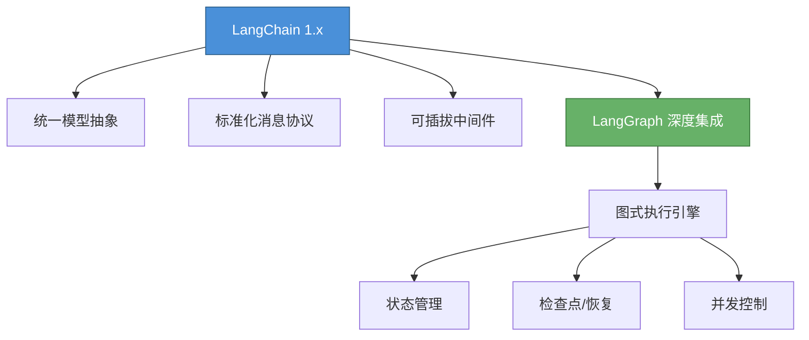
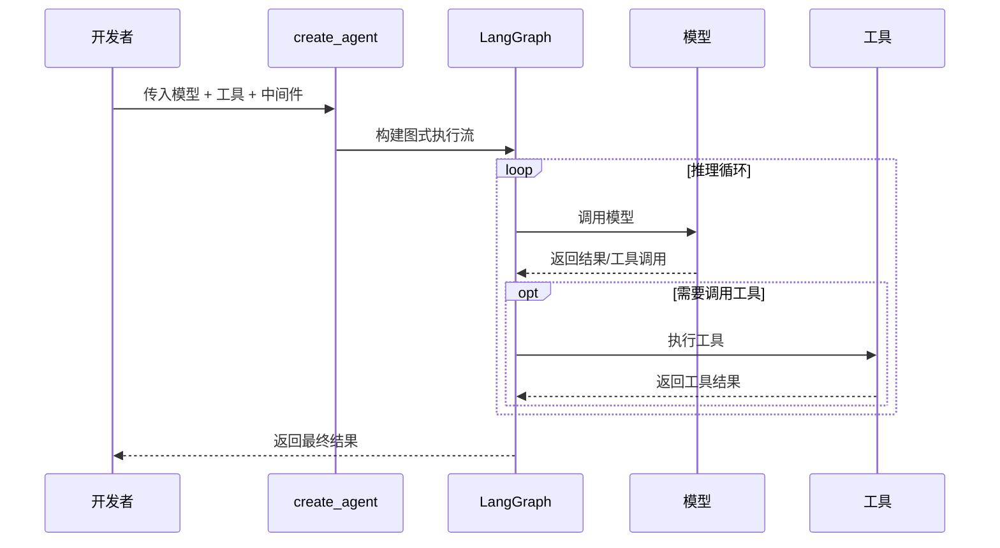
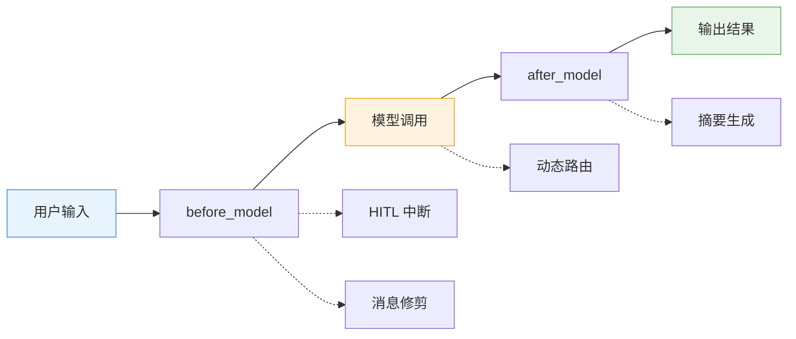
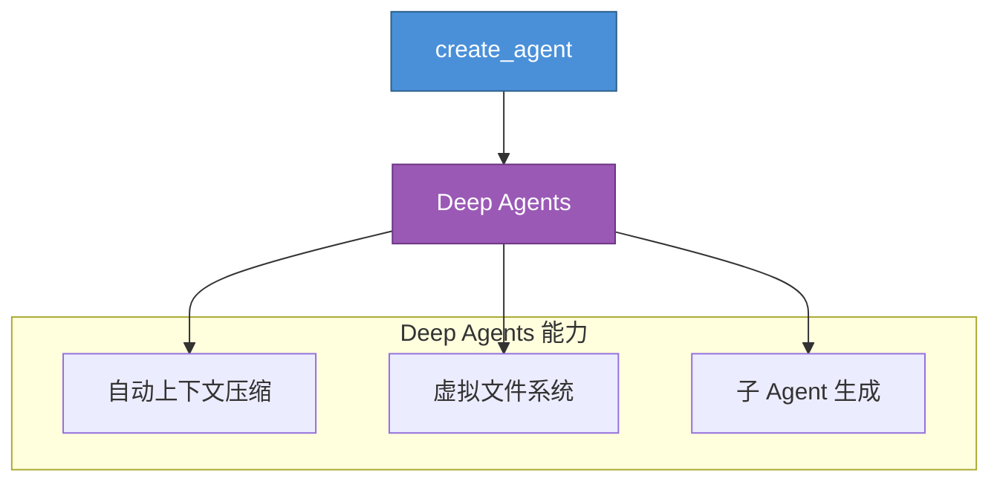
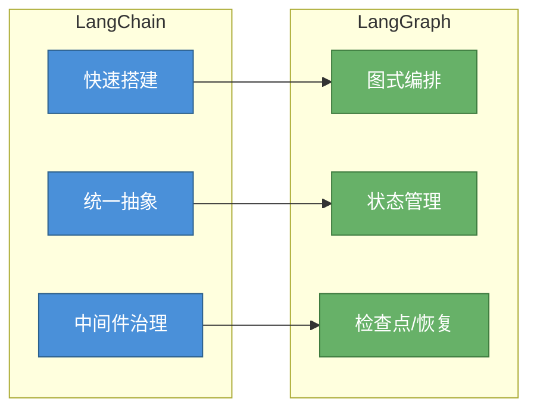
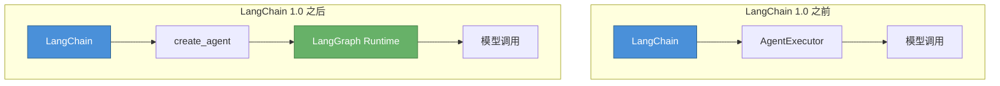
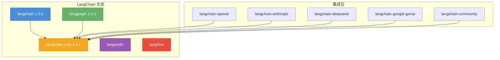

# 一、LangChain 最新快速入门介绍

---

## 1. LangChain 平台概述与定位

LangChain 由 Harrison Chase 于 2022 年 10 月发起创立，现已发展成为行业领先的智能体工程（Agent Engineering）专属基建平台。它不仅降低了大型语言模型（LLM）的应用门槛，更为开发者构建复杂的 AI 智能体提供了端到端的解决方案。

- **官方门户**：https://www.langchain.com/

在 LangChain 1.x 时代，平台的定位发生了根本性升级：

- **定位升级**：LangChain 1.x 不再只是”调用模型的胶水层”，而是面向生产的 **Agent 开发生态入口**：统一的模型抽象、标准化消息/内容块、可插拔中间件、以及与 LangGraph 的深度耦合，使开发者既能快速起步，又能细粒度管控每一步执行。
- **底座迁移**：1.x 时代的 Agent 运行时正式**建立在 LangGraph 上**；你在 LangChain 层”写出来”的 Agent，实质是运行在 LangGraph 的图式执行引擎上（带有状态、检查点、可中断/恢复、持久化与并发控制）。
- **历史包袱清理**：旧的 `AgentExecutor` 路线已完全移除，官方明确建议面向新项目使用基于 LangGraph 的 Agent 方案。曾经分散在各处的 `ConversationalAgent`、`ZeroShotAgent`、`OpenAIFunctionsAgent` 等十余种 Agent 构造器，统一收敛为 `create_agent` 单一入口。

> 简单来说，**LangChain 就像是为你准备好的”乐高积木”**，它把各种大模型和复杂接口封装成了现成的零件，主打一个”快速搭建”；而 **LangGraph 则是那张带有记忆的”流水线控制图”**，它负责底层的全局调度，让 AI 知道什么时候该循环纠错、什么时候该暂停等待人工审核，主打一个”精准掌控”。用 LangChain 来拼装功能组件，用 LangGraph 来调度全局流程。



**架构演进对比**：

| 阶段 | 核心组件 | 编排方式 | 状态管理 |
|------|----------|----------|----------|
| v0.1（2023） | `LLMChain`、`AgentExecutor` | 函数式嵌套 | 无原生支持 |
| v0.2（2024） | LCEL、`Runnable` | 管道 `\|` 组合 | 依赖外部实现 |
| v0.3（2024） | LCEL + LangGraph 集成 | 管道 + 图式编排 | LangGraph Checkpointer |
| v1.x（2025-2026） | `create_agent` + Deep Agents | 声明式 Agent 定义 | 内置持久化 + 中断/恢复 |

### 1.1 核心生态与技术架构

**LangChain** 的定位早已超越了单一的代码框架，演进为一个多维度的智能体开发生态系统。该生态内嵌了多套开源框架，并提供对 **Python** 与 **TypeScript** 双语栈的无缝支持。其技术架构主要由以下核心组件构成：


- **LangChain（敏捷构建框架）**：作为基础层框架，用于快速构建智能体，可兼容任何模型提供商。该组件具备极高的模型解耦能力，能够兼容并灵活切换任意模型提供商（Model Providers）。
- **LangGraph（状态与流控制）**：允许开发者从底层对 Agent 的执行逻辑进行细粒度控制。它特别适用于需要管理复杂状态流的场景，原生支持持久化记忆（Memory）机制以及人机协同/人工介入（HITL, Human-in-the-loop）工作流。
- **Deep Agents（复杂任务编排）**：高层封装/套件，基于 LangGraph 构建，专门解决复杂、长周期的任务。
- **LangSmith**：提供从开发到上线的全流程支持，核心涵盖四大模块：通过**可观测性 (Observability)** 的详细链路追踪与全局指标，让你看透 Agent 的思考与行动轨迹；利用**评估 (Evaluation)** 在离线或生产数据集上对 Agent 进行测试打分；借助**提示词工程 (Prompt Engineering)** 实现 Prompt 的版本控制与自动优化；最后，依托专为长周期任务设计的弹性基础设施，实现 Agent 的一键**部署 (Deployment)**。


**四层技术架构总结**：

整体而言，LangChain 平台打通了从代码编写到线上运维的完整生命周期，提供了一套涵盖开发、测试、评估到部署的智能体工程化矩阵。其核心能力可划分为以下四个技术层级：

1. **应用开发层 (LangChain)**：屏蔽底层大模型调用差异，提供标准化接口，实现 Agent 的极速构建与跨模型兼容。
2. **状态控制层 (LangGraph)**：基于图结构（Graph-based）管理智能体工作流，实现包括记忆（Memory）与人机协同（HITL）在内的高级控制逻辑。
3. **深度推理层 (Deep Agents)**：聚焦于长链条任务拆解，支撑复杂多步推理型 Agent 的开发与落地。
4. **工程运维层 (LangSmith)**：补齐 Agent 的后期工程化短板，提供全链路可观测性（Observability）、自动化测试评估体系以及生产级部署保障。

---

## 2. Agent 核心概念与技术界定

在深入了解 LangChain 的具体能力之前，有必要先理解 **Agent（智能体）** 这一核心概念。

目前，业界对 Agent 的定义尚未形成绝对统一的规范。但从工程实践的视角来看，LangChain 创始人 Harrison Chase 给出了一个极具参考价值的技术论断：

> **"An AI agent is a system that uses an LLM to decide the control flow of an application."**
>
> AI Agent 本质上是一个**利用大语言模型（LLM）来动态决定应用程序控制流（Control Flow）**的系统。

在广义的通用人工智能（AGI）语境下，**Agent** 通常被定义为一种具备高级抽象能力的智能中枢——它能够敏锐**感知外部环境、执行深度逻辑推理、实现自主决策**，并最终通过物理或数字动作来达成预设目标。

### 2.1 核心演进：从"被动大脑"到"自主个体"

如果将底层的基础大模型（LLM）比作单纯具备思考能力的"大脑"，那么 Agent 则是为其装配了"**感官、四肢**与执行中枢"的完整个体。它突破了传统语言模型仅能生成静态文本的局限，具备了任务拆解与工具调用的主动性。

| 评估维度 | 传统 LLM / 聊天机器人 | 现代 AI Agent 智能体 |
|----------|----------------------|---------------------|
| **交互范式** | **被动响应** (Passive)：依赖单轮提示词触发，问一句答一句 | **目标导向** (Goal-oriented)：主动进行长链路规划与多步探索 |
| **执行边界** | **静态生成**：受限于预训练数据，输出停留在文本字符层面 | **动态交互**：具备软件/物理级操作能力（调用 API、读写数据库等） |
| **控制逻辑** | **人类主导**：高度依赖开发者或用户显式输入详尽的步骤指令 | **系统自治**：仅需给定最终目标（Target），模型自主寻优执行路径 |

为了更具象地说明两者的本质差异，假设用户输入以下需求：

> *"帮我计划一个5天的成都之旅，预算10000元，我对历史感兴趣。"*

#### 传统 LLM 链路（静态响应）

如果是**传统 LLM 应用**，程序流程是这样的：

- 用户提出需求
- 调用 LLM，分析用户需求，直接由 LLM 生成一个简单旅游计划

此时模型仅凭内部固化的预训练参数进行单次推理，直接生成一份通用的行程单。**核心痛点**：**无法感知物理世界的实时状态**，极易产生"幻觉"（如推荐已临时闭馆的景点、忽略机票价格波动），导致方案**缺乏真实可执行性**。

#### Agent 应用链路（自主规划）

面对同样的指令，Agent 会自主接管并分步执行：

**1. 任务拆解与规划 (Planning)**：Agent 会将这个宏大的目标拆解为具体的执行流：`查询机酒价格 ➔ 检索天气与景点信息 ➔ 编排每日行程 ➔ 核算总预算`。

**2. 自主调用工具 (Tool Calling)**：
- **调用机酒 API**：精准查询用户指定日期区间内的航班，以及成都当地符合"历史人文"标签的特色酒店报价
- **调用天气 API**：获取成都未来 5 天的天气状况，以便后续给出户外行程和穿搭建议
- **调用景点 API**：检索武侯祠、三星堆博物馆、金沙遗址等热门历史景点的最新开放时间、预约规则及当前展览

**3. 实时感知与动态反馈 (Observation & Feedback)**：Agent 会综合感知所有抓取到的实时信息，经过内部逻辑推演，生成一份动态的、真正可执行的计划。

> **Agent 最终回复示例**：*"根据您的 10000 元预算及对历史的兴趣，我推荐入住武侯祠附近的特色文化客栈。原计划第一天前往三星堆博物馆，但我感知到下周一该馆闭馆，因此已为您动态调整至第二天游览……各项总花费预计在 7200 元左右"*

### 2.2 架构演进路线

**技术层面的精炼等式**：

> **Agent = LLM (核心认知引擎) + Tools (感知与执行模块)**

伴随底层基础模型能力的不断跃升，Agent 的工程架构也在快速迭代，目前正经历以下三个核心演进阶段：

- **Phase 1：基础工具链阶段 (ReAct + Tool Calling)** — 模型初步具备了"思考与行动交替"的能力，通过外接工具打破自身的知识与能力边界
- **Phase 2：深度反思与记忆阶段 (Reflection + Long Memory)** — 引入长短期记忆库与自我纠错（Self-Correction）回路，使智能体能够在多轮任务中累积经验，实现自我迭代
- **Phase 3：多智能体协同阶段 (Multi-Agent System, MAS)** — 通过组建分布式协作网络，让多个专精不同领域的单体 Agent 相互博弈、辩论或分工，共同攻克单一智能体无法处理的复杂系统性工程难题

理解了 Agent 的核心概念与演进方向后，接下来我们将深入了解 LangChain 1.x 提供的具体能力。

---

## 3. 三大里程碑式能力

### 3.1 `create_agent` 统一创建入口

`create_agent` 是 LangChain 的核心 API——一个"最小化、高度可配置的 Agent 运行器"。它接收四个核心组件：**模型**、**工具列表**、**系统提示词**、以及可选的**中间件**。

```python
from langchain.agents import create_agent

# 基础用法：使用字符串格式指定模型
agent = create_agent(
    model="openai:gpt-5.4",
    tools=[get_weather],
    system_prompt="You are a helpful assistant",
)

# 运行 Agent
result = agent.invoke({
    "messages": [{"role": "user", "content": "北京今天天气怎么样？"}]
})
```

**多 Provider 原生支持**：使用 `"provider:model"` 字符串格式即可无缝切换模型，支持 OpenAI、Anthropic、Google、Fireworks、Ollama、Azure、Bedrock、HuggingFace、OpenRouter、Baseten 等主流平台，避免供应商锁定。

```python
# 切换模型只需修改字符串
agent_openai = create_agent(model="openai:gpt-5.4", tools=tools)
agent_claude = create_agent(model="anthropic:claude-opus-4-7", tools=tools)
agent_gemini = create_agent(model="google:gemini-2.5-pro", tools=tools)
agent_deepseek = create_agent(model="deepseek:deepseek-r1", tools=tools)

# 本地模型也支持
agent_local = create_agent(model="ollama:llama3.3", tools=tools)
```



### 3.2 标准化内容块（Standard Content Blocks）

为不同模型厂商的输出定义统一规范，降低"换模型/换云厂商"带来的解析与适配成本。

在过去，不同模型返回的格式差异很大——OpenAI 返回 `function_call`，Anthropic 返回 `tool_use`，Google 返回 `function_calling`。标准化内容块将这些差异统一为一致的 `content` 结构：

```python
# 所有模型返回统一的内容块结构
result = agent.invoke({"messages": [HumanMessage("你好")]})

# 统一访问方式
for block in result["messages"][-1].content:
    if block["type"] == "text":
        print(block["text"])
    elif block["type"] == "tool_use":
        print(f"调用工具: {block['name']}, 参数: {block['input']}")
```

### 3.3 表面积瘦身（Surface Area Trim）

精简命名空间与冗余 API（如旧式多套 Agent 构造器），把重心放回"用得最多"的接口与构件，减少选择焦虑与迁移成本。

**具体变化**：
- 移除了 `LLMChain`、`SequentialChain`、`TransformChain` 等旧式 Chain 类
- 移除了 `ConversationalAgent`、`ZeroShotAgent`、`OpenAIFunctionsAgent` 等多种 Agent 构造器
- 移除了数十个已废弃的 Tool 包装类
- 保留并强化了 LCEL `Runnable` 接口作为统一抽象

---

## 4. 中间件（Middleware）：1.x 的"王牌"工程化能力

> 中间件是"围绕模型调用点"的拦截器，提供**前置（before_model）/后置（after_model）/包裹（wrap_model_call）**等钩子，让你在不改 Agent 主体逻辑的情况下实现策略与治理。



**典型能力与场景：**

- **Human-in-the-Loop（人在环）**：对敏感工具调用（写库、转账、发信等）**自动中断**，等待"批准/编辑/拒绝"，需要启用**检查点（checkpointer）**以在中断后可恢复执行。

```python
from langgraph.checkpoint.memory import MemorySaver

agent = create_agent(
    model="openai:gpt-5.4",
    tools=[transfer_money, send_email],
    checkpointer=MemorySaver(),
    interrupt_before=["transfer_money", "send_email"],  # 敏感操作前中断
)

# 执行到敏感操作时会暂停，等待人工确认
config = {"configurable": {"thread_id": "user-123"}}
result = agent.invoke(input_data, config)

# 人工确认后继续执行
result = agent.invoke(None, config)
```

- **消息压缩/治理**：
  - 修剪消息（Trimming）：靠条数或 Token 上限保留近期上下文；
  - 删除消息（Deleting）：精确移除早期或特定类型消息；
  - 汇总消息（SummarizationMiddleware）：当累计 Token 逼近阈值时自动生成摘要并保留若干最新消息。

```python
from langchain_core.middleware import SummarizationMiddleware

agent = create_agent(
    model="openai:gpt-5.4",
    tools=tools,
    middleware=[
        SummarizationMiddleware(
            max_tokens=8000,        # Token 上限
            keep_recent=5,          # 保留最近 5 条消息
            model="openai:gpt-5.4-mini",  # 用于摘要的模型
        ),
    ],
)
```

- **动态模型路由（wrap_model_call）**：按输入规模、关键词或预算等条件在不同模型间切换（如简单用 `openai:gpt-5.4-mini`、复杂启用 `anthropic:claude-opus-4-7`）。

```python
from langchain_core.middleware import wrap_model_call

def route_by_complexity(request):
    """根据问题复杂度路由到不同模型"""
    query = request["messages"][-1].content
    if len(query) < 200:
        return {"model": "openai:gpt-5.4-mini"}
    else:
        return {"model": "anthropic:claude-opus-4-7"}

agent = create_agent(
    model="openai:gpt-5.4",
    tools=tools,
    middleware=[wrap_model_call(route_by_complexity)],
)
```

> 这些能力的底层都建立在 **LangGraph 的可中断（interrupt）与持久化状态** 之上，因此具备可恢复、可观测的生产级韧性。

---

## 5. Deep Agents：开箱即用的高级 Agent

Deep Agents 是 LangChain 生态中新增的高级 Agent 形态，基于 `create_agent` 构建，提供"开箱即用"的完整能力：



| 能力 | 说明 | 典型场景 |
|------|------|----------|
| **自动上下文压缩** | 当对话历史过长时自动压缩，无需手动配置中间件 | 长对话、多轮交互 |
| **虚拟文件系统** | Agent 可读写文件，支持复杂的数据处理任务 | 数据分析、报告生成 |
| **子 Agent 生成** | 运行时动态创建子 Agent 处理子任务 | 复杂任务分解、并行处理 |

**Deep Agents vs create_agent 对比**：

```python
# create_agent：精细控制，需要手动配置
agent = create_agent(
    model="openai:gpt-5.4",
    tools=tools,
    middleware=[SummarizationMiddleware(...)],  # 手动配置压缩
    system_prompt="...",
)

# Deep Agents：开箱即用，自动处理上下文
from langchain.agents import DeepAgent

agent = DeepAgent(
    model="openai:gpt-5.4",
    tools=tools,
    # 自动启用上下文压缩、文件系统、子 Agent
)
```

> **选择建议**：需要精细控制用 `create_agent`，需要开箱即用用 Deep Agents。

---

## 6. LangChain vs LangGraph：职责分工与对比

| 维度 | LangChain 1.x | LangGraph |
|------|---------------|-----------|
| **定位** | 统一抽象 + 快速搭建：模型、消息、工具、链路、标准输出 | 低层运行时：图式编排、状态管理、检查点、并发、可中断/恢复 |
| **Agent 入口** | `create_agent`（开箱即用） | Graph API（自定义节点/边/条件） |
| **可靠性** | 借助中间件与 Graph Runtime 获得 | 由 Graph 的 Pregel 风格执行/检查点提供 |
| **治理能力** | 中间件（HITL、汇总、修剪、预算控制等） | 中断、持久化、分支/循环、显式状态机 |
| **适用人群** | 产品/业务工程师、快速 PoC 到 MVP | 平台/基础设施工程师、需要"精确控制"的团队 |

> 官方也强调"**快速起步用 LangChain，复杂控制用 LangGraph**，二者并行协同"。



**如何选择**：

- **用 LangChain 的场景**：快速原型开发、标准 Agent 工作流、多模型切换、团队对图式编排不熟悉
- **用 LangGraph 的场景**：复杂多 Agent 协作、需要精确控制执行流程、需要状态持久化与恢复、需要人机协作（HITL）

---

了解了 Agent 的核心概念后，接下来我们来看看 LangChain 是如何从一个简单的"模型增强器"发展为如今庞大的 Agent 开发生态的。

## 7. LangChain 工具生态介绍

### 7.1 GPT-3 时代下第一代大模型开发工具

LangChain 可以称之为自 2022 年底大模型技术爆火以来，第一个真正意义上的大模型开发框架。大模型本质上无法直接解决实际的问题，仅仅是一个能够分析、推理和生成文本的黑盒。直到现在，所有的开发者们仍然在不断探索如何把大模型的强大能力与实际应用场景结合起来，而当时 LangChain 的出现，直接让大模型开发变得简单起来——它将大模型开发过程中常用的功能、工具、流程等全部封装成一个个的组件，使开发者可以像搭乐高积木一样，快速组合出适用于不同场景需求的大模型应用。

LangChain 的首个版本于 2022 年 10 月开源，从一个开源 Python/TS 框架逐渐发展，形成包括"链"和"代理"等核心组件，现在已走向企业级阶段，发展成了 LangChain AI，其拥有目前 Agent 技术领域最大的开源生态，衍生出了多个开源项目框架，各自都在大模型的技术领域承担着不同的开发任务角色。

从一个形象的角度来说，LangChain 的功能定位其实并不是我们现在所谓的 Agent 开发框架，而是一个**大模型功能增强器**——借助 LangChain，哪怕在 GPT-3 模型时代，也能让模型完成对话、拥有记忆、甚至是完成结构化输出等功能。

> LangChain 官网：https://www.langchain.com/

### 7.2 备受争议的工具功能

虽说 LangChain 的开源在短时间内收获了大量的开发者用户，这也一度使得 LangChain 在 2023 年成为最受欢迎的大模型开发工具。但每项技术都会受限于其诞生的时代背景，LangChain 也不例外。

在 GPT-3 时代，大模型以补全模型为主，只能以类似"成语接龙"的方式对文本进行补全，并且实际运行效果也非常不稳定。此时 LangChain 借助一些高层封装的 API，能够让模型完成对话、调用外部工具、甚至是结构化输出等功能，这在当时是非常大的进步，也为开发者提供了极大的便利。

但是，伴随着 GPT-3.5 模型的发布，对话模型正式登上历史的舞台，并逐渐成为主流。得益于对话模型更强的指令跟随能力，很多 GPT-3 需要借助 LangChain 才能完成的工作，已经成为 GPT-3.5 原生自带的一些功能。而等到 GPT-4 逐渐普及，包括调用外部工具（Function Calling）、结构化输出、系统提示词等功能，都成了模型的基础功能。对于开发者而言，此时再使用 LangChain 对这些功能进行封装就显得多此一举。

因此在 2023 年下半年起的很长一段时间里，LangChain 饱受争议，很多开发者觉得 LangChain 代码冗余、编写复杂，甚至有开发者觉得 LangChain 太过于复杂——一个模型调用的过程就涉及到数十个类，一个项目开发动辄就要用到几十个不同的类，而说明文档更是几百个不同的常用类需要记住，其复杂程度不亚于学习一门全新的编程语言。

> 举个例子，为了更好的兼容不同模型的调用，谷歌 ADK 采用了 LiteLLM 作为底层模型调度框架，一个库即可调用各类模型；而 LangChain 则为每个主流模型单独封装了一个库，调用不同模型的时候需要导入不同模型对应的库，例如调用 DeepSeek 就需要安装 `langchain-deepseek`，而调用 Gemini 则需要安装 `langchain-google-genai`。

### 7.3 更加适用于当前 Agent 开发的 LangChain 工具生态

在经历了短暂的阵痛后，LangChain 果断进行了大刀阔斧的改革。调整的思路非常简单：

LangChain 本身仍然坚守作为"模型能力增强器"的功能定位，并且逐渐稳定更新节奏和频率。虽说实际使用 LangChain 进行开发的代码量仍然没变，但模块划分更加清晰、功能更加丰富和稳定，逐步达到企业级应用水准。目前最新版 LangChain 的核心功能如下：

| 模块类别 | 示例功能 |
|----------|----------|
| **模型接口封装** | OpenAI、Claude、Cohere、Qwen 等模型统一调用方式 |
| **输出结构化** | 自动从模型中解析 JSON、Schema、函数签名、文档等 |
| **Memory 管理** | Buffer、Summary、Entity、Conversation Memory 等 |
| **Tool 接入** | Web 搜索、SQL 数据库、Python 执行器、API 代理等 |
| **Agent 架构** | ReAct、Self-Ask、OpenAI Function Agent 等调度机制 |
| **RAG 集成** | 多种 Retriever、Vector Store、文档拆分策略 |
| **Server/API 发布** | 快速将链部署为 Web 服务或 A2A Agent |
| **Debug & Callback** | Token 使用统计、LangSmith 可视化追踪等 |

> **LangChain 是 LLM 功能开发的「积木工厂」，不是简单框架，而是模型增强器 + 应用组装工具箱。**

### 7.4 LangGraph：多 Agent 开发核心框架

LangGraph 于 2023 年下半年开源，作为基于 LangChain 的更高层次封装，能够更加便捷地搭建图结构的大模型工作流，也就是现在所谓的 Multi-Agent 系统。LangGraph 也是目前 LangChain 家族最核心的 Multi-Agent 开发框架，可搭配 LangGraph-Studio 进行实时效果监测。

> 项目官网：https://github.com/langchain-ai/langgraph

需要注意的是，从 LangChain 1.0 开始，LangChain 核心 API `create_agent` 将以 LangGraph 为基座——也就是说，从 LangChain 1.0 开始，LangGraph 由高级 API 转化为了基础 API。



### 7.5 LangSmith：可观测性平台

开源大模型工作流（Agent）可视化监控与测试平台 LangSmith，借助 LangSmith，开发者能够更加简单便捷监控基于 LangChain 生态的 Agent 运行流程、测试 Agent 功能和不同提示词等，从而使得 LangChain 进一步面向企业级应用开发框架。

LangSmith 的核心能力：
- **Trace 追踪**：可视化 Agent 执行的每一步，包括模型调用、工具执行、中间件处理
- **评估测试**：批量测试 Prompt 效果与模型表现，支持自动化回归测试
- **数据集管理**：构建和管理测试数据集，支持版本化管理
- **Engine 引擎**：自动检测 Agent 追踪中的问题并提出修复建议

> LangSmith 官网：https://www.langchain.com/langsmith

### 7.6 LangFlow：可视化开发工具

考虑到 LangChain 本身较为复杂，官方开源了 LangChain 的"可视化实现版"——LangFlow，这是一款形式对标 Dify、可以通过可视化方式借助拖拉拽来完成 LangChain 相同功能的开发工具。

相比 Dify，LangFlow 功能更加完善，并且没有任何商业化的计划，可长期稳定使用。这也是目前 LangChain 工具家族中，仅次于 LangChain（109k Stars）第二受欢迎的开发框架，在 GitHub 上已斩获接近 72k Stars。

> LangFlow 官网：https://www.langflow.org/

### 7.7 生态全景

目前 LangChain 工具生态如图所示：



---

## 8. 当下大模型开发人员必备技能：LangChain

可以说，经过了近 4 年的发展，目前 LangChain 工具生态已经非常全面，能适用于各类不同场景的开发需求——无论是小规模实验还是大规模商业化部署，无论是使用代码开发还是偏向使用低代码开发工具，LangChain 工具家族都能满足开发者的需求。

也正因如此，LangChain 可以说是历经大模型 Agent 技术发展巨变但仍"屹立不倒"的开发工具。哪怕今年以来 OpenAI、谷歌等 AI 巨头纷纷下场发布全新一代 Agent 开发框架，但 LangChain 工具本身仍在很多场景下不可替代。而相比之下，类似 AutoGen、CrewAI 等工具的适用面，在大模型技术飞速发展的当下正在逐渐减少。截止目前，LangChain 仍然是大模型开发岗位应用最广的框架没有之一。

同时 LangChain 也是很多著名的开源项目的底层开发框架。例如字节跳动开源的 Deep Research 应用 DeerFlow 就是采用了 LangChain + LangGraph 框架：

> 项目主页：https://github.com/bytedance/deer-flow

此外如谷歌近期开源的 Gemini Fullstack LangGraph Quickstart 热门项目，也是使用 LangGraph 作为基础框架：

> 项目主页：https://github.com/google-gemini/gemini-fullstack-langgraph-quickstart

---

> **相关资源**
>
> - LangChain 官网：https://www.langchain.com/
> - LangGraph GitHub：https://github.com/langchain-ai/langgraph
> - LangSmith：https://www.langchain.com/langsmith
> - LangFlow：https://www.langflow.org/

## 全套公开课课件领取：


