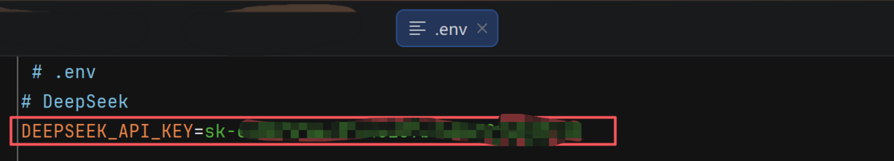
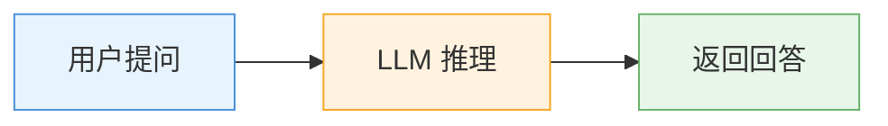

# 二、LangChain 快速入门

> **适用版本**：LangChain 1.3.x / langchain-core 1.4.x 

---

## 1. 准备工作

首先安装 LangChain 核心依赖：

```bash
uv add langchain
```

LangChain 为不同模型提供了专用集成包，按需安装即可：

```bash
# 集成 DeepSeek
uv add langchain-deepseek

# 集成 OpenAI
uv add langchain-openai

# 集成 Anthropic
uv add langchain-anthropic
```

此外，还需要在项目根目录创建 `.env` 文件，用于存放 API Key 等敏感配置：



```
DEEPSEEK_API_KEY=your_api_key_here
```

> **提示**：后续代码示例中使用 `load_dotenv()` 加载环境变量，请确保已安装 `python-dotenv` 包（`uv add python-dotenv`）。

---

## 2. 快速创建 Agent

LangChain 提供了 `create_agent` 方法，只需提供**模型**和**工具**即可快速创建 Agent。该方法是 LangChain 1.x 的核心 API，底层基于 LangGraph 的图式执行引擎，自动处理推理循环、工具调用和结果组装。

`create_agent` 接受以下核心参数：

| 参数 | 说明 |
|------|------|
| `model` | 模型标识，使用 `"provider:model"` 字符串格式（如 `"deepseek:deepseek-chat"`） |
| `tools` | 工具列表，Agent 可调用的外部能力 |
| `system_prompt` | 可选，系统提示词，定义 Agent 的角色和行为 |
| `middleware` | 可选，中间件列表，用于拦截和增强模型调用 |

基本开发步骤：

1. 加载环境变量
2. 定义工具
3. 创建 Agent
4. 调用 Agent

```python
from dotenv import load_dotenv
from langchain.agents import create_agent
from langchain_core.tools import tool

# Step 1: 加载环境变量（确保 .env 中已配置 DEEPSEEK_API_KEY）
load_dotenv()

# Step 2: 定义工具
# 工具函数需要添加 @tool 装饰器，并编写清晰的 docstring
# Agent 会根据 docstring 理解工具的用途和参数含义
@tool
def get_weather(location: str) -> str:
    """获取指定城市的实时天气。

    Args:
        location: 城市名称，例如"成都"、"北京"
    """
    # 生产环境中接入真实天气 API（如 OpenWeather、高德天气）
    return f"{location} 当前天气：晴朗，气温 25°C，湿度 60%"

@tool
def search_web(query: str) -> str:
    """搜索互联网获取最新信息。

    Args:
        query: 搜索关键词
    """
    # 生产环境中接入搜索引擎 API
    return f"搜索结果：关于'{query}'的最新信息..."

# Step 3: 创建 Agent（可传入多个工具）
agent = create_agent(
    model="deepseek:deepseek-chat",
    tools=[get_weather, search_web],  # Agent 可根据需求自动选择合适的工具
    system_prompt="你是一个智能助手，擅长帮用户查询各类实时信息。",
)

# Step 4: 调用 Agent
result = agent.invoke({
    "messages": [
        {"role": "user", "content": "帮我查一下成都今天的天气怎么样？"}
    ]
})

print(result)
```

运行后，Agent 会自动识别需要调用 `get_weather` 工具，获取天气数据后组织自然语言回复用户。

**运行结果示例**：

```
{
  'messages': [
    HumanMessage(content='帮我查一下成都今天的天气怎么样？'),
    AIMessage(content='好的，我来查询一下成都今天的天气。',
      tool_calls=[{'name': 'get_weather', 'args': {'location': '成都'}, 'type': 'tool_call'}]
    ),
    ToolMessage(content='成都 当前天气：晴朗，气温 25°C，湿度 60%', name='get_weather'),
    AIMessage(content='成都今天天气晴朗，气温 25°C，湿度 60%，非常适合外出活动！')
  ]
}
```

**输出结构说明**：`result` 中包含完整的对话消息列表，依次为用户消息、AI 的推理消息、工具调用消息、工具返回消息、以及 AI 的最终回复。LangChain 自动完成了"推理 → 调用工具 → 观测结果 → 生成回复"的完整循环，开发者无需手动编排这些步骤。

**关于 `@tool` 装饰器**：LangChain 通过 `@tool` 装饰器将普通 Python 函数转化为 Agent 可调用的工具。装饰器会自动从函数名和 docstring 中提取工具名称、参数描述等信息。编写清晰的 docstring 至关重要——Agent 会根据它来判断何时调用该工具以及如何传参。

**切换模型只需一行代码**：

```python
# 从 DeepSeek 切换到 OpenAI
agent = create_agent(model="openai:gpt-5.4", tools=[get_weather])

# 切换到 Claude
agent = create_agent(model="anthropic:claude-opus-4-7", tools=[get_weather])

# 使用本地模型
agent = create_agent(model="ollama:llama3.3", tools=[get_weather])
```

`create_agent` 的 `"provider:model"` 格式支持无缝切换不同供应商的模型，工具定义和业务逻辑完全不变。

**多工具协作示例**：当 Agent 配备多个工具时，它会根据用户问题自动选择最合适的工具：

```python
# Agent 会根据问题内容自动判断调用哪个工具
result = agent.invoke({
    "messages": [
        {"role": "user", "content": "帮我搜索一下最新的 LangChain 版本信息"}
    ]
})
# Agent 自动选择 search_web 工具进行搜索
```

---

## 3. Agent 工作原理

### 3.1 传统 LLM vs Agent

传统 LLM 应用是一问一答的形式，模型只能根据训练数据回答，无法获取实时信息：



这种模式的局限性在于：模型的知识完全来自训练数据，无法获取实时信息（如今天的天气、最新的新闻），也无法执行实际操作（如发邮件、查数据库）。

而 Agent 可以调用工具与外界交互，获取实时信息：


### 3.2 执行流程说明

Agent 采用 **ReAct（Reasoning + Acting）** 模式运行——模型交替进行"推理"和"行动"，直到获得足够的信息来回答用户。这是当前 Agent 系统最主流的运行范式。

以查询天气为例，Agent 的完整执行流程：

1. **用户输入（Input）**："成都今天的天气怎么样？"
2. **模型推理（Reasoning）**：系统识别到"今日天气"属于实时数据，大模型自身无法直接作答，判定需要依赖外部工具 `get_weather` 进行查询
3. **执行动作（Action）**：触发 `get_weather` 工具，并向其传入参数 `"成都"`
4. **结果观测（Observation）**：接收工具运行后返回的数据，模型对该反馈进行评估，判断是否足以解答用户的疑问
5. **若满足**：进入下一步，开始组织最终回复
6. **若不满足**：触发内部重试逻辑，回到第 2 步继续调用工具或调整参数
7. **最终响应（Output）**：基于工具返回的真实有效数据，将其转化为自然语言并输出给用户

如果工具返回的信息不充分，Agent 会自动回到第 2 步继续推理，直到获得满意的答案。整个过程对开发者是透明的。

**关键点**：原本大模型不具备查询天气的能力，所以无法回答天气问题。但是当我们提供了一个查询天气的 Tool 以后，它就能自动调用工具来获取实时数据并回答问题——这就是 Agent 的核心价值。

### 3.3 模型如何知道工具信息？


LangChain 会自动将工具的描述信息（名称、参数类型、功能说明）封装为大模型 API 中的 `tools` 参数，与用户消息一起发送。以 `get_weather` 为例，发送给模型的工具描述大致如下：

```json
{
  "type": "function",
  "function": {
    "name": "get_weather",
    "description": "获取指定城市的实时天气。",
    "parameters": {
      "type": "object",
      "properties": {
        "location": {
          "type": "string",
          "description": "城市名称，例如'成都'、'北京'"
        }
      },
      "required": ["location"]
    }
  }
}
```

模型根据这段描述理解工具的用途和参数要求。当模型判定需要调用工具时，它以 JSON 格式返回工具名称和参数，由 LangChain 框架负责实际执行并将结果回传给模型。

**关键点**：工具函数的 `docstring` 写得越清晰，模型就越能准确判断何时调用、如何传参。这是 Agent 开发中最值得关注的细节之一。

---

## 4. 大语言模型 (LLM) 综述

在大模型应用开发中，"模型"通常特指**大语言模型 (Large Language Model, LLM)**。这类模型不仅具备深度的语言理解能力，能够执行文本生成、多语言翻译、信息摘要提取及复杂问答等任务，还演化出了一系列高级功能。

从技术演进的角度来看，大模型经历了从**补全模型（Completion Model）**到**对话模型（Chat Model）**的转变。早期的补全模型只能以类似"成语接龙"的方式对文本进行补全，而现代对话模型具备更强的指令跟随能力，原生支持多轮对话、系统提示词、工具调用等功能。LangChain 通过统一的抽象层，屏蔽了这些底层差异，让开发者可以专注于业务逻辑。

### 4.1 LLM 核心能力

在 Agent 架构中，LLM 充当**核心推理引擎**，已从早期的纯文本补全模型演进为具备多种高级能力的通用模型：

| 能力 | 说明 | 典型应用场景 |
|------|------|-------------|
| **工具调用 (Tool Calling)** | 主动调度外部插件，将实时数据融入推理过程 | 查询天气、搜索网页、操作数据库 |
| **结构化输出 (Structured Output)** | 将响应限定为 JSON 等格式，便于程序处理 | 表单提取、API 互操作、数据管道 |
| **多模态 (Multimodality)** | 理解和生成图像、音频、视频等多元媒体 | 图片描述、文档解析、视觉问答 |
| **逻辑推理 (Reasoning)** | 通过思维链执行多阶段逻辑推演 | 数学计算、代码分析、复杂决策 |

### 4.2 LLM 在 Agent 中的角色

在智能体架构中，LLM 充当了**核心中枢**与**推理引擎**的角色，实质上掌控着 Agent 的决策权，包括：

- **工具选择**：根据用户意图，判定是否需要调用工具、调用哪个工具
- **参数生成**：从用户输入中提取关键信息，构造工具调用所需的参数
- **结果解读**：对工具返回的原始数据进行语境解析，判断是否满足需求
- **回复生成**：整合所有推理环节，将结构化数据转化为自然、连贯的用户回复

简单来说，**LLM 是 Agent 的大脑，Tools 是 Agent 的手脚**。大脑负责思考和决策，手脚负责执行和获取信息。Agent 中最重要的两个部分就是 Model（大语言模型）和 Tools（工具集）。

### 4.3 LangChain 的模型集成优势

LangChain 对主流 LLM 实现了广泛适配，通过构建**标准化的抽象层**，提供了一致的调用接口。开发者借此可以快速接入不同的模型供应商，极大地降低了在不同底层模型之间进行实验、评估及无缝切换的技术门槛。

目前 LangChain 已原生支持的模型供应商包括：OpenAI、Anthropic (Claude)、Google (Gemini)、DeepSeek、阿里云 (Qwen)、Cohere、Fireworks、Ollama (本地模型) 等主流平台。这意味着你可以在不同模型之间自由切换，只需修改 `model` 参数即可。

这种设计的核心价值在于**高可扩展性**——当业务需要从一个模型迁移至另一个模型时，开发者仅需更换依赖包与模型名称，无需对核心业务逻辑进行重构，实现了模型层的极致解耦。

---

## 5. 模型初始化方式

在 LangChain 框架中，实例化模型对象主要有两种路径：**自动化初始化**（通过 `init_chat_model` 工厂函数）和**手动实例化**（直接调用特定模型供应商提供的专用类）。开发者可根据需求灵活选择：

| 特性 | `init_chat_model` (工厂函数) | 手动实例化 (Model 类) |
|------|------|------|
| **便捷性** | 极高，支持跨模型统一调用 | 一般，需导入特定类 |
| **灵活性** | 适用于通用场景 | 能够访问特定模型类独有的高级属性 |
| **适用范围** | 仅限官方支持的常用模型 | 覆盖官方及社区所有已集成的模型 |
| **典型场景** | 快速启动、需要模型切换 | 需要精细控制、使用社区集成的模型 |

### 5.1 使用 `init_chat_model` 快速接入

若需以最简便的方式启动独立模型，推荐使用 `init_chat_model` 函数。该方法允许开发者仅通过指定供应商名称和模型名称，即可由 LangChain 自动处理底层对象的创建逻辑——包括自动映射 API 地址、关联环境变量中的 API Key 等。

**以 DeepSeek 为例：**

```bash
# 安装集成包
uv add langchain-deepseek
```

在 `.env` 文件中配置 API Key（环境变量名需遵循 `{PROVIDER}_API_KEY` 的命名规范）：

```
DEEPSEEK_API_KEY=your_api_key_here
```

```python
from langchain.chat_models import init_chat_model
from dotenv import load_dotenv

load_dotenv()

# 指定 model 参数后，LangChain 会自动映射 base_url 并关联环境变量中的 API Key
model = init_chat_model(model="deepseek-chat")

print(type(model))
# 输出: <class 'langchain_deepseek.chat_models.ChatDeepSeek'>
```

**核心价值**：当需要从 DeepSeek 迁移至其他模型时，只需更换依赖包和 `model` 名称，业务逻辑无需改动。例如：

```python
# 切换到 OpenAI
model = init_chat_model(model="gpt-5.4")

# 切换到 Claude
model = init_chat_model(model="claude-opus-4-7")

# 切换到 Gemini
model = init_chat_model(model="gemini-2.5-pro")
```

### 5.2 自定义模型配置

虽然 `init_chat_model` 能够自动识别主流供应商（如 OpenAI、DeepSeek、Anthropic 等）的预设配置，但针对不在 LangChain 原生支持列表中的模型（例如阿里云百炼的 **qwen-max**），我们需要通过**自定义参数**来建立连接。

由于 `init_chat_model` 无法自动推断其 API 地址和凭证，此时必须手动显式指定相关参数。好在许多国产模型都兼容 OpenAI 协议，因此可以通过 `model_provider="openai"` 配合自定义 `base_url` 来接入。

**环境变量准备**：在 `.env` 文件中定义目标平台的接入点与密钥：

```
DASHSCOPE_API_KEY=your_api_key_here
DASHSCOPE_BASE_URL=https://dashscope.aliyuncs.com/compatible-mode/v1
```

**代码实现**：

```python
import os
from langchain.chat_models import init_chat_model
from dotenv import load_dotenv

load_dotenv()

model = init_chat_model(
    model="qwen-max",
    model_provider="openai",       # 利用 OpenAI 协议兼容性
    base_url=os.getenv("DASHSCOPE_BASE_URL"),
    api_key=os.getenv("DASHSCOPE_API_KEY"),
)

print(type(model))
# 输出: <class 'langchain_openai.chat_models.ChatOpenAI'>
```

### 5.3 模型参数调优

除了基本的连接配置，`init_chat_model` 还支持直接透传模型运行参数，以精准控制生成行为：

| 参数 | 说明 |
|------|------|
| `temperature` | 输出随机性，越低越确定，越高越有创意 |
| `max_tokens` | 生成内容的最大长度 |
| `top_p` | 核采样阈值，平衡多样性与连贯性 |
| `timeout` | 请求最大等待时间 |
| `max_retries` | 网络异常时的自动重试次数 |

```python
model = init_chat_model(
    model="qwen-max",
    model_provider="openai",
    base_url=os.getenv("DASHSCOPE_BASE_URL"),
    api_key=os.getenv("DASHSCOPE_API_KEY"),
    temperature=1.5,
    max_tokens=2048,
)
```

### 5.4 手动实例化 Model 类

虽然 `init_chat_model` 函数提供了便捷的自动化封装，但其底层逻辑本质上是调用了各个供应商对应的 **Model 类**。在 LangChain 生态中，除了官方核心库维护的模型类外，**社区驱动的集成 (langchain-community)** 提供了更为广泛且多样化的模型支持。

当 `init_chat_model` 无法满足特定需求，或你希望直接使用社区提供的专用类来访问特定模型时，可以按照以下流程操作：

```bash
# 安装社区库和阿里云 SDK
uv add langchain-community dashscope
```

```python
from langchain_community.chat_models.tongyi import ChatTongyi

# 通过特定的 Model 类手动实例化
model = ChatTongyi(
    model="qwen-plus"
    # 此处可继续配置 temperature, api_key 等其他参数
)

print(type(model))
# 输出: <class 'langchain_community.chat_models.tongyi.ChatTongyi'>
```

这种方式的优势在于能够访问特定模型类独有的高级属性，适合需要精细控制模型行为的场景。

> 查看所有支持的模型集成：[LangChain Integrations](https://docs.langchain.com/oss/python/integrations/chat)

**小结**：在实际开发中，推荐优先使用 `init_chat_model` 或 `create_agent` 的 `"provider:model"` 字符串格式。只有在需要访问特定模型类的独有属性时，才使用手动实例化方式。

---

## 6. 常见问题与最佳实践

### 6.1 工具定义最佳实践

| 要点 | 说明 |
|------|------|
| **清晰的 docstring** | Agent 依赖 docstring 理解工具用途，务必描述清楚功能、参数含义和返回值 |
| **参数类型标注** | 使用 Python 类型注解（如 `location: str`），帮助 Agent 正确构造参数 |
| **单一职责** | 每个工具只做一件事，避免定义功能过于复杂的工具 |
| **错误处理** | 工具函数内部做好异常处理，返回友好的错误信息而非抛出异常 |

### 6.2 常见问题

**Q: Agent 没有调用我定义的工具？**

A: 检查以下几点：
- `docstring` 是否清晰描述了工具的用途
- 用户问题是否确实需要该工具才能回答
- 工具参数类型是否正确标注

**Q: 如何让 Agent 使用特定的工具？**

A: 在 `system_prompt` 中明确指示 Agent 的行为偏好，例如"当用户询问天气时，必须调用 get_weather 工具"。

**Q: Agent 调用工具时传参错误？**

A: 优化工具的 `docstring`，特别是参数描述部分。可以添加示例值来引导 Agent 正确传参。

---

## 7. 小结

通过本文档，你已经掌握了 LangChain 快速入门的核心知识：

| 章节 | 要点 |
|------|------|
| **准备工作** | 安装 `langchain` 核心包及对应模型集成包，配置 `.env` 环境变量 |
| **创建 Agent** | 使用 `create_agent` + `"provider:model"` 格式快速创建智能体，只需模型 + 工具即可 |
| **工作原理** | Agent 基于 ReAct 模式，交替推理与行动，自动完成工具调用循环；LangChain 将工具描述封装为 `tools` 参数发送给模型 |
| **LLM 综述** | LLM 是 Agent 的大脑，具备工具调用、结构化输出、多模态、推理等高级能力 |
| **模型初始化** | 推荐 `init_chat_model` 工厂函数快速接入；非原生模型可通过 `model_provider="openai"` + 自定义 `base_url` 接入；需要精细控制时使用手动实例化 |

全套公开课课件领取：


