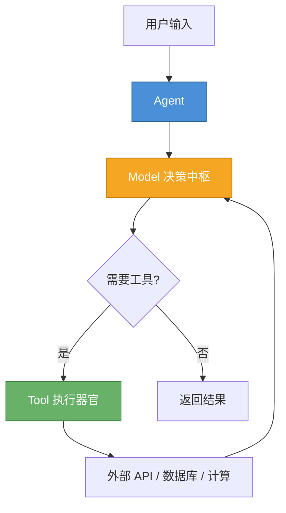
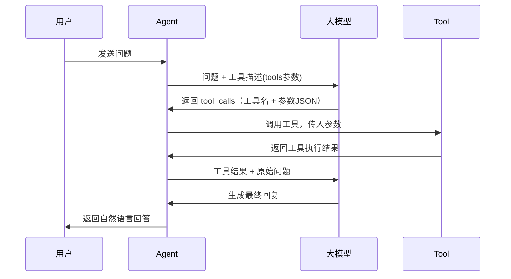
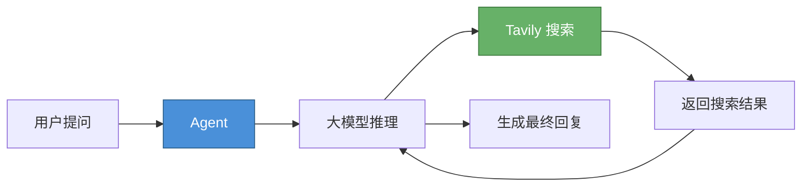

# LangChain 工具（Tool）使用指南

> **适用版本**：LangChain 1.3.x / langchain-core 1.4.x

---

## 1. 🔧 工具系统概述

一个完整的 **Agent** 由两个核心组件构成：

- **模型（Model）**：负责语义理解、逻辑推理以及任务拆解
- **工具（Tool）**：负责调用外部 API、执行计算、查询数据库等具体操作



**工具的本质是一个可被模型调用的函数**。要让模型正确使用工具，需要将函数的以下信息传递给它：

- **函数名称**——工具的唯一标识符
- **功能描述**——告诉模型该工具的用途（写在 docstring 中）
- **参数签名与返回类型**——指导模型如何正确传参并理解返回结果

LangChain 框架会自动从函数签名和 docstring 中提取上述信息，序列化为大模型可理解的 `tools` 参数格式（如 OpenAI 的 Function Calling Schema）。以 `get_weather` 工具为例，发送给模型的工具描述大致如下：

```json
{
  "type": "function",
  "function": {
    "name": "get_weather",
    "description": "获取指定地点的实时天气信息。",
    "parameters": {
      "type": "object",
      "properties": {
        "location": {
          "type": "string",
          "description": "城市名称或经纬度坐标"
        }
      },
      "required": ["location"]
    }
  }
}
```

模型根据这段描述理解工具的用途和参数要求。当模型判定需要调用工具时，它以 JSON 格式返回工具名称和参数（即 `tool_calls`），由 LangChain 框架负责实际执行并将结果回传给模型。

**关键点**：工具函数的 `docstring` 写得越清晰，模型就越能准确判断何时调用、如何传参。这是 Agent 开发中最值得关注的细节之一。



---

## 2. 🚀 快速上手

通过一个完整示例，演示 Agent 的定义流程与运行机制。

定义一个带工具的 Agent 只需两步：

1. **定义工具函数**
2. **创建 Agent 并将工具注册到其中**

### 2.1 定义工具

使用 `@tool` 装饰器将普通函数声明为 Agent 可用工具：

```python
from langchain_core.tools import tool

@tool
def get_weather(location: str) -> str:
    """获取指定地点的实时天气信息。

    Args:
        location: 城市名称或经纬度坐标
    """
    # 生产环境中接入真实天气 API
    return f"{location}当前天气晴朗，气温 25°C"
```

### 2.2 创建 Agent 并绑定工具

```python
from langchain.agents import create_agent
from langchain_core.messages import HumanMessage

# 创建智能体，注册工具
agent = create_agent(
    model="deepseek:deepseek-chat",
    tools=[get_weather]
)

# 调用智能体
response = agent.invoke(
    {"messages": [HumanMessage(content="成都今天天气如何？")]},
)
for message in response["messages"]:
    message.pretty_print()
```

### 2.3 运行结果

```
================================ Human Message =================================

成都今天天气如何？
================================== Ai Message ==================================

好的，我来查询成都今天的天气情况。
Tool Calls:
  get_weather (call_00_kTK0a29sOgLd3candG8p8795)
 Call ID: call_00_kTK0a29sOgLd3candG8p8795
  Args:
    location: 成都
================================= Tool Message =================================
Name: get_weather

成都当前天气晴朗，气温 25°C
================================== Ai Message ==================================

成都今天天气晴朗 ☀️，气温 25°C，是个适合出门的好天气！
```

**结果解读**：输出中包含完整的对话消息链：

1. **HumanMessage**：用户原始问题
2. **AIMessage（第一次）**：模型识别到需要调用工具，返回 `tool_calls` 指令（包含工具名和参数 JSON）
3. **ToolMessage**：工具执行后返回的结果
4. **AIMessage（第二次）**：模型基于工具返回的数据，生成最终的自然语言回复

LangChain 自动完成了"推理 → 调用工具 → 观测结果 → 生成回复"的完整循环，开发者无需手动编排。

---

## 3. 自定义工具详解

LangChain 简化了工具定义流程，与编写普通函数几乎一样。核心思路：**用 `@tool` 装饰器将普通函数"升级"为工具**，框架自动处理序列化、参数解析和结果回传。

### 3.1 基本定义

在函数上添加 `@tool` 装饰器即可创建工具。以计算平方根为例：

```python
from langchain_core.tools import tool

@tool
def square_root(x: float) -> float:
    """计算指定数字的平方根。"""
    return x ** 0.5
```

**`@tool` 装饰器的工作原理**：自动从函数中提取以下信息，构建工具的元数据：

| 元数据 | 来源 | 作用 |
|--------|------|------|
| **工具名称** | 函数名（如 `square_root`） | 模型调用时的标识符 |
| **输入参数** | 函数入参及其类型注解（如 `x: float`） | 指导模型如何构造参数 JSON |
| **功能描述** | 函数的文档注释（docstring） | 告诉模型何时调用该工具 |

**重要提示**：函数的类型注解（Type Hints）和 docstring 至关重要——它们是大模型理解工具的唯一信息来源。如果 docstring 写得模糊，模型就可能误判工具的用途或传错参数。

### 3.2 通过装饰器自定义元数据

使用 `@tool` 装饰器的参数可以覆盖默认值：

**自定义工具名称：**

```python
@tool("square_root")
def tool1(x: float) -> float:
    """计算一个数的平方根。"""
    return x ** 0.5
```

**同时自定义名称和描述：**

```python
@tool("square_root", description="计算一个数的平方根")
def tool1(x: float) -> float:
    return x ** 0.5
```

### 3.3 自定义入参约束（Pydantic v2）

当需要对工具的输入参数做更细粒度的控制时，可借助 **Pydantic v2** 进行强类型约束。Pydantic 模型中的 `Field(description=...)` 会被自动提取为参数描述，帮助模型理解每个参数的含义。

**为什么需要 Pydantic？** 简单场景下，函数签名的类型注解已经足够。但在以下情况中，Pydantic 提供了更强的控制能力：

- 参数需要枚举约束（如温度单位只能是 `celsius` 或 `fahrenheit`）
- 参数需要默认值和详细描述
- 需要对参数进行复杂验证（如范围检查、正则匹配）
- 需要嵌套结构的复杂输入

```python
from pydantic import BaseModel, Field
from typing import Literal

class WeatherInput(BaseModel):
    """查询天气的输入参数"""
    location: str = Field(description="城市名称或经纬度坐标")
    units: Literal["celsius", "fahrenheit"] = Field(
        default="celsius",
        description="温度单位，可选摄氏或华氏"
    )
    include_forecast: bool = Field(
        default=False,
        description="是否包含未来五天的天气预报"
    )

@tool(args_schema=WeatherInput)
def get_weather(location: str, units: str = "celsius", include_forecast: bool = False) -> str:
    """获取指定地点的当前气象信息及可选的未来天气预报。"""
    temp = 22 if units == "celsius" else 72
    unit_label = "摄氏度" if units == "celsius" else "华氏度"
    result = f"{location}当前气温：{temp}{unit_label}"
    if include_forecast:
        result += "\n未来五天：持续晴朗"
    return result
```

工具定义完成后，既可被 Agent 调用，也可像普通函数一样直接使用：

```python
# 直接调用数学工具
square_root.invoke({"x": 467})

# 直接调用天气工具
get_weather.invoke({"location": "成都", "include_forecast": True})
```

> **注意**：LangChain 保留了 `config` 和 `runtime` 两个参数名，自定义参数不得与之冲突。详细说明请参考官方文档：[Reserved argument names](https://docs.langchain.com/oss/python/langchain/tools#reserved-argument-names)

### 3.4 将工具注册到 Agent

创建 Agent 时将工具列表传入，模型便会在推理过程中按需选择调用：

```python
from langchain.agents import create_agent

agent = create_agent(
    model="deepseek:deepseek-chat",
    tools=[square_root, get_weather],
    system_prompt="你是一个智能助手，善于使用工具解决用户问题。"
)
```

**`create_agent` 的核心参数**：

| 参数 | 说明 |
|------|------|
| `model` | 模型标识，使用 `"provider:model"` 字符串格式（如 `"deepseek:deepseek-chat"`） |
| `tools` | 工具列表，Agent 可调用的外部能力 |
| `system_prompt` | 可选，系统提示词，定义 Agent 的角色和行为 |
| `response_format` | 可选，结构化输出模型（Pydantic 类） |
| `middleware` | 可选，中间件列表，用于拦截和增强模型调用 |

**多工具协作**：当 Agent 配备多个工具时，它会根据用户问题自动选择最合适的工具。例如用户问"467的平方根是多少"时调用 `square_root`，问"成都天气如何"时调用 `get_weather`。

---

## 4. 📡 观察工具调用行为

Agent 会自主判断：**是否需要调用工具、调用哪个工具、传入什么参数**。工具返回结果后，模型再基于结果生成最终回复。

LangChain 提供了两种流式输出模式，帮助开发者观察 Agent 的内部执行过程：

### 4.1 流式输出模式

使用 `stream_mode="messages"` 可以实时观察 Agent 的输出：

```python
from langchain_core.messages import HumanMessage

for token, metadata in agent.stream(
    {"messages": [HumanMessage(content="467的平方根是多少？")]},
    stream_mode="messages"
):
    print(token.content, end="", flush=True)
```

### 4.2 分步输出模式

使用 `stream_mode="updates"` 可以清晰观察每一步的执行细节：

```python
for chunk in agent.stream(
    {"messages": [HumanMessage(content="467和529的平方根分别是多少？")]},
    stream_mode="updates"
):
    for step, data in chunk.items():
        print(f"步骤: {step}")
        print(f"内容: {data['messages'][-1].content_blocks}")
        print()
```

输出结果如下：

```
步骤: model
内容: [{'type': 'text', 'text': '我来计算这两个数的平方根。'}, {'type': 'tool_call', 'id': 'call_00_...', 'name': 'square_root', 'args': {'x': 467}}, {'type': 'tool_call', 'id': 'call_01_...', 'name': 'square_root', 'args': {'x': 529}}]
步骤: tools
内容: [{'type': 'text', 'text': '21.61018278497431'}]
步骤: tools
内容: [{'type': 'text', 'text': '23.0'}]
步骤: model
内容: [{'type': 'text', 'text': '计算结果如下：\n- √467 ≈ 21.6102\n- √529 = 23'}]
```

可以看到，Agent 一次性发出了两个工具调用请求（并行调用），分别计算 467 和 529 的平方根，最后将结果汇总为自然语言回复。

**两种输出模式对比**：

| 模式 | 适用场景 | 特点 |
|------|----------|------|
| `stream_mode="messages"` | 实时展示最终回复 | 逐 token 输出，体验类似打字机 |
| `stream_mode="updates"` | 调试和观察执行细节 | 按步骤输出，可清晰看到每一步的工具调用和返回结果 |

---

## 5. 🔍 预定义工具

LangChain 生态内置了大量可直接使用的工具，完整清单参见官方文档：

- [LangChain 工具集成列表](https://docs.langchain.com/oss/python/integrations/tools)

例如，大模型的知识截止于训练数据，无法获取实时信息。配合 **Web 搜索工具**后，Agent 便具备了联网检索能力。

### 5.1 Tavily 搜索工具

[Tavily](https://tavily.com/) 是专为 AI Agent 设计的搜索引擎，LangChain 提供了官方集成支持。



官方集成文档：[LangChain Tavily 集成文档](https://docs.langchain.com/oss/python/integrations/tools/tavily_search)

### 5.2 集成步骤

**第一步：注册账号并获取 API Key**

前往 [Tavily 官网](https://tavily.com/) 注册账号（支持邮箱注册以及 Google、GitHub 快捷登录）。登录后台后，在控制台首页即可看到系统自动生成的 `API_KEY`。

**第二步：配置环境变量**

将 API Key 写入项目根目录的 `.env` 文件中：

```
TAVILY_API_KEY=your_api_key_here
```

**第三步：安装依赖**

```bash
uv add langchain-tavily
```

**第四步：初始化工具**

```python
from langchain_tavily import TavilySearch

tool = TavilySearch(
    max_results=5,
    topic="general",
)
```

**第五步：测试调用**

```python
result = tool.invoke("成都今天天气如何？")
print(result)
```

返回结果示例：

```python
{
  'query': '成都今天天气如何？',
  'results': [
    {
      'url': 'https://weather.example.com/chengdu',
      'title': '成都天气预报',
      'content': '成都今天：多云 9~16°C 东北风2级...',
      'score': 0.9999
    },
    ...
  ]
}
```

### 5.3 与 Agent 结合使用

将 Tavily 搜索工具接入 Agent：

```python
from langchain.agents import create_agent
from langchain_core.messages import HumanMessage

agent = create_agent(
    model="deepseek:deepseek-chat",
    tools=[tool],
    system_prompt="你是一个智能助手，善于使用搜索工具获取实时信息来回答用户问题。"
)

for chunk in agent.stream(
    {"messages": [HumanMessage(content="北京接下来五天的天气如何？")]},
    stream_mode="updates"
):
    for step, data in chunk.items():
        print(f"步骤: {step}")
        print(f"内容: {data['messages'][-1].content_blocks}")
        print()
```

执行过程如下：

```
步骤: model
内容: [{'type': 'text', 'text': '我来帮您查询北京未来五天的天气情况。'}, {'type': 'tool_call', 'name': 'tavily_search', 'args': {'query': '北京未来五天天气预报'}}]
步骤: tools
内容: [{'type': 'text', 'text': '{"query": "北京未来五天天气预报", "results": [...]}'}]
步骤: model
内容: [{'type': 'text', 'text': '根据搜索结果，为您整理北京未来五天的天气预报如下：...'}]
```

Agent 自动调用了 Tavily 搜索获取实时天气数据，然后基于搜索结果生成了结构化的天气预报回复。

---

## 6. 📌 优化实践

### 6.1 精简工具封装

`TavilySearch` 的默认参数较多，工具描述也较冗长。如果只需要 `query` 参数，推荐做一层轻量封装，降低模型的理解成本：

**为什么要精简？** 工具描述中的参数越多，模型需要理解的信息就越多，可能导致：
- 模型犹豫是否需要传入某些可选参数
- 工具调用的延迟增加（模型需要处理更长的 token）
- 模型传入不必要的参数导致结果异常

```python
from langchain_core.tools import tool
from langchain_tavily import TavilySearch

tavily = TavilySearch(max_results=5, topic="general")

@tool
def web_search(query: str) -> str:
    """搜索互联网获取实时信息。"""
    return tavily.invoke(query)
```

### 6.2 结构化输出

默认情况下 AI 的回答不附带信息来源，可信度难以保障。通过自定义输出模型，可以让 Agent 在回复时自动附上引用链接。

首先定义输出数据的结构：

```python
from pydantic import BaseModel, Field

class Reference(BaseModel):
    title: str = Field(description="回答中引用的网页标题")
    url: str = Field(description="回答中引用的网页链接地址")

class AnswerInfo(BaseModel):
    answer: str = Field(description="面向用户的最终回答内容")
    references: list[Reference] = Field(description="回答中所引用的网页来源列表")
```

然后通过 `response_format` 参数指定输出格式：

```python
agent = create_agent(
    model="deepseek:deepseek-chat",
    tools=[web_search],
    system_prompt="你是一个智能助手，善于使用搜索工具获取信息并给出带引用的回答。",
    response_format=AnswerInfo
)

response = agent.invoke(
    {"messages": [HumanMessage(content="蒸蚌是什么梗？")]},
)

print(response["structured_response"])
```

输出如下：

```
answer='"蒸蚌"是一个网络谐音梗，意思是"真棒"。...'
references=[
    Reference(title='"我蒸蚌"是什么意思？', url='https://zh.hinative.com/questions/15904858'),
    Reference(title='蒸蚌什么梗', url='https://www.douyin.com/search/蒸蚌什么梗')
]
```

通过结构化输出，AI 的回复既包含准确答案，又附带可信来源，提升了内容的可验证性。

### 6.3 工具定义最佳实践

| 要点 | 说明 |
|------|------|
| **清晰的 docstring** | Agent 依赖 docstring 理解工具用途，务必描述清楚功能、参数含义和返回值 |
| **参数类型标注** | 使用 Python 类型注解（如 `location: str`），帮助 Agent 正确构造参数 |
| **单一职责** | 每个工具只做一件事，避免定义功能过于复杂的工具 |
| **错误处理** | 工具函数内部做好异常处理，返回友好的错误信息而非抛出异常 |
| **精简封装** | 对复杂工具做轻量封装，只暴露必要的参数给 Agent |

### 6.4 常见问题

**Q: Agent 没有调用我定义的工具？**

A: 检查以下几点：
- `docstring` 是否清晰描述了工具的用途
- 用户问题是否确实需要该工具才能回答
- 工具参数类型是否正确标注

**Q: 如何让 Agent 使用特定的工具？**

A: 在 `system_prompt` 中明确指示 Agent 的行为偏好，例如"当用户询问天气时，必须调用 get_weather 工具"。

**Q: Agent 调用工具时传参错误？**

A: 优化工具的 `docstring`，特别是参数描述部分。可以添加示例值来引导 Agent 正确传参。

**Q: 如何调试工具调用过程？**

A: 使用 `stream_mode="updates"` 模式观察每一步的执行细节，或使用 LangSmith 进行可视化追踪。

---

## 7. 小结

通过本文档，你已经掌握了 LangChain 工具系统的核心知识：

| 章节 | 要点 |
|------|------|
| **工具系统概述** | Agent = Model + Tool；工具本质是可被模型调用的函数；LangChain 自动序列化工具描述为 `tools` 参数 |
| **快速上手** | `@tool` 装饰器定义工具 + `create_agent` 注册工具，两步即可创建带工具的 Agent |
| **自定义工具** | 支持自定义名称、描述；Pydantic v2 入参约束提供强类型验证；`invoke()` 方法可直接调用工具 |
| **观察行为** | `stream_mode="messages"` 实时流式输出 / `"updates"` 分步观察执行细节 |
| **预定义工具** | Tavily 搜索等开箱即用的集成工具，接入 Agent 后具备联网检索能力 |
| **优化实践** | 精简封装降低模型理解成本；结构化输出附带引用来源；清晰的 docstring 是工具被正确调用的关键 |

## 全套公开课课件领取：


