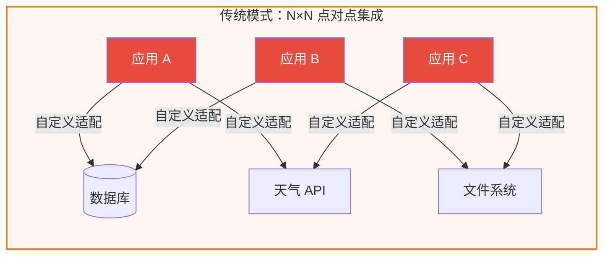
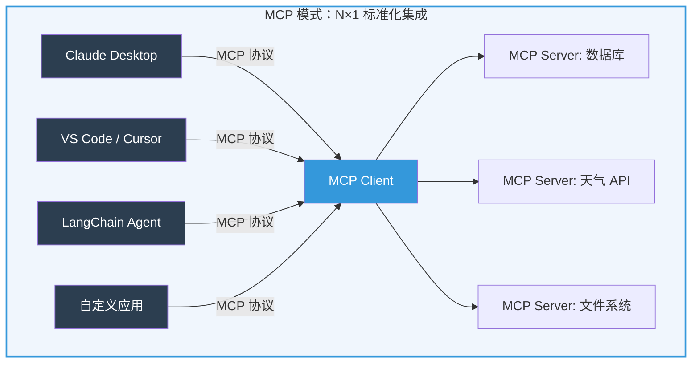
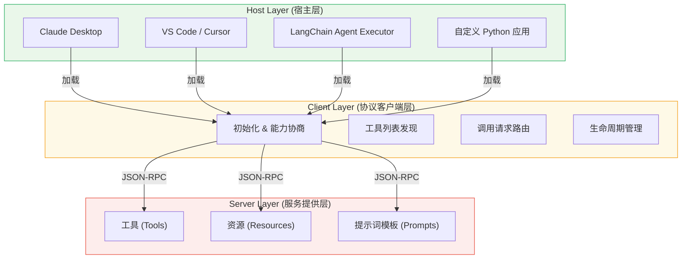
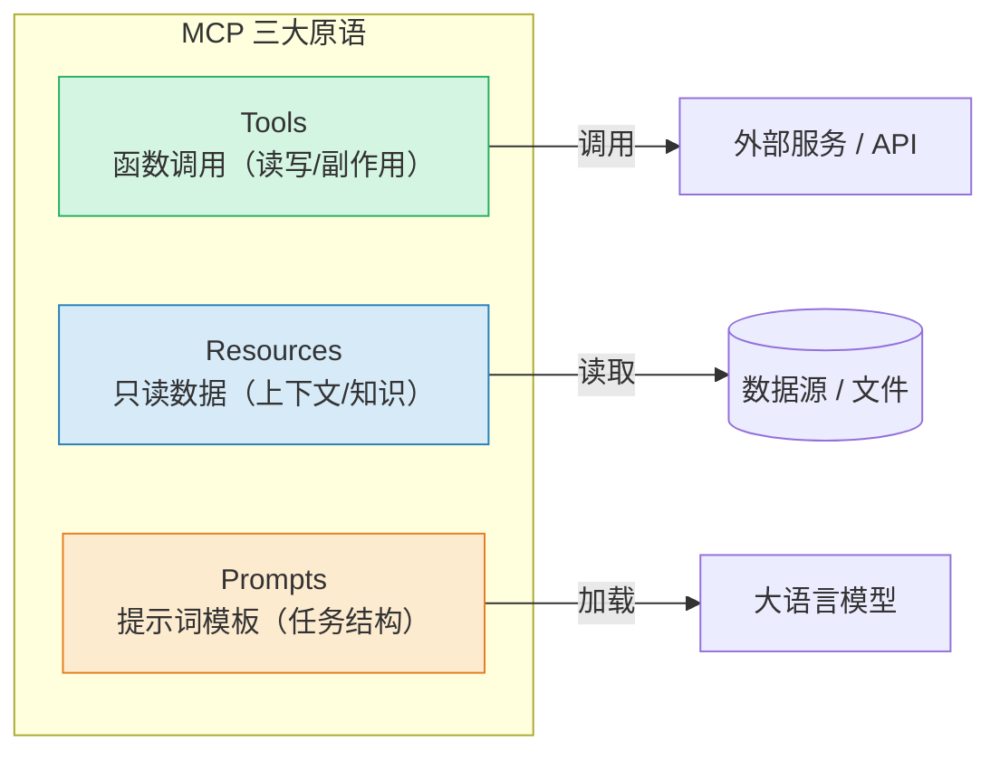
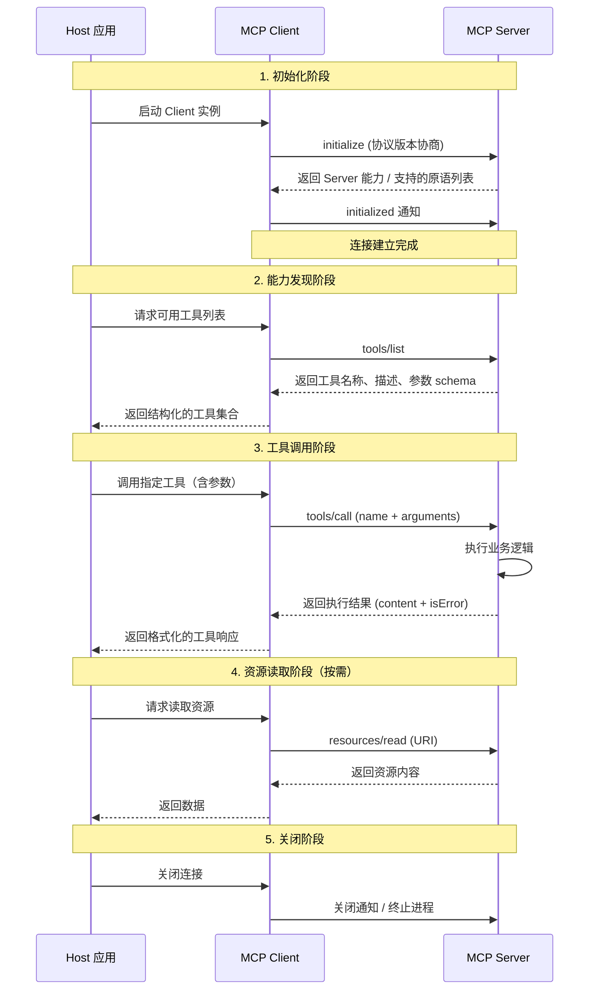
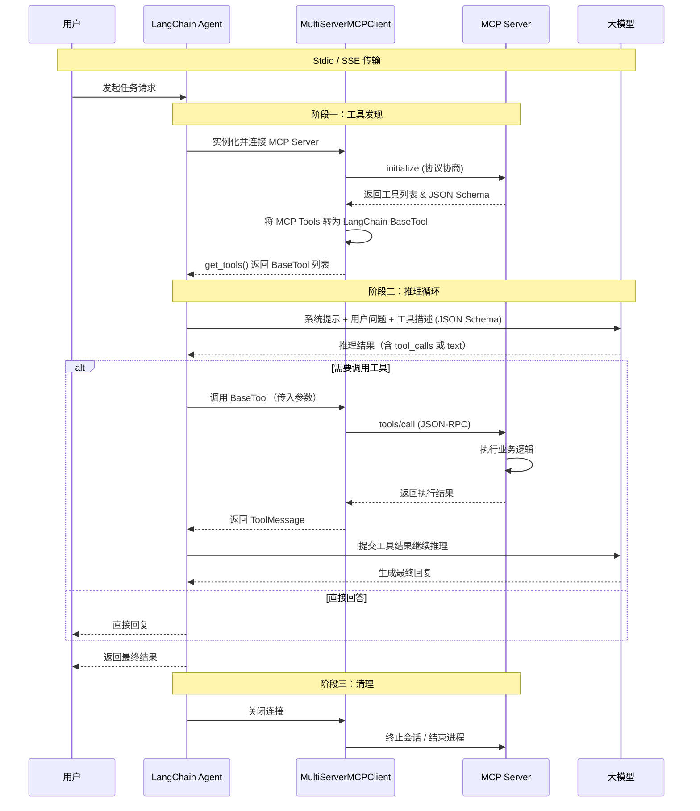

# MCP 协议与 LangChain 实战

---

## 一、🔌 MCP 协议概述

### 1.1 背景：LLM 工具集成的碎片化困境

大语言模型（LLM）的能力边界受限于训练数据的截止时间与静态知识结构。要让模型具备实时查询天气、操作数据库、调用第三方 API 等动态能力，就需要为其接入外部工具。

在 MCP 出现之前，每接入一个新工具或数据源，开发者都要编写大量**胶水代码（Glue Code）**：定义调用协议、处理鉴权、解析返回值、转换数据格式。更麻烦的是，这些适配代码是**碎片化**的——为 LangChain 编写的工具函数无法直接在 Claude Desktop 或 Cursor 中使用，反之亦然。这导致了典型的 **N×N 集成困境**：



每个应用都需要为每个数据源独立编写适配层，集成成本随规模呈平方级增长。

### 1.2 什么是 MCP？

**MCP（Model Context Protocol，模型上下文协议）** 是由 Anthropic 于 2024 年 11 月提出并开源的开放标准，旨在为大语言模型与外部工具、数据源、服务之间定义一套**通用的通信契约**。

MCP 的核心思想：**将工具与数据源抽象为标准化的服务接口**，任何实现了 MCP Client 的应用都可以通过同一套协议去发现、调用任意 MCP Server 暴露的能力。



MCP 使用 **JSON-RPC 2.0** 作为通信协议，支持请求（Request）、通知（Notification）和批量操作（Batch）三种消息模式，传输层同时支持 **Stdio（标准输入/输出管道）** 和 **SSE（Server-Sent Events）** 两种方案。

### 1.3 核心价值：从 N×N 到 N×1

| 维度 | 传统模式 | MCP 模式 |
|------|----------|----------|
| 集成方式 | 每个应用 × 每个数据源 = N×N 个适配器 | 每个数据源开发一次 MCP Server = N 个 Server |
| 复用性 | 适配代码锁定框架/平台 | 一次开发，所有 MCP Client 均可接入 |
| 维护成本 | 接口变更需同步修改所有消费方 | Server 升级对消费方透明 |
| 安全性 | 各应用自行处理鉴权与凭证 | MCP 层提供统一的安全边界 |

### 1.4 行业类比：AI 界的 USB-C

USB-C 标准化了物理设备的连接方式——无论另一端是显示器、硬盘还是电源适配器，遵循同一标准即可"即插即用"。MCP 对 AI 应用做的也是同样的事：标准化**数据交换与能力发现接口**。

- **MCP Server** ≈ USB 设备（提供特定功能）
- **MCP Client** ≈ USB 控制器（管理设备发现与通信）
- **Host 应用** ≈ 笔记本电脑（为用户提供使用界面）

---

## 二、🏗️ MCP 核心架构

### 2.1 三大角色

MCP 遵循 C/S（Client-Server）架构，由三个层次分明的角色构成：

| 角色 | 说明 | 典型实例 |
|------|------|----------|
| **Host（宿主）** | 用户直接交互的顶层应用，负责加载 MCP Client 并编排其行为 | Claude Desktop、VS Code、LangChain Agent |
| **Client（客户端）** | 与 MCP Server 建立 1:1 连接的协议实现层，负责会话管理、能力协商与请求路由 | `MultiServerMCPClient`、`MCPClient` |
| **Server（服务端）** | 暴露具体工具、资源和提示词模板的轻量服务程序，专注于业务逻辑 | FastMCP Server、Python SDK Server |

三者关系如下：



### 2.2 三大核心原语

MCP 协议定义了三种核心原语（Primitives），Server 通过暴露这些原语来向 Client 提供能力：

#### Tools（工具）

- **语义**：可被 LLM 调用的函数式接口，**执行后产生副作用**（查询数据库、发送邮件、调用 API）
- **调用模式**：由 LLM 自主决定"是否调用"以及"传入什么参数"（模型驱动）
- **类比**：类似于 OpenAI Function Calling，但跨框架通用
- **Server 声明方式**：`@mcp.tool()` 装饰器

#### Resources（资源）

- **语义**：暴露只读数据，供 LLM 读取上下文（文档内容、配置文件、数据库记录）
- **调用模式**：由 LLM 或 Host 按需读取（类似 REST 的 GET 请求）
- **类比**：文件系统的 `cat` 命令、HTTP 的静态资源端点
- **Server 声明方式**：`@mcp.resource()` 装饰器 + URI 标识
- **特殊机制**：支持**资源模板（Resource Template）**，用参数化 URI 匹配动态资源（如 `file:///logs/{date}`）

#### Prompts（提示词模板）

- **语义**：预定义的提示词模板，封装特定任务的对话结构
- **调用模式**：一般由 Host 在用户触发时主动加载（用户驱动）
- **用途**：为常见任务提供标准化入口，减少重复的 Prompt Engineering



### 2.3 传输层：两种通信模式

MCP 支持两种传输层方案，适用不同的部署场景：

| 特性 | Stdio Transport | HTTP/SSE Transport |
|------|-----------------|---------------------|
| **通信方式** | 子进程的标准输入/输出管道 | Server-Sent Events + HTTP POST |
| **进程模型** | Client 自行启动 Server 子进程 | Server 独立运行，Client 远程连接 |
| **适用场景** | 本地开发、单机工具链 | 云端部署、多客户端共享服务 |
| **生命周期** | Client 控制 Server 进程启停 | Server 独立管理生命周期 |
| **延迟** | 极低（进程内管道通信） | 较低（网络 I/O） |
| **安全性** | 本地隔离，无需网络鉴权 | 需要网络级鉴权与 TLS |

### 2.4 完整的交互流程



---

## 三、⚡ 实战：使用 FastMCP 构建 MCP Server

`FastMCP` 是 MCP Python SDK 提供的高层封装，使用装饰器风格快速定义 Server 的能力。它自动处理 JSON-RPC 序列化、能力协商和传输层管理，开发者只需关注业务逻辑。

### 3.1 环境准备

```bash
# 安装 MCP Python SDK（内置 FastMCP）
pip install mcp

# 验证安装
python -c "from mcp.server.fastmcp import FastMCP; print('FastMCP ready')"
```

### 3.2 定义第一个 MCP Server（含 Tools + Resources）

创建一个 `math_server.py` 文件：

```python
from mcp.server.fastmcp import FastMCP

# 初始化 MCP Server，名称将用于 Client 发现
mcp = FastMCP("Math Tutor")

# ============================================================
# Tool：可被 LLM 自主调用的函数
# 使用 @mcp.tool() 装饰器注册，FastMCP 自动生成 JSON Schema
# ============================================================

@mcp.tool(description="计算两个数值的乘积")
def multiply(a: float, b: float) -> float:
    """将两个数相乘并返回结果"""
    return a * b


@mcp.tool(description="执行除法运算，内置零除保护")
def divide(a: float, b: float) -> float:
    """执行 a / b 运算。内置零除防御。"""
    if b == 0:
        raise ValueError("除数不可为零")
    return a / b


@mcp.tool(description="计算斐波那契数列的第 n 项")
def fibonacci(n: int) -> int:
    """使用高效迭代算法计算 Fibonacci(n)"""
    if n < 0:
        raise ValueError("n 必须为非负整数")
    a, b = 0, 1
    for _ in range(n):
        a, b = b, a + b
    return a


# ============================================================
# Resource：通过 URI 暴露只读数据
# 使用 @mcp.resource() 装饰器注册
# ============================================================

@mcp.resource("math://constants")
def get_constants() -> str:
    """返回常用数学常数"""
    return "\n".join([
        "π = 3.141592653589793",
        "e = 2.718281828459045",
        "√2 = 1.4142135623730951",
    ])


@mcp.resource("math://help")
def get_help() -> str:
    """返回可用工具说明"""
    return (
        "本 MCP Server 提供以下数学工具：\n"
        "- multiply(a, b)：乘法\n"
        "- divide(a, b)：除法\n"
        "- fibonacci(n)：斐波那契数列\n\n"
        "可用资源：\n"
        "- math://constants：数学常数\n"
        "- math://help：本帮助"
    )


# ============================================================
# 启动入口
# ============================================================

if __name__ == "__main__":
    # 以 Stdio 传输模式运行（默认）
    # 若需 HTTP/SSE 模式：mcp.run(transport="sse", host="0.0.0.0", port=8000)
    mcp.run(transport="stdio")
```

### 3.3 以 HTTP/SSE 模式运行

如果需要部署为远程服务（供多个 Client 共享），只需切换传输模式：

```bash
# 以 SSE 模式运行在 8000 端口
python -c "
from math_server import mcp
mcp.run(transport='sse', host='0.0.0.0', port=8000)
"
```

启动后，Server 在 `http://localhost:8000/sse` 暴露 SSE 端点，Client 通过该端点建立长连接并接收事件推送。

### 3.4 快速验证 Server

使用 MCP CLI 工具可以直接从命令行列出和测试 Server 的能力：

```bash
# 列出所有已注册的工具
mcp run math_server.py --list-tools

# 列出所有已注册的资源
mcp run math_server.py --list-resources

# 交互式测试模式
mcp run math_server.py --interactive
```

---

## 四、🔗 实战：在 LangChain 中集成 MCP

`langchain-mcp-adapters` 是 LangChain 官方提供的 MCP 适配器库，它将 MCP Server 暴露的工具转换为 LangChain 标准的 `BaseTool` 对象，融入 LangChain 的 Agent 体系。

### 4.1 核心原理



### 4.2 安装依赖

```bash
pip install langchain-mcp-adapters langchain langchain-openai
```

### 4.3 Stdio 模式：连接本地 MCP Server

本地开发最常用的模式——Client 启动 Server 子进程并通过标准输入/输出管道通信。

#### 方式一：使用 `create_tool_calling_agent` + `AgentExecutor`（推荐）

```python
import asyncio
from langchain_mcp_adapters.client import MultiServerMCPClient
from langchain_openai import ChatOpenAI
from langchain.agents import create_tool_calling_agent, AgentExecutor
from langchain_core.prompts import ChatPromptTemplate


async def main():
    # 使用上下文管理器，自动处理 Server 启停
    async with MultiServerMCPClient(
        {
            "math-tutor": {
                "command": "python",
                "args": ["math_server.py"],
                "transport": "stdio",
            }
        }
    ) as client:
        # 从 MCP Server 获取 LangChain 原生 BaseTool 对象
        tools = client.get_tools()
        print(f"已加载 {len(tools)} 个工具:")
        for t in tools:
            print(f"  - {t.name}: {t.description}")

        # 初始化大模型
        llm = ChatOpenAI(model="gpt-4o")

        # 构建提示词模板（必须包含 {input} 和 {agent_scratchpad} 占位符）
        prompt = ChatPromptTemplate.from_messages([
            (
                "system",
                "你是一名数学导师助手。请使用可用工具准确回答用户的数学问题。"
                "如果需要计算，请选择正确的工具并传入正确的参数。",
            ),
            ("human", "{input}"),
            ("placeholder", "{agent_scratchpad}"),
        ])

        # 创建 Tool Calling Agent（模型原生函数调用能力）
        agent = create_tool_calling_agent(llm, tools, prompt)

        # 包装为 AgentExecutor
        agent_executor = AgentExecutor(
            agent=agent,
            tools=tools,
            verbose=True,           # 打印推理过程，方便教学观察
            handle_parsing_errors=True,
        )

        # 执行查询 —— Agent 将自主决定何时调用哪个工具
        result = await agent_executor.ainvoke(
            {"input": "请计算 51204 × 4 以及 Fibonacci(20) 的值"}
        )

        print(f"\n最终答案: {result['output']}")


if __name__ == "__main__":
    asyncio.run(main())
```

运行后，你将在控制台看到 Agent 的完整推理轨迹：思考 → 调用工具 → 观察结果 → 继续推理 → 给出最终答案。

#### 方式二：使用 LCEL + `bind_tools` 手动编排

如果需要更精细地控制工具调用流程，可以直接使用 `bind_tools` 手动编排：

```python
import asyncio
import json
from langchain_mcp_adapters.client import MultiServerMCPClient
from langchain_openai import ChatOpenAI
from langchain_core.messages import HumanMessage, ToolMessage


async def main():
    async with MultiServerMCPClient(
        {
            "math-tutor": {
                "command": "python",
                "args": ["math_server.py"],
                "transport": "stdio",
            }
        }
    ) as client:
        tools = client.get_tools()

        # 将工具绑定到 LLM（生成 JSON Schema 供模型识别）
        llm = ChatOpenAI(model="gpt-4o")
        llm_with_tools = llm.bind_tools(tools)

        # 构建工具查找表
        tool_map = {tool.name: tool for tool in tools}

        # ---- 第一轮：LLM 决定调用工具 ----
        messages = [HumanMessage(content="计算 51204 × 4 和 Fibonacci(20)")]
        response = await llm_with_tools.ainvoke(messages)
        messages.append(response)

        # ---- 执行工具调用 ----
        for tool_call in response.tool_calls:
            selected_tool = tool_map[tool_call["name"].lower()]
            tool_result = await selected_tool.ainvoke(tool_call["args"])
            messages.append(
                ToolMessage(
                    content=json.dumps(tool_result),
                    tool_call_id=tool_call["id"],
                )
            )

        # ---- 第二轮：LLM 根据工具结果生成最终回答 ----
        final_response = await llm_with_tools.ainvoke(messages)
        print(f"最终答案: {final_response.content}")


if __name__ == "__main__":
    asyncio.run(main())
```

### 4.4 HTTP/SSE 模式：连接远程 MCP Server

当 MCP Server 已部署为远程 HTTP 服务时，使用 SSE 传输模式连接：

```python
import asyncio
from langchain_mcp_adapters.client import MultiServerMCPClient
from langchain_openai import ChatOpenAI
from langchain.agents import create_tool_calling_agent, AgentExecutor
from langchain_core.prompts import ChatPromptTemplate


async def main():
    # 连接远程 SSE MCP Server
    async with MultiServerMCPClient(
        {
            "remote-math": {
                "url": "http://localhost:8000/sse",
                "transport": "sse",
            }
        }
    ) as client:
        tools = client.get_tools()
        print(f"已加载 {len(tools)} 个远程工具")

        llm = ChatOpenAI(model="gpt-4o")
        prompt = ChatPromptTemplate.from_messages([
            ("system", "你是一个数学助手"),
            ("human", "{input}"),
            ("placeholder", "{agent_scratchpad}"),
        ])
        agent = create_tool_calling_agent(llm, tools, prompt)
        agent_executor = AgentExecutor(agent=agent, tools=tools, verbose=True)

        result = await agent_executor.ainvoke({"input": "计算 Fibonacci(30)"})
        print(f"结果: {result['output']}")


if __name__ == "__main__":
    asyncio.run(main())
```

### 4.5 多服务器编排：聚合多个 MCP Server

同时连接多个 Server，Agent 根据任务自动选择合适的工具——这是 MCP 架构最直观的优势：

```python
import asyncio
from langchain_mcp_adapters.client import MultiServerMCPClient
from langchain_openai import ChatOpenAI
from langchain.agents import create_tool_calling_agent, AgentExecutor
from langchain_core.prompts import ChatPromptTemplate


async def main():
    # 同时连接多个 MCP Server（混合 stdio + SSE 传输）
    async with MultiServerMCPClient(
        {
            # 本地数学服务（Stdio）
            "math-tutor": {
                "command": "python",
                "args": ["math_server.py"],
                "transport": "stdio",
            },
            # 远程地图服务（SSE）
            "amap-service": {
                "url": "https://mcp.api-inference.modelscope.net/sse",
                "transport": "sse",
            },
        }
    ) as client:
        tools = client.get_tools()
        print(f"共加载 {len(tools)} 个工具（来自 2 个 Server）")

        llm = ChatOpenAI(model="gpt-4o")
        prompt = ChatPromptTemplate.from_messages([
            (
                "system",
                "你是一个全能助手，可使用数学工具和地图工具。"
                "根据用户问题自动选择合适的工具。",
            ),
            ("human", "{input}"),
            ("placeholder", "{agent_scratchpad}"),
        ])
        agent = create_tool_calling_agent(llm, tools, prompt)
        agent_executor = AgentExecutor(agent=agent, tools=tools, verbose=True)

        # Agent 将自主决定从哪个 Server 调用哪个工具
        result = await agent_executor.ainvoke(
            {
                "input": (
                    "计算 12345 × 6789，"
                    "然后告诉我从成都武侯区到双流区的骑行路线"
                )
            }
        )
        print(f"结果: {result['output']}")


if __name__ == "__main__":
    asyncio.run(main())
```

> **注意**：当同时连接多个 MCP Server 时，不同 Server 的工具可能存在同名冲突。`MultiServerMCPClient` 支持 `tool_name_prefix=True` 参数自动添加 Server 名称前缀来避免冲突。

### 4.6 错误处理与最佳实践

在生产环境中使用 MCP 工具时，建议做好以下防护：

```python
import asyncio
import logging
from contextlib import asynccontextmanager

from langchain_mcp_adapters.client import MultiServerMCPClient
from langchain_openai import ChatOpenAI
from langchain.agents import create_tool_calling_agent, AgentExecutor
from langchain_core.prompts import ChatPromptTemplate

logging.basicConfig(level=logging.INFO)
logger = logging.getLogger(__name__)


@asynccontextmanager
async def create_mcp_agent(server_config: dict):
    """带错误处理和日志的 MCP Agent 工厂"""
    client = None
    try:
        client = MultiServerMCPClient(server_config)
        tools = await client.__aenter__()

        if not tools:
            logger.warning("MCP Server 未返回任何工具")
            yield None
            return

        logger.info(f"成功加载 {len(tools)} 个 MCP 工具")

        llm = ChatOpenAI(model="gpt-4o", temperature=0)
        prompt = ChatPromptTemplate.from_messages([
            ("system", "你是一个 AI 助手，使用提供的工具回答问题。如果工具调用失败，请告知用户。"),
            ("human", "{input}"),
            ("placeholder", "{agent_scratchpad}"),
        ])
        agent = create_tool_calling_agent(llm, tools, prompt)
        agent_executor = AgentExecutor(
            agent=agent,
            tools=tools,
            verbose=True,
            max_iterations=5,           # 防止无限循环
            max_execution_time=30,      # 单次执行超时
            handle_parsing_errors=True,  # 解析异常时自动重试
        )
        yield agent_executor

    except FileNotFoundError:
        logger.error(f"MCP Server 启动失败: 找不到命令 {server_config}")
        yield None
    except ConnectionError:
        logger.error(f"MCP Server 连接失败: {server_config}")
        yield None
    finally:
        if client:
            await client.__aexit__(None, None, None)


async def main():
    config = {
        "math-tutor": {
            "command": "python",
            "args": ["math_server.py"],
            "transport": "stdio",
        }
    }

    async with create_mcp_agent(config) as agent_executor:
        if agent_executor is None:
            print("Agent 创建失败，请检查 MCP Server 配置")
            return

        result = await agent_executor.ainvoke(
            {"input": "计算 1000 ÷ 25 的结果"}
        )
        print(f"结果: {result['output']}")


if __name__ == "__main__":
    asyncio.run(main())
```

---

## 五、📋 MCP 生态与最佳实践

### 5.1 Server 设计原则

- **单一职责**：每个 MCP Server 聚焦一个业务领域，不要将不相关的功能混杂在同一 Server 中
- **完整类型标注**：为工具参数提供完整的 Python 类型注解和文档字符串，这将直接用于生成 LLM 可识别的 JSON Schema
- **有意义的错误信息**：抛出包含上下文信息的异常；`isError` 标志会被 LLM 感知并影响后续推理
- **幂等性优先**：非查询类操作尽量保证幂等，避免重复执行产生副作用
- **资源 URI 命名规范**：采用 `{domain}://{path}` 格式，便于组织和管理

### 5.2 典型应用场景

| 场景 | 推荐传输模式 | 说明 |
|------|-------------|------|
| 本地文件系统操作 | Stdio | 低延迟，直接访问本地文件 |
| 数据库查询 | Stdio / SSE | 根据数据库部署位置选择 |
| 第三方 API 封装 | SSE | 需要网络访问和鉴权管理 |
| 企业内部微服务 | SSE | 多服务共享，统一治理 |
| CI/CD 工具链 | Stdio | 管道集成，环境隔离 |

### 5.3 安全注意事项

- **输入验证**：MCP Server 应对接收到的所有参数进行严格校验，避免恶意输入
- **权限最小化**：Server 进程应使用最小必要权限运行
- **SSE 鉴权**：部署远程 MCP Server 时务必配置鉴权机制（API Key / OAuth）
- **超时控制**：为长时间运行的工具调用设置合理的超时阈值，防止资源泄露

### 5.4 生态工具一览

| 工具/库 | 作用 |
|---------|------|
| `mcp` (Python SDK) | 官方 Python SDK，内含 `FastMCP` 高层 API |
| `langchain-mcp-adapters` | LangChain 官方适配器，将 MCP 工具桥接为 `BaseTool` |
| `mcp-cli` | MCP 命令行调试工具 |
| Dify / Coze | 低代码平台原生支持 MCP 协议接入 |

---

## 六、✅ 总结

MCP 协议通过一套标准化的通信契约，改变了 LLM 与外部工具集成的方式：

1. **架构层面**：通过 Host → Client → Server 三层解耦，实现工具能力的"一次开发、到处接入"
2. **开发效率**：FastMCP 的装饰器风格让开发者只需关注业务逻辑，无需关心 JSON-RPC 序列化细节
3. **生态整合**：通过 `langchain-mcp-adapters`，MCP Server 的能力可以直接融入 LangChain 的 `AgentExecutor` 体系
4. **部署灵活**：同时支持本地 Stdio 和远程 SSE 两种传输模式，覆盖从单机工具到微服务网关的全场景

下一步，你可以尝试：
- 为你的业务系统编写专属 MCP Server
- 在 LangChain 的 LCEL 链中混用多个 MCP Server 的能力
- 探索 MCP Resources 和 Prompts 的深度应用，构建更丰富的 AI 原生应用

---

## 全套公开课课件领取：


