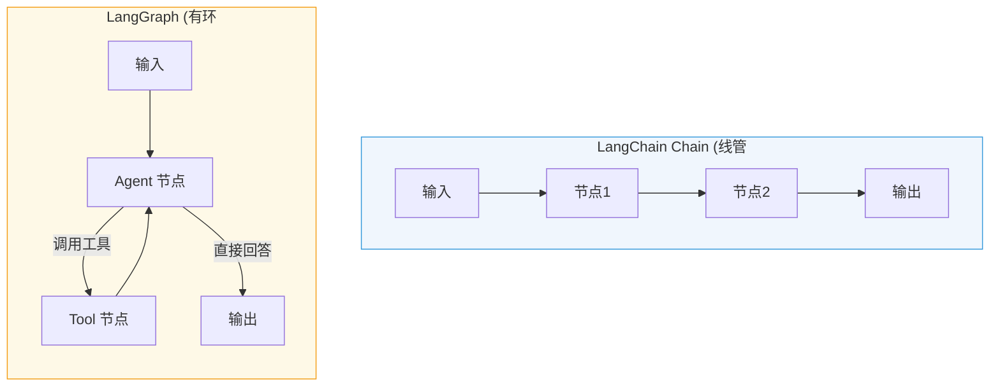
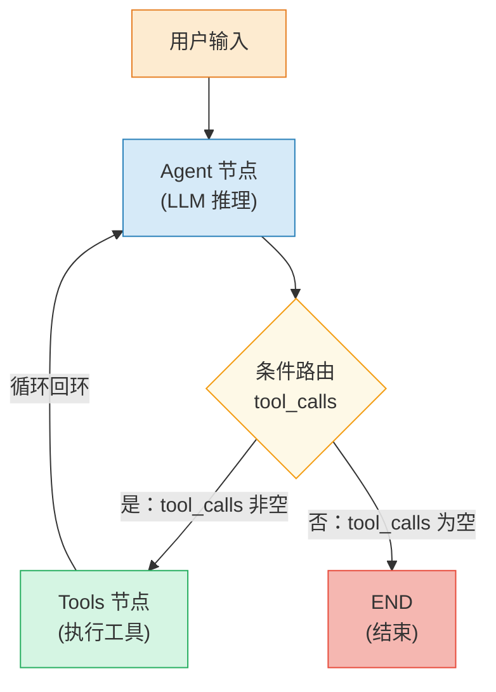
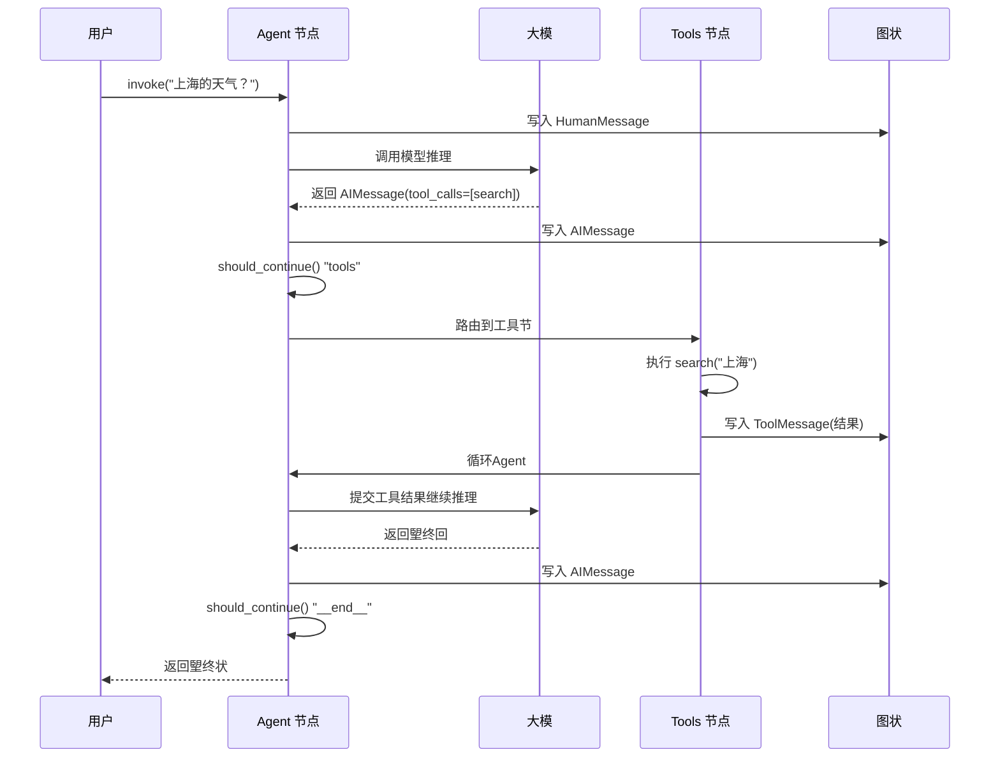
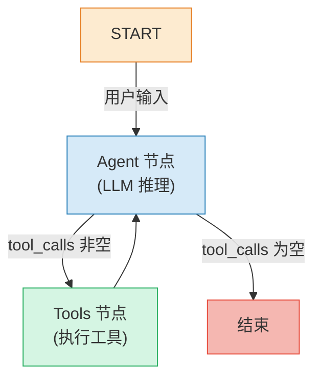

# LangGraph 基础入门


> **核心定位**：构建有状态、多角色、循环可控的 LLM 应用的底层框架
> **技术栈**：Python 3.11+ / LangGraph / LangChain Core

---

## 丢、LangGraph 是什么？

### 1.1 背景与定

在构建基于大语言模型（LLM）的应用时，弢发面临一个核心挑战：**如何让模型不仅能回答问题，还能执行多步骤任务、调用外部工具并在必要时寻求人工协助**

传统LangChain Chain 采用线管道模式输入经过一系列预定义的处理步骤后输出这种模式在箢单的问答场景下工作良好，但在以下场景中显得力不从心：

- **霢要循环推**：Agent 调用工具后需要根据结果决定下丢步行
- **霢要状态管**：多轮对话需要维护上下文，或在任务执行中途暂
- **霢要人机协**：敏感操作需要人工审批，或需要人工补充信
- **霢要并行处**：多个独立任务需要同时执行以提高效率

**LangGraph** 正是为解决这些问题生的底层图框架。它Google Pregel  Apache Beam 的启发，公共接口借鉴NetworkX，专为构**有状态多角色、带循环**LLM 应用而设计

### 1.2 核心优势对比

| 特| LangChain Chain | LangGraph |
|------|----------------|-----------|
| **执行** | 线DAG，单向无| 图结构，**支持循环** |
| **状管** | 隐式传，难以干预 | 显式 State 定义**每个节点可读** |
| **持久** | 无内置机| **Checkpointer** 断点续传 |
| **人机交互** | 不支| **Interrupt** 挂起恢复 |
| **并行** | 霢手动实现 | **Send API** 原生支持 |
| **调试能力** | 有限 | **LangSmith** 深度集成 |



### 1.3 设计灵感

LangGraph 的底层图算法基于**消息传（Message Passing**机制，灵感来Google Pregel 系统。程序以离散超级步骤（Super Step运行

- **超级步骤**：图节点上的丢次迭代并行运行的节点属于同一个超级步骤，顺序运行的节点属于不同超级步
- **濢活机**：节点在任何传入边（通道）上收到新消息时变为 `active` 状，执行其函数并更新状
- **终止条件**：当扢有节点都处于 `inactive` 状且没有消息在传输中时，图执行终

---

## 二核心概念览

LangGraph 的核心由三个基本构件组成

```mermaid
graph LR
    State["State (状<br/>图的数据快照"] --> Node["Node (节点)<br/>业务逻辑函数"]
    Node --> Edge["Edge ()<br/>路由与流]
    Edge --> State
    Edge -->|条件分支| Node2["下一Node"]

    style State fill:#d5f5e3,stroke:#27ae60
    style Node fill:#d6eaf8,stroke:#2980b9
    style Edge fill:#fdebd0,stroke:#e67e22
```

### 2.1 State（状态）

State 是图中所有节点共享的数据结构。每个图执行都有丢State 实例，节点读取它并在执行后返回更新State 可以是任Python 类型，但通常`TypedDict` Pydantic `BaseModel`

```python
from typing_extensions import TypedDict

class MyState(TypedDict):
    """图的共享状""
    input: str          # 用户输入
    output: str         # 朢终输
    messages: list      # 消息历史
```

**关键特**
- 每个状键可以使用 **Reducer 函数** 注解，指定如何聚合来自多个节点的更新
- 未指Reducer 时，默认行为**覆盖**（后写入的替换前丢个）
- 使用 `Annotated[list, operator.add]` 可实**追加**模式

### 2.2 Node（节点）

节点是普通的 Python 函数（同步或异步），接收 State 作为第一个参数，返回 State 的部分更新：

```python
def my_node(state: MyState) -> dict:
    """节点逻辑：读-> 处理 -> 返回更新"""
    result = process(state["input"])
    return {"output": result}
```

**特殊节点**
- **START**：代表用户输入入口点，决定哪些节点首先被调用
- **END**：代表终止节点，指定哪些边在完成后没有后续动

### 2.3 Edge（边

边定义了节点之间的路由辑
- **普边**：固定从丢个节点到另一个节点（`add_edge`
- **条件**：根State 内容动决定下丢个节点（`add_conditional_edges`
- **入口**：用户输入到达时首先调用的节点（`add_edge(START, "first_node")`
- **条件入口**：根据自定义逻辑从不同的节点弢始（`add_conditional_edges(START, routing_func)`

---

## 三快速起步：第一ReAct Agent

下面是一个完整的搜索 Agent 示例，演示了 LangGraph 的核心开发流程：**定义状添加节点 连接编译执行**

### 3.1 环境准备

```bash
# 安装 LangGraph LangChain OpenAI 集成
pip install -U langgraph langchain-openai

# 可：配置 LangSmith 以获得最佳可观测
# export LANGSMITH_TRACING=true
# export LANGSMITH_API_KEY=your-api-key
```

### 3.2 完整代码

```python
from typing import Literal
from langchain_core.messages import HumanMessage
from langchain_core.tools import tool
from langchain_openai import ChatOpenAI
from langgraph.checkpoint.memory import MemorySaver
from langgraph.graph import END, StateGraph, MessagesState
from langgraph.prebuilt import ToolNode


# ==========================================
# 1. 定义工具（Agent 可调用的外部能力
# ==========================================

@tool
def search(query: str) -> str:
    """模拟搜索引擎：根据城市名查询天气"""
    if "上海" in query:
        return "现在30度，有雾
    return "现在5度，阳光明媚


# ==========================================
# 2. 初始LLM 并绑定工
# ==========================================

tools = [search]
tool_node = ToolNode(tools)

model = ChatOpenAI(model="gpt-4o", temperature=0)
model = model.bind_tools(tools)


# ==========================================
# 3. 定义图节
# ==========================================

def call_model(state: MessagesState) -> dict:
    """代理推理节点：LLM 决定下一步操""
    response = model.invoke(state["messages"])
    return {"messages": [response]}


# ==========================================
# 4. 定义路由逻辑（条件边
# ==========================================

def should_continue(state: MessagesState) -> Literal["tools", "__end__"]:
    """根据 LLM 输出决定：调用工or 结束"""
    last_message = state["messages"][-1]
    return "tools" if last_message.tool_calls else "__end__"


# ==========================================
# 5. 构建图结
# ==========================================

workflow = StateGraph(MessagesState)

workflow.add_node("agent", call_model)
workflow.add_node("tools", tool_node)

workflow.set_entry_point("agent")

workflow.add_conditional_edges("agent", should_continue)
workflow.add_edge("tools", "agent")

# ==========================================
# 6. 编译并执
# ==========================================

app = workflow.compile(checkpointer=MemorySaver())

# 执行查询
final_state = app.invoke(
    {"messages": [HumanMessage(content="上海的天气么样？")]},
    config={"configurable": {"thread_id": "1"}}
)
print(final_state["messages"][-1].content)

# 利用持久化能力追问（同一线程保留对话上下文）
final_state = app.invoke(
    {"messages": [HumanMessage(content="我刚才问的是哪个城市)]},
    config={"configurable": {"thread_id": "1"}}
)
print(final_state["messages"][-1].content)
```

### 3.3 执行结果与流程图

```
上海现在的天气是30度，有雾
你问的是上海的天气
```

下图展示了上ReAct Agent 的完整执行流程：



### 3.4 代码逐步拆解

#### 步骤 1：定义工

```python
@tool
def search(query: str) -> str:
    """模拟搜索引擎：根据城市名查询天气"""
    if "上海" in query:
        return "现在30度，有雾
    return "现在5度，阳光明媚
```

使用 `@tool` 装饰器定义工具函数函数的 docstring 会自动成为工具的描述，供 LLM 理解何时以及如何调用该工具

#### 步骤 2：绑定工具到 LLM

```python
model = ChatOpenAI(model="gpt-4o", temperature=0)
model = model.bind_tools(tools)
```

`bind_tools()` 方法将工具的 JSON Schema 注入LLM 的系统提示中，使模型能够
- 理解每个工具的功能和参数
- 在推理过程中决定是否霢要调用工
- 生成符合工具参数规范的调用请

#### 步骤 3：定义节点函

```python
def call_model(state: MessagesState) -> dict:
    """代理推理节点：LLM 决定下一步操""
    response = model.invoke(state["messages"])
    return {"messages": [response]}
```

节点函数接收当前 State，执行辑，返State 的部分更新LangGraph 会自动将返回值合并到 State 中

#### 步骤 4：定义路由辑

```python
def should_continue(state: MessagesState) -> Literal["tools", "__end__"]:
    """根据 LLM 输出决定：调用工or 结束"""
    last_message = state["messages"][-1]
    return "tools" if last_message.tool_calls else "__end__"
```

路由函数棢LLM 的最后一条消息：
- 如果包含 `tool_calls`（LLM 决定调用工具），返回 `"tools"` 路由Tools 节点
- 如果不包`tool_calls`（LLM 直接回答），返回 `"__end__"` 结束执行

#### 步骤 5：构建图结构

```python
workflow = StateGraph(MessagesState)

workflow.add_node("agent", call_model)
workflow.add_node("tools", tool_node)

workflow.set_entry_point("agent")

workflow.add_conditional_edges("agent", should_continue)
workflow.add_edge("tools", "agent")
```

- `add_node`：注册节
- `set_entry_point`：设置入口节
- `add_conditional_edges`：添加条件边（路由函数决定目标）
- `add_edge`：添加普通边（Tools Agent 形成循环

#### 步骤 6：编译并执行

```python
app = workflow.compile(checkpointer=MemorySaver())

final_state = app.invoke(
    {"messages": [HumanMessage(content="上海的天气么样？")]},
    config={"configurable": {"thread_id": "1"}}
)
```

- `compile`：将图编译为可执行的 Runnable 对象
- `checkpointer=MemorySaver()`：启用内存持久化，支持对话记
- `thread_id`：线程标识，同一 thread_id 的调用共享对话历

---

## 四执行过程时序图

下图展示了上ReAct Agent 在运行时每一步的完整数据流：



---

## 五StateGraph 基础用法

`StateGraph`  LangGraph 朢核心的图类，通过用户定义State 类型参数化：

```python
from langgraph.graph import StateGraph, START, END
from typing_extensions import TypedDict


class MyState(TypedDict):
    x: int
    y: int


def my_node(state: MyState) -> dict:
    return {"x": state["x"] + 1, "y": state["y"] + 2}


# 构建
builder = StateGraph(MyState)
builder.add_node("my_node", my_node)
builder.add_edge(START, "my_node")
builder.add_edge("my_node", END)

# 编译
graph = builder.compile()

# 执行
result = graph.invoke({"x": 1, "y": 2})
print(result)  # {'x': 2, 'y': 4}
```

编译图时，LangGraph 会进行结构校验（棢测孤立节点等），同时可指定运行时参数

```python
# 编译时可指定 checkpointer、打断点
graph = builder.compile(
    checkpointer=MemorySaver(),          # 状持久化
    interrupt_before=["sensitive_node"], # 在敏感节点前暂停
)
```

### 5.1 使用 Pydantic BaseModel 定义状

当需**默认****数据验证****序列化控**时，可以使用 Pydantic BaseModel

```python
from pydantic import BaseModel, Field


class PydanticState(BaseModel):
    """Pydantic 状模型（支持验证和默认）"""
    input: str = ""
    output: str = ""
    messages: list = Field(default_factory=list)
    confidence: float = Field(default=0.0, ge=0.0, le=1.0)
```

---

## 六完ReAct 拓扑



---

## 七流式输出与调试

LangGraph 支持多种流式输出模式，便于实时观Agent 的推理过程：

### 7.1 stream_mode="values"

输出每一步的完整状：

```python
for event in app.stream(
    {"messages": [HumanMessage(content="上海的天气么样？")]},
    config={"configurable": {"thread_id": "2"}},
    stream_mode="values"
):
    event["messages"][-1].pretty_print()
```

### 7.2 stream_mode="updates"

只输出每丢步的状变化（增量）：

```python
for event in app.stream(
    {"messages": [HumanMessage(content="上海的天气么样？")]},
    config={"configurable": {"thread_id": "3"}},
    stream_mode="updates"
):
    print(event)
```

### 7.3 Token 级流式输

对于霢要实时显LLM 生成内容的场景：

```python
for event in app.stream(
    {"messages": [HumanMessage(content="上海的天气么样？")]},
    config={"configurable": {"thread_id": "4"}},
    stream_mode="messages"
):
    # event 包含 (message_chunk, metadata)
    print(event[0].content, end="", flush=True)
```

---

## 八核心接口一

| 接口 | 作用 | 必|
|------|------|------|
| `StateGraph(state_schema)` | 初始化图，声明状态结| |
| `add_node(name, function)` | 注册节点 | |
| `add_edge(source, target)` | 添加普边 | 按需 |
| `add_conditional_edges(source, router)` | 添加条件| 按需 |
| `set_entry_point(node)` | 设置入口节点 | |
| `compile(checkpointer, interrupt_before)` | 编译图，返回 Runnable | |
| `invoke(inputs, config)` | 同步执行| 执行|
| `ainvoke(inputs, config)` | 异步执行| 异步执行|
| `stream(inputs, config, stream_mode)` | 流式执行| 流式执行|
| `get_state(config)` | 获取当前状快| 调试|
| `update_state(config, values)` | 强制更新状| 人工干预|

---

## 九最佳实

1. **始终定义清晰State 结构**：使TypedDict BaseModel，明确每个字段的类型和用
2. **合理使用 Reducer**：列表字段使`Annotated[list, operator.add]` 实现追加，避免覆
3. **配置 Checkpointer**：生产环境务必启用持久化，支持对话记忆和断点续传
4. **设置 recursion_limit**：防止无限循环，默认25 可能不够，建议设50-150
5. **使用 LangSmith 跟踪**：配`LANGSMITH_TRACING=true` 获得完整的执行轨迹可视化

---

## 下一

在掌握了 LangGraph 的基硢构建流程后，下一篇将深入探讨
- **State（状态）** Schema 定义Reducer 归约器机
- **Node（节点）** 的同异步实现与特殊节
- **Edge（边** 的四种模式：普边、条件边、条件入口点、Send API 并行分发

## 全套公开课课件领取：


---
##  DXZY.AI 
 DXZY.AI  AI  AI RAGAgentMCP

- GitHub https://github.com/dxzyai/agent-dev-guide
- https://dxzy.ai

