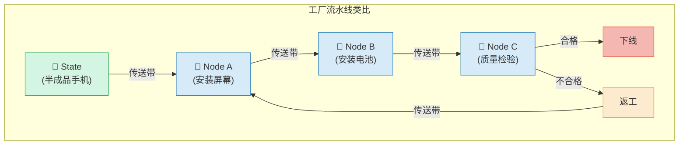
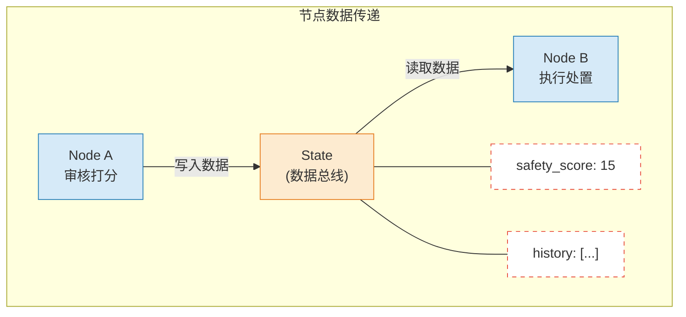
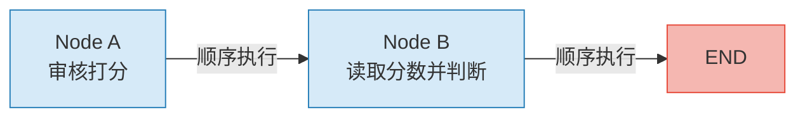
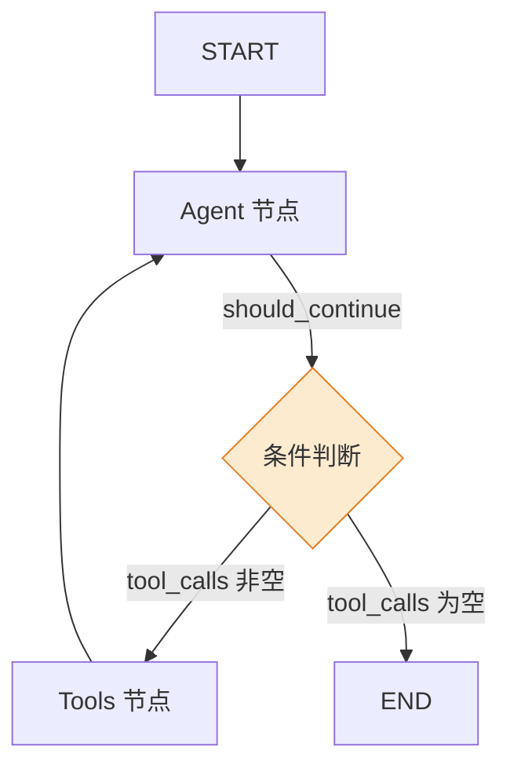
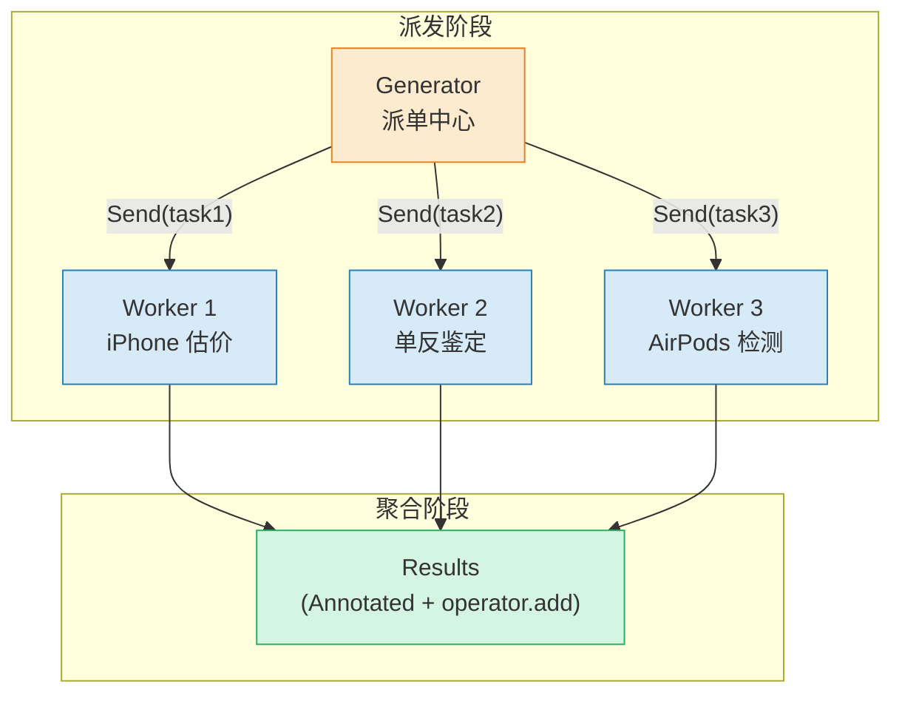
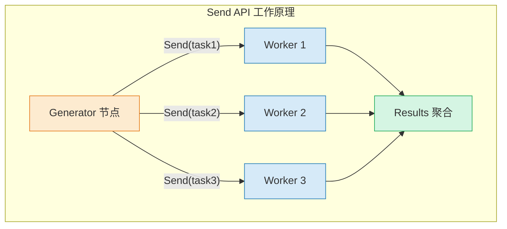
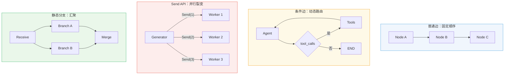
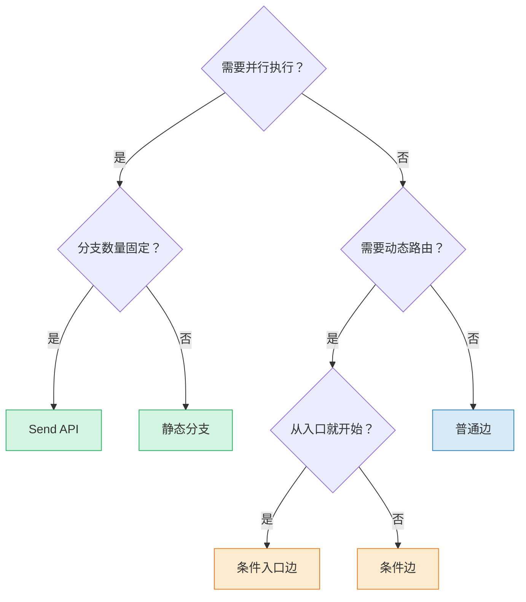

# 状态与节点边

---

## 引言：建立心智模型

在开始之前，用一条**工厂流水线**的类比帮你快速建立心智模型：

想象一条手机组装流水线—**State** 是流水线上传递的半成品手机（所有工人都能看到它的当前状态）**Node** 是每个工位上的工人（执行特定操作并更新手机状态）**Edge** 是传送带（决定半成品从一个工位流向下一个工位）

- **State（状态）**= 流水线上的半成品：每个工人都能读取它的当前状态，完成操作后更新它
- **Node（节点）**= 工位上的工人：接收半成品，执行操作，返回更新后的状态
- **Edge（边）**= 传送带：决定半成品从一个工位流向下一个工位（可以是固定路线，也可以是动态分拣）



理解了这个类比，接下来的内容会非常自然。

---

## 一、State（状态）深度解析

状态是 LangGraph 的基石。节点读取状态、执行逻辑、返回更新。正确理解 State 是构建可靠工作流的第一步。

**核心原则**：State 是节点间通信的**唯一数据总线**。节点之间不直接通信，所有数据交换都通过 State 完成。

### 1.1 使用 TypedDict 定义状态

`TypedDict` 是定义 State 最常用的方式。它轻量、无依赖，且与 Python 类型检查工具完美兼容。

```python
from typing_extensions import TypedDict


class AuditState(TypedDict):
    """内容安全审核状态"""
    history: list[str]       # 审核日志历史
    safety_score: int        # 安全评分
```

**为什么选择 TypedDict**

| 优势 | 说明 |
|------|------|
| **轻量无依赖** | 标准库自带，无需额外安装 |
| **类型提示** | 支持 IDE 自动补全和静态检查 |
| **运行时透明** | 底层就是普通字典，调试方便 |
| **LangGraph 原生支持** | 官方推荐的首选方案 |

**字段命名规范**

```python
class AgentState(TypedDict):
    # 好的命名：清晰有语义
    messages: list          # 消息历史
    current_step: str       # 当前执行步骤
    is_complete: bool       # 是否完成

    # 避免的命名：模糊、无意义
    data: list              # 什么数据？
    x: str                  # 代表什么？
    flag: bool              # 什么标志？
```

### 1.2 Reducer（归约器）机制

Reducer 是处理 LangGraph 状态更新的关键。State 中的每个键都可以有自己的 Reducer 函数，定义当多个节点写入同一键时如何合并。

```mermaid
graph LR
    N1[Node A] -->|"返回 &#123;x: 1#125;"| R[Reducer 函数]
    N2[Node B] -->|"返回 &#123;x: 2#125;"| R
    R -->|合并结果| S[(State.x)]

    style R fill:#fdebd0,stroke:#e67e22
```



**Reducer 的核心作用**：当多个节点同时写入同一 State 键时，Reducer 决定如何合并这些值。这在并行执行场景下尤为重要。

#### 默认 Reducer（覆盖模式）

如果未指定 Reducer，后写入的**直接覆盖**前一个：

```python
# 默认行为：直接覆盖
class State(TypedDict):
    foo: int
    bar: list[str]

state = {"foo": 1, "bar": ["hi"]}

# Node A 返回
state.update({"foo": 2})        # {"foo": 2, "bar": ["hi"]}

# Node B 返回
state.update({"bar": ["bye"]})  # {"foo": 2, "bar": ["bye"]}
```

**覆盖模式的典型场景**
- 状态字段是"最终"结果（如 `result`、`answer`）
- 每次更新都是完整替换（如 `status: "running"` → `status: "completed"`）

#### operator.add（追加模式）

对于列表等需要增量累积的字段，使用 `Annotated` 注解指定 Reducer。

```python
import operator
from typing import Annotated, TypedDict


class AuditState(TypedDict):
    # 使用 operator.add 作为 reducer：每次返回的内容追加到列表末尾
    history: Annotated[list[str], operator.add]
    safety_score: int  # 默认覆盖模式
```

多个节点可以安全地向同一个列表追加数据，而不会覆盖彼此：

```python
# Node A 返回
{"history": ["审核员完成打分：15"]}

# Node B 返回（追加非覆盖）
{"history": ["处理员结论：违规，拒绝发布"]}

# 最终 history: ["审核员完成打分：15", "处理员结论：违规，拒绝发布"]
```

**追加模式的典型场景**
- 消息历史（`messages`）：每轮对话追加新消息
- 审计日志（`history`）：记录所有操作轨迹
- 任务结果（`results`）：收集多个并行任务的输出

#### 自定义 Reducer 函数

除了内置 `operator.add`，你还可以编写自定义 Reducer。

```python
import operator
from typing import Annotated, TypedDict


def keep_max(current: int, new: int) -> int:
    """自定义 Reducer：保留最大值"""
    return max(current, new)


def merge_dicts(current: dict, new: dict) -> dict:
    """自定义 Reducer：合并字典（新值覆盖同名键）"""
    return {**current, **new}


class ExperimentState(TypedDict):
    # 使用自定义 Reducer：保留历史最高分
    best_score: Annotated[int, keep_max]
    # 使用 operator.add 追加日志
    logs: Annotated[list[str], operator.add]
    # 默认覆盖
    current_status: str


# 模拟执行
state: ExperimentState = {"best_score": 0, "logs": [], "current_status": "init"}

# Node A: 得分 85
state["best_score"] = keep_max(state["best_score"], 85)  # 85
state["logs"] = state["logs"] + ["Node A: 得分 85"]

# Node B: 得分 92
state["best_score"] = keep_max(state["best_score"], 92)  # 92（保留最大值）
state["logs"] = state["logs"] + ["Node B: 得分 92"]

print(state["best_score"])  # 92
print(state["logs"])        # ['Node A: 得分 85', 'Node B: 得分 92']
```

**内置 Reducer 速查**

| Reducer | 行为 | 适用类型 | 示例 |
|---------|------|----------|------|
| 默认（无 Reducer） | 覆盖 | 所有类型 | `status: str` |
| `operator.add` | 追加 | `list` | `messages: Annotated[list, operator.add]` |
| `keep_max` | 保留最大值 | `int/float` | `best_score: Annotated[int, keep_max]` |
| `merge_dicts` | 合并字典 | `dict` | `metadata: Annotated[dict, merge_dicts]` |

### 1.3 使用 Pydantic BaseModel

当需要**默认值**、**数据验证**、**序列化控制**时，可以使用 Pydantic BaseModel 替代 TypedDict。

```python
from pydantic import BaseModel, Field


class PydanticState(BaseModel):
    """Pydantic 状态模型（支持验证和默认值）"""
    input: str = ""
    output: str = ""
    messages: list = Field(default_factory=list)
    confidence: float = Field(default=0.0, ge=0.0, le=1.0)
```

**TypedDict vs Pydantic BaseModel 对比**

| 维度 | TypedDict | Pydantic BaseModel |
|------|-----------|-------------------|
| **依赖** | 标准库，无额外依赖 | 需要安装 `pydantic` |
| **默认值** | 不支持 | 支持（`Field(default=...)`） |
| **数据验证** | 运行时无校验 | 自动校验类型和约束 |
| **序列化** | 手动处理 | 内置 `.model_dump()` |
| **性能** | 更快（纯字典） | 略慢（有验证开销） |
| **适用场景** | 简单状态、性能敏感 | 需要验证、有默认值 |

**Pydantic 的校验失败处理**

```python
from pydantic import BaseModel, Field, ValidationError


class StrictState(BaseModel):
    """严格校验的状态"""
    name: str = Field(min_length=1, max_length=50)
    age: int = Field(ge=0, le=150)
    score: float = Field(default=0.0, ge=0.0, le=100.0)


# 正常情况
state = StrictState(name="张三", age=25)
print(state)  # name='张三' age=25 score=0.0

# 校验失败
try:
    state = StrictState(name="", age=200)  # 违反约束
except ValidationError as e:
    print(f"校验失败: {e}")
    # 校验失败: 2 validation errors for StrictState
    # name: String should have at least 1 character
    # age: Input should be less than or equal to 150
```

**选型建议**
- **新手入门 / 简单场景**：优先用 `TypedDict`，学习成本低
- **生产环境 / 复杂校验**：使用 `Pydantic BaseModel`，防御编程更安全
- **性能敏感**：`TypedDict` 更轻量，无验证开销

---

## 二、Node（节点）详解

节点是 LangGraph 中的执行单元——本质上就是普通的 Python 函数。

### 2.1 基本节点函数

节点函数**签名规范**

```python
def my_node(state: StateType, config: RunnableConfig = None) -> dict:
    """
    节点函数签名规范

    参数
        state: 当前图的状态（必须是第一个参数）
        config: 可选的运行时配置（第二个参数，可省略）

    返回
        dict: State 的部分更新（只需返回要修改的字段）
    """
    # 1. 从 state 读取数据
    input_data = state["input"]

    # 2. 执行业务逻辑
    result = process(input_data)

    # 3. 返回部分更新（只需返回要修改的字段）
    return {"output": result}
```

**完整示例**

```python
from langgraph.graph import StateGraph, START, END
from typing_extensions import TypedDict


class MyState(TypedDict):
    input: str
    results: str


def my_node(state: MyState) -> dict:
    """节点函数：接收 State，返回部分更新"""
    return {"results": f"Hello, {state['input']}!"}


# 注册节点
builder = StateGraph(MyState)
builder.add_node("greeter", my_node)
builder.add_edge(START, "greeter")
builder.add_edge("greeter", END)
```

**关键规则**
1. **第一个参数必须是 State**：LangGraph 会自动传入当前状态
2. **返回值必须是 dict**：包含要更新的 State 字段
3. **只需返回要修改的字段**：不需要返回完整的 State
4. **不要修改原始 State**：返回新值，不要直接修改 `state["key"]`

### 2.2 特殊节点：START 和 END

| 节点 | 作用 | 用法 |
|------|------|------|
| `START` | 代表用户输入入口 | `add_edge(START, "first_node")` |
| `END` | 代表终止节点 | `add_edge("last_node", END)` |

```python
from langgraph.graph import START, END

graph.add_edge(START, "entry_node")  # 从 START 出发
graph.add_edge("final_node", END)    # 到达 END 终止
```

**为什么必须声明入口点**

LangGraph 要求显式声明入口点，而不是隐式推断，原因有三：
1. **明确**：代码即文档，一眼看出执行从哪里开始
2. **多入口支持**：可以使用 `add_conditional_edges(START, ...)` 实现多入口
3. **调试友好**：出错时能快速定位执行起点

### 2.3 数据在节点间传递

节点 A 写入的字段，节点 B 可以直接从 State 中读取。这是 LangGraph 节点间通信的核心模式：



> **关键**：Node A 写入 `safety_score` 和 `history` 到 State，Node B 从 State 读取这些字段。State 是节点间通信的唯一桥梁。

**多节点串联传递示例**

```python
import operator
from typing import Annotated, TypedDict
from langgraph.graph import StateGraph, START, END


class PipelineState(TypedDict):
    """流水线状态"""
    raw_text: str                # 原始输入
    cleaned_text: str            # 清洗后文本
    keywords: Annotated[list[str], operator.add]  # 提取的关键词（追加模式）
    summary: str                 # 最终摘要


def clean_node(state: PipelineState) -> dict:
    """节点 A：文本清洗"""
    raw = state["raw_text"]
    cleaned = raw.strip().lower()
    return {"cleaned_text": cleaned}


def extract_node(state: PipelineState) -> dict:
    """节点 B：关键词提取"""
    text = state["cleaned_text"]
    keywords = [w for w in text.split() if len(w) > 3]
    return {"keywords": keywords}


def summarize_node(state: PipelineState) -> dict:
    """节点 C：生成摘要"""
    keywords = state.get("keywords", [])
    summary = f"文本包含 {len(keywords)} 个关键词: {', '.join(keywords[:3])}..."
    return {"summary": summary}


# 构建流水线
builder = StateGraph(PipelineState)
builder.add_node("clean", clean_node)
builder.add_node("extract", extract_node)
builder.add_node("summarize", summarize_node)

builder.add_edge(START, "clean")
builder.add_edge("clean", "extract")
builder.add_edge("extract", "summarize")
builder.add_edge("summarize", END)

pipeline = builder.compile()

# 执行
result = pipeline.invoke({
    "raw_text": "  LangGraph is a library for building stateful multi-agent applications  ",
    "cleaned_text": "",
    "keywords": [],
    "summary": ""
})
print(result["summary"])  # 文本包含 4 个关键词: langgraph, library, building, stateful...
```

### 2.4 异步节点

对于 I/O 密集型操作（如调用 LLM 或查询数据库），使用 `async` 节点可以显著提升性能。

```python
import asyncio
from langchain_openai import ChatOpenAI
from langchain_core.messages import HumanMessage


async def llm_node(state: MyState) -> dict:
    """异步节点：调用 LLM"""
    llm = ChatOpenAI(model="gpt-4o")
    response = await llm.ainvoke([HumanMessage(content=state["input"])])
    return {"output": response.content}


async def db_node(state: MyState) -> dict:
    """异步节点：查询数据库"""
    # 模拟异步数据库查询
    await asyncio.sleep(0.1)
    return {"output": f"DB result for: {state['input']}"}
```

**异步执行方式**

```python
# 方式 1：ainvoke（异步执行，等待结果）
result = await app.ainvoke({"input": "hello"})

# 方式 2：astream（异步流式输出）
async for event in app.astream({"input": "hello"}):
    print(event)
```

**同步 vs 异步选择指南**

| 场景 | 推荐方式 | 原因 |
|------|----------|------|
| CPU 密集型计算 | 同步 | 异步无优势，反有开销 |
| LLM API 调用 | 异步 | I/O 等待时间长，异步可并行 |
| 数据库查询 | 异步 | I/O 等待，可并行其他任务 |
| 文件读写 | 异步 | I/O 等待，避免阻塞 |
| 简单逻辑 | 同步 | 代码更简洁，调试更方便 |

---

## 三、Edge（边）详解

边定义了图的执行流向。LangGraph 提供四种边模式，覆盖从简单流水线到复杂条件路由的全场景。

### 3.1 普通边 — 单线流水线

普通边建立固定的节点执行顺序：A 完成后必然执行 B。

```python
builder.add_edge("node_a", "node_b")
```



**完整案例：内容安全审核流水线**

```python
import operator
from typing import Annotated, TypedDict
from langgraph.graph import StateGraph, START, END


class AuditState(TypedDict):
    history: Annotated[list[str], operator.add]
    safety_score: int


def node_a(state: AuditState) -> dict:
    """节点 A：AI 内容安全审核"""
    score = 15  # 模拟打分
    return {"history": [f"审核员完成打分：{score}"], "safety_score": score}


def node_b(state: AuditState) -> dict:
    """节点 B：根据审核结果做处置"""
    if state.get("safety_score", 0) >= 80:
        conclusion = "合规，准予发布"
    else:
        conclusion = "违规，拒绝发布"
    return {"history": [f"处理员结论：{conclusion}"]}


builder = StateGraph(AuditState)
builder.add_node("node_a", node_a)
builder.add_node("node_b", node_b)
builder.add_edge(START, "node_a")
builder.add_edge("node_a", "node_b")
builder.add_edge("node_b", END)

audit_app = builder.compile()

result = audit_app.invoke({
    "history": ["用户提交：测试评价"],
    "safety_score": 0
})
print(result["history"])
# 输出: ['用户提交：测试评价', '审核员完成打分：15', '处理员结论：违规，拒绝发布']
```

### 3.2 条件边 — Agent 的循环

条件边根据 State 的当前状态动态决定下一个节点，这是实现 ReAct 循环的核心机制。



```python
from typing import Literal


def routing_func(state: MyState) -> Literal["tools", "__end__"]:
    """路由函数：根据状态决定下一个节点"""
    if state["messages"][-1].tool_calls:
        return "tools"
    return "__end__"


# 条件边：返回值直接匹配节点名
workflow.add_conditional_edges("agent", routing_func)
```

也可以提供映射字典，将返回值显式映射到节点名：

```python
workflow.add_conditional_edges(
    "agent",
    routing_func,
    {"tools": "execute_tools", "__end__": END}
)
```

**路由函数设计原则**

路由函数是条件边的核心，设计时应遵循以下原则：

1. **纯函数**：不要在路由函数中修改 State 或产生副作用
2. **返回值类型一致**：所有分支必须返回相同的类型（通常是字符串）
3. **覆盖所有分支**：确保所有可能的 State 值都有对应的返回
4. **逻辑简单**：路由函数应该只做判断，不执行复杂业务逻辑

```python
# 好的路由函数：纯函数、逻辑清晰
def good_router(state: MyState) -> Literal["next", "end"]:
    if state.get("is_complete"):
        return "end"
    return "next"

# 不好的路由函数：有副作用、逻辑复杂
def bad_router(state: MyState) -> str:
    state["counter"] = state.get("counter", 0) + 1  # 修改 State
    if complex_calculation(state):  # 执行了复杂逻辑
        return "next"
    return "end"
```

**多级条件分支示例**

```python
from typing import Literal


class TaskState(TypedDict):
    task_type: str
    priority: str
    result: str


def classify_task(state: TaskState) -> Literal["urgent", "normal", "low"]:
    """根据任务类型和优先级分类"""
    if state["priority"] == "high":
        return "urgent"
    elif state["task_type"] == "bug":
        return "normal"
    else:
        return "low"


def urgent_handler(state: TaskState) -> dict:
    return {"result": "紧急处理：立即通知相关人员"}


def normal_handler(state: TaskState) -> dict:
    return {"result": "普通处理：加入待办队列"}


def low_handler(state: TaskState) -> dict:
    return {"result": "低优先级：批量处理"}


# 构建
builder = StateGraph(TaskState)
builder.add_node("urgent", urgent_handler)
builder.add_node("normal", normal_handler)
builder.add_node("low", low_handler)

# 多级条件路由
builder.add_conditional_edges(START, classify_task)
builder.add_edge("urgent", END)
builder.add_edge("normal", END)
builder.add_edge("low", END)

app = builder.compile()

# 测试
print(app.invoke({"task_type": "bug", "priority": "high", "result": ""})["result"])
# 输出: 紧急处理：立即通知相关人员
```

**完整案例：二手鉴定循环流程**

```python
import operator
from typing import Annotated, TypedDict, Literal
from langgraph.graph import StateGraph, START, END


class AppraiseState(TypedDict):
    process_log: Annotated[list[str], operator.add]


def inspect_node(state: AppraiseState) -> dict:
    """鉴定节点：分析商品成色"""
    attempt = len(state.get("process_log", [])) // 2 + 1
    return {"process_log": [f"{attempt} 次分析商品成色"]}


def search_node(state: AppraiseState) -> dict:
    """搜索节点：查询同款折损率补充信息"""
    return {"process_log": ["搜索同款二手折损率"]}


def check_confidence(state: AppraiseState) -> Literal["Search", "__end__"]:
    """路由：根据日志长度判断是否还需继续"""
    return "__end__" if len(state["process_log"]) >= 5 else "Search"


builder = StateGraph(AppraiseState)
builder.add_node("Inspector", inspect_node)
builder.add_node("Search", search_node)

builder.add_edge(START, "Inspector")
builder.add_conditional_edges("Inspector", check_confidence)
builder.add_edge("Search", "Inspector")  # 循环回鉴定节点

loop_app = builder.compile()

result = loop_app.invoke({"process_log": ["开始鉴定流程"]})
for log in result["process_log"]:
    print(log)
```

### 3.3 条件入口

根据自定义逻辑**从不同的节点开始执行**。

```python
def routing_start(state: MyState) -> Literal["route_a", "route_b"]:
    if state.get("brand", "").lower() in ["iphone", "苹果"]:
        return "route_a"
    return "route_b"

builder.add_conditional_edges(START, routing_start)
```

**完整案例：品牌分拣路由**

```python
import operator
from typing import Annotated, TypedDict, Literal
from langgraph.graph import StateGraph, START, END


class RouteState(TypedDict):
    brand: str
    report: Annotated[list[str], operator.add]


def receive_node(state: RouteState) -> dict:
    return {"report": [f"收到 {state['brand']}，准备分拣"]}


def apple_expert(state: RouteState) -> dict:
    return {"report": ["苹果质检：电池健康度95%，面容正常"]}


def android_expert(state: RouteState) -> dict:
    return {"report": ["安卓质检：未解BL锁，屏幕无烧屏"]}


def route_expert(state: RouteState) -> Literal["Apple", "Android"]:
    brand = state["brand"].lower()
    return "Apple" if "iphone" in brand or "苹果" in brand else "Android"


builder = StateGraph(RouteState)
builder.add_node("Receive", receive_node)
builder.add_node("Apple", apple_expert)
builder.add_node("Android", android_expert)

builder.add_edge(START, "Receive")
builder.add_conditional_edges("Receive", route_expert)
builder.add_edge("Apple", END)
builder.add_edge("Android", END)

route_app = builder.compile()

# 测试苹果路线
print(route_app.invoke({"brand": "iPhone 17", "report": []})["report"])
# 测试安卓路线
print(route_app.invoke({"brand": "华为 Mate 80", "report": []})["report"])
```

### 3.4 并行分发 — Send API

`Send` API 允许一个节点动态裂变出多个并行子任务，适用于 Map-Reduce 模式。

```python
from langgraph.types import Send


def continue_to_workers(state: MRState):
    """根据任务列表自动生成并行分发"""
    return [Send("worker", {"task": t}) for t in state["tasks"]]


# 条件边中传入 Send 列表
builder.add_conditional_edges("generator", continue_to_workers, ["worker"])
```



**Send 的工作原理**



**关键点**
- `Send("node_name", {"key": value})` 创建一个指向指定节点的"虚拟边"
- 每个 Send 独立执行，互不干扰
- 通过 `Annotated[list, operator.add]` 聚合所有 Worker 的结果

**完整案例：二手估价 Map-Reduce**

```python
import time
import operator
from typing import Annotated, TypedDict
from langgraph.graph import StateGraph, START, END
from langgraph.types import Send


class MRState(TypedDict):
    tasks: list[str]
    results: Annotated[list[str], operator.add]


def generator_node(state: MRState) -> dict:
    print(f"派发 {len(state['tasks'])} 个估价任务")
    return {}


def continue_to_workers(state: MRState):
    """裂变：每个 task 生成一个 Send"""
    return [Send("worker", {"task": t}) for t in state["tasks"]]


def worker_node(state: dict) -> dict:
    task = state["task"]
    time.sleep(2)  # 模拟耗时
    return {"results": [f"{task}(鉴定完毕)"]}


builder = StateGraph(MRState)
builder.add_node("generator", generator_node)
builder.add_node("worker", worker_node)
builder.add_edge(START, "generator")
builder.add_conditional_edges("generator", continue_to_workers, ["worker"])
builder.add_edge("worker", END)

map_app = builder.compile()

result = map_app.invoke({
    "tasks": ["iPhone 估价", "单反鉴定", "AirPods 检测"],
    "results": []
})
print(result["results"])  # 3 个任务并行执行
```

### 3.5 静态分支与聚合

当并行分支在编译时就已确定（而非动态生成），可以使用静态分支：

```python
# 接收节点同时走向两条分支
builder.add_edge("Receive", "Visual_Inspection")
builder.add_edge("Receive", "Market_Research")

# 只有两条分支都完成后，才进入汇聚节点
builder.add_edge(["Visual_Inspection", "Market_Research"], "Final_Valuation")
```

---

## 四、四种边模式对比

| 模式 | 适用场景 | 核心方法 | 执行特征 |
|------|----------|---------|----------|
| **普通边** | 固定顺序流水线 | `add_edge()` | 严格串行 |
| **条件边** | Agent 推理循环 | `add_conditional_edges()` | 动态路由 |
| **条件入口边** | 多角色入口选择 | `add_conditional_edges(START, ...)` | 首次路由 |
| **Send API** | 并行 Map-Reduce | `Send("node", {"key": val})` | 并行裂变 |



**选型决策**



---

## 总结

- **State** 是节点间通信的数据总线；`Annotated[type, reducer]` 控制更新合并策略
- **Node** 是同步或异步的 Python 函数，接收 State 返回部分更新
- **Edge** 控制执行流向：`add_edge`（固定）、`add_conditional_edges`（动态）、`Send`（并行）
- **START/END** 是图的入口与终止标记，不能省略

**常见陷阱**

| 陷阱 | 说明 | 解决方案 |
|------|------|----------|
| **忘记 Reducer** | 列表字段被覆盖而非追加 | 使用 `Annotated[list, operator.add]` |
| **路由函数有副作用** | 修改 State 导致不可预测行为 | 路由函数只做判断，不修改 State |
| **节点返回完整 State** | 浪费性能，容易出错 | 只返回要修改的字段 |
| **缺少 END 节点** | 图无法正常终止 | 确保所有路径都通向 END |

## 全套公开课课件领取：


---
## DXZY.AI
DXZY.AI - 专注于 AI、RAG、Agent、MCP


- GitHub: https://github.com/dxzyai/agent-dev-guide
- 官网: https://dxzy.ai

