# 多 Agent 协作系统


> **核心议题**：使用 LangGraph 构建多 Agent 分工协作系统——Researcher 收集数据，Chart Generator 生成图表
> **设计模式**：分而治之，每个 Agent 专注一个领域，通过图结构协调任务路由
> **适用场景**：数据采集与可视化报告生成、多步推理链、复杂业务流程自动化

---

## 一、为什么需要多 Agent 架构

### 1.1 单个 Agent 的局限

单个 Agent 在工具数量较少时可以高效运行，但面对复杂任务时，单个 Agent 会遇到以下瓶颈：

| 问题 | 表现 | 根因 |
|------|------|------|
| **上下文污染** | 大量工具描述挤占提示词空间，干扰推理 | 所有工具共享同一个上下文窗口 |
| **工具选择困难** | 工具超过 10 个时，LLM 选择正确工具的概率显著下降 | 选择空间指数增长 |
| **职责耦合** | 一个系统提示既要搜索又要绘图，角色模糊 | 混合职责导致行为不可预测 |
| **错误传播** | 中间步骤出错，后续步骤无法感知并修正 | 缺乏检查点和反馈机制 |

### 1.2 多 Agent 分治策略

**多 Agent 系统**将复杂任务拆解为多个专业化的子任务，每个 Agent 只负责一个领域：

- 每个 Agent 只拥有完成其职责所需的最小工具集
- Agent 之间通过图结构（Graph）进行确定的任务传递
- 共享状态（Shared State）保证信息在 Agent 间无损流转
- 显式的终止协议防止 Agent 间无限循环

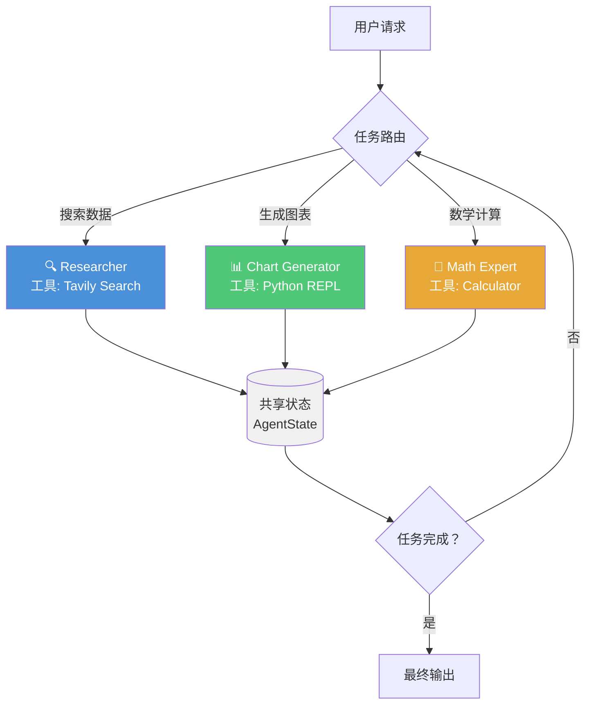

### 1.3 Agent 拓扑模式对比

在 LangGraph 中，Agent 系统有多种拓扑结构，可选择哪种取决于任务特性：

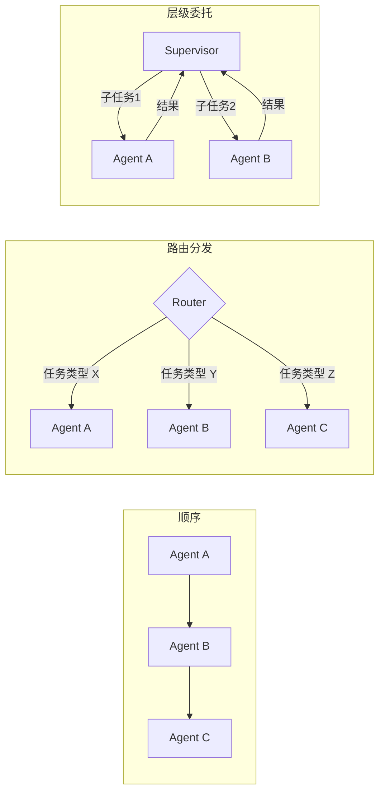

| 模式 | 适用场景 | 优点 | 缺点 |
|------|----------|------|------|
| **顺序** | 流水线式处理（如：搜索 → 分析 → 报告） | 简单可控 | 不灵活，无法回溯 |
| **路由分发** | 任务类型明确，各分支独立 | 并行效率高 | 路由逻辑需要精心设计 |
| **层级委托** | 复杂任务需要动态分配 | 灵活，支持归纳 | 实现复杂度高 |

本文实现的 **Research + Chart** 系统采用**路由分发**模式，由每个 Agent 的输出动态决定下一个执行者

---

## 二、系统设计：Research + Chart 协作

### 2.1 Agent 职责定义

| Agent | 职责 | 工具 | 输出 |
|-------|------|------|------|
| **Researcher（研究员）** | 搜索网络获取原始数据 | Tavily Search | 结构化数据 + 文字描述 |
| **Chart Generator（图表生成器）** | 将数据转化为可视化图表 | Python REPL | 图表文件 + FINAL ANSWER |

### 2.2 端到端工作流

下图展示了用户发出请求后，系统内部的完整状态流转：

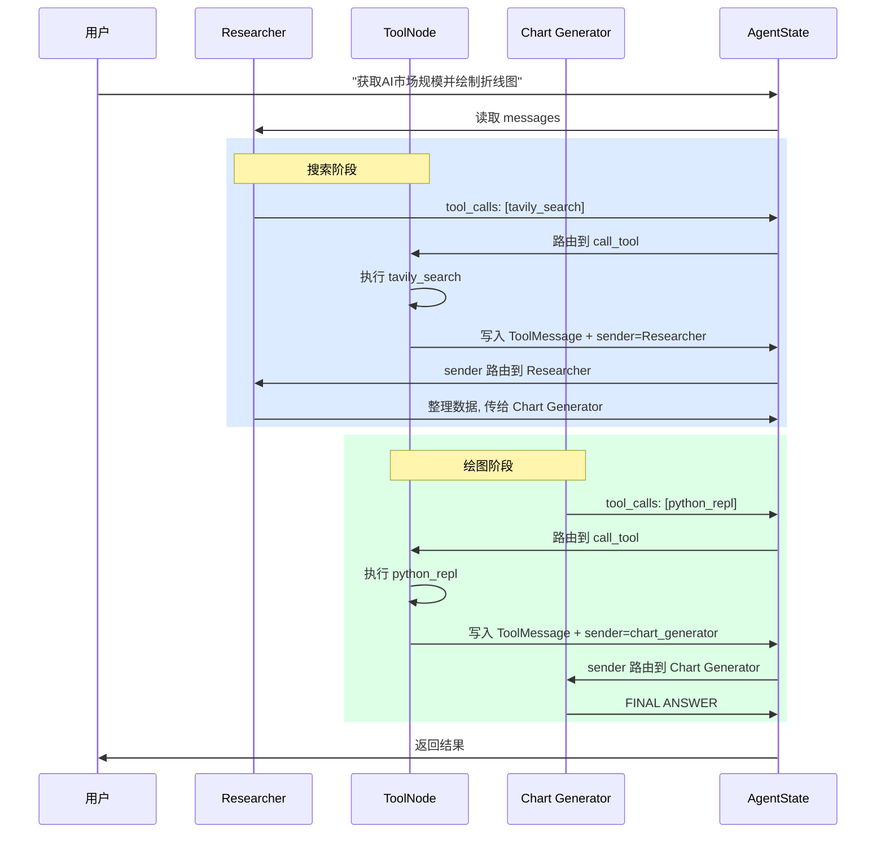

### 2.3 完整实现

以下是基于 LangGraph 最新 API 的完整实现代码，包含详细的中文注释，标注了每个设计决策的原因

```python
import operator
import functools
from typing import Annotated, Sequence, TypedDict, Literal

from langchain_core.messages import BaseMessage, HumanMessage, AIMessage, ToolMessage
from langchain_core.prompts import ChatPromptTemplate, MessagesPlaceholder
from langchain_core.tools import tool
from langchain_openai import ChatOpenAI
from langchain_community.tools.tavily_search import TavilySearchResults
from langchain_experimental.utilities import PythonREPL
from langgraph.graph import END, StateGraph, START
from langgraph.prebuilt import ToolNode


# ==========================================
# 1. 定义共享状态（Shared State）
# ==========================================

class AgentState(TypedDict):
    """Agent 共享状态

    所有 Agent 节点读写同一份状态，这是信息在 Agent 间流转的唯一通道
    - messages: 使用 operator.add reducer，新消息自动追加而非覆盖
    - sender: 记录最后写入消息的 Agent 名称，用于工具执行后的路由
    """
    messages: Annotated[Sequence[BaseMessage], operator.add]
    sender: str


# ==========================================
# 2. 定义工具
# ==========================================

# 搜索引擎：限制返回结果数以控制上下文长度
tavily_tool = TavilySearchResults(max_results=5)

# Python 执行环境
# ⚠️ 注意：未沙箱化的代码执行存在安全风险，生产环境请使用 Docker 沙箱
repl = PythonREPL()


@tool
def python_repl(code: str) -> str:
    """执行 Python 代码以生成图表或处理数据。需使用 print() 输出结果"""
    try:
        result = repl.run(code)
    except BaseException as e:
        return f"执行失败: {repr(e)}"
    return (
        f"成功执行:\n```python\n{code}\n```\nStdout: {result}"
        "\n\n如果已完成所有任务，请回复 FINAL ANSWER"
    )


tools = [tavily_tool, python_repl]
tool_node = ToolNode(tools)


# ==========================================
# 3. Agent 工厂函数
# ==========================================

def create_agent(llm, tools_list, system_message: str):
    """创建专用 Agent 的工厂函数

    设计要点：
    1. 系统提示中声明协作协议（FINAL ANSWER）
    2. 自动注入工具名，让 Agent 知道自己能用什么
    3. 使用 MessagesPlaceholder 接收历史对话
    """
    prompt = ChatPromptTemplate.from_messages([
        (
            "system",
            "你是一个有帮助的 AI 助手，与其他助手协作完成任务。"
            "使用提供的工具推进问题解答。"
            "如果你不能完全回答，没关系，另一个拥有不同工具的助手会接手处理。"
            "如果你或其他助手得到了最终答案或交付物，"
            "请在回答前加上 FINAL ANSWER，以便团队知道停止。"
            "你可以使用以下工具：{tool_names}。\n{system_message}",
        ),
        MessagesPlaceholder(variable_name="messages"),
    ])
    prompt = prompt.partial(system_message=system_message)
    prompt = prompt.partial(tool_names=", ".join([t.name for t in tools_list]))
    return prompt | llm.bind_tools(tools_list)


# ==========================================
# 4. 创建 Agent 节点
# ==========================================

llm = ChatOpenAI(model="gpt-4o", temperature=0)


def agent_node(state, agent, name):
    """Agent 封装为图节点

    关键逻辑：如果 Agent 返回的是 ToolMessage（工具调用结果）
    直接透传；否则将 AIMessage 重命名为 Agent 的标识符
    这样后续路由才能识别消息来源
    """
    result = agent.invoke(state)
    if not isinstance(result, ToolMessage):
        result = AIMessage(**result.model_dump(exclude={"type", "name"}), name=name)
    return {"messages": [result], "sender": name}


# 研究 Agent：专注于数据搜索与整理
research_agent = create_agent(
    llm,
    [tavily_tool],
    system_message="你应该提供准确的数据给 chart_generator 使用。搜索结果需要包含具体数字。"
)
research_node = functools.partial(agent_node, agent=research_agent, name="Researcher")

# 图表生成 Agent：专注于数据可视化
chart_agent = create_agent(
    llm,
    [python_repl],
    system_message="你展示的任何图表都将对用户可见，使用 matplotlib 绘制专业图表。"
)
chart_node = functools.partial(agent_node, agent=chart_agent, name="chart_generator")


# ==========================================
# 5. 定义路由逻辑
# ==========================================

def router(state) -> Literal["call_tool", "__end__", "continue"]:
    """路由函数：根据 Agent 最新输出决定下一步去向

    路由优先级：
    1. tool_calls → 先执行工具
    2. 包含 FINAL ANSWER → 任务完成，结束图
    3. 否则 → 交给下一个 Agent 继续处理
    """
    messages = state["messages"]
    last_message = messages[-1]

    if last_message.tool_calls:
        return "call_tool"
    if "FINAL ANSWER" in last_message.content:
        return "__end__"
    return "continue"


# ==========================================
# 6. 构建图（Graph Construction）
# ==========================================

workflow = StateGraph(AgentState)

# 添加节点
workflow.add_node("Researcher", research_node)
workflow.add_node("chart_generator", chart_node)
workflow.add_node("call_tool", tool_node)

# Researcher 的条件路由：
# - 有工具调用 → call_tool
# - 输出 FINAL ANSWER → 结束
# - 否则 → 交给 chart_generator
workflow.add_conditional_edges(
    "Researcher",
    router,
    {"continue": "chart_generator", "call_tool": "call_tool", "__end__": END},
)

# Chart Generator 的条件路由：
# - 有工具调用 → call_tool
# - 输出 FINAL ANSWER → 结束
# - 否则 → 交回 Researcher（可能需要补充数据）
workflow.add_conditional_edges(
    "chart_generator",
    router,
    {"continue": "Researcher", "call_tool": "call_tool", "__end__": END},
)

# 工具节点的路由：根据 sender 字段将结果返回给调用它的 Agent
# 这是实现"工具结果回到正确 Agent"的核心机制
workflow.add_conditional_edges(
    "call_tool",
    lambda x: x["sender"],
    {"Researcher": "Researcher", "chart_generator": "chart_generator"},
)

# 图的入口
workflow.add_edge(START, "Researcher")
graph = workflow.compile()
```

### 2.4 图的拓扑结构

编译后的图包含以下节点和边，完整的控制流如下：

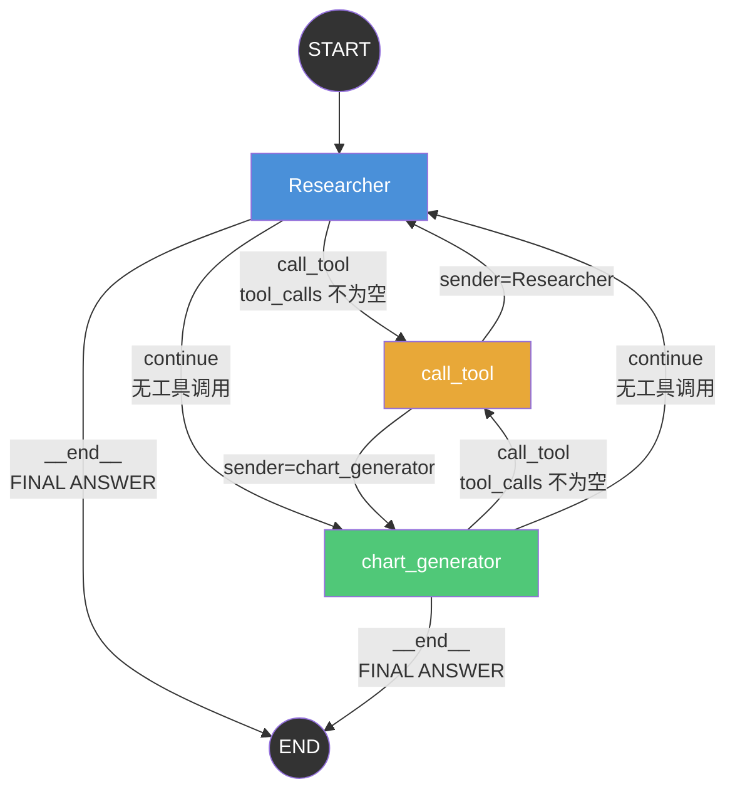

### 2.5 执行与调试

```python
# 执行任务
events = graph.stream(
    {
        "messages": [
            HumanMessage(
                content="获取过去5年AI软件市场规模数据，然后绘制一条折线图。完成后请回复 FINAL ANSWER"
            )
        ],
    },
    {"recursion_limit": 150},
)

# 流式输出每个步骤的状态变化
for event in events:
    for node_name, node_output in event.items():
        if node_name != "__end__":
            print(f"[{node_name}]:")
            if "messages" in node_output:
                for msg in node_output["messages"]:
                    print(f"  {type(msg).__name__}: {msg.content[:200]}...")
            print()
```

执行时，系统内部发生以下流转过程：

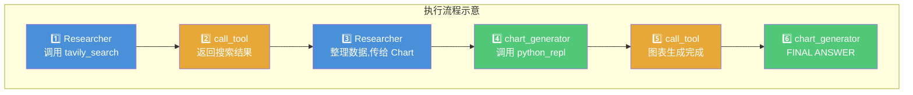

---

## 三、关键设计模式详解

### 3.1 Sender 路由机制

`AgentState` 中的 `sender` 字段是实现"工具执行后回到正确的 Agent"的关键。没有它，工具节点不知道应该将结果返回给谁

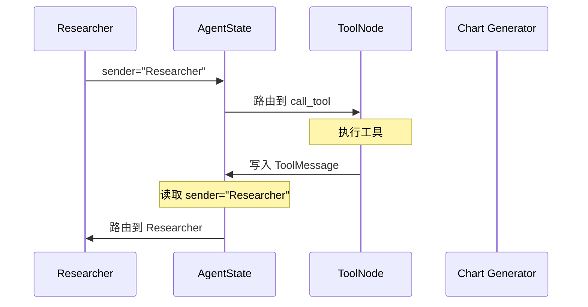

核心代码片段：

```python
# Agent 节点写入 sender 标识
return {"messages": [result], "sender": name}

# 工具节点根据 sender 路由回正确的 Agent
workflow.add_conditional_edges(
    "call_tool",
    lambda x: x["sender"],         # 读取调用工具的 Agent 名字
    {"Researcher": "Researcher", "chart_generator": "chart_generator"},
)
```

### 3.2 FINAL ANSWER 终止协议

Agent 之间通过 `FINAL ANSWER` 标记来协调任务完成。这是一个简单的文本协议，但它是防止 Agent 间无限循环的关键安全阀

```python
def router(state):
    last_message = state["messages"][-1]
    # ...
    if "FINAL ANSWER" in last_message.content:
        return "__end__"  # 任意 Agent 标记完成后，整个图停止
```

**为什么不用更复杂的终止检测？** 因为 FINAL ANSWER 是一个显式的、由 LLM 主动发出的信号。相比隐式检测（没有工具调用就结束），它更可靠——Agent 可能在没有工具调用时仍需将结果传递给下一个 Agent

### 3.3 Agent 工厂模式

`create_agent` 工厂函数实现 Agent 的标准化创建，将"系统提示 + 工具绑定 + 模型调用"封装为一个可复用的构建单元：

```python
research_agent = create_agent(llm, [tavily_tool], system_message="...")
chart_agent = create_agent(llm, [python_repl], system_message="...")
```

工厂模式的优势：
- **一致**：所有 Agent 共享相同的协作协议（FINAL ANSWER）
- **可维护**：修改系统提示模板只需要改一处
- **可扩展**：新 Agent 只需一行调用

### 3.4 条件边与状态 Reducer

LangGraph `AgentState` 使用 `Annotated[Sequence[BaseMessage], operator.add]` 定义 `messages` 字段。这里的 `operator.add` 是一个 **reducer 函数**：

- 每个节点返回 `{"messages": [new_msg]}` 时，新消息会**追加**到现有列表
- 如果不使用 reducer，节点的返回值会**覆盖**整个 messages 列表

这是 LangGraph 状态管理的核心机制——它保证了所有 Agent 的对话历史被完整保留

---

## 四、现代范式：Supervisor 多 Agent 系统

上面的实现采用"对等协作"模式——Agent 之间直接传递任务。在更复杂的场景中，可以引入 **Supervisor（监督者）** 节点作为中央调度器

### 4.1 架构对比

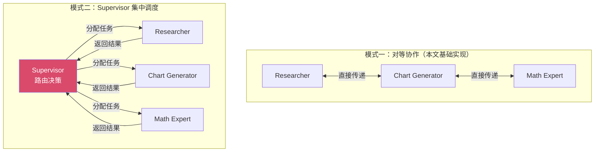

### 4.2 Supervisor 实现

Supervisor 模式下，每个 Agent 不再需要知道下一个 Agent 是谁——这个决策完全由 Supervisor 统一做出

```python
from typing import Annotated, Sequence, TypedDict, Literal
from langchain_core.messages import BaseMessage, HumanMessage, AIMessage
from langchain_core.prompts import ChatPromptTemplate, MessagesPlaceholder
from langchain_openai import ChatOpenAI
from langgraph.graph import END, StateGraph, START
from langgraph.prebuilt import create_react_agent


# ==========================================
# 1. 定义 Supervisor 的共享状态
# ==========================================

class SupervisorState(TypedDict):
    """Supervisor 模式的共享状态

    与对等协作不同，这里不需要 sender 字段
    因为所有路由决策都由 Supervisor 统一做出
    """
    messages: Annotated[Sequence[BaseMessage], operator.add]
    next_agent: str  # Supervisor 决定的下一个 Agent


# ==========================================
# 2. 创建专业 Agent（使用 create_react_agent）
# ==========================================

# create_react_agent 是 LangGraph 内置的 ReAct Agent 工厂
# 它自动处理"工具调用 → 观察"的循环
research_agent = create_react_agent(
    llm,
    tools=[tavily_tool],
    state_modifier="你是研究专员，负责搜索和整理数据。输出结构化的数据结果。"
)

chart_agent = create_react_agent(
    llm,
    tools=[python_repl],
    state_modifier="你是图表专员，负责将数据可视化，使用 matplotlib 生成专业图表。"
)


# ==========================================
# 3. 定义 Supervisor 路由
# ==========================================

SUPERVISOR_SYSTEM_PROMPT = """你是一个任务调度 Supervisor。
你的团队成员：
- Researcher: 擅长搜索和数据收集
- chart_generator: 擅长数据可视化和图表生成

根据当前任务进度，决定下一步应该由哪个 Agent 执行。
如果任务已经完成，输出 FINISH。

请只返回以下选项之一：Researcher | chart_generator | FINISH
"""

def supervisor_router(state) -> Literal["Researcher", "chart_generator", "__end__"]:
    """Supervisor 根据对话历史决定下一个执行者

    与对等协作的 router 不同，Supervisor 使用 LLM 做路由决策，
    而非基于硬编码规则，这在任务类型不确定时更加灵活
    """
    messages = state["messages"]
    prompt = ChatPromptTemplate.from_messages([
        ("system", SUPERVISOR_SYSTEM_PROMPT),
        MessagesPlaceholder(variable_name="messages"),
    ])
    chain = prompt | llm.with_structured_output(
        # 使用结构化输出确保返回合规
        # 或简单地用字符串匹配
    )
    result = chain.invoke({"messages": messages})
    next_agent = result.content.strip()

    if next_agent == "FINISH":
        return "__end__"
    return next_agent


# ==========================================
# 4. 构建 Supervisor 图
# ==========================================

supervisor_workflow = StateGraph(SupervisorState)

# Supervisor 作为路由节点
supervisor_workflow.add_node("Supervisor", lambda state: state)
supervisor_workflow.add_node("Researcher", research_agent)
supervisor_workflow.add_node("chart_generator", chart_agent)

# Supervisor 的条件路由：决定执行哪个 Agent 或结束
supervisor_workflow.add_conditional_edges(
    "Supervisor",
    supervisor_router,
    {
        "Researcher": "Researcher",
        "chart_generator": "chart_generator",
        "__end__": END,
    },
)

# Agent 执行完后回到 Supervisor
supervisor_workflow.add_edge("Researcher", "Supervisor")
supervisor_workflow.add_edge("chart_generator", "Supervisor")

# 入口
supervisor_workflow.add_edge(START, "Supervisor")
supervisor_graph = supervisor_workflow.compile()
```

Supervisor 模式的执行流程：

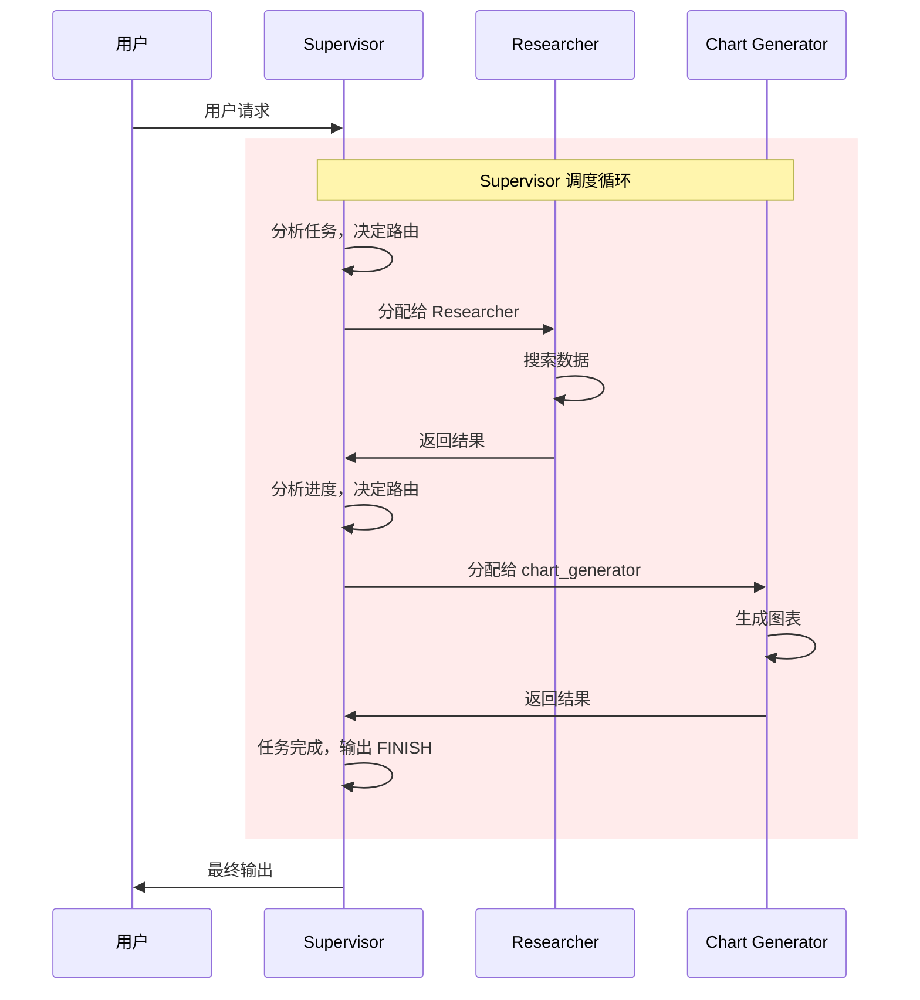

### 4.3 共享状态 vs 隔离状态

在多 Agent 系统中，状态管理是一个关键设计决策：

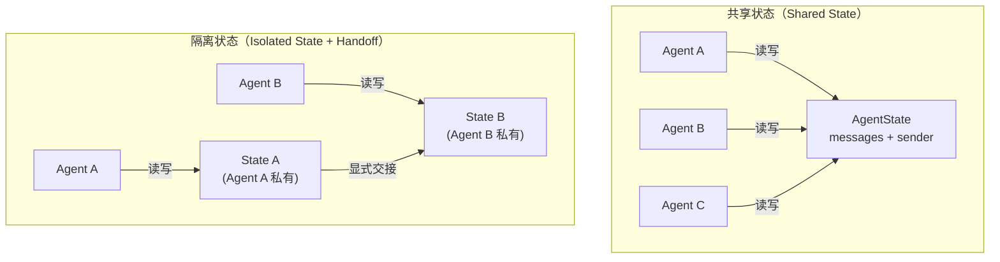

**共享状态**（本文采用的方式）：
- 所有 Agent 读写同一个 `AgentState`
- 优点：实现简单，信息透明
- 缺点：Agent 可能读到不相关的信息，增加上下文噪音

**隔离状态**（高级模式）
- 每个 Agent 有自己的私有状态，通过显式"handoff"传递必要信息
- 优点：上下文干净，安全性更高
- 缺点：需要精心设计交接协议

---

## 五、扩展：添加更多 Agent

Agent 系统的核心优势是可扩展性。添加一个新的 Math Agent 只需四步：

```python
# 1. 定义新工具
@tool
def calculator(expression: str) -> str:
    """执行数学计算，支持基本运算和 math 库函数"""
    import math
    allowed_names = {k: v for k, v in math.__dict__.items() if not k.startswith("_")}
    try:
        result = eval(expression, {"__builtins__": {}}, allowed_names)
        return str(result)
    except Exception as e:
        return f"计算错误: {repr(e)}"

# 2. 创建 Agent
math_agent = create_agent(
    llm,
    [calculator],
    system_message="负责所有数学计算任务，确保计算结果精确。"
)
math_node = functools.partial(agent_node, agent=math_agent, name="MathExpert")

# 3. 添加到图并定义路由
workflow.add_node("MathExpert", math_node)
workflow.add_conditional_edges(
    "MathExpert",
    router,
    {"continue": "Researcher", "call_tool": "call_tool", "__end__": END},
)

# 4. 更新 tool_node 的路由映射（必须更新，否则工具结果无法回到新 Agent）
workflow.add_conditional_edges(
    "call_tool",
    lambda x: x["sender"],
    {
        "Researcher": "Researcher",
        "chart_generator": "chart_generator",
        "MathExpert": "MathExpert",
    },
)
```

扩展后的 Agent 拓扑：

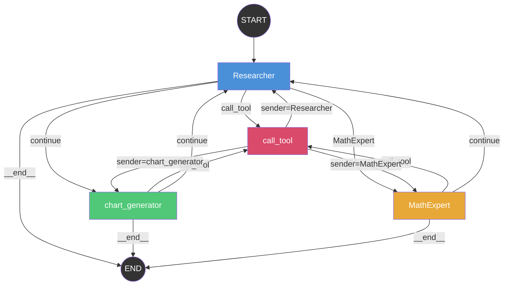

---

## 六、最佳实践

| 准则 | 说明 | 反模式 |
|------|------|--------|
| **单一职责** | 每个 Agent 只拥有完成任务所需的最小工具集 | 给所有 Agent 绑定所有工具 |
| **FINAL ANSWER** | 必须有清晰的终止协议，防止 Agent 间无限循环 | 依赖 LLM 自行判断何时停止 |
| **recursion_limit** | 设置合理的递归深度限制（如 150），防止失控 | 不设限制或设过大的值 |
| **Sender 追踪** | 始终追踪消息发送者，确保工具结果回到正确的 Agent | 假设工具结果总是回到同一 Agent |
| **错误隔离** | 一个 Agent 的失败不应导致整个系统崩溃 | 未捕获异常导致整个图中断 |
| **上下文控制** | 限制工具返回的数据量，避免撑爆上下文窗口 | 搜索工具返回 100 条结果 |
| **结构化输出** | Agent 间的交接数据尽量使用结构化格式 | 依赖 LLM 解析自由文本中的数据 |

---

## 总结

多 Agent 系统通过"分治"的策略，将复杂任务拆解为多个专业 Agent 协作完成。在 LangGraph 中实现多 Agent 协作的关键要素：

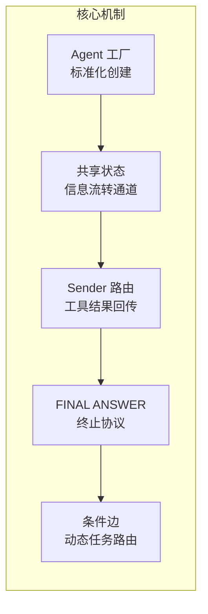

1. **Agent 工厂**：标准化 Agent 创建，保证协作协议一致
2. **共享状态**：`operator.add` reducer 确保消息历史完整累积
3. **Sender 路由**：工具节点根据 `sender` 字段将结果返回正确的 Agent
4. **FINAL ANSWER 协议**：显式的终止信号，防止无限循环
5. **条件边**：基于 Agent 输出动态决定下一个执行节点

在此基础上，可以根据任务复杂度选择**对等协作**或 **Supervisor 集中调度**模式，并通过**共享状态**或**隔离状态**管理 Agent 间的信息流转

## 全套公开课课件领取：


## DXZY.AI

DXZY.AI - 专注于 AI、RAG、Agent、MCP


- GitHub: https://github.com/dxzyai/agent-dev-guide
- 官网: https://dxzy.ai
  
