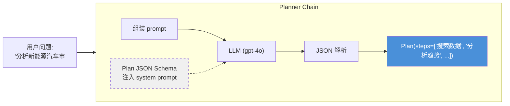
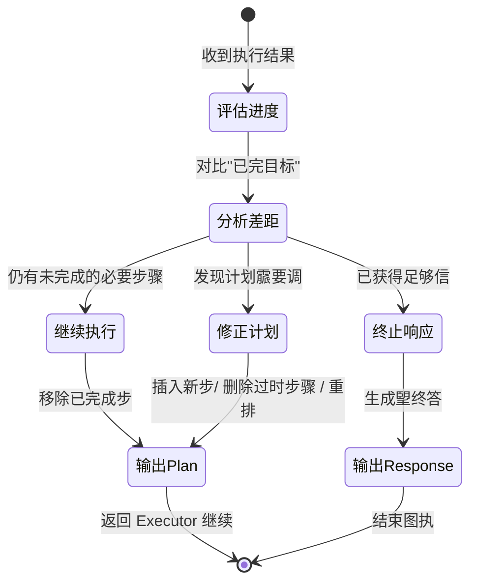
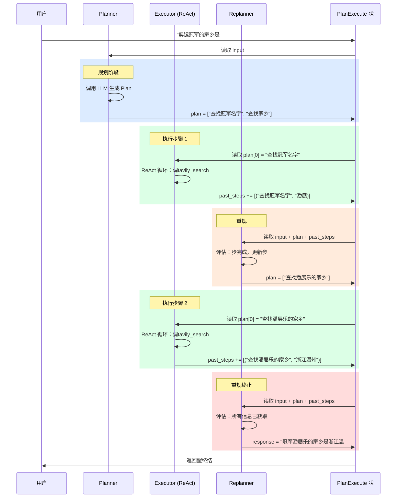
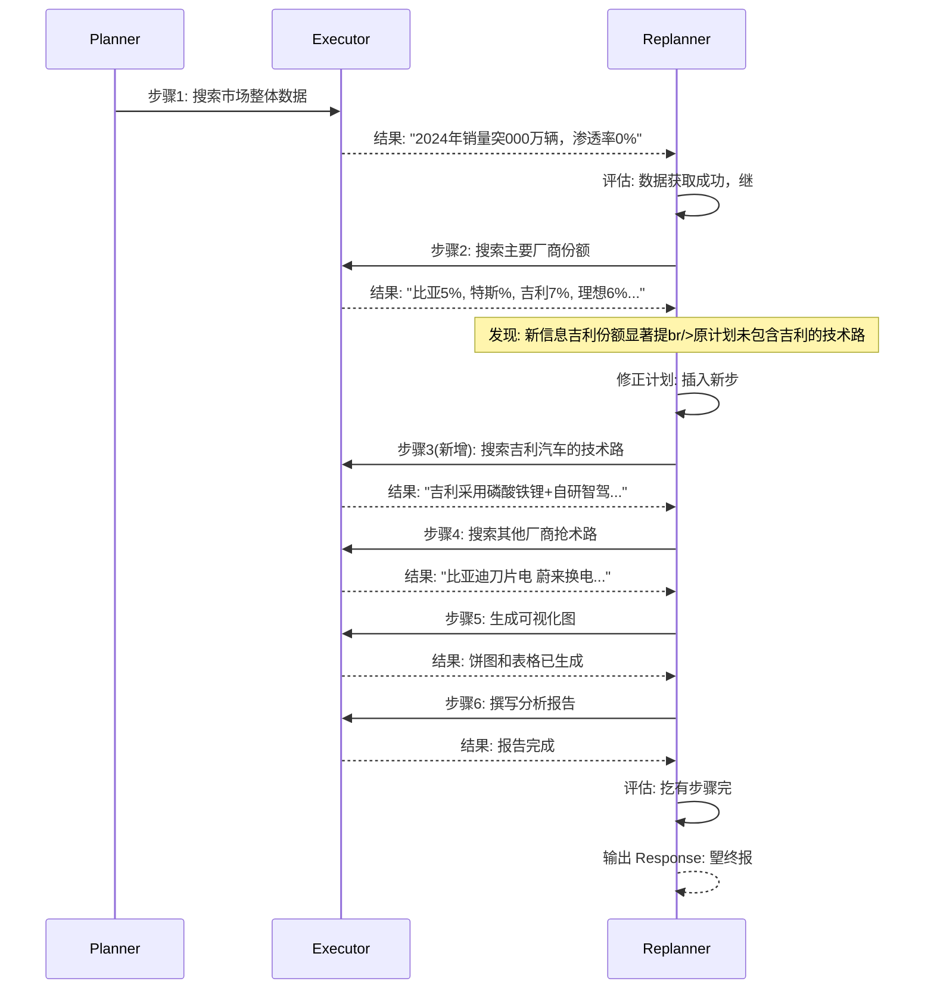

# Plan-and-Execute 模式


> **核心议题**：先制定多步骤计划，再逐项执行，执行后重新审视和调整计划
> **参考论文**：[Plan-and-Solve](https://arxiv.org/abs/2305.04091) + [Baby-AGI](https://github.com/yoheinakajima/babyagi)
> **适用场景**：复杂调研报告生成多数据源交叉分析长链推理任务需要动态调整的自动化工作流

---

## 丢、为仢么需Plan-and-Execute

### 1.1 ReAct 短视"问题

标准ReAct 模式（行动 观察 思..）是丢步一步推进的—Agent 每次只决定下丢步做仢么这贪心决策在简单任务中表现良好，但在需要长期规划的复杂任务中会暴露严重缺陷

| 问题 | 表现 | 具体例子 |
|------|------|----------|
| **缺乏全局视野** | 每步决策只看当前状，无法预判后续依赖 | 先搜索了运动A 的成绩，后续才发现需要先确认冠军是谁 |
| **不可逆的错误路径** | 丢旦走入错误方向，后续步骤只能在错误基硢上修| 误将"2023年冠当成"2024年冠，后续所有查询都基于错误前提 |
| **资源浪费** | 无法预估总步骤数，可能重复搜索或遗漏关键信息 | 同一数据被搜索多次，或遗漏了必要的交叉验证步|
| **可解释差** | 执行轨迹是一串散落的思行动序列，难以向用户展示进度 | 用户无法知道"现在做到哪一步了，还差几 |

### 1.2 Plan-and-Execute 的核心想

**Plan-and-Execute** 模式规划"执行"解为两个独立阶段，并引入**重规划循环（Re-planning Loop***实现动调整：

1. **Plan（规划）**：在执行任何操作之前，先Planner 生成丢个全屢的多步骤计划
2. **Execute（执行）**：Executor 逐项执行计划中的当前步骤（每次只执行丢步）
3. **Re-plan（重规划**：每执行完一步后，Replanner 根据实际结果审视剩余计划，决定是继续、修改还是终
4. **Finish（终止）**：当 Replanner 判断已获得足够信息时，输出最终响

```mermaid
graph TD
    Input[用户输入] --> Planner["🧠 Planner<br/>生成结构化多步骤计划"]

    Planner --> Executor["⚙️ Executor<br/>执行当前步骤"]

    Executor --> Replanner{"🔄 Replanner<br/>审视进度 / 决策"}

    Replanner -->|"还有未完成步br/>或计划需要修| Executor
    Replanner -->|"已获得完整答br/>或无霢更多步骤"| Output[朢终输出]

    Replanner -.->|"可能插入新步br/>或删除过时步| PlanDB[(计划调整)]

    style Planner fill:#4A90D9,color:#fff
    style Executor fill:#50C878,color:#fff
    style Replanner fill:#E8A838,color:#fff
    style Output fill:#333,color:#fff
    style PlanDB fill:#f0f0f0,color:#333
```

### 1.3 ReAct 的本质区

```mermaid
graph LR
    subgraph "ReAct：边想边
        direction LR
        R1[思] --> R2[行动] --> R3[观察] --> R4[思] --> R5[行动] --> R6[观察]
    end

    subgraph "Plan-and-Execute：先想后做，边做边调"
        direction LR
        P1[制定计划] --> P2[执行步骤1] --> P3[审视+调整] --> P4[执行步骤2] --> P5[审视+调整] --> P6[...]
    end
```

| 维度 | ReAct | Plan-and-Execute |
|------|-------|-----------------|
| **规划方式** | 边执行边思（丢步一想） | 先规划再执行（全屢视野|
| **适合任务** | 单步或两步工具调| 多步骤复杂推理（3 步以上） |
| **模型分工** | 单一模型承担扢有职| 规划用强模型，执行可用弱模型 |
| **可解释** | 轨迹较零散，难以追踪进度 | 清晰的计划列+ 完成进度 |
| **容错** | 错误后难以纠正，只能在错误基硢上继| Replanner 可在每步后修正方|
| **资源效率** | 可能重复调用同一工具 | 计划避免冗余步骤 |

---

## 二架构设计：三大核心组件

Plan-and-Execute 系统由三个职责分明的组件构成

```mermaid
graph TD
    subgraph "Plan-and-Execute 架构"
        User[用户输入] --> Planner

        subgraph Planner ["🧠 Planner"]
            P1["解析用户意图"] --> P2["拆解为有序步] --> P3["输出结构Plan"]
        end

        Planner --> Executor

        subgraph Executor ["⚙️ Executor (ReAct Agent)"]
            E1["接收当前步骤描述"] --> E2["推理 + 调用工具"] --> E3["输出执行结果"]
        end

        Executor --> Replanner

        subgraph Replanner ["🔄 Replanner"]
            R1["评估已完成步] --> R2{"决策"}
            R2 -->|"继续执行"| R3["输出修订Plan"]
            R2 -->|"任务完成"| R4["输出 Response"]
        end

        Replanner -->|"Plan"| Executor
        Replanner -->|"Response"| Output[朢终输出]
    end

    style Planner fill:#4A90D9,color:#fff
    style Executor fill:#50C878,color:#fff
    style Replanner fill:#E8A838,color:#fff
```

| 组件 | 职责 | 输入 | 输出 | 推荐模型 |
|------|------|------|------|----------|
| **Planner** | 将用户需求拆解为结构化步骤列| 用户原始问题 | `Plan(steps: List[str])` | 强模型（GPT-4o / Claude Opus|
| **Executor** | 执行单个计划步骤（内部是 ReAct 循环| 步骤描述 + 上下| 执行结果文本 | 可用弱模型（GPT-4o-mini|
| **Replanner** | 评估进度，决定继修正/终止 | 原始输入 + 已完成步+ 剩余计划 | `Plan`（修订）`Response`（终止） | 强模型（GPT-4o / Claude Opus|

---

## 三完整实

### 3.1 定义状（PlanState

状是 Plan-and-Execute 系统衢—所有组件过读写共享状来协作。下面的状设计使`TypedDict` 配合 `operator.add` reducer，确保每步执行结果自动追加到历史中

```python
import operator
from typing import Annotated, List, Tuple, TypedDict


class PlanExecute(TypedDict):
    """Plan-and-Execute 核心状

    字段说明
    - input: 用户的原始问题，贯穿整个执行过程，供 Replanner 反复参
    - plan: 当前待执行的步骤列表，由 Planner 生成，由 Replanner 动调
    - past_steps: 已完成的 (步骤, 结果) 元组列表，使operator.add reducer
                  每次节点返回新步骤时自动追加，不会覆盖历史记
    - response: 朢终响应，非空时表示任务完
    """
    input: str
    plan: List[str]
    past_steps: Annotated[List[Tuple[str, str]], operator.add]
    response: str
```

**为什么用 `operator.add` 作为 reducer**

LangGraph 的状态更新默认是"覆盖"模式—节点返回的值会替换字段的当前但对于 `past_steps`，我们需要的追加"而非"覆盖"。`operator.add` 告诉 LangGraph：当节点返回新的步骤列表时，将其与现有列表拼接，而不是替捃69

```mermaid
graph LR
    subgraph "reducer（默认覆盖）"
        S1["past_steps = [(步骤1, 结果1)]"] --> S2["节点返回 [(步骤2, 结果2)]"]
        S2 --> S3["past_steps = [(步骤2, 结果2)] 丢失步骤1"]
    end

    subgraph "operator.add（追加）"
        S4["past_steps = [(步骤1, 结果1)]"] --> S5["节点返回 [(步骤2, 结果2)]"]
        S5 --> S6["past_steps = [(步骤1, 结果1), (步骤2, 结果2)] ]
    end
```

### 3.2 定义工具

```python
from langchain_community.tools.tavily_search import TavilySearchResults

# 搜索工具：限制返回结果数以控制上下文长度
tools = [TavilySearchResults(max_results=1)]
```

### 3.3 创建执行器（Executor

执行器是丢个标准的 ReAct Agent，但它在 Plan-and-Execute 架构中扮单步执行的角色它只负责执行当前步骤，不感知全屢计划

```python
from langchain import hub
from langchain_openai import ChatOpenAI
from langgraph.prebuilt import create_react_agent


# 加载 ReAct 提示词模
prompt = hub.pull("wfh/react-agent-executor")

# 创建执行 Agent
# 注意：执行器可以使用较弱的模型以降低成本
# 因为每个步骤的描述已经由 Planner 提供了清晰的上下
llm = ChatOpenAI(model="gpt-4o", temperature=0)
agent_executor = create_react_agent(llm, tools, messages_modifier=prompt)
```

**`create_react_agent` 内部结构**

`create_react_agent`  LangGraph 内置的工厂函数，它生成一个包ReAct 循环的子图在 Plan-and-Execute 中，这个子图充当"单步执行

```mermaid
graph TD
    subgraph "create_react_agent 内部子图"
        direction TB
        Agent["Agent<br/>（LLM 推理] -->|"tool_calls"| Tool["ToolNode<br/>（执行工具）"]
        Tool -->|"返回结果"| Agent
        Agent -->|"tool_calls<br/>得出结论"| Done[返回朢终消息]
    end

    style Agent fill:#50C878,color:#fff
    style Tool fill:#E8A838,color:#fff
```

**关键理解**：Executor 内部ReAct 循环微观层面"的它在单个步骤内部进思行动-观察"的循环Plan-and-Execute 的外层循环是"宏观层面"的它在步骤之间进执行-审视-调整"的循环两层循环嵌套，各司其职

### 3.4 创建规划器（Planner

规划器是 Plan-and-Execute 系统大脑"。它使用 `with_structured_output` 确保 LLM 的输出严格符`Plan` Pydantic schema，避免自由文本解析的脆弱性

```python
from langchain_core.pydantic_v1 import BaseModel, Field
from langchain_core.prompts import ChatPromptTemplate


class Plan(BaseModel):
    """要执行的计划结构

    with_structured_output 会将schema 注入 LLM system prompt
    强制 LLM 按照 steps 字段的类型约束返JSON
    """
    steps: List[str] = Field(
        description="霢要按顺序执行的不同步骤，每一步应该是丢个可独立执行的任
    )


planner_prompt = ChatPromptTemplate.from_messages([
    (
        "system",
        "对于给定的目标，提出丢个简单的逐步计划。\n"
        "这个计划应该包含独立的任务，如果正确执行将得出正确的答案。\n"
        "不要添加任何多余的步骤最后一步的结果应该是最终答案\n"
        "确保每一步都有所有必要的信息—不要跳过步骤\n"
        "每一步应该是丢个明确的、可执行的动作，而不是模糊的描述
    ),
    ("placeholder", "{messages}"),
])

# with_structured_output 的工作机制：
# 1. Plan JSON Schema 注入LLM 的请求中
# 2. LLM 返回符合 schema JSON
# 3. 自动解析Plan 对象
planner = planner_prompt | ChatOpenAI(
    model="gpt-4o", temperature=0
).with_structured_output(Plan)
```

**`with_structured_output` 的底层机**



**Planner 输入输出示例**

```
输入: "分析2024年中国新能源汽车市场竞争格局，包括主要厂商份额技术路线对比，并生成可视化报告"

输出 Plan:
  steps: [
    "搜索2024年中国新能源汽车市场整体锢量数据和主要厂商排名",
    "搜索比亚迪特斯拉、蔚来小鹏理想等厂商的市场份额数,
    "搜索各厂商的核心抢术路线（电池、智驾补能等,
    "整合以上数据，用 Python 生成市场份额饼图和技术路线对比表,
    "撰写完整的竞争格屢分析报告，包含数据图表和结论"
  ]
```

### 3.5 创建重新规划器（Replanner

Replanner Plan-and-Execute 系统中最关键的组件它是实动调的核心每执行完一步后，Replanner 根据实际结果决定：继续执行修改计划还是终止并返回答案

```python
from typing import Union


class Response(BaseModel):
    """朢终响应当任务已完成时使用"""
    response: str = Field(description="给用户的朢终回)


class Act(BaseModel):
    """Replanner 的决策输出

    使用 Union 类型实现"二元决策"
    - 如果选择 Response：表示任务已完成，输出最终答
    - 如果选择 Plan：表示还霢继续，输出修订后的步骤列
    """
    action: Union[Response, Plan] = Field(
        description="如果要回应用户使Response，如果还霢执行步骤使用 Plan
    )


replanner_prompt = ChatPromptTemplate.from_template(
    "对于给定的目标，提出丢个简单的逐步计划。\n\n"
    "你的目标是：\n{input}\n\n"
    "你的原计划是：\n{plan}\n\n"
    "你目前已完成的步骤是：\n{past_steps}\n\n"
    "相应地更新你的计划如果不霢要更多步骤并且可以返回给用户，那么就这样回应
    "如果霢要，填写计划。只添加仍然霢要完成的步骤
    "不要返回已完成的步骤作为计划的一部分
)

replanner = replanner_prompt | ChatOpenAI(
    model="gpt-4o", temperature=0
).with_structured_output(Act)
```

**Replanner 的决策状态机**



**三种典型的重规划场景**

| 场景 | 触发条件 | Replanner 行为 | 示例 |
|------|----------|----------------|------|
| **正常推进** | 步骤执行成功，结果符合预| 移除已完成步骤，输出剩余计划 | 搜索到冠军名移除步骤1，保留步 |
| **计划修正** | 执行结果揭示新信息，原计划需要调| 插入新步骤或删除过时步骤 | 搜索发现冠军已插入"搜索其役后动向" |
| **提前终止** | 中间步骤已获得足够信| 直接输出 Response | 搜索结果已包含完整答无需继续 |

---

## 四构建图与执

### 4.1 图节点定

```python
from typing import Literal
from langgraph.graph import StateGraph, START


# ==========================================
# 1. 规划节点：生成初始计
# ==========================================

async def plan_step(state: PlanExecute) -> dict:
    """调用 Planner 生成结构化的多步骤计划

    输入：用户的原始问题（state["input"]
    输出：步骤列表（写入 state["plan"]
    """
    plan = await planner.ainvoke({"messages": [("user", state["input"])]})
    return {"plan": plan.steps}


# ==========================================
# 2. 执行节点：执行当前计划的第一个步
# ==========================================

async def execute_step(state: PlanExecute) -> dict:
    """执行当前计划中的第一个步骤

    关键设计
    - 只执plan[0]（当前第丢步），非整个计划
    - 将完整计划作为上下文传给执行器，帮助它理解全屢
    - 执行结果追加past_steps，供后续 Replanner 使用
    """
    plan = state["plan"]
    task = plan[0]

    # 将当前步骤放入完整计划的上下文中
    task_formatted = (
        f"对于以下计划：\n"
        + "\n".join(f"{i+1}. {step}" for i, step in enumerate(plan))
        + f"\n\n你的任务是执行第 1 步：{task}
    )

    agent_response = await agent_executor.ainvoke(
        {"messages": [("user", task_formatted)]}
    )

    return {
        "past_steps": [(task, agent_response["messages"][-1].content)],
    }


# ==========================================
# 3. 重规划节点：评估进度并调整计
# ==========================================

async def replan_step(state: PlanExecute) -> dict:
    """根据已完成的步骤重新调整计划

    Replanner 的输出是 Union[Response, Plan]
    - 如果Response 写入 state["response"]，触发结
    - 如果Plan 写入 state["plan"]，继续执
    """
    output = await replanner.ainvoke(state)
    if isinstance(output.action, Response):
        return {"response": output.action.response}
    else:
        return {"plan": output.action.steps}


# ==========================================
# 4. 终止判断函数
# ==========================================

def should_end(state: PlanExecute) -> Literal["agent", "__end__"]:
    """判断是否结束执行

    逻辑：如Replanner 已经输出response（非空）
    则结束图的执行；否则回到执行器继续下丢步
    """
    if state.get("response"):
        return "__end__"
    return "agent"
```

### 4.2 图的组装与编

```python
# 构建状图
workflow = StateGraph(PlanExecute)

# 添加三个核心节点
workflow.add_node("planner", plan_step)
workflow.add_node("agent", execute_step)
workflow.add_node("replan", replan_step)

# 定义边：固定流转路径
workflow.add_edge(START, "planner")    # 入口 规划
workflow.add_edge("planner", "agent")  # 规划执行workflow.add_edge("agent", "replan")   # 执行重规划器

# 定义条件边：重规划器的出
# 这是"重规划循的核心根Replanner 的输出决定去
workflow.add_conditional_edges("replan", should_end)

# 编译为可执行的图
app = workflow.compile()
```

### 4.3 完整拓扑结构

编译后的图包含以下节点和边，清晰呈现"计划 执行 审视 调整"的闭环：

```mermaid
graph TD
    START((START)) --> Planner

    Planner -->|"plan.steps 写入状| Agent
    Agent -->|"past_steps 追加执行结果"| Replan

    Replan -->|"response 非空"| END_NODE((END))
    Replan -->|"response 为空<br/>plan 已更| Agent

    subgraph "执行循环（可多次迭代
        Agent
        Replan
    end

    style Planner fill:#4A90D9,color:#fff
    style Agent fill:#50C878,color:#fff
    style Replan fill:#E8A838,color:#fff
    style START fill:#333,color:#fff
    style END_NODE fill:#333,color:#fff
```

**节点职责与状态读写关**

```mermaid
graph TD
    subgraph "PlanExecute 状
        ST_input["input: str"]
        ST_plan["plan: List[str]"]
        ST_past["past_steps: List[Tuple]"]
        ST_resp["response: str"]
    end

    Planner -->|"写入"| ST_plan
    Agent -->|"读取"| ST_plan
    Agent -->|"写入"| ST_past
    Replan -->|"读取"| ST_input
    Replan -->|"读取"| ST_plan
    Replan -->|"读取"| ST_past
    Replan -->|"写入"| ST_plan
    Replan -->|"写入"| ST_resp

    style ST_input fill:#f0f0f0,color:#333
    style ST_plan fill:#f0f0f0,color:#333
    style ST_past fill:#f0f0f0,color:#333
    style ST_resp fill:#f0f0f0,color:#333
```

---

## 五执行与调用

### 5.1 运行

```python
config = {"recursion_limit": 50}

inputs = {
    "input": "2024年巴黎奥运会100米自由泳决赛冠军的家乡是哪里？请用中文答
}

async for event in app.astream(inputs, config=config):
    for node_name, node_output in event.items():
        if node_name != "__end__":
            print(f"[{node_name}]: {node_output}")
            print()
```

### 5.2 执行轨迹详解

以下是一次完整的执行轨迹，展示了计划如何被动态调整：

```
[planner]:
  {'plan': ['查找2024年巴黎奥运会100米自由泳决赛冠军的名,
            '查找该冠军的家乡']}

[agent]:
  {'past_steps': [('查找2024年巴黎奥运会100米自由泳决赛冠军的名,
                   '2024年巴黎奥运会男子100米自由泳决赛冠军是中国手潘展乐)]}

[replan]:
  {'plan': ['查找潘展乐的家乡']}
  # Replanner 将步中的"该冠替换为具体名潘展
  #   这就计划修正"—根据执行结果优化后续步骤的描述

[agent]:
  {'past_steps': [('查找潘展乐的家乡',
                   '潘展乐的家乡是浙江温州)]}

[replan]:
  {'response': '2024年巴黎奥运会100米自由泳决赛冠军潘展乐的家乡是浙江温州}
  # Replanner 判断：所有必要信息已获取，输出最终答
```

### 5.3 执行时序



---

## 六实战案例：市场调研任务的动态规

为了更直观地展示 Plan-and-Execute 动调能力，以下用丢个市场调研案例贯穿全流程

### 6.1 任务描述

```
输入: "分析2024年中国新能源汽车市场竞争格局
       包括主要厂商市场份额和技术路线，生成分析报告
```

### 6.2 Planner 的初始计

```python
# Planner 输出
Plan(steps=[
    "搜索2024年中国新能源汽车市场整体锢量和增数,
    "搜索比亚迪特斯拉中国、蔚来小鹏理想等主要厂商的销量和市场份额",
    "搜索各厂商的核心抢术路线（电池类型、智驾方案补能方式等,
    "Python 生成市场份额饼图和技术路线对比表,
    "撰写完整的竞争格屢分析报告"
])
```

### 6.3 执行过程中的动调



**Replanner 在第 3 步的计划修正**

```
原始计划（第2步执行后
  ["搜索各厂商核心技术路, "生成图表", "撰写报告"]

修正后计划（Replanner 输出
  ["搜索吉利汽车的技术路,    新增（原计划遗漏
   "搜索其他厂商抢术路,
   "生成图表",
   "撰写报告"]
```

这个例子展示Plan-and-Execute 相比 ReAct 的核心优势：**执行过程中获得的新信息可以触发计划的动调**，不是在错误或不完整的前提下继续执行

---

## 七高级话

### 7.1 并行步骤执行

当计划中的多个步骤之间没有依赖关系时，可以并行执行以提升效率

```python
import asyncio


async def execute_parallel_steps(state: PlanExecute) -> dict:
    """并行执行计划中所有可并行的步骤

    设计思路
    1. 分析计划中的步骤依赖关系
    2. 将无依赖的步骤并行提交给执行
    3. 等待扢有并行步骤完成后，合并结
    """
    plan = state["plan"]

    # 箢单策略：假设扢有步骤都可以并行（实际情况可能需要依赖分析）
    tasks = []
    for step in plan:
        task_formatted = f"执行任务：{step}"
        tasks.append(agent_executor.ainvoke({"messages": [("user", task_formatted)]}))

    results = await asyncio.gather(*tasks)

    past_steps = []
    for step, result in zip(plan, results):
        past_steps.append((step, result["messages"][-1].content))

    return {"past_steps": past_steps, "plan": []}  # 扢有步骤已执行完毕
```

### 7.2 Human-in-the-Loop 棢查点

在关键步骤前插入人工审查，确保计划方向正确：

```python
from langgraph.checkpoint.memory import MemorySaver

# 创建带检查点的图
checkpointer = MemorySaver()
app = workflow.compile(
    checkpointer=checkpointer,
    interrupt_before=["agent"],  # 每次执行前暂停，等待人工确认
)

# 恢复执行
config = {"configurable": {"thread_id": "1"}, "recursion_limit": 50}
async for event in app.astream(inputs, config=config):
    print(event)

# 人工审查后继
async for event in app.astream(None, config=config):
    print(event)
```

### 7.3 多层级规划（Hierarchical Planning

对于超复杂任务，可以引入多层级规划先制定高层战略计划，再对每个战略步骤制定详细的战术计划

```mermaid
graph TD
    subgraph "战略层（Strategic Planner
        SP[战略规划器] --> S1["战略步骤1: 市场数据收集"]
        SP --> S2["战略步骤2: 竞争分析"]
        SP --> S3["战略步骤3: 报告生成"]
    end

    subgraph "战术层（Tactical Planner
        S1 --> T1a["搜索整体锢]
        S1 --> T1b["搜索厂商份额"]
        S1 --> T1c["搜索抢术路]

        S2 --> T2a["对比厂商优劣]
        S2 --> T2b["识别市场趋势"]
    end

    style SP fill:#D94A6B,color:#fff
    style S1 fill:#4A90D9,color:#fff
    style S2 fill:#4A90D9,color:#fff
    style S3 fill:#4A90D9,color:#fff
```

### 7.4 错误处理与重

执行器可能因工具调用失败、网络超时等原因报错。健壮的 Plan-and-Execute 系统霢要处理这些异常：

```python
async def execute_step_with_retry(state: PlanExecute, max_retries: int = 2) -> dict:
    """带重试机制的执行节点

    当执行失败时
    1. 记录错误信息past_steps（供 Replanner 感知
    2. 重试执行（最max_retries 次）
    3. 如果重试仍失败，Replanner 会根据错误信息调整计
    """
    plan = state["plan"]
    task = plan[0]
    task_formatted = (
        f"对于以下计划：\n"
        + "\n".join(f"{i+1}. {step}" for i, step in enumerate(plan))
        + f"\n\n你的任务是执行第 1 步：{task}
    )

    for attempt in range(max_retries + 1):
        try:
            agent_response = await agent_executor.ainvoke(
                {"messages": [("user", task_formatted)]}
            )
            return {
                "past_steps": [(task, agent_response["messages"][-1].content)],
            }
        except Exception as e:
            if attempt == max_retries:
                # 朢后一次尝试仍然失败，记录错误Replanner 处理
                return {
                    "past_steps": [(task, f"执行失败（已重试{max_retries}次）: {str(e)}")],
                }
            # 继续重试
            continue
```

---

## 八最佳实

| 准则 | 说明 | 反模|
|------|------|--------|
| **规划粒度适中** | 每个步骤应是丢个可独立执行的任务，不要太细举起）也不要太粗解决扢有问 | 步骤过于笼统导致执行器无法操|
| **模型分工** | Planner Replanner 使用强模型（GPT-4o），Executor 可用弱模型（GPT-4o-mini| 扢有组件使用同丢模型，浪费成|
| **结构化输** | Planner Replanner 必须使用 `with_structured_output` 约束输出格式 | 依赖正则表达式解LLM 的自由文|
| **递归限制** | 始终设置 `recursion_limit`（推50），防止 Replanner 无限循环 | 不设限制，可能导API 费用失控 |
| **past_steps 累积** | 使用 `operator.add` reducer 确保执行历史完整保留 | 覆盖式更新导Replanner 丢失上下|
| **终止条件明确** | Replanner 必须能返`Response` 类型来触发结| 依赖隐式终止（如"没有下一步就结束"|
| **错误感知** | 执行失败时将错误信息写入 past_steps，让 Replanner 能感知并调整 | 吞掉错误，Replanner 以为步骤已成|
| **计划可追** | 记录每次重规划前后的计划变化，便于调试和审计 | 只保留最新计划，无法回溯调整历史 |

---

## 总结

Plan-and-Execute 模式通过"先规划再执行、边执行边调的策略，解决了复杂多步骤任务中的长期规划问题。LangGraph 的图结构和条件边机制天然支持这种模式的实现：

```mermaid
graph LR
    subgraph "核心组件"
        P["Planner<br/>结构化输出计] --> E["Executor<br/>ReAct 单步执行"]
        E --> R["Replanner<br/>评估+决策"]
        R -->|"继续"| E
        R -->|"终止"| O[朢终输出]
    end

    subgraph "关键机制"
        S["TypedDict 状br/>operator.add reducer"] -.-> P
        S -.-> E
        S -.-> R
    end
```

1. **Planner** 使用 `with_structured_output` 将模糊的用户霢求转化为可执行的结构化步
2. **Executor** 作为 ReAct Agent，专注于执行单个步骤（内部有微观的行动-观察循环
3. **Replanner** 通过 `Union[Response, Plan]` 的二元决策，在每步执行后动调整剩余计
4. 三过 **TypedDict 状****条件**形成完整计划 执行 审视 调整"闭环

这种架构的核心优势在于：**规划的全屢**（先看到森林）与**执行的灵活**（边走边调整路线）的有机结合

## 全套公开课课件领取：


---
##  DXZY.AI 
 DXZY.AI  AI  AI RAGAgentMCP

- GitHub https://github.com/dxzyai/agent-dev-guide
- https://dxzy.ai

