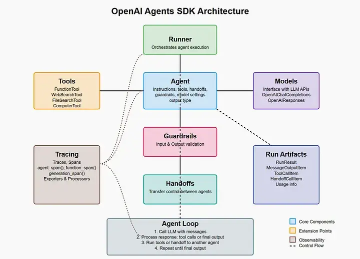

# OpenAI Agents SDK：从入门到多 Agent 编排实战

> 本文基于 OpenAI 官方文档和社区最佳实践，全面介绍 OpenAI Agents SDK 的核心概念、使用方法和高级特性，帮助开发者快速上手 Agent 开发。



---

## 一、什么是 OpenAI Agents SDK

### 1.1 SDK 定位

OpenAI Agents SDK（`openai-agents-python`）是 OpenAI 官方推出的 Agent 开发框架，于 2025 年 3 月正式发布。它的前身是实验性的 Swarm 框架，现在已成为 OpenAI 推荐的 Agent 开发标准。

**核心定位：** 轻量级、生产就绪的 Agent 编排框架。

| 属性 | 说明 |
|------|------|
| 包名 | `openai-agents` |
| Python 版本 | 3.9+ |
| 开源协议 | MIT |
| GitHub Stars | 15K+ |
| 核心特性 | Agents、Handoffs、Guardrails、Tracing |

### 1.2 为什么选择 OpenAI Agents SDK

| 优势 | 说明 |
|------|------|
| **官方支持** | OpenAI 官方维护，与 OpenAI API 深度集成 |
| **轻量简洁** | 核心代码不到 1000 行，学习曲线低 |
| **生产就绪** | 内置 Tracing、Guardrails、错误处理 |
| **多 Agent 编排** | 原生支持 Handoffs 和多 Agent 协作 |
| **模型无关** | 支持 OpenAI、Anthropic、Google 等模型 |

### 1.3 与其他框架对比

| 框架 | 定位 | 复杂度 | 适用场景 |
|------|------|--------|----------|
| **OpenAI Agents SDK** | 轻量级 Agent 编排 | 低 | 快速开发、多 Agent 协作 |
| **LangChain** | 通用 LLM 应用框架 | 中 | 复杂链式调用、RAG |
| **LangGraph** | 图编排框架 | 高 | 复杂状态机、多步骤工作流 |
| **CrewAI** | 多 Agent 框架 | 中 | 角色扮演、团队协作 |
| **AutoGen** | 多 Agent 对话框架 | 高 | 复杂多轮对话、代码执行 |

**大白话解释：** 如果你要快速搭建一个能用工具、能分工协作的 Agent，Agents SDK 是最简单的选择。如果你需要复杂的图编排和状态管理，用 LangGraph。

---

## 二、核心概念

### 2.1 四大核心组件

```
OpenAI Agents SDK
├── Agent（智能体）
│   ├── instructions（系统提示）
│   ├── model（使用的模型）
│   └── tools（可用工具）
├── Handoffs（交接）
│   └── Agent 之间的任务转移
├── Guardrails（护栏）
│   └── 输入/输出验证和安全检查
└── Tracing（追踪）
    └── 执行过程的可视化追踪
```

### 2.2 Agent（智能体）

Agent 是 SDK 的核心抽象，代表一个具有特定能力和职责的 AI 助手。

```python
from agents import Agent

agent = Agent(
    name="客服助手",
    instructions="你是一个专业的客服助手，帮助用户解决产品问题。",
    model="deepseek-v4-flash"
)
```

**关键属性：**

| 属性 | 类型 | 说明 |
|------|------|------|
| `name` | str | Agent 名称，用于标识和日志 |
| `instructions` | str | 系统提示，定义 Agent 的行为 |
| `model` | str | 使用的模型（默认 gpt-5.4） |
| `tools` | list | 可用的工具列表 |
| `handoffs` | list | 可交接的目标 Agent |

### 2.3 Handoffs（交接）

Handoffs 允许一个 Agent 将任务转交给另一个 Agent，实现多 Agent 协作。

```python
from agents import Agent, handoff

# 定义专业 Agent
billing_agent = Agent(
    name="账单专家",
    instructions="你负责处理账单和支付相关问题。"
)

technical_agent = Agent(
    name="技术支持",
    instructions="你负责解决技术问题和故障排除。"
)

# 主 Agent 通过 handoff 分发任务
triage_agent = Agent(
    name="客服路由",
    instructions="你负责分析用户问题并转交给合适的专家。",
    handoffs=[
        handoff(billing_agent, description="账单和支付问题"),
        handoff(technical_agent, description="技术问题和故障"),
    ]
)
```

**大白话解释：** Handoffs 就像客服前台接到电话后，根据问题类型转接给不同的专业坐席。

### 2.4 Guardrails（护栏）

Guardrails 用于验证输入和输出，确保 Agent 的行为符合预期。

```python
from agents import Agent, InputGuardrail, GuardrailFunctionOutput
from pydantic import BaseModel

class SafetyCheck(BaseModel):
    is_safe: bool
    reason: str

async def check_safety(ctx, agent, input):
    """检查输入是否安全"""
    # 调用模型判断
    result = await Runner.run(safety_agent, input)
    return GuardrailFunctionOutput(
        output_info=result,
        tripwire_triggered=not result.is_safe
    )

agent = Agent(
    name="客服助手",
    instructions="你是客服助手。",
    input_guardrails=[
        InputGuardrail(guardrail_function=check_safety)
    ]
)
```

### 2.5 Tracing（追踪）

SDK 内置了完整的执行追踪功能，可以可视化 Agent 的每一步操作。

```python
from agents import Agent, Runner, trace

agent = Agent(name="助手", instructions="帮助用户。")

# 使用 trace 上下文管理器
with trace("用户咨询"):
    result = Runner.run_sync(agent, "你好")
    print(result.final_output)
```

---

## 三、快速开始

### 3.1 环境准备

```bash
# 创建虚拟环境
python -m venv .venv

# 激活虚拟环境
# Windows:
.venv\Scripts\activate
# macOS/Linux:
source .venv/bin/activate

# 安装 SDK
pip install openai-agents

# 设置 API Key
export OPENAI_API_KEY="sk-xxx"
```

### 3.2 第一个 Agent

```python
from agents import Agent, Runner

# 创建 Agent
agent = Agent(
    name="助手",
    instructions="你是一个友好的助手，用简洁的中文回答问题。"
)

# 同步运行
result = Runner.run_sync(agent, "什么是 AI Agent？")
print(result.final_output)
```

### 3.3 给 Agent 添加工具

```python
from agents import Agent, Runner, function_tool

@function_tool
def get_weather(city: str) -> str:
    """获取指定城市的天气信息"""
    # 这里模拟天气 API 调用
    weather_data = {
        "北京": "晴天，25°C",
        "上海": "多云，22°C",
        "深圳": "阵雨，28°C"
    }
    return weather_data.get(city, f"暂无 {city} 的天气数据")

# 创建带工具的 Agent
agent = Agent(
    name="天气助手",
    instructions="你是一个天气查询助手，帮助用户了解天气情况。",
    tools=[get_weather]
)

# 运行
result = Runner.run_sync(agent, "北京今天天气怎么样？")
print(result.final_output)
# 输出：北京今天天气晴朗，气温25°C。
```

### 3.4 多 Agent 协作

```python
from agents import Agent, Runner, handoff

# 定义专业 Agent
math_agent = Agent(
    name="数学专家",
    instructions="你擅长解决数学问题，给出详细的解题步骤。"
)

history_agent = Agent(
    name="历史专家",
    instructions="你擅长回答历史问题，提供准确的历史知识。"
)

# 定义路由 Agent
router_agent = Agent(
    name="学习助手",
    instructions="""你是一个学习助手，帮助学生解答问题。
根据问题类型，将其转交给合适的专业助手：
- 数学问题 → 转交给数学专家
- 历史问题 → 转交给历史专家
- 其他问题 → 自己回答""",
    handoffs=[
        handoff(math_agent, description="数学相关问题"),
        handoff(history_agent, description="历史相关问题"),
    ]
)

# 运行
result = Runner.run_sync(router_agent, "请解释勾股定理")
print(result.final_output)
# 会自动转交给数学专家回答
```

---

## 四、高级特性

### 4.1 工具定义详解

SDK 支持两种工具定义方式：

#### 方式一：函数装饰器（推荐）

```python
from agents import function_tool
from pydantic import BaseModel

# 简单工具
@function_tool
def calculate(expression: str) -> str:
    """计算数学表达式"""
    try:
        result = eval(expression)
        return str(result)
    except Exception as e:
        return f"计算错误: {e}"

# 带复杂参数的工具
class SearchInput(BaseModel):
    query: str
    max_results: int = 5
    language: str = "zh"

@function_tool
def search_web(input: SearchInput) -> str:
    """搜索网页内容"""
    # 模拟搜索
    return f"搜索 '{input.query}' 的前 {input.max_results} 个结果..."
```

#### 方式二：FunctionTool 对象

```python
from agents import FunctionTool

async def my_tool(ctx, args_json: str) -> str:
    """工具实现"""
    import json
    args = json.loads(args_json)
    # 处理逻辑
    return "结果"

tool = FunctionTool(
    name="my_tool",
    description="工具描述",
    params_json_schema={...},
    on_invoke_tool=my_tool
)
```

### 4.2 Handoffs 高级用法

#### 条件交接

```python
from agents import Agent, handoff

def should_transfer_to_billing(message: str) -> bool:
    """判断是否需要转接到账单部门"""
    billing_keywords = ["账单", "支付", "退款", "费用", "价格"]
    return any(keyword in message for keyword in billing_keywords)

agent = Agent(
    name="客服",
    instructions="你是客服助手。",
    handoffs=[
        handoff(
            billing_agent,
            description="账单和支付问题",
            is_enabled=should_transfer_to_billing
        )
    ]
)
```

#### 程序化交接

```python
from agents import Agent, Runner

async def smart_routing(input: str):
    """智能路由逻辑"""
    # 先用分类器判断
    category = await classify_input(input)
    
    if category == "billing":
        return await Runner.run(billing_agent, input)
    elif category == "technical":
        return await Runner.run(technical_agent, input)
    else:
        return await Runner.run(general_agent, input)
```

### 4.3 Guardrails 详解

#### 输入护栏

```python
from agents import Agent, InputGuardrail, GuardrailFunctionOutput
from pydantic import BaseModel

class SafetyCheck(BaseModel):
    is_safe: bool
    reason: str

safety_agent = Agent(
    name="安全检查",
    instructions="检查用户输入是否包含有害或不当内容。",
    output_type=SafetyCheck
)

async def safety_guardrail(ctx, agent, input):
    """安全检查护栏"""
    result = Runner.run(safety_agent, input)
    return GuardrailFunctionOutput(
        output_info=result,
        tripwire_triggered=not result.is_safe
    )

agent = Agent(
    name="助手",
    instructions="你是助手。",
    input_guardrails=[InputGuardrail(guardrail_function=safety_guardrail)]
)
```

#### 输出护栏

```python
from agents import Agent, OutputGuardrail

class QualityCheck(BaseModel):
    is_quality: bool
    issues: list[str]

quality_agent = Agent(
    name="质量检查",
    instructions="检查回答质量，确保准确、完整、无害。",
    output_type=QualityCheck
)

async def quality_guardrail(ctx, agent, output):
    """质量检查护栏"""
    result = Runner.run(quality_agent, output)
    return GuardrailFunctionOutput(
        output_info=result,
        tripwire_triggered=not result.is_quality
    )

agent = Agent(
    name="助手",
    instructions="你是助手。",
    output_guardrails=[OutputGuardrail(guardrail_function=quality_guardrail)]
)
```

### 4.4 Context 和 State

```python
from agents import Agent, RunContextWrapper
from dataclasses import dataclass

@dataclass
class UserContext:
    user_id: str
    user_name: str
    preferences: dict

async def dynamic_instructions(ctx: RunContextWrapper[UserContext], agent: Agent) -> str:
    """动态生成系统提示"""
    user = ctx.context
    return f"""你是 {user.user_name} 的个人助手。
用户偏好：{user.preferences}
请根据用户偏好调整你的回答风格。"""

agent = Agent(
    name="个人助手",
    instructions=dynamic_instructions
)
```

---

## 五、实战案例

### 5.1 智能客服系统

```python
from agents import Agent, Runner, handoff, function_tool
from pydantic import BaseModel

# 工具定义
@function_tool
def lookup_order(order_id: str) -> str:
    """查询订单状态"""
    orders = {
        "ORD001": "已发货，预计明天到达",
        "ORD002": "处理中，预计2天后发货",
    }
    return orders.get(order_id, "未找到订单")

@function_tool
def create_ticket(title: str, description: str) -> str:
    """创建工单"""
    return f"工单已创建：{title} - {description}"

# 专业 Agent
order_agent = Agent(
    name="订单服务",
    instructions="你负责查询和处理订单问题。",
    tools=[lookup_order]
)

complaint_agent = Agent(
    name="投诉处理",
    instructions="你负责处理用户投诉，记录问题并安抚用户。",
    tools=[create_ticket]
)

general_agent = Agent(
    name="通用客服",
    instructions="你负责回答一般性咨询问题。"
)

# 路由 Agent
triage_agent = Agent(
    name="客服路由",
    instructions="""你是客服系统的路由中心。
分析用户问题，将其转交给合适的服务人员：
- 订单相关 → 订单服务
- 投诉抱怨 → 投诉处理
- 其他问题 → 通用客服""",
    handoffs=[
        handoff(order_agent, description="订单查询和处理"),
        handoff(complaint_agent, description="用户投诉处理"),
        handoff(general_agent, description="一般咨询"),
    ]
)

# 使用
result = Runner.run_sync(triage_agent, "我的订单 ORD001 到哪了？")
print(result.final_output)
```

### 5.2 多语言翻译助手

```python
from agents import Agent, Runner, handoff

# 定义语言专家
chinese_agent = Agent(
    name="中文专家",
    instructions="你擅长中英文翻译，输出高质量的中文翻译。"
)

japanese_agent = Agent(
    name="日语专家",
    instructions="你擅长日英翻译，输出高质量的日语翻译。"
)

spanish_agent = Agent(
    name="西班牙语专家",
    instructions="你擅长西英翻译，输出高质量的西班牙语翻译。"
)

# 路由 Agent
translator_agent = Agent(
    name="翻译路由",
    instructions="""你是一个翻译助手的路由。
根据用户需要翻译的目标语言，将其转交给对应的语言专家：
- 翻译成中文 → 中文专家
- 翻译成日语 → 日语专家
- 翻译成西班牙语 → 西班牙语专家""",
    handoffs=[
        handoff(chinese_agent, description="翻译成中文"),
        handoff(japanese_agent, description="翻译成日语"),
        handoff(spanish_agent, description="翻译成西班牙语"),
    ]
)
```

### 5.3 代码审查助手

```python
from agents import Agent, Runner, function_tool

@function_tool
def run_linter(code: str, language: str) -> str:
    """运行代码检查工具"""
    # 模拟 lint 结果
    return f"{language} lint 检查完成，发现 2 个警告"

@function_tool
def check_security(code: str) -> str:
    """安全漏洞检查"""
    return "未发现高危漏洞，1 个中危问题"

# 定义审查 Agent
reviewer_agent = Agent(
    name="代码审查员",
    instructions="""你是一个资深代码审查员。
审查代码时关注：
1. 代码质量和最佳实践
2. 潜在的安全漏洞
3. 性能问题
4. 可读性和可维护性

使用工具辅助审查：
- run_linter: 运行代码检查
- check_security: 安全漏洞检查""",
    tools=[run_linter, check_security]
)

# 使用
code_sample = """
def process_data(data):
    result = eval(data)  # 危险！
    return result
"""

result = Runner.run_sync(reviewer_agent, f"请审查以下 Python 代码：\n{code_sample}")
print(result.final_output)
```

---

## 六、最佳实践

### 6.1 Agent 设计原则

| 原则 | 说明 |
|------|------|
| **单一职责** | 每个 Agent 只负责一个领域 |
| **清晰指令** | instructions 要明确、具体 |
| **工具最小化** | 只给 Agent 必要的工具 |
| **错误处理** | 始终处理工具调用失败的情况 |
| **日志追踪** | 使用 trace 记录关键操作 |

### 6.2 性能优化

```python
# 1. 使用异步运行提高并发
import asyncio
from agents import Agent, Runner

async def process_batch(inputs: list[str]):
    """批量处理"""
    agent = Agent(name="助手", instructions="帮助用户。")
    
    tasks = [Runner.run(agent, input) for input in inputs]
    results = await asyncio.gather(*tasks)
    return [r.final_output for r in results]

# 2. 合理设置模型
simple_agent = Agent(
    name="简单任务",
    instructions="处理简单问题。",
    model="gpt-4.1-nano"  # 简单任务用便宜模型
)

complex_agent = Agent(
    name="复杂任务",
    instructions="处理复杂推理。",
    model="gpt-5.5"  # 复杂任务用强模型
)
```

### 6.3 错误处理

```python
from agents import Agent, Runner
from agents.exceptions import MaxTurnsExceeded, InputGuardrailTripwireTriggered

agent = Agent(name="助手", instructions="帮助用户。")

try:
    result = Runner.run_sync(agent, "用户输入", max_turns=10)
    print(result.final_output)
except MaxTurnsExceeded:
    print("达到最大轮次限制，请简化问题")
except InputGuardrailTripwireTriggered:
    print("输入触发安全检查，请修改输入")
except Exception as e:
    print(f"发生错误: {e}")
```

---

## 七、Tracing 与调试

### 7.1 使用 Tracing

```python
from agents import Agent, Runner, trace

agent = Agent(name="助手", instructions="帮助用户。")

# 方式一：上下文管理器
with trace("用户咨询流程"):
    result = Runner.run_sync(agent, "你好")
    print(result.final_output)

# 方式二：自动追踪
# 所有 Runner.run 和 Runner.run_sync 自动创建 trace
```

### 7.2 查看 Traces

SDK 的 traces 会自动发送到 OpenAI Dashboard：

1. 访问 [platform.openai.com/traces](https://platform.openai.com/traces)
2. 查看每次调用的详细执行过程
3. 分析 Agent 的决策路径和工具调用

### 7.3 自定义 Tracing

```python
from agents import Agent, Runner
from agents.tracing import add_trace_processor

class CustomProcessor:
    def on_trace_start(self, trace):
        print(f"Trace 开始: {trace.name}")
    
    def on_trace_end(self, trace):
        print(f"Trace 结束: {trace.name}")

add_trace_processor(CustomProcessor())
```

---

## 八、与其他模型集成

### 8.1 使用 Anthropic Claude

```python
from agents import Agent, Runner
from agents.extensions.models.anthropic_model import AnthropicChatCompletionsModel

agent = Agent(
    name="Claude 助手",
    instructions="你是一个使用 Claude 模型的助手。",
    model=AnthropicChatCompletionsModel(
        model="claude-sonnet-4-6",
        api_key="sk-ant-xxx"
    )
)
```

### 8.2 使用 Google Gemini

```python
from agents import Agent, Runner
from agents.extensions.models.google_model import GoogleChatCompletionsModel

agent = Agent(
    name="Gemini 助手",
    instructions="你是一个使用 Gemini 模型的助手。",
    model=GoogleChatCompletionsModel(
        model="gemini-3.5-flash",
        api_key="AIzaSyxxx"
    )
)
```

### 8.3 使用本地模型（Ollama）

```python
from agents import Agent, Runner
from openai import AsyncOpenAI

# 使用 Ollama 的 OpenAI 兼容接口
ollama_client = AsyncOpenAI(
    base_url="http://localhost:11434/v1",
    api_key="ollama"
)

agent = Agent(
    name="本地助手",
    instructions="你是一个使用本地模型的助手。",
    model="llama4"
)
```

---

## 九、部署与生产化

### 9.1 环境变量配置

```bash
# .env 文件
OPENAI_API_KEY=sk-xxx
OPENAI_ORG_ID=org-xxx
OPENAI_PROJECT_ID=proj-xxx
```

### 9.2 FastAPI 集成

```python
from fastapi import FastAPI
from agents import Agent, Runner
from pydantic import BaseModel

app = FastAPI()

agent = Agent(
    name="API 助手",
    instructions="你是一个 API 服务的助手。"
)

class ChatRequest(BaseModel):
    message: str

class ChatResponse(BaseModel):
    response: str

@app.post("/chat", response_model=ChatResponse)
async def chat(request: ChatRequest):
    result = await Runner.run(agent, request.message)
    return ChatResponse(response=result.final_output)
```

### 9.3 Docker 部署

```dockerfile
FROM python:3.11-slim

WORKDIR /app

COPY requirements.txt .
RUN pip install --no-cache-dir -r requirements.txt

COPY . .

CMD ["uvicorn", "main:app", "--host", "0.0.0.0", "--port", "8000"]
```
