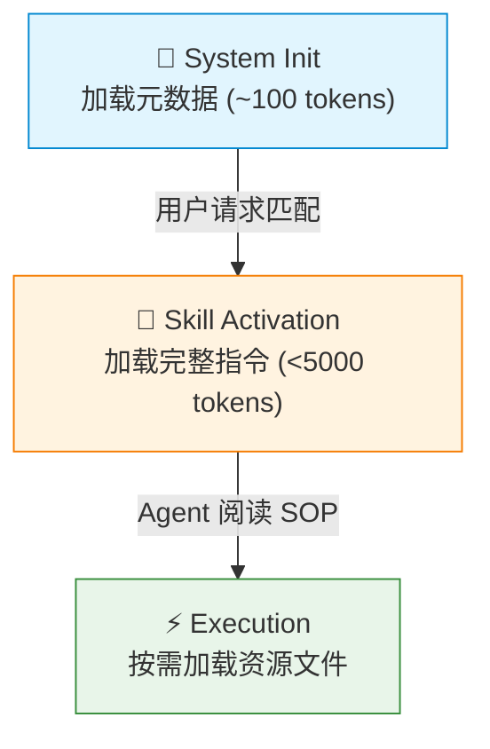
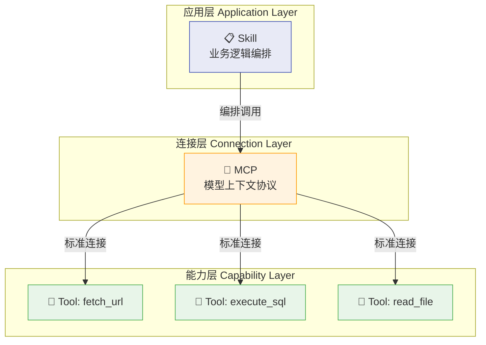
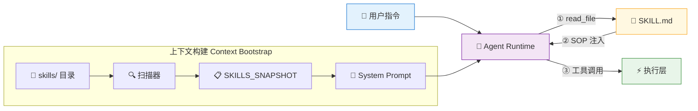

# 🔗 Agent Skills 工程实战

> 📌 基于 [Agent Skills 开放规范](https://agentskills.io/) + LangGraph 最新 API，拆解如何落地一套企业级智能体技能系统。

---

## 📑 目录

- [1. 规范层：Agent Skills 核心概念](#1-规范层agent-skills-核心概念)
- [2. 架构层：渐进式加载机制](#2-架构层渐进式加载机制)
- [3. 协议层：SKILL.md 规范详解](#3-协议层skillmd-规范详解)
- [4. 辨析层：Skill vs Tool vs MCP](#4-辨析层skill-vs-tool-vs-mcp)
- [5. 实战层：基于 LangGraph 构建 Agent Skills 系统](#5-实战层基于-langgraph-构建-agent-skills-系统)
- [6. 案例层：从简单到复杂的 Skill 设计](#6-案例层从简单到复杂的-skill-设计)
- [7. 生态层：Skill 资源与社区](#7-生态层skill-资源与社区)

---

## 1. 📖 规范层：Agent Skills 核心概念

### 1.1 ⚙️ 什么是 Agent Skill

**Agent Skill** 说白了就是一套轻量级的能力扩展格式。核心思路很直接：把人类专家脑子里的领域知识（Domain Knowledge）抽出来，封装成标准化的文件结构，让 AI 智能体在运行时按需加载、按规矩干活。

一个 Skill 本质上就是一个带 `SKILL.md` 的目录：

```
my-skill/
├── SKILL.md          # 必需：元数据 + 指令
├── scripts/          # 可选：可执行脚本
├── references/       # 可选：参考文档
└── assets/           # 可选：模板、资源文件
```

### 1.2 💡 核心价值主张

传统做法是把智能体的全部能力往 System Prompt 里塞——上下文窗口撑爆只是时间问题。Agent Skills 的解法：

- **📦 领域专业化**：把特定领域的流程知识（法律审查、数据分析、文档生成……）封装成可复用的指令 + 资源
- **🔄 工作流可重复**：多步骤任务变成一致的、可审计的 SOP，不会每次执行都"开盲盒"
- **🌐 跨产品复用**：写一次，Claude Code、Cursor、Gemini CLI、VS Code 等 30+ 客户端直接跑

### 1.3 🧮 技能的结构化定义

一个完整的 Skill 可以用这个公式概括：

$$\text{Skill} = \text{Metadata} + \text{Instructions (SOP)} + \text{Examples} + \text{Tools}$$

| 组件 | 作用 | 示例 |
|------|------|------|
| **Metadata** | 被系统索引和路由的标签 | `name`, `description` |
| **Instructions** | 自然语言编写的 SOP | 步骤 1 → 步骤 2 → 步骤 3 |
| **Examples** | Few-Shot 样本，锁定输出格式 | 用户输入 → 期望输出 |
| **Tools** | 底层原子能力依赖 | `fetch_url`, `execute_sql` |

---

## 2. 🏗️ 架构层：渐进式加载机制

Agent Skills 系统最核心的痛点：**Context Window 是有限的**。要在有限的 Token 预算里撑起无限的能力扩展，规范定义了三层渐进式加载（Progressive Disclosure）——说穿了就是"别一股脑全塞进去，用到啥加载啥"。



### 2.1 🔵 Level 1：索引层（Discovery）

- **加载时机**：系统启动
- **加载内容**：只读 `name` 和 `description`（约 100 tokens）
- **作用**：构建能力目录——Agent 知道自己"能做什么"，但还不知道"怎么做"
- **位置**：常驻 System Prompt

### 2.2 🟡 Level 2：指令层（Activation）

- **加载时机**：任务匹配到某个 Skill 的 description
- **加载内容**：完整 `SKILL.md` 正文（建议 < 5000 tokens）
- **作用**：JIT（Just-in-Time）知识注入，Agent 在这一步才真正学会业务逻辑
- **触发方式**：Agent 调用 `read_file` 读取 SKILL.md

### 2.3 🟢 Level 3：执行层（Execution）

- **加载时机**：Agent 按 SOP 发起具体工具调用
- **加载内容**：`scripts/`、`references/`、`assets/` 中的具体文件
- **作用**：真正干活——调 API、跑脚本、查数据库

> 💡 **设计哲学**：指令文件控制在 500 行以内。参考材料拆到独立文件，Agent 用到再读。

---

## 3. 📋 协议层：SKILL.md 规范详解

`SKILL.md` 采用 **YAML Frontmatter + Markdown Body** 的混合格式。

### 3.1 Frontmatter 字段规范

```yaml
---
name: my-skill-name          # 必需：唯一标识符，小写+连字符，最长 64 字符
description: |               # 必需：描述功能与触发条件，最长 1024 字符
  Extracts text from PDF files, fills forms, and merges PDFs.
  Use when working with PDF documents.
license: Apache-2.0          # 可选：许可证
compatibility: |             # 可选：环境要求，最长 500 字符
  Requires Python 3.11+ and uv
metadata:                    # 可选：自定义键值对
  author: my-org
  version: "1.0"
allowed-tools: "Bash(git:*) Read"  # 可选：预授权工具列表（实验性）
---
```

**`name` 字段约束**：

- 只允许小写字母、数字、连字符
- 不能以连字符开头或结尾
- 不能包含连续连字符
- 必须和父目录名一致（不一致就等着 debug 吧）

**`description` 字段要求**：

- 要同时说清楚"做什么"和"什么时候用"
- 关键词要具体，帮智能体做意图路由

```yaml
# ✅ 好的描述
description: >
  Extracts text and tables from PDF files, fills PDF forms,
  and merges multiple PDFs. Use when working with PDF documents
  or when the user mentions PDFs, forms, or document extraction.

# ❌ 差的描述
description: Helps with PDFs.
```

### 3.2 Body 内容推荐结构

```markdown
# 技能名称

## 使用场景
明确描述何时应激活此技能。

## 执行步骤
1. 第一步做什么...
2. 第二步调用哪个工具...
3. 第三步如何处理数据...

## 示例
User: [用户输入]
Assistant: [期望的思考过程和工具调用]

## 注意事项
边界条件、错误处理、安全合规要求。
```

### 3.3 可选目录结构

| 目录 | 用途 | 加载时机 |
|------|------|----------|
| `scripts/` | 可执行代码（Python/Bash/JS） | Agent 需要执行时 |
| `references/` | 详细技术参考文档 | Agent 需要查阅时 |
| `assets/` | 模板、图片、数据文件 | 按需加载 |

### 3.4 验证工具

用官方参考库跑一下规范合规性检查：

```bash
skills-ref validate ./my-skill
```

---

## 4. 🔍 辨析层：Skill vs Tool vs MCP

这三个概念很容易搞混，先理清楚，不然后面架构设计会翻车。

| 概念 | 定义 | 类比 | 职责边界 |
|------|------|------|----------|
| **Skill** | 业务逻辑封装（SOP） | 📖 菜谱 | 告诉 Agent "先做什么、再做什么"，编排工具调用顺序 |
| **Tool** | 原子能力接口（API） | 🔪 厨刀 | 执行具体物理动作（`fetch_url`, `execute_sql`），不含业务逻辑 |
| **MCP** | 连接标准协议 | 🔌 接口标准 | 规定工具怎么连到运行时，解决"怎么连"而非"怎么做" |



一句话总结：Skill 在最上层当指挥官，通过 MCP 这套标准协议调度底层的 Tool 干活。

---

## 5. 🚀 实战层：基于 LangGraph 构建 Agent Skills 系统

这一节直接上手，基于 LangGraph 的 `create_react_agent` 搭一套完整的 Agent Skills 运行时。

### 5.1 系统架构总览



三个核心模块：

1. **🔍 引导层（Bootstrap）**：启动时扫描 `skills/` 目录，提取元数据，生成技能快照
2. **🔧 工具层（Core Tools）**：给 Agent 装上"读文件"和"联网"两个基础物理能力
3. **🧠 运行时（Agent Runtime）**：基于 LangGraph `create_react_agent` 跑核心推理循环

### 5.2 环境准备

```bash
# 安装核心依赖
pip install langgraph langchain-openai langchain-community

# 验证安装
python -c "from langgraph.prebuilt import create_react_agent; print('OK')"
```

### 5.3 核心工具层实现

Agent Skills 的精髓在于"Agent 通过阅读文档学会用工具"。出厂自带两个基础工具就够了：

```python
"""
核心工具层：赋予 Agent 基础物理能力
- read_file: 读取 Skill 定义文件（眼睛）
- fetch_url: 执行 HTTP GET 请求（双手）
"""

import os
from langchain_core.tools import tool
from langchain_community.tools.file_management import ReadFileTool


# ============================================================
# 工具 1：安全的文件读取（The Eyes）
# ============================================================
# 通过 root_dir 将 Agent 的文件访问范围锁定在 skills 目录内
# 这是防止 Agent 越狱读取系统敏感文件的第一道防线
raw_read_file = ReadFileTool(root_dir="./skills")


@tool
def read_file(file_path: str) -> str:
    """读取 Agent Skills 的定义文件 (SKILL.md)。
    参数 file_path 必须是相对于 skills 文件夹的路径，
    例如: 'get-weather/SKILL.md'
    """
    # 路径安全检查：禁止目录穿越攻击
    if ".." in file_path:
        return "Error: 禁止访问父目录文件。"
    try:
        return raw_read_file.invoke({"file_path": file_path})
    except Exception as e:
        return f"Error reading file: {e}"


# ============================================================
# 工具 2：联网能力（The Hands）
# ============================================================
import httpx


@tool
def fetch_url(url: str) -> str:
    """执行 HTTP GET 请求获取网页或 API 数据。
    当 Skill 文档要求访问某个 URL 时使用此工具。
    """
    try:
        # 使用 httpx 替代已废弃的 RequestsGetTool
        # 设置超时和最大内容长度，防止上下文溢出
        with httpx.Client(timeout=15.0, follow_redirects=True) as client:
            response = client.get(url)
            content = response.text[:3000]  # 截断保护
        return content
    except Exception as e:
        return f"Error fetching URL: {e}"


# 导出工具列表，注入 Agent
core_tools = [read_file, fetch_url]
```

几个关键设计点：

- **🔒 沙箱机制**：`root_dir` 把 Agent 的文件视野锁死在 `./skills`，防止越权访问——生产环境这道防线不能省
- **📝 Docstring 即 Prompt**：`@tool` 装饰器会把函数 Docstring 自动转成工具描述注入模型，所以注释写得好不好直接影响 Agent 的调用准确率
- **✂️ 截断保护**：`fetch_url` 限制返回 3000 字符，不然一个网页就能把上下文撑爆

### 5.4 引导层实现（Bootstrap）

引导层的活很简单：启动时扫目录，生成"技能菜单"塞进 System Prompt。

```python
"""
引导层：扫描 skills 目录，生成技能快照
"""

import os
from pathlib import Path


def generate_skills_snapshot(skills_dir: str = "./skills") -> str:
    """
    扫描 skills 文件夹，提取每个 Skill 的元数据，
    生成 XML 格式的快照用于注入 System Prompt。

    XML 标签结构有助于 Claude/GPT 更精准地识别和解析。
    """
    skills_path = Path(skills_dir)

    if not skills_path.exists():
        return "<available_skills>暂无可用技能。</available_skills>"

    snapshot_lines = ["<available_skills>"]

    # 遍历每个子目录（每个子目录视为一个 Skill）
    for skill_dir in sorted(skills_path.iterdir()):
        if not skill_dir.is_dir():
            continue

        skill_md = skill_dir / "SKILL.md"
        if not skill_md.exists():
            continue

        # 读取并解析 YAML Frontmatter
        content = skill_md.read_text(encoding="utf-8")
        name, description = _parse_frontmatter(content, skill_dir.name)

        snapshot_lines.append(f"""  <skill>
    <name>{name}</name>
    <path>{skill_dir.name}/SKILL.md</path>
    <description>{description}</description>
  </skill>""")

    snapshot_lines.append("</available_skills>")
    return "\n".join(snapshot_lines)


def _parse_frontmatter(content: str, fallback_name: str) -> tuple[str, str]:
    """从 SKILL.md 中提取 name 和 description 字段。"""
    name = fallback_name
    description = "未提供描述"

    if not content.startswith("---"):
        return name, description

    try:
        # 查找第二个 --- 作为 frontmatter 结束标记
        end_idx = content.index("---", 3)
        frontmatter = content[3:end_idx]

        for line in frontmatter.strip().split("\n"):
            line = line.strip()
            if line.startswith("name:"):
                name = line[5:].strip().strip('"').strip("'")
            elif line.startswith("description:"):
                description = line[12:].strip().strip('"').strip("'")
                # 处理多行描述（取第一行）
                if len(description) > 200:
                    description = description[:200] + "..."
    except ValueError:
        pass

    return name, description
```

设计要点：

- **🔥 热插拔**：`skills/` 下新建目录，下次启动自动注册，核心代码一行不用改
- **📄 XML 格式**：比 JSON 或纯文本好使，XML 标签结构对模型来说更"显眼"，解析准确率明显更高
- **📍 路径映射**：`<path>` 标签告诉 Agent 文件在哪，后续 `read_file` 调用直接用

### 5.5 Agent 运行时构建

用 LangGraph 的 `create_react_agent` 搭核心推理引擎：

```python
"""
Agent 运行时：基于 LangGraph create_react_agent 构建
"""

from langgraph.prebuilt import create_react_agent
from langchain_openai import ChatOpenAI
from langchain_core.messages import SystemMessage


# ============================================================
# 1. 初始化语言模型
# ============================================================
# 推荐使用支持 Function Calling 的模型
# - OpenAI: gpt-4o, gpt-4o-mini
# - Anthropic: claude-sonnet-4-20250514
# - 国内: 智谱 GLM-4, 通义千问 Max
model = ChatOpenAI(
    model="gpt-4o",
    temperature=0,  # 确定性输出，适合执行 SOP
)


# ============================================================
# 2. 动态构建 System Prompt
# ============================================================
snapshot_content = generate_skills_snapshot()

SYSTEM_PROMPT = f"""你是一个基于 Agent Skills 架构的智能助手。

## 能力清单
以下是你当前可用的技能列表：
{snapshot_content}

## 核心协议（CRITICAL）
1. 当用户请求匹配上述技能时，**严禁**直接猜测操作步骤
2. 你的第一步**必须**是调用 `read_file` 读取对应技能的 SKILL.md
3. 读取后，严格按照文件中的 Steps 指导执行任务
4. 如果没有匹配的技能，使用你的通用能力回答
"""


# ============================================================
# 3. 构建 Agent Runtime
# ============================================================
# create_react_agent 自动处理 "思考 → 工具调用 → 观察 → 再思考" 的循环
agent = create_react_agent(
    model=model,
    tools=core_tools,
    prompt=SYSTEM_PROMPT,  # 动态注入技能快照
)


# ============================================================
# 4. 执行与流式输出
# ============================================================
def run_agent(user_input: str) -> str:
    """执行 Agent 并返回最终回复。"""
    result = agent.invoke(
        {"messages": [{"role": "user", "content": user_input}]}
    )
    # 提取最后一条 AI 消息
    return result["messages"][-1].content


def run_agent_stream(user_input: str):
    """流式输出 Agent 的思考与执行过程。"""
    for event in agent.stream(
        {"messages": [{"role": "user", "content": user_input}]},
        stream_mode="values",
    ):
        last_msg = event["messages"][-1]
        role = last_msg.type.upper()
        content = last_msg.content[:200] if last_msg.content else "[工具调用]"
        print(f"[{role}] {content}")


# 测试入口
if __name__ == "__main__":
    print(">>> Agent Skills System Initialized.")
    print(f">>> 已加载技能快照:\n{snapshot_content}")
    print()

    # 测试查询
    test_query = "帮我查一下北京现在的天气"
    print(f">>> User: {test_query}")
    print("---")
    run_agent_stream(test_query)
```

**为什么"核心协议"这段不能省？** 大模型有个坏毛病——喜欢"自作聪明"地编造 API 调用方式。System Prompt 里强制"先读文件，再行动"，是对抗模型幻觉的关键防线。

---

## 6. 📚 案例层：从简单到复杂的 Skill 设计

### 6.1 🌤️ 简单案例：get-weather 技能

**目录结构**：

```
skills/
└── get-weather/
    └── SKILL.md
```

**SKILL.md 完整内容**：

```markdown
---
name: get-weather
description: >
  获取指定城市的实时天气信息。
  当用户询问某城市天气、气温、是否下雨时触发。
---

# 天气查询技能

## 使用场景
当用户询问某个城市的天气情况时使用此技能。

## 执行步骤
1. 从用户消息中提取城市名称（中文需转换为英文拼音，如"北京"→"Beijing"）
2. 使用 `fetch_url` 工具访问 `https://wttr.in/{城市名}?format=j1`
3. 解析返回的 JSON 数据，提取以下字段：
   - `current_condition[0].temp_C`：当前温度
   - `current_condition[0].weatherDesc[0].value`：天气描述
   - `current_condition[0].humidity`：湿度
4. 用自然语言组织回复，格式如下：

## 示例
User: 北京现在天气怎么样？
Assistant: [调用 fetch_url("https://wttr.in/Beijing?format=j1")]
System: {"current_condition":[{"temp_C":"22","weatherDesc":[{"value":"Sunny"}],...}]}
Assistant: 北京当前天气晴朗，气温 22°C，湿度 45%。适合户外活动。

## 注意事项
- 如果城市名无法识别，请询问用户确认
- wttr.in 服务可能偶尔不可用，返回错误时请告知用户稍后重试
```

拆解一下这个 Skill 的设计：

- **Metadata 层**：`description` 里的"天气""气温""下雨"是意图路由的关键词，写少了匹配率会掉
- **SOP 层**：纯自然语言写的编排逻辑，Agent 按步骤调 `fetch_url` 就行
- **Example 层**：Few-Shot 样本把输出格式锁死，防止 Agent 直接把原始 JSON 甩给用户

### 6.2 📄 复杂案例：docx 技能

`docx` 技能是 Agent Skills 的天花板级用法——不只是指挥 Agent 用工具，还让 Agent **现场写代码**。

**目录结构**：

```
skills/docx/
├── SKILL.md              # 核心：SOP 与知识库
└── scripts/              # 原子工具脚本
    └── office/
        ├── unpack.py     # 将 .docx 解压为 XML 目录
        ├── pack.py       # 将 XML 目录重打包为 .docx
        ├── soffice.py    # 调用 LibreOffice 转换格式
        └── validate.py   # 验证 .docx 文件完整性
```

**设计洞察——"厚工具，薄指令"原则**：

把复杂的文件操作封装成独立 Python 脚本（放 `scripts/` 下），SKILL.md 只需要告诉 Agent "跑 `unpack.py`"，不用解释"怎么解压 ZIP 文件"。这一招直接把指令层的 Token 消耗砍掉一大截。

**双模态工作流**：

| 模式 | 触发条件 | 执行方式 |
|------|----------|----------|
| **创建模式** | 用户要新建文档 | Agent 写 Node.js 脚本，用 `docx-js` 库生成 |
| **编辑模式** | 用户要改现有文档 | 解压 → 编辑 XML → 重打包（外科手术式精准操作） |

**编辑模式 SOP 示例**：

```markdown
## 编辑现有文档

### 步骤 1：解压
运行 `python scripts/office/unpack.py document.docx unpacked/`

### 步骤 2：编辑 XML
直接编辑 `unpacked/word/document.xml` 中的内容。

### 步骤 3：重打包
运行 `python scripts/office/pack.py unpacked/ output.docx --original document.docx`
```

这个案例的几个核心认知：

1. **代码生成 > 工具调用**：复杂场景下，让 Agent 写临时脚本跑比预定义 API 灵活得多
2. **工具链编排**：Agent 就是指挥官——Pandoc 读、Node.js 写、Python 改、LibreOffice 转，一气呵成
3. **知识封装**：XML 操作和 docx-js 库的用法全写在 SKILL.md 里，不需要模型预训练时就学过这些东西

---

## 7. 🌍 生态层：Skill 资源与社区

### 7.1 📦 Anthropic Official Skills（官方标准库）

- **地址**：[github.com/anthropics/skills](https://github.com/anthropics/skills)
- **特点**：官方出品，Skill 开发的标杆级参考；覆盖文档处理（docx/pdf/pptx/xlsx）、创意生成、技术开发等全场景

### 7.2 🏪 Agent Skills 生态客户端

截至 2026 年，这些主流 AI 开发工具已支持 Agent Skills 规范：

| 客户端 | 类型 | 说明 |
|--------|------|------|
| Claude Code | CLI/IDE | Anthropic 官方，原生支持 |
| Cursor | IDE | AI 编辑器，支持 Skills 加载 |
| VS Code + Copilot | IDE | 微软官方集成 |
| Gemini CLI | CLI | Google 官方命令行 Agent |
| GitHub Copilot | IDE 插件 | 支持 Skills 上下文注入 |
| JetBrains Junie | IDE | IntelliJ 平台原生 Agent |
| OpenHands | 云平台 | 开源云编码 Agent |

### 7.3 🔧 Skill 验证与调试

```bash
# 验证 Skill 规范合规性
skills-ref validate ./skills/my-skill

# 本地测试 Skill 加载
# 在 Claude Code 中安装 Skill 插件
/plugin marketplace add anthropics/skills
/plugin install document-skills@anthropic-agent-skills
```

---

## 📌 附录：快速参考卡片

### SKILL.md 最小模板

```markdown
---
name: my-skill
description: 做什么 + 何时触发。
---

# 技能名称

## 执行步骤
1. ...

## 示例
User: ...
Assistant: ...
```

### create_react_agent 最小模板

```python
from langgraph.prebuilt import create_react_agent
from langchain_openai import ChatOpenAI

agent = create_react_agent(
    model=ChatOpenAI(model="gpt-4o"),
    tools=[tool1, tool2],
    prompt="你是一个智能助手...",
)

result = agent.invoke({"messages": [{"role": "user", "content": "..."}]})
```

### 关键原则速查

| 原则 | 说明 |
|------|------|
| **渐进式加载** | 元数据常驻，指令按需，资源延迟 |
| **厚工具薄指令** | 复杂逻辑封装为脚本，SKILL.md 只写调用方式 |
| **先读后行** | Agent 必须先读 SKILL.md 再执行，禁止猜测 |
| **XML 优先** | 结构化数据用 XML 标签，模型解析准确率更高 |
| **截断保护** | 外部数据返回必须限制长度，防止上下文溢出 |

## 全套公开课课件领取：


## DXZY.AI

DXZY.AI - 专注于 AI、RAG、Agent、MCP


- GitHub: https://github.com/dxzyai/agent-dev-guide
- 官网: https://dxzy.ai
  
