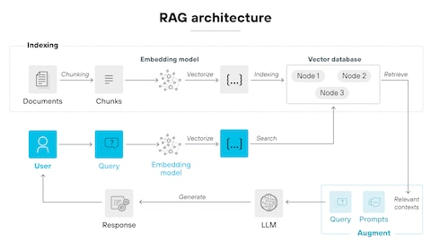
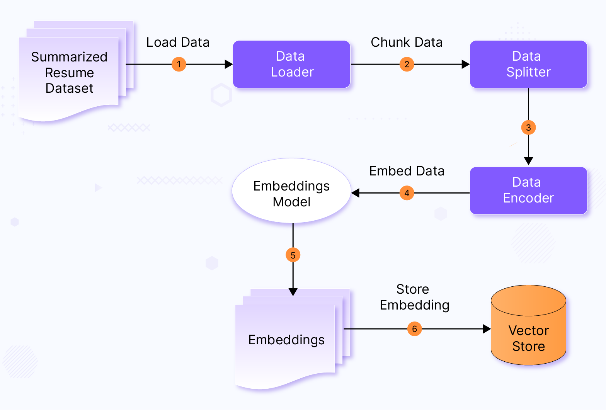
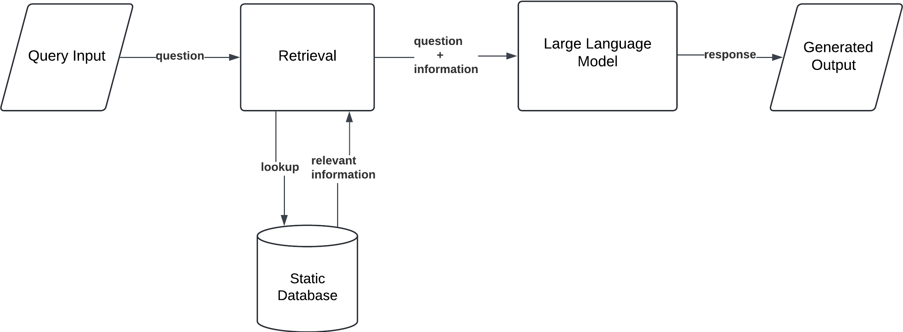
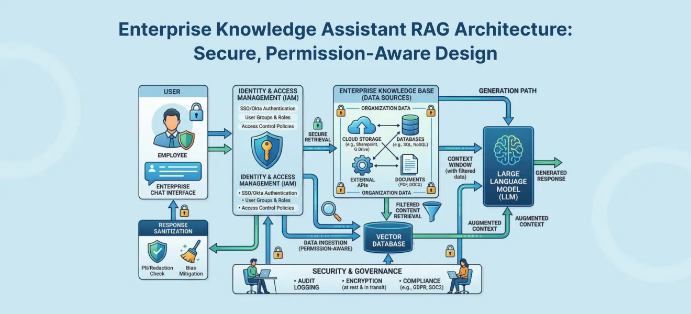

# 企业知识库问答系统端到端实战：从架构设计到生产部署

> 本文面向有一定 Python 基础的开发者，手把手搭建一个生产级的企业知识库 RAG 问答系统，涵盖架构设计、文档处理、向量检索、检索优化、对话管理、评估监控与生产部署全流程。技术栈以 LangChain / LangGraph 为主，代码均可运行。

---

## 一、为什么要做企业知识库问答系统

### 1.1 企业痛点：信息散落，找信息比干活还累

任何一个中大型企业都面临同一个问题：**有用的知识到处都是，但就是找不到。**

工程文档在 Confluence 里，HR 制度在 SharePoint 上，产品手册在共享盘里，技术方案在某个三年没人碰的邮件线程里。员工平均每周花 2-3 个小时只是在**找**那些已经存在的信息。资深工程师被迫变成"人肉搜索引擎"，新人入职几个月才能独立工作——不是因为能力不行，而是因为企业知识太分散、没法搜。

传统做法是建内部 wiki 或者上企业搜索工具，但这些方案有两个致命缺陷：

- **搜不到语义相关内容**：你搜"退货流程"，系统只认"退货"这两个字，找不到标题叫"售后退款处理规范"的文档。
- **搜到了也得自己读**：返回一长串链接，用户还得自己打开、阅读、提取关键信息，效率依然低。

### 1.2 传统搜索 vs RAG 问答

| 维度 | 传统企业搜索 | RAG 问答系统 |
|------|-------------|-------------|
| 搜索方式 | 关键词匹配（精确匹配） | 语义理解 + 关键词混合检索 |
| 返回结果 | 文档列表 / 链接 | 直接给出答案 + 引用来源 |
| 用户体验 | 自己打开文档找答案 | 系统帮你总结好了 |
| 知识更新 | 需要手动更新索引 | 更新文档即可，无需重新训练模型 |
| 可追溯性 | 有链接但不直观 | 每个回答都标注出处文档 |
| 部署难度 | 低 | 中等（但截至2025年6月，工具链已很成熟） |

简单说：**传统搜索给你"鱼塘"，RAG 直接给你"鱼"。**

### 1.3 2025-2026 年 RAG 技术成熟度

RAG 技术从 2023 年的"学术概念"已经进化到 2025 年的"生产标配"：

- **Naive RAG（入门级）**：直接 embedding + cosine similarity 检索，企业场景准确率只有 10-40%，基本不能用于生产。
- **Advanced RAG（生产级）**：混合检索（向量 + BM25）、重排序（Reranking）、查询改写（HyDE / Multi-query），准确率提升 40-70%。截至2025年6月，这是大多数生产系统采用的方案。
- **Agentic RAG（前沿级）**：把检索当作工具，用 Agent 来规划多步检索策略。适合金融分析、法律研究等复杂场景。

当前行业的共识是：**简单场景用 Advanced RAG 足够，复杂场景才需要 Agentic RAG。** 不要为了炫技过度设计。

---

## 二、整体架构设计

### 2.1 端到端架构概览

一个完整的 RAG 系统包含两条管线：

**索引管线（离线）：**
```
原始文档 → 文档加载 → 文本分块 → Embedding 向量化 → 写入向量数据库
```

**检索生成管线（在线）：**
```
用户提问 → 查询改写 → 向量检索 → 重排序 → 上下文组装 → LLM 生成答案
```

两条管线通过**向量数据库**连接——索引管线写入，检索管线读取。这个分离设计让你可以随时更新知识库，而不需要重新训练模型。

### 2.2 核心模块划分

| 模块 | 英文名 | 职责 |
|------|--------|------|
| 文档处理 | Document Processing | 加载各种格式文档，清洗、解析 |
| 文本分块 | Text Splitting | 将长文档切分为合适大小的片段 |
| 向量化 | Embedding | 将文本转为高维向量 |
| 向量存储 | Vector Store | 存储向量并提供相似度检索 |
| 检索器 | Retriever | 执行检索逻辑，支持混合检索、过滤等 |
| 重排序 | Reranker | 对检索结果二次排序，提升精度 |
| 生成器 | Generator | 组装 Prompt，调用 LLM 生成最终答案 |

### 2.3 完整数据流（用 LangGraph 实现）

下面用 LangGraph 把整个检索-生成流程编排成一个状态图，每个节点是一个处理步骤：

```python
"""
完整的 RAG 检索-生成管线，基于 LangGraph 实现
包含：查询改写 → 检索 → 重排序 → 上下文组装 → LLM 生成
"""
from typing import TypedDict, Annotated, List
from langgraph.graph import StateGraph, START, END
from langchain_core.documents import Document
from langchain_openai import ChatOpenAI, OpenAIEmbeddings
from langchain_community.vectorstores import Chroma
from langchain_core.prompts import ChatPromptTemplate

# ---------- 1. 定义状态 ----------
class RAGState(TypedDict):
    """管线状态，每个节点可以读写"""
    original_query: str          # 用户原始问题
    rewritten_query: str         # 改写后的查询
    retrieved_docs: List[Document]  # 检索到的文档
    reranked_docs: List[Document]   # 重排后的文档
    context: str                 # 组装好的上下文文本
    answer: str                  # LLM 生成的最终答案

# ---------- 2. 初始化组件 ----------
embeddings = OpenAIEmbeddings(model="text-embedding-3-small")
vectorstore = Chroma(persist_directory="./chroma_db", embedding_function=embeddings)

# ---- LLM 模型选择（按需选择其中一个方案） ----

# 方案1：OpenAI（国际，最通用）
from langchain_openai import ChatOpenAI
llm_openai = ChatOpenAI(model="gpt-4o", temperature=0)

# 方案2：DeepSeek（国内，性价比最高）
llm_deepseek = ChatOpenAI(
    model="deepseek-chat",
    base_url="https://api.deepseek.com/v1",
    api_key=os.environ["DEEPSEEK_API_KEY"],
    temperature=0
)

# 方案3：Claude（复杂推理）
from langchain_anthropic import ChatAnthropic
llm_claude = ChatAnthropic(model="claude-sonnet-4-20250514", temperature=0)

# 默认使用（选一个赋值给 llm 即可）
llm = llm_openai

# ---- 模型选择建议 ----
# | 场景       | 推荐模型                | 理由           |
# |-----------|------------------------|----------------|
# | 日常问答   | DeepSeek V4 Flash      | 便宜、快        |
# | 复杂推理   | Claude Sonnet 4 / GPT-4o | 准确率高       |
# | 预算紧张   | DeepSeek V4 Pro        | 性价比          |

# ---------- 3. 定义各节点 ----------
def rewrite_query(state: RAGState) -> dict:
    """查询改写：用 LLM 将用户口语化问题转为更精准的检索查询"""
    prompt = ChatPromptTemplate.from_template(
        "请将以下用户问题改写为更适合文档检索的形式，"
        "保持原始意图但使用更专业的表述：\n\n"
        "用户问题：{query}\n"
        "改写后的查询："
    )
    chain = prompt | llm
    result = chain.invoke({"query": state["original_query"]})
    return {"rewritten_query": result.content}

def retrieve(state: RAGState) -> dict:
    """混合检索：同时使用向量检索和关键词检索"""
    # similarity_search 支持向量检索，k=20 取较多候选
    docs = vectorstore.similarity_search(
        state["rewritten_query"],
        k=20
    )
    return {"retrieved_docs": docs}

def rerank(state: RAGState) -> dict:
    """重排序：对候选文档按相关性重新排序"""
    # 这里用简化版本：基于 LLM 判断相关性
    # 生产环境建议用 Cohere Rerank 或 cross-encoder 模型
    docs = state["retrieved_docs"]
    
    prompt = ChatPromptTemplate.from_template(
        "请对以下文档片段按与问题的相关性打分（1-10分），"
        "只返回分数，每行一个：\n\n"
        "问题：{query}\n\n"
        "文档：\n{docs}"
    )
    docs_text = "\n---\n".join(
        [f"[{i}] {d.page_content[:200]}" for i, d in enumerate(docs[:10])]
    )
    chain = prompt | llm
    result = chain.invoke({"query": state["rewritten_query"], "docs": docs_text})
    
    # 解析分数并排序（简化处理）
    scores = []
    for line in result.content.strip().split("\n"):
        try:
            scores.append(int(line.strip()))
        except ValueError:
            scores.append(5)
    
    # 按分数排序，取 top 5
    scored_docs = list(zip(scores, docs[:len(scores)]))
    scored_docs.sort(key=lambda x: x[0], reverse=True)
    reranked = [doc for _, doc in scored_docs[:5]]
    
    return {"reranked_docs": reranked}

def assemble_context(state: RAGState) -> dict:
    """组装上下文：将检索到的文档拼接为 LLM 可用的上下文"""
    context_parts = []
    for i, doc in enumerate(state["reranked_docs"]):
        source = doc.metadata.get("source", "未知来源")
        context_parts.append(f"[来源 {i+1}: {source}]\n{doc.page_content}")
    
    context = "\n\n---\n\n".join(context_parts)
    return {"context": context}

def generate_answer(state: RAGState) -> dict:
    """生成答案：基于上下文调用 LLM 生成回答"""
    prompt = ChatPromptTemplate.from_template(
        "你是一个企业知识库助手。请严格基于以下参考资料回答用户问题。\n"
        "如果参考资料中没有相关信息，请明确告知用户。\n"
        "回答末尾请注明引用的来源编号。\n\n"
        "参考资料：\n{context}\n\n"
        "用户问题：{query}\n\n"
        "回答："
    )
    chain = prompt | llm
    result = chain.invoke({
        "context": state["context"],
        "query": state["original_query"]
    })
    return {"answer": result.content}

# ---------- 4. 构建 LangGraph ----------
workflow = StateGraph(RAGState)

# 添加节点
workflow.add_node("rewrite_query", rewrite_query)
workflow.add_node("retrieve", retrieve)
workflow.add_node("rerank", rerank)
workflow.add_node("assemble_context", assemble_context)
workflow.add_node("generate_answer", generate_answer)

# 定义边（执行顺序）
workflow.add_edge(START, "rewrite_query")
workflow.add_edge("rewrite_query", "retrieve")
workflow.add_edge("retrieve", "rerank")
workflow.add_edge("rerank", "assemble_context")
workflow.add_edge("assemble_context", "generate_answer")
workflow.add_edge("generate_answer", END)

# 编译
app = workflow.compile()

# ---------- 5. 运行示例 ----------
if __name__ == "__main__":
    result = app.invoke({
        "original_query": "公司的年假政策是怎样的？",
        "rewritten_query": "",
        "retrieved_docs": [],
        "reranked_docs": [],
        "context": "",
        "answer": ""
    })
    print("问题：", result["original_query"])
    print("答案：", result["answer"])
```

> **模型选择建议**：根据场景选择合适的 LLM，可显著降低成本并提升效果。
>
> | 场景 | 推荐模型 | 理由 |
> |------|----------|------|
> | 日常问答 | DeepSeek V4 Flash | 便宜、快 |
> | 复杂推理 | Claude Sonnet 4 / GPT-4o | 准确率高 |
> | 预算紧张 | DeepSeek V4 Pro | 性价比 |

上面的代码展示了一个完整的 RAG 管线。下面我们逐个模块展开讲解。

> **参考图示：RAG 系统整体架构**
>
> 
> *图：RAG 检索增强生成架构概览（来源：Palo Alto Networks）*

---
## 三、文档处理与分块策略

### 3.1 支持的文档类型

企业知识库的文档格式五花八门，RAG 系统需要尽可能广泛地支持：

| 文档类型 | 格式 | 处理工具 |
|---------|------|---------|
| PDF | .pdf | PyPDFLoader, UnstructuredPDFLoader |
| Word 文档 | .docx | Docx2txtLoader |
| Markdown | .md | UnstructuredMarkdownLoader |
| 网页 HTML | .html | BeautifulSoupLoader |
| Excel / CSV | .xlsx / .csv | CSVLoader, UnstructuredExcelLoader |
| 代码文件 | .py / .js 等 | Language-specific splitters |
| PPT | .pptx | UnstructuredPowerPointLoader |
| 邮件 | .eml | UnstructuredEmailLoader |

```python
"""
演示如何加载多种格式的企业文档
"""
from langchain_community.document_loaders import (
    PyPDFLoader,
    Docx2txtLoader,
    UnstructuredMarkdownLoader,
    CSVLoader,
    TextLoader,
)
from pathlib import Path

def load_documents_from_directory(directory: str) -> list:
    """从指定目录加载所有支持格式的文档"""
    docs = []
    path = Path(directory)
    
    # 定义每种文件类型对应的 Loader
    loader_map = {
        ".pdf": PyPDFLoader,
        ".docx": Docx2txtLoader,
        ".md": UnstructuredMarkdownLoader,
        ".csv": CSVLoader,
        ".txt": TextLoader,
    }
    
    for file_path in path.rglob("*"):
        if file_path.suffix.lower() in loader_map:
            loader_cls = loader_map[file_path.suffix.lower()]
            try:
                loader = loader_cls(str(file_path))
                loaded = loader.load()
                # 给每个文档添加文件路径作为元数据
                for doc in loaded:
                    doc.metadata["source"] = str(file_path)
                    doc.metadata["file_type"] = file_path.suffix
                docs.extend(loaded)
                print(f"✅ 已加载: {file_path.name} ({len(loaded)} 个片段)")
            except Exception as e:
                print(f"❌ 加载失败: {file_path.name} - {e}")
    
    print(f"\n共加载 {len(docs)} 个文档片段")
    return docs

# 使用示例
docs = load_documents_from_directory("./enterprise_docs")
```

### 3.2 分块策略对比

分块（Chunking）是 RAG 系统中**最被低估但影响最大**的环节。分块质量直接决定了检索效果——比你选哪个 LLM 或哪个 Embedding 模型影响都大。

| 策略 | 原理 | 优点 | 缺点 | 适用场景 |
|------|------|------|------|---------|
| **固定大小分块** | 按字符/token 数切分，如每 500 token | 实现简单，速度快 | 不考虑语义边界，容易切断句子或表格 | 快速原型、格式规范的纯文本 |
| **递归字符分块** | 按分隔符（`\n\n`、`\n`、` `）递归切分 | 保留段落结构，比固定大小更自然 | 对特殊格式（表格、代码）处理一般 | 通用场景的**默认选择** |
| **语义分块** | 按语义相似度切分，相似度下降时断开 | 语义完整性最好 | 计算量大，需要调参 | 对答案质量要求高的场景 |
| **文档级分块** | 按文档结构（章节、标题）切分 | 保留完整上下文 | chunk 可能太大，token 浪费 | 结构化文档（论文、手册） |
| **句子窗口分块** | 索引时按句子，检索时扩展为窗口 | 检索精度高 + 生成时有足够上下文 | 实现稍复杂 | 企业知识库的**推荐方案** |

```python
"""
四种常用分块策略的代码演示
"""
from langchain.text_splitter import (
    RecursiveCharacterTextSplitter,
    CharacterTextSplitter,
)
from langchain_experimental.text_splitter import SemanticChunker
from langchain_openai import OpenAIEmbeddings

# 示例文档
sample_text = """
第三章 请假管理制度

3.1 年假规定
员工入职满一年后可享受带薪年假。工作满1年不满10年的，年假5天；
满10年不满20年的，年假10天；满20年的，年假15天。

3.2 病假规定
员工因病需要休息的，应提前向直属上级报备。
病假期间薪资按基本工资的80%发放。连续病假超过3天的，
需提供医院出具的诊断证明。

3.3 事假规定
员工因私事需要请假的，应提前3个工作日申请。
事假期间不发放薪资。每月事假累计不得超过3天。
"""

# ---- 方法1：固定大小分块 ----
fixed_splitter = CharacterTextSplitter(
    chunk_size=200,        # 每块最大 200 字符
    chunk_overlap=20,      # 块之间重叠 20 字符
    separator="\n",
)
fixed_chunks = fixed_splitter.split_text(sample_text)
print("=== 固定大小分块 ===")
for i, chunk in enumerate(fixed_chunks):
    print(f"  Chunk {i}: {chunk[:50]}...")

# ---- 方法2：递归字符分块（推荐的默认方案）----
recursive_splitter = RecursiveCharacterTextSplitter(
    chunk_size=200,
    chunk_overlap=40,
    separators=["\n\n", "\n", "。", "；", " "],  # 中文场景加上中文标点
)
recursive_chunks = recursive_splitter.split_text(sample_text)
print("\n=== 递归字符分块 ===")
for i, chunk in enumerate(recursive_chunks):
    print(f"  Chunk {i}: {chunk[:50]}...")

# ---- 方法3：语义分块 ----
# 需要 Embedding 模型，在语义断点处切分
embeddings = OpenAIEmbeddings(model="text-embedding-3-small")
semantic_splitter = SemanticChunker(
    embeddings,
    breakpoint_threshold_type="percentile",  # 基于百分位数的断点
    breakpoint_threshold_amount=75,          # 75% 分位数
)
# semantic_chunks = semantic_splitter.split_text(sample_text)
# 注意：语义分块计算量较大，适合对质量要求高的场景

# ---- 方法4：句子窗口分块（LlamaIndex 方式）----
# 用 LlamaIndex 的 SentenceWindowNodeParser
from llama_index.core.node_parser import SentenceWindowNodeParser
from llama_index.core import Document as LlamaDocument

parser = SentenceWindowNodeParser.from_defaults(
    window_size=3,                    # 检索时扩展左右各3句
    window_metadata_key="window",
    original_text_metadata_key="original_text"
)
llama_doc = LlamaDocument(text=sample_text)
nodes = parser.get_nodes_from_documents([llama_doc])
print("\n=== 句子窗口分块 ===")
for i, node in enumerate(nodes):
    print(f"  Node {i}: {node.text[:50]}...")
    print(f"  Window: {node.metadata.get('window', '')[:80]}...")
```

### 3.3 Chunk Size 和 Overlap 选择建议

**Chunk Size（块大小）：**

| 大小 | 适用场景 | 说明 |
|------|---------|------|
| 128-256 token | 短问答、FAQ | 检索精度高，但可能丢失上下文 |
| 512 token | **通用推荐值** | 精度和上下文的平衡点 |
| 1024+ token | 长文摘要、复杂推理 | 上下文完整，但检索精度下降 |

**Overlap（重叠）：**

- **推荐范围**：chunk_size 的 10-20%
- 如果 chunk_size = 512 token，overlap 设 50-100 token
- overlap 太小 → 跨块概念被切断
- overlap 太大 → 存储浪费 + 检索重复

**实际经验**：先用 `RecursiveCharacterTextSplitter(chunk_size=512, chunk_overlap=50)` 作为基线，然后根据实际检索效果调整。手动抽查 50 个 chunk，如果超过 20% 的 chunk 看起来像"断句"或"缺头少尾"，就增大 overlap。

### 3.4 元数据提取

分块之后，每个 chunk 需要携带元数据，方便后续的过滤检索和来源追溯：

```python
"""
为每个 chunk 添加丰富的元数据
"""
from langchain.text_splitter import RecursiveCharacterTextSplitter
from langchain_core.documents import Document
from datetime import datetime

def chunk_with_metadata(docs: list[Document], chunk_size=512, chunk_overlap=50) -> list[Document]:
    """分块并为每个 chunk 附加元数据"""
    splitter = RecursiveCharacterTextSplitter(
        chunk_size=chunk_size,
        chunk_overlap=chunk_overlap,
        separators=["\n\n", "\n", "。", "；", " "],
    )
    
    all_chunks = []
    for doc in docs:
        chunks = splitter.split_documents([doc])
        for i, chunk in enumerate(chunks):
            # 保留原始元数据并追加分块信息
            chunk.metadata.update({
                "chunk_index": i,
                "total_chunks": len(chunks),
                "chunk_size": len(chunk.page_content),
                "indexed_at": datetime.now().isoformat(),
                # 从文件路径提取部门/分类信息
                "department": extract_department(doc.metadata.get("source", "")),
            })
        all_chunks.extend(chunks)
    
    print(f"共生成 {len(all_chunks)} 个 chunk")
    return all_chunks

def extract_department(file_path: str) -> str:
    """根据文件路径推测部门分类"""
    path_lower = file_path.lower()
    if "hr" in path_lower or "人力" in path_lower:
        return "人力资源"
    elif "eng" in path_lower or "技术" in path_lower:
        return "技术部"
    elif "finance" in path_lower or "财务" in path_lower:
        return "财务部"
    else:
        return "通用"

# 使用
chunks = chunk_with_metadata(docs)
print(chunks[0].metadata)
# {'source': './docs/HR年假制度.docx', 'file_type': '.docx',
#  'chunk_index': 0, 'total_chunks': 3, 'chunk_size': 487,
#  'indexed_at': '2025-06-21T10:30:00', 'department': '人力资源'}
```

---

## 四、向量数据库选型与 Embedding

### 4.1 主流向量数据库对比

| 数据库 | 语言 | 适合规模 | 核心优势 | 劣势 | 部署方式 |
|--------|------|---------|---------|------|---------|
| **Milvus** | Go/C++ | 1亿+ 向量 | 分布式架构，11+ 索引类型，水平扩展 | 运维复杂，小项目过重 | 自部署 / Zilliz Cloud |
| **Qdrant** | Rust | 100万-1亿 | 极低延迟（<10ms p95），高级过滤 | 社区相对较小 | 自部署 / Cloud |
| **Weaviate** | Go | 100万-1亿 | 原生混合检索，GraphQL API，多租户 | 资源消耗较高 | 自部署 / Cloud |
| **Chroma** | Python | <100万 | 轻量级，开发体验好，零配置 | 不适合大规模生产 | 嵌入式 / 自部署 |
| **Pinecone** | 托管服务 | 不限 | 全托管免运维，开箱即用 | 供应商锁定，成本随量增长 | 纯 SaaS |
| **pgvector** | C | <500万 | 复用现有 PostgreSQL，SQL 联查方便 | 超过 1000 万性能下降明显 | PostgreSQL 扩展 |

**选型建议**：

- **快速原型 / 小团队**：Chroma（本地开发）或 Pinecone（免运维）
- **中等规模生产（<500 万向量）**：pgvector（已有 PG）或 Qdrant（性能优先）
- **大规模生产（>500 万向量）**：Milvus（分布式）或 Weaviate（混合检索）
- **需要混合检索 + 权限控制**：Weaviate 最合适

### 4.2 代码示例：三种向量数据库初始化

```python
"""
三种主流向量数据库的初始化和基本使用
"""
from langchain_core.documents import Document

# 示例文档
docs = [
    Document(page_content="年假入职满一年后可享受5天带薪年假", metadata={"department": "HR"}),
    Document(page_content="病假期间薪资按基本工资的80%发放", metadata={"department": "HR"}),
    Document(page_content="代码上线前必须经过 Code Review", metadata={"department": "ENG"}),
]

# ---- 方案1：Chroma（轻量级，本地开发推荐）----
from langchain_chroma import Chroma
from langchain_openai import OpenAIEmbeddings

embeddings = OpenAIEmbeddings(model="text-embedding-3-small")

chroma_store = Chroma.from_documents(
    documents=docs,
    embedding=embeddings,
    persist_directory="./chroma_db",  # 持久化到本地目录
    collection_name="enterprise_kb",
)
# 检索
results = chroma_store.similarity_search("请假需要什么手续？", k=2)
for r in results:
    print(f"[{r.metadata['department']}] {r.page_content}")

# ---- 方案2：Milvus（大规模生产推荐）----
from langchain_milvus import Milvus

milvus_store = Milvus.from_documents(
    documents=docs,
    embedding=embeddings,
    connection_args={"host": "localhost", "port": "19530"},
    collection_name="enterprise_kb",
    index_params={"index_type": "HNSW", "metric_type": "COSINE", "M": 16, "efConstruction": 256},
)
results = milvus_store.similarity_search("年假有几天？", k=2)

# ---- 方案3：Qdrant（高性能推荐）----
from langchain_qdrant import QdrantVectorStore
from qdrant_client import QdrantClient

qdrant_client = QdrantClient(host="localhost", port=6333)
qdrant_store = QdrantVectorStore.from_documents(
    documents=docs,
    embedding=embeddings,
    url="http://localhost:6333",
    collection_name="enterprise_kb",
)
results = qdrant_store.similarity_search("代码审核流程", k=2)
```

### 4.3 Embedding 模型选型

Embedding 模型决定了"文本变成什么样的向量"，直接影响检索质量。**铁律：索引和查询必须用同一个模型，否则向量空间不一致，检索直接废掉。**

| 模型 | 维度 | 特点 | 适用场景 |
|------|------|------|---------|
| **OpenAI text-embedding-3-small** | 1536 | 性价比高，API 调用 | 快速原型，英文为主 |
| **OpenAI text-embedding-3-large** | 3072 | 精度更高，成本更高 | 高精度需求 |
| **BGE-large-zh-v1.5** (BAAI) | 1024 | 中文最强开源模型之一 | **中文企业场景首选** |
| **BGE-M3** (BAAI) | 1024 | 多语言 + 多粒度检索 | 中英混合场景 |
| **Jina Embeddings v3** | 1024 | 多语言，支持长文本（8K） | 长文档场景 |
| **M3E** (Moka AI) | 768 | 中文优化，轻量级 | 资源受限的中文场景 |

```python
"""
不同 Embedding 模型的使用方式
"""
from langchain_openai import OpenAIEmbeddings
from langchain_community.embeddings import HuggingFaceBgeEmbeddings
from langchain_huggingface import HuggingFaceEmbeddings

# ---- 方案1：OpenAI Embedding（需要 API Key）----
openai_embed = OpenAIEmbeddings(
    model="text-embedding-3-small",
    dimensions=1536,
)
vector_openai = openai_embed.embed_query("公司的年假政策是什么？")
print(f"OpenAI 向量维度: {len(vector_openai)}")

# ---- 方案2：BGE 中文模型（本地运行，推荐）----
# 首次运行会自动下载模型
bge_embed = HuggingFaceBgeEmbeddings(
    model_name="BAAI/bge-large-zh-v1.5",
    model_kwargs={"device": "cpu"},   # 有 GPU 改为 "cuda"
    encode_kwargs={"normalize_embeddings": True},  # 归一化，适配 cosine similarity
    query_instruction="为这个句子生成表示以用于检索相关段落：",  # BGE 专用前缀
)
vector_bge = bge_embed.embed_query("公司的年假政策是什么？")
print(f"BGE 向量维度: {len(vector_bge)}")

# ---- 方案3：BGE-M3 多语言模型 ----
m3_embed = HuggingFaceEmbeddings(
    model_name="BAAI/bge-m3",
    model_kwargs={"device": "cpu"},
    encode_kwargs={"normalize_embeddings": True},
)
vector_m3 = m3_embed.embed_query("What is the annual leave policy?")
print(f"BGE-M3 向量维度: {len(vector_m3)}")

# ---- 在 LangChain 中统一使用 ----
# 选定模型后，整个系统统一使用同一个 embedder
from langchain_chroma import Chroma

# 索引时
store = Chroma.from_documents(
    documents=docs,
    embedding=bge_embed,           # ← 用 BGE
    persist_directory="./chroma_db",
)
# 查询时（必须用同一个 bge_embed）
query_vector = bge_embed.embed_query("请假流程")
results = store.similarity_search_by_vector(query_vector, k=3)
```

### 4.4 向量索引类型

向量数据库底层使用专门的索引来加速相似度搜索。了解索引类型有助于做性能调优：

| 索引类型 | 全称 | 原理 | 检索速度 | 精度 | 内存占用 |
|---------|------|------|---------|------|---------|
| **HNSW** | Hierarchical Navigable Small World | 多层图结构，从粗到细搜索 | 极快（<5ms） | 很高（>95% recall） | 高 |
| **IVF** | Inverted File Index | 先聚类再在相关簇中搜索 | 快 | 中等（80-95% recall） | 中 |
| **IVF-PQ** | IVF + Product Quantization | IVF + 向量压缩 | 快 | 中等 | 低 |
| **Flat** | 暴力搜索 | 逐一比较所有向量 | 最慢 | 100% | 最低 |
| **DiskANN** | Disk-based ANN | 磁盘索引，支持超大数据集 | 中等 | 高 | 很低 |

**选型建议**：

- **<100 万向量**：用 HNSW，简单高效
- **100 万-1 亿向量**：用 HNSW（内存够的话）或 IVF-PQ（省内存）
- **>1 亿向量**：用 DiskANN 或 Milvus 的分布式方案

```python
"""
Milvus 中的索引配置示例
"""
from pymilvus import Collection, FieldSchema, CollectionSchema, DataType, utility

# 定义 Schema
fields = [
    FieldSchema(name="id", dtype=DataType.INT64, is_primary=True, auto_id=True),
    FieldSchema(name="text", dtype=DataType.VARCHAR, max_length=65535),
    FieldSchema(name="embedding", dtype=DataType.FLOAT_VECTOR, dim=1024),
    FieldSchema(name="department", dtype=DataType.VARCHAR, max_length=64),
]
schema = CollectionSchema(fields, description="Enterprise Knowledge Base")
collection = Collection("enterprise_kb", schema)

# HNSW 索引（推荐，适合 <1000 万向量）
hnsw_params = {
    "index_type": "HNSW",
    "metric_type": "COSINE",
    "params": {
        "M": 16,              # 每个节点的连接数，越大越精确但越耗内存
        "efConstruction": 256  # 建索引时的搜索宽度，越大建索引越慢但质量越好
    }
}
collection.create_index("embedding", hnsw_params)

# IVF_FLAT 索引（适合需要精确结果的中等规模）
ivf_params = {
    "index_type": "IVF_FLAT",
    "metric_type": "COSINE",
    "params": {
        "nlist": 1024  # 聚类数量，通常设为 sqrt(总向量数)
    }
}

# 搜索时调整 ef（越大越精确但越慢）
search_params = {
    "metric_type": "COSINE",
    "params": {"ef": 128}  # 搜索时的精度控制
}
collection.load()
results = collection.search(
    data=[query_vector],
    anns_field="embedding",
    param=search_params,
    limit=5,
    output_fields=["text", "department"],
)
```

> **参考图示：向量存储与 Embedding 管线**
>
> 
> *图：向量化存储与检索管线流程（来源：InfraCloud）*

---

## 五、检索优化：从基础到高级

检索质量直接决定了 RAG 系统的回答质量。垃圾进、垃圾出——如果检索阶段没有找到正确的文档片段，再强大的 LLM 也无法给出好答案。本章从最基础的向量搜索讲起，逐步介绍各种高级检索优化技巧。

### 5.1 基础检索：向量相似度搜索

最简单的检索方式就是把用户问题转成向量，然后在向量数据库中找最相似的 K 个文档片段。

```python
from langchain_openai import OpenAIEmbeddings
from langchain_community.vectorstores import Chroma

# 初始化 embedding 模型和向量数据库
embeddings = OpenAIEmbeddings(model="text-embedding-3-small")
vectorstore = Chroma(
    persist_directory="./chroma_db",
    embedding_function=embeddings
)

# 基础相似度检索：返回最相似的 5 个文档
retriever = vectorstore.as_retriever(
    search_type="similarity",
    search_kwargs={"k": 5}
)

# 查询
docs = retriever.invoke("什么是公司的请假制度？")
for i, doc in enumerate(docs):
    print(f"[{i+1}] 来源: {doc.metadata.get('source', '未知')}")
    print(f"    内容: {doc.page_content[:200]}...")
    print()
```

**常用的相似度度量方式：**

| 度量方式 | 适用场景 | 说明 |
|---------|---------|------|
| 余弦相似度（Cosine） | 通用场景，最常用 | 衡量两个向量方向的一致性 |
| 点积（Dot Product） | 归一化向量 | 同时考虑方向和大小 |
| 欧氏距离（L2） | 需要考虑绝对距离 | 衡量两个点之间的直线距离 |

**注意事项：**

- `k` 值太小可能漏掉相关信息，太大则引入噪音。生产环境建议从 `k=5` 开始测试
- 向量搜索基于语义相似度，对精确关键词匹配不太擅长（这是后面混合检索要解决的问题）
- 不同 embedding 模型的效果差异很大，选择时参考 [MTEB 排行榜](https://huggingface.co/spaces/mteb/leaderboard)

### 5.2 混合检索：向量 + BM25 关键词

纯向量检索有个致命弱点：对精确关键词不敏感。比如用户搜"ISO 27001"，向量检索可能返回一堆"安全标准"相关的文档，但就是漏掉了精确提到"ISO 27001"的那篇。

混合检索（Hybrid Search）结合了向量检索的语义理解和 BM25 关键词检索的精确匹配，取长补短。

```python
from langchain.retrievers import EnsembleRetriever
from langchain_community.retrievers import BM25Retriever
from langchain_community.vectorstores import Chroma
from langchain_openai import OpenAIEmbeddings

# 假设 docs 是已经加载好的文档列表
# 1. 创建 BM25 关键词检索器
bm25_retriever = BM25Retriever.from_documents(docs)
bm25_retriever.k = 5

# 2. 创建向量检索器
embeddings = OpenAIEmbeddings(model="text-embedding-3-small")
vectorstore = Chroma.from_documents(docs, embeddings)
vector_retriever = vectorstore.as_retriever(search_kwargs={"k": 5})

# 3. 混合检索：两个检索器各占 50% 权重
ensemble_retriever = EnsembleRetriever(
    retrievers=[bm25_retriever, vector_retriever],
    weights=[0.4, 0.6]  # 向量检索权重稍高
)

# 使用
results = ensemble_retriever.invoke("ISO 27001 合规要求")
```

**Qdrant 等向量数据库原生支持混合检索：**

```python
from langchain_qdrant import QdrantVectorStore, RetrievalMode
from qdrant_client import QdrantClient

client = QdrantClient(url="http://localhost:6333")

# 使用 Qdrant 的混合检索模式
vectorstore = QdrantVectorStore(
    client=client,
    collection_name="my_docs",
    embedding=embeddings,
    retrieval_mode=RetrievalMode.HYBRID,  # 开启混合检索
    sparse_vector_params={},
)

retriever = vectorstore.as_retriever(
    search_kwargs={"k": 5}
)
```

### 5.3 重排序（Reranking）：Cross-Encoder

第一轮检索（Bi-Encoder）速度快但精度有限。重排序用 Cross-Encoder 模型对第一轮返回的结果重新打分，精度更高但速度更慢——所以只对 top-K 结果做重排序。

思路是：**先粗召回（多召回一些），再精排序（选出最好的）**。

```python
from langchain.retrievers import ContextualCompressionRetriever
from langchain.retrievers.document_compressors import CrossEncoderReranker
from langchain_community.cross_encoders import HuggingFaceCrossEncoder
from langchain_community.vectorstores import Chroma

# 初始化 Cross-Encoder 模型（本地运行，无需 API）
reranker_model = HuggingFaceCrossEncoder(model_name="BAAI/bge-reranker-v2-m3")
compressor = CrossEncoderReranker(model=reranker_model, top_n=3)

# 基础检索器先召回 20 个
base_retriever = vectorstore.as_retriever(search_kwargs={"k": 20})

# 包装成带重排序的检索器
rerank_retriever = ContextualCompressionRetriever(
    base_compressor=compressor,
    base_retriever=base_retriever
)

# 使用：先召回 20 个，重排序后只返回最相关的 3 个
results = rerank_retriever.invoke("如何申请年假？")
```

**Cohere Rerank API（云端方案）：**

```python
from langchain_cohere import CohereRerank
from langchain.retrievers import ContextualCompressionRetriever

# 使用 Cohere 的 Rerank API
compressor = CohereRerank(model="rerank-v3.5", top_n=3)

rerank_retriever = ContextualCompressionRetriever(
    base_compressor=compressor,
    base_retriever=base_retriever
)
```

> **生产建议：** 典型的检索流程是 **向量召回 top-20 → Cross-Encoder 重排序 → 取 top-3~5 给 LLM**。重排序可以显著提升检索精度，尤其在文档量大的场景下效果明显。

### 5.4 查询改写（Query Transformation）

用户的原始问题往往不够清晰或不够完整。查询改写通过 LLM 对原始问题进行变换，提升检索命中率。

#### HyDE（假设文档嵌入）

核心思路：让 LLM 先生成一个"假设性答案"，然后用这个答案去做向量检索。因为假设答案和真实文档在语义空间中更接近，检索效果通常比原始问题更好。

```python
from langchain_core.prompts import ChatPromptTemplate
from langchain_openai import ChatOpenAI
from langchain_core.output_parsers import StrOutputParser

llm = ChatOpenAI(model="gpt-4o-mini")

# HyDE: 生成假设性文档
hyde_prompt = ChatPromptTemplate.from_template(
    """请根据以下问题，写一段可能的答案（假设性文档）。
    即使你不确定答案，也要尽量写出合理的段落。

    问题：{question}

    假设性文档："""
)

hyde_chain = hyde_prompt | llm | StrOutputParser()

# 生成假设性文档
question = "公司的远程办公政策是什么？"
hypothetical_doc = hyde_chain.invoke({"question": question})
print(f"假设性文档：{hypothetical_doc[:300]}...")

# 用假设性文档去做检索（而不是原始问题）
results = vectorstore.as_retriever(search_kwargs={"k": 5}).invoke(hypothetical_doc)
```

#### Multi-Query（多查询改写）

让 LLM 从不同角度改写同一个问题，生成多个查询，然后合并所有检索结果。这样可以覆盖更多相关文档。

```python
from langchain.retrievers.multi_query import MultiQueryRetriever

llm = ChatOpenAI(model="gpt-4o-mini")

# Multi-Query Retriever 自动从不同角度改写查询
multi_query_retriever = MultiQueryRetriever.from_llm(
    retriever=vectorstore.as_retriever(search_kwargs={"k": 5}),
    llm=llm
)

# 一次调用，内部会生成多个变体查询并合并结果
results = multi_query_retriever.invoke("如何提升团队协作效率？")
print(f"多查询合并后返回 {len(results)} 个文档")
```

#### Step-back（退后一步提问）

先让 LLM 把具体问题抽象成一个更高层次的问题，然后同时用原始问题和抽象问题去检索，覆盖更广的知识范围。

```python
from langchain_core.prompts import ChatPromptTemplate

# Step-back: 生成更高层次的问题
stepback_prompt = ChatPromptTemplate.from_template(
    """你是一个擅长提炼问题的专家。请把下面的具体问题改写成一个更通用、更高层次的问题。
    这个通用问题应该能帮助检索到回答原问题所需的背景知识。

    原始问题：{question}

    更高层次的问题："""
)

stepback_chain = stepback_prompt | llm | StrOutputParser()

# 生成抽象问题
original_question = "我们团队用 Jira 还是 Linear 更好？"
stepback_question = stepback_chain.invoke({"question": original_question})
print(f"Step-back 问题：{stepback_question}")
# 可能输出："企业团队应该如何选择项目管理工具？"

# 用两个问题分别检索，合并结果
results_original = vectorstore.as_retriever(search_kwargs={"k": 3}).invoke(original_question)
results_stepback = vectorstore.as_retriever(search_kwargs={"k": 3}).invoke(stepback_question)

# 合并去重
all_results = {doc.page_content: doc for doc in results_original + results_stepback}
unique_results = list(all_results.values())
```

### 5.5 多路召回策略

生产级 RAG 系统通常会组合多种检索策略，从不同维度召回文档，然后合并、去重、重排序，最终选出最优质的结果给 LLM。

```python
from langchain.retrievers import EnsembleRetriever
from langchain.retrievers.document_compressors import CrossEncoderReranker
from langchain.retrievers import ContextualCompressionRetriever
from langchain_community.cross_encoders import HuggingFaceCrossEncoder

# === 多路召回 ===

# 路径 1: 向量检索
vector_retriever = vectorstore.as_retriever(search_kwargs={"k": 10})

# 路径 2: BM25 关键词检索
bm25_retriever = BM25Retriever.from_documents(docs)
bm25_retriever.k = 10

# 路径 3: Multi-Query 检索
multi_query_retriever = MultiQueryRetriever.from_llm(
    retriever=vectorstore.as_retriever(search_kwargs={"k": 5}),
    llm=llm
)

# 合并多路结果
ensemble_retriever = EnsembleRetriever(
    retrievers=[vector_retriever, bm25_retriever, multi_query_retriever],
    weights=[0.4, 0.3, 0.3]
)

# === 重排序：对合并结果精排 ===
reranker = HuggingFaceCrossEncoder(model_name="BAAI/bge-reranker-v2-m3")
compressor = CrossEncoderReranker(model=reranker, top_n=5)

final_retriever = ContextualCompressionRetriever(
    base_compressor=compressor,
    base_retriever=ensemble_retriever
)

# 最终使用
results = final_retriever.invoke("如何处理客户投诉？")
```

> **参考图示：RAG 检索策略全景**
>
> 
> *图：RAG 检索增强生成简化流程（来源：Humanloop）*

---
## 六、对话管理与多轮交互

一个真正的问答系统不能只处理单轮问答，用户经常会追问、换话题、或者引用之前的回答。本章介绍如何用 LangChain 和 LangGraph 管理对话状态。

### 6.1 会话历史管理

#### LangChain Memory 方式

LangChain 提供了多种 Memory 组件来管理对话历史：

```python
from langchain.memory import ConversationBufferWindowMemory
from langchain_openai import ChatOpenAI
from langchain.chains import ConversationalRetrievalChain

# 方式 1: 简单的滑动窗口记忆（只保留最近 K 轮）
memory = ConversationBufferWindowMemory(
    k=10,                    # 保留最近 10 轮对话
    memory_key="chat_history",
    return_messages=True,
    output_key="answer"
)

llm = ChatOpenAI(model="gpt-4o-mini")

# 创建带记忆的 RAG 对话链
chain = ConversationalRetrievalChain.from_llm(
    llm=llm,
    retriever=vectorstore.as_retriever(search_kwargs={"k": 5}),
    memory=memory,
    return_source_documents=True,
)

# 第一轮对话
result1 = chain.invoke({"question": "公司的年假政策是什么？"})
print(f"回答：{result1['answer']}")

# 第二轮追问（系统会自动带上之前的对话历史）
result2 = chain.invoke({"question": "新入职的员工也有吗？"})
print(f"回答：{result2['answer']}")
```

#### LangGraph State 方式（推荐）

LangGraph 用状态图管理对话，比 LangChain Memory 更灵活、更适合生产环境：

```python
from langgraph.graph import StateGraph, END
from langgraph.checkpoint.memory import MemorySaver
from typing import TypedDict, Annotated, List
from langchain_core.messages import HumanMessage, AIMessage
import operator

# 定义对话状态
class ConversationState(TypedDict):
    messages: Annotated[list, operator.add]  # 对话历史，每次追加
    context: List[str]                        # 检索到的文档
    question: str                             # 当前问题
    answer: str                               # 当前回答

# 创建检索节点
def retrieve_node(state: ConversationState) -> dict:
    question = state["question"]
    docs = vectorstore.as_retriever(search_kwargs={"k": 5}).invoke(question)
    return {"context": [doc.page_content for doc in docs]}

# 创建生成节点
def generate_node(state: ConversationState) -> dict:
    context = "\n\n".join(state["context"])
    question = state["question"]
    
    # 构建带历史的 prompt
    history_str = ""
    for msg in state["messages"][-6:]:  # 只取最近 3 轮
        if isinstance(msg, HumanMessage):
            history_str += f"用户：{msg.content}\n"
        elif isinstance(msg, AIMessage):
            history_str += f"助手：{msg.content}\n"
    
    prompt = f"""基于以下上下文和对话历史回答问题。

上下文：
{context}

对话历史：
{history_str}

当前问题：{question}

请用中文回答："""
    
    llm = ChatOpenAI(model="gpt-4o-mini")
    response = llm.invoke(prompt)
    
    return {
        "answer": response.content,
        "messages": [
            HumanMessage(content=question),
            AIMessage(content=response.content)
        ]
    }

# 构建状态图
workflow = StateGraph(ConversationState)
workflow.add_node("retrieve", retrieve_node)
workflow.add_node("generate", generate_node)

workflow.set_entry_point("retrieve")
workflow.add_edge("retrieve", "generate")
workflow.add_edge("generate", END)

# 使用 MemorySaver 持久化对话状态
checkpointer = MemorySaver()
graph = workflow.compile(checkpointer=checkpointer)

# 使用 thread_id 区分不同会话
config = {"configurable": {"thread_id": "user-123"}}

# 第一轮
result1 = graph.invoke(
    {"question": "公司的报销流程是什么？", "messages": [], "context": [], "answer": ""},
    config=config
)
print(f"回答：{result1['answer']}")

# 第二轮追问（自动带上之前的对话历史）
result2 = graph.invoke(
    {"question": "金额上限是多少？", "messages": result1["messages"], "context": [], "answer": ""},
    config=config
)
print(f"回答：{result2['answer']}")
```

### 6.2 上下文窗口管理

LLM 的上下文窗口是有限的（比如 GPT-4o-mini 是 128K tokens），对话历史 + 检索文档 + 系统 prompt 都要塞进去。管理不当会导致：

- **超出 token 限制** → 请求报错
- **关键信息被截断** → LLM 看不到重要上下文
- **"Lost in the Middle" 问题** → LLM 对中间位置的信息关注度下降

```python
from langchain_core.messages import trim_messages
from langchain_openai import ChatOpenAI

# 自动裁剪对话历史，确保不超出 token 限制
llm = ChatOpenAI(model="gpt-4o-mini")

trimmer = trim_messages(
    max_tokens=4000,        # 对话历史最多占 4000 tokens
    strategy="last",        # 保留最新的消息
    token_counter=llm,      # 用 LLM 的 tokenizer 计算
    include_system=True,    # 保留 system message
    allow_partial=False,    # 不截断单条消息
)

# 示例：裁剪长对话历史
messages = [
    ("system", "你是一个知识库助手"),
    ("human", "什么是RAG？"),
    ("ai", "RAG是检索增强生成..."),
    ("human", "它有什么优点？"),
    ("ai", "RAG的优点包括..."),
    # ... 更多历史消息
    ("human", "能举个例子吗？"),
]

trimmed = trimmer.invoke(messages)
print(f"裁剪后保留 {len(trimmed)} 条消息")
```

**生产建议：** 对话历史不要全量保留，一般保留最近 5-10 轮就够了。如果需要长期记忆，考虑用摘要压缩：

```python
from langchain.memory import ConversationSummaryMemory

# 用 LLM 自动总结对话历史（节省 token）
summary_memory = ConversationSummaryMemory(
    llm=llm,
    memory_key="chat_history",
    return_messages=True
)
```

### 6.3 引用溯源

用户需要知道答案来自哪里，这样才能验证答案的可靠性。实现引用溯源的关键是在 prompt 中要求 LLM 标注来源，并在返回结果时附上原始文档片段。

```python
from langchain_core.prompts import ChatPromptTemplate
from langchain_core.runnables import RunnablePassthrough
from langchain_core.output_parsers import StrOutputParser

# 带引用的 RAG prompt
prompt = ChatPromptTemplate.from_template(
    """你是一个专业的知识库助手。请基于以下参考文档回答用户的问题。

重要规则：
1. 只使用参考文档中的信息回答，不要编造
2. 在回答中用 [来源1]、[来源2] 等标记引用来源
3. 如果参考文档中没有相关信息，请明确告知用户

参考文档：
{context}

用户问题：{question}

请回答："""
)

def format_docs_with_source(docs):
    """格式化文档，附带来源信息"""
    formatted = []
    for i, doc in enumerate(docs, 1):
        source = doc.metadata.get("source", "未知来源")
        page = doc.metadata.get("page", "")
        header = doc.metadata.get("header", "")
        
        source_info = f"[来源{i}] 文件：{source}"
        if page:
            source_info += f"，第{page}页"
        if header:
            source_info += f"，章节：{header}"
        
        formatted.append(f"{source_info}\n{doc.page_content}")
    return "\n\n---\n\n".join(formatted)

# 构建 RAG 链
rag_chain = (
    {
        "context": vectorstore.as_retriever(search_kwargs={"k": 5}) | format_docs_with_source,
        "question": RunnablePassthrough()
    }
    | prompt
    | llm
    | StrOutputParser()
)

# 使用
answer = rag_chain.invoke("如何申请差旅报销？")
print(answer)
# 输出示例：
# 根据公司财务制度，差旅报销流程如下：
# 1. 员工填写差旅报销单 [来源1]
# 2. 部门主管审批（金额 < 5000元）[来源2]
# 3. 财务部复核并打款 [来源1]
```

**返回完整引用信息的 API 实现：**

```python
from fastapi import FastAPI
from pydantic import BaseModel
from typing import List

app = FastAPI()

class SourceDocument(BaseModel):
    content: str
    source: str
    page: int = None
    relevance_score: float = None

class ChatResponse(BaseModel):
    answer: str
    sources: List[SourceDocument]
    thread_id: str

@app.post("/chat", response_model=ChatResponse)
async def chat(question: str, thread_id: str = None):
    # 检索
    docs = retriever.invoke(question)
    
    # 生成回答
    answer = rag_chain.invoke(question)
    
    # 构造引用来源
    sources = [
        SourceDocument(
            content=doc.page_content[:500],
            source=doc.metadata.get("source", "未知"),
            page=doc.metadata.get("page"),
        )
        for doc in docs
    ]
    
    return ChatResponse(
        answer=answer,
        sources=sources,
        thread_id=thread_id or "new-session"
    )
```

---

## 七、评估体系

RAG 系统上线前必须做评估，上线后也要持续监控。不做评估就上线，就像不开灯就开车——迟早出事。

### 7.1 RAG 评估维度

RAG 评估主要看三个核心维度：

| 维度 | 英文名 | 含义 | 低分意味着什么 |
|------|--------|------|--------------|
| 忠实度 | Faithfulness | 回答是否忠实于检索到的上下文 | LLM 在"编造"内容（幻觉） |
| 相关性 | Answer Relevancy | 回答是否切题 | 答非所问 |
| 上下文精度 | Context Precision | 检索到的文档是否相关 | 检索到了垃圾信息 |
| 上下文召回 | Context Recall | 相关文档是否被检索到 | 漏掉了关键信息 |
| 答案正确性 | Answer Correctness | 回答是否与标准答案一致 | 整体系统表现差 |

**关键洞察：**

- **上下文召回低 + 忠实度高** → 检索有问题（分块或检索策略不好），LLM 本身没问题
- **上下文召回高 + 忠实度低** → LLM 生成有问题（可能在幻觉），检索没问题
- **上下文精度低** → 检索到了不相关的文档，需要优化分块或 embedding

### 7.2 评估工具对比

| 特性 | Ragas | DeepEval | Evidently AI |
|------|-------|----------|-------------|
| 开源 | ✅ | ✅ | ✅ |
| 核心评估指标 | Faithfulness, Relevancy, Context Recall/Precision | Faithfulness, Relevancy, Hallucination, Bias | 自定义指标 + 预置指标 |
| 数据生成 | ✅ 自动生成测试数据 | ✅ | ❌ |
| LLM-as-Judge | ✅ | ✅ | ✅ |
| 生产监控 | ❌ | ❌ | ✅（有云端平台） |
| 与 LangChain 集成 | ✅ | ✅ | ✅ |
| 社区活跃度 | 高 | 高 | 中 |

**推荐：** 开发阶段用 Ragas 做快速评估，生产环境用 Evidently AI 做持续监控。

### 7.3 自动化评估 Pipeline

下面是用 Ragas 搭建自动化评估 pipeline 的完整示例：

```python
from ragas import evaluate
from ragas.metrics import (
    faithfulness,
    answer_relevancy,
    context_precision,
    context_recall,
)
from datasets import Dataset

# === 第一步：准备评估数据集 ===
# 每条数据包含：question, answer, contexts, ground_truth
eval_data = {
    "question": [
        "公司的年假政策是什么？",
        "如何申请差旅报销？",
        "新员工入职需要准备什么材料？",
    ],
    "answer": [],      # RAG 系统生成的回答（待填充）
    "contexts": [],    # 检索到的文档片段（待填充）
    "ground_truth": [  # 标准答案（人工编写）
        "入职满一年的员工享有5天年假，满十年享有10天，满二十年享有15天。",
        "差旅报销需要填写报销单，附上发票，经部门主管审批后提交财务部。",
        "新员工需要提供身份证、学历证明、离职证明、银行卡信息和一寸照片。",
    ],
}

# === 第二步：用 RAG 系统批量生成回答 ===
def run_rag_pipeline(questions):
    """批量运行 RAG pipeline 并收集结果"""
    answers = []
    contexts_list = []
    
    for q in questions:
        # 检索
        docs = retriever.invoke(q)
        contexts_list.append([doc.page_content for doc in docs])
        
        # 生成
        answer = rag_chain.invoke(q)
        answers.append(answer)
    
    return answers, contexts_list

eval_data["answer"], eval_data["contexts"] = run_rag_pipeline(
    eval_data["question"]
)

# === 第三步：运行评估 ===
eval_dataset = Dataset.from_dict(eval_data)

result = evaluate(
    dataset=eval_dataset,
    metrics=[
        faithfulness,        # 忠实度
        answer_relevancy,    # 答案相关性
        context_precision,   # 上下文精度
        context_recall,      # 上下文召回
    ],
)

# 查看结果
print(result)
# 输出示例：
# {
#   'faithfulness': 0.92,
#   'answer_relevancy': 0.88,
#   'context_precision': 0.85,
#   'context_recall': 0.90
# }

# 转成 DataFrame 详细分析
df = result.to_pandas()
print(df[["question", "faithfulness", "answer_relevancy"]].to_string())
```

**用 DeepEval 做评估的示例：**

```python
from deepeval import evaluate
from deepeval.metrics import FaithfulnessMetric, AnswerRelevancyMetric
from deepeval.test_case import LLMTestCase

# 创建测试用例
test_cases = []
for i, q in enumerate(eval_data["question"]):
    test_case = LLMTestCase(
        input=q,
        actual_output=eval_data["answer"][i],
        retrieval_context=eval_data["contexts"][i],
        expected_output=eval_data["ground_truth"][i],
    )
    test_cases.append(test_case)

# 定义评估指标
faithfulness_metric = FaithfulnessMetric(threshold=0.7)
relevancy_metric = AnswerRelevancyMetric(threshold=0.7)

# 运行评估
results = evaluate(
    test_cases=test_cases,
    metrics=[faithfulness_metric, relevancy_metric]
)
```

### 7.4 A/B 测试方法

当你想比较两套 RAG 配置（比如不同的 embedding 模型、不同的分块策略、不同的 prompt）哪个更好时，A/B 测试是最科学的方法。

```python
import json
from datetime import datetime

class RAGEvaluator:
    """RAG A/B 测试框架"""
    
    def __init__(self, eval_dataset: dict):
        self.eval_dataset = eval_dataset
        self.results = {}
    
    def run_experiment(self, name: str, rag_fn, config: dict):
        """运行一组实验"""
        print(f"运行实验: {name}")
        answers, contexts = [], []
        
        for q in self.eval_dataset["question"]:
            result = rag_fn(q)
            answers.append(result["answer"])
            contexts.append(result["contexts"])
        
        # 用 Ragas 评估
        eval_data = {
            "question": self.eval_dataset["question"],
            "answer": answers,
            "contexts": contexts,
            "ground_truth": self.eval_dataset["ground_truth"],
        }
        
        dataset = Dataset.from_dict(eval_data)
        scores = evaluate(
            dataset=dataset,
            metrics=[faithfulness, answer_relevancy, context_precision, context_recall]
        )
        
        self.results[name] = {
            "config": config,
            "scores": scores,
            "timestamp": datetime.now().isoformat(),
        }
        
        print(f"  忠实度: {scores['faithfulness']:.3f}")
        print(f"  相关性: {scores['answer_relevancy']:.3f}")
        print(f"  精度: {scores['context_precision']:.3f}")
        print(f"  召回: {scores['context_recall']:.3f}")
        
        return scores
    
    def compare(self):
        """对比所有实验结果"""
        print("\n=== 实验对比 ===")
        for name, result in self.results.items():
            print(f"\n{name} (配置: {result['config']})")
            for metric, score in result["scores"].items():
                print(f"  {metric}: {score:.3f}")

# 使用示例
evaluator = RAGEvaluator(eval_data)

# 实验 A: 默认配置
evaluator.run_experiment(
    "baseline",
    rag_fn=lambda q: {"answer": chain_a.invoke(q), "contexts": [...]},
    config={"model": "gpt-4o-mini", "chunk_size": 500, "k": 5}
)

# 实验 B: 使用 reranker
evaluator.run_experiment(
    "with_reranker",
    rag_fn=lambda q: {"answer": chain_b.invoke(q), "contexts": [...]},
    config={"model": "gpt-4o-mini", "chunk_size": 500, "k": 20, "rerank_top_n": 5}
)

evaluator.compare()
```

---

## 八、生产部署与最佳实践

从 demo 到生产，中间隔着无数个坑。本章总结生产部署的架构设计、监控方案和常见问题的解决方案。

### 8.1 部署架构

一个生产级 RAG 系统的典型架构：

```
用户请求
  │
  ▼
API 网关（认证、限流）
  │
  ▼
FastAPI 服务
  ├── 查询缓存（Redis）
  │     └── 命中 → 直接返回
  ├── 检索层
  │     ├── 向量数据库（Qdrant / Weaviate / pgvector）
  │     └── BM25 索引（Elasticsearch）
  ├── 重排序模型
  ├── LLM 调用（OpenAI / 自部署模型）
  └── 结果缓存
  │
  ▼
响应返回
```

```python
from fastapi import FastAPI, Depends
from functools import lru_cache
import redis
import hashlib
import json

app = FastAPI()

# Redis 缓存
redis_client = redis.Redis(host="localhost", port=6379, db=0)

def get_cache_key(question: str, thread_id: str = None) -> str:
    """生成缓存 key"""
    raw = f"{question}:{thread_id or ''}"
    return f"rag:answer:{hashlib.md5(raw.encode()).hexdigest()}"

def get_cached_answer(cache_key: str) -> dict | None:
    """从缓存获取答案"""
    cached = redis_client.get(cache_key)
    if cached:
        return json.loads(cached)
    return None

def set_cached_answer(cache_key: str, answer: dict, ttl: int = 3600):
    """缓存答案（默认 1 小时过期）"""
    redis_client.setex(cache_key, ttl, json.dumps(answer, ensure_ascii=False))

@app.post("/chat")
async def chat(question: str, thread_id: str = None):
    # 1. 检查缓存
    cache_key = get_cache_key(question, thread_id)
    cached = get_cached_answer(cache_key)
    if cached:
        return {**cached, "from_cache": True}
    
    # 2. 检索 + 生成
    docs = retriever.invoke(question)
    answer = rag_chain.invoke(question)
    
    # 3. 缓存结果
    result = {
        "answer": answer,
        "sources": [doc.metadata for doc in docs],
    }
    set_cached_answer(cache_key, result)
    
    return {**result, "from_cache": False}
```

### 8.2 监控与日志

生产环境必须有完善的可观测性。LangSmith 和 LangFuse 是两个主流的 LLM 应用监控平台。

```python
# === 方式 1: LangSmith ===
import os

# 设置环境变量即可自动追踪所有 LangChain 调用
os.environ["LANGCHAIN_TRACING_V2"] = "true"
os.environ["LANGCHAIN_API_KEY"] = "your-langsmith-api-key"
os.environ["LANGCHAIN_PROJECT"] = "my-rag-project"

# 之后所有 LangChain 调用都会自动上报到 LangSmith
# 包括：检索耗时、LLM 调用耗时、token 用量、输入输出等

# === 方式 2: LangFuse（开源替代方案）===
from langfuse.callback import CallbackHandler

langfuse_handler = CallbackHandler(
    public_key="your-public-key",
    secret_key="your-secret-key",
    host="https://cloud.langfuse.com"  # 或自部署地址
)

# 在调用时传入 callback handler
result = rag_chain.invoke(
    {"question": "测试问题"},
    config={"callbacks": [langfuse_handler]}
)
```

**自定义监控指标：**

```python
import time
from prometheus_client import Counter, Histogram, start_http_server

# 定义 Prometheus 指标
REQUEST_COUNT = Counter(
    "rag_requests_total", "Total RAG requests", ["status"]
)
REQUEST_LATENCY = Histogram(
    "rag_request_latency_seconds", "RAG request latency",
    buckets=[0.5, 1, 2, 3, 5, 10, 30]
)
RETRIEVAL_HITS = Histogram(
    "rag_retrieval_hits", "Number of relevant docs retrieved",
    buckets=[0, 1, 2, 3, 5, 10]
)

# 在 API 中使用
@app.post("/chat")
async def chat_with_metrics(question: str):
    start_time = time.time()
    
    try:
        docs = retriever.invoke(question)
        RETRIEVAL_HITS.observe(len(docs))
        
        answer = rag_chain.invoke(question)
        
        REQUEST_COUNT.labels(status="success").inc()
        return {"answer": answer}
    
    except Exception as e:
        REQUEST_COUNT.labels(status="error").inc()
        raise
    
    finally:
        REQUEST_LATENCY.observe(time.time() - start_time)

# 启动 Prometheus metrics 端点
# start_http_server(8001)
```

### 8.3 成本优化

LLM API 调用不便宜，以下是几个实战中有效的成本优化策略。

**主流模型 API 价格对比（2025年6月）：**

| 模型 | 输入价格（/1M tokens） | 输出价格（/1M tokens） | 适用场景 |
|------|----------------------|----------------------|---------|
| DeepSeek V4 Flash | ¥1 | ¥2 | 日常问答（推荐首选） |
| DeepSeek V4 Pro | ¥4 | ¥16 | 复杂分析、深度推理 |
| GPT-4o | $2.50 | $10 | 国际旗舰模型 |
| Claude Sonnet 4 | $3 | $15 | 长上下文推理 |
| GPT-4o-mini | $0.15 | $0.60 | 轻量任务备选 |

> **标注：** 价格截至2025年6月，以官方实际价格为准。DeepSeek 系列人民币计价，国际模型美元计价。同等能力下，DeepSeek V4 Flash 的成本仅为 GPT-4o 的 **1/20 ~ 1/30**，是企业级 RAG 系统的性价比首选。模型选择决策建议：**DeepSeek V4 Flash → V4 Pro → 国际旗舰** 逐级升级。

**策略 1：语义缓存（相似问题不重复调用 LLM）**

```python
from langchain.embeddings import OpenAIEmbeddings
import numpy as np

class SemanticCache:
    """基于语义相似度的缓存"""
    
    def __init__(self, similarity_threshold=0.95):
        self.embeddings = OpenAIEmbeddings(model="text-embedding-3-small")
        self.cache = []  # [(embedding, question, answer)]
        self.threshold = similarity_threshold
    
    def get(self, question: str):
        """查找语义相似的缓存"""
        if not self.cache:
            return None
        
        query_embedding = self.embeddings.embed_query(question)
        
        best_score = -1
        best_answer = None
        
        for cached_embedding, cached_q, cached_a in self.cache:
            # 计算余弦相似度
            score = np.dot(query_embedding, cached_embedding) / (
                np.linalg.norm(query_embedding) * np.linalg.norm(cached_embedding)
            )
            if score > best_score:
                best_score = score
                best_answer = cached_a
        
        if best_score >= self.threshold:
            return best_answer
        return None
    
    def set(self, question: str, answer: str):
        """缓存问答对"""
        embedding = self.embeddings.embed_query(question)
        self.cache.append((embedding, question, answer))

# 使用
cache = SemanticCache(similarity_threshold=0.92)

def chat_with_cache(question: str):
    # 先查缓存
    cached = cache.get(question)
    if cached:
        return {"answer": cached, "from_cache": True}
    
    # 缓存未命中，调用 RAG
    answer = rag_chain.invoke(question)
    cache.set(question, answer)
    
    return {"answer": answer, "from_cache": False}
```

**策略 2：模型路由（简单问题用小模型，复杂问题用大模型）**

```python
from langchain_openai import ChatOpenAI

# 路由判断：根据问题复杂度选择模型
def route_model(question: str) -> ChatOpenAI:
    """简单问题用 mini 模型，复杂问题用标准模型"""
    # 简单启发式：问题越长、包含"为什么""分析""对比"等词，越可能需要大模型
    complex_keywords = ["为什么", "分析", "对比", "评估", "综合", "详细解释"]
    
    if len(question) > 100 or any(kw in question for kw in complex_keywords):
        return ChatOpenAI(model="gpt-4o", temperature=0)
    else:
        return ChatOpenAI(model="gpt-4o-mini", temperature=0)
```

**策略 3：分块优化（减少不必要的 token 消耗）**

- 分块太大会浪费 token（塞了一堆不相关的内容进 prompt）
- 分块太小会增加检索次数和 embedding 存储成本
- 建议用 RAGAS 评估不同分块大小的效果，找到最优平衡点

### 8.4 常见踩坑与解决方案

| 问题 | 表现 | 解决方案 |
|------|------|---------|
| 幻觉（Hallucination） | 回答中包含文档里没有的信息 | 1. 在 prompt 中强调"只用提供的上下文回答" 2. 用 Faithfulness 指标监控 3. 加入引用溯源 |
| 检索不准 | 返回不相关的文档 | 1. 优化分块策略 2. 使用混合检索 3. 加入 Reranker 4. 尝试不同的 embedding 模型 |
| 延迟高 | 响应超过 5 秒 | 1. 加缓存层 2. 减少召回数量 3. 使用更快的模型 4. 异步并行检索 |
| "Lost in the Middle" | 中间位置的信息被忽略 | 1. 把最重要的文档放在最前或最后 2. 减少上下文长度 3. 使用重排序 |
| 跨文档推理差 | 无法综合多个文档的信息 | 1. 增加 k 值 2. 使用 Multi-Query 检索 3. 在 prompt 中明确要求综合多个来源 |

### 8.5 安全考虑

**权限控制：** 不同用户只能访问自己有权限的文档。

```python
from langchain_community.vectorstores import Chroma

def search_with_permission(question: str, user_id: str, user_groups: list):
    """带权限过滤的检索"""
    
    # 在 metadata 中存储文档的访问权限
    # 检索时通过 filter 过滤
    filter_condition = {
        "$or": [
            {"allowed_groups": {"$in": user_groups}},  # 用户所在组有权限
            {"owner": user_id},                         # 用户是文档所有者
            {"visibility": "public"},                   # 公开文档
        ]
    }
    
    results = vectorstore.similarity_search(
        query=question,
        k=5,
        filter=filter_condition
    )
    return results
```

**数据脱敏：** 敏感信息在索引前脱敏，在回答时按需还原。

```python
import re

def mask_sensitive_info(text: str) -> str:
    """脱敏处理"""
    # 手机号
    text = re.sub(r'1[3-9]\d{9}', '1**********', text)
    # 身份证号
    text = re.sub(r'\d{17}[\dXx]', '***[身份证]***', text)
    # 邮箱
    text = re.sub(r'[\w.]+@[\w.]+', '***@***.com', text)
    # 银行卡号
    text = re.sub(r'\d{16,19}', '***[银行卡]***', text)
    return text

# 在文档索引前进行脱敏
for doc in documents:
    doc.page_content = mask_sensitive_info(doc.page_content)
```

> **参考图示：企业级 RAG 部署架构**
>
> 
> *图：企业知识助手 RAG 权限感知部署架构（来源：WebbyCrown）*

---
## 九、完整项目结构示例

### 9.1 推荐的项目目录结构

```
enterprise-rag/
├── app/
│   ├── __init__.py
│   ├── main.py                 # FastAPI 入口
│   ├── api/
│   │   ├── __init__.py
│   │   ├── chat.py             # 聊天 API 端点
│   │   ├── documents.py        # 文档管理 API
│   │   └── health.py           # 健康检查
│   ├── core/
│   │   ├── __init__.py
│   │   ├── config.py           # 配置管理
│   │   ├── rag.py              # RAG pipeline 核心逻辑
│   │   ├── retriever.py        # 检索器（向量、BM25、混合）
│   │   ├── reranker.py         # 重排序
│   │   └── memory.py           # 对话状态管理
│   ├── ingestion/
│   │   ├── __init__.py
│   │   ├── loader.py           # 文档加载器
│   │   ├── splitter.py         # 分块策略
│   │   └── pipeline.py         # 数据摄入 pipeline
│   ├── evaluation/
│   │   ├── __init__.py
│   │   ├── metrics.py          # 评估指标定义
│   │   ├── runner.py           # 评估运行器
│   │   └── dataset/            # 评估数据集
│   │       └── test_qa.json
│   └── models/
│       ├── __init__.py
│       └── schemas.py          # Pydantic 数据模型
├── configs/
│   ├── config.yaml             # 主配置文件
│   ├── config.prod.yaml        # 生产环境配置
│   └── config.dev.yaml         # 开发环境配置
├── scripts/
│   ├── ingest_documents.py     # 文档索引脚本
│   ├── run_evaluation.py       # 评估脚本
│   └── init_db.py              # 数据库初始化
├── docker/
│   ├── Dockerfile
│   ├── docker-compose.yml
│   └── docker-compose.prod.yml
├── tests/
│   ├── test_retriever.py
│   ├── test_rag_pipeline.py
│   └── test_api.py
├── requirements.txt
├── pyproject.toml
├── .env.example
└── README.md
```

### 9.2 配置文件示例

```yaml
# configs/config.yaml

app:
  name: "企业知识库问答系统"
  version: "1.0.0"
  debug: false

# LLM 配置
llm:
  provider: "openai"
  model: "gpt-4o-mini"
  temperature: 0
  max_tokens: 2000

# Embedding 配置
embedding:
  provider: "openai"
  model: "text-embedding-3-small"
  dimensions: 1536

# 向量数据库配置
vector_db:
  provider: "qdrant"  # 可选: chroma, weaviate, pgvector
  url: "http://localhost:6333"
  collection_name: "enterprise_docs"
  
# 检索配置
retrieval:
  search_type: "hybrid"  # 可选: similarity, mmr, hybrid
  k: 10                  # 初始召回数量
  rerank_top_n: 5        # 重排序后保留数量
  use_reranker: true
  reranker_model: "BAAI/bge-reranker-v2-m3"
  mmr_diversity: 0.3     # MMR 多样性参数

# 分块配置
chunking:
  strategy: "recursive"  # 可选: fixed, recursive, semantic, sentence_window
  chunk_size: 500
  chunk_overlap: 50
  separators: ["\n\n", "\n", "。", "！", "？", "；", " "]

# 缓存配置
cache:
  enabled: true
  provider: "redis"
  host: "localhost"
  port: 6379
  ttl: 3600             # 缓存过期时间（秒）
  semantic_cache: true
  semantic_threshold: 0.92

# 监控配置
monitoring:
  langsmith:
    enabled: true
    project: "enterprise-rag"
  langfuse:
    enabled: false
  
# 安全配置
security:
  enable_auth: true
  jwt_secret: "${JWT_SECRET}"
  sensitive_data_masking: true
```

### 9.3 Docker 部署示例

```dockerfile
# docker/Dockerfile
FROM python:3.11-slim

WORKDIR /app

# 安装系统依赖
RUN apt-get update && apt-get install -y --no-install-recommends \
    build-essential \
    && rm -rf /var/lib/apt/lists/*

# 安装 Python 依赖
COPY requirements.txt .
RUN pip install --no-cache-dir -r requirements.txt

# 复制应用代码
COPY app/ ./app/
COPY configs/ ./configs/
COPY scripts/ ./scripts/

# 暴露端口
EXPOSE 8000

# 启动命令
CMD ["uvicorn", "app.main:app", "--host", "0.0.0.0", "--port", "8000", "--workers", "4"]
```

```yaml
# docker/docker-compose.yml
version: "3.8"

services:
  # RAG API 服务
  rag-api:
    build:
      context: ..
      dockerfile: docker/Dockerfile
    ports:
      - "8000:8000"
    env_file:
      - ../.env
    volumes:
      - ../configs:/app/configs
    depends_on:
      - qdrant
      - redis
    restart: unless-stopped

  # 向量数据库
  qdrant:
    image: qdrant/qdrant:latest
    ports:
      - "6333:6333"
    volumes:
      - qdrant_data:/qdrant/storage
    restart: unless-stopped

  # Redis 缓存
  redis:
    image: redis:7-alpine
    ports:
      - "6379:6379"
    volumes:
      - redis_data:/data
    restart: unless-stopped

  # PostgreSQL（可选，用于对话状态持久化）
  postgres:
    image: pgvector/pgvector:pg16
    ports:
      - "5432:5432"
    environment:
      POSTGRES_USER: raguser
      POSTGRES_PASSWORD: ${POSTGRES_PASSWORD}
      POSTGRES_DB: ragdb
    volumes:
      - postgres_data:/var/lib/postgresql/data
    restart: unless-stopped

volumes:
  qdrant_data:
  redis_data:
  postgres_data:
```

```yaml
# docker/docker-compose.prod.yml（生产环境增强版）
version: "3.8"

services:
  rag-api:
    build:
      context: ..
      dockerfile: docker/Dockerfile
    ports:
      - "8000:8000"
    env_file:
      - ../.env.prod
    deploy:
      replicas: 3                    # 多实例部署
      resources:
        limits:
          memory: 2G
          cpus: "1.0"
    healthcheck:
      test: ["CMD", "curl", "-f", "http://localhost:8000/health"]
      interval: 30s
      timeout: 10s
      retries: 3
    depends_on:
      - qdrant
      - redis
      - nginx

  nginx:
    image: nginx:alpine
    ports:
      - "80:80"
      - "443:443"
    volumes:
      - ./nginx.conf:/etc/nginx/nginx.conf
      - ./ssl:/etc/nginx/ssl
    depends_on:
      - rag-api

  qdrant:
    image: qdrant/qdrant:latest
    ports:
      - "6333:6333"
    volumes:
      - qdrant_data:/qdrant/storage
    deploy:
      resources:
        limits:
          memory: 4G

  redis:
    image: redis:7-alpine
    command: redis-server --maxmemory 512mb --maxmemory-policy allkeys-lru
    ports:
      - "6379:6379"
    volumes:
      - redis_data:/data
```

**环境变量示例（.env.example）：**

```bash
# .env.example

# OpenAI
OPENAI_API_KEY=sk-xxx

# Qdrant
QDRANT_URL=http://qdrant:6333

# Redis
REDIS_HOST=redis
REDIS_PORT=6379

# PostgreSQL
POSTGRES_HOST=postgres
POSTGRES_PASSWORD=your-secure-password

# LangSmith (可选)
LANGCHAIN_TRACING_V2=true
LANGCHAIN_API_KEY=ls-xxx
LANGCHAIN_PROJECT=enterprise-rag

# 安全
JWT_SECRET=your-jwt-secret-at-least-32-chars
```

---

## 十、总结与下一步

### 10.1 核心要点回顾

回顾整个文档，搭建一个企业级 RAG 知识库问答系统，关键要点如下：

1. **数据处理是基础**：好的分块策略比换模型更重要。分块不好，后面的检索和生成全白搭
2. **检索质量是核心**：混合检索（向量 + BM25）+ 重排序 是当前最实用的组合
3. **评估是保障**：不上评估就上线等于裸奔。用 Ragas 做离线评估，用 LangSmith/LangFuse 做线上监控
4. **对话管理要用心**：多轮对话需要管理历史、裁剪上下文、保持引用溯源
5. **生产部署要考虑全面**：缓存、监控、权限、成本控制缺一不可
6. **持续迭代**：RAG 不是搭完就完了，需要根据用户反馈和评估数据不断优化

### 10.2 进阶方向

当基础 RAG 系统稳定运行后，可以探索以下进阶方向：

#### Agentic RAG

让 AI Agent 自主决定何时检索、检索什么、是否需要追问用户、是否需要调用其他工具。

```python
from langgraph.graph import StateGraph, END
from langchain_core.tools import tool

@tool
def search_knowledge_base(query: str) -> str:
    """搜索企业知识库"""
    docs = retriever.invoke(query)
    return "\n\n".join([doc.page_content for doc in docs])

@tool
def search_web(query: str) -> str:
    """搜索互联网（知识库没有答案时使用）"""
    # 调用搜索引擎 API
    return "网页搜索结果..."

# Agent 可以自主选择使用哪个工具，以及是否需要多次检索
```

#### GraphRAG

结合知识图谱，利用实体关系进行更深层次的推理。适合需要理解复杂关系的场景（如合规、法律、医疗）。

#### 多模态 RAG

不仅处理文本，还能处理图片、表格、图表。比如用多模态模型（GPT-4o、Claude Sonnet 4 等）理解图表内容，然后将描述文本化后索引。

---

## 参考资料

本文档综合自以下技术文章与资源：

1. [The complete guide to RAG: Everything you need to know in 2025](https://medium.com/@immairaj/the-complete-guide-to-rag-everything-you-need-to-know-in-2025-5063fed11d5b)
2. [Amazon Bedrock Knowledge Bases - how to build RAG on AWS in 2025](https://www.youtube.com/watch?v=It769ydwS-k)
3. [Enterprise RAG Architecture: A Practitioner's Guide - Applied AI](https://www.applied-ai.com/briefings/enterprise-rag-architecture)
4. [Enterprise RAG Architecture: Secure Retrieval-Augmented Generation](https://www.synvestable.com/enterprise-rag.html)
5. [Grounding Your LLM: A Practical Guide to RAG for Enterprise Knowledge Bases | Towards Data Science](https://towardsdatascience.com/grounding-your-llm-a-practical-guide-to-rag-for-enterprise-knowledge-bases)
6. [Exploring 8 RAG architectures for LLMs in 2025 | LinkedIn](https://www.linkedin.com/posts/farzad-roozitalab_rag-ai-industry-activity-7396025169443450881-tfqC)
7. [25 LangChain Alternatives You MUST Consider In 2025 - Akka](https://akka.io/blog/langchain-alternatives)
8. [Best Vector DB for production ready RAG? | Reddit r/LangChain](https://www.reddit.com/r/LangChain/comments/1mqp585/best_vector_db_for_production_ready_rag)
9. [Using LangChain and LangGraph to Build a RAG-Powered Chatbot | Linode Docs](https://www.linode.com/docs/guides/using-langchain-langgraph-build-rag-powered-chatbot)
10. [LLM & AI Agent Applications with LangChain and LangGraph — Part 21: Vector Database and Embeddings | Towards AI](https://pub.towardsai.net/llm-ai-agent-applications-with-langchain-and-langgraph-part-21-vector-database-and-embeddings-d7c8a5324d0f)
11. [11 Chunking Strategies for RAG — Simplified & Visualized | Medium](https://masteringllm.medium.com/11-chunking-strategies-for-rag-simplified-visualized-df0dbec8e373)
12. [Your Chunks Failed Your RAG in Production | Towards Data Science](https://towardsdatascience.com/your-chunks-failed-your-rag-in-production)
13. [Best Practices in RAG Evaluation: A Comprehensive Guide - Qdrant](https://qdrant.tech/blog/rag-evaluation-guide)
14. [A complete guide to RAG evaluation: metrics, testing and best practices | Evidently AI](https://www.evidentlyai.com/llm-guide/rag-evaluation)
15. [RAG systems: Best practices to master evaluation for accurate and reliable outputs | Google Cloud Blog](https://cloud.google.com/blog/products/ai-machine-learning/optimizing-rag-retrieval)

