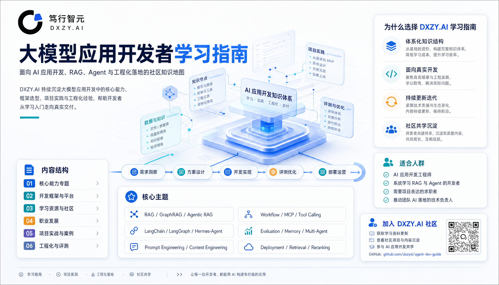
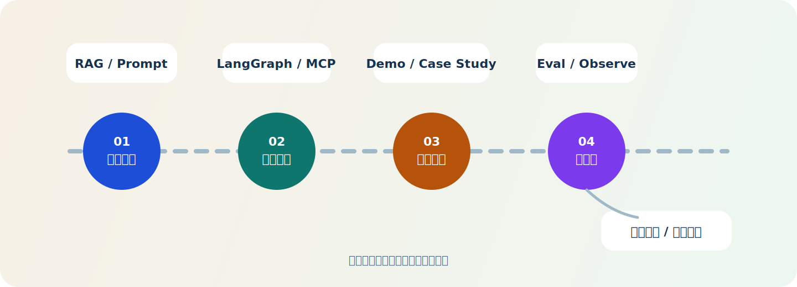

# 大模型应用开发者学习指南

这是笃行智元 `DXZY.AI` 社区面向大模型应用开发者持续建设的一份学习指南仓库。

我们希望它不只是“资料收集目录”，而是一个围绕 `AI 应用开发`、`企业级 RAG`、`Agentic AI`、`工程化落地` 和 `项目交付` 逐步沉淀的方法库、资料索引和共学入口。

## 技术标签

## 社区入口

- [DXZY.AI GitHub 社区主页](https://github.com/dxzyai/agent-dev-guide)
- [DXZY.AI 官网](https://dxzy.ai)
- [DXZY.AI 课程体系](https://dxzy.ai/course)

## 社区介绍

笃行智元是一个专注于 AI 大模型应用研发、企业级项目实践与人才培养的产研型社区。我们关注的不是“会不会调用模型”这一层，而是从需求理解、系统设计、工程实现、评估迭代到项目表达的完整能力链路。

这个仓库在社区内容体系中主要承担三类角色：

- 学习地图：帮助开发者建立大模型应用开发的知识结构，而不是零散追热点
- 资料索引：围绕 RAG、Agent、MCP、模型部署、项目交付持续整理可复用资料
- 共学沉淀：把项目实践、踩坑记录、架构选择和能力路径沉淀成长期可维护的文档

## 我们重点关注什么

| 方向 | 重点能力 |
| --- | --- |
| AI 应用开发 | Prompt Engineering、API 调用、上下文管理、工作流设计 |
| 企业级 RAG | 混合检索、重排序、GraphRAG、Agentic RAG、评估与溯源 |
| Agentic AI | LangGraph 工作流、MCP 工具接入、多 Agent 状态管理 |
| 工程化落地 | 观测、治理、异常恢复、部署、成本与安全 |
| 项目交付 | 需求拆解、架构设计、工程实现、评估复盘、作品表达 |

## 这个仓库适合谁

- 正在从后端、前端、数据、算法转向 AI 应用开发的工程师
- 想系统补齐 RAG、Agent、模型部署与工程化能力的学习者
- 希望把项目经历整理成作品集、简历和面试表达材料的求职者
- 希望推动团队理解并落地 AI 应用的技术负责人或企业团队

## 学习路径

建议按下面顺序使用这个仓库：

1. 先建立 `核心能力` 认知，理解 RAG、上下文、工作流、评测等基础主题
2. 再进入 `开发框架与平台`，结合 LangChain、LangGraph、Hermes-Agent 理解工程实现
3. 再配合 `项目实战与案例` 与 `工程化与评测` 完成从 Demo 到生产可用系统的迁移
4. 最后用 `学习资源与社区`、`职业发展` 补齐信息源、项目表达和求职准备

## 仓库定位

这个仓库定位为面向大模型应用开发者的长期学习指南，覆盖从能力基础、框架选型、RAG 与 Agent 架构，到工程化实践、学习资源和职业发展。

当前目录结构按“学习主题”组织，而不是按单一框架、单次课程或临时专题组织。这样做的目的是保证后续持续补充内容时，分类仍然稳定、可扩展、可导航。

## 目录结构

### `01-核心能力专题`

- `RAG`
- `Agent`
- `工具调用与MCP`
- 后续可扩展：Prompt Engineering、上下文工程、多模态、记忆、工作流设计、评测与对齐

### `02-开发框架与平台`

- `Hermes-Agent`
- `LangChain`
- `LangGraph`
- 后续可扩展：LlamaIndex、AutoGen、OpenAI Agents SDK、Dify、Coze、Flowise 等

### `03-学习资源与社区`

- `课程与社区`
- 后续可扩展：开源项目、官方文档导读、资讯订阅、论文精读

### `04-职业发展`

- `面试与求职`
- 后续可扩展：岗位路线、简历作品集、职业能力模型

### `05-项目实战与案例`

- 预留给端到端项目拆解、行业方案、Demo 与案例复盘

### `06-工程化与评测`

- 预留给评测体系、可观测性、部署、成本控制、安全治理、数据闭环

## 仓库导读

- 仓库导读、学习路径、能力地图、术语索引统一维护在当前 `README`
- 不再单独拆分“导读与路线”目录，避免顶层出现仅承载说明性的空分类

## 当前内容导航

### 核心能力专题

#### RAG

- [01-RAG技术体系全景](./01-%E6%A0%B8%E5%BF%83%E8%83%BD%E5%8A%9B%E4%B8%93%E9%A2%98/RAG/01-RAG%E6%8A%80%E6%9C%AF%E4%BD%93%E7%B3%BB%E5%85%A8%E6%99%AF.md)
- [02-多模态RAG快速搭建](./01-%E6%A0%B8%E5%BF%83%E8%83%BD%E5%8A%9B%E4%B8%93%E9%A2%98/RAG/02-%E5%A4%9A%E6%A8%A1%E6%80%81RAG%E5%BF%AB%E9%80%9F%E6%90%AD%E5%BB%BA.md)
- [03-多模态RAG进阶：olmOCR与MinerU](./01-%E6%A0%B8%E5%BF%83%E8%83%BD%E5%8A%9B%E4%B8%93%E9%A2%98/RAG/03-%E5%A4%9A%E6%A8%A1%E6%80%81RAG%E8%BF%9B%E9%98%B6%EF%BC%9AolmOCR%E4%B8%8EMinerU.md)
- [04-GraphRAG原理与入门](./01-%E6%A0%B8%E5%BF%83%E8%83%BD%E5%8A%9B%E4%B8%93%E9%A2%98/RAG/04-GraphRAG%E5%8E%9F%E7%90%86%E4%B8%8E%E5%85%A5%E9%97%A8.md)
- [05-GraphRAG部署与调用](./01-%E6%A0%B8%E5%BF%83%E8%83%BD%E5%8A%9B%E4%B8%93%E9%A2%98/RAG/05-GraphRAG%E9%83%A8%E7%BD%B2%E4%B8%8E%E8%B0%83%E7%94%A8.md)
- [06-Agentic RAG架构与应用入门](./01-%E6%A0%B8%E5%BF%83%E8%83%BD%E5%8A%9B%E4%B8%93%E9%A2%98/RAG/06-Agentic%20RAG%E6%9E%B6%E6%9E%84%E4%B8%8E%E5%BA%94%E7%94%A8%E5%85%A5%E9%97%A8.md)
- [07-LlamaIndex RAG进阶检索策略](./01-%E6%A0%B8%E5%BF%83%E8%83%BD%E5%8A%9B%E4%B8%93%E9%A2%98/RAG/07-LlamaIndex%20RAG%E8%BF%9B%E9%98%B6%E6%A3%80%E7%B4%A2%E7%AD%96%E7%95%A5.md)
- [08-RAG常见痛点与解决方案](./01-%E6%A0%B8%E5%BF%83%E8%83%BD%E5%8A%9B%E4%B8%93%E9%A2%98/RAG/08-RAG%E5%B8%B8%E8%A7%81%E7%97%9B%E7%82%B9%E4%B8%8E%E8%A7%A3%E5%86%B3%E6%96%B9%E6%A1%88.md)
- [09-RAG检索实战](./01-%E6%A0%B8%E5%BF%83%E8%83%BD%E5%8A%9B%E4%B8%93%E9%A2%98/RAG/09-RAG%E6%A3%80%E7%B4%A2%E5%AE%9E%E6%88%98.md)
- [10-RAG 分块策略深度解析：5 种方案的原理、对比与选型实战](./01-%E6%A0%B8%E5%BF%83%E8%83%BD%E5%8A%9B%E4%B8%93%E9%A2%98/RAG/10-RAG%20%E5%88%86%E5%9D%97%E7%AD%96%E7%95%A5%E6%B7%B1%E5%BA%A6%E8%A7%A3%E6%9E%90%EF%BC%9A5%20%E7%A7%8D%E6%96%B9%E6%A1%88%E7%9A%84%E5%8E%9F%E7%90%86%E3%80%81%E5%AF%B9%E6%AF%94%E4%B8%8E%E9%80%89%E5%9E%8B%E5%AE%9E%E6%88%98.md)
- [11-RAG检索进阶-Cross-Encoder重排序](./01-%E6%A0%B8%E5%BF%83%E8%83%BD%E5%8A%9B%E4%B8%93%E9%A2%98/RAG/11-RAG%E6%A3%80%E7%B4%A2%E8%BF%9B%E9%98%B6-Cross-Encoder%E9%87%8D%E6%8E%92%E5%BA%8F.md)
- [12-生产环境降幻觉四层防护体系](./01-%E6%A0%B8%E5%BF%83%E8%83%BD%E5%8A%9B%E4%B8%93%E9%A2%98/RAG/12-%E7%94%9F%E4%BA%A7%E7%8E%AF%E5%A2%83%E9%99%8D%E5%B9%BB%E8%A7%89%E5%9B%9B%E5%B1%82%E9%98%B2%E6%8A%A4%E4%BD%93%E7%B3%BB.md)

#### Agent

- [01-2026年Agent架构选型：8种模式的组合与取舍](./01-%E6%A0%B8%E5%BF%83%E8%83%BD%E5%8A%9B%E4%B8%93%E9%A2%98/Agent/01-2026%E5%B9%B4Agent%E6%9E%B6%E6%9E%84%E9%80%89%E5%9E%8B-8%E7%A7%8D%E6%A8%A1%E5%BC%8F%E7%9A%84%E7%BB%84%E5%90%88%E4%B8%8E%E5%8F%96%E8%88%8D.md)

#### 工具调用与MCP

- [01-Function Calling与MCP：Agent工具调用从原理到实战](./01-%E6%A0%B8%E5%BF%83%E8%83%BD%E5%8A%9B%E4%B8%93%E9%A2%98/%E5%B7%A5%E5%85%B7%E8%B0%83%E7%94%A8%E4%B8%8EMCP/01-Function-Calling%E4%B8%8EMCP-Agent%E5%B7%A5%E5%85%B7%E8%B0%83%E7%94%A8%E4%BB%8E%E5%8E%9F%E7%90%86%E5%88%B0%E5%AE%9E%E6%88%98.md)
#### Skill

- [Agent-Skills 基础入门](./01-%E6%A0%B8%E5%BF%83%E8%83%BD%E5%8A%9B%E4%B8%93%E9%A2%98/Skill/Agent-Skills%20%E5%9F%BA%E7%A1%80%E5%85%A5%E9%97%A8.md)
- [Agent-Skills 工程实战](./01-%E6%A0%B8%E5%BF%83%E8%83%BD%E5%8A%9B%E4%B8%93%E9%A2%98/Skill/Agent-Skills%20%E5%B7%A5%E7%A8%8B%E5%AE%9E%E6%88%98.md)

#### Harness Engineering

- [01-Harness基础概念与核心架构](./01-%E6%A0%B8%E5%BF%83%E8%83%BD%E5%8A%9B%E4%B8%93%E9%A2%98/Harness%20Engineering/01-Harness%E5%9F%BA%E7%A1%80%E6%A6%82%E5%BF%B5%E4%B8%8E%E6%A0%B8%E5%BF%83%E6%9E%B6%E6%9E%84.md)
- [02-Harness四大支柱详解](./01-%E6%A0%B8%E5%BF%83%E8%83%BD%E5%8A%9B%E4%B8%93%E9%A2%98/Harness%20Engineering/02-Harness%E5%9B%9B%E5%A4%A7%E6%94%AF%E6%9F%B1%E8%AF%A6%E8%A7%A3.md)
- [03-Harness行业案例与平台对比](./01-%E6%A0%B8%E5%BF%83%E8%83%BD%E5%8A%9B%E4%B8%93%E9%A2%98/Harness%20Engineering/03-Harness%E8%A1%8C%E4%B8%9A%E6%A1%88%E4%BE%8B%E4%B8%8E%E5%B9%B3%E5%8F%B0%E5%AF%B9%E6%AF%94.md)

### 开发框架与平台

#### Hermes Agent

- [01-Hermes Agent完整指南](./02-%E5%BC%80%E5%8F%91%E6%A1%86%E6%9E%B6%E4%B8%8E%E5%B9%B3%E5%8F%B0/Hermes-Agent/01-Hermes%20Agent%E5%AE%8C%E6%95%B4%E6%8C%87%E5%8D%97.md)
- [02-Hermes Agent安装与部署](./02-%E5%BC%80%E5%8F%91%E6%A1%86%E6%9E%B6%E4%B8%8E%E5%B9%B3%E5%8F%B0/Hermes-Agent/02-Hermes%20Agent%E5%AE%89%E8%A3%85%E4%B8%8E%E9%83%A8%E7%BD%B2.md)
- [03-Hermes Agent接入应用](./02-%E5%BC%80%E5%8F%91%E6%A1%86%E6%9E%B6%E4%B8%8E%E5%B9%B3%E5%8F%B0/Hermes-Agent/03-Hermes%20Agent%E6%8E%A5%E5%85%A5%E5%BA%94%E7%94%A8.md)
- [04-Hermes Agent工具与工具集](./02-%E5%BC%80%E5%8F%91%E6%A1%86%E6%9E%B6%E4%B8%8E%E5%B9%B3%E5%8F%B0/Hermes-Agent/04-Hermes%20Agent%E5%B7%A5%E5%85%B7%E4%B8%8E%E5%B7%A5%E5%85%B7%E9%9B%86.md)
- [05-Hermes Agent Skills](./02-%E5%BC%80%E5%8F%91%E6%A1%86%E6%9E%B6%E4%B8%8E%E5%B9%B3%E5%8F%B0/Hermes-Agent/05-Hermes%20Agent%20Skills.md)
- [06-Hermes Agent个性化定制](./02-%E5%BC%80%E5%8F%91%E6%A1%86%E6%9E%B6%E4%B8%8E%E5%B9%B3%E5%8F%B0/Hermes-Agent/06-Hermes%20Agent%E4%B8%AA%E6%80%A7%E5%8C%96%E5%AE%9A%E5%88%B6.md)
- [07-Hermes Agent持久记忆](./02-%E5%BC%80%E5%8F%91%E6%A1%86%E6%9E%B6%E4%B8%8E%E5%B9%B3%E5%8F%B0/Hermes-Agent/07-Hermes%20Agent%E6%8C%81%E4%B9%85%E8%AE%B0%E5%BF%86.md)
- [08-Hermes Agent MCP扩展AI工具能力](./02-%E5%BC%80%E5%8F%91%E6%A1%86%E6%9E%B6%E4%B8%8E%E5%B9%B3%E5%8F%B0/Hermes-Agent/08-Hermes%20Agent%20MCP%E6%89%A9%E5%B1%95AI%E5%B7%A5%E5%85%B7%E8%83%BD%E5%8A%9B.md)
- [09-Hermes Agent定时任务（Cron）](./02-%E5%BC%80%E5%8F%91%E6%A1%86%E6%9E%B6%E4%B8%8E%E5%B9%B3%E5%8F%B0/Hermes-Agent/09-Hermes%20Agent%E5%AE%9A%E6%97%B6%E4%BB%BB%E5%8A%A1%EF%BC%88Cron%EF%BC%89.md)

#### LangChain

- [01-LangChain介绍](./02-%E5%BC%80%E5%8F%91%E6%A1%86%E6%9E%B6%E4%B8%8E%E5%B9%B3%E5%8F%B0/LangChain/01-LangChain%E4%BB%8B%E7%BB%8D.md)
- [02-LangChain快速入门](./02-%E5%BC%80%E5%8F%91%E6%A1%86%E6%9E%B6%E4%B8%8E%E5%B9%B3%E5%8F%B0/LangChain/02-LangChain%E5%BF%AB%E9%80%9F%E5%85%A5%E9%97%A8.md)
- [03-LangChain工具使用指南](./02-%E5%BC%80%E5%8F%91%E6%A1%86%E6%9E%B6%E4%B8%8E%E5%B9%B3%E5%8F%B0/LangChain/03-LangChain%E5%B7%A5%E5%85%B7%E4%BD%BF%E7%94%A8%E6%8C%87%E5%8D%97.md)
- [04-MCP协议与LangChain实战](./02-%E5%BC%80%E5%8F%91%E6%A1%86%E6%9E%B6%E4%B8%8E%E5%B9%B3%E5%8F%B0/LangChain/04-MCP%E5%8D%8F%E8%AE%AE%E4%B8%8ELangChain%E5%AE%9E%E6%88%98.md)
- [05-LangChain会话记忆与状态管理](./02-%E5%BC%80%E5%8F%91%E6%A1%86%E6%9E%B6%E4%B8%8E%E5%B9%B3%E5%8F%B0/LangChain/05-LangChain%E4%BC%9A%E8%AF%9D%E8%AE%B0%E5%BF%86%E4%B8%8E%E7%8A%B6%E6%80%81%E7%AE%A1%E7%90%86.md)

#### LangGraph

- [01-LangGraph入门](./02-%E5%BC%80%E5%8F%91%E6%A1%86%E6%9E%B6%E4%B8%8E%E5%B9%B3%E5%8F%B0/LangGraph/01-LangGraph%E5%85%A5%E9%97%A8.md)
- [02-状态与节点边](./02-%E5%BC%80%E5%8F%91%E6%A1%86%E6%9E%B6%E4%B8%8E%E5%B9%B3%E5%8F%B0/LangGraph/02-%E7%8A%B6%E6%80%81%E4%B8%8E%E8%8A%82%E7%82%B9%E8%BE%B9.md)
- [03-持久化与人工干预](./02-%E5%BC%80%E5%8F%91%E6%A1%86%E6%9E%B6%E4%B8%8E%E5%B9%B3%E5%8F%B0/LangGraph/03-%E6%8C%81%E4%B9%85%E5%8C%96%E4%B8%8E%E4%BA%BA%E5%B7%A5%E5%B9%B2%E9%A2%84.md)
- [04-多Agent协作](./02-%E5%BC%80%E5%8F%91%E6%A1%86%E6%9E%B6%E4%B8%8E%E5%B9%B3%E5%8F%B0/LangGraph/04-%E5%A4%9AAgent%E5%8D%8F%E4%BD%9C.md)
- [05-计划执行模式](./02-%E5%BC%80%E5%8F%91%E6%A1%86%E6%9E%B6%E4%B8%8E%E5%B9%B3%E5%8F%B0/LangGraph/05-%E8%AE%A1%E5%88%92%E6%89%A7%E8%A1%8C%E6%A8%A1%E5%BC%8F.md)

### 学习资源与社区

- [课程与社区 / 01-大模型课程避坑指南](./03-%E5%AD%A6%E4%B9%A0%E8%B5%84%E6%BA%90%E4%B8%8E%E7%A4%BE%E5%8C%BA/%E8%AF%BE%E7%A8%8B%E4%B8%8E%E7%A4%BE%E5%8C%BA/01-%E5%A4%A7%E6%A8%A1%E5%9E%8B%E8%AF%BE%E7%A8%8B%E9%81%BF%E5%9D%91%E6%8C%87%E5%8D%97.md)

### 职业发展

- [面试与求职 / 01-大模型高频面试真题](./04-%E8%81%8C%E4%B8%9A%E5%8F%91%E5%B1%95/%E9%9D%A2%E8%AF%95%E4%B8%8E%E6%B1%82%E8%81%8C/01-%E5%A4%A7%E6%A8%A1%E5%9E%8B%E9%AB%98%E9%A2%91%E9%9D%A2%E8%AF%95%E7%9C%9F%E9%A2%98.md)
- [面试与求职 / 02-AI开发面试题100道](./04-%E8%81%8C%E4%B8%9A%E5%8F%91%E5%B1%95/%E9%9D%A2%E8%AF%95%E4%B8%8E%E6%B1%82%E8%81%8C/02-AI%E5%BC%80%E5%8F%91%E9%9D%A2%E8%AF%95%E9%A2%98100%E9%81%93.md)
- [面试与求职 / 03-大模型开发岗位JD拆解表](./04-%E8%81%8C%E4%B8%9A%E5%8F%91%E5%B1%95/%E9%9D%A2%E8%AF%95%E4%B8%8E%E6%B1%82%E8%81%8C/03-%E5%A4%A7%E6%A8%A1%E5%9E%8B%E5%BC%80%E5%8F%91%E5%B2%97%E4%BD%8DJD%E6%8B%86%E8%A7%A3%E8%A1%A8.md)

## 命名规则

- 一级目录使用 `序号-主题域`，保证阅读顺序和后续扩容空间
- 二级目录优先按“能力子域”或“框架/平台名”命名，不按临时活动或年份命名
- 文档文件名统一使用 `序号-主题标题.md`
- 同一专题内的“总览/索引”文档使用较小序号，如 `00-` 或 `01-`
- 图片等资源放在所属专题目录下的 `images/` 中，避免全仓库共享资源目录

## 后续扩展建议

- 新增内容时，优先判断它属于“核心能力”“框架平台”“工程化评测”还是“项目案例”
- 如果一个主题未来会持续增长，先建子目录，再往里补系列文章
- 尽量避免再次出现“技术主题”和“资源类型”混放在同一层级的问题

## 社区共建方向

我们会继续围绕以下几类内容持续补充：

- AI 应用开发学习路线图
- RAG / Agent / MCP 工程模板
- 企业级项目复盘文档
- 模型微调与部署实验记录
- 面向求职作品集的项目表达模板
- 中文 AI 工程化资料索引

如果你也在构建 AI 应用、复盘项目、学习 RAG / Agent / 模型部署，欢迎关注 [DXZY.AI GitHub 社区主页](https://github.com/dxzyai/agent-dev-guide)。
